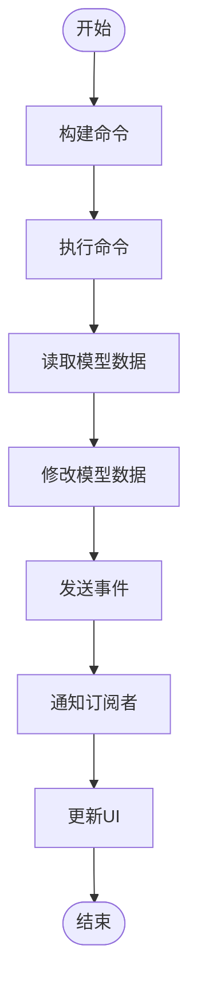

# 设计原则

<cite>
**本文引用的文件**
- [GFramework.Core/architecture/Architecture.cs](file://GFramework.Core/architecture/Architecture.cs)
- [GFramework.Core/system/AbstractSystem.cs](file://GFramework.Core/system/AbstractSystem.cs)
- [GFramework.Core/command/AbstractCommand.cs](file://GFramework.Core/command/AbstractCommand.cs)
- [GFramework.Core/query/AbstractQuery.cs](file://GFramework.Core/query/AbstractQuery.cs)
- [GFramework.Core/model/AbstractModel.cs](file://GFramework.Core/model/AbstractModel.cs)
- [GFramework.Core/property/BindableProperty.cs](file://GFramework.Core/property/BindableProperty.cs)
- [GFramework.Core/events/EasyEvent.cs](file://GFramework.Core/events/EasyEvent.cs)
- [GFramework.Core/ioc/IocContainer.cs](file://GFramework.Core/ioc/IocContainer.cs)
- [GFramework.Core/state/StateMachine.cs](file://GFramework.Core/state/StateMachine.cs)
- [GFramework.Core.Abstractions/controller/IController.cs](file://GFramework.Core.Abstractions/controller/IController.cs)
- [GFramework.Core.Abstractions/system/ISystem.cs](file://GFramework.Core.Abstractions/system/ISystem.cs)
- [GFramework.Core.Abstractions/model/IModel.cs](file://GFramework.Core.Abstractions/model/IModel.cs)
- [GFramework.Core.Abstractions/command/ICommand.cs](file://GFramework.Core.Abstractions/command/ICommand.cs)
- [GFramework.Core.Abstractions/query/IQuery.cs](file://GFramework.Core.Abstractions/query/IQuery.cs)
- [GFramework.Core/README.md](file://GFramework.Core/README.md)
</cite>

## 目录
1. [简介](#简介)
2. [项目结构](#项目结构)
3. [核心组件](#核心组件)
4. [架构总览](#架构总览)
5. [详细组件分析](#详细组件分析)
6. [依赖分析](#依赖分析)
7. [性能考虑](#性能考虑)
8. [故障排查指南](#故障排查指南)
9. [结论](#结论)
10. [附录](#附录)

## 简介
本文件面向GFramework的设计原则最佳实践，围绕单一职责原则（SRP）、开闭原则（OCP）、里氏替换原则（LSP）、接口隔离原则（ISP）与依赖倒置原则（DIP）展开，结合框架中的架构、系统、命令、查询、模型、事件、属性绑定与IoC容器等模块，给出在游戏开发中的落地方法与反例警示。文档同时提供PlayerController与CombatSystem等典型组件的实践路径，帮助读者在GFramework中正确实现这些设计原则。

## 项目结构
GFramework采用“分层+横切关注点”的架构组织方式：
- 分层：Model（数据）、System（业务逻辑）、Controller（控制）、Utility（工具）
- 横切：Command/Query/Event贯穿各层，形成清晰的读写分离与事件驱动通信
- 生命周期：Architecture集中管理组件注册、初始化、销毁与阶段转换

图表来源
- [GFramework.Core/architecture/Architecture.cs](file://GFramework.Core/architecture/Architecture.cs#L1-L569)
- [GFramework.Core/ioc/IocContainer.cs](file://GFramework.Core/ioc/IocContainer.cs#L1-L373)
- [GFramework.Core/model/AbstractModel.cs](file://GFramework.Core/model/AbstractModel.cs#L1-L34)
- [GFramework.Core/system/AbstractSystem.cs](file://GFramework.Core/system/AbstractSystem.cs#L1-L62)
- [GFramework.Core/command/AbstractCommand.cs](file://GFramework.Core/command/AbstractCommand.cs#L1-L53)
- [GFramework.Core/query/AbstractQuery.cs](file://GFramework.Core/query/AbstractQuery.cs#L1-L29)
- [GFramework.Core/events/EasyEvent.cs](file://GFramework.Core/events/EasyEvent.cs#L1-L39)
- [GFramework.Core/property/BindableProperty.cs](file://GFramework.Core/property/BindableProperty.cs#L1-L135)
- [GFramework.Core.Abstractions/controller/IController.cs](file://GFramework.Core.Abstractions/controller/IController.cs#L1-L10)

章节来源
- [GFramework.Core/README.md](file://GFramework.Core/README.md#L40-L108)

## 核心组件
- Architecture：集中管理组件注册、生命周期与阶段转换，体现统一调度与阶段式管理
- AbstractSystem：系统基类，提供初始化/销毁与架构阶段事件处理
- AbstractModel：模型基类，实现初始化与架构阶段事件处理
- AbstractCommand/AbstractQuery：命令/查询基类，提供执行入口与上下文感知
- IocContainer：线程安全的IoC容器，支持注册、获取、冻结与批量接口注册
- BindableProperty：可绑定属性，提供值变更事件与比较器定制
- EasyEvent：简单事件系统，支持注册/注销与触发
- StateMachine：状态机，支持状态注册、切换、历史记录与拒绝回调

章节来源
- [GFramework.Core/architecture/Architecture.cs](file://GFramework.Core/architecture/Architecture.cs#L1-L569)
- [GFramework.Core/system/AbstractSystem.cs](file://GFramework.Core/system/AbstractSystem.cs#L1-L62)
- [GFramework.Core/model/AbstractModel.cs](file://GFramework.Core/model/AbstractModel.cs#L1-L34)
- [GFramework.Core/command/AbstractCommand.cs](file://GFramework.Core/command/AbstractCommand.cs#L1-L53)
- [GFramework.Core/query/AbstractQuery.cs](file://GFramework.Core/query/AbstractQuery.cs#L1-L29)
- [GFramework.Core/ioc/IocContainer.cs](file://GFramework.Core/ioc/IocContainer.cs#L1-L373)
- [GFramework.Core/property/BindableProperty.cs](file://GFramework.Core/property/BindableProperty.cs#L1-L135)
- [GFramework.Core/events/EasyEvent.cs](file://GFramework.Core/events/EasyEvent.cs#L1-L39)
- [GFramework.Core/state/StateMachine.cs](file://GFramework.Core/state/StateMachine.cs#L1-L276)

## 架构总览
下图展示了命令执行、事件传播与数据绑定在GFramework中的典型流程，体现横切关注点与分层协作：

图表来源
- [GFramework.Core/command/AbstractCommand.cs](file://GFramework.Core/command/AbstractCommand.cs#L1-L53)
- [GFramework.Core/system/AbstractSystem.cs](file://GFramework.Core/system/AbstractSystem.cs#L1-L62)
- [GFramework.Core/model/AbstractModel.cs](file://GFramework.Core/model/AbstractModel.cs#L1-L34)
- [GFramework.Core/events/EasyEvent.cs](file://GFramework.Core/events/EasyEvent.cs#L1-L39)
- [GFramework.Core/property/BindableProperty.cs](file://GFramework.Core/property/BindableProperty.cs#L1-L135)

## 详细组件分析

### 单一职责原则（SRP）
- 核心理念：一个类只负责一项职责，变更理由唯一
- 在GFramework中的体现：
  - AbstractModel：仅负责数据与状态，不包含业务逻辑
  - AbstractSystem：仅负责业务逻辑与事件处理，不直接操作UI
  - AbstractCommand/AbstractQuery：分别封装写操作与读操作，职责清晰
  - Architecture：集中管理生命周期与阶段，不承担业务逻辑
  - IocContainer：专注对象注册与获取，不参与业务
- 违反SRP的常见问题：
  - Model中混入业务逻辑导致难以测试与复用
  - System中夹杂UI更新逻辑导致耦合度高
  - Command中包含多个不相关职责导致难以维护

章节来源
- [GFramework.Core/model/AbstractModel.cs](file://GFramework.Core/model/AbstractModel.cs#L1-L34)
- [GFramework.Core/system/AbstractSystem.cs](file://GFramework.Core/system/AbstractSystem.cs#L1-L62)
- [GFramework.Core/command/AbstractCommand.cs](file://GFramework.Core/command/AbstractCommand.cs#L1-L53)
- [GFramework.Core/query/AbstractQuery.cs](file://GFramework.Core/query/AbstractQuery.cs#L1-L29)
- [GFramework.Core/architecture/Architecture.cs](file://GFramework.Core/architecture/Architecture.cs#L1-L569)
- [GFramework.Core/ioc/IocContainer.cs](file://GFramework.Core/ioc/IocContainer.cs#L1-L373)
- [GFramework.Core/README.md](file://GFramework.Core/README.md#L448-L456)

### 开闭原则（OCP）
- 核心理念：对扩展开放，对修改关闭
- 在GFramework中的体现：
  - 通过事件系统扩展新功能，无需修改既有System
  - 新增System只需订阅现有事件，插入自身逻辑
  - 通过接口组合而非继承扩展能力
- 违反OCP的常见问题：
  - 在既有System中硬编码新分支逻辑
  - 直接修改已有事件结构导致兼容性问题
  - 通过继承扩展而非接口组合导致类爆炸

章节来源
- [GFramework.Core/README.md](file://GFramework.Core/README.md#L457-L461)
- [GFramework.Core/events/EasyEvent.cs](file://GFramework.Core/events/EasyEvent.cs#L1-L39)
- [GFramework.Core/system/AbstractSystem.cs](file://GFramework.Core/system/AbstractSystem.cs#L1-L62)

### 里氏替换原则（LSP）
- 核心理念：子类可以替换父类而不影响程序正确性
- 在GFramework中的体现：
  - AbstractSystem/AbstractModel等抽象基类提供稳定的虚方法与生命周期钩子
  - 子类仅覆盖必要方法（如OnInit/OnExecute），不影响外部调用契约
  - 通过接口（如ISystem、IModel）保证可替换性
- 违反LSP的常见问题：
  - 子类覆盖方法改变了外部预期的行为（如破坏初始化顺序）
  - 子类抛出父类未声明的异常导致调用方崩溃

章节来源
- [GFramework.Core/system/AbstractSystem.cs](file://GFramework.Core/system/AbstractSystem.cs#L1-L62)
- [GFramework.Core/model/AbstractModel.cs](file://GFramework.Core/model/AbstractModel.cs#L1-L34)
- [GFramework.Core/command/AbstractCommand.cs](file://GFramework.Core/command/AbstractCommand.cs#L1-L53)
- [GFramework.Core/query/AbstractQuery.cs](file://GFramework.Core/query/AbstractQuery.cs#L1-L29)
- [GFramework.Core.Abstractions/system/ISystem.cs](file://GFramework.Core.Abstractions/system/ISystem.cs#L1-L11)
- [GFramework.Core.Abstractions/model/IModel.cs](file://GFramework.Core.Abstractions/model/IModel.cs#L1-L10)

### 接口隔离原则（ISP）
- 核心理念：客户端不应依赖不需要的接口
- 在GFramework中的体现：
  - 小而专注的接口组合（如ICanGetModel、ICanSendCommand、ICanRegisterEvent）
  - IController通过组合上述能力接口，避免“胖接口”
  - Command/Query/Event均以最小接口暴露所需能力
- 违反ISP的常见问题：
  - 一个接口承载过多职责导致实现类负担过重
  - 为满足某功能而被迫实现不相关的接口

章节来源
- [GFramework.Core/README.md](file://GFramework.Core/README.md#L468-L481)
- [GFramework.Core.Abstractions/controller/IController.cs](file://GFramework.Core.Abstractions/controller/IController.cs#L1-L10)
- [GFramework.Core.Abstractions/command/ICommand.cs](file://GFramework.Core.Abstractions/command/ICommand.cs#L1-L31)
- [GFramework.Core.Abstractions/query/IQuery.cs](file://GFramework.Core.Abstractions/query/IQuery.cs#L1-L16)

### 依赖倒置原则（DIP）
- 核心理念：高层模块不应依赖低层模块，二者都应依赖抽象；抽象不应依赖细节；细节应依赖抽象
- 在GFramework中的体现：
  - 所有组件通过接口交互（ISystem、IModel、ICommand等）
  - 通过IocContainer注入依赖，降低耦合
  - Architecture作为高层调度器，依赖抽象而非具体实现
- 违反DIP的常见问题：
  - 直接new底层实现，导致高层模块紧耦合
  - 通过具体类型强耦合，难以替换实现或编写测试

章节来源
- [GFramework.Core/README.md](file://GFramework.Core/README.md#L462-L467)
- [GFramework.Core/ioc/IocContainer.cs](file://GFramework.Core/ioc/IocContainer.cs#L1-L373)
- [GFramework.Core/architecture/Architecture.cs](file://GFramework.Core/architecture/Architecture.cs#L1-L569)

## 依赖分析
GFramework通过Architecture集中管理组件生命周期，IocContainer提供依赖注入，事件与属性绑定实现松耦合通信。

图表来源
- [GFramework.Core/architecture/Architecture.cs](file://GFramework.Core/architecture/Architecture.cs#L1-L569)
- [GFramework.Core/ioc/IocContainer.cs](file://GFramework.Core/ioc/IocContainer.cs#L1-L373)
- [GFramework.Core/events/EasyEvent.cs](file://GFramework.Core/events/EasyEvent.cs#L1-L39)
- [GFramework.Core/property/BindableProperty.cs](file://GFramework.Core/property/BindableProperty.cs#L1-L135)

章节来源
- [GFramework.Core/architecture/Architecture.cs](file://GFramework.Core/architecture/Architecture.cs#L1-L569)
- [GFramework.Core/ioc/IocContainer.cs](file://GFramework.Core/ioc/IocContainer.cs#L1-L373)

## 性能考虑
- 组件初始化顺序与阶段：Architecture按Utility/Model/System三阶段有序初始化，减少跨层依赖引发的初始化失败
- 线程安全与冻结：IocContainer在初始化完成后冻结，避免并发注册导致的竞态
- 事件与属性绑定：事件与属性变更均采用轻量回调，注意避免在高频帧中频繁注册/注销
- 状态机历史：限制最大历史长度，避免内存膨胀

章节来源
- [GFramework.Core/architecture/Architecture.cs](file://GFramework.Core/architecture/Architecture.cs#L264-L330)
- [GFramework.Core/ioc/IocContainer.cs](file://GFramework.Core/ioc/IocContainer.cs#L357-L370)
- [GFramework.Core/state/StateMachine.cs](file://GFramework.Core/state/StateMachine.cs#L230-L241)

## 故障排查指南
- 初始化失败：Architecture在初始化异常时进入FailedInitialization阶段并发送事件，检查Init()中注册顺序与依赖
- 注销遗漏：事件与属性绑定需及时注销，避免内存泄漏与逻辑错误
- 阶段转换非法：严格阶段验证（可配置）下，非法转换会抛出异常，检查阶段转换合法性
- 容器冻结：冻结后禁止注册，确保在Ready前完成所有注册

章节来源
- [GFramework.Core/architecture/Architecture.cs](file://GFramework.Core/architecture/Architecture.cs#L142-L183)
- [GFramework.Core/architecture/Architecture.cs](file://GFramework.Core/architecture/Architecture.cs#L511-L524)
- [GFramework.Core/ioc/IocContainer.cs](file://GFramework.Core/ioc/IocContainer.cs#L357-L370)

## 结论
GFramework通过清晰的分层、接口隔离与依赖倒置，有效支撑了SRP、OCP、LSP、ISP与DIP五大设计原则。在实际游戏中，建议：
- 将业务逻辑放入System，数据放入Model，控制与UI分离
- 通过事件与命令/查询扩展功能，避免修改既有实现
- 使用接口组合而非继承扩展能力
- 通过Architecture与IocContainer集中管理生命周期与依赖

## 附录

### 典型组件实践：PlayerController
- 职责：协调UI与业务，监听模型变化并更新界面
- 实践要点：
  - 通过依赖注入获取IArchitecture，避免直接new
  - 使用BindableProperty.RegisterWithInitValue进行数据绑定
  - 使用UnRegisterList统一管理注销，避免内存泄漏

章节来源
- [GFramework.Core/README.md](file://GFramework.Core/README.md#L228-L267)
- [GFramework.Core/property/BindableProperty.cs](file://GFramework.Core/property/BindableProperty.cs#L83-L87)
- [GFramework.Core.Abstractions/controller/IController.cs](file://GFramework.Core.Abstractions/controller/IController.cs#L1-L10)

### 典型组件实践：CombatSystem
- 职责：处理战斗相关业务逻辑，响应攻击事件并更新玩家状态
- 实践要点：
  - 通过事件驱动响应AttackEvent等，避免紧耦合
  - 使用GetModel<T>()读取数据，避免直接访问UI
  - 通过SendEvent通知其他组件（如UI更新）

章节来源
- [GFramework.Core/README.md](file://GFramework.Core/README.md#L196-L227)
- [GFramework.Core/system/AbstractSystem.cs](file://GFramework.Core/system/AbstractSystem.cs#L1-L62)

### 设计原则应用流程图（命令执行）

图表来源
- [GFramework.Core/command/AbstractCommand.cs](file://GFramework.Core/command/AbstractCommand.cs#L1-L53)
- [GFramework.Core/system/AbstractSystem.cs](file://GFramework.Core/system/AbstractSystem.cs#L1-L62)
- [GFramework.Core/events/EasyEvent.cs](file://GFramework.Core/events/EasyEvent.cs#L1-L39)
- [GFramework.Core/property/BindableProperty.cs](file://GFramework.Core/property/BindableProperty.cs#L1-L135)