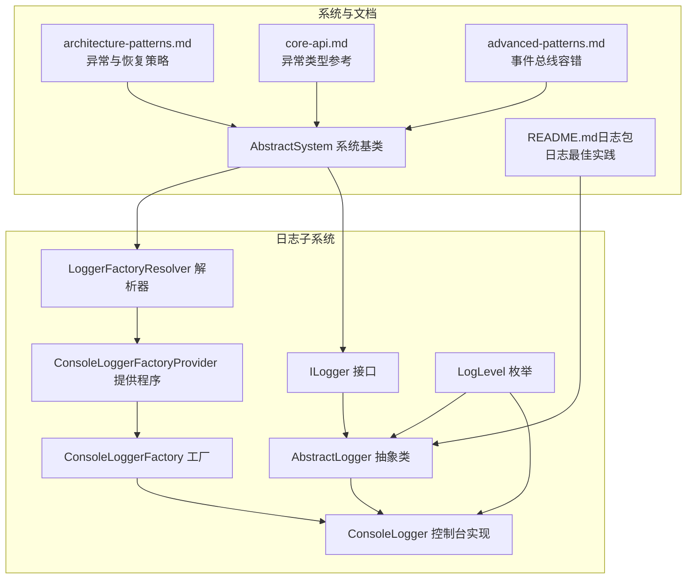
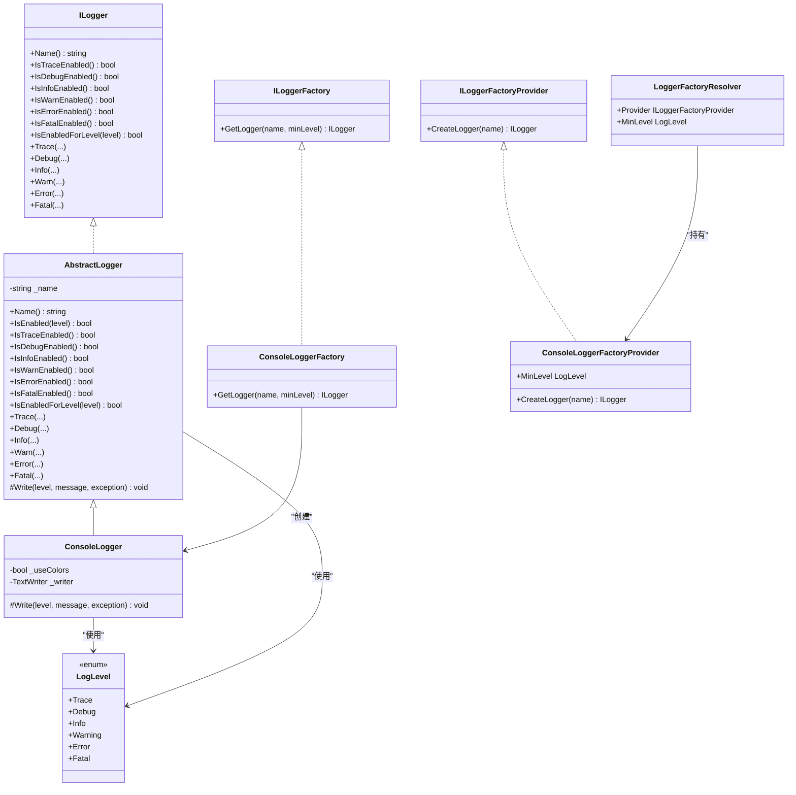
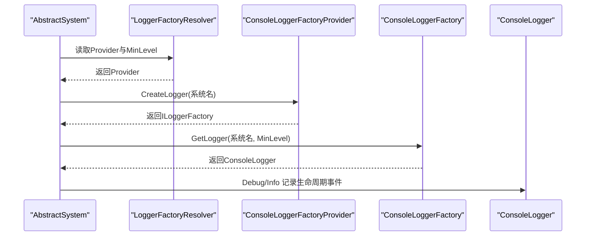
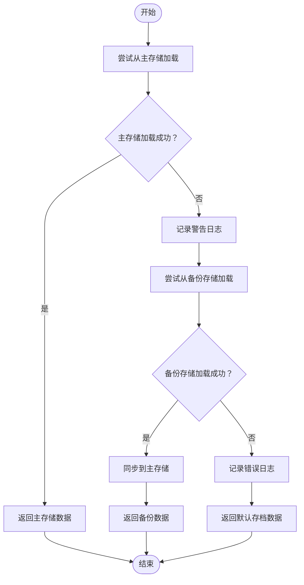
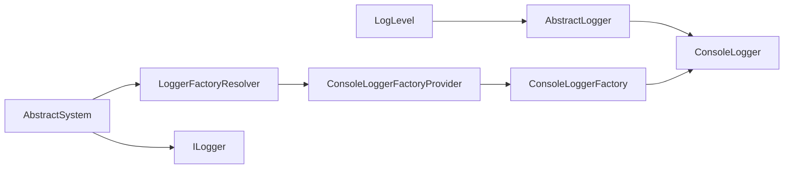

# 错误处理与调试

<cite>
**本文引用的文件**   
- [AbstractLogger.cs](file://GFramework.Core/logging/AbstractLogger.cs)
- [ConsoleLogger.cs](file://GFramework.Core/logging/ConsoleLogger.cs)
- [ConsoleLoggerFactory.cs](file://GFramework.Core/logging/ConsoleLoggerFactory.cs)
- [ILogger.cs](file://GFramework.Core.Abstractions/logging/ILogger.cs)
- [LogLevel.cs](file://GFramework.Core.Abstractions/logging/LogLevel.cs)
- [LoggerFactoryResolver.cs](file://GFramework.Core/logging/LoggerFactoryResolver.cs)
- [ConsoleLoggerFactoryProvider.cs](file://GFramework.Core/logging/ConsoleLoggerFactoryProvider.cs)
- [AbstractSystem.cs](file://GFramework.Core/system/AbstractSystem.cs)
- [architecture-patterns.md](file://docs/best-practices/architecture-patterns.md)
- [README.md（日志包）](file://GFramework.Core/logging/README.md)
- [core-api.md](file://docs/api-reference/core-api.md)
- [advanced-patterns.md](file://docs/tutorials/advanced-patterns.md)
</cite>

## 目录
1. [简介](#简介)
2. [项目结构](#项目结构)
3. [核心组件](#核心组件)
4. [架构概览](#架构概览)
5. [详细组件分析](#详细组件分析)
6. [依赖关系分析](#依赖关系分析)
7. [性能考量](#性能考量)
8. [故障排查指南](#故障排查指南)
9. [结论](#结论)
10. [附录](#附录)

## 简介
本文件面向GFramework使用者与维护者，系统化地总结错误处理与调试的最佳实践，覆盖异常类型设计、异常信息记录、异常恢复策略；日志规范（级别、结构化、性能）；调试技巧（断点、条件断点、性能分析）；以及错误监控与告警（统计、上报、恢复）。内容既包含代码级实现细节，也提供可直接落地的操作建议。

## 项目结构
围绕“错误处理与调试”，本仓库的关键位置如下：
- 日志基础设施：抽象日志器、控制台日志器、工厂与解析器
- 系统基类：在系统生命周期中注入日志能力
- 文档与范式：异常处理策略、错误恢复、事件总线容错、API参考中的异常类型

**图示来源**
- [ILogger.cs](file://GFramework.Core.Abstractions/logging/ILogger.cs#L1-L314)
- [AbstractLogger.cs](file://GFramework.Core/logging/AbstractLogger.cs#L1-L493)
- [ConsoleLogger.cs](file://GFramework.Core/logging/ConsoleLogger.cs#L1-L81)
- [ConsoleLoggerFactory.cs](file://GFramework.Core/logging/ConsoleLoggerFactory.cs#L1-L20)
- [ConsoleLoggerFactoryProvider.cs](file://GFramework.Core/logging/ConsoleLoggerFactoryProvider.cs#L1-L24)
- [LoggerFactoryResolver.cs](file://GFramework.Core/logging/LoggerFactoryResolver.cs#L1-L26)
- [LogLevel.cs](file://GFramework.Core.Abstractions/logging/LogLevel.cs#L1-L37)
- [AbstractSystem.cs](file://GFramework.Core/system/AbstractSystem.cs#L1-L62)
- [architecture-patterns.md](file://docs/best-practices/architecture-patterns.md#L833-L1036)
- [README.md（日志包）](file://GFramework.Core/logging/README.md#L1-L364)
- [core-api.md](file://docs/api-reference/core-api.md#L1058-L1092)
- [advanced-patterns.md](file://docs/tutorials/advanced-patterns.md#L692-L882)

**章节来源**
- [AbstractLogger.cs](file://GFramework.Core/logging/AbstractLogger.cs#L1-L493)
- [ConsoleLogger.cs](file://GFramework.Core/logging/ConsoleLogger.cs#L1-L81)
- [ConsoleLoggerFactory.cs](file://GFramework.Core/logging/ConsoleLoggerFactory.cs#L1-L20)
- [ILogger.cs](file://GFramework.Core.Abstractions/logging/ILogger.cs#L1-L314)
- [LogLevel.cs](file://GFramework.Core.Abstractions/logging/LogLevel.cs#L1-L37)
- [LoggerFactoryResolver.cs](file://GFramework.Core.logging/LoggerFactoryResolver.cs#L1-L26)
- [ConsoleLoggerFactoryProvider.cs](file://GFramework.Core.logging/ConsoleLoggerFactoryProvider.cs#L1-L24)
- [AbstractSystem.cs](file://GFramework.Core/system/AbstractSystem.cs#L1-L62)
- [architecture-patterns.md](file://docs/best-practices/architecture-patterns.md#L833-L1036)
- [README.md（日志包）](file://GFramework.Core/logging/README.md#L1-L364)
- [core-api.md](file://docs/api-reference/core-api.md#L1058-L1092)
- [advanced-patterns.md](file://docs/tutorials/advanced-patterns.md#L692-L882)

## 核心组件
- 日志接口与抽象：ILogger定义全量日志方法与级别检查；AbstractLogger统一实现级别判断、格式化与异常透传，并要求子类实现Write。
- 控制台日志器：ConsoleLogger实现Write，按时间戳、级别、名称、消息与异常输出，支持彩色输出。
- 工厂与解析器：ConsoleLoggerFactory创建ConsoleLogger；ConsoleLoggerFactoryProvider提供最小级别；LoggerFactoryResolver集中管理Provider与MinLevel。
- 系统基类：AbstractSystem在Init/Destroy中创建并记录系统日志，体现“在生命周期关键节点打点”的最佳实践。

**章节来源**
- [ILogger.cs](file://GFramework.Core.Abstractions/logging/ILogger.cs#L1-L314)
- [AbstractLogger.cs](file://GFramework.Core/logging/AbstractLogger.cs#L1-L493)
- [ConsoleLogger.cs](file://GFramework.Core/logging/ConsoleLogger.cs#L1-L81)
- [ConsoleLoggerFactory.cs](file://GFramework.Core/logging/ConsoleLoggerFactory.cs#L1-L20)
- [ConsoleLoggerFactoryProvider.cs](file://GFramework.Core/logging/ConsoleLoggerFactoryProvider.cs#L1-L24)
- [LoggerFactoryResolver.cs](file://GFramework.Core.logging/LoggerFactoryResolver.cs#L1-L26)
- [AbstractSystem.cs](file://GFramework.Core/system/AbstractSystem.cs#L1-L62)

## 架构概览
下图展示日志子系统的类关系与交互，映射到实际代码文件：

**图示来源**
- [ILogger.cs](file://GFramework.Core.Abstractions/logging/ILogger.cs#L1-L314)
- [AbstractLogger.cs](file://GFramework.Core/logging/AbstractLogger.cs#L1-L493)
- [ConsoleLogger.cs](file://GFramework.Core/logging/ConsoleLogger.cs#L1-L81)
- [ConsoleLoggerFactory.cs](file://GFramework.Core/logging/ConsoleLoggerFactory.cs#L1-L20)
- [ConsoleLoggerFactoryProvider.cs](file://GFramework.Core/logging/ConsoleLoggerFactoryProvider.cs#L1-L24)
- [LoggerFactoryResolver.cs](file://GFramework.Core.logging/LoggerFactoryResolver.cs#L1-L26)
- [LogLevel.cs](file://GFramework.Core.Abstractions/logging/LogLevel.cs#L1-L37)

## 详细组件分析

### 日志系统与最佳实践
- 级别与格式：AbstractLogger封装级别检查与格式化；ConsoleLogger输出包含时间戳、级别、名称与异常堆栈；LoggerFactoryResolver集中配置最小级别。
- 结构化与上下文：README.md建议在Info中附加键值对上下文；在系统/模块初始化/销毁处记录关键事件。
- 性能与开销：ILogger接口在各重载中注明“禁用时避免不必要的对象创建/字符串拼接”，AbstractLogger在Log前先做IsEnabled判断，减少无效格式化与IO。

**图示来源**
- [AbstractSystem.cs](file://GFramework.Core/system/AbstractSystem.cs#L1-L62)
- [LoggerFactoryResolver.cs](file://GFramework.Core.logging/LoggerFactoryResolver.cs#L1-L26)
- [ConsoleLoggerFactoryProvider.cs](file://GFramework.Core.logging/ConsoleLoggerFactoryProvider.cs#L1-L24)
- [ConsoleLoggerFactory.cs](file://GFramework.Core/logging/ConsoleLoggerFactory.cs#L1-L20)
- [ConsoleLogger.cs](file://GFramework.Core/logging/ConsoleLogger.cs#L1-L81)

**章节来源**
- [AbstractLogger.cs](file://GFramework.Core/logging/AbstractLogger.cs#L1-L493)
- [ConsoleLogger.cs](file://GFramework.Core/logging/ConsoleLogger.cs#L1-L81)
- [LoggerFactoryResolver.cs](file://GFramework.Core.logging/LoggerFactoryResolver.cs#L1-L26)
- [README.md（日志包）](file://GFramework.Core/logging/README.md#L1-L364)
- [AbstractSystem.cs](file://GFramework.Core/system/AbstractSystem.cs#L1-L62)

### 异常处理与恢复策略
- 分层异常：文档给出“应用异常—业务异常—具体异常”的层次化设计，便于在上层统一包装与降级。
- 恢复策略：以存档加载为例，优先主存储，失败后回退到备份存储，并在成功后同步回主存储；最终返回默认数据作为兜底。
- 事件总线容错：发布异步事件时，逐个处理器捕获异常并记录，避免单个处理器失败影响整体流程。

**图示来源**
- [architecture-patterns.md](file://docs/best-practices/architecture-patterns.md#L960-L1018)

**章节来源**
- [architecture-patterns.md](file://docs/best-practices/architecture-patterns.md#L833-L1036)
- [advanced-patterns.md](file://docs/tutorials/advanced-patterns.md#L692-L882)

### 日志级别与使用规范
- 级别定义：Trace/Debug/Info/Warning/Error/Fatal六级，分别用于跟踪、调试、信息、警告、错误、致命。
- 使用建议：Info记录关键业务流程；Debug记录变量与分支；Warning记录潜在问题；Error记录影响功能但可恢复的问题；Fatal记录不可恢复的严重错误。
- 结构化记录：在Info中附加上下文键值对；异常记录时附带Exception对象，便于定位。

**章节来源**
- [LogLevel.cs](file://GFramework.Core.Abstractions/logging/LogLevel.cs#L1-L37)
- [README.md（日志包）](file://GFramework.Core/logging/README.md#L289-L341)

### 系统生命周期中的日志打点
- AbstractSystem在Init/Destroy中创建Logger并记录“初始化/销毁开始/完成”事件，形成清晰的可观测性轨迹。
- 建议在OnInit/OnDestroy中补充更多关键步骤日志，配合IsInfoEnabled/IsDebugEnabled进行条件输出。

**章节来源**
- [AbstractSystem.cs](file://GFramework.Core/system/AbstractSystem.cs#L1-L62)

## 依赖关系分析
- 组件耦合：AbstractLogger对LogLevel强依赖；ConsoleLogger依赖AbstractLogger；LoggerFactoryResolver依赖ConsoleLoggerFactoryProvider；AbstractSystem依赖LoggerFactoryResolver。
- 外部依赖：日志系统未引入第三方库，保持轻量；通过ILoggerFactoryProvider实现可替换性，利于扩展至文件/网络/Unity等平台。

**图示来源**
- [LogLevel.cs](file://GFramework.Core.Abstractions/logging/LogLevel.cs#L1-L37)
- [AbstractLogger.cs](file://GFramework.Core/logging/AbstractLogger.cs#L1-L493)
- [ConsoleLogger.cs](file://GFramework.Core/logging/ConsoleLogger.cs#L1-L81)
- [ConsoleLoggerFactoryProvider.cs](file://GFramework.Core.logging/ConsoleLoggerFactoryProvider.cs#L1-L24)
- [ConsoleLoggerFactory.cs](file://GFramework.Core/logging/ConsoleLoggerFactory.cs#L1-L20)
- [LoggerFactoryResolver.cs](file://GFramework.Core.logging/LoggerFactoryResolver.cs#L1-L26)
- [AbstractSystem.cs](file://GFramework.Core/system/AbstractSystem.cs#L1-L62)

**章节来源**
- [ILogger.cs](file://GFramework.Core.Abstractions/logging/ILogger.cs#L1-L314)
- [AbstractLogger.cs](file://GFramework.Core/logging/AbstractLogger.cs#L1-L493)
- [ConsoleLogger.cs](file://GFramework.Core/logging/ConsoleLogger.cs#L1-L81)
- [ConsoleLoggerFactory.cs](file://GFramework.Core/logging/ConsoleLoggerFactory.cs#L1-L20)
- [ConsoleLoggerFactoryProvider.cs](file://GFramework.Core.logging/ConsoleLoggerFactoryProvider.cs#L1-L24)
- [LoggerFactoryResolver.cs](file://GFramework.Core.logging/LoggerFactoryResolver.cs#L1-L26)
- [AbstractSystem.cs](file://GFramework.Core/system/AbstractSystem.cs#L1-L62)

## 性能考量
- 级别检查前置：ILogger接口与AbstractLogger均在记录前进行IsEnabled判断，避免不必要的格式化与IO。
- 条件日志：在高并发/高频路径中，优先使用IsInfoEnabled/IsDebugEnabled等检查，再决定是否构造复杂消息。
- 输出设备：ConsoleLogger在非控制台输出时自动关闭彩色输出，减少终端转义字符带来的开销。
- 事件总线：发布异步事件时逐个处理器捕获异常并记录，避免阻塞其他处理器，提升吞吐。

**章节来源**
- [ILogger.cs](file://GFramework.Core.Abstractions/logging/ILogger.cs#L1-L314)
- [AbstractLogger.cs](file://GFramework.Core/logging/AbstractLogger.cs#L1-L493)
- [ConsoleLogger.cs](file://GFramework.Core/logging/ConsoleLogger.cs#L1-L81)
- [advanced-patterns.md](file://docs/tutorials/advanced-patterns.md#L756-L794)

## 故障排查指南
- 异常类型选择
  - 基础异常：GFrameworkException作为框架异常基类；ArchitectureException、ComponentException用于架构与组件层面的异常。
  - 业务异常：参考“分层异常”文档，将底层异常包装为业务异常，携带ErrorCode与Context，便于上层统一处理与监控。
- 异常信息记录
  - 在关键路径捕获异常后，使用Error/Fatal记录消息与Exception对象；在Info中附加上下文键值对，如用户ID、请求参数等。
  - 对于事件总线中的处理器异常，采用“记录并继续”的策略，避免影响其他处理器。
- 恢复策略
  - 存档加载：主存储失败回退备份存储，成功后同步回主存储；最终返回默认数据兜底。
  - 系统初始化：在AbstractSystem中记录“开始/完成”事件，便于定位初始化失败阶段。
- 常见问题定位
  - 日志级别过低：检查LoggerFactoryResolver.MinLevel与ConsoleLoggerFactoryProvider.MinLevel，必要时提升为Debug/Trace。
  - 输出设备问题：ConsoleLogger在非Console.Out时会禁用彩色输出，确认writer参数与目标输出环境。
  - 性能瓶颈：在高频路径使用IsEnabled检查；避免在循环中进行昂贵的字符串拼接；必要时将日志级别提升到Warning/Error以降低Info开销。

**章节来源**
- [core-api.md](file://docs/api-reference/core-api.md#L1058-L1092)
- [architecture-patterns.md](file://docs/best-practices/architecture-patterns.md#L833-L1036)
- [advanced-patterns.md](file://docs/tutorials/advanced-patterns.md#L756-L794)
- [AbstractSystem.cs](file://GFramework.Core/system/AbstractSystem.cs#L1-L62)
- [LoggerFactoryResolver.cs](file://GFramework.Core.logging/LoggerFactoryResolver.cs#L1-L26)
- [ConsoleLoggerFactoryProvider.cs](file://GFramework.Core.logging/ConsoleLoggerFactoryProvider.cs#L1-L24)
- [ConsoleLogger.cs](file://GFramework.Core/logging/ConsoleLogger.cs#L1-L81)

## 结论
GFramework的日志与异常体系以ILogger为核心，通过AbstractLogger统一实现级别检查与格式化，结合ConsoleLogger提供开箱即用的控制台输出；LoggerFactoryResolver集中管理Provider与最小级别，使日志策略可配置、可替换。在异常处理方面，文档提供了分层异常与优雅恢复的范式；在调试方面，建议结合断点、条件断点与性能分析工具，配合日志与事件总线容错，构建完善的可观测性与韧性系统。

## 附录
- 关键实现路径
  - 日志接口与抽象：[ILogger.cs](file://GFramework.Core.Abstractions/logging/ILogger.cs#L1-L314)、[AbstractLogger.cs](file://GFramework.Core/logging/AbstractLogger.cs#L1-L493)
  - 控制台实现与工厂：[ConsoleLogger.cs](file://GFramework.Core/logging/ConsoleLogger.cs#L1-L81)、[ConsoleLoggerFactory.cs](file://GFramework.Core/logging/ConsoleLoggerFactory.cs#L1-L20)
  - 工厂提供程序与解析器：[ConsoleLoggerFactoryProvider.cs](file://GFramework.Core.logging/ConsoleLoggerFactoryProvider.cs#L1-L24)、[LoggerFactoryResolver.cs](file://GFramework.Core.logging/LoggerFactoryResolver.cs#L1-L26)
  - 系统生命周期打点：[AbstractSystem.cs](file://GFramework.Core/system/AbstractSystem.cs#L1-L62)
  - 异常与恢复策略：[architecture-patterns.md](file://docs/best-practices/architecture-patterns.md#L833-L1036)
  - 事件总线容错：[advanced-patterns.md](file://docs/tutorials/advanced-patterns.md#L756-L794)
  - API参考（异常类型）：[core-api.md](file://docs/api-reference/core-api.md#L1058-L1092)
  - 日志包使用说明与最佳实践：[README.md（日志包）](file://GFramework.Core/logging/README.md#L1-L364)