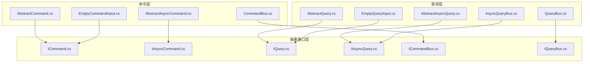
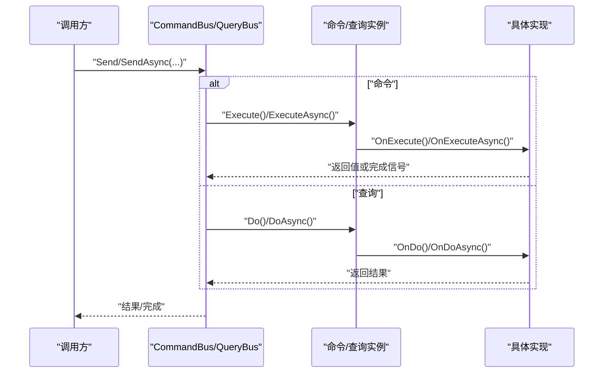
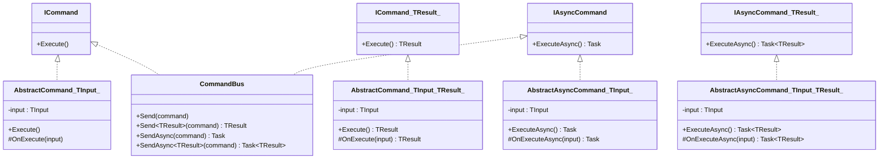
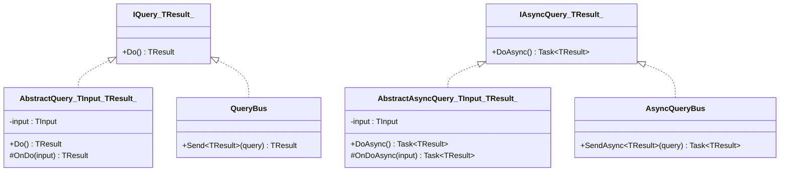
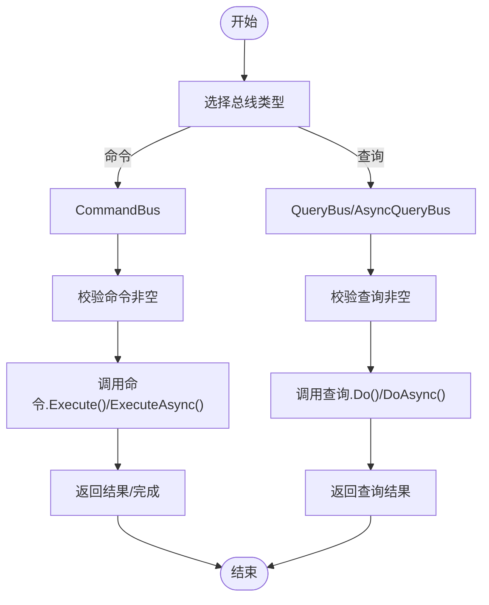
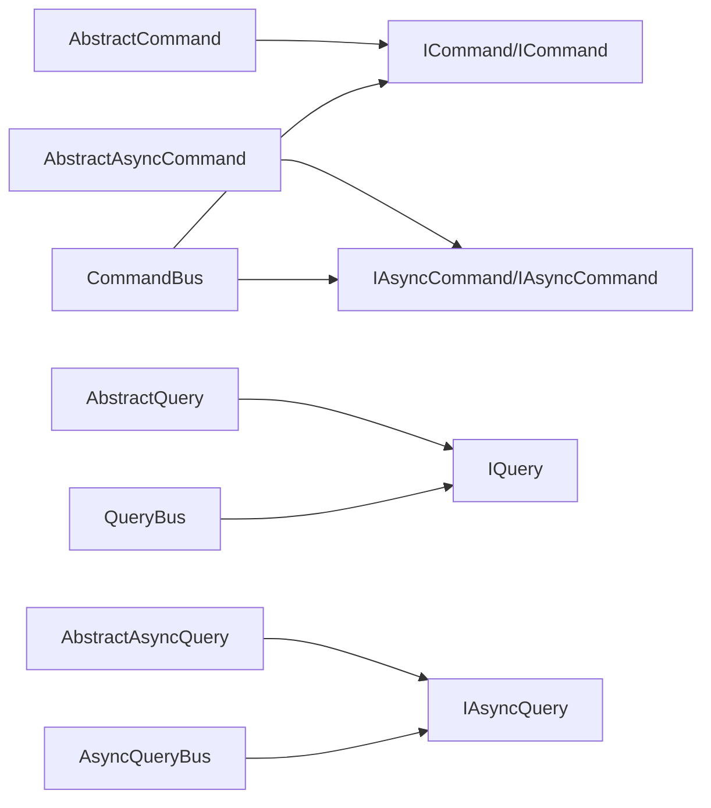

# CQRS模式实现

<cite>
**本文引用的文件**
- [GFramework.Core\command\AbstractCommand.cs](file://GFramework.Core/command\AbstractCommand.cs)
- [GFramework.Core\command\AbstractAsyncCommand.cs](file://GFramework.Core/command\AbstractAsyncCommand.cs)
- [GFramework.Core\command\CommandBus.cs](file://GFramework.Core/command/CommandBus.cs)
- [GFramework.Core\command\EmptyCommandInput.cs](file://GFramework.Core/command/EmptyCommandInput.cs)
- [GFramework.Core\query\AbstractQuery.cs](file://GFramework.Core/query\AbstractQuery.cs)
- [GFramework.Core\query\AbstractAsyncQuery.cs](file://GFramework.Core/query\AbstractAsyncQuery.cs)
- [GFramework.Core\query\QueryBus.cs](file://GFramework.Core/query/QueryBus.cs)
- [GFramework.Core\query\AsyncQueryBus.cs](file://GFramework.Core/query/AsyncQueryBus.cs)
- [GFramework.Core\query\EmptyQueryInput.cs](file://GFramework.Core/query/EmptyQueryInput.cs)
- [GFramework.Core.Abstractions\command\ICommand.cs](file://GFramework.Core.Abstractions/command/ICommand.cs)
- [GFramework.Core.Abstractions\command\IAsyncCommand.cs](file://GFramework.Core.Abstractions/command/IAsyncCommand.cs)
- [GFramework.Core.Abstractions\command\ICommandBus.cs](file://GFramework.Core.Abstractions/command/ICommandBus.cs)
- [GFramework.Core.Abstractions\query\IQuery.cs](file://GFramework.Core.Abstractions/query/IQuery.cs)
- [GFramework.Core.Abstractions\query\IAsyncQuery.cs](file://GFramework.Core.Abstractions/query/IAsyncQuery.cs)
- [GFramework.Core.Abstractions\query\IQueryBus.cs](file://GFramework.Core.Abstractions/query/IQueryBus.cs)
- [GFramework.Core.Tests\command\CommandBusTests.cs](file://GFramework.Core.Tests/command/CommandBusTests.cs)
- [GFramework.Core.Tests\query\QueryBusTests.cs](file://GFramework.Core.Tests/query/QueryBusTests.cs)
</cite>

## 目录
1. [引言](#引言)
2. [项目结构](#项目结构)
3. [核心组件](#核心组件)
4. [架构总览](#架构总览)
5. [详细组件分析](#详细组件分析)
6. [依赖关系分析](#依赖关系分析)
7. [性能考量](#性能考量)
8. [故障排查指南](#故障排查指南)
9. [结论](#结论)
10. [附录：游戏开发实战示例](#附录游戏开发实战示例)

## 引言
本教程围绕 GFramework 的 CQRS（命令查询职责分离）模式实现，系统讲解命令与查询的分离设计、架构优势、生命周期管理、输入输出模型、异步处理与错误处理机制。读者将学会如何基于框架提供的抽象类与总线接口，快速构建命令类（AbstractCommand）、查询类（AbstractQuery），并通过 CommandBus 和 QueryBus 进行统一调度与执行。

## 项目结构
本节聚焦于 CQRS 相关的核心目录与文件组织方式：
- 命令层：抽象命令、异步命令、命令总线、空命令输入
- 查询层：抽象查询、异步查询、查询总线、异步查询总线、空查询输入
- 抽象接口层：定义命令与查询的契约及总线接口

图表来源
- [GFramework.Core\command\AbstractCommand.cs](file://GFramework.Core/command\AbstractCommand.cs#L1-L53)
- [GFramework.Core\command\AbstractAsyncCommand.cs](file://GFramework.Core/command\AbstractAsyncCommand.cs#L1-L53)
- [GFramework.Core\command\CommandBus.cs](file://GFramework.Core/command/CommandBus.cs#L1-L62)
- [GFramework.Core\command\EmptyCommandInput.cs](file://GFramework.Core/command/EmptyCommandInput.cs#L1-L13)
- [GFramework.Core\query\AbstractQuery.cs](file://GFramework.Core/query\AbstractQuery.cs#L1-L29)
- [GFramework.Core\query\AbstractAsyncQuery.cs](file://GFramework.Core/query\AbstractAsyncQuery.cs#L1-L32)
- [GFramework.Core\query\QueryBus.cs](file://GFramework.Core/query/QueryBus.cs#L1-L23)
- [GFramework.Core\query\AsyncQueryBus.cs](file://GFramework.Core/query/AsyncQueryBus.cs#L1-L22)
- [GFramework.Core\query\EmptyQueryInput.cs](file://GFramework.Core/query/EmptyQueryInput.cs#L1-L11)
- [GFramework.Core.Abstractions\command\ICommand.cs](file://GFramework.Core.Abstractions/command/ICommand.cs#L1-L31)
- [GFramework.Core.Abstractions\command\IAsyncCommand.cs](file://GFramework.Core.Abstractions/command/IAsyncCommand.cs#L1-L29)
- [GFramework.Core.Abstractions\command\ICommandBus.cs](file://GFramework.Core.Abstractions/command/ICommandBus.cs#L1-L37)
- [GFramework.Core.Abstractions\query\IQuery.cs](file://GFramework.Core.Abstractions/query/IQuery.cs#L1-L16)
- [GFramework.Core.Abstractions\query\IAsyncQuery.cs](file://GFramework.Core.Abstractions/query/IAsyncQuery.cs#L1-L16)
- [GFramework.Core.Abstractions\query\IQueryBus.cs](file://GFramework.Core.Abstractions/query/IQueryBus.cs#L1-L15)

章节来源
- [GFramework.Core\command\AbstractCommand.cs](file://GFramework.Core/command\AbstractCommand.cs#L1-L53)
- [GFramework.Core\command\AbstractAsyncCommand.cs](file://GFramework.Core/command\AbstractAsyncCommand.cs#L1-L53)
- [GFramework.Core\command\CommandBus.cs](file://GFramework.Core/command/CommandBus.cs#L1-L62)
- [GFramework.Core\query\AbstractQuery.cs](file://GFramework.Core/query\AbstractQuery.cs#L1-L29)
- [GFramework.Core\query\AbstractAsyncQuery.cs](file://GFramework.Core/query\AbstractAsyncQuery.cs#L1-L32)
- [GFramework.Core\query\QueryBus.cs](file://GFramework.Core/query/QueryBus.cs#L1-L23)
- [GFramework.Core\query\AsyncQueryBus.cs](file://GFramework.Core/query/AsyncQueryBus.cs#L1-L22)
- [GFramework.Core\command\EmptyCommandInput.cs](file://GFramework.Core/command/EmptyCommandInput.cs#L1-L13)
- [GFramework.Core\query\EmptyQueryInput.cs](file://GFramework.Core/query/EmptyQueryInput.cs#L1-L11)

## 核心组件
- 命令抽象层
  - AbstractCommand<TInput>：无返回值命令抽象基类，封装输入与执行入口
  - AbstractCommand<TInput, TResult>：有返回值命令抽象基类
  - AbstractAsyncCommand<TInput> / AbstractAsyncCommand<TInput, TResult>：异步命令抽象基类
  - EmptyCommandInput：无输入命令的占位输入类型
- 查询抽象层
  - AbstractQuery<TInput, TResult>：同步查询抽象基类
  - AbstractAsyncQuery<TInput, TResult>：异步查询抽象基类
  - EmptyQueryInput：无输入查询的占位输入类型
- 总线层
  - CommandBus：统一命令发送与执行入口，支持同步/异步、有/无返回值
  - QueryBus：统一查询发送与执行入口
  - AsyncQueryBus：异步查询总线
- 抽象接口层
  - ICommand / ICommand<TResult> / IAsyncCommand / IAsyncCommand<TResult>
  - IQuery<TResult> / IAsyncQuery<TResult>
  - ICommandBus / IQueryBus

章节来源
- [GFramework.Core\command\AbstractCommand.cs](file://GFramework.Core/command\AbstractCommand.cs#L11-L53)
- [GFramework.Core\command\AbstractAsyncCommand.cs](file://GFramework.Core/command\AbstractAsyncCommand.cs#L10-L53)
- [GFramework.Core\command\CommandBus.cs](file://GFramework.Core/command/CommandBus.cs#L9-L62)
- [GFramework.Core\query\AbstractQuery.cs](file://GFramework.Core/query\AbstractQuery.cs#L11-L29)
- [GFramework.Core\query\AbstractAsyncQuery.cs](file://GFramework.Core/query\AbstractAsyncQuery.cs#L12-L32)
- [GFramework.Core\query\QueryBus.cs](file://GFramework.Core/query/QueryBus.cs#L8-L23)
- [GFramework.Core\query\AsyncQueryBus.cs](file://GFramework.Core/query/AsyncQueryBus.cs#L8-L22)
- [GFramework.Core\command\EmptyCommandInput.cs](file://GFramework.Core/command/EmptyCommandInput.cs#L12)
- [GFramework.Core\query\EmptyQueryInput.cs](file://GFramework.Core/query/EmptyQueryInput.cs#L11)
- [GFramework.Core.Abstractions\command\ICommand.cs](file://GFramework.Core.Abstractions/command/ICommand.cs#L9-L31)
- [GFramework.Core.Abstractions\command\IAsyncCommand.cs](file://GFramework.Core.Abstractions/command/IAsyncCommand.cs#L9-L29)
- [GFramework.Core.Abstractions\command\ICommandBus.cs](file://GFramework.Core.Abstractions/command/ICommandBus.cs#L8-L37)
- [GFramework.Core.Abstractions\query\IQuery.cs](file://GFramework.Core.Abstractions/query/IQuery.cs#L9-L16)
- [GFramework.Core.Abstractions\query\IAsyncQuery.cs](file://GFramework.Core.Abstractions/query/IAsyncQuery.cs#L9-L16)
- [GFramework.Core.Abstractions\query\IQueryBus.cs](file://GFramework.Core.Abstractions/query/IQueryBus.cs#L6-L15)

## 架构总览
CQRS 将“写”（命令）与“读”（查询）分离，分别采用独立的模型与执行路径，提升可扩展性、安全性与性能。在 GFramework 中：
- 命令通过 CommandBus 统一调度，支持同步/异步与返回值
- 查询通过 QueryBus/AsyncQueryBus 统一调度，支持同步/异步
- 输入输出模型通过泛型约束与 EmptyXxxInput 占位类型实现清晰的契约

图表来源
- [GFramework.Core\command\CommandBus.cs](file://GFramework.Core/command/CommandBus.cs#L16-L61)
- [GFramework.Core\query\QueryBus.cs](file://GFramework.Core/query/QueryBus.cs#L16-L22)
- [GFramework.Core\query\AsyncQueryBus.cs](file://GFramework.Core/query/AsyncQueryBus.cs#L16-L21)
- [GFramework.Core\command\AbstractCommand.cs](file://GFramework.Core/command\AbstractCommand.cs#L17-L26)
- [GFramework.Core\command\AbstractAsyncCommand.cs](file://GFramework.Core/command\AbstractAsyncCommand.cs#L17-L27)
- [GFramework.Core\query\AbstractQuery.cs](file://GFramework.Core/query\AbstractQuery.cs#L18-L28)
- [GFramework.Core\query\AbstractAsyncQuery.cs](file://GFramework.Core/query\AbstractAsyncQuery.cs#L21-L31)

## 详细组件分析

### 命令抽象与生命周期
- 设计要点
  - 通过 ContextAwareBase 提供上下文感知能力，便于访问架构、系统、模型、工具等资源
  - 同步命令：ICommand/ICommand<TResult> -> AbstractCommand -> CommandBus.Send
  - 异步命令：IAsyncCommand/IAsyncCommand<TResult> -> AbstractAsyncCommand -> CommandBus.SendAsync
  - 生命周期：从构造输入 -> 调度 -> 执行 -> 返回/完成
- 输入输出模型
  - TInput 必须实现 ICommandInput，确保输入契约一致
  - 无返回值命令仅触发副作用；有返回值命令返回 TResult
- 错误处理
  - CommandBus 对 null 命令显式抛出异常，保证调用方及时发现错误
  - 异常传播遵循 .NET Task/Exception 语义，建议在上层统一捕获与记录

图表来源
- [GFramework.Core.Abstractions\command\ICommand.cs](file://GFramework.Core.Abstractions/command/ICommand.cs#L9-L31)
- [GFramework.Core.Abstractions\command\IAsyncCommand.cs](file://GFramework.Core.Abstractions/command/IAsyncCommand.cs#L9-L29)
- [GFramework.Core\command\AbstractCommand.cs](file://GFramework.Core/command\AbstractCommand.cs#L11-L53)
- [GFramework.Core\command\AbstractAsyncCommand.cs](file://GFramework.Core/command\AbstractAsyncCommand.cs#L10-L53)
- [GFramework.Core\command\CommandBus.cs](file://GFramework.Core/command/CommandBus.cs#L9-L62)

章节来源
- [GFramework.Core\command\AbstractCommand.cs](file://GFramework.Core/command\AbstractCommand.cs#L11-L53)
- [GFramework.Core\command\AbstractAsyncCommand.cs](file://GFramework.Core/command\AbstractAsyncCommand.cs#L10-L53)
- [GFramework.Core\command\CommandBus.cs](file://GFramework.Core/command/CommandBus.cs#L9-L62)
- [GFramework.Core.Abstractions\command\ICommand.cs](file://GFramework.Core.Abstractions/command/ICommand.cs#L9-L31)
- [GFramework.Core.Abstractions\command\IAsyncCommand.cs](file://GFramework.Core.Abstractions/command/IAsyncCommand.cs#L9-L29)

### 查询抽象与生命周期
- 设计要点
  - 同步查询：IQuery<TResult> -> AbstractQuery -> QueryBus.Send
  - 异步查询：IAsyncQuery<TResult> -> AbstractAsyncQuery -> AsyncQueryBus.SendAsync
  - 生命周期：输入校验 -> 调度 -> 执行 -> 返回结果
- 输入输出模型
  - TInput 实现 IQueryInput，TResult 为只输出协变类型
  - EmptyQueryInput 用于无需输入的查询场景
- 错误处理
  - QueryBus/AsyncQueryBus 对 null 查询显式抛出异常
  - 建议在应用层对查询异常进行分类处理（缓存未命中、数据不存在、权限不足等）

图表来源
- [GFramework.Core.Abstractions\query\IQuery.cs](file://GFramework.Core.Abstractions/query/IQuery.cs#L9-L16)
- [GFramework.Core.Abstractions\query\IAsyncQuery.cs](file://GFramework.Core.Abstractions/query/IAsyncQuery.cs#L9-L16)
- [GFramework.Core\query\AbstractQuery.cs](file://GFramework.Core/query\AbstractQuery.cs#L11-L29)
- [GFramework.Core\query\AbstractAsyncQuery.cs](file://GFramework.Core/query\AbstractAsyncQuery.cs#L12-L32)
- [GFramework.Core\query\QueryBus.cs](file://GFramework.Core/query/QueryBus.cs#L8-L23)
- [GFramework.Core\query\AsyncQueryBus.cs](file://GFramework.Core/query/AsyncQueryBus.cs#L8-L22)

章节来源
- [GFramework.Core\query\AbstractQuery.cs](file://GFramework.Core/query\AbstractQuery.cs#L11-L29)
- [GFramework.Core\query\AbstractAsyncQuery.cs](file://GFramework.Core/query\AbstractAsyncQuery.cs#L12-L32)
- [GFramework.Core\query\QueryBus.cs](file://GFramework.Core/query/QueryBus.cs#L8-L23)
- [GFramework.Core\query\AsyncQueryBus.cs](file://GFramework.Core/query/AsyncQueryBus.cs#L8-L22)
- [GFramework.Core.Abstractions\query\IQuery.cs](file://GFramework.Core.Abstractions/query/IQuery.cs#L9-L16)
- [GFramework.Core.Abstractions\query\IAsyncQuery.cs](file://GFramework.Core.Abstractions/query/IAsyncQuery.cs#L9-L16)

### 总线实现与调用流程
- CommandBus
  - Send/Send<TResult>：同步执行命令
  - SendAsync/SendAsync<TResult>：异步执行命令
  - 参数校验：对 null 命令抛出异常
- QueryBus/AsyncQueryBus
  - Send/SendAsync：执行查询并返回结果
  - 参数校验：对 null 查询抛出异常

图表来源
- [GFramework.Core\command\CommandBus.cs](file://GFramework.Core/command/CommandBus.cs#L16-L61)
- [GFramework.Core\query\QueryBus.cs](file://GFramework.Core/query/QueryBus.cs#L16-L22)
- [GFramework.Core\query\AsyncQueryBus.cs](file://GFramework.Core/query/AsyncQueryBus.cs#L16-L21)

章节来源
- [GFramework.Core\command\CommandBus.cs](file://GFramework.Core/command/CommandBus.cs#L9-L62)
- [GFramework.Core\query\QueryBus.cs](file://GFramework.Core/query/QueryBus.cs#L8-L23)
- [GFramework.Core\query\AsyncQueryBus.cs](file://GFramework.Core/query/AsyncQueryBus.cs#L8-L22)

### 输入输出模型与空输入类型
- 输入模型
  - 命令输入：ICommandInput，EmptyCommandInput 作为无参命令的占位
  - 查询输入：IQueryInput，EmptyQueryInput 作为无参查询的占位
- 输出模型
  - 命令：可选返回值 TResult 或无返回值
  - 查询：只输出协变 TResult
- 使用建议
  - 优先使用强类型输入，避免魔法数字与字符串
  - 对于无输入场景，使用 EmptyXxxInput 明确意图

章节来源
- [GFramework.Core\command\EmptyCommandInput.cs](file://GFramework.Core/command/EmptyCommandInput.cs#L12)
- [GFramework.Core\query\EmptyQueryInput.cs](file://GFramework.Core/query/EmptyQueryInput.cs#L11)
- [GFramework.Core.Abstractions\command\ICommand.cs](file://GFramework.Core.Abstractions/command/ICommand.cs#L9-L31)
- [GFramework.Core.Abstractions\query\IQuery.cs](file://GFramework.Core.Abstractions/query/IQuery.cs#L9-L16)

### 异步处理与错误处理
- 异步处理
  - 命令：AbstractAsyncCommand + CommandBus.SendAsync
  - 查询：AbstractAsyncQuery + AsyncQueryBus.SendAsync
- 错误处理
  - 总线层对 null 参数抛出异常，调用方可据此快速定位问题
  - 建议在应用层捕获并记录异常，区分业务异常与系统异常

章节来源
- [GFramework.Core\command\AbstractAsyncCommand.cs](file://GFramework.Core/command\AbstractAsyncCommand.cs#L10-L53)
- [GFramework.Core\query\AbstractAsyncQuery.cs](file://GFramework.Core/query\AbstractAsyncQuery.cs#L12-L32)
- [GFramework.Core\command\CommandBus.cs](file://GFramework.Core/command/CommandBus.cs#L16-L61)
- [GFramework.Core\query\AsyncQueryBus.cs](file://GFramework.Core/query/AsyncQueryBus.cs#L16-L21)

## 依赖关系分析
- 组件耦合
  - 命令/查询实现依赖抽象接口，降低与具体总线的耦合
  - 总线仅依赖接口契约，便于替换与扩展
- 外部依赖
  - System.Threading.Tasks（异步）
  - GFramework.Core.rule.ContextAwareBase（上下文能力）
- 潜在风险
  - 避免在命令中直接访问查询总线，防止循环依赖
  - 查询不应产生副作用，保持幂等性

图表来源
- [GFramework.Core\command\AbstractCommand.cs](file://GFramework.Core/command\AbstractCommand.cs#L11-L53)
- [GFramework.Core\command\AbstractAsyncCommand.cs](file://GFramework.Core/command\AbstractAsyncCommand.cs#L10-L53)
- [GFramework.Core\query\AbstractQuery.cs](file://GFramework.Core/query\AbstractQuery.cs#L11-L29)
- [GFramework.Core\query\AbstractAsyncQuery.cs](file://GFramework.Core/query\AbstractAsyncQuery.cs#L12-L32)
- [GFramework.Core\command\CommandBus.cs](file://GFramework.Core/command/CommandBus.cs#L9-L62)
- [GFramework.Core\query\QueryBus.cs](file://GFramework.Core/query/QueryBus.cs#L8-L23)
- [GFramework.Core\query\AsyncQueryBus.cs](file://GFramework.Core/query/AsyncQueryBus.cs#L8-L22)

章节来源
- [GFramework.Core.Abstractions\command\ICommand.cs](file://GFramework.Core.Abstractions/command/ICommand.cs#L9-L31)
- [GFramework.Core.Abstractions\command\IAsyncCommand.cs](file://GFramework.Core.Abstractions/command/IAsyncCommand.cs#L9-L29)
- [GFramework.Core.Abstractions\query\IQuery.cs](file://GFramework.Core.Abstractions/query/IQuery.cs#L9-L16)
- [GFramework.Core.Abstractions\query\IAsyncQuery.cs](file://GFramework.Core.Abstractions/query/IAsyncQuery.cs#L9-L16)

## 性能考量
- 命令与查询分离带来的收益
  - 写入与读取路径解耦，便于针对读路径做缓存与索引优化
  - 可以独立扩展命令/查询的执行环境
- 异步化
  - 使用异步命令/查询避免阻塞主线程，适合游戏开发中的网络/IO密集场景
- 泛型与装箱
  - 通过泛型减少装箱，提高性能；合理使用 EmptyXxxInput 减少对象分配
- 总线调用开销
  - 总线本身轻量，主要成本在具体实现；建议在高频路径中复用命令/查询实例

## 故障排查指南
- 常见问题
  - 传入 null 命令/查询：总线层会抛出异常，检查调用方是否正确构造命令/查询
  - 无输入命令/查询：使用 EmptyXxxInput 明确意图，避免遗漏输入
  - 异步未等待：确保调用方 await SendAsync/DoAsync
- 单元测试参考
  - 命令总线测试覆盖了同步/异步、有/无返回值、null 场景
  - 查询总线测试覆盖了同步查询、null 场景与多返回类型

章节来源
- [GFramework.Core.Tests\command\CommandBusTests.cs](file://GFramework.Core.Tests/command/CommandBusTests.cs#L34-L124)
- [GFramework.Core.Tests\query\QueryBusTests.cs](file://GFramework.Core.Tests/query/QueryBusTests.cs#L28-L62)

## 结论
GFramework 的 CQRS 实现以清晰的抽象与总线为核心，提供了简洁而强大的命令/查询执行框架。通过分离写入与读取、统一调度与生命周期管理、完善的输入输出模型与异步支持，开发者可以快速构建可维护、高性能的游戏系统。建议在实际项目中结合领域模型，将业务规则收敛到命令/查询内部，配合事件总线实现最终一致性。

## 附录：游戏开发实战示例
以下示例描述如何在游戏开发中使用 CQRS 模式，涵盖常见场景。为保护代码完整性，示例仅给出步骤与要点，不直接展示源码。

- 玩家创建（命令）
  - 步骤
    - 定义命令输入：包含玩家名、初始属性等字段
    - 继承 AbstractCommand 或 AbstractAsyncCommand 创建 PlayerCreateCommand
    - 在 OnExecute/OnExecuteAsync 中完成持久化、事件发布与状态更新
    - 通过 CommandBus.Send/SendAsync 触发执行
  - 关键点
    - 输入校验与权限检查
    - 幂等性设计（避免重复创建）
    - 异常回滚与补偿

- 数据查询（查询）
  - 步骤
    - 定义查询输入：如分页参数、筛选条件
    - 继承 AbstractQuery 或 AbstractAsyncQuery 创建 PlayerListQuery
    - 在 OnDo/OnDoAsync 中执行数据库/缓存查询
    - 通过 QueryBus.Send/SendAsync 获取结果
  - 关键点
    - 只读查询，避免副作用
    - 缓存策略与失效机制
    - 分页与排序的性能优化

- 统计信息获取（查询）
  - 步骤
    - 定义统计查询输入：时间范围、维度等
    - 继承 AbstractQuery 创建 StatQuery
    - 在 OnDo 中聚合数据并返回结构化结果
  - 关键点
    - 使用异步查询处理大数据集
    - 结果模型与前端约定一致

- 异步命令与事件驱动
  - 步骤
    - 使用 AbstractAsyncCommand 完成耗时操作（如网络请求）
    - 在命令完成后发布领域事件，供其他模块订阅
  - 关键点
    - 事件总线与命令总线解耦
    - 事务边界与最终一致性

- 最佳实践
  - 命令/查询命名清晰，职责单一
  - 输入输出模型强类型化，避免魔法值
  - 异步化优先，避免阻塞主线程
  - 单元测试覆盖所有分支与异常路径