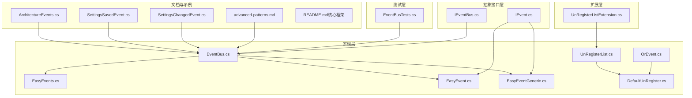
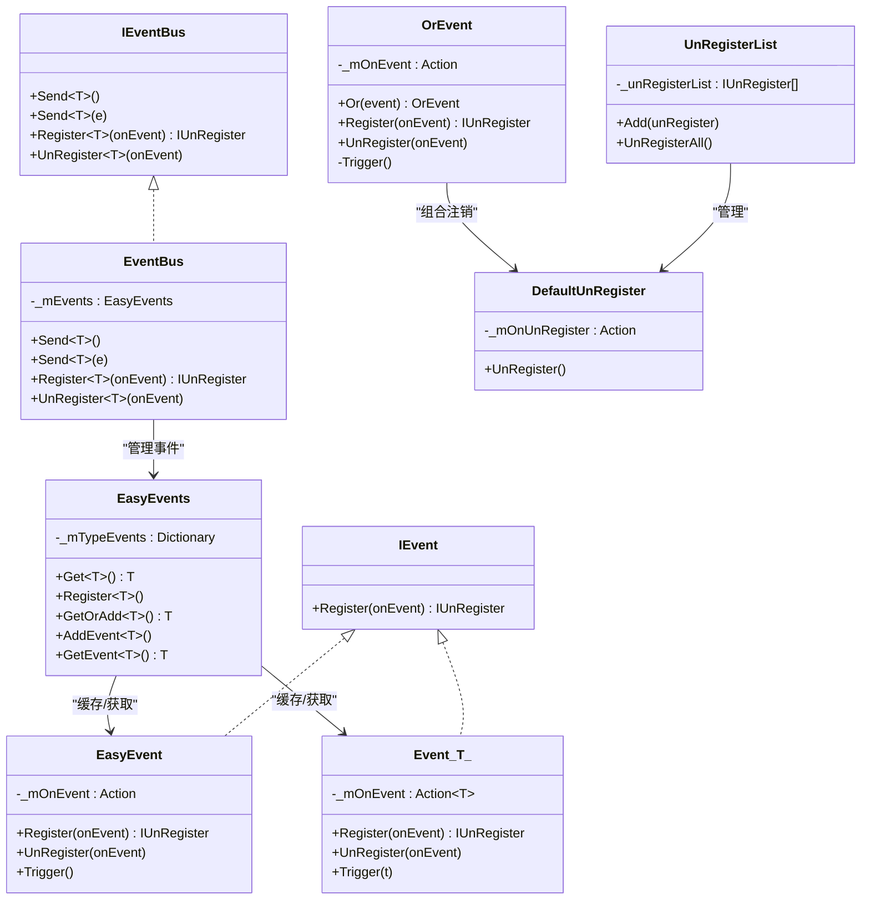
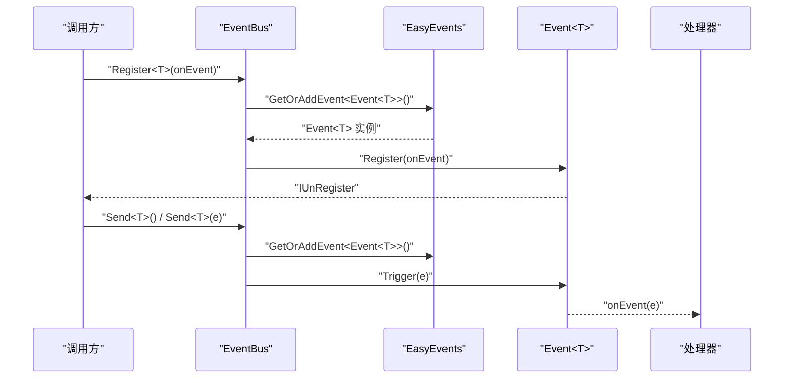
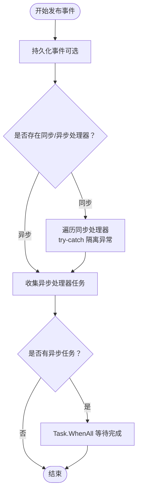
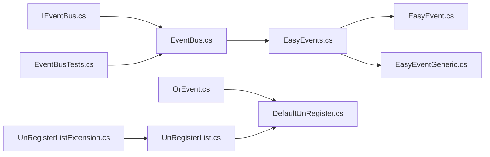

# 事件总线模式

<cite>
**本文引用的文件**
- [EventBus.cs](file://GFramework.Core/events/EventBus.cs)
- [EasyEvent.cs](file://GFramework.Core/events/EasyEvent.cs)
- [EasyEventGeneric.cs](file://GFramework.Core/events/EasyEventGeneric.cs)
- [EasyEvents.cs](file://GFramework.Core/events/EasyEvents.cs)
- [OrEvent.cs](file://GFramework.Core/events/OrEvent.cs)
- [DefaultUnRegister.cs](file://GFramework.Core/events/DefaultUnRegister.cs)
- [UnRegisterList.cs](file://GFramework.Core/events/UnRegisterList.cs)
- [UnRegisterListExtension.cs](file://GFramework.Core/extensions/UnRegisterListExtension.cs)
- [IEventBus.cs](file://GFramework.Core.Abstractions/events/IEventBus.cs)
- [IEvent.cs](file://GFramework.Core.Abstractions/events/IEvent.cs)
- [ArchitectureEvents.cs](file://GFramework.Core/events/ArchitectureEvents.cs)
- [EventBusTests.cs](file://GFramework.Core.Tests/events/EventBusTests.cs)
- [advanced-patterns.md](file://docs/tutorials/advanced-patterns.md)
- [README.md（核心框架）](file://GFramework.Core/README.md)
- [SettingsChangedEvent.cs](file://GFramework.Game/setting/events/SettingsChangedEvent.cs)
- [SettingsSavedEvent.cs](file://GFramework.Game/setting/events/SettingsSavedEvent.cs)
</cite>

## 目录
1. [引言](#引言)
2. [项目结构](#项目结构)
3. [核心组件](#核心组件)
4. [架构总览](#架构总览)
5. [详细组件分析](#详细组件分析)
6. [依赖分析](#依赖分析)
7. [性能考量](#性能考量)
8. [故障排查指南](#故障排查指南)
9. [结论](#结论)
10. [附录](#附录)

## 引言
本教程围绕 GFramework 的事件总线模式展开，系统讲解事件总线的设计架构与实现机制，涵盖事件处理器的注册与管理、同步与异步事件处理差异、事件路由与分发策略；并结合框架内现有实现，说明事件处理器接口设计（IEventBus、IEvent）、事件订阅与取消订阅的生命周期管理，以及异常处理与错误恢复机制。最后给出游戏开发中的典型应用案例与最佳实践。

## 项目结构
事件总线相关代码主要位于 GFramework.Core 的 events 与 extensions 子目录，并通过抽象接口定义在 Core.Abstractions 中，形成“抽象定义 + 具体实现 + 扩展工具”的分层组织：

- 抽象接口层：定义事件总线与事件的契约
- 实现层：提供基于类型的事件系统与事件管理器
- 扩展层：提供注销列表与便捷扩展方法
- 测试层：验证事件总线的注册、注销与分发行为
- 文档与示例：高级模式文档与游戏设置事件示例

图表来源
- [IEventBus.cs](file://GFramework.Core.Abstractions/events/IEventBus.cs#L1-L37)
- [IEvent.cs](file://GFramework.Core.Abstractions/events/IEvent.cs#L1-L16)
- [EventBus.cs](file://GFramework.Core/events/EventBus.cs#L1-L55)
- [EasyEvents.cs](file://GFramework.Core/events/EasyEvents.cs#L1-L85)
- [EasyEvent.cs](file://GFramework.Core/events/EasyEvent.cs#L1-L39)
- [EasyEventGeneric.cs](file://GFramework.Core/events/EasyEventGeneric.cs#L1-L123)
- [OrEvent.cs](file://GFramework.Core/events/OrEvent.cs#L1-L57)
- [DefaultUnRegister.cs](file://GFramework.Core/events/DefaultUnRegister.cs#L1-L22)
- [UnRegisterList.cs](file://GFramework.Core/events/UnRegisterList.cs#L1-L37)
- [UnRegisterListExtension.cs](file://GFramework.Core/extensions/UnRegisterListExtension.cs#L1-L32)
- [EventBusTests.cs](file://GFramework.Core.Tests/events/EventBusTests.cs#L1-L85)
- [advanced-patterns.md](file://docs/tutorials/advanced-patterns.md#L692-L882)
- [ArchitectureEvents.cs](file://GFramework.Core/events/ArchitectureEvents.cs#L1-L31)
- [SettingsChangedEvent.cs](file://GFramework.Game/setting/events/SettingsChangedEvent.cs#L1-L32)
- [SettingsSavedEvent.cs](file://GFramework.Game/setting/events/SettingsSavedEvent.cs#L1-L31)
- [README.md（核心框架）](file://GFramework.Core/README.md#L328-L337)

章节来源
- [README.md（核心框架）](file://GFramework.Core/README.md#L1-L508)

## 核心组件
- IEventBus：事件总线接口，定义 Send、Register、UnRegister 等能力
- EventBus：IEventBus 的具体实现，基于 EasyEvents 管理事件
- EasyEvents：全局事件管理器，按类型缓存事件实例，支持 Get、GetOrAdd、Add、GetEvent 等
- EasyEvent / Event<T> / Event<T,TK>：事件载体，支持注册、注销、触发，内置空操作委托避免空检查
- OrEvent：事件“或”组合器，将多个事件合并为一个触发源
- DefaultUnRegister / UnRegisterList：注销器与注销列表，统一管理生命周期
- UnRegisterListExtension：扩展方法，提供 AddToUnregisterList 与 UnRegisterAll

章节来源
- [IEventBus.cs](file://GFramework.Core.Abstractions/events/IEventBus.cs#L1-L37)
- [EventBus.cs](file://GFramework.Core/events/EventBus.cs#L1-L55)
- [EasyEvents.cs](file://GFramework.Core/events/EasyEvents.cs#L1-L85)
- [EasyEvent.cs](file://GFramework.Core/events/EasyEvent.cs#L1-L39)
- [EasyEventGeneric.cs](file://GFramework.Core/events/EasyEventGeneric.cs#L1-L123)
- [OrEvent.cs](file://GFramework.Core/events/OrEvent.cs#L1-L57)
- [DefaultUnRegister.cs](file://GFramework.Core/events/DefaultUnRegister.cs#L1-L22)
- [UnRegisterList.cs](file://GFramework.Core/events/UnRegisterList.cs#L1-L37)
- [UnRegisterListExtension.cs](file://GFramework.Core/extensions/UnRegisterListExtension.cs#L1-L32)

## 架构总览
事件总线采用“基于类型的事件系统”，通过 EventBus 将 Send、Register、UnRegister 三类操作桥接到 EasyEvents 管理的事件实例上。事件实例由 EasyEvent 或 Event<T> 等承载，内部使用委托聚合与空操作委托实现高效触发与安全注销。

图表来源
- [IEventBus.cs](file://GFramework.Core.Abstractions/events/IEventBus.cs#L1-L37)
- [EventBus.cs](file://GFramework.Core/events/EventBus.cs#L1-L55)
- [EasyEvents.cs](file://GFramework.Core/events/EasyEvents.cs#L1-L85)
- [EasyEvent.cs](file://GFramework.Core/events/EasyEvent.cs#L1-L39)
- [EasyEventGeneric.cs](file://GFramework.Core/events/EasyEventGeneric.cs#L1-L123)
- [OrEvent.cs](file://GFramework.Core/events/OrEvent.cs#L1-L57)
- [DefaultUnRegister.cs](file://GFramework.Core/events/DefaultUnRegister.cs#L1-L22)
- [UnRegisterList.cs](file://GFramework.Core/events/UnRegisterList.cs#L1-L37)
- [IEvent.cs](file://GFramework.Core.Abstractions/events/IEvent.cs#L1-L16)

## 详细组件分析

### 事件总线接口与实现（IEventBus / EventBus）
- IEventBus 定义了 Send、Register、UnRegister 的契约，支持泛型事件类型与实例发送
- EventBus 将接口委托给 EasyEvents 管理的事件实例，实现类型安全的事件分发

图表来源
- [IEventBus.cs](file://GFramework.Core.Abstractions/events/IEventBus.cs#L1-L37)
- [EventBus.cs](file://GFramework.Core/events/EventBus.cs#L1-L55)
- [EasyEvents.cs](file://GFramework.Core/events/EasyEvents.cs#L1-L85)
- [EasyEventGeneric.cs](file://GFramework.Core/events/EasyEventGeneric.cs#L1-L123)

章节来源
- [IEventBus.cs](file://GFramework.Core.Abstractions/events/IEventBus.cs#L1-L37)
- [EventBus.cs](file://GFramework.Core/events/EventBus.cs#L1-L55)

### 事件管理器（EasyEvents）
- 提供静态入口与实例入口，支持按类型获取或添加事件
- 内部以类型到事件实例的字典缓存，避免重复创建
- 支持注册、获取、添加、获取或添加等操作

章节来源
- [EasyEvents.cs](file://GFramework.Core/events/EasyEvents.cs#L1-L85)

### 事件载体（EasyEvent / Event<T> / Event<T,TK>）
- EasyEvent：无参事件，支持注册、注销、触发
- Event<T> / Event<T,TK>：带参事件，显式实现 IEvent.Register(Action)，允许无参订阅
- 内部使用空操作委托避免空检查，提升触发效率

章节来源
- [EasyEvent.cs](file://GFramework.Core/events/EasyEvent.cs#L1-L39)
- [EasyEventGeneric.cs](file://GFramework.Core/events/EasyEventGeneric.cs#L1-L123)
- [IEvent.cs](file://GFramework.Core.Abstractions/events/IEvent.cs#L1-L16)

### 事件组合（OrEvent）
- OrEvent 将多个事件通过“或”逻辑组合，任一事件触发即触发自身
- 通过扩展方法将子事件的注销加入自身注销列表，统一管理

章节来源
- [OrEvent.cs](file://GFramework.Core/events/OrEvent.cs#L1-L57)
- [UnRegisterListExtension.cs](file://GFramework.Core/extensions/UnRegisterListExtension.cs#L1-L32)

### 注销机制（DefaultUnRegister / UnRegisterList）
- DefaultUnRegister 在 UnRegister() 时执行回调并清理引用，防止重复注销
- UnRegisterList 统一收集多个注销对象，支持批量注销与清空

章节来源
- [DefaultUnRegister.cs](file://GFramework.Core/events/DefaultUnRegister.cs#L1-L22)
- [UnRegisterList.cs](file://GFramework.Core/events/UnRegisterList.cs#L1-L37)

### 同步与异步事件处理（对比与扩展）
- 框架现有实现为同步事件处理（EventBus、Event<T>、EasyEvent）
- 高级模式文档展示了异步事件处理的扩展思路：分别维护同步/异步处理器集合，发布时先处理同步处理器，再并发等待异步处理器完成，并对异常进行隔离

图表来源
- [advanced-patterns.md](file://docs/tutorials/advanced-patterns.md#L739-L795)

章节来源
- [advanced-patterns.md](file://docs/tutorials/advanced-patterns.md#L692-L882)

### 事件处理器接口设计（IEventHandler / IAsyncEventHandler）
- 高级模式文档定义了 IEventHandler<T> 与 IAsyncEventHandler<T>，用于区分同步与异步处理
- 事件总线实现中未直接暴露这些接口，但可通过扩展实现兼容

章节来源
- [advanced-patterns.md](file://docs/tutorials/advanced-patterns.md#L810-L825)

### 事件订阅与取消订阅生命周期管理
- 注册返回 IUnRegister，调用 UnRegister() 即可注销
- 使用 UnRegisterList 收集多个注销对象，可在组件销毁时统一注销
- 扩展方法 AddToUnregisterList 与 UnRegisterAll 简化管理

章节来源
- [DefaultUnRegister.cs](file://GFramework.Core/events/DefaultUnRegister.cs#L1-L22)
- [UnRegisterList.cs](file://GFramework.Core/events/UnRegisterList.cs#L1-L37)
- [UnRegisterListExtension.cs](file://GFramework.Core/extensions/UnRegisterListExtension.cs#L1-L32)
- [README.md（核心框架）](file://GFramework.Core/README.md#L403-L429)

### 事件路由与分发策略
- 基于类型路由：EventBus 通过 EasyEvents 按类型获取事件实例，确保同类型事件共享同一处理器集合
- 分发策略：事件触发时依次调用已注册的处理器，保持顺序一致性
- 组合事件：OrEvent 将多个事件合并，简化订阅端逻辑

章节来源
- [EventBus.cs](file://GFramework.Core/events/EventBus.cs#L1-L55)
- [EasyEvents.cs](file://GFramework.Core/events/EasyEvents.cs#L1-L85)
- [OrEvent.cs](file://GFramework.Core/events/OrEvent.cs#L1-L57)

### 异常处理与错误恢复
- 现有实现中，事件触发采用空操作委托，避免空引用导致的异常扩散
- 高级模式文档建议在异步发布时对处理器异常进行 try-catch 隔离，保证其他处理器正常执行
- 建议在业务层对关键处理器增加重试或降级策略

章节来源
- [EasyEvent.cs](file://GFramework.Core/events/EasyEvent.cs#L1-L39)
- [EasyEventGeneric.cs](file://GFramework.Core/events/EasyEventGeneric.cs#L1-L123)
- [advanced-patterns.md](file://docs/tutorials/advanced-patterns.md#L756-L768)

### 实际游戏开发应用案例
- 玩家行为响应：通过事件系统监听输入或状态变化，触发相应处理（如移动、攻击、拾取）
- 游戏状态更新：模型层状态变化通过事件通知控制器与系统，实现 UI 与逻辑同步
- UI 事件处理：UI 层通过事件与系统解耦，避免直接依赖具体实现

章节来源
- [README.md（核心框架）](file://GFramework.Core/README.md#L328-L337)

### 架构事件（ArchitectureEvents）
- 提供架构生命周期相关事件结构体，便于在架构初始化、销毁阶段进行监控与处理

章节来源
- [ArchitectureEvents.cs](file://GFramework.Core/events/ArchitectureEvents.cs#L1-L31)

### 设置系统事件（Settings*Event）
- SettingsChangedEvent 与 SettingsSavedEvent 展示了泛型事件在游戏设置模块中的应用，携带变更时间与类型化设置实例

章节来源
- [SettingsChangedEvent.cs](file://GFramework.Game/setting/events/SettingsChangedEvent.cs#L1-L32)
- [SettingsSavedEvent.cs](file://GFramework.Game/setting/events/SettingsSavedEvent.cs#L1-L31)

## 依赖分析
事件总线模块内部依赖关系清晰，接口与实现分离，扩展方法与注销机制相互配合，形成低耦合、高内聚的事件系统。

图表来源
- [IEventBus.cs](file://GFramework.Core.Abstractions/events/IEventBus.cs#L1-L37)
- [EventBus.cs](file://GFramework.Core/events/EventBus.cs#L1-L55)
- [EasyEvents.cs](file://GFramework.Core/events/EasyEvents.cs#L1-L85)
- [EasyEvent.cs](file://GFramework.Core/events/EasyEvent.cs#L1-L39)
- [EasyEventGeneric.cs](file://GFramework.Core/events/EasyEventGeneric.cs#L1-L123)
- [OrEvent.cs](file://GFramework.Core/events/OrEvent.cs#L1-L57)
- [DefaultUnRegister.cs](file://GFramework.Core/events/DefaultUnRegister.cs#L1-L22)
- [UnRegisterList.cs](file://GFramework.Core/events/UnRegisterList.cs#L1-L37)
- [UnRegisterListExtension.cs](file://GFramework.Core/extensions/UnRegisterListExtension.cs#L1-L32)
- [EventBusTests.cs](file://GFramework.Core.Tests/events/EventBusTests.cs#L1-L85)

章节来源
- [README.md（核心框架）](file://GFramework.Core/README.md#L1-L508)

## 性能考量
- 事件触发采用空操作委托，避免空引用检查开销
- 事件实例按类型缓存，减少重复创建
- 建议避免高频事件（如每帧触发），优先使用可绑定属性或批处理
- 异步处理器建议使用并发等待并在异常隔离下执行

章节来源
- [EasyEvent.cs](file://GFramework.Core/events/EasyEvent.cs#L1-L39)
- [EasyEventGeneric.cs](file://GFramework.Core/events/EasyEventGeneric.cs#L1-L123)
- [README.md（核心框架）](file://GFramework.Core/README.md#L431-L444)
- [advanced-patterns.md](file://docs/tutorials/advanced-patterns.md#L739-L795)

## 故障排查指南
- 注销未生效：确认是否正确调用 IUnRegister.UnRegister() 或通过 UnRegisterList.UnRegisterAll() 批量注销
- 事件未触发：检查事件类型是否一致、是否使用 GetOrAddEvent 获取同一实例
- 内存泄漏：确保组件销毁时统一注销，避免持有事件引用
- 异步异常：参考高级模式文档，对异步处理器异常进行隔离处理

章节来源
- [DefaultUnRegister.cs](file://GFramework.Core/events/DefaultUnRegister.cs#L1-L22)
- [UnRegisterList.cs](file://GFramework.Core/events/UnRegisterList.cs#L1-L37)
- [README.md（核心框架）](file://GFramework.Core/README.md#L403-L429)
- [EventBusTests.cs](file://GFramework.Core.Tests/events/EventBusTests.cs#L1-L85)

## 结论
GFramework 的事件总线通过“接口 + 实现 + 扩展”的分层设计，提供了类型安全、低耦合、易管理的事件系统。结合注销列表与扩展方法，能够有效管理生命周期；通过架构事件与游戏模块事件，进一步完善了事件在整体架构中的作用。对于需要异步处理与更强健的异常隔离场景，可参考高级模式文档进行扩展实现。

## 附录
- 事件总线使用要点
  - 使用 EventBus.Register<T>() 订阅事件，返回 IUnRegister 以便注销
  - 使用 EventBus.Send<T>() 或 Send<T>(e) 发布事件
  - 使用 UnRegisterList 统一管理多个注销对象
  - 对高频事件与异步处理器进行性能与异常优化

章节来源
- [EventBus.cs](file://GFramework.Core/events/EventBus.cs#L1-L55)
- [UnRegisterListExtension.cs](file://GFramework.Core/extensions/UnRegisterListExtension.cs#L1-L32)
- [README.md（核心框架）](file://GFramework.Core/README.md#L328-L337)