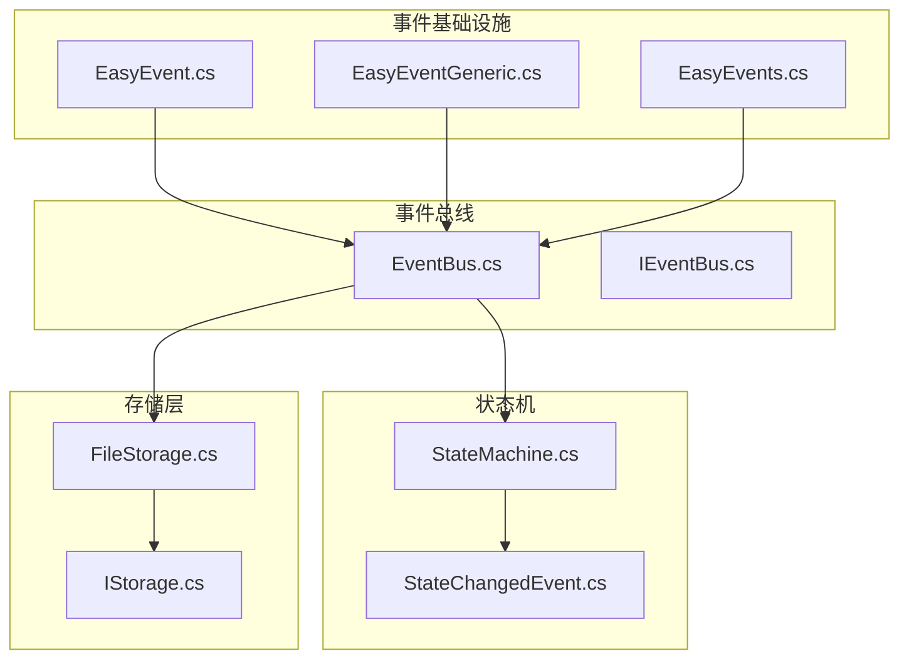
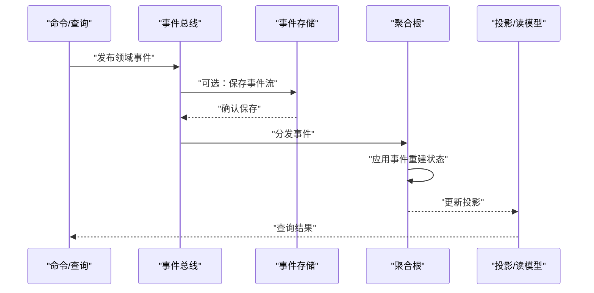
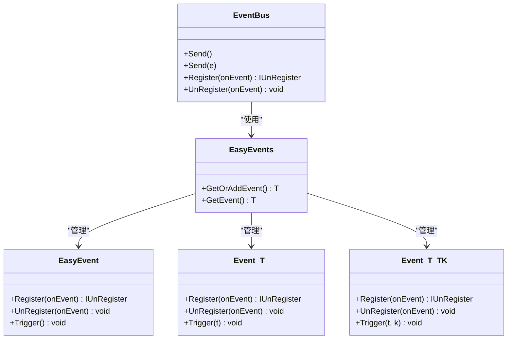
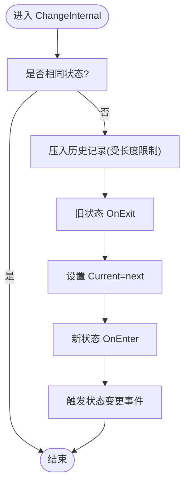
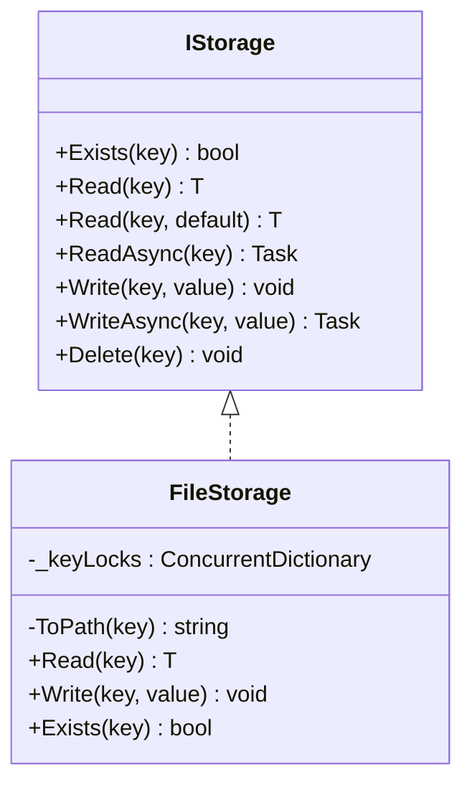
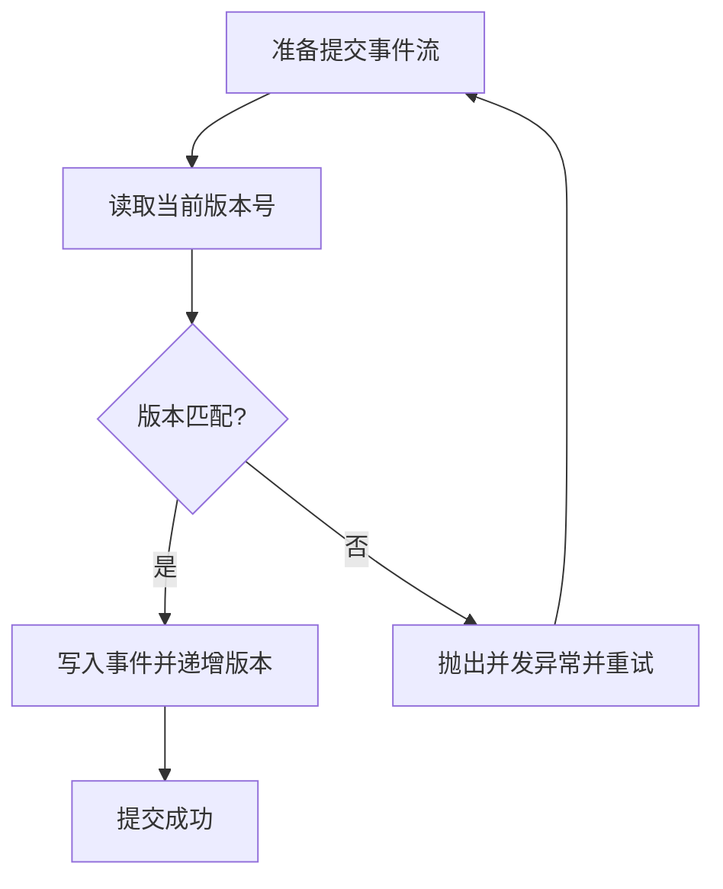
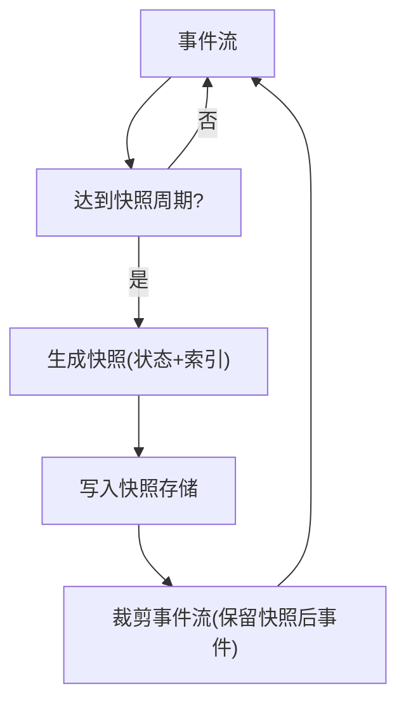
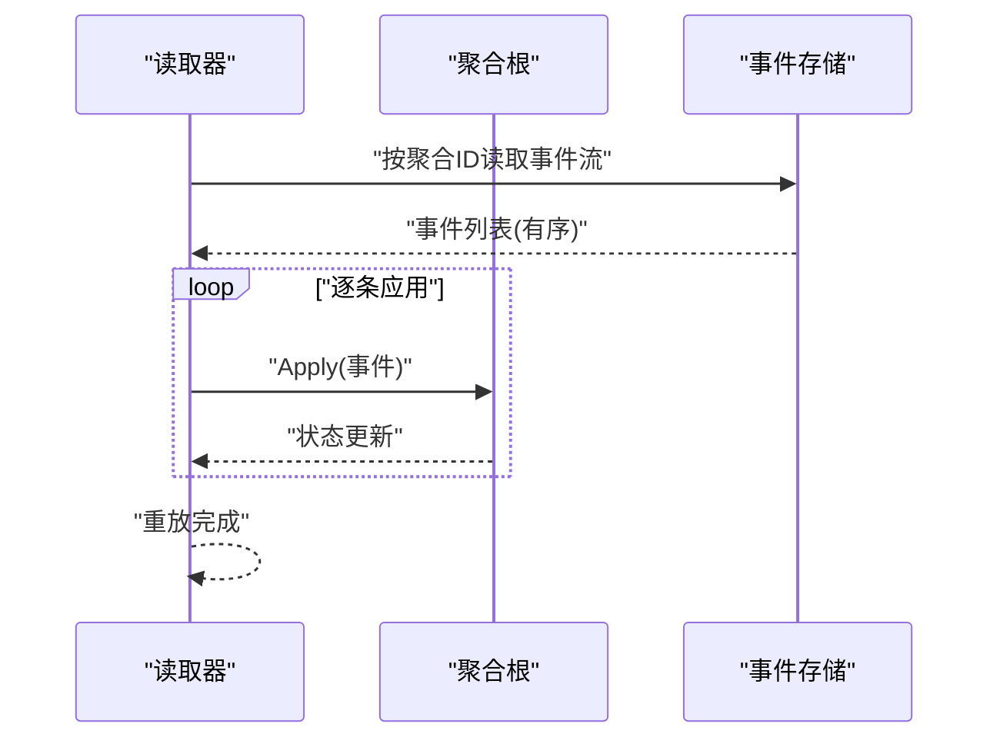
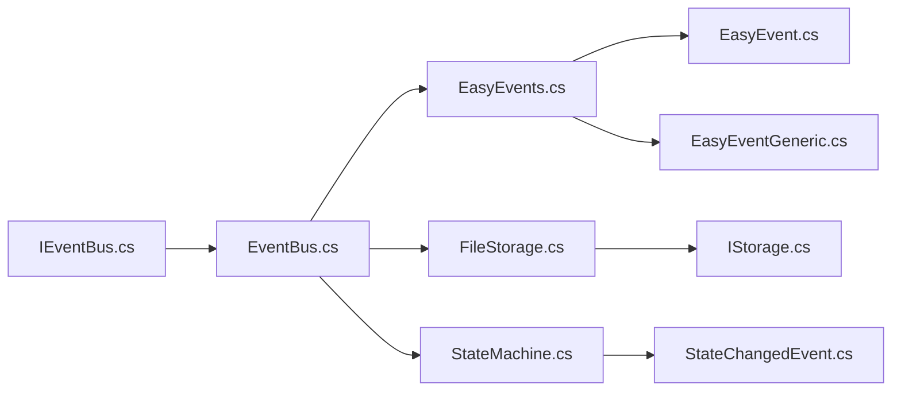

# 事件溯源模式

<cite>
**本文引用的文件**
- [GFramework.Core\events\EasyEvent.cs](file://GFramework.Core/events/EasyEvent.cs)
- [GFramework.Core\events\EasyEventGeneric.cs](file://GFramework.Core/events/EasyEventGeneric.cs)
- [GFramework.Core\events\EasyEvents.cs](file://GFramework.Core/events/EasyEvents.cs)
- [GFramework.Core\events\EventBus.cs](file://GFramework.Core/events/EventBus.cs)
- [GFramework.Core.Abstractions\events\IEventBus.cs](file://GFramework.Core.Abstractions/events/IEventBus.cs)
- [GFramework.Core\model\AbstractModel.cs](file://GFramework.Core/model/AbstractModel.cs)
- [GFramework.Core\state\StateMachine.cs](file://GFramework.Core/state/StateMachine.cs)
- [GFramework.Core\state\StateChangedEvent.cs](file://GFramework.Core/state/StateChangedEvent.cs)
- [GFramework.Game\storage\FileStorage.cs](file://GFramework.Game/storage/FileStorage.cs)
- [GFramework.Core.Abstractions\storage\IStorage.cs](file://GFramework.Core.Abstractions/storage/IStorage.cs)
- [docs\tutorials\advanced-patterns.md](file://docs/tutorials/advanced-patterns.md)
- [docs\api-reference\core-api.md](file://docs/api-reference/core-api.md)
- [GFramework.Core.Tests\events\EventTests.cs](file://GFramework.Core.Tests/events/EventTests.cs)
- [GFramework.Core.Tests\tests\SyncArchitectureTests.cs](file://GFramework.Core.Tests/tests/SyncArchitectureTests.cs)
- [GFramework.Core.Tests\architecture\ArchitectureContextTests.cs](file://GFramework.Core.Tests/architecture/ArchitectureContextTests.cs)
</cite>

## 目录
1. [简介](#简介)
2. [项目结构](#项目结构)
3. [核心组件](#核心组件)
4. [架构总览](#架构总览)
5. [详细组件分析](#详细组件分析)
6. [依赖分析](#依赖分析)
7. [性能考量](#性能考量)
8. [故障排查指南](#故障排查指南)
9. [结论](#结论)
10. [附录](#附录)

## 简介
本教程围绕事件溯源（Event Sourcing）在 GFramework 中的应用展开，结合现有事件总线、状态机与存储设施，系统讲解事件存储设计、事件流版本控制、快照策略、聚合根重建、事件应用与重放、并发控制（版本检查）、事件流分片与索引等主题。同时给出面向游戏开发的实际场景：玩家状态变更记录、游戏进度跟踪、审计日志等。

## 项目结构
GFramework 的事件系统由“事件基础设施”“事件总线”“状态机”“存储层”组成；事件溯源所需的“事件存储”“聚合根”“快照”等概念在现有模块基础上可直接扩展实现。

图示来源
- [GFramework.Core\events\EasyEvent.cs](file://GFramework.Core/events/EasyEvent.cs#L1-L39)
- [GFramework.Core\events\EasyEventGeneric.cs](file://GFramework.Core/events/EasyEventGeneric.cs#L1-L123)
- [GFramework.Core\events\EasyEvents.cs](file://GFramework.Core/events/EasyEvents.cs#L1-L85)
- [GFramework.Core\events\EventBus.cs](file://GFramework.Core/events/EventBus.cs#L1-L55)
- [GFramework.Core.Abstractions\events\IEventBus.cs](file://GFramework.Core.Abstractions/events/IEventBus.cs#L1-L37)
- [GFramework.Core\state\StateMachine.cs](file://GFramework.Core/state/StateMachine.cs#L1-L276)
- [GFramework.Core\state\StateChangedEvent.cs](file://GFramework.Core/state/StateChangedEvent.cs#L1-L19)
- [GFramework.Game\storage\FileStorage.cs](file://GFramework.Game/storage/FileStorage.cs#L1-L258)
- [GFramework.Core.Abstractions\storage\IStorage.cs](file://GFramework.Core.Abstractions/storage/IStorage.cs#L1-L72)

章节来源
- [GFramework.Core\events\EasyEvent.cs](file://GFramework.Core/events/EasyEvent.cs#L1-L39)
- [GFramework.Core\events\EventBus.cs](file://GFramework.Core/events/EventBus.cs#L1-L55)
- [GFramework.Core\state\StateMachine.cs](file://GFramework.Core/state/StateMachine.cs#L1-L276)
- [GFramework.Game\storage\FileStorage.cs](file://GFramework.Game/storage/FileStorage.cs#L1-L258)

## 核心组件
- 事件基础设施：提供简单事件、泛型事件与全局事件管理器，支撑事件注册、注销与触发。
- 事件总线：基于类型分发事件，支持同步/异步处理器，可与事件存储集成实现事件持久化。
- 状态机：内置状态切换、历史记录与回退能力，可作为聚合根重建过程的参考实现。
- 存储层：提供键值存储的抽象与文件系统实现，可作为事件存储的持久化载体。

章节来源
- [GFramework.Core\events\EasyEvent.cs](file://GFramework.Core/events/EasyEvent.cs#L1-L39)
- [GFramework.Core\events\EasyEventGeneric.cs](file://GFramework.Core/events/EasyEventGeneric.cs#L1-L123)
- [GFramework.Core\events\EasyEvents.cs](file://GFramework.Core/events/EasyEvents.cs#L1-L85)
- [GFramework.Core\events\EventBus.cs](file://GFramework.Core/events/EventBus.cs#L1-L55)
- [GFramework.Core.Abstractions\events\IEventBus.cs](file://GFramework.Core.Abstractions/events/IEventBus.cs#L1-L37)
- [GFramework.Core\state\StateMachine.cs](file://GFramework.Core/state/StateMachine.cs#L1-L276)
- [GFramework.Core\state\StateChangedEvent.cs](file://GFramework.Core/state/StateChangedEvent.cs#L1-L19)
- [GFramework.Core.Abstractions\storage\IStorage.cs](file://GFramework.Core.Abstractions/storage/IStorage.cs#L1-L72)
- [GFramework.Game\storage\FileStorage.cs](file://GFramework.Game/storage/FileStorage.cs#L1-L258)

## 架构总览
事件溯源在 GFramework 中的落地路径如下：
- 命令/查询驱动业务，产生领域事件；
- 事件总线负责分发事件，可选地将领域事件持久化至事件存储；
- 聚合根根据事件重建状态（可参考状态机的历史机制）；
- 快照定期截断事件流，加速重建；
- 查询侧通过投影或读模型提供高效查询。

图示来源
- [docs\tutorials\advanced-patterns.md](file://docs/tutorials/advanced-patterns.md#L692-L882)
- [GFramework.Core\events\EventBus.cs](file://GFramework.Core/events/EventBus.cs#L1-L55)

## 详细组件分析

### 事件基础设施与事件总线
- EasyEvent/EasyEventGeneric：提供事件注册、注销与触发，支持无参与单/双参数事件。
- EasyEvents：全局事件管理器，按类型缓存事件实例，支持获取或创建。
- EventBus：基于类型分发事件，提供 Send/Register/UnRegister，可与事件存储集成。

图示来源
- [GFramework.Core\events\EasyEvent.cs](file://GFramework.Core/events/EasyEvent.cs#L1-L39)
- [GFramework.Core\events\EasyEventGeneric.cs](file://GFramework.Core/events/EasyEventGeneric.cs#L1-L123)
- [GFramework.Core\events\EasyEvents.cs](file://GFramework.Core/events/EasyEvents.cs#L1-L85)
- [GFramework.Core\events\EventBus.cs](file://GFramework.Core/events/EventBus.cs#L1-L55)
- [GFramework.Core.Abstractions\events\IEventBus.cs](file://GFramework.Core.Abstractions/events/IEventBus.cs#L1-L37)

章节来源
- [GFramework.Core\events\EasyEvent.cs](file://GFramework.Core/events/EasyEvent.cs#L1-L39)
- [GFramework.Core\events\EasyEventGeneric.cs](file://GFramework.Core/events/EasyEventGeneric.cs#L1-L123)
- [GFramework.Core\events\EasyEvents.cs](file://GFramework.Core/events/EasyEvents.cs#L1-L85)
- [GFramework.Core\events\EventBus.cs](file://GFramework.Core/events/EventBus.cs#L1-L55)
- [GFramework.Core.Abstractions\events\IEventBus.cs](file://GFramework.Core.Abstractions/events/IEventBus.cs#L1-L37)

### 状态机与聚合根重建（参考实现）
状态机具备状态切换、历史记录与回退能力，可作为聚合根重建过程的参考：
- 历史记录限制最大长度；
- 回退时跳过未注册状态；
- 切换前后触发进入/退出与变更事件。

图示来源
- [GFramework.Core\state\StateMachine.cs](file://GFramework.Core/state/StateMachine.cs#L206-L248)
- [GFramework.Core\state\StateChangedEvent.cs](file://GFramework.Core/state/StateChangedEvent.cs#L1-L19)

章节来源
- [GFramework.Core\state\StateMachine.cs](file://GFramework.Core/state/StateMachine.cs#L1-L276)
- [GFramework.Core\state\StateChangedEvent.cs](file://GFramework.Core/state/StateChangedEvent.cs#L1-L19)

### 事件存储与持久化（基于现有存储设施）
事件存储可基于 IStorage/FileStorage 实现：
- 键空间规划：以聚合标识符为前缀，事件序号为后缀，形成有序事件流；
- 并发控制：使用键级锁（类似 FileStorage 的 keyLocks）保障同一聚合的写入串行；
- 序列化：事件对象序列化为文本/二进制，配合压缩与批量化提升吞吐；
- 分片与索引：按聚合类型/时间维度分片，建立事件索引（起止偏移、时间戳索引）便于快速定位。

图示来源
- [GFramework.Core.Abstractions\storage\IStorage.cs](file://GFramework.Core.Abstractions/storage/IStorage.cs#L1-L72)
- [GFramework.Game\storage\FileStorage.cs](file://GFramework.Game/storage/FileStorage.cs#L1-L258)

章节来源
- [GFramework.Core.Abstractions\storage\IStorage.cs](file://GFramework.Core.Abstractions/storage/IStorage.cs#L1-L72)
- [GFramework.Game\storage\FileStorage.cs](file://GFramework.Game/storage/FileStorage.cs#L1-L258)

### 事件流版本控制与并发控制（版本检查）
- 版本号：在事件头中携带期望版本号（ExpectedVersion），提交时校验；
- 并发冲突：若版本不匹配，拒绝写入并提示重试；
- 重试策略：指数退避+超时，避免活锁；
- 乐观锁：适用于低冲突场景；高冲突建议引入分片或分区。

（本图为概念流程，无需图示来源）

### 快照策略与性能优化
- 快照周期：每 N 个事件生成一次快照（N 可配置），减少重建开销；
- 快照格式：序列化聚合当前状态，附带快照时间戳与事件索引；
- 重建流程：先加载快照，再按顺序应用其后的事件，提升启动速度；
- I/O 优化：批量写入、异步读写、压缩事件与快照、预读策略。

（本图为概念流程，无需图示来源）

### 事件应用方法与重放机制
- 事件应用：聚合根暴露 Apply 方法族，接收事件并更新内部状态；
- 重放顺序：严格按事件时间戳/序号顺序应用；
- 错误处理：单个事件失败不影响整体重放，记录失败事件并继续；
- 审计日志：记录事件元数据（时间、聚合ID、版本、应用者）。

（本图为概念流程，无需图示来源）

### 实际游戏应用场景
- 玩家状态变更记录：角色等级、属性变化、装备穿戴等事件可被持久化与重放，用于回溯与审计；
- 游戏进度跟踪：关卡通关、成就解锁、排行榜更新等事件驱动投影；
- 审计日志：记录关键操作（如充值、封禁）的完整历史，满足合规要求。

章节来源
- [docs\api-reference\core-api.md](file://docs/api-reference/core-api.md#L420-L490)
- [GFramework.Core.Tests\events\EventTests.cs](file://GFramework.Core.Tests/events/EventTests.cs#L1-L164)
- [GFramework.Core.Tests\tests\SyncArchitectureTests.cs](file://GFramework.Core.Tests/tests/SyncArchitectureTests.cs#L156-L195)
- [GFramework.Core.Tests\architecture\ArchitectureContextTests.cs](file://GFramework.Core.Tests/architecture/ArchitectureContextTests.cs#L173-L211)

## 依赖分析
事件溯源在 GFramework 中的耦合关系：
- 事件总线依赖事件基础设施与存储接口；
- 状态机与事件总线解耦，可通过事件驱动状态切换；
- 存储层提供统一抽象，便于替换实现（内存/文件/数据库）。

图示来源
- [GFramework.Core.Abstractions\events\IEventBus.cs](file://GFramework.Core.Abstractions/events/IEventBus.cs#L1-L37)
- [GFramework.Core\events\EventBus.cs](file://GFramework.Core/events/EventBus.cs#L1-L55)
- [GFramework.Core\events\EasyEvents.cs](file://GFramework.Core/events/EasyEvents.cs#L1-L85)
- [GFramework.Core\events\EasyEvent.cs](file://GFramework.Core/events/EasyEvent.cs#L1-L39)
- [GFramework.Core\events\EasyEventGeneric.cs](file://GFramework.Core/events/EasyEventGeneric.cs#L1-L123)
- [GFramework.Game\storage\FileStorage.cs](file://GFramework.Game/storage/FileStorage.cs#L1-L258)
- [GFramework.Core.Abstractions\storage\IStorage.cs](file://GFramework.Core.Abstractions/storage/IStorage.cs#L1-L72)
- [GFramework.Core\state\StateMachine.cs](file://GFramework.Core/state/StateMachine.cs#L1-L276)
- [GFramework.Core\state\StateChangedEvent.cs](file://GFramework.Core/state/StateChangedEvent.cs#L1-L19)

章节来源
- [GFramework.Core\events\EventBus.cs](file://GFramework.Core/events/EventBus.cs#L1-L55)
- [GFramework.Core\events\EasyEvents.cs](file://GFramework.Core/events/EasyEvents.cs#L1-L85)
- [GFramework.Game\storage\FileStorage.cs](file://GFramework.Game/storage/FileStorage.cs#L1-L258)

## 性能考量
- 写入性能：批量化事件、异步写入、压缩；对同一聚合使用键级锁避免争用；
- 读取性能：事件索引、快照、投影；按需加载与惰性重建；
- 存储成本：事件不可变，长期增长；通过快照裁剪与归档降低热数据体积；
- 查询复杂性：事件存储不利于复杂查询；建议通过投影/物化视图提供查询接口。

（本节为通用指导，无需章节来源）

## 故障排查指南
- 事件未触发：检查事件注册/注销是否正确，确认事件类型与处理器签名一致；
- 并发冲突：检查版本号期望值与实际版本是否一致，必要时增加重试与退避；
- 存储异常：核对键路径合法性、文件权限与磁盘空间，关注锁竞争问题；
- 重放失败：定位失败事件，记录并隔离，确保后续事件继续应用。

章节来源
- [GFramework.Core.Tests\events\EventTests.cs](file://GFramework.Core.Tests/events/EventTests.cs#L1-L164)
- [GFramework.Core.Tests\tests\SyncArchitectureTests.cs](file://GFramework.Core.Tests/tests/SyncArchitectureTests.cs#L156-L195)
- [GFramework.Core.Tests\architecture\ArchitectureContextTests.cs](file://GFramework.Core.Tests/architecture/ArchitectureContextTests.cs#L173-L211)
- [GFramework.Game\storage\FileStorage.cs](file://GFramework.Game/storage/FileStorage.cs#L1-L258)

## 结论
事件溯源在 GFramework 中具备良好的扩展基础：事件总线提供事件分发与持久化入口，状态机体现聚合重建思路，存储层提供统一持久化抽象。结合版本控制、快照与索引策略，可在保证数据完整性与审计能力的同时，兼顾性能与可维护性。

## 附录
- 事件总线与事件存储集成示例（概念性代码片段路径）
  - [事件总线与事件存储集成示例](file://docs/tutorials/advanced-patterns.md#L692-L882)
- 命令/查询与事件发送示例（概念性代码片段路径）
  - [命令/查询与事件发送示例](file://docs/api-reference/core-api.md#L420-L490)