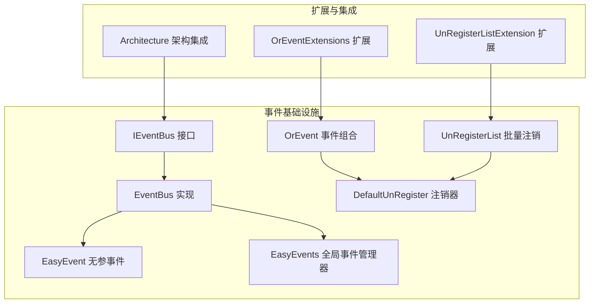
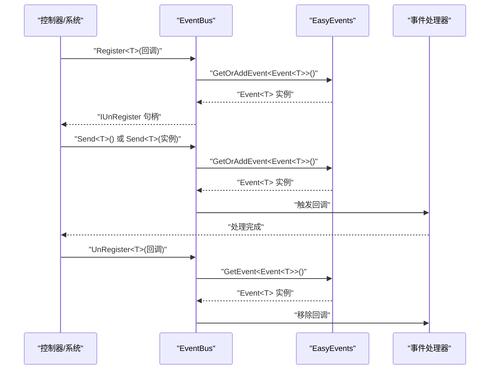
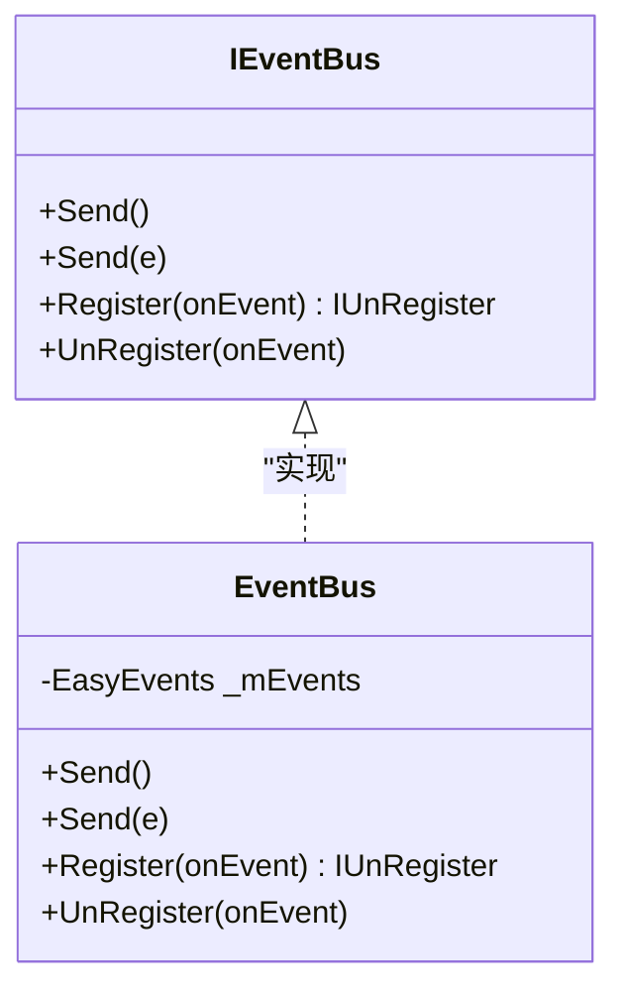
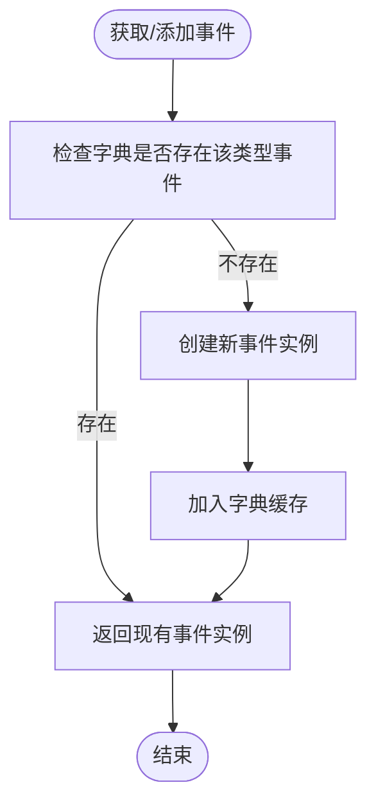
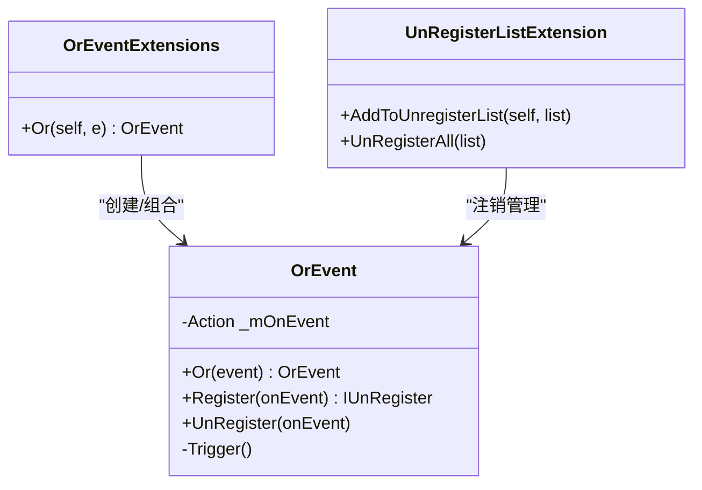
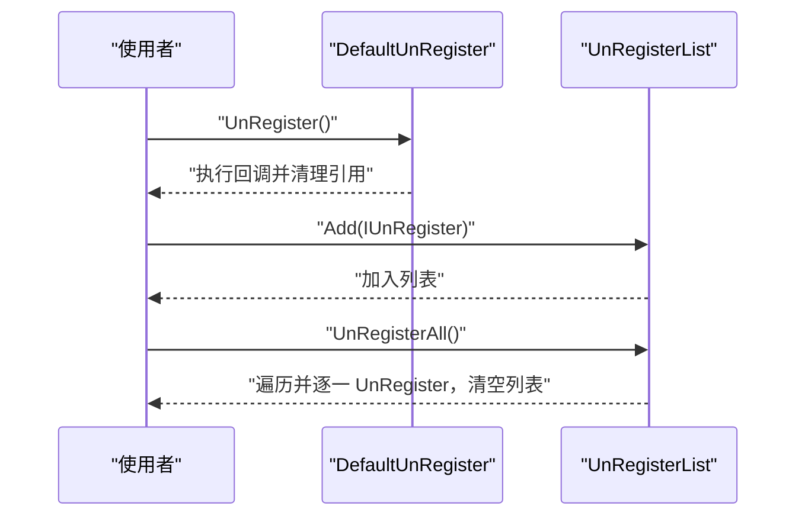
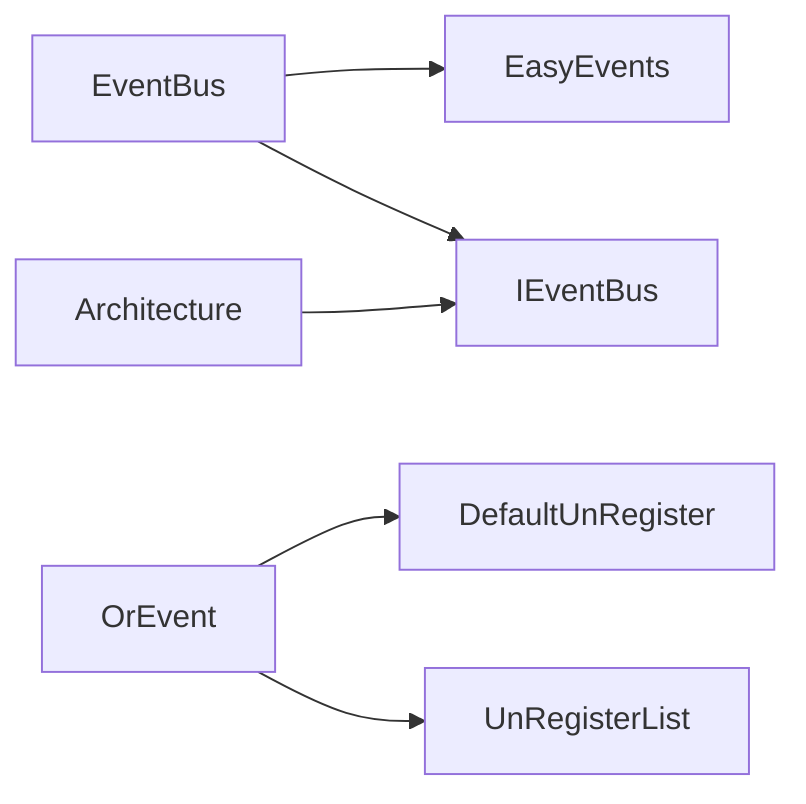

# 事件驱动架构

<cite>
**本文引用的文件**
- [GFramework.Core\events\EventBus.cs](file://GFramework.Core/events/EventBus.cs)
- [GFramework.Core\events\EasyEvent.cs](file://GFramework.Core/events/EasyEvent.cs)
- [GFramework.Core\events\EasyEvents.cs](file://GFramework.Core/events/EasyEvents.cs)
- [GFramework.Core\events\ArchitectureEvents.cs](file://GFramework.Core/events/ArchitectureEvents.cs)
- [GFramework.Core\events\DefaultUnRegister.cs](file://GFramework.Core/events/DefaultUnRegister.cs)
- [GFramework.Core\events\UnRegisterList.cs](file://GFramework.Core/events/UnRegisterList.cs)
- [GFramework.Core\events\OrEvent.cs](file://GFramework.Core/events/OrEvent.cs)
- [GFramework.Core.Abstractions\events\IEventBus.cs](file://GFramework.Core.Abstractions/events/IEventBus.cs)
- [GFramework.Core\extensions\OrEventExtensions.cs](file://GFramework.Core/extensions/OrEventExtensions.cs)
- [GFramework.Core\extensions\UnRegisterListExtension.cs](file://GFramework.Core/extensions/UnRegisterListExtension.cs)
- [GFramework.Core\architecture\Architecture.cs](file://GFramework.Core/architecture/Architecture.cs)
- [GFramework.Core\README.md](file://GFramework.Core/README.md)
- [GFramework.Core\events\README.md](file://GFramework.Core/events/README.md)
- [docs\tutorials\advanced-patterns.md](file://docs/tutorials/advanced-patterns.md)
</cite>

## 目录
1. [引言](#引言)
2. [项目结构](#项目结构)
3. [核心组件](#核心组件)
4. [架构总览](#架构总览)
5. [详细组件分析](#详细组件分析)
6. [依赖分析](#依赖分析)
7. [性能考量](#性能考量)
8. [故障排查指南](#故障排查指南)
9. [结论](#结论)
10. [附录](#附录)

## 引言
本教程围绕 GFramework 的事件驱动架构展开，系统讲解事件总线模式、事件组合与注销管理、以及在游戏开发中的典型应用。文档同时结合仓库中现有的事件总线与事件组合实现，给出可落地的扩展思路（如事件存储、事件聚合与重放），帮助读者在 Unity/Godot 等引擎中构建松耦合、可维护、可扩展的游戏系统。

## 项目结构
事件相关能力主要集中在 GFramework.Core 的 events 模块，并通过扩展方法与架构层协同工作：
- 事件基础设施：EventBus、EasyEvent、EasyEvents、OrEvent、DefaultUnRegister、UnRegisterList
- 接口契约：IEventBus
- 架构集成：Architecture 类中对事件总线的使用与生命周期管理
- 教程与示例：docs/tutorials/advanced-patterns.md 展示了事件存储、事件聚合与重放的扩展思路

图表来源
- [GFramework.Core.Abstractions\events\IEventBus.cs](file://GFramework.Core.Abstractions/events/IEventBus.cs#L1-L37)
- [GFramework.Core\events\EventBus.cs](file://GFramework.Core/events/EventBus.cs#L1-L55)
- [GFramework.Core\events\EasyEvent.cs](file://GFramework.Core/events/EasyEvent.cs#L1-L39)
- [GFramework.Core\events\EasyEvents.cs](file://GFramework.Core/events/EasyEvents.cs#L1-L85)
- [GFramework.Core\events\OrEvent.cs](file://GFramework.Core/events/OrEvent.cs#L1-L57)
- [GFramework.Core\events\DefaultUnRegister.cs](file://GFramework.Core/events/DefaultUnRegister.cs#L1-L22)
- [GFramework.Core\events\UnRegisterList.cs](file://GFramework.Core/events/UnRegisterList.cs#L1-L37)
- [GFramework.Core\extensions\OrEventExtensions.cs](file://GFramework.Core/extensions/OrEventExtensions.cs#L1-L21)
- [GFramework.Core\extensions\UnRegisterListExtension.cs](file://GFramework.Core/extensions/UnRegisterListExtension.cs#L1-L32)
- [GFramework.Core\architecture\Architecture.cs](file://GFramework.Core/architecture/Architecture.cs#L1-L200)

章节来源
- [GFramework.Core\events\README.md](file://GFramework.Core/events/README.md#L1-L523)
- [GFramework.Core\architecture\Architecture.cs](file://GFramework.Core/architecture/Architecture.cs#L1-L200)

## 核心组件
- 事件总线（EventBus）：基于类型分发事件，支持注册/注销与自动实例化发送
- 事件组合（OrEvent）：将多个事件合并为“任一触发即触发”的复合事件
- 注销体系（DefaultUnRegister、UnRegisterList）：提供单个与批量注销能力
- 全局事件管理（EasyEvents）：按类型缓存与复用事件实例
- 架构集成（Architecture）：通过 IEventBus 提供事件总线能力

章节来源
- [GFramework.Core\events\EventBus.cs](file://GFramework.Core/events/EventBus.cs#L1-L55)
- [GFramework.Core\events\EasyEvents.cs](file://GFramework.Core/events/EasyEvents.cs#L1-L85)
- [GFramework.Core\events\EasyEvent.cs](file://GFramework.Core/events/EasyEvent.cs#L1-L39)
- [GFramework.Core\events\OrEvent.cs](file://GFramework.Core/events/OrEvent.cs#L1-L57)
- [GFramework.Core\events\DefaultUnRegister.cs](file://GFramework.Core/events/DefaultUnRegister.cs#L1-L22)
- [GFramework.Core\events\UnRegisterList.cs](file://GFramework.Core/events/UnRegisterList.cs#L1-L37)
- [GFramework.Core.Abstractions\events\IEventBus.cs](file://GFramework.Core.Abstractions/events/IEventBus.cs#L1-L37)

## 架构总览
下图展示了事件总线在架构中的位置与交互关系，以及事件的注册、触发与注销路径。

图表来源
- [GFramework.Core\events\EventBus.cs](file://GFramework.Core/events/EventBus.cs#L1-L55)
- [GFramework.Core\events\EasyEvents.cs](file://GFramework.Core/events/EasyEvents.cs#L1-L85)
- [GFramework.Core.Abstractions\events\IEventBus.cs](file://GFramework.Core.Abstractions/events/IEventBus.cs#L1-L37)

章节来源
- [GFramework.Core\events\README.md](file://GFramework.Core/events/README.md#L138-L162)

## 详细组件分析

### 事件总线（EventBus）与接口契约
- IEventBus 定义了 Send、Register、UnRegister 的契约，支持泛型事件类型与自动实例化发送
- EventBus 基于 EasyEvents 实现类型事件的注册与触发，内部通过字典缓存事件实例，避免重复创建

图表来源
- [GFramework.Core.Abstractions\events\IEventBus.cs](file://GFramework.Core.Abstractions/events/IEventBus.cs#L1-L37)
- [GFramework.Core\events\EventBus.cs](file://GFramework.Core/events/EventBus.cs#L1-L55)

章节来源
- [GFramework.Core.Abstractions\events\IEventBus.cs](file://GFramework.Core.Abstractions/events/IEventBus.cs#L1-L37)
- [GFramework.Core\events\EventBus.cs](file://GFramework.Core/events/EventBus.cs#L1-L55)

### 全局事件管理器（EasyEvents）
- 提供静态注册/获取/添加事件的能力，内部以类型到事件实例的字典进行缓存
- 支持泛型事件类型自动创建与复用，降低事件对象分配开销

图表来源
- [GFramework.Core\events\EasyEvents.cs](file://GFramework.Core/events/EasyEvents.cs#L1-L85)

章节来源
- [GFramework.Core\events\EasyEvents.cs](file://GFramework.Core/events/EasyEvents.cs#L1-L85)

### 事件组合（OrEvent）与扩展
- OrEvent 将多个事件通过“或”逻辑组合，任一事件触发即触发组合事件
- OrEventExtensions 提供便捷的 Or 扩展方法，支持链式组合
- UnRegisterListExtension 提供 AddToUnregisterList 与 UnRegisterAll 的便捷方法

图表来源
- [GFramework.Core\events\OrEvent.cs](file://GFramework.Core/events/OrEvent.cs#L1-L57)
- [GFramework.Core\extensions\OrEventExtensions.cs](file://GFramework.Core/extensions/OrEventExtensions.cs#L1-L21)
- [GFramework.Core\extensions\UnRegisterListExtension.cs](file://GFramework.Core/extensions/UnRegisterListExtension.cs#L1-L32)

章节来源
- [GFramework.Core\events\OrEvent.cs](file://GFramework.Core/events/OrEvent.cs#L1-L57)
- [GFramework.Core\extensions\OrEventExtensions.cs](file://GFramework.Core/extensions/OrEventExtensions.cs#L1-L21)
- [GFramework.Core\extensions\UnRegisterListExtension.cs](file://GFramework.Core/extensions/UnRegisterListExtension.cs#L1-L32)

### 注销体系（DefaultUnRegister、UnRegisterList）
- DefaultUnRegister 封装注销回调，执行时清理引用，避免泄漏
- UnRegisterList 提供批量注销能力，适合在组件生命周期结束时统一清理

图表来源
- [GFramework.Core\events\DefaultUnRegister.cs](file://GFramework.Core/events/DefaultUnRegister.cs#L1-L22)
- [GFramework.Core\events\UnRegisterList.cs](file://GFramework.Core/events/UnRegisterList.cs#L1-L37)

章节来源
- [GFramework.Core\events\DefaultUnRegister.cs](file://GFramework.Core/events/DefaultUnRegister.cs#L1-L22)
- [GFramework.Core\events\UnRegisterList.cs](file://GFramework.Core/events/UnRegisterList.cs#L1-L37)

### 架构集成（Architecture）
- Architecture 通过 IEventBus 提供事件总线能力，并在生命周期中通知阶段变化
- 事件总线作为架构服务之一，贯穿模块安装、初始化与销毁流程

章节来源
- [GFramework.Core\architecture\Architecture.cs](file://GFramework.Core/architecture/Architecture.cs#L1-L200)

### 事件存储、事件聚合与事件重放（扩展建议）
以下为基于现有事件基础设施的扩展思路，帮助实现事件溯源与聚合根重建：

- 事件存储（EventStore）
  - 设计思路：为每个聚合根（如玩家）维护独立事件流；发布事件时先持久化，再触发处理器
  - 关键点：事件序列号、聚合根标识、批量化写入、幂等性
  - 参考实现路径：[docs\tutorials\advanced-patterns.md](file://docs/tutorials/advanced-patterns.md#L692-L882)

- 事件聚合根（AggregateRoot）重建
  - 思路：根据事件流重放，逐步重建聚合根状态；适用于断线重连、回放日志、审计
  - 参考实现路径：[docs\tutorials\advanced-patterns.md](file://docs/tutorials/advanced-patterns.md#L692-L882)

- 事件持久化与恢复
  - 思路：在发布事件时写入事件存储；系统重启后按流ID加载事件并重放
  - 参考实现路径：[docs\tutorials\advanced-patterns.md](file://docs/tutorials/advanced-patterns.md#L692-L882)

- 同步与异步事件处理
  - 同步：快速、确定性强，适合状态更新、本地计算
  - 异步：解耦外部系统（如通知、分析），适合 IO 密集任务
  - 参考实现路径：[docs\tutorials\advanced-patterns.md](file://docs/tutorials/advanced-patterns.md#L692-L882)

- 事件处理器注册与管理
  - 使用 IUnRegister 与 UnRegisterList 管理处理器生命周期，避免泄漏
  - 参考实现路径：[GFramework.Core\events\EventBus.cs](file://GFramework.Core/events/EventBus.cs#L1-L55)，[GFramework.Core\events\UnRegisterList.cs](file://GFramework.Core/events/UnRegisterList.cs#L1-L37)

章节来源
- [docs\tutorials\advanced-patterns.md](file://docs/tutorials/advanced-patterns.md#L692-L882)
- [GFramework.Core\events\EventBus.cs](file://GFramework.Core/events/EventBus.cs#L1-L55)
- [GFramework.Core\events\UnRegisterList.cs](file://GFramework.Core/events/UnRegisterList.cs#L1-L37)

### 游戏开发应用案例
- 玩家状态变更：生命值归零时发送“玩家死亡”事件，UI/统计/日志等订阅者分别处理
- 游戏进度记录：关卡完成、分数更新等事件用于记录与回放
- 实时通知系统：异步事件处理对外部通知服务进行调用

章节来源
- [GFramework.Core\events\README.md](file://GFramework.Core/events/README.md#L249-L341)

## 依赖分析
- EventBus 依赖 EasyEvents 进行事件实例缓存与获取
- OrEvent 依赖 DefaultUnRegister 与 IUnRegisterList 进行注销管理
- Architecture 通过 IEventBus 提供事件总线能力，贯穿生命周期

图表来源
- [GFramework.Core\events\EventBus.cs](file://GFramework.Core/events/EventBus.cs#L1-L55)
- [GFramework.Core\events\EasyEvents.cs](file://GFramework.Core/events/EasyEvents.cs#L1-L85)
- [GFramework.Core\events\OrEvent.cs](file://GFramework.Core/events/OrEvent.cs#L1-L57)
- [GFramework.Core\events\DefaultUnRegister.cs](file://GFramework.Core/events/DefaultUnRegister.cs#L1-L22)
- [GFramework.Core\events\UnRegisterList.cs](file://GFramework.Core/events/UnRegisterList.cs#L1-L37)
- [GFramework.Core.Abstractions\events\IEventBus.cs](file://GFramework.Core.Abstractions/events/IEventBus.cs#L1-L37)
- [GFramework.Core\architecture\Architecture.cs](file://GFramework.Core/architecture/Architecture.cs#L1-L200)

章节来源
- [GFramework.Core\events\README.md](file://GFramework.Core/events/README.md#L1-L523)

## 性能考量
- 事件实例复用：通过 EasyEvents 缓存事件实例，减少 GC 压力
- 注销及时性：使用 IUnRegister 与 UnRegisterList 在生命周期结束时统一注销
- 避免高频触发：避免每帧触发大量事件，必要时采用节流/合并策略
- 异步处理：将 IO 密集任务放入异步处理器，避免阻塞主线程

章节来源
- [GFramework.Core\events\README.md](file://GFramework.Core/events/README.md#L502-L505)

## 故障排查指南
- 事件未触发：确认是否正确注册、是否在同一线程/上下文中触发
- 内存泄漏：确保使用 IUnRegister 或 UnRegisterList 在组件销毁时注销
- 事件循环：避免在事件处理器中直接发送可能再次触发同一处理器的事件
- 架构阶段问题：检查 Architecture 的阶段转换与生命周期钩子

章节来源
- [GFramework.Core\events\README.md](file://GFramework.Core/events/README.md#L488-L501)
- [GFramework.Core\architecture\Architecture.cs](file://GFramework.Core/architecture/Architecture.cs#L135-L200)

## 结论
GFramework 的事件系统以 EventBus 为核心，结合 EasyEvents、OrEvent、DefaultUnRegister 与 UnRegisterList，提供了类型化事件、事件组合与生命周期管理的基础能力。在此基础上，可进一步扩展事件存储、事件聚合与重放机制，支撑更复杂的业务场景与游戏开发需求。建议在实际项目中遵循事件命名规范、避免事件循环、合理使用同步/异步处理，并通过注销管理保证资源释放。

## 附录
- 事件总线模式与处理器扩展参考：[docs\tutorials\advanced-patterns.md](file://docs/tutorials/advanced-patterns.md#L692-L882)
- 事件模块使用说明与示例：[GFramework.Core\events\README.md](file://GFramework.Core/events/README.md#L1-L523)