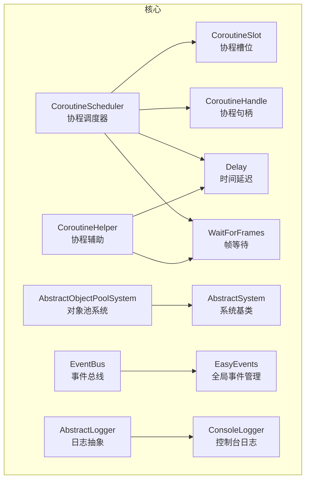
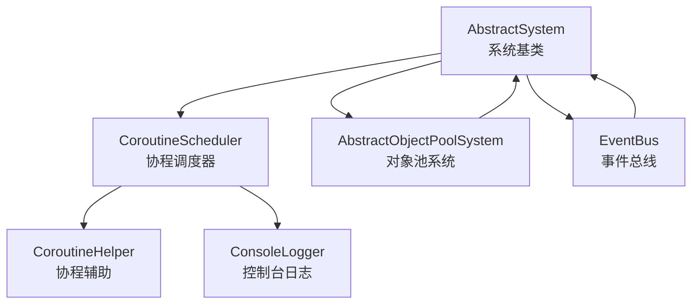
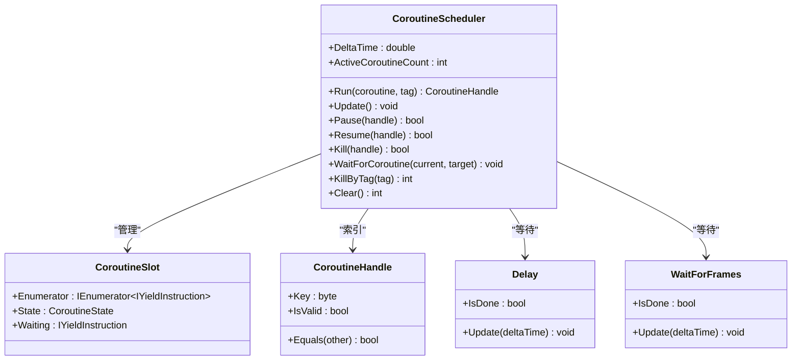
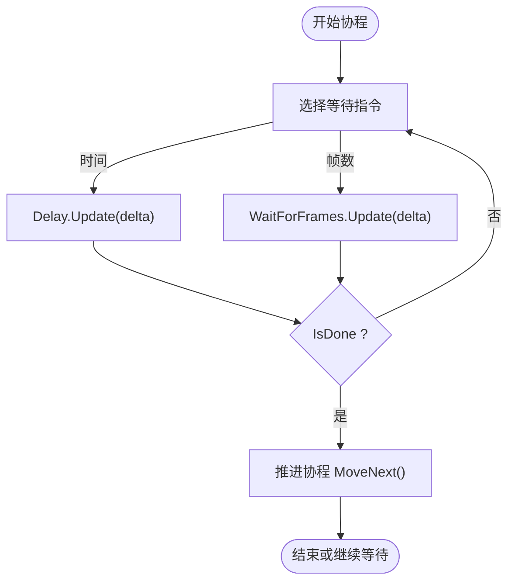
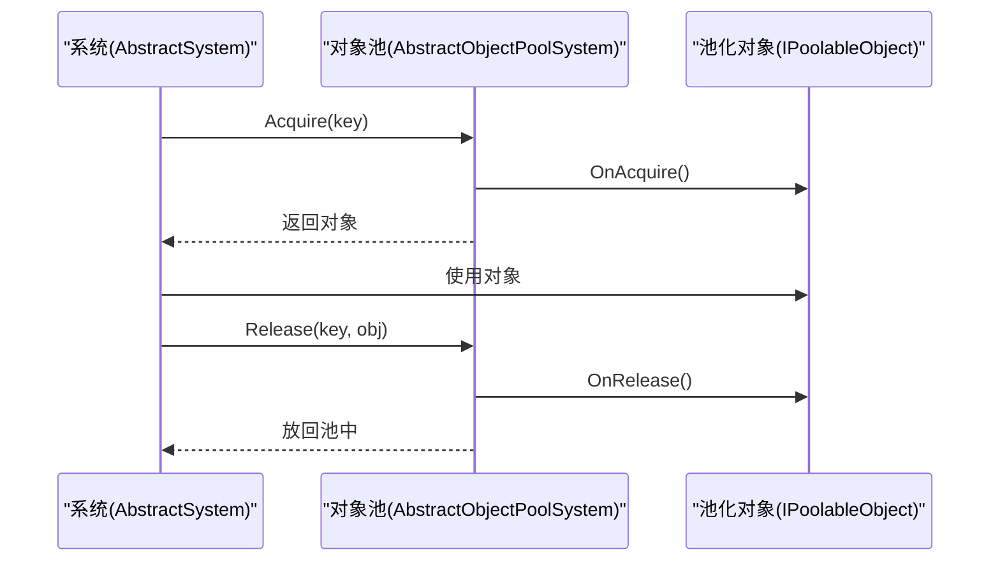
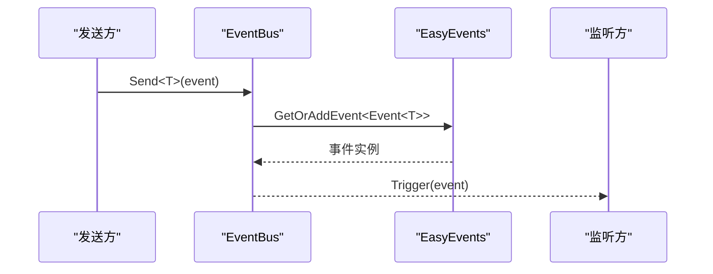
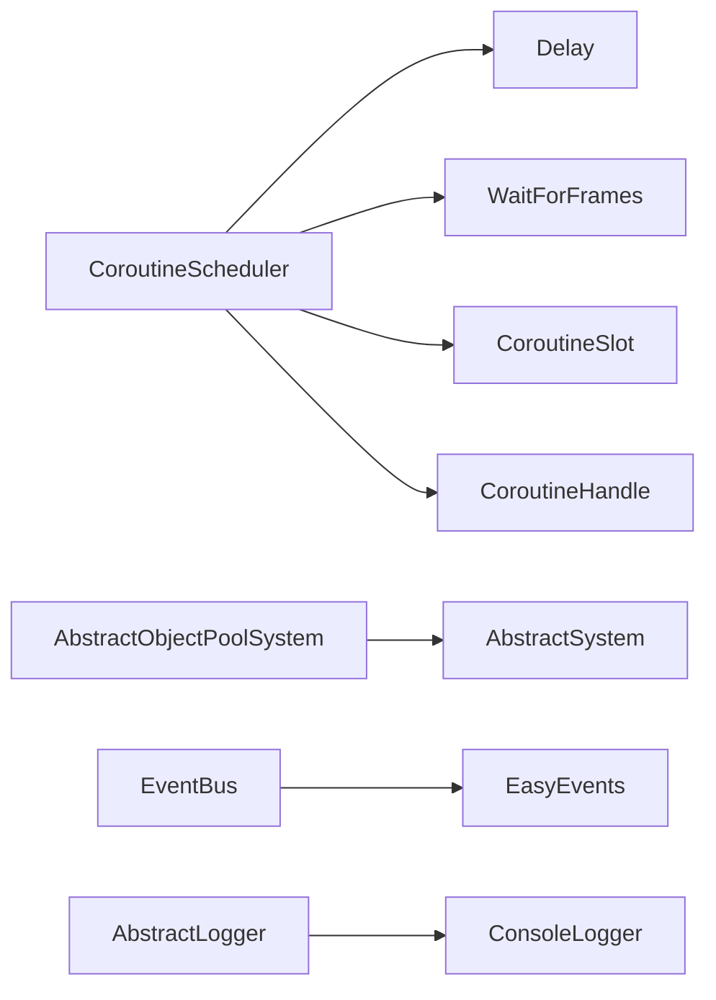

# 性能分析优化

<cite>
**本文引用的文件**   
- [CoroutineScheduler.cs](file://GFramework.Core/coroutine/CoroutineScheduler.cs)
- [CoroutineHelper.cs](file://GFramework.Core/coroutine/CoroutineHelper.cs)
- [CoroutineSlot.cs](file://GFramework.Core/coroutine/CoroutineSlot.cs)
- [CoroutineHandle.cs](file://GFramework.Core/coroutine/CoroutineHandle.cs)
- [Delay.cs](file://GFramework.Core/coroutine/Delay.cs)
- [WaitForFrames.cs](file://GFramework.Core/coroutine/WaitForFrames.cs)
- [AbstractObjectPoolSystem.cs](file://GFramework.Core/pool/AbstractObjectPoolSystem.cs)
- [EventBus.cs](file://GFramework.Core/events/EventBus.cs)
- [EasyEvents.cs](file://GFramework.Core/events/EasyEvents.cs)
- [AbstractSystem.cs](file://GFramework.Core/system/AbstractSystem.cs)
- [ConsoleLogger.cs](file://GFramework.Core/logging/ConsoleLogger.cs)
- [AbstractLogger.cs](file://GFramework.Core/logging/AbstractLogger.cs)
- [godot-integration.md](file://docs/tutorials/godot-integration.md)
</cite>

## 目录
1. [简介](#简介)
2. [项目结构](#项目结构)
3. [核心组件](#核心组件)
4. [架构总览](#架构总览)
5. [详细组件分析](#详细组件分析)
6. [依赖分析](#依赖分析)
7. [性能考量](#性能考量)
8. [故障排查指南](#故障排查指南)
9. [结论](#结论)
10. [附录](#附录)

## 简介
本教程面向使用 GFramework 的游戏开发者，系统讲解性能分析与优化方法，覆盖内存使用分析、CPU 性能监控、帧率优化策略，并结合 GFramework 的协程调度、对象池、事件总线与日志系统，给出可落地的优化实践与案例。读者将学会如何识别与定位性能瓶颈，掌握 Profiler 使用、性能指标监控与内存泄漏检测，以及在大规模敌人 AI、粒子系统、音频系统等场景下的优化策略。

## 项目结构
GFramework 采用分层与模块化设计，核心能力集中在 Core 层，Godot 集成位于 GFramework.Godot，文档与教程位于 docs 目录。与性能优化直接相关的模块包括：
- 协程调度：CoroutineScheduler、CoroutineHelper、Delay、WaitForFrames、CoroutineSlot、CoroutineHandle
- 对象池：AbstractObjectPoolSystem
- 事件系统：EventBus、EasyEvents
- 日志系统：AbstractLogger、ConsoleLogger
- 系统基类：AbstractSystem

**图表来源**
- [CoroutineScheduler.cs](file://GFramework.Core/coroutine/CoroutineScheduler.cs#L11-L392)
- [CoroutineHelper.cs](file://GFramework.Core/coroutine/CoroutineHelper.cs#L8-L101)
- [Delay.cs](file://GFramework.Core/coroutine/Delay.cs#L9-L29)
- [WaitForFrames.cs](file://GFramework.Core/coroutine/WaitForFrames.cs#L9-L29)
- [CoroutineSlot.cs](file://GFramework.Core/coroutine/CoroutineSlot.cs#L8-L24)
- [CoroutineHandle.cs](file://GFramework.Core/coroutine/CoroutineHandle.cs#L7-L94)
- [AbstractObjectPoolSystem.cs](file://GFramework.Core/pool/AbstractObjectPoolSystem.cs#L11-L86)
- [EventBus.cs](file://GFramework.Core/events/EventBus.cs#L8-L55)
- [EasyEvents.cs](file://GFramework.Core/events/EasyEvents.cs#L9-L85)
- [AbstractSystem.cs](file://GFramework.Core/system/AbstractSystem.cs#L13-L62)
- [AbstractLogger.cs](file://GFramework.Core/logging/AbstractLogger.cs#L10-L493)
- [ConsoleLogger.cs](file://GFramework.Core/logging/ConsoleLogger.cs#L10-L81)

**章节来源**
- [CoroutineScheduler.cs](file://GFramework.Core/coroutine/CoroutineScheduler.cs#L11-L392)
- [AbstractObjectPoolSystem.cs](file://GFramework.Core/pool/AbstractObjectPoolSystem.cs#L11-L86)
- [EventBus.cs](file://GFramework.Core/events/EventBus.cs#L8-L55)
- [AbstractSystem.cs](file://GFramework.Core/system/AbstractSystem.cs#L13-L62)
- [AbstractLogger.cs](file://GFramework.Core/logging/AbstractLogger.cs#L10-L493)
- [ConsoleLogger.cs](file://GFramework.Core/logging/ConsoleLogger.cs#L10-L81)

## 核心组件
- 协程调度器：集中管理协程生命周期、等待指令、暂停/恢复/终止、按标签批量终止与清空，具备 O(1) 槽位访问与 O(N) 遍历更新复杂度。
- 协程辅助：提供 WaitForSeconds、WaitForFrames、WaitUntil/While、DelayedCall、RepeatCallForever 等常用等待指令与封装。
- 对象池系统：基于键值的栈式池化，支持 Acquire/Release/Clear，与系统生命周期集成，显著降低 GC 压力。
- 事件系统：基于类型的安全事件总线，支持 Send/Register/UnRegister，便于解耦与低开销广播。
- 日志系统：统一日志抽象与控制台实现，支持多级别、格式化与异常输出，便于性能问题诊断与追踪。

**章节来源**
- [CoroutineScheduler.cs](file://GFramework.Core/coroutine/CoroutineScheduler.cs#L11-L392)
- [CoroutineHelper.cs](file://GFramework.Core/coroutine/CoroutineHelper.cs#L8-L101)
- [AbstractObjectPoolSystem.cs](file://GFramework.Core/pool/AbstractObjectPoolSystem.cs#L11-L86)
- [EventBus.cs](file://GFramework.Core/events/EventBus.cs#L8-L55)
- [AbstractLogger.cs](file://GFramework.Core/logging/AbstractLogger.cs#L10-L493)
- [ConsoleLogger.cs](file://GFramework.Core/logging/ConsoleLogger.cs#L10-L81)

## 架构总览
下图展示了性能相关模块在运行期的交互关系：系统通过协程调度器驱动更新循环，事件系统承载跨模块通信，对象池降低内存分配，日志系统贯穿性能观测与问题定位。

**图表来源**
- [AbstractSystem.cs](file://GFramework.Core/system/AbstractSystem.cs#L13-L62)
- [CoroutineScheduler.cs](file://GFramework.Core/coroutine/CoroutineScheduler.cs#L11-L392)
- [CoroutineHelper.cs](file://GFramework.Core/coroutine/CoroutineHelper.cs#L8-L101)
- [AbstractObjectPoolSystem.cs](file://GFramework.Core/pool/AbstractObjectPoolSystem.cs#L11-L86)
- [EventBus.cs](file://GFramework.Core/events/EventBus.cs#L8-L55)
- [ConsoleLogger.cs](file://GFramework.Core/logging/ConsoleLogger.cs#L10-L81)

## 详细组件分析

### 协程调度系统
- 设计要点
  - 槽位数组 + 字典元数据：O(1) 查找与更新，支持快速暂停/恢复/终止。
  - 等待指令链：Delay/WaitForFrames 等实现时间/帧等待，调度器统一推进。
  - 标签与等待队列：支持按标签批量终止与“等待协程完成后继续”的协作。
- 性能特征
  - Update 遍历槽位，平均 O(N)；等待指令短路减少无效 MoveNext。
  - Expand 采用倍增策略，摊销分配成本。
- 优化建议
  - 合理拆分长协程，避免单帧长时间阻塞。
  - 使用标签分组管理，便于批量回收。
  - 优先使用 WaitForFrames 进行帧级节流，降低 CPU 占用。

**图表来源**
- [CoroutineScheduler.cs](file://GFramework.Core/coroutine/CoroutineScheduler.cs#L11-L392)
- [CoroutineSlot.cs](file://GFramework.Core/coroutine/CoroutineSlot.cs#L8-L24)
- [CoroutineHandle.cs](file://GFramework.Core/coroutine/CoroutineHandle.cs#L7-L94)
- [Delay.cs](file://GFramework.Core/coroutine/Delay.cs#L9-L29)
- [WaitForFrames.cs](file://GFramework.Core/coroutine/WaitForFrames.cs#L9-L29)

**章节来源**
- [CoroutineScheduler.cs](file://GFramework.Core/coroutine/CoroutineScheduler.cs#L11-L392)
- [CoroutineSlot.cs](file://GFramework.Core/coroutine/CoroutineSlot.cs#L8-L24)
- [CoroutineHandle.cs](file://GFramework.Core/coroutine/CoroutineHandle.cs#L7-L94)
- [Delay.cs](file://GFramework.Core/coroutine/Delay.cs#L9-L29)
- [WaitForFrames.cs](file://GFramework.Core/coroutine/WaitForFrames.cs#L9-L29)

### 协程辅助与等待指令
- CoroutineHelper 提供 WaitForSeconds、WaitForOneFrame、WaitForFrames、WaitUntil/While、DelayedCall、RepeatCallForever 等，简化协程编写与复用。
- Delay/WaitForFrames 作为 IYieldInstruction 的典型实现，遵循 Update+IsDone 的等待协议，适合帧级与时间级节流。

**图表来源**
- [CoroutineHelper.cs](file://GFramework.Core/coroutine/CoroutineHelper.cs#L8-L101)
- [Delay.cs](file://GFramework.Core/coroutine/Delay.cs#L9-L29)
- [WaitForFrames.cs](file://GFramework.Core/coroutine/WaitForFrames.cs#L9-L29)

**章节来源**
- [CoroutineHelper.cs](file://GFramework.Core/coroutine/CoroutineHelper.cs#L8-L101)
- [Delay.cs](file://GFramework.Core/coroutine/Delay.cs#L9-L29)
- [WaitForFrames.cs](file://GFramework.Core/coroutine/WaitForFrames.cs#L9-L29)

### 对象池系统
- 抽象对象池通过字典维护多个栈式池，提供 Acquire/Release/Clear，生命周期与系统绑定，避免频繁 GC。
- 优化要点：预热池、限制池大小、彻底重置对象状态、确保释放闭环。

**图表来源**
- [AbstractObjectPoolSystem.cs](file://GFramework.Core/pool/AbstractObjectPoolSystem.cs#L11-L86)
- [AbstractSystem.cs](file://GFramework.Core/system/AbstractSystem.cs#L13-L62)

**章节来源**
- [AbstractObjectPoolSystem.cs](file://GFramework.Core/pool/AbstractObjectPoolSystem.cs#L11-L86)
- [AbstractSystem.cs](file://GFramework.Core/system/AbstractSystem.cs#L13-L62)

### 事件系统
- EventBus 提供类型安全的 Send/Register/UnRegister，EasyEvents 支持全局事件注册与获取，降低耦合与提升广播效率。
- 性能建议：避免在高频事件中做重型计算；必要时配合协程节流或对象池。

**图表来源**
- [EventBus.cs](file://GFramework.Core/events/EventBus.cs#L8-L55)
- [EasyEvents.cs](file://GFramework.Core/events/EasyEvents.cs#L9-L85)

**章节来源**
- [EventBus.cs](file://GFramework.Core/events/EventBus.cs#L8-L55)
- [EasyEvents.cs](file://GFramework.Core/events/EasyEvents.cs#L9-L85)

### 日志系统
- AbstractLogger 提供统一日志接口与级别判断，ConsoleLogger 实现控制台输出与彩色日志，便于性能问题诊断与追踪。
- 建议：仅在必要时输出高粒度日志，避免在热路径中频繁 IO。

**章节来源**
- [AbstractLogger.cs](file://GFramework.Core/logging/AbstractLogger.cs#L10-L493)
- [ConsoleLogger.cs](file://GFramework.Core/logging/ConsoleLogger.cs#L10-L81)

## 依赖分析
- 协程调度器依赖等待指令接口与时间源，内部通过槽位与元数据字典管理协程状态。
- 对象池系统依赖系统生命周期，确保销毁时清理池内对象。
- 事件系统与日志系统为横切关注点，被各系统模块广泛使用。

**图表来源**
- [CoroutineScheduler.cs](file://GFramework.Core/coroutine/CoroutineScheduler.cs#L11-L392)
- [Delay.cs](file://GFramework.Core/coroutine/Delay.cs#L9-L29)
- [WaitForFrames.cs](file://GFramework.Core/coroutine/WaitForFrames.cs#L9-L29)
- [CoroutineSlot.cs](file://GFramework.Core/coroutine/CoroutineSlot.cs#L8-L24)
- [CoroutineHandle.cs](file://GFramework.Core/coroutine/CoroutineHandle.cs#L7-L94)
- [AbstractObjectPoolSystem.cs](file://GFramework.Core/pool/AbstractObjectPoolSystem.cs#L11-L86)
- [AbstractSystem.cs](file://GFramework.Core/system/AbstractSystem.cs#L13-L62)
- [EventBus.cs](file://GFramework.Core/events/EventBus.cs#L8-L55)
- [EasyEvents.cs](file://GFramework.Core/events/EasyEvents.cs#L9-L85)
- [AbstractLogger.cs](file://GFramework.Core/logging/AbstractLogger.cs#L10-L493)
- [ConsoleLogger.cs](file://GFramework.Core/logging/ConsoleLogger.cs#L10-L81)

**章节来源**
- [CoroutineScheduler.cs](file://GFramework.Core/coroutine/CoroutineScheduler.cs#L11-L392)
- [AbstractObjectPoolSystem.cs](file://GFramework.Core/pool/AbstractObjectPoolSystem.cs#L11-L86)
- [EventBus.cs](file://GFramework.Core/events/EventBus.cs#L8-L55)
- [AbstractSystem.cs](file://GFramework.Core/system/AbstractSystem.cs#L13-L62)
- [AbstractLogger.cs](file://GFramework.Core/logging/AbstractLogger.cs#L10-L493)
- [ConsoleLogger.cs](file://GFramework.Core/logging/ConsoleLogger.cs#L10-L81)

## 性能考量
- 协程调度
  - 避免单帧执行过多协程，使用 WaitForFrames 或 Delay 进行分片。
  - 使用标签对协程分组，便于批量回收与统计。
  - 注意异常处理，防止异常导致协程卡死。
- 对象池
  - 预热常用池，减少首帧抖动。
  - 严格重置对象状态，避免“隐式引用”导致泄漏。
  - 限制池大小，避免内存膨胀。
- 事件与日志
  - 高频事件中避免重型计算，必要时异步化或延迟处理。
  - 控制台日志在热路径中应谨慎使用，避免阻塞主线程。
- 文档中的 Godot 集成实践
  - 使用计时器替代每帧更新，按性能模式动态调整更新频率。
  - 使用对象池与纹理图集优化内存与渲染。
  - 定期触发内存清理与 GC，监控内存阈值并告警。

**章节来源**
- [godot-integration.md](file://docs/tutorials/godot-integration.md#L796-L1032)

## 故障排查指南
- 协程卡死/泄漏
  - 检查是否有协程未正确完成或未被 Kill/Resume。
  - 使用标签批量终止可疑协程，核对 ActiveCoroutineCount。
  - 关注异常处理路径，避免 onError 导致的提前 Complete。
- GC 压力大
  - 使用对象池替换频繁创建的对象，确保释放闭环。
  - 监控池大小与对象状态重置是否彻底。
- 事件风暴
  - 减少高频事件的负载，必要时合并事件或降采样。
  - 使用协程节流或延迟处理。
- 日志噪声
  - 降低日志级别或关闭高粒度日志。
  - 将日志输出定向到文件而非控制台。

**章节来源**
- [CoroutineScheduler.cs](file://GFramework.Core/coroutine/CoroutineScheduler.cs#L341-L345)
- [AbstractObjectPoolSystem.cs](file://GFramework.Core/pool/AbstractObjectPoolSystem.cs#L61-L86)
- [EventBus.cs](file://GFramework.Core/events/EventBus.cs#L16-L54)
- [ConsoleLogger.cs](file://GFramework.Core/logging/ConsoleLogger.cs#L25-L38)

## 结论
通过协程调度的分片与等待指令、对象池的内存复用、事件系统的低耦合广播与日志系统的可观测性，GFramework 为游戏性能优化提供了坚实基础。结合文档中的 Godot 实践，开发者可在大规模敌人 AI、粒子系统与音频系统等场景中取得稳定帧率与更低的内存占用。

## 附录
- 性能指标建议
  - 帧耗时分布（渲染/逻辑/IO），GC 次数与回收量，活跃协程数，对象池命中率。
- 工具与流程
  - 使用 Unity/VS Profiler/Godot Profiler 进行采样与火焰图分析。
  - 建立自动化日志采集与告警，结合对象池统计与协程计数进行回归对比。