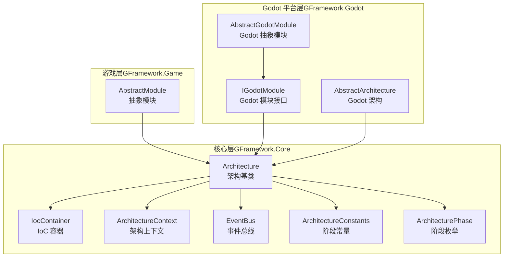
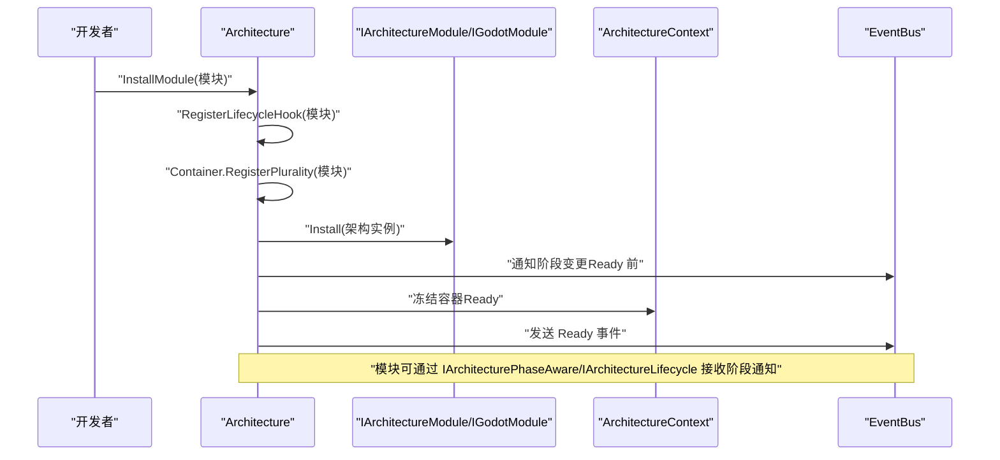
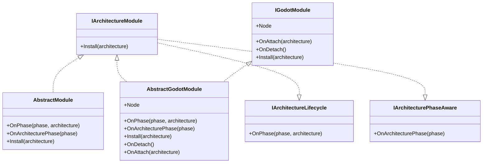
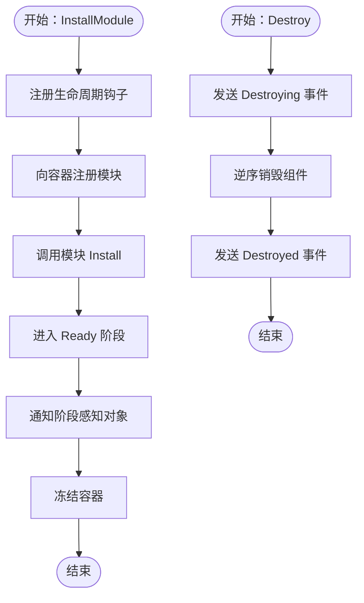
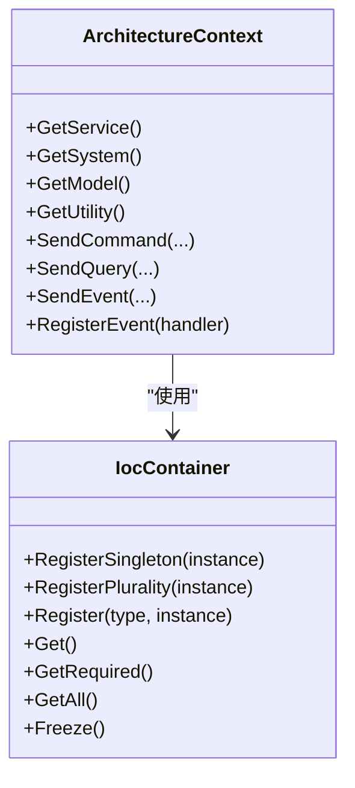
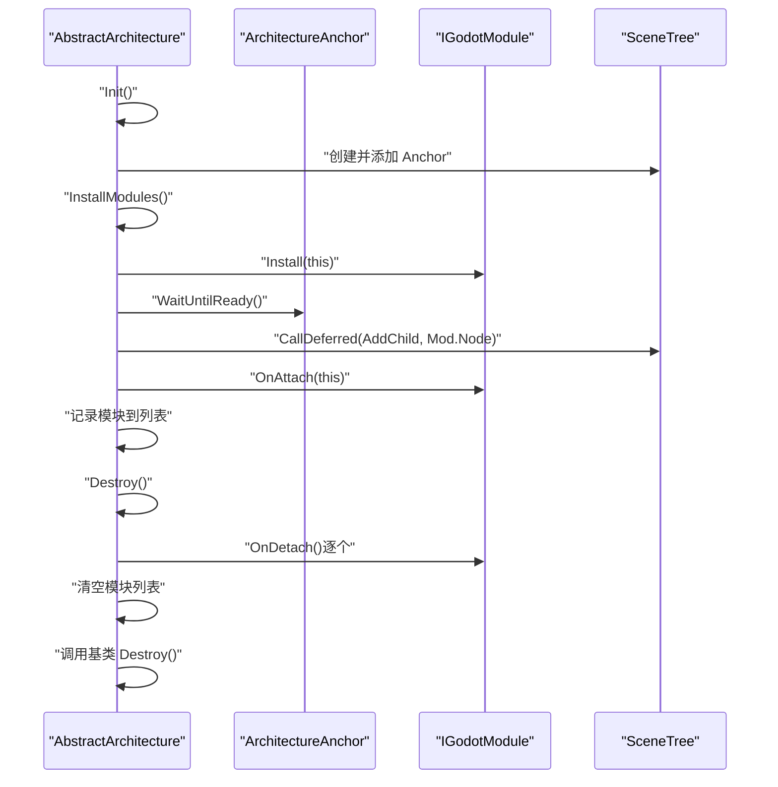
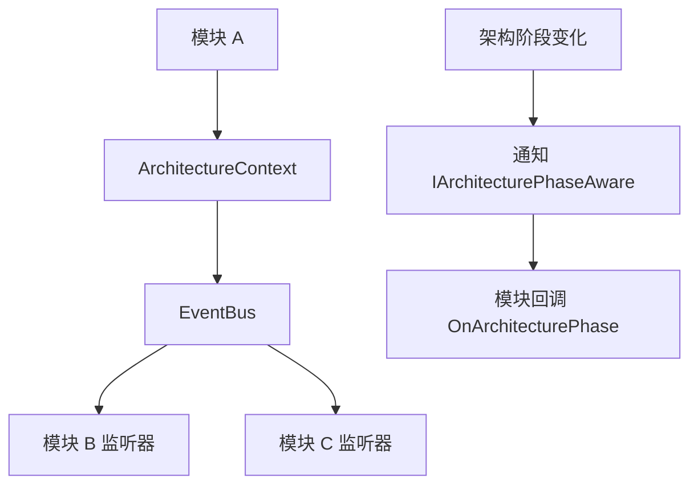
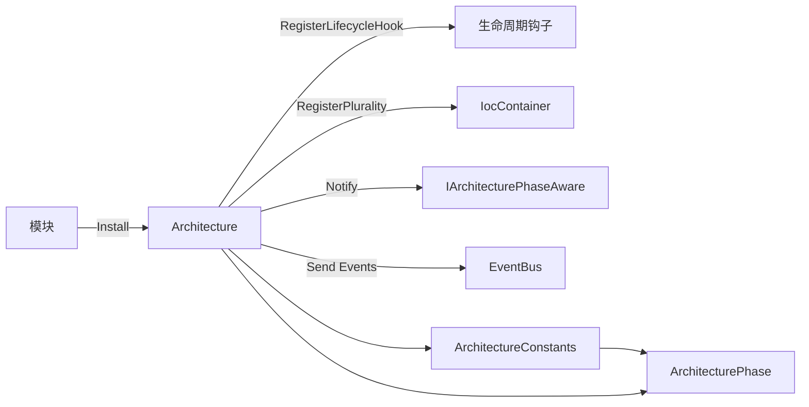

# 插件系统开发

<cite>
**本文引用的文件**
- [IArchitectureModule.cs](file://GFramework.Core.Abstractions/architecture/IArchitectureModule.cs)
- [AbstractModule.cs](file://GFramework.Game/architecture/AbstractModule.cs)
- [IGodotModule.cs](file://GFramework.Godot/architecture/IGodotModule.cs)
- [AbstractGodotModule.cs](file://GFramework.Godot/architecture/AbstractGodotModule.cs)
- [Architecture.cs](file://GFramework.Core/architecture/Architecture.cs)
- [ArchitectureConstants.cs](file://GFramework.Core/architecture/ArchitectureConstants.cs)
- [ArchitectureContext.cs](file://GFramework.Core/architecture/ArchitectureContext.cs)
- [IocContainer.cs](file://GFramework.Core/ioc/IocContainer.cs)
- [AbstractArchitecture.cs](file://GFramework.Godot/architecture/AbstractArchitecture.cs)
- [ArchitecturePhase.cs](file://GFramework.Core.Abstractions/enums/ArchitecturePhase.cs)
- [EventBus.cs](file://GFramework.Core/events/EventBus.cs)
- [README.md（GFramework.Core）](file://GFramework.Core/README.md)
- [TestArchitectureBase.cs](file://GFramework.Core.Tests/architecture/TestArchitectureBase.cs)
- [AsyncTestArchitecture.cs](file://GFramework.Core.Tests/architecture/AsyncTestArchitecture.cs)
- [SyncTestArchitecture.cs](file://GFramework.Core.Tests/architecture/SyncTestArchitecture.cs)
</cite>

## 目录
1. [简介](#简介)
2. [项目结构](#项目结构)
3. [核心组件](#核心组件)
4. [架构总览](#架构总览)
5. [详细组件分析](#详细组件分析)
6. [依赖分析](#依赖分析)
7. [性能考虑](#性能考虑)
8. [故障排查指南](#故障排查指南)
9. [结论](#结论)
10. [附录](#附录)

## 简介
本教程面向希望在 GFramework 中开发“插件系统”的开发者，系统讲解模块化架构的实现原理与工程实践，涵盖模块生命周期管理、动态加载与卸载、模块间通信、服务发现与依赖注入、热插拔与模块数据共享/事件传递等主题。教程以 GFramework.Core 为核心，结合 Godot 平台扩展，给出可落地的实现步骤与最佳实践。

## 项目结构
GFramework 将“插件系统”抽象为“架构模块”，通过统一的生命周期与依赖注入容器实现模块的安装、注册、阶段通知与销毁。Godot 平台提供了基于节点的模块扩展能力，支持热插拔与场景树生命周期绑定。

**图表来源**
- [Architecture.cs](file://GFramework.Core/architecture/Architecture.cs#L23-L569)
- [IocContainer.cs](file://GFramework.Core/ioc/IocContainer.cs#L12-L373)
- [ArchitectureContext.cs](file://GFramework.Core/architecture/ArchitectureContext.cs#L16-L225)
- [EventBus.cs](file://GFramework.Core/events/EventBus.cs#L8-L55)
- [ArchitectureConstants.cs](file://GFramework.Core/architecture/ArchitectureConstants.cs#L9-L54)
- [ArchitecturePhase.cs](file://GFramework.Core.Abstractions/enums/ArchitecturePhase.cs#L10-L66)
- [AbstractModule.cs](file://GFramework.Game/architecture/AbstractModule.cs#L9-L33)
- [IGodotModule.cs](file://GFramework.Godot/architecture/IGodotModule.cs#L10-L27)
- [AbstractGodotModule.cs](file://GFramework.Godot/architecture/AbstractGodotModule.cs#L11-L55)
- [AbstractArchitecture.cs](file://GFramework.Godot/architecture/AbstractArchitecture.cs#L14-L140)

**章节来源**
- [README.md（GFramework.Core）](file://GFramework.Core/README.md#L1-L508)

## 核心组件
- 架构模块接口与实现
  - IArchitectureModule：定义模块安装到架构的标准方法与生命周期感知。
  - AbstractModule（游戏层）：提供默认的阶段回调空实现，便于继承扩展。
  - IGodotModule / AbstractGodotModule（Godot 层）：在架构基础上增加节点关联、附加/分离回调，适配 Godot 场景树生命周期。
- 架构基类 Architecture
  - 提供 InstallModule、RegisterSystem/Model/Utility、Initialize/Destroy、阶段通知与生命周期钩子注册。
  - 通过 IocContainer 管理组件注册与获取，通过 ArchitectureContext 提供统一的服务访问入口。
- 平台扩展 AbstractArchitecture
  - 将架构绑定到 Godot 场景树生命周期，支持 InstallGodotModule 动态安装 Godot 模块节点并触发 OnAttach/OnDetach。
- 事件与阶段
  - EventBus 提供事件发布/订阅；ArchitectureConstants/ArchitecturePhase 定义阶段顺序与转换规则。

**章节来源**
- [IArchitectureModule.cs](file://GFramework.Core.Abstractions/architecture/IArchitectureModule.cs#L7-L14)
- [AbstractModule.cs](file://GFramework.Game/architecture/AbstractModule.cs#L9-L33)
- [IGodotModule.cs](file://GFramework.Godot/architecture/IGodotModule.cs#L10-L27)
- [AbstractGodotModule.cs](file://GFramework.Godot/architecture/AbstractGodotModule.cs#L11-L55)
- [Architecture.cs](file://GFramework.Core/architecture/Architecture.cs#L38-L48)
- [AbstractArchitecture.cs](file://GFramework.Godot/architecture/AbstractArchitecture.cs#L56-L68)
- [ArchitectureConstants.cs](file://GFramework.Core/architecture/ArchitectureConstants.cs#L38-L54)
- [ArchitecturePhase.cs](file://GFramework.Core.Abstractions/enums/ArchitecturePhase.cs#L10-L66)
- [EventBus.cs](file://GFramework.Core/events/EventBus.cs#L8-L55)

## 架构总览
下图展示了模块安装、生命周期与事件通知的关键流程，体现“插件系统”的动态性与解耦性。

**图表来源**
- [Architecture.cs](file://GFramework.Core/architecture/Architecture.cs#L38-L48)
- [Architecture.cs](file://GFramework.Core/architecture/Architecture.cs#L189-L196)
- [Architecture.cs](file://GFramework.Core/architecture/Architecture.cs#L202-L209)
- [Architecture.cs](file://GFramework.Core/architecture/Architecture.cs#L558-L566)
- [ArchitectureContext.cs](file://GFramework.Core/architecture/ArchitectureContext.cs#L26-L41)

## 详细组件分析

### 模块接口与生命周期
- 模块接口 IArchitectureModule
  - Install(IArchitecture)：模块安装到架构的入口。
  - 继承 IArchitectureLifecycle 与 IArchitecturePhaseAware，可接收阶段变化通知。
- 抽象模块 AbstractModule（游戏层）
  - 提供 OnPhase/OnArchitecturePhase 默认空实现，便于按需覆盖。
- Godot 模块接口 IGodotModule / AbstractGodotModule
  - Node：模块关联的 Godot 节点。
  - OnAttach/OnDetach：模块与场景树节点的附加/分离回调，支持热插拔。

**图表来源**
- [IArchitectureModule.cs](file://GFramework.Core.Abstractions/architecture/IArchitectureModule.cs#L7-L14)
- [AbstractModule.cs](file://GFramework.Game/architecture/AbstractModule.cs#L9-L33)
- [IGodotModule.cs](file://GFramework.Godot/architecture/IGodotModule.cs#L10-L27)
- [AbstractGodotModule.cs](file://GFramework.Godot/architecture/AbstractGodotModule.cs#L11-L55)

**章节来源**
- [IArchitectureModule.cs](file://GFramework.Core.Abstractions/architecture/IArchitectureModule.cs#L7-L14)
- [AbstractModule.cs](file://GFramework.Game/architecture/AbstractModule.cs#L9-L33)
- [IGodotModule.cs](file://GFramework.Godot/architecture/IGodotModule.cs#L10-L27)
- [AbstractGodotModule.cs](file://GFramework.Godot/architecture/AbstractGodotModule.cs#L11-L55)

### 架构安装与生命周期管理
- InstallModule
  - 注册生命周期钩子、向容器注册模块、调用模块 Install 并记录日志。
- Initialize/Destroy
  - Initialize 分阶段初始化工具、模型、系统，冻结容器并进入 Ready，发送 Ready 事件。
  - Destroy 逆序销毁可销毁组件，发送销毁事件。
- 阶段转换与通知
  - EnterPhase 校验转换合法性，通知 IArchitecturePhaseAware 与生命周期钩子。

**图表来源**
- [Architecture.cs](file://GFramework.Core/architecture/Architecture.cs#L38-L48)
- [Architecture.cs](file://GFramework.Core/architecture/Architecture.cs#L142-L157)
- [Architecture.cs](file://GFramework.Core/architecture/Architecture.cs#L216-L223)
- [Architecture.cs](file://GFramework.Core/architecture/Architecture.cs#L558-L566)
- [Architecture.cs](file://GFramework.Core/architecture/Architecture.cs#L357-L396)

**章节来源**
- [Architecture.cs](file://GFramework.Core/architecture/Architecture.cs#L38-L48)
- [Architecture.cs](file://GFramework.Core/architecture/Architecture.cs#L142-L157)
- [Architecture.cs](file://GFramework.Core/architecture/Architecture.cs#L216-L223)
- [Architecture.cs](file://GFramework.Core/architecture/Architecture.cs#L558-L566)
- [Architecture.cs](file://GFramework.Core/architecture/Architecture.cs#L357-L396)

### 服务发现与依赖注入
- IocContainer
  - Register/RegisterPlurality：注册单例或多实现实例，按类型索引。
  - Get/GetRequired/GetAll：按类型获取实例，支持排序获取。
  - Freeze：冻结容器，禁止后续注册，保证运行期稳定性。
- ArchitectureContext
  - 通过容器缓存服务实例，提供 GetService/GetSystem/GetModel/GetUtility。
  - 统一封装命令、查询、事件的发送与注册。

**图表来源**
- [IocContainer.cs](file://GFramework.Core/ioc/IocContainer.cs#L69-L123)
- [IocContainer.cs](file://GFramework.Core/ioc/IocContainer.cs#L211-L289)
- [IocContainer.cs](file://GFramework.Core/ioc/IocContainer.cs#L357-L370)
- [ArchitectureContext.cs](file://GFramework.Core/architecture/ArchitectureContext.cs#L26-L41)
- [ArchitectureContext.cs](file://GFramework.Core/architecture/ArchitectureContext.cs#L82-L105)
- [ArchitectureContext.cs](file://GFramework.Core/architecture/ArchitectureContext.cs#L115-L160)
- [ArchitectureContext.cs](file://GFramework.Core/architecture/ArchitectureContext.cs#L169-L212)

**章节来源**
- [IocContainer.cs](file://GFramework.Core/ioc/IocContainer.cs#L69-L123)
- [IocContainer.cs](file://GFramework.Core/ioc/IocContainer.cs#L211-L289)
- [IocContainer.cs](file://GFramework.Core/ioc/IocContainer.cs#L357-L370)
- [ArchitectureContext.cs](file://GFramework.Core/architecture/ArchitectureContext.cs#L26-L41)
- [ArchitectureContext.cs](file://GFramework.Core/architecture/ArchitectureContext.cs#L82-L105)
- [ArchitectureContext.cs](file://GFramework.Core/architecture/ArchitectureContext.cs#L115-L160)
- [ArchitectureContext.cs](file://GFramework.Core/architecture/ArchitectureContext.cs#L169-L212)

### Godot 平台的热插拔与节点管理
- AbstractArchitecture
  - Init 中创建 ArchitectureAnchor 并绑定到 SceneTree，确保场景销毁时架构能正确清理。
  - InstallGodotModule：安装模块节点、等待锚点就绪、延迟添加到场景树、调用 OnAttach 并记录模块。
  - Destroy：遍历模块调用 OnDetach 并清空列表，再调用基类 Destroy。

**图表来源**
- [AbstractArchitecture.cs](file://GFramework.Godot/architecture/AbstractArchitecture.cs#L56-L68)
- [AbstractArchitecture.cs](file://GFramework.Godot/architecture/AbstractArchitecture.cs#L74-L91)
- [AbstractArchitecture.cs](file://GFramework.Godot/architecture/AbstractArchitecture.cs#L100-L119)
- [AbstractArchitecture.cs](file://GFramework.Godot/architecture/AbstractArchitecture.cs#L127-L139)

**章节来源**
- [AbstractArchitecture.cs](file://GFramework.Godot/architecture/AbstractArchitecture.cs#L56-L68)
- [AbstractArchitecture.cs](file://GFramework.Godot/architecture/AbstractArchitecture.cs#L74-L91)
- [AbstractArchitecture.cs](file://GFramework.Godot/architecture/AbstractArchitecture.cs#L100-L119)
- [AbstractArchitecture.cs](file://GFramework.Godot/architecture/AbstractArchitecture.cs#L127-L139)

### 模块间通信与事件传递
- 事件总线 EventBus
  - Send<T>/Send<T>(T)：发送事件。
  - Register<T>/UnRegister<T>：注册/注销事件监听。
- ArchitectureContext 对事件的封装
  - SendEvent/RegisterEvent/UnRegisterEvent，统一通过容器获取 IEventBus。
- 阶段感知与生命周期钩子
  - IArchitecturePhaseAware：接收架构阶段变化。
  - IArchitectureLifecycle：接收模块级阶段通知。

**图表来源**
- [EventBus.cs](file://GFramework.Core/events/EventBus.cs#L16-L54)
- [ArchitectureContext.cs](file://GFramework.Core/architecture/ArchitectureContext.cs#L169-L212)
- [Architecture.cs](file://GFramework.Core/architecture/Architecture.cs#L189-L196)
- [Architecture.cs](file://GFramework.Core/architecture/Architecture.cs#L202-L209)

**章节来源**
- [EventBus.cs](file://GFramework.Core/events/EventBus.cs#L16-L54)
- [ArchitectureContext.cs](file://GFramework.Core/architecture/ArchitectureContext.cs#L169-L212)
- [Architecture.cs](file://GFramework.Core/architecture/Architecture.cs#L189-L196)
- [Architecture.cs](file://GFramework.Core/architecture/Architecture.cs#L202-L209)

### 创建自定义模块与注册依赖
- 创建自定义模块
  - 游戏层：继承 AbstractModule，实现 Install 并按需覆盖 OnPhase/OnArchitecturePhase。
  - Godot 层：实现 IGodotModule 或继承 AbstractGodotModule，提供 Node 并实现 OnAttach/OnDetach。
- 注册模块
  - 在架构 Init 中调用 InstallModule 注册模块，或在 Godot 架构中使用 InstallGodotModule。
- 依赖注入与服务发现
  - 通过 ArchitectureContext.GetService/GetSystem/GetModel/GetUtility 获取服务。
  - 在模块 Install 中向容器注册自身或相关组件，实现模块内依赖注入。

**章节来源**
- [AbstractModule.cs](file://GFramework.Game/architecture/AbstractModule.cs#L9-L33)
- [IGodotModule.cs](file://GFramework.Godot/architecture/IGodotModule.cs#L10-L27)
- [AbstractGodotModule.cs](file://GFramework.Godot/architecture/AbstractGodotModule.cs#L11-L55)
- [Architecture.cs](file://GFramework.Core/architecture/Architecture.cs#L38-L48)
- [AbstractArchitecture.cs](file://GFramework.Godot/architecture/AbstractArchitecture.cs#L100-L119)
- [ArchitectureContext.cs](file://GFramework.Core/architecture/ArchitectureContext.cs#L26-L41)

## 依赖分析
- 模块与架构
  - 模块通过 Install(IArchitecture) 与架构建立联系，架构通过 RegisterLifecycleHook/Container.RegisterPlurality 管理模块。
- 架构与容器
  - ArchitectureContext 通过 IocContainer 缓存与获取服务，避免重复解析。
- 架构与事件
  - 架构阶段变化通过 EventBus 发布 Ready/Destroying/Destroyed 等事件，模块可订阅。
- 阶段与转换
  - ArchitectureConstants/ArchitecturePhase 定义线性阶段序列与允许转换，EnterPhase 校验转换合法性。

**图表来源**
- [Architecture.cs](file://GFramework.Core/architecture/Architecture.cs#L38-L48)
- [Architecture.cs](file://GFramework.Core/architecture/Architecture.cs#L216-L223)
- [Architecture.cs](file://GFramework.Core/architecture/Architecture.cs#L189-L196)
- [Architecture.cs](file://GFramework.Core/architecture/Architecture.cs#L558-L566)
- [ArchitectureConstants.cs](file://GFramework.Core/architecture/ArchitectureConstants.cs#L38-L54)
- [ArchitecturePhase.cs](file://GFramework.Core.Abstractions/enums/ArchitecturePhase.cs#L10-L66)

**章节来源**
- [Architecture.cs](file://GFramework.Core/architecture/Architecture.cs#L38-L48)
- [Architecture.cs](file://GFramework.Core/architecture/Architecture.cs#L216-L223)
- [Architecture.cs](file://GFramework.Core/architecture/Architecture.cs#L189-L196)
- [Architecture.cs](file://GFramework.Core/architecture/Architecture.cs#L558-L566)
- [ArchitectureConstants.cs](file://GFramework.Core/architecture/ArchitectureConstants.cs#L38-L54)
- [ArchitecturePhase.cs](file://GFramework.Core.Abstractions/enums/ArchitecturePhase.cs#L10-L66)

## 性能考虑
- 容器冻结与并发
  - 在 Ready 阶段冻结容器，避免运行期注册带来的竞争与不确定性。
  - IocContainer 使用 ReaderWriterLockSlim 保护读写，降低锁竞争。
- 初始化顺序与分组
  - Architecture 按阶段分组初始化工具、模型、系统，减少跨阶段依赖导致的初始化开销。
- 事件与回调
  - EventBus 基于类型事件系统，避免字符串键带来的性能损耗。
- Godot 热插拔
  - InstallGodotModule 使用 CallDeferred 延迟添加节点，避免主线程阻塞。

**章节来源**
- [IocContainer.cs](file://GFramework.Core/ioc/IocContainer.cs#L21-L21)
- [IocContainer.cs](file://GFramework.Core/ioc/IocContainer.cs#L357-L370)
- [Architecture.cs](file://GFramework.Core/architecture/Architecture.cs#L264-L330)
- [AbstractArchitecture.cs](file://GFramework.Godot/architecture/AbstractArchitecture.cs#L100-L119)

## 故障排查指南
- 阶段转换异常
  - 现象：非法阶段转换抛出异常。
  - 排查：确认 ArchitectureConstants/ArchitecturePhase 的转换规则，避免跳过必要阶段。
- 注册时机错误
  - 现象：在 Ready 之后注册组件抛出异常。
  - 排查：在 Init 中完成所有注册，或调整配置允许后期注册。
- 容器冻结后注册
  - 现象：冻结后注册抛出异常。
  - 排查：确认冻结时机与注册顺序，避免在冻结后再次注册。
- 模块未正确卸载
  - 现象：销毁阶段未触发或资源未释放。
  - 排查：Godot 架构中确保 InstallGodotModule 安装的模块在 Destroy 中调用 OnDetach。
- 事件未收到
  - 现象：模块未收到阶段或 Ready 事件。
  - 排查：确认模块实现 IArchitecturePhaseAware/IArchitectureLifecycle，且在 Install 中正确注册。

**章节来源**
- [Architecture.cs](file://GFramework.Core/architecture/Architecture.cs#L164-L183)
- [Architecture.cs](file://GFramework.Core/architecture/Architecture.cs#L407-L414)
- [IocContainer.cs](file://GFramework.Core/ioc/IocContainer.cs#L132-L137)
- [AbstractArchitecture.cs](file://GFramework.Godot/architecture/AbstractArchitecture.cs#L127-L139)

## 结论
GFramework 的“插件系统”以模块为中心，通过统一的生命周期、依赖注入与事件系统实现高内聚、低耦合的扩展能力。结合 Godot 平台的节点生命周期，可实现真正的热插拔与模块化 UI/逻辑扩展。建议在实际项目中：
- 将功能拆分为细粒度模块，明确 Install 与 OnAttach/OnDetach 的职责边界。
- 使用 ArchitectureContext 与 IocContainer 进行服务发现与依赖注入，避免硬编码耦合。
- 严格遵守阶段顺序与转换规则，确保初始化与销毁的确定性。
- 通过事件系统实现模块间通信，避免直接引用造成循环依赖。

## 附录
- 快速开始（参考）
  - 定义架构：在 Init 中注册模型、系统与工具。
  - 定义模块：继承 AbstractModule 或实现 IGodotModule，在 Install 中注册服务与监听。
  - 启动架构：调用 Initialize/InitializeAsync，等待 Ready 事件。
- 测试架构示例
  - TestArchitectureBase/SyncTestArchitecture/AsyncTestArchitecture 展示了阶段历史记录与 Ready 事件的使用方式。

**章节来源**
- [README.md（GFramework.Core）](file://GFramework.Core/README.md#L125-L146)
- [README.md（GFramework.Core）](file://GFramework.Core/README.md#L155-L188)
- [README.md（GFramework.Core）](file://GFramework.Core/README.md#L196-L220)
- [README.md（GFramework.Core）](file://GFramework.Core/README.md#L228-L260)
- [TestArchitectureBase.cs](file://GFramework.Core.Tests/architecture/TestArchitectureBase.cs#L41-L57)
- [AsyncTestArchitecture.cs](file://GFramework.Core.Tests/architecture/AsyncTestArchitecture.cs#L14-L21)
- [SyncTestArchitecture.cs](file://GFramework.Core.Tests/architecture/SyncTestArchitecture.cs#L14-L19)