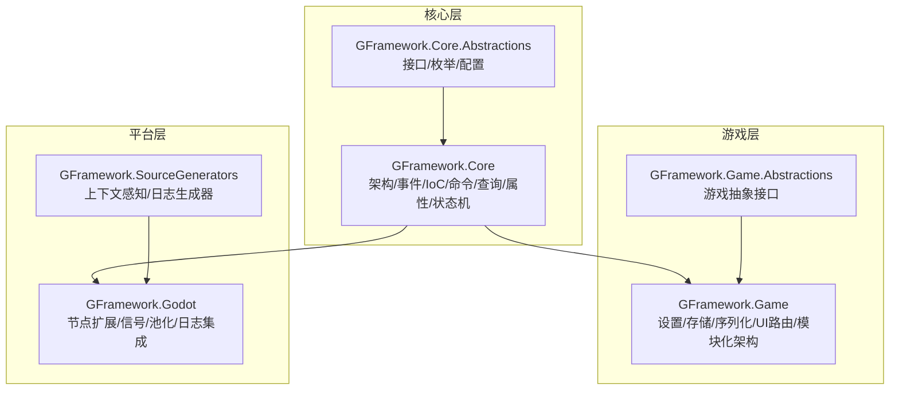
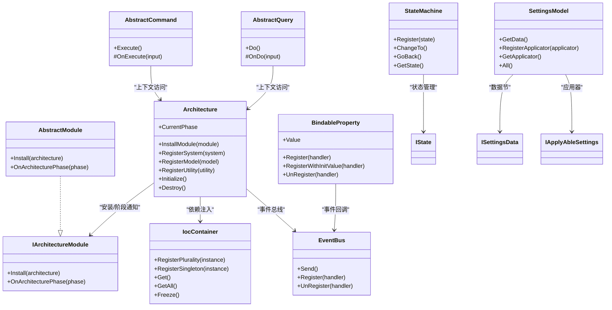
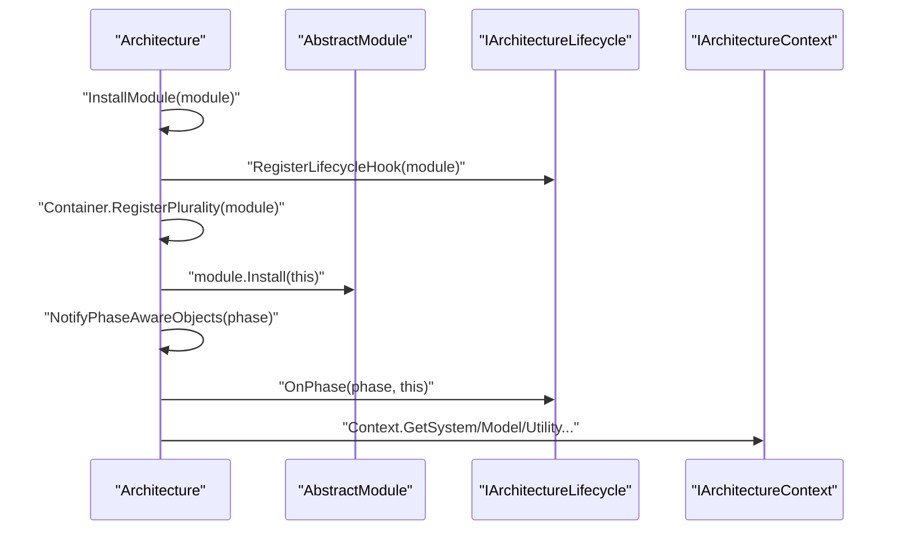
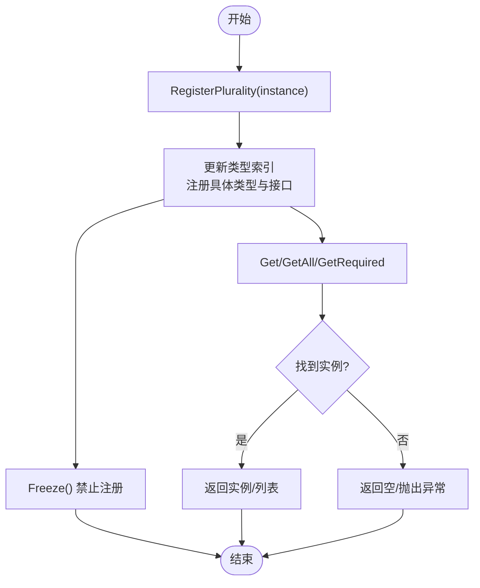
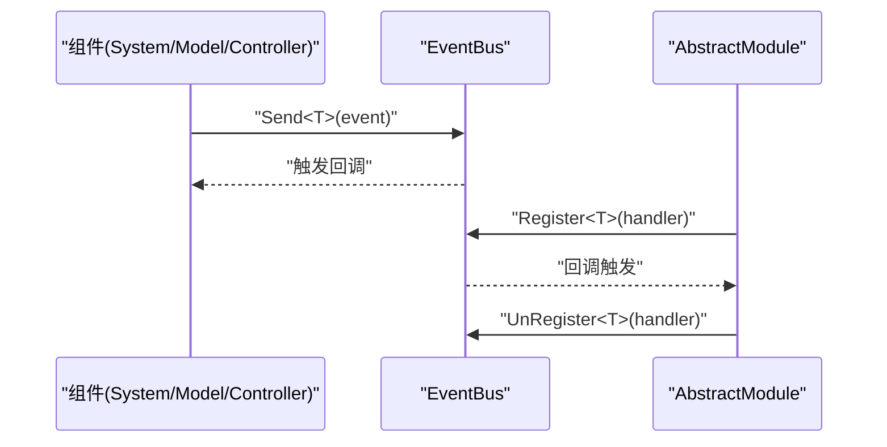
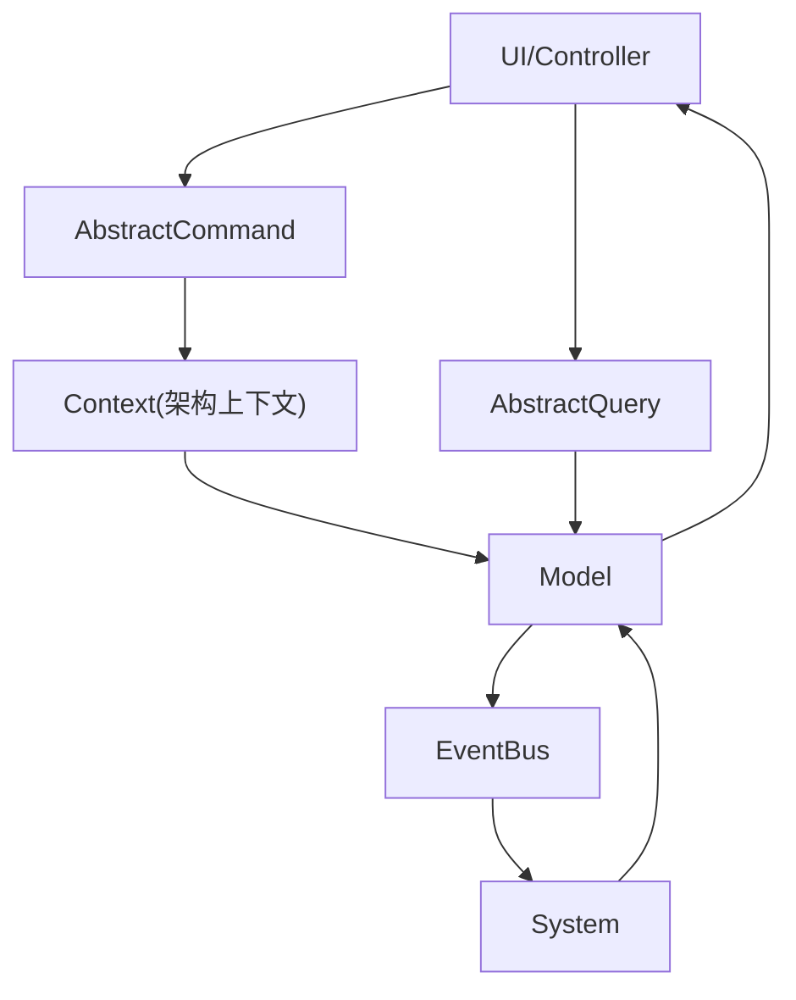
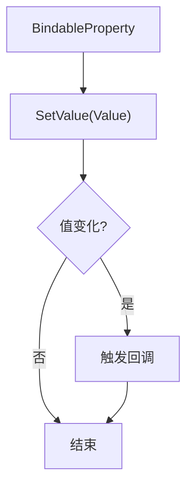
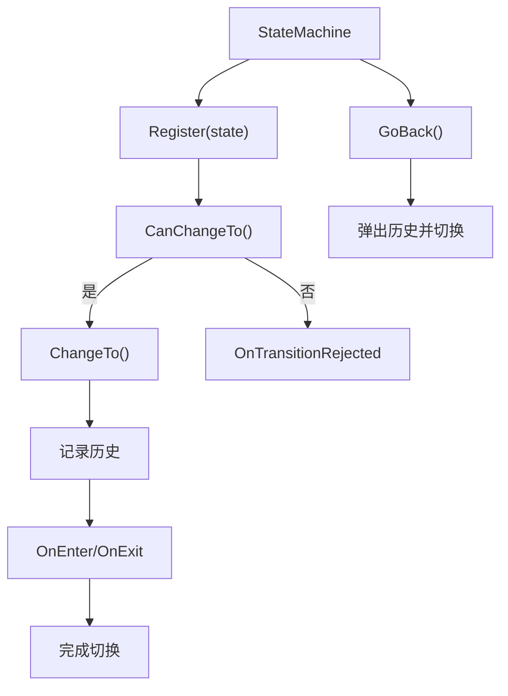
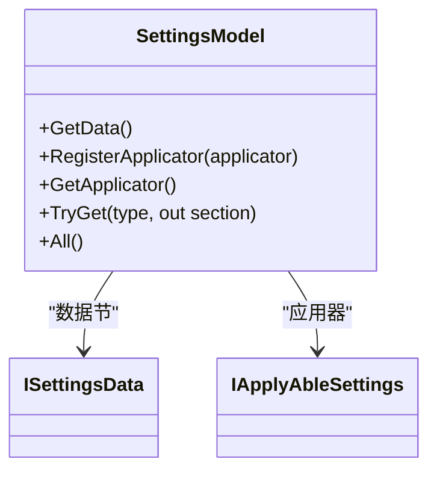
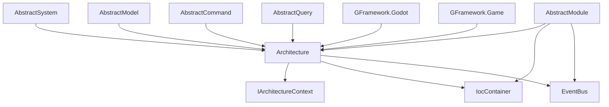

# 模块化设计

<cite>
**本文引用的文件**
- [README.md](file://GFramework.Core/README.md)
- [README.md](file://GFramework.Core.Abstractions/README.md)
- [README.md](file://GFramework.Game/README.md)
- [README.md](file://GFramework.Godot/README.md)
- [Architecture.cs](file://GFramework.Core/architecture/Architecture.cs)
- [IocContainer.cs](file://GFramework.Core/ioc/IocContainer.cs)
- [EventBus.cs](file://GFramework.Core/events/EventBus.cs)
- [AbstractModule.cs](file://GFramework.Game/architecture/AbstractModule.cs)
- [IArchitectureModule.cs](file://GFramework.Core.Abstractions/architecture/IArchitectureModule.cs)
- [AbstractModel.cs](file://GFramework.Core/model/AbstractModel.cs)
- [AbstractSystem.cs](file://GFramework.Core/system/AbstractSystem.cs)
- [AbstractCommand.cs](file://GFramework.Core/command/AbstractCommand.cs)
- [AbstractQuery.cs](file://GFramework.Core/query/AbstractQuery.cs)
- [BindableProperty.cs](file://GFramework.Core/property/BindableProperty.cs)
- [StateMachine.cs](file://GFramework.Core/state/StateMachine.cs)
- [SettingsModel.cs](file://GFramework.Game/setting/SettingsModel.cs)
</cite>

## 目录
1. [简介](#简介)
2. [项目结构](#项目结构)
3. [核心组件](#核心组件)
4. [架构总览](#架构总览)
5. [详细组件分析](#详细组件分析)
6. [依赖分析](#依赖分析)
7. [性能考虑](#性能考虑)
8. [故障排查指南](#故障排查指南)
9. [结论](#结论)
10. [附录](#附录)

## 简介
本教程围绕 GFramework 的模块化设计展开，系统讲解模块化架构的设计原则与实现策略，包括关注点分离、依赖注入、接口抽象、事件驱动与生命周期管理等核心概念。教程将结合 GFramework.Core、GFramework.Core.Abstractions、GFramework.Game、GFramework.Godot 等模块，给出可复用的模块组件设计思路、模块间解耦策略、模块生命周期管理方法，并说明在大型游戏项目中的应用实践，涵盖功能模块划分、协作模式与版本兼容性管理。最后提供最佳实践与常见问题的解决方案。

## 项目结构
GFramework 采用分层与模块化相结合的组织方式：
- GFramework.Core：平台无关的核心框架，提供架构、IoC、事件、命令/查询、属性绑定、状态机等通用能力。
- GFramework.Core.Abstractions：核心抽象契约，定义接口、枚举与配置，确保可移植性与可替换性。
- GFramework.Game：游戏特定功能模块，提供设置、存储、序列化、UI 路由等游戏开发常用能力，并内置模块化架构。
- GFramework.Godot：Godot 平台集成模块，提供节点扩展、信号桥接、节点池化、日志集成等能力，与核心框架深度结合。

图表来源
- [README.md](file://GFramework.Core/README.md#L16-L508)
- [README.md](file://GFramework.Core.Abstractions/README.md#L1-L522)
- [README.md](file://GFramework.Game/README.md#L1-L1402)
- [README.md](file://GFramework.Godot/README.md#L1-L893)

章节来源
- [README.md](file://GFramework.Core/README.md#L16-L508)
- [README.md](file://GFramework.Core.Abstractions/README.md#L1-L522)
- [README.md](file://GFramework.Game/README.md#L1-L1402)
- [README.md](file://GFramework.Godot/README.md#L1-L893)

## 核心组件
- 架构与生命周期：通过 Architecture 管理组件注册、初始化阶段与销毁流程，支持模块安装与阶段感知。
- IoC 容器：IocContainer 提供注册、解析、冻结与多实例管理，支撑依赖注入与组件解耦。
- 事件系统：EventBus 提供类型事件的发送、注册与注销，实现跨层松耦合通信。
- 模块化架构：AbstractModule 与 IArchitectureModule 定义模块安装与阶段回调，支持模块化功能拆分与生命周期管理。
- 命令/查询：AbstractCommand/AbstractQuery 封装写/读操作，配合总线实现职责分离。
- 属性绑定：BindableProperty 支持数据变化通知，简化 UI 与模型的响应式绑定。
- 状态机：StateMachine 管理状态注册、切换与历史，支持状态驱动的模块行为。
- 设置模型：SettingsModel 管理设置数据与可应用设置，支持模块化配置与版本兼容。

章节来源
- [Architecture.cs](file://GFramework.Core/architecture/Architecture.cs#L1-L569)
- [IocContainer.cs](file://GFramework.Core/ioc/IocContainer.cs#L1-L373)
- [EventBus.cs](file://GFramework.Core/events/EventBus.cs#L1-L55)
- [AbstractModule.cs](file://GFramework.Game/architecture/AbstractModule.cs#L1-L33)
- [IArchitectureModule.cs](file://GFramework.Core.Abstractions/architecture/IArchitectureModule.cs#L1-L14)
- [AbstractCommand.cs](file://GFramework.Core/command/AbstractCommand.cs#L1-L53)
- [AbstractQuery.cs](file://GFramework.Core/query/AbstractQuery.cs#L1-L29)
- [BindableProperty.cs](file://GFramework.Core/property/BindableProperty.cs#L1-L135)
- [StateMachine.cs](file://GFramework.Core/state/StateMachine.cs#L1-L276)
- [SettingsModel.cs](file://GFramework.Game/setting/SettingsModel.cs#L1-L103)

## 架构总览
GFramework 的模块化架构以 Architecture 为核心，通过 IoC 容器管理组件生命周期，借助事件系统实现跨层通信，模块通过 IArchitectureModule 接口安装到架构并在不同阶段执行逻辑。游戏层与平台层在此基础上扩展出设置、存储、序列化、UI 路由与 Godot 集成等能力。

图表来源
- [Architecture.cs](file://GFramework.Core/architecture/Architecture.cs#L1-L569)
- [IocContainer.cs](file://GFramework.Core/ioc/IocContainer.cs#L1-L373)
- [EventBus.cs](file://GFramework.Core/events/EventBus.cs#L1-L55)
- [AbstractModule.cs](file://GFramework.Game/architecture/AbstractModule.cs#L1-L33)
- [IArchitectureModule.cs](file://GFramework.Core.Abstractions/architecture/IArchitectureModule.cs#L1-L14)
- [AbstractCommand.cs](file://GFramework.Core/command/AbstractCommand.cs#L1-L53)
- [AbstractQuery.cs](file://GFramework.Core/query/AbstractQuery.cs#L1-L29)
- [BindableProperty.cs](file://GFramework.Core/property/BindableProperty.cs#L1-L135)
- [StateMachine.cs](file://GFramework.Core/state/StateMachine.cs#L1-L276)
- [SettingsModel.cs](file://GFramework.Game/setting/SettingsModel.cs#L1-L103)

## 详细组件分析

### 模块化架构与生命周期
- 模块安装：通过 Architecture.InstallModule 注册模块、注册生命周期钩子、调用模块 Install 并记录日志。
- 阶段感知：模块实现 IArchitecturePhaseAware，在架构不同阶段（如 BeforeUtilityInit、AfterModelInit、Ready、Destroying 等）执行相应逻辑。
- 延迟注册与严格阶段校验：通过 ArchitectureConfiguration 与 ArchitectureConstants 控制允许的阶段转换与延迟注册策略。

图表来源
- [Architecture.cs](file://GFramework.Core/architecture/Architecture.cs#L38-L48)
- [AbstractModule.cs](file://GFramework.Game/architecture/AbstractModule.cs#L16-L26)
- [IArchitectureModule.cs](file://GFramework.Core.Abstractions/architecture/IArchitectureModule.cs#L7-L13)

章节来源
- [Architecture.cs](file://GFramework.Core/architecture/Architecture.cs#L142-L223)
- [AbstractModule.cs](file://GFramework.Game/architecture/AbstractModule.cs#L16-L26)
- [IArchitectureModule.cs](file://GFramework.Core.Abstractions/architecture/IArchitectureModule.cs#L7-L13)

### 依赖注入与组件注册
- 注册策略：RegisterPlurality 将实例注册到其实现的所有接口与具体类型；RegisterSystem 便捷注册系统实例。
- 解析策略：Get、GetRequired、GetAll、GetAllSorted 提供多样的解析方式；Contains/ContainsInstance/Clear/Frozen 控制与查询。
- 线程安全：使用 ReaderWriterLockSlim 保证并发安全；冻结后禁止进一步注册。

图表来源
- [IocContainer.cs](file://GFramework.Core/ioc/IocContainer.cs#L105-L158)
- [IocContainer.cs](file://GFramework.Core/ioc/IocContainer.cs#L211-L294)
- [IocContainer.cs](file://GFramework.Core/ioc/IocContainer.cs#L357-L370)

章节来源
- [IocContainer.cs](file://GFramework.Core/ioc/IocContainer.cs#L69-L98)
- [IocContainer.cs](file://GFramework.Core/ioc/IocContainer.cs#L105-L158)
- [IocContainer.cs](file://GFramework.Core/ioc/IocContainer.cs#L211-L294)
- [IocContainer.cs](file://GFramework.Core/ioc/IocContainer.cs#L357-L370)

### 事件系统与模块化通信
- 类型事件：EventBus.Send/Register/UnRegister 提供基于类型的事件发布与订阅。
- 模块化事件：模块在 Install 中注册事件监听，在 OnArchitecturePhase 中根据阶段处理事件，实现模块内聚与跨模块解耦。

图表来源
- [EventBus.cs](file://GFramework.Core/events/EventBus.cs#L16-L54)
- [AbstractModule.cs](file://GFramework.Game/architecture/AbstractModule.cs#L16-L26)

章节来源
- [EventBus.cs](file://GFramework.Core/events/EventBus.cs#L16-L54)
- [AbstractModule.cs](file://GFramework.Game/architecture/AbstractModule.cs#L16-L26)

### 命令与查询的模块化应用
- 命令：AbstractCommand 封装写操作，通过 Context 获取模型与发送事件，实现业务逻辑与 UI 的解耦。
- 查询：AbstractQuery 封装读操作，通过输入参数与返回值实现清晰的职责分离。

图表来源
- [AbstractCommand.cs](file://GFramework.Core/command/AbstractCommand.cs#L11-L27)
- [AbstractQuery.cs](file://GFramework.Core/query/AbstractQuery.cs#L11-L29)

章节来源
- [AbstractCommand.cs](file://GFramework.Core/command/AbstractCommand.cs#L11-L27)
- [AbstractQuery.cs](file://GFramework.Core/query/AbstractQuery.cs#L11-L29)

### 属性绑定与响应式更新
- BindableProperty 提供 Value 变更通知、注册/注销回调、带初始值的注册等能力，简化 UI 与模型的响应式绑定。

图表来源
- [BindableProperty.cs](file://GFramework.Core/property/BindableProperty.cs#L24-L41)
- [BindableProperty.cs](file://GFramework.Core/property/BindableProperty.cs#L72-L96)

章节来源
- [BindableProperty.cs](file://GFramework.Core/property/BindableProperty.cs#L24-L41)
- [BindableProperty.cs](file://GFramework.Core/property/BindableProperty.cs#L72-L96)

### 状态机与模块行为编排
- StateMachine 支持状态注册、切换、回退与历史管理，模块可通过状态机编排复杂行为，实现模块内状态驱动的解耦。

图表来源
- [StateMachine.cs](file://GFramework.Core/state/StateMachine.cs#L88-L106)
- [StateMachine.cs](file://GFramework.Core/state/StateMachine.cs#L210-L248)

章节来源
- [StateMachine.cs](file://GFramework.Core/state/StateMachine.cs#L88-L106)
- [StateMachine.cs](file://GFramework.Core/state/StateMachine.cs#L210-L248)

### 设置模型与模块化配置
- SettingsModel 提供设置数据节与可应用设置的注册与获取，支持模块化配置与版本兼容。

图表来源
- [SettingsModel.cs](file://GFramework.Game/setting/SettingsModel.cs#L19-L94)

章节来源
- [SettingsModel.cs](file://GFramework.Game/setting/SettingsModel.cs#L19-L94)

## 依赖分析
- 组件耦合与内聚：核心组件通过接口与上下文解耦，模块通过 Install 与阶段回调实现内聚功能。
- 直接与间接依赖：模块依赖 Architecture 与 IoC 容器；系统依赖模型与事件；命令/查询依赖上下文。
- 外部依赖与集成：Godot 集成通过节点扩展、信号桥接与日志工厂提供器实现平台特定能力。

图表来源
- [Architecture.cs](file://GFramework.Core/architecture/Architecture.cs#L72-L77)
- [AbstractSystem.cs](file://GFramework.Core/system/AbstractSystem.cs#L13-L62)
- [AbstractModel.cs](file://GFramework.Core/model/AbstractModel.cs#L11-L34)
- [AbstractCommand.cs](file://GFramework.Core/command/AbstractCommand.cs#L11-L27)
- [AbstractQuery.cs](file://GFramework.Core/query/AbstractQuery.cs#L11-L29)
- [AbstractModule.cs](file://GFramework.Game/architecture/AbstractModule.cs#L9-L33)

章节来源
- [Architecture.cs](file://GFramework.Core/architecture/Architecture.cs#L72-L77)
- [AbstractSystem.cs](file://GFramework.Core/system/AbstractSystem.cs#L13-L62)
- [AbstractModel.cs](file://GFramework.Core/model/AbstractModel.cs#L11-L34)
- [AbstractCommand.cs](file://GFramework.Core/command/AbstractCommand.cs#L11-L27)
- [AbstractQuery.cs](file://GFramework.Core/query/AbstractQuery.cs#L11-L29)
- [AbstractModule.cs](file://GFramework.Game/architecture/AbstractModule.cs#L9-L33)

## 性能考虑
- IoC 容器并发安全：使用 ReaderWriterLockSlim 提升读多写少场景下的并发性能；冻结后禁止注册，避免运行时结构变更带来的开销。
- 事件系统：事件注册与触发采用类型索引与事件实例管理，减少反射与装箱成本。
- 模块化阶段：通过阶段感知与延迟注册策略，避免在 Ready 阶段后进行昂贵的注册操作。
- 状态机历史：限制历史记录大小，平衡回退能力与内存占用。

## 故障排查指南
- 阶段转换异常：当阶段转换不被允许时，架构会记录致命日志并抛出异常。检查 ArchitectureConstants 的允许转换列表与配置项 StrictPhaseValidation。
- 注册时机错误：在 Ready 阶段后尝试注册组件会抛出异常。确认组件注册在 Init 或 BeforeUtilityInit/BeforeModelInit/BeforeSystemInit 阶段。
- IoC 容器冻结：冻结后无法再注册实例，检查是否在 Initialize 后调用注册方法。
- 事件未注销：使用 IUnRegister 或扩展方法在节点退出树时自动注销，避免内存泄漏与逻辑错误。
- 模块安装失败：检查模块 Install 是否正确注册系统与工具，以及 OnArchitecturePhase 的阶段判断逻辑。

章节来源
- [Architecture.cs](file://GFramework.Core/architecture/Architecture.cs#L164-L183)
- [Architecture.cs](file://GFramework.Core/architecture/Architecture.cs#L218-L223)
- [IocContainer.cs](file://GFramework.Core/ioc/IocContainer.cs#L132-L137)
- [IocContainer.cs](file://GFramework.Core/ioc/IocContainer.cs#L357-L370)

## 结论
GFramework 的模块化设计通过架构核心、IoC 容器、事件系统与模块接口，实现了高内聚、低耦合的可扩展架构。模块通过 Install 与阶段回调融入架构生命周期，结合命令/查询、属性绑定与状态机，能够有效支撑大型游戏项目的功能划分与协作。在实际项目中，建议遵循接口隔离、依赖倒置与组合优于继承的原则，合理划分模块边界，利用事件与配置模型实现版本兼容与演进。

## 附录
- 快速开始与最佳实践参考：见 GFramework.Core 与 GFramework.Core.Abstractions 的 README。
- 平台集成：Godot 模块提供节点扩展、信号桥接与日志集成，便于在 Godot 中落地模块化架构。
- 游戏层扩展：Game 模块提供设置、存储、序列化与 UI 路由等能力，支持模块化配置与数据持久化。

章节来源
- [README.md](file://GFramework.Core/README.md#L110-L508)
- [README.md](file://GFramework.Core.Abstractions/README.md#L416-L522)
- [README.md](file://GFramework.Godot/README.md#L66-L893)
- [README.md](file://GFramework.Game/README.md#L56-L1402)