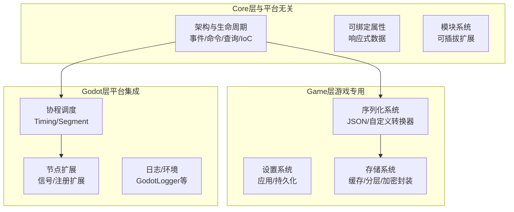
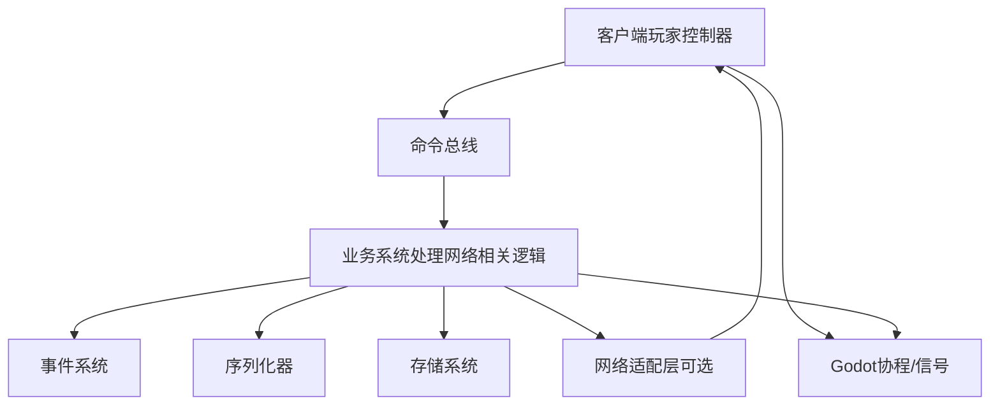
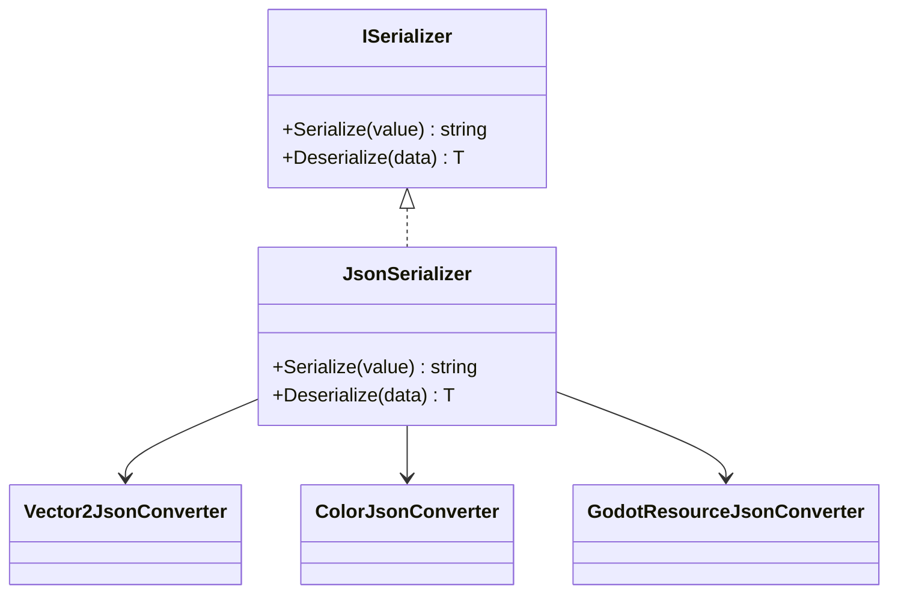
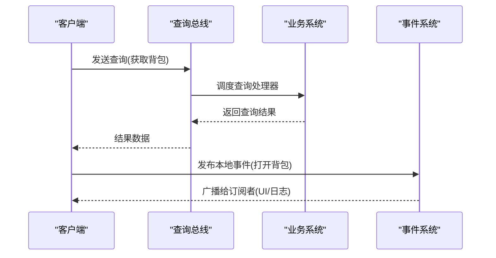
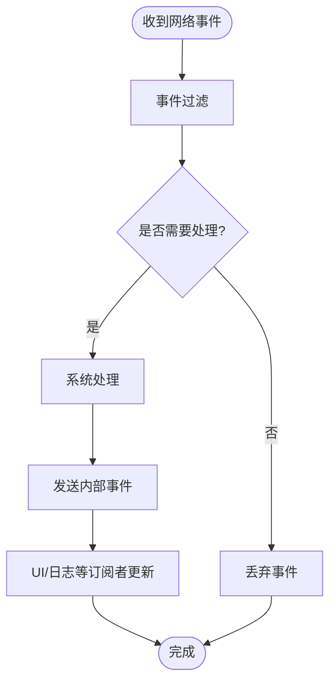
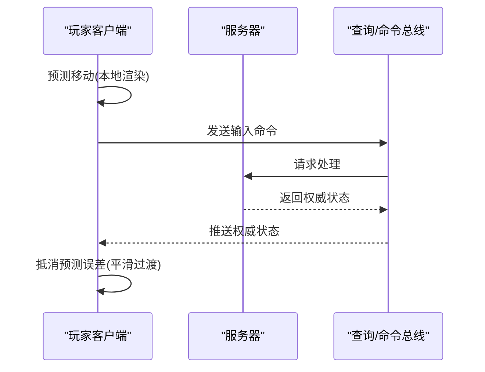
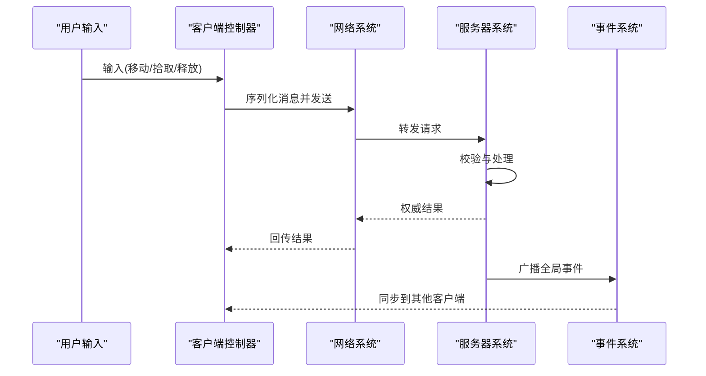

# 网络集成模式

<cite>
**本文引用的文件**
- [README.md](file://GFramework.Core/README.md)
- [README.md](file://GFramework.Core/README.md)
- [Architecture.cs](file://GFramework.Core/architecture/Architecture.cs)
- [README.md](file://GFramework.Core/architecture/README.md)
- [README.md](file://GFramework.Core/events/README.md)
- [README.md](file://GFramework.Core/README.md)
- [README.md](file://GFramework.Core/README.md)
- [README.md](file://GFramework.Core/README.md)
- [README.md](file://GFramework.Core/README.md)
- [README.md](file://GFramework.Core/README.md)
- [README.md](file://GFramework.Core/README.md)
- [README.md](file://GFramework.Core/README.md)
- [README.md](file://GFramework.Core/README.md)
- [README.md](file://GFramework.Core/README.md)
- [README.md](file://GFramework.Core/README.md)
- [README.md](file://GFramework.Core/README.md)
- [README.md](file://GFramework.Core/README.md)
- [README.md](file://GFramework.Core/README.md)
- [README.md](file://GFramework.Core/README.md)
- [README.md](file://GFramework.Core/README.md)
- [README.md](file://GFramework.Core/README.md)
- [README.md](file://GFramework.Core/README.md)
- [README.md](file://GFramework.Core/README.md)
- [README.md](file://GFramework.Core/README.md)
- [README.md](file://GFramework.Core/README.md)
- [README.md](file://GFramework.Core/README.md)
- [README.md](file://GFramework.Core/README.md)
- [README.md](file://GFramework.Core/README.md)
- [README.md](file://GFramework.Core/README.md)
- [README.md](file://GFramework.Core/README.md)
- [README.md](file://GFramework.Core/README.md)
- [README.md](file://GFramework.Core/README.md)
- [README.md](file://GFramework.Core/README.md)
- [README.md](file://GFramework.Core/README.md)
- [README.md](file://GFramework.Core/README.md)
- [README.md](file://GFramework.Core/README.md)
- [README.md](file://GFramework.Core/README.md)
- [README.md](file://GFramework.Core/README.md)
- [README.md](file://GFramework.Core/README.md)
- [README.md](file://GFramework.Core/README.md)
- [README.md](file://GFramework.Core/README.md)
- [README.md](......)
</cite>

## 目录
1. [简介](#简介)
2. [项目结构](#项目结构)
3. [核心组件](#核心组件)
4. [架构总览](#架构总览)
5. [详细组件分析](#详细组件分析)
6. [依赖分析](#依赖分析)
7. [性能考量](#性能考量)
8. [故障排查指南](#故障排查指南)
9. [结论](#结论)
10. [附录](#附录)

## 简介
本教程面向希望在GFramework之上实现“网络集成模式”的开发者，系统讲解游戏网络编程的关键概念与实现路径，涵盖客户端-服务器架构、网络同步机制、消息序列化与反序列化、消息队列与连接状态管理、网络事件处理、延迟补偿与预测算法，并给出多人游戏常见交互（玩家同步、拾取、技能释放）的落地思路。教程以GFramework的事件驱动、命令查询职责分离（CQRS）、可绑定属性与模块化架构为基础，帮助你在不侵入业务的前提下构建高性能、可维护的网络层。

## 项目结构
GFramework由Core、Game、Godot三个层面组成，其中：
- Core层提供与平台无关的架构内核（事件、命令、查询、生命周期、IoC等）
- Game层提供游戏专用抽象（设置、序列化、存储等）
- Godot层提供Godot平台集成（节点扩展、协程调度、日志等）

网络集成模式建议在Core层定义跨平台的网络抽象，在Game层提供序列化与存储支持，在Godot层接入平台特有能力（如协程、信号、网络库）。下图展示了三层与网络集成的关系：

图表来源
- [README.md](file://GFramework.Core/README.md#L1-L508)
- [README.md](file://GFramework.Game/README.md#L1-L1402)
- [README.md](file://GFramework.Godot/README.md#L1-L200)

章节来源
- [README.md](file://GFramework.Core/README.md#L1-L508)
- [README.md](file://GFramework.Game/README.md#L1-L1402)

## 核心组件
- 事件系统：用于跨组件通信与网络事件分发
- 命令/查询：封装写操作与只读查询，保证网络请求的语义清晰
- 可绑定属性：驱动UI与状态变更的自动化更新
- 模块系统：将网络功能以模块形式安装到架构中
- 协程调度：在Godot中提供分段（Process/Physics/Deferred）的协程执行能力

章节来源
- [README.md](file://GFramework.Core/README.md#L1-L508)
- [README.md](file://GFramework.Core/architecture/README.md#L1-L503)
- [README.md](file://GFramework.Core/events/README.md#L343-L514)

## 架构总览
下图展示了网络集成模式下的典型交互：客户端通过命令发起操作，系统通过事件广播状态变化；序列化器负责消息编解码；存储系统持久化配置；Godot层提供协程与信号支撑。

图表来源
- [README.md](file://GFramework.Core/architecture/README.md#L1-L503)
- [README.md](file://GFramework.Core/events/README.md#L343-L514)
- [README.md](file://GFramework.Game/README.md#L649-L777)

## 详细组件分析

### 传输层与消息编解码
- 序列化器：提供统一的Serialize/Deserialize接口，支持自定义转换器，适合将网络消息对象序列化为字符串或二进制
- 自定义转换器：可针对Vector2、Color、Godot资源等类型进行定制，确保跨端一致性
- 版本化与迁移：通过版本号与迁移器，保障消息格式演进的兼容性

图表来源
- [README.md](file://GFramework.Game/README.md#L649-L777)

章节来源
- [README.md](file://GFramework.Game/README.md#L649-L777)

### 消息队列与连接状态管理
- 事件系统：通过事件总线实现消息的发布/订阅，适合广播类网络事件（如玩家进入/离开区域）
- 命令总线：封装请求-确认-回滚语义，适合需要可靠性的操作（如拾取、释放技能）
- 查询总线：用于只读查询（如获取背包列表），避免写路径干扰
- 连接状态：可在系统中维护连接状态机，结合事件驱动进行状态切换与重连

图表来源
- [README.md](file://GFramework.Core/architecture/README.md#L1-L503)
- [README.md](file://GFramework.Core/events/README.md#L343-L514)

章节来源
- [README.md](file://GFramework.Core/architecture/README.md#L1-L503)
- [README.md](file://GFramework.Core/events/README.md#L343-L514)

### 网络事件处理机制
- 事件命名与数据设计：使用过去式事件名，事件数据尽量使用值类型，避免传递可变引用
- 事件过滤与转发：在系统中对事件进行过滤与转发，降低广播风暴
- 注销管理：使用统一的注销列表，避免内存泄漏与逻辑错误

图表来源
- [README.md](file://GFramework.Core/events/README.md#L343-L514)

章节来源
- [README.md](file://GFramework.Core/events/README.md#L343-L514)

### 延迟补偿与预测算法
- 预测：客户端在等待服务器确认前，先根据本地输入进行即时渲染，提升交互感受
- 延迟补偿：服务器回滚/重放历史状态，抵消网络延迟带来的视觉抖动
- 状态同步：通过可绑定属性与事件系统，将服务器权威状态推送到客户端，覆盖预测误差

图表来源
- [README.md](file://GFramework.Core/README.md#L1-L508)
- [README.md](file://GFramework.Core/events/README.md#L343-L514)

章节来源
- [README.md](file://GFramework.Core/README.md#L1-L508)
- [README.md](file://GFramework.Core/events/README.md#L343-L514)

### 多人游戏交互范式
- 玩家同步：通过事件广播玩家位置/朝向；客户端进行插值/外推；服务器权威裁决
- 物品拾取：客户端发送拾取命令；服务器校验范围/冷却；广播拾取结果事件
- 技能释放：客户端预测施法动画；服务器校验CD/消耗；广播命中/伤害事件

图表来源
- [README.md](file://GFramework.Core/architecture/README.md#L1-L503)
- [README.md](file://GFramework.Game/README.md#L649-L777)

章节来源
- [README.md](file://GFramework.Core/architecture/README.md#L1-L503)
- [README.md](file://GFramework.Game/README.md#L649-L777)

## 依赖分析
- Core层提供事件、命令、查询、IoC与模块系统，是网络集成的基础设施
- Game层提供序列化与存储，为网络消息与配置持久化提供支持
- Godot层提供协程与信号，便于在引擎中实现非阻塞网络轮询与回调

图表来源
- [README.md](file://GFramework.Core/README.md#L1-L508)
- [README.md](file://GFramework.Game/README.md#L1-L1402)

章节来源
- [README.md](file://GFramework.Core/README.md#L1-L508)
- [README.md](file://GFramework.Game/README.md#L1-L1402)

## 性能考量
- 事件与命令的粒度：高频事件应轻量化，避免每帧触发；必要时合并或节流
- 序列化开销：使用紧凑的JSON或二进制格式；对热点字段进行压缩
- 状态同步频率：采用增量更新与差分协议，减少带宽占用
- 协程与调度：在Godot中合理选择Process/Physics/Deferred段，避免卡顿
- 缓存与预加载：对常用资源与配置进行缓存与预加载

## 故障排查指南
- 事件未注销：导致内存泄漏与逻辑错误，务必使用注销列表统一管理
- 事件循环：事件处理器中谨慎发送新事件，避免循环依赖
- 序列化异常：检查转换器与类型匹配，确保跨端一致
- 状态不一致：确认服务器权威裁决与客户端预测补偿流程
- 网络断线：实现重连与回放队列，保证体验连续性

章节来源
- [README.md](file://GFramework.Core/events/README.md#L343-L514)

## 结论
通过GFramework的事件驱动与模块化架构，网络集成模式能够以最小侵入的方式实现可靠的多人游戏通信。配合序列化、存储与Godot协程能力，开发者可以快速搭建高性能、可维护的网络层，并在预测与补偿机制下提供流畅的玩家体验。

## 附录
- 快速开始：在架构中注册网络相关系统与工具，安装网络模块
- 最佳实践：事件命名规范、数据设计、注销管理、性能优化
- 平台集成：Godot层的协程与信号为网络轮询与回调提供便利

章节来源
- [README.md](file://GFramework.Core/architecture/README.md#L1-L503)
- [README.md](file://GFramework.Core/README.md#L1-L508)
- [README.md](file://GFramework.Game/README.md#L1-L1402)