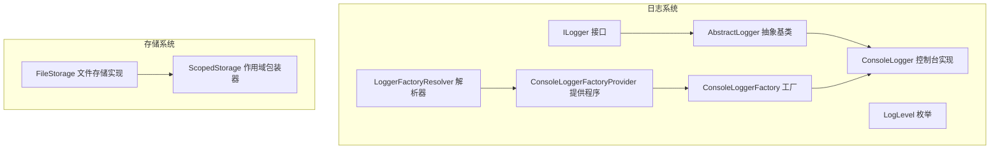
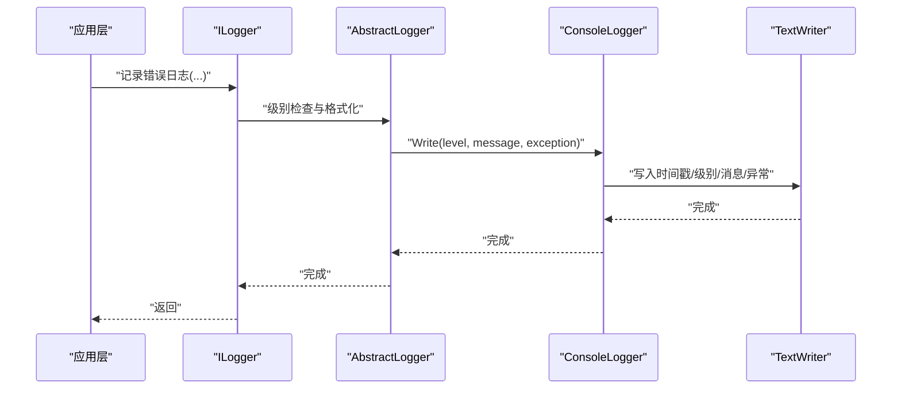
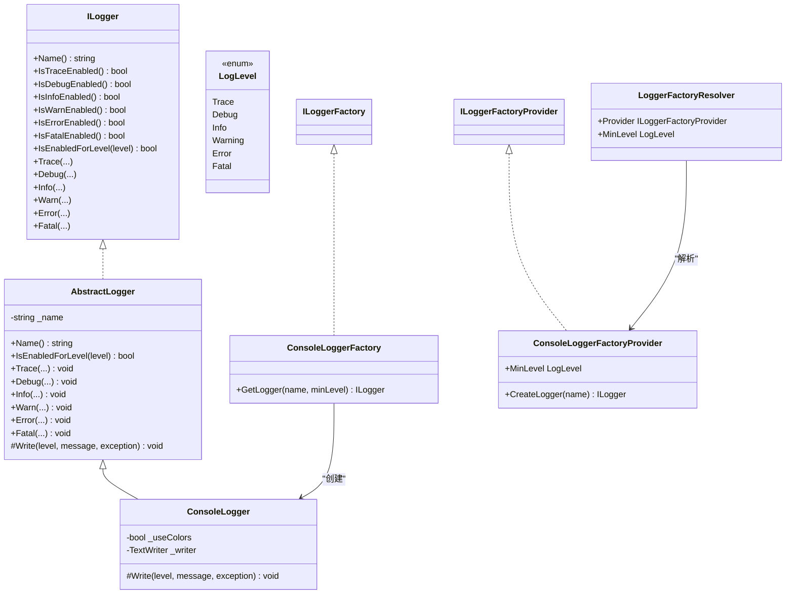
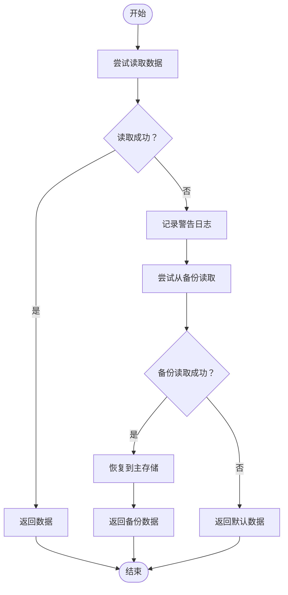
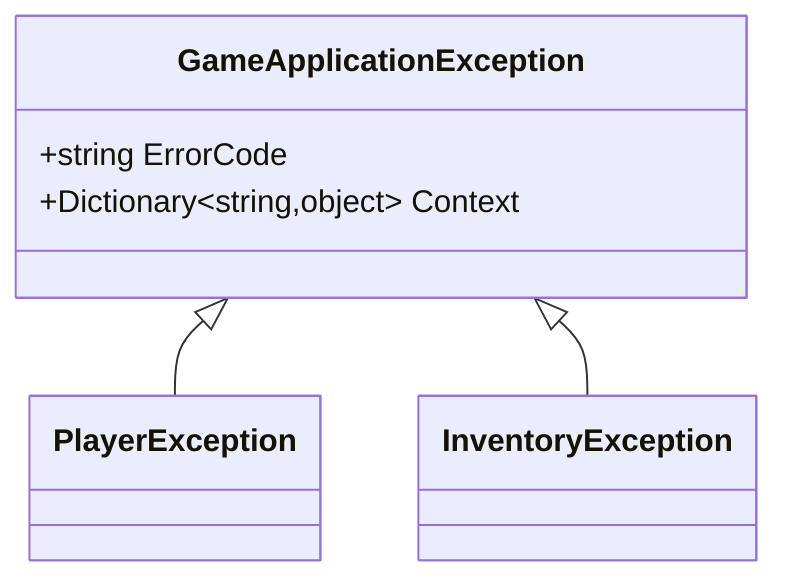
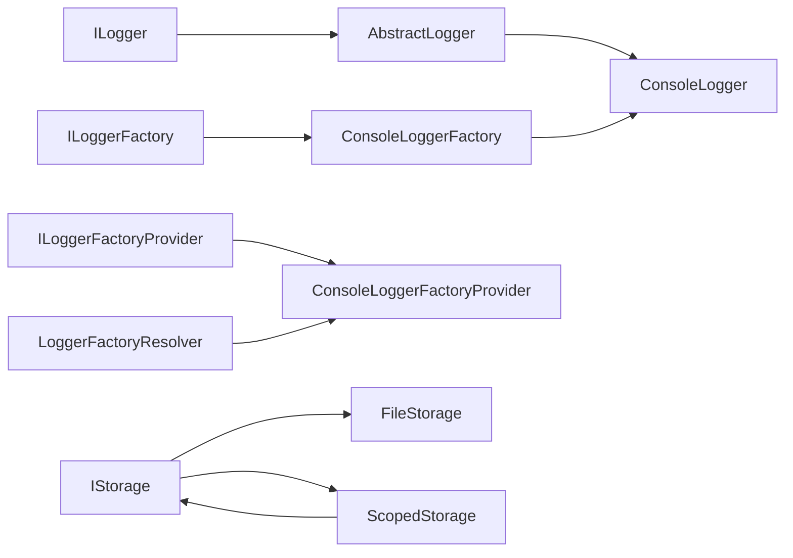

# 错误处理策略

<cite>
**本文引用的文件**
- [AbstractLogger.cs](file://GFramework.Core/logging/AbstractLogger.cs)
- [ConsoleLogger.cs](file://GFramework.Core/logging/ConsoleLogger.cs)
- [ConsoleLoggerFactory.cs](file://GFramework.Core/logging/ConsoleLoggerFactory.cs)
- [ConsoleLoggerFactoryProvider.cs](file://GFramework.Core/logging/ConsoleLoggerFactoryProvider.cs)
- [LoggerFactoryResolver.cs](file://GFramework.Core/logging/LoggerFactoryResolver.cs)
- [ILogger.cs](file://GFramework.Core.Abstractions/logging/ILogger.cs)
- [ILoggerFactory.cs](file://GFramework.Core.Abstractions/logging/ILoggerFactory.cs)
- [ILoggerFactoryProvider.cs](file://GFramework.Core.Abstractions/logging/ILoggerFactoryProvider.cs)
- [LogLevel.cs](file://GFramework.Core.Abstractions/logging/LogLevel.cs)
- [FileStorage.cs](file://GFramework.Game/storage/FileStorage.cs)
- [ScopedStorage.cs](file://GFramework.Game/storage/ScopedStorage.cs)
- [architecture-patterns.md](file://docs/best-practices/architecture-patterns.md)
</cite>

## 目录
1. [引言](#引言)
2. [项目结构](#项目结构)
3. [核心组件](#核心组件)
4. [架构总览](#架构总览)
5. [详细组件分析](#详细组件分析)
6. [依赖关系分析](#依赖关系分析)
7. [性能考量](#性能考量)
8. [故障排查指南](#故障排查指南)
9. [结论](#结论)
10. [附录](#附录)

## 引言
本教程围绕 GFramework 的错误处理策略展开，结合其日志系统与存储系统，系统讲解游戏开发中的错误处理最佳实践，包括异常分类、错误恢复策略、用户友好的错误提示设计，并给出可直接参考的实现路径与图示。我们将重点覆盖以下主题：
- 结构化的错误处理与日志体系
- 不同类型错误的处理策略：网络错误、数据错误、业务逻辑错误
- 错误恢复与容错：存档损坏的恢复、网络断线的处理、配置文件错误的修复
- 设计原则：错误传播、错误包装、错误恢复的平衡

## 项目结构
GFramework 将“错误处理”拆解为两大部分：
- 日志系统：统一的错误记录、分级与输出，便于追踪与诊断
- 存储系统：围绕文件读写与作用域封装，提供健壮的数据访问与错误反馈

**图表来源**
- [ILogger.cs](file://GFramework.Core.Abstractions/logging/ILogger.cs#L8-L314)
- [LogLevel.cs](file://GFramework.Core.Abstractions/logging/LogLevel.cs#L6-L37)
- [AbstractLogger.cs](file://GFramework.Core/logging/AbstractLogger.cs#L10-L493)
- [ConsoleLogger.cs](file://GFramework.Core/logging/ConsoleLogger.cs#L10-L81)
- [ConsoleLoggerFactory.cs](file://GFramework.Core/logging/ConsoleLoggerFactory.cs#L8-L20)
- [ConsoleLoggerFactoryProvider.cs](file://GFramework.Core/logging/ConsoleLoggerFactoryProvider.cs#L8-L24)
- [LoggerFactoryResolver.cs](file://GFramework.Core/logging/LoggerFactoryResolver.cs#L8-L26)
- [FileStorage.cs](file://GFramework.Game/storage/FileStorage.cs#L11-L258)
- [ScopedStorage.cs](file://GFramework.Game/storage/ScopedStorage.cs#L11-L99)

**章节来源**
- [ILogger.cs](file://GFramework.Core.Abstractions/logging/ILogger.cs#L8-L314)
- [LogLevel.cs](file://GFramework.Core.Abstractions/logging/LogLevel.cs#L6-L37)
- [AbstractLogger.cs](file://GFramework.Core/logging/AbstractLogger.cs#L10-L493)
- [ConsoleLogger.cs](file://GFramework.Core/logging/ConsoleLogger.cs#L10-L81)
- [ConsoleLoggerFactory.cs](file://GFramework.Core/logging/ConsoleLoggerFactory.cs#L8-L20)
- [ConsoleLoggerFactoryProvider.cs](file://GFramework.Core/logging/ConsoleLoggerFactoryProvider.cs#L8-L24)
- [LoggerFactoryResolver.cs](file://GFramework.Core/logging/LoggerFactoryResolver.cs#L8-L26)
- [FileStorage.cs](file://GFramework.Game/storage/FileStorage.cs#L11-L258)
- [ScopedStorage.cs](file://GFramework.Game/storage/ScopedStorage.cs#L11-L99)

## 核心组件
- 日志接口与抽象：通过 ILogger 定义统一的日志能力；AbstractLogger 实现级别判断、格式化与异常附加，子类仅需实现 Write 即可。
- 控制台日志器：ConsoleLogger 输出到控制台，支持彩色输出与异常堆栈打印。
- 工厂与提供程序：ILoggerFactory 负责按名称创建日志器；ILoggerFactoryProvider 提供最小级别配置；LoggerFactoryResolver 统一解析当前提供程序与最小级别。
- 存储与作用域：FileStorage 提供线程安全的文件读写与错误抛出；ScopedStorage 为键加前缀，隔离作用域。

这些组件共同构成“记录—传播—恢复”的闭环：先用日志定位问题，再用存储与包装异常实现稳健恢复。

**章节来源**
- [ILogger.cs](file://GFramework.Core.Abstractions/logging/ILogger.cs#L8-L314)
- [AbstractLogger.cs](file://GFramework.Core/logging/AbstractLogger.cs#L10-L493)
- [ConsoleLogger.cs](file://GFramework.Core/logging/ConsoleLogger.cs#L10-L81)
- [ILoggerFactory.cs](file://GFramework.Core.Abstractions/logging/ILoggerFactory.cs#L6-L15)
- [ILoggerFactoryProvider.cs](file://GFramework.Core.Abstractions/logging/ILoggerFactoryProvider.cs#L6-L19)
- [LoggerFactoryResolver.cs](file://GFramework.Core/logging/LoggerFactoryResolver.cs#L8-L26)
- [FileStorage.cs](file://GFramework.Game/storage/FileStorage.cs#L11-L258)
- [ScopedStorage.cs](file://GFramework.Game/storage/ScopedStorage.cs#L11-L99)

## 架构总览
下面的序列图展示了“日志记录”的完整调用链，体现错误信息如何从应用层传递到具体平台日志器：

**图表来源**
- [ILogger.cs](file://GFramework.Core.Abstractions/logging/ILogger.cs#L8-L314)
- [AbstractLogger.cs](file://GFramework.Core/logging/AbstractLogger.cs#L40-L493)
- [ConsoleLogger.cs](file://GFramework.Core/logging/ConsoleLogger.cs#L25-L81)

**章节来源**
- [ILogger.cs](file://GFramework.Core.Abstractions/logging/ILogger.cs#L8-L314)
- [AbstractLogger.cs](file://GFramework.Core/logging/AbstractLogger.cs#L40-L493)
- [ConsoleLogger.cs](file://GFramework.Core/logging/ConsoleLogger.cs#L25-L81)

## 详细组件分析

### 日志系统：结构化错误记录与分级
- 分级与开关：通过 IsEnabledForLevel 与各级别 IsXxxEnabled 方法，避免不必要的字符串拼接与对象创建。
- 异常附加：ILogger 支持在各级别附加异常；AbstractLogger 的核心 Log 方法统一处理异常参数。
- 平台实现：ConsoleLogger 提供彩色输出与异常堆栈打印，便于快速定位问题。

**图表来源**
- [ILogger.cs](file://GFramework.Core.Abstractions/logging/ILogger.cs#L8-L314)
- [LogLevel.cs](file://GFramework.Core.Abstractions/logging/LogLevel.cs#L6-L37)
- [AbstractLogger.cs](file://GFramework.Core/logging/AbstractLogger.cs#L10-L493)
- [ConsoleLogger.cs](file://GFramework.Core/logging/ConsoleLogger.cs#L10-L81)
- [ConsoleLoggerFactory.cs](file://GFramework.Core/logging/ConsoleLoggerFactory.cs#L8-L20)
- [ConsoleLoggerFactoryProvider.cs](file://GFramework.Core/logging/ConsoleLoggerFactoryProvider.cs#L8-L24)
- [LoggerFactoryResolver.cs](file://GFramework.Core/logging/LoggerFactoryResolver.cs#L8-L26)

**章节来源**
- [ILogger.cs](file://GFramework.Core.Abstractions/logging/ILogger.cs#L8-L314)
- [LogLevel.cs](file://GFramework.Core.Abstractions/logging/LogLevel.cs#L6-L37)
- [AbstractLogger.cs](file://GFramework.Core/logging/AbstractLogger.cs#L10-L493)
- [ConsoleLogger.cs](file://GFramework.Core/logging/ConsoleLogger.cs#L10-L81)
- [ConsoleLoggerFactory.cs](file://GFramework.Core/logging/ConsoleLoggerFactory.cs#L8-L20)
- [ConsoleLoggerFactoryProvider.cs](file://GFramework.Core/logging/ConsoleLoggerFactoryProvider.cs#L8-L24)
- [LoggerFactoryResolver.cs](file://GFramework.Core/logging/LoggerFactoryResolver.cs#L8-L26)

### 存储系统：数据错误与恢复
- FileStorage：提供线程安全的读写，对非法键进行校验（如路径逃逸），并在读取失败时抛出明确异常（如文件未找到）。
- ScopedStorage：为键加前缀，隔离作用域，避免命名冲突。
- 错误恢复策略：在上层捕获存储异常后，回退到默认数据或从备份恢复，同时记录日志以便诊断。

**图表来源**
- [FileStorage.cs](file://GFramework.Game/storage/FileStorage.cs#L144-L209)
- [ScopedStorage.cs](file://GFramework.Game/storage/ScopedStorage.cs#L11-L99)
- [architecture-patterns.md](file://docs/best-practices/architecture-patterns.md#L959-L1036)

**章节来源**
- [FileStorage.cs](file://GFramework.Game/storage/FileStorage.cs#L11-L258)
- [ScopedStorage.cs](file://GFramework.Game/storage/ScopedStorage.cs#L11-L99)
- [architecture-patterns.md](file://docs/best-practices/architecture-patterns.md#L959-L1036)

### 异常分类与包装：业务错误与系统错误
- 业务错误：如库存不足、物品校验失败等，应包装为领域特定的异常（例如 InventoryException），保留上下文信息（玩家ID、物品ID、原始错误）。
- 系统错误：如存储异常、序列化异常等，应向上游暴露可恢复的包装异常，避免泄露底层细节。
- 错误传播：在系统边界处统一捕获与包装，保持调用链清晰，便于日志追踪与用户提示。

**图表来源**
- [architecture-patterns.md](file://docs/best-practices/architecture-patterns.md#L839-L956)

**章节来源**
- [architecture-patterns.md](file://docs/best-practices/architecture-patterns.md#L839-L956)

## 依赖关系分析
- 日志系统内部依赖关系清晰：接口定义能力，抽象类统一行为，具体实现负责输出；工厂与提供程序解耦创建与配置；解析器集中管理默认提供程序与最小级别。
- 存储系统通过 ScopedStorage 对 FileStorage 进行组合，形成“作用域隔离 + 线程安全 + 明确异常”的数据访问层。

**图表来源**
- [ILogger.cs](file://GFramework.Core.Abstractions/logging/ILogger.cs#L8-L314)
- [AbstractLogger.cs](file://GFramework.Core/logging/AbstractLogger.cs#L10-L493)
- [ConsoleLogger.cs](file://GFramework.Core/logging/ConsoleLogger.cs#L10-L81)
- [ILoggerFactory.cs](file://GFramework.Core.Abstractions/logging/ILoggerFactory.cs#L6-L15)
- [ILoggerFactoryProvider.cs](file://GFramework.Core.Abstractions/logging/ILoggerFactoryProvider.cs#L6-L19)
- [LoggerFactoryResolver.cs](file://GFramework.Core/logging/LoggerFactoryResolver.cs#L8-L26)
- [FileStorage.cs](file://GFramework.Game/storage/FileStorage.cs#L11-L258)
- [ScopedStorage.cs](file://GFramework.Game/storage/ScopedStorage.cs#L11-L99)

**章节来源**
- [ILogger.cs](file://GFramework.Core.Abstractions/logging/ILogger.cs#L8-L314)
- [AbstractLogger.cs](file://GFramework.Core/logging/AbstractLogger.cs#L10-L493)
- [ConsoleLogger.cs](file://GFramework.Core/logging/ConsoleLogger.cs#L10-L81)
- [ILoggerFactory.cs](file://GFramework.Core.Abstractions/logging/ILoggerFactory.cs#L6-L15)
- [ILoggerFactoryProvider.cs](file://GFramework.Core.Abstractions/logging/ILoggerFactoryProvider.cs#L6-L19)
- [LoggerFactoryResolver.cs](file://GFramework.Core/logging/LoggerFactoryResolver.cs#L8-L26)
- [FileStorage.cs](file://GFramework.Game/storage/FileStorage.cs#L11-L258)
- [ScopedStorage.cs](file://GFramework.Game/storage/ScopedStorage.cs#L11-L99)

## 性能考量
- 日志级别检查：在记录前进行 IsEnabled 判断，避免不必要的格式化与 IO。
- 异步读写：FileStorage 的异步读写在锁范围内进行，注意避免长时间持有锁；可将磁盘 IO 与锁范围分离，减少阻塞。
- 彩色输出：ConsoleLogger 的颜色切换在 try/finally 中恢复，确保异常时也能恢复控制台状态。

[本节为通用指导，无需列出章节来源]

## 故障排查指南
- 如何定位错误
  - 使用 ILogger 的 Error/Fatal 级别记录关键错误，并附加异常堆栈。
  - 通过 LoggerFactoryResolver 设置合适的 MinLevel，避免噪声干扰。
- 数据错误与恢复
  - FileStorage 在读取失败时抛出明确异常；上层应捕获并记录日志，随后尝试从备份恢复或返回默认数据。
  - 使用 ScopedStorage 隔离作用域，缩小问题范围。
- 用户友好提示
  - 将底层异常包装为业务异常，保留 ErrorCode 与 Context，向用户显示可理解的提示文本，同时记录详细日志以便后续诊断。

**章节来源**
- [ILogger.cs](file://GFramework.Core.Abstractions/logging/ILogger.cs#L8-L314)
- [LoggerFactoryResolver.cs](file://GFramework.Core/logging/LoggerFactoryResolver.cs#L8-L26)
- [FileStorage.cs](file://GFramework.Game/storage/FileStorage.cs#L144-L209)
- [ScopedStorage.cs](file://GFramework.Game/storage/ScopedStorage.cs#L11-L99)
- [architecture-patterns.md](file://docs/best-practices/architecture-patterns.md#L959-L1036)

## 结论
GFramework 的错误处理策略以“日志分级记录 + 存储健壮性 + 异常包装恢复”为核心，既保证了开发期的可观测性，也提供了面向用户的稳定体验。遵循本文的设计原则与实践建议，可在游戏开发中构建高可靠、易维护的错误处理体系。

[本节为总结，无需列出章节来源]

## 附录
- 最佳实践要点
  - 分层异常处理：将系统错误包装为业务异常，保留上下文。
  - 错误恢复：优先尝试从备份恢复，失败时返回默认数据并记录日志。
  - 用户提示：向用户显示友好信息，同时在后台记录详细日志。
- 参考实现位置
  - 日志接口与抽象：[ILogger.cs](file://GFramework.Core.Abstractions/logging/ILogger.cs#L8-L314)、[AbstractLogger.cs](file://GFramework.Core/logging/AbstractLogger.cs#L10-L493)
  - 控制台日志器：[ConsoleLogger.cs](file://GFramework.Core/logging/ConsoleLogger.cs#L10-L81)
  - 工厂与提供程序：[ConsoleLoggerFactory.cs](file://GFramework.Core/logging/ConsoleLoggerFactory.cs#L8-L20)、[ConsoleLoggerFactoryProvider.cs](file://GFramework.Core/logging/ConsoleLoggerFactoryProvider.cs#L8-L24)、[LoggerFactoryResolver.cs](file://GFramework.Core/logging/LoggerFactoryResolver.cs#L8-L26)
  - 存储与作用域：[FileStorage.cs](file://GFramework.Game/storage/FileStorage.cs#L11-L258)、[ScopedStorage.cs](file://GFramework.Game/storage/ScopedStorage.cs#L11-L99)
  - 错误恢复示例：[architecture-patterns.md](file://docs/best-practices/architecture-patterns.md#L959-L1036)

[本节为补充材料，无需列出章节来源]