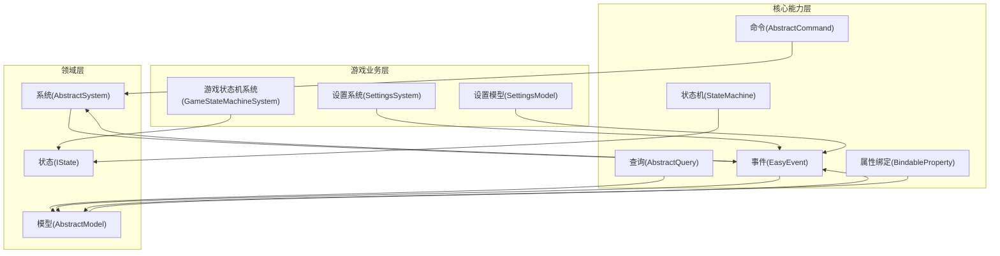
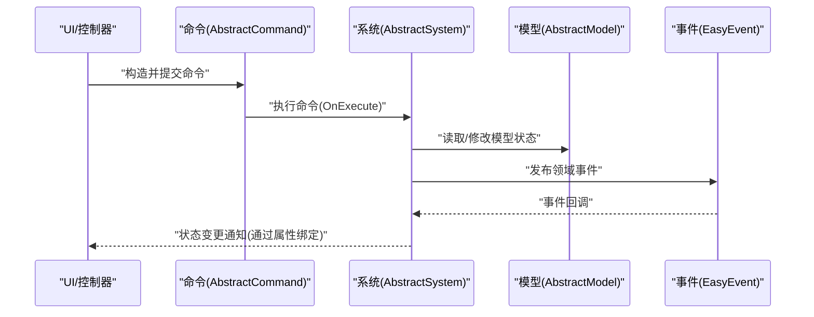
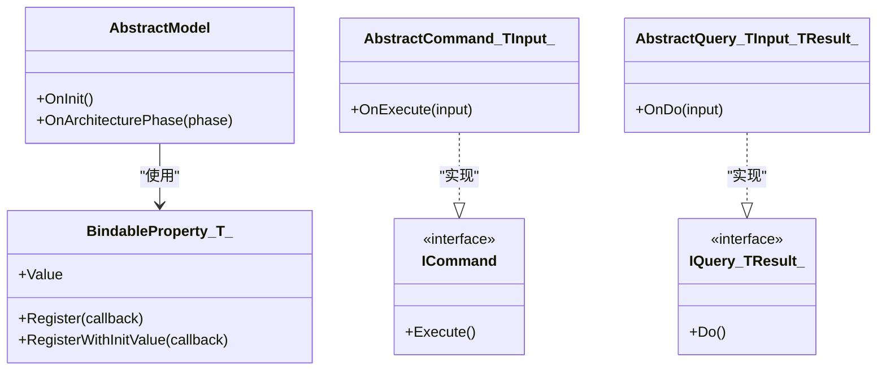
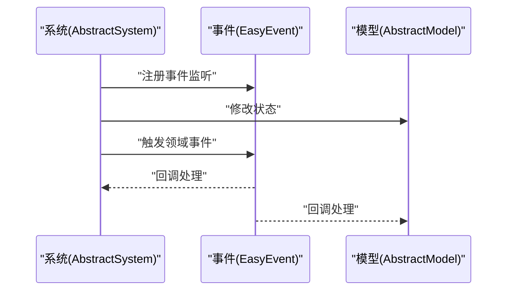
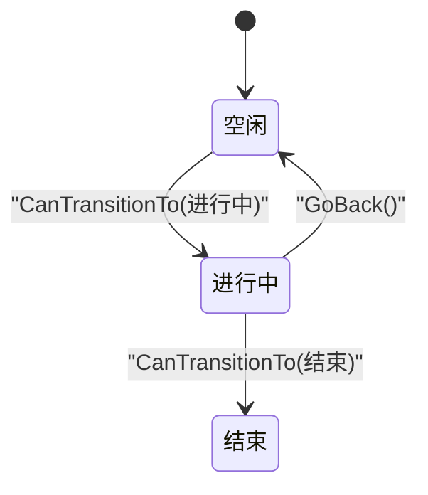
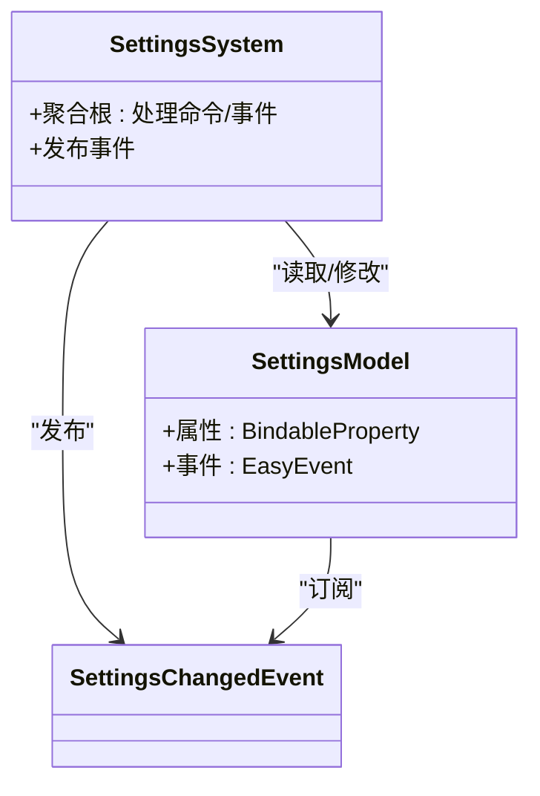
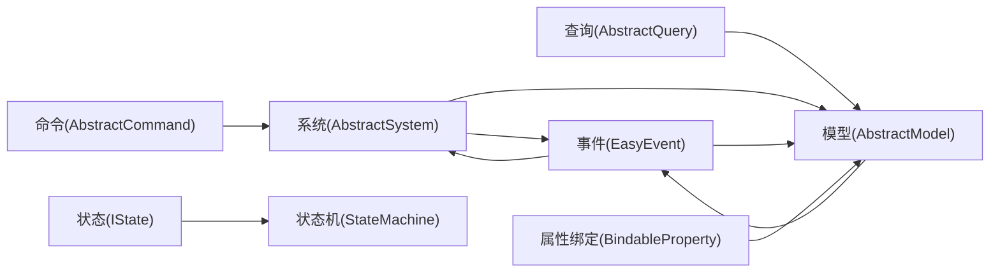

# DDD核心概念概述

<cite>
**本文档引用的文件**
- [README.md](file://GFramework.Core/README.md)
- [AbstractModel.cs](file://GFramework.Core/model/AbstractModel.cs)
- [AbstractSystem.cs](file://GFramework.Core/system/AbstractSystem.cs)
- [AbstractCommand.cs](file://GFramework.Core/command/AbstractCommand.cs)
- [AbstractQuery.cs](file://GFramework.Core/query/AbstractQuery.cs)
- [EasyEvent.cs](file://GFramework.Core/events/EasyEvent.cs)
- [BindableProperty.cs](file://GFramework.Core/property/BindableProperty.cs)
- [StateMachine.cs](file://GFramework.Core/state/StateMachine.cs)
- [IModel.cs](file://GFramework.Core.Abstractions/model/IModel.cs)
- [ICommand.cs](file://GFramework.Core.Abstractions/command/ICommand.cs)
- [IQuery.cs](file://GFramework.Core.Abstractions/query/IQuery.cs)
- [IEvent.cs](file://GFramework.Core.Abstractions/events/IEvent.cs)
- [IState.cs](file://GFramework.Core.Abstractions/state/IState.cs)
- [GameStateMachineSystem.cs](file://GFramework.Game/state/GameStateMachineSystem.cs)
- [SettingsModel.cs](file://GFramework.Game/setting/SettingsModel.cs)
- [SettingsSystem.cs](file://GFramework.Game/setting/SettingsSystem.cs)
</cite>

## 目录
1. [引言](#引言)
2. [项目结构](#项目结构)
3. [核心组件](#核心组件)
4. [架构总览](#架构总览)
5. [详细组件分析](#详细组件分析)
6. [依赖关系分析](#依赖关系分析)
7. [性能考虑](#性能考虑)
8. [故障排除指南](#故障排除指南)
9. [结论](#结论)

## 引言
本概述面向希望在游戏开发中应用领域驱动设计（DDD）的开发者，结合GFramework现有架构组件，系统讲解实体（Entity）、值对象（Value Object）、聚合根（Aggregate Root）、领域事件（Domain Event）等核心概念。我们将通过GFramework中的实际组件映射这些概念，帮助读者建立从理论到实践的认知框架。

## 项目结构
GFramework采用分层架构与CQRS思想，核心模块提供通用能力（命令、查询、事件、属性绑定、状态机等），游戏模块承载具体业务（如设置系统、状态机系统）。下图展示了与DDD相关的关键组件如何协同工作：

**图表来源**
- [AbstractCommand.cs](file://GFramework.Core/command/AbstractCommand.cs#L1-L53)
- [AbstractQuery.cs](file://GFramework.Core/query/AbstractQuery.cs#L1-L29)
- [EasyEvent.cs](file://GFramework.Core/events/EasyEvent.cs#L1-L39)
- [BindableProperty.cs](file://GFramework.Core/property/BindableProperty.cs#L1-L135)
- [StateMachine.cs](file://GFramework.Core/state/StateMachine.cs#L1-L276)
- [AbstractModel.cs](file://GFramework.Core/model/AbstractModel.cs#L1-L34)
- [AbstractSystem.cs](file://GFramework.Core/system/AbstractSystem.cs#L1-L62)
- [IState.cs](file://GFramework.Core.Abstractions/state/IState.cs#L1-L26)
- [SettingsModel.cs](file://GFramework.Game/setting/SettingsModel.cs)
- [SettingsSystem.cs](file://GFramework.Game/setting/SettingsSystem.cs)
- [GameStateMachineSystem.cs](file://GFramework.Game/state/GameStateMachineSystem.cs)

**章节来源**
- [README.md](file://GFramework.Core/README.md#L40-L108)

## 核心组件
本节从DDD视角解析GFramework中的关键构件与其职责映射：

- 实体（Entity）
  - 在GFramework中，实体通常体现为具有唯一标识与可变状态的对象。模型层的可绑定属性与事件系统共同支撑实体的状态变更与跨组件通知。
  - 参考：[AbstractModel.cs](file://GFramework.Core/model/AbstractModel.cs#L1-L34)、[BindableProperty.cs](file://GFramework.Core/property/BindableProperty.cs#L1-L135)、[EasyEvent.cs](file://GFramework.Core/events/EasyEvent.cs#L1-L39)

- 值对象（Value Object）
  - 值对象强调不可变性与整体性。在GFramework中，命令与查询的输入参数类型常作为值对象使用，确保操作意图明确且可验证。
  - 参考：[ICommand.cs](file://GFramework.Core.Abstractions/command/ICommand.cs#L1-L31)、[IQuery.cs](file://GFramework.Core.Abstractions/query/IQuery.cs#L1-L16)

- 聚合根（Aggregate Root）
  - 聚合根是聚合的唯一入口，负责维护聚合内部一致性。在GFramework中，系统（System）承担聚合根角色，协调命令执行、状态变更与事件发布。
  - 参考：[AbstractSystem.cs](file://GFramework.Core/system/AbstractSystem.cs#L1-L62)、[AbstractCommand.cs](file://GFramework.Core/command/AbstractCommand.cs#L1-L53)

- 领域事件（Domain Event）
  - 领域事件用于表达“发生了什么”。GFramework通过事件系统实现松耦合通信，系统与模型均可订阅与发布事件。
  - 参考：[EasyEvent.cs](file://GFramework.Core/events/EasyEvent.cs#L1-L39)、[IEvent.cs](file://GFramework.Core.Abstractions/events/IEvent.cs#L1-L16)

- 状态机（State Machine）
  - 状态机用于建模实体的生命周期与状态转换。IState接口定义了进入、退出与转换规则，StateMachine实现状态切换与历史管理。
  - 参考：[IState.cs](file://GFramework.Core.Abstractions/state/IState.cs#L1-L26)、[StateMachine.cs](file://GFramework.Core/state/StateMachine.cs#L1-L276)

**章节来源**
- [AbstractModel.cs](file://GFramework.Core/model/AbstractModel.cs#L1-L34)
- [AbstractSystem.cs](file://GFramework.Core/system/AbstractSystem.cs#L1-L62)
- [AbstractCommand.cs](file://GFramework.Core/command/AbstractCommand.cs#L1-L53)
- [AbstractQuery.cs](file://GFramework.Core/query/AbstractQuery.cs#L1-L29)
- [EasyEvent.cs](file://GFramework.Core/events/EasyEvent.cs#L1-L39)
- [BindableProperty.cs](file://GFramework.Core/property/BindableProperty.cs#L1-L135)
- [IModel.cs](file://GFramework.Core.Abstractions/model/IModel.cs#L1-L10)
- [ICommand.cs](file://GFramework.Core.Abstractions/command/ICommand.cs#L1-L31)
- [IQuery.cs](file://GFramework.Core.Abstractions/query/IQuery.cs#L1-L16)
- [IEvent.cs](file://GFramework.Core.Abstractions/events/IEvent.cs#L1-L16)
- [IState.cs](file://GFramework.Core.Abstractions/state/IState.cs#L1-L26)
- [StateMachine.cs](file://GFramework.Core/state/StateMachine.cs#L1-L276)

## 架构总览
下图展示了命令驱动的典型流程，体现DDD中聚合根（系统）协调命令、模型与事件的协作关系：

**图表来源**
- [AbstractCommand.cs](file://GFramework.Core/command/AbstractCommand.cs#L1-L53)
- [AbstractSystem.cs](file://GFramework.Core/system/AbstractSystem.cs#L1-L62)
- [AbstractModel.cs](file://GFramework.Core/model/AbstractModel.cs#L1-L34)
- [EasyEvent.cs](file://GFramework.Core/events/EasyEvent.cs#L1-L39)
- [BindableProperty.cs](file://GFramework.Core/property/BindableProperty.cs#L1-L135)

## 详细组件分析

### 实体（Entity）与值对象（Value Object）映射
- 实体映射：模型层承载实体状态，通过可绑定属性实现响应式更新；通过事件系统实现跨组件通知。
- 值对象映射：命令与查询的输入参数类型作为值对象，保证操作的不可变性与可验证性。

**图表来源**
- [AbstractModel.cs](file://GFramework.Core/model/AbstractModel.cs#L1-L34)
- [BindableProperty.cs](file://GFramework.Core/property/BindableProperty.cs#L1-L135)
- [ICommand.cs](file://GFramework.Core.Abstractions/command/ICommand.cs#L1-L31)
- [AbstractCommand.cs](file://GFramework.Core/command/AbstractCommand.cs#L1-L53)
- [IQuery.cs](file://GFramework.Core.Abstractions/query/IQuery.cs#L1-L16)
- [AbstractQuery.cs](file://GFramework.Core/query/AbstractQuery.cs#L1-L29)

**章节来源**
- [AbstractModel.cs](file://GFramework.Core/model/AbstractModel.cs#L1-L34)
- [BindableProperty.cs](file://GFramework.Core/property/BindableProperty.cs#L1-L135)
- [ICommand.cs](file://GFramework.Core.Abstractions/command/ICommand.cs#L1-L31)
- [AbstractCommand.cs](file://GFramework.Core/command/AbstractCommand.cs#L1-L53)
- [IQuery.cs](file://GFramework.Core.Abstractions/query/IQuery.cs#L1-L16)
- [AbstractQuery.cs](file://GFramework.Core/query/AbstractQuery.cs#L1-L29)

### 聚合根（Aggregate Root）与领域事件（Domain Event）
- 聚合根：系统作为聚合根，负责编排命令执行、协调模型状态变更与事件发布。
- 领域事件：事件系统提供注册、注销与触发机制，支持松耦合的跨组件通信。

**图表来源**
- [AbstractSystem.cs](file://GFramework.Core/system/AbstractSystem.cs#L1-L62)
- [EasyEvent.cs](file://GFramework.Core/events/EasyEvent.cs#L1-L39)
- [AbstractModel.cs](file://GFramework.Core/model/AbstractModel.cs#L1-L34)

**章节来源**
- [AbstractSystem.cs](file://GFramework.Core/system/AbstractSystem.cs#L1-L62)
- [EasyEvent.cs](file://GFramework.Core/events/EasyEvent.cs#L1-L39)
- [AbstractModel.cs](file://GFramework.Core/model/AbstractModel.cs#L1-L34)

### 状态机（State Machine）与状态（State）
- 状态接口定义了进入、退出与转换规则；状态机实现状态切换、历史记录与回退。
- 在游戏开发中，状态机常用于管理游戏流程、UI过渡或角色行为。

**图表来源**
- [IState.cs](file://GFramework.Core.Abstractions/state/IState.cs#L1-L26)
- [StateMachine.cs](file://GFramework.Core/state/StateMachine.cs#L1-L276)

**章节来源**
- [IState.cs](file://GFramework.Core.Abstractions/state/IState.cs#L1-L26)
- [StateMachine.cs](file://GFramework.Core/state/StateMachine.cs#L1-L276)

### 游戏业务示例：设置系统（聚合根+实体+事件）
- 设置模型承载玩家设置的实体状态，通过可绑定属性与事件系统实现响应式更新与跨组件通知。
- 设置系统作为聚合根，协调命令执行与事件发布，确保设置变更的一致性与可观测性。

**图表来源**
- [SettingsModel.cs](file://GFramework.Game/setting/SettingsModel.cs)
- [SettingsSystem.cs](file://GFramework.Game/setting/SettingsSystem.cs)
- [EasyEvent.cs](file://GFramework.Core/events/EasyEvent.cs#L1-L39)

**章节来源**
- [SettingsModel.cs](file://GFramework.Game/setting/SettingsModel.cs)
- [SettingsSystem.cs](file://GFramework.Game/setting/SettingsSystem.cs)
- [EasyEvent.cs](file://GFramework.Core/events/EasyEvent.cs#L1-L39)

## 依赖关系分析
下图展示了核心组件之间的依赖关系，体现DDD中聚合根、实体与事件的协作：

**图表来源**
- [AbstractCommand.cs](file://GFramework.Core/command/AbstractCommand.cs#L1-L53)
- [AbstractQuery.cs](file://GFramework.Core/query/AbstractQuery.cs#L1-L29)
- [AbstractSystem.cs](file://GFramework.Core/system/AbstractSystem.cs#L1-L62)
- [AbstractModel.cs](file://GFramework.Core/model/AbstractModel.cs#L1-L34)
- [EasyEvent.cs](file://GFramework.Core/events/EasyEvent.cs#L1-L39)
- [BindableProperty.cs](file://GFramework.Core/property/BindableProperty.cs#L1-L135)
- [IState.cs](file://GFramework.Core.Abstractions/state/IState.cs#L1-L26)
- [StateMachine.cs](file://GFramework.Core/state/StateMachine.cs#L1-L276)

**章节来源**
- [AbstractCommand.cs](file://GFramework.Core/command/AbstractCommand.cs#L1-L53)
- [AbstractQuery.cs](file://GFramework.Core/query/AbstractQuery.cs#L1-L29)
- [AbstractSystem.cs](file://GFramework.Core/system/AbstractSystem.cs#L1-L62)
- [AbstractModel.cs](file://GFramework.Core/model/AbstractModel.cs#L1-L34)
- [EasyEvent.cs](file://GFramework.Core/events/EasyEvent.cs#L1-L39)
- [BindableProperty.cs](file://GFramework.Core/property/BindableProperty.cs#L1-L135)
- [IState.cs](file://GFramework.Core.Abstractions/state/IState.cs#L1-L26)
- [StateMachine.cs](file://GFramework.Core/state/StateMachine.cs#L1-L276)

## 性能考虑
- 事件订阅与注销：使用统一的注销列表管理订阅，避免内存泄漏与重复回调。
- 属性变更：通过可比对的比较器减少无效更新，提升渲染与同步效率。
- 状态历史：限制状态机历史长度，平衡回退能力与内存占用。

## 故障排除指南
- 事件未触发：检查事件注册与触发时机，确认注销列表未提前释放引用。
- 状态无法切换：核对状态转换规则与CanTransitionTo实现，确保目标状态已注册。
- 属性变更未生效：确认比较器设置与值变化回调注册，避免因相等判断导致的静默失败。

## 结论
通过将GFramework的核心组件映射到DDD概念，开发者可以清晰地理解：模型承载实体状态，系统作为聚合根协调命令与事件，事件实现跨组件解耦，状态机建模生命周期。在此基础上，结合游戏业务（如设置系统）可快速构建高内聚、低耦合的领域模型。