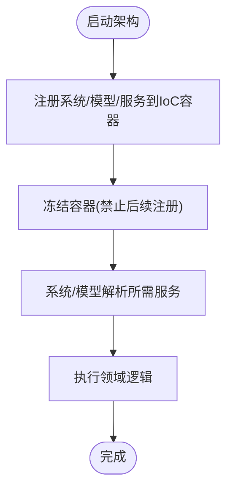

# DDD集成模式

<cite>
**本文引用的文件**
- [GFramework.Core/architecture/Architecture.cs](file://GFramework.Core/architecture/Architecture.cs)
- [GFramework.Core/model/AbstractModel.cs](file://GFramework.Core/model/AbstractModel.cs)
- [GFramework.Core/system/AbstractSystem.cs](file://GFramework.Core/system/AbstractSystem.cs)
- [GFramework.Core/ioc/IocContainer.cs](file://GFramework.Core/ioc/IocContainer.cs)
- [GFramework.Core/events/EventBus.cs](file://GFramework.Core/events/EventBus.cs)
- [GFramework.Core/command/CommandBus.cs](file://GFramework.Core/command/CommandBus.cs)
- [GFramework.Core/query/QueryBus.cs](file://GFramework.Core/query/QueryBus.cs)
- [GFramework.Core/state/StateMachine.cs](file://GFramework.Core/state/StateMachine.cs)
- [GFramework.Core.Abstractions/model/IModel.cs](file://GFramework.Core.Abstractions/model/IModel.cs)
- [GFramework.Core.Abstractions/system/ISystem.cs](file://GFramework.Core.Abstractions/system/ISystem.cs)
- [GFramework.Core.Abstractions/events/IEventBus.cs](file://GFramework.Core.Abstractions/events/IEventBus.cs)
- [GFramework.Core.Abstractions/command/ICommandBus.cs](file://GFramework.Core.Abstractions/command/ICommandBus.cs)
- [GFramework.Core.Abstractions/query/IQueryBus.cs](file://GFramework.Core.Abstractions/query/IQueryBus.cs)
- [GFramework.Game/setting/SettingsModel.cs](file://GFramework.Game/setting/SettingsModel.cs)
- [GFramework.Game/setting/SettingsSystem.cs](file://GFramework.Game/setting/SettingsSystem.cs)
</cite>

## 目录
1. [简介](#简介)
2. [项目结构](#项目结构)
3. [核心组件](#核心组件)
4. [架构总览](#架构总览)
5. [详细组件分析](#详细组件分析)
6. [依赖分析](#依赖分析)
7. [性能考量](#性能考量)
8. [故障排查指南](#故障排查指南)
9. [结论](#结论)
10. [附录](#附录)

## 简介
本指南面向希望在GFramework中落地领域驱动设计（DDD）的开发者，系统讲解如何将DDD的关键概念与GFramework现有的架构组件（模型、系统、事件总线、命令/查询总线、依赖注入容器、状态机等）有效结合。内容覆盖：
- 实体与模型的映射：以模型作为领域模型的承载者，通过系统与事件总线协同表达领域行为
- 领域事件与事件总线：利用事件总线发布/订阅领域事件，解耦跨聚合边界的行为
- 命令查询职责分离（CQRS）：命令总线负责变更，查询总线负责读取，二者在架构中清晰分离
- 依赖注入与领域服务：通过IoC容器注册与解析“领域服务”，保证依赖倒置与可测试性
- 典型DDD模式在GFramework中的实现：仓储、工厂、策略等模式的落地路径
- 最佳实践与常见陷阱：如何避免过度建模、如何平衡领域复杂度与性能

## 项目结构
GFramework采用分层+模块化的组织方式，核心层提供架构、模型、系统、事件、命令/查询、状态机、IoC等通用能力；游戏层（Game）在此之上提供具体业务场景（如设置系统）的实现。

图表来源
- [GFramework.Core/architecture/Architecture.cs](file://GFramework.Core/architecture/Architecture.cs#L23-L569)
- [GFramework.Core/model/AbstractModel.cs](file://GFramework.Core/model/AbstractModel.cs#L11-L34)
- [GFramework.Core/system/AbstractSystem.cs](file://GFramework.Core/system/AbstractSystem.cs#L13-L62)
- [GFramework.Core/events/EventBus.cs](file://GFramework.Core/events/EventBus.cs#L8-L55)
- [GFramework.Core/command/CommandBus.cs](file://GFramework.Core/command/CommandBus.cs#L9-L62)
- [GFramework.Core/query/QueryBus.cs](file://GFramework.Core/query/QueryBus.cs#L8-L23)
- [GFramework.Core/state/StateMachine.cs](file://GFramework.Core/state/StateMachine.cs#L8-L276)
- [GFramework.Core/ioc/IocContainer.cs](file://GFramework.Core/ioc/IocContainer.cs#L12-L373)
- [GFramework.Core.Abstractions/model/IModel.cs](file://GFramework.Core.Abstractions/model/IModel.cs#L10-L10)
- [GFramework.Core.Abstractions/system/ISystem.cs](file://GFramework.Core.Abstractions/system/ISystem.cs#L11-L11)
- [GFramework.Core.Abstractions/events/IEventBus.cs](file://GFramework.Core.Abstractions/events/IEventBus.cs#L8-L37)
- [GFramework.Core.Abstractions/command/ICommandBus.cs](file://GFramework.Core.Abstractions/command/ICommandBus.cs#L8-L37)
- [GFramework.Core.Abstractions/query/IQueryBus.cs](file://GFramework.Core.Abstractions/query/IQueryBus.cs#L6-L15)
- [GFramework.Game/setting/SettingsModel.cs](file://GFramework.Game/setting/SettingsModel.cs#L9-L103)
- [GFramework.Game/setting/SettingsSystem.cs](file://GFramework.Game/setting/SettingsSystem.cs#L11-L99)

章节来源
- [GFramework.Core/architecture/Architecture.cs](file://GFramework.Core/architecture/Architecture.cs#L23-L569)
- [GFramework.Core/model/AbstractModel.cs](file://GFramework.Core/model/AbstractModel.cs#L11-L34)
- [GFramework.Core/system/AbstractSystem.cs](file://GFramework.Core/system/AbstractSystem.cs#L13-L62)
- [GFramework.Core/ioc/IocContainer.cs](file://GFramework.Core/ioc/IocContainer.cs#L12-L373)
- [GFramework.Core/events/EventBus.cs](file://GFramework.Core/events/EventBus.cs#L8-L55)
- [GFramework.Core/command/CommandBus.cs](file://GFramework.Core/command/CommandBus.cs#L9-L62)
- [GFramework.Core/query/QueryBus.cs](file://GFramework.Core/query/QueryBus.cs#L8-L23)
- [GFramework.Core/state/StateMachine.cs](file://GFramework.Core/state/StateMachine.cs#L8-L276)
- [GFramework.Core.Abstractions/model/IModel.cs](file://GFramework.Core.Abstractions/model/IModel.cs#L10-L10)
- [GFramework.Core.Abstractions/system/ISystem.cs](file://GFramework.Core.Abstractions/system/ISystem.cs#L11-L11)
- [GFramework.Core.Abstractions/events/IEventBus.cs](file://GFramework.Core.Abstractions/events/IEventBus.cs#L8-L37)
- [GFramework.Core.Abstractions/command/ICommandBus.cs](file://GFramework.Core.Abstractions/command/ICommandBus.cs#L8-L37)
- [GFramework.Core.Abstractions/query/IQueryBus.cs](file://GFramework.Core.Abstractions/query/IQueryBus.cs#L6-L15)
- [GFramework.Game/setting/SettingsModel.cs](file://GFramework.Game/setting/SettingsModel.cs#L9-L103)
- [GFramework.Game/setting/SettingsSystem.cs](file://GFramework.Game/setting/SettingsSystem.cs#L11-L99)

## 核心组件
- 架构（Architecture）：统一管理模块、生命周期、阶段转换、组件注册与初始化、销毁流程，提供事件总线与IoC容器的接入点
- 模型（AbstractModel）：领域模型的承载者，实现初始化与架构阶段感知
- 系统（AbstractSystem）：领域服务与应用服务的承载者，负责初始化/销毁与日志
- 事件总线（EventBus）：基于类型的事件发布/订阅，支持Send/Register/UnRegister
- 命令总线（CommandBus）：同步/异步命令执行入口，支持无返回值与有返回值命令
- 查询总线（QueryBus）：同步查询执行入口，返回查询结果
- IoC容器（IocContainer）：注册/解析对象，支持单例、多实现、冻结保护
- 状态机（StateMachine）：状态注册、切换、历史管理与事件回调

章节来源
- [GFramework.Core/architecture/Architecture.cs](file://GFramework.Core/architecture/Architecture.cs#L23-L569)
- [GFramework.Core/model/AbstractModel.cs](file://GFramework.Core/model/AbstractModel.cs#L11-L34)
- [GFramework.Core/system/AbstractSystem.cs](file://GFramework.Core/system/AbstractSystem.cs#L13-L62)
- [GFramework.Core/events/EventBus.cs](file://GFramework.Core/events/EventBus.cs#L8-L55)
- [GFramework.Core/command/CommandBus.cs](file://GFramework.Core/command/CommandBus.cs#L9-L62)
- [GFramework.Core/query/QueryBus.cs](file://GFramework.Core/query/QueryBus.cs#L8-L23)
- [GFramework.Core/ioc/IocContainer.cs](file://GFramework.Core/ioc/IocContainer.cs#L12-L373)
- [GFramework.Core/state/StateMachine.cs](file://GFramework.Core/state/StateMachine.cs#L8-L276)

## 架构总览
下图展示了DDD相关能力在GFramework中的集成位置与交互关系。

图表来源
- [GFramework.Core/command/CommandBus.cs](file://GFramework.Core/command/CommandBus.cs#L9-L62)
- [GFramework.Core/query/QueryBus.cs](file://GFramework.Core/query/QueryBus.cs#L8-L23)
- [GFramework.Core/events/EventBus.cs](file://GFramework.Core/events/EventBus.cs#L8-L55)
- [GFramework.Core/ioc/IocContainer.cs](file://GFramework.Core/ioc/IocContainer.cs#L12-L373)
- [GFramework.Core/architecture/Architecture.cs](file://GFramework.Core/architecture/Architecture.cs#L23-L569)
- [GFramework.Core/state/StateMachine.cs](file://GFramework.Core/state/StateMachine.cs#L8-L276)

## 详细组件分析

### 实体与模型的映射
- 模型作为领域模型的载体，实现初始化与架构阶段感知，适合承载不变的领域状态与内聚的领域行为
- 系统作为领域服务与应用服务的载体，负责跨模型的协调与外部交互
- 在GFramework中，模型与系统均继承上下文感知基类，可在架构初始化阶段获得上下文并参与生命周期管理

图表来源
- [GFramework.Core/model/AbstractModel.cs](file://GFramework.Core/model/AbstractModel.cs#L11-L34)
- [GFramework.Core/system/AbstractSystem.cs](file://GFramework.Core/system/AbstractSystem.cs#L13-L62)
- [GFramework.Core.Abstractions/model/IModel.cs](file://GFramework.Core.Abstractions/model/IModel.cs#L10-L10)
- [GFramework.Core.Abstractions/system/ISystem.cs](file://GFramework.Core.Abstractions/system/ISystem.cs#L11-L11)

章节来源
- [GFramework.Core/model/AbstractModel.cs](file://GFramework.Core/model/AbstractModel.cs#L11-L34)
- [GFramework.Core/system/AbstractSystem.cs](file://GFramework.Core/system/AbstractSystem.cs#L13-L62)
- [GFramework.Core.Abstractions/model/IModel.cs](file://GFramework.Core.Abstractions/model/IModel.cs#L10-L10)
- [GFramework.Core.Abstractions/system/ISystem.cs](file://GFramework.Core.Abstractions/system/ISystem.cs#L11-L11)

### 领域事件与事件总线的集成
- 事件总线提供基于类型的事件发送与订阅，适合发布/订阅跨聚合的领域事件
- 在系统中发布领域事件，其他系统或模型通过订阅事件响应领域变化，实现松耦合

图表来源
- [GFramework.Core/events/EventBus.cs](file://GFramework.Core/events/EventBus.cs#L8-L55)
- [GFramework.Core/system/AbstractSystem.cs](file://GFramework.Core/system/AbstractSystem.cs#L13-L62)
- [GFramework.Core/model/AbstractModel.cs](file://GFramework.Core/model/AbstractModel.cs#L11-L34)

章节来源
- [GFramework.Core/events/EventBus.cs](file://GFramework.Core/events/EventBus.cs#L8-L55)
- [GFramework.Core/system/AbstractSystem.cs](file://GFramework.Core/system/AbstractSystem.cs#L13-L62)
- [GFramework.Core/model/AbstractModel.cs](file://GFramework.Core/model/AbstractModel.cs#L11-L34)

### 命令查询与CQRS的配合
- 命令总线负责执行变更型操作，查询总线负责读取型操作
- 在应用层编排：命令总线接收命令并委派给系统/模型；查询总线直接执行查询并返回结果
- 通过事件总线传播命令执行后的领域事件，实现读写分离与最终一致性

图表来源
- [GFramework.Core/command/CommandBus.cs](file://GFramework.Core/command/CommandBus.cs#L9-L62)
- [GFramework.Core/query/QueryBus.cs](file://GFramework.Core/query/QueryBus.cs#L8-L23)
- [GFramework.Core/system/AbstractSystem.cs](file://GFramework.Core/system/AbstractSystem.cs#L13-L62)
- [GFramework.Core/model/AbstractModel.cs](file://GFramework.Core/model/AbstractModel.cs#L11-L34)
- [GFramework.Core/events/EventBus.cs](file://GFramework.Core/events/EventBus.cs#L8-L55)

章节来源
- [GFramework.Core/command/CommandBus.cs](file://GFramework.Core/command/CommandBus.cs#L9-L62)
- [GFramework.Core/query/QueryBus.cs](file://GFramework.Core/query/QueryBus.cs#L8-L23)
- [GFramework.Core/system/AbstractSystem.cs](file://GFramework.Core/system/AbstractSystem.cs#L13-L62)
- [GFramework.Core/model/AbstractModel.cs](file://GFramework.Core/model/AbstractModel.cs#L11-L34)
- [GFramework.Core/events/EventBus.cs](file://GFramework.Core/events/EventBus.cs#L8-L55)

### 依赖注入与领域服务的结合
- IoC容器提供注册/解析能力，支持多实现与冻结保护，确保架构初始化完成后依赖关系稳定
- 领域服务（如策略、工厂）可作为系统或独立服务注册到容器，通过系统或模型在运行期解析使用

图表来源
- [GFramework.Core/ioc/IocContainer.cs](file://GFramework.Core/ioc/IocContainer.cs#L12-L373)
- [GFramework.Core/architecture/Architecture.cs](file://GFramework.Core/architecture/Architecture.cs#L531-L566)

章节来源
- [GFramework.Core/ioc/IocContainer.cs](file://GFramework.Core/ioc/IocContainer.cs#L12-L373)
- [GFramework.Core/architecture/Architecture.cs](file://GFramework.Core/architecture/Architecture.cs#L531-L566)

### 典型DDD模式在GFramework中的实现

#### 仓储模式
- 通过系统封装对模型的访问与持久化策略，系统作为仓储的外观
- 示例：设置系统对设置模型进行应用与批量应用，体现仓储的聚合访问与事务语义

图表来源
- [GFramework.Game/setting/SettingsSystem.cs](file://GFramework.Game/setting/SettingsSystem.cs#L11-L99)
- [GFramework.Game/setting/SettingsModel.cs](file://GFramework.Game/setting/SettingsModel.cs#L9-L103)
- [GFramework.Core/events/EventBus.cs](file://GFramework.Core/events/EventBus.cs#L8-L55)

章节来源
- [GFramework.Game/setting/SettingsSystem.cs](file://GFramework.Game/setting/SettingsSystem.cs#L11-L99)
- [GFramework.Game/setting/SettingsModel.cs](file://GFramework.Game/setting/SettingsModel.cs#L9-L103)

#### 工厂模式
- 通过系统或独立工厂类负责创建复杂实体/值对象，避免模型承担过多创建逻辑
- 工厂可注册为服务，由系统在运行期解析并使用

章节来源
- [GFramework.Core/system/AbstractSystem.cs](file://GFramework.Core/system/AbstractSystem.cs#L13-L62)
- [GFramework.Core/ioc/IocContainer.cs](file://GFramework.Core/ioc/IocContainer.cs#L12-L373)

#### 策略模式
- 将可变的领域算法封装为策略对象，注册到IoC容器，系统在运行期根据上下文选择合适策略
- 策略对象可通过事件总线对外发布策略执行结果或副作用

章节来源
- [GFramework.Core/ioc/IocContainer.cs](file://GFramework.Core/ioc/IocContainer.cs#L12-L373)
- [GFramework.Core/events/EventBus.cs](file://GFramework.Core/events/EventBus.cs#L8-L55)

### 概念性总览
以下为概念性工作流，帮助理解DDD在GFramework中的落地思路（非特定代码映射）。

## 依赖分析
- 组件耦合与内聚：模型与系统分别承担领域状态与领域行为，通过事件总线与IoC容器解耦
- 直接与间接依赖：命令/查询总线依赖系统/模型；事件总线被系统/模型广泛使用；IoC容器贯穿注册与解析
- 外部依赖与集成点：事件总线提供统一的发布/订阅接口；命令/查询总线提供统一的执行接口；IoC容器提供依赖解析

图表来源
- [GFramework.Core/command/CommandBus.cs](file://GFramework.Core/command/CommandBus.cs#L9-L62)
- [GFramework.Core/query/QueryBus.cs](file://GFramework.Core/query/QueryBus.cs#L8-L23)
- [GFramework.Core/events/EventBus.cs](file://GFramework.Core/events/EventBus.cs#L8-L55)
- [GFramework.Core/ioc/IocContainer.cs](file://GFramework.Core/ioc/IocContainer.cs#L12-L373)
- [GFramework.Core/architecture/Architecture.cs](file://GFramework.Core/architecture/Architecture.cs#L23-L569)

章节来源
- [GFramework.Core/command/CommandBus.cs](file://GFramework.Core/command/CommandBus.cs#L9-L62)
- [GFramework.Core/query/QueryBus.cs](file://GFramework.Core/query/QueryBus.cs#L8-L23)
- [GFramework.Core/events/EventBus.cs](file://GFramework.Core/events/EventBus.cs#L8-L55)
- [GFramework.Core/ioc/IocContainer.cs](file://GFramework.Core/ioc/IocContainer.cs#L12-L373)
- [GFramework.Core/architecture/Architecture.cs](file://GFramework.Core/architecture/Architecture.cs#L23-L569)

## 性能考量
- 初始化阶段与冻结：架构初始化完成后冻结IoC容器，避免运行期频繁注册带来的开销与竞争
- 事件总线：事件触发为同步路径，应避免在事件回调中执行耗时操作；必要时将重活交给系统或后台线程
- 命令/查询总线：命令/查询执行应尽量轻量，复杂逻辑下沉到系统；避免在总线层做过多分支判断
- 状态机：状态切换涉及历史记录维护，注意历史容量上限，避免内存膨胀
- 并发与锁：IoC容器内部使用读写锁保护注册/解析，避免在持有锁期间执行阻塞操作

## 故障排查指南
- 初始化失败：架构初始化失败会进入失败阶段并发送失败事件，检查初始化顺序与依赖关系
- 注册时机：在架构Ready之后再注册组件会抛出异常，需在Init中完成注册
- 容器冻结：冻结后无法继续注册，确保在初始化阶段完成所有注册
- 事件未触发：确认事件类型正确、注册回调与事件发送匹配，检查事件总线生命周期
- 命令/查询异常：命令/查询执行异常会向上抛出，需在系统中捕获并处理

章节来源
- [GFramework.Core/architecture/Architecture.cs](file://GFramework.Core/architecture/Architecture.cs#L492-L566)
- [GFramework.Core/ioc/IocContainer.cs](file://GFramework.Core/ioc/IocContainer.cs#L357-L370)
- [GFramework.Core/events/EventBus.cs](file://GFramework.Core/events/EventBus.cs#L8-L55)
- [GFramework.Core/command/CommandBus.cs](file://GFramework.Core/command/CommandBus.cs#L9-L62)
- [GFramework.Core/query/QueryBus.cs](file://GFramework.Core/query/QueryBus.cs#L8-L23)

## 结论
通过将DDD的实体/模型、领域服务、领域事件与GFramework的模型/系统、事件总线、命令/查询总线、IoC容器、状态机等组件有机结合，可以在不破坏现有架构的前提下，构建高内聚、低耦合、可演进的领域模型。遵循初始化阶段完成注册、使用事件总线解耦、通过IoC容器管理依赖、在系统中实现复杂业务逻辑的原则，能够有效避免过度建模与性能陷阱。

## 附录
- 最佳实践清单
  - 在模型中保持纯领域状态与内聚行为，避免引入过多基础设施细节
  - 将跨模型的协调逻辑放入系统，系统通过事件总线与其他组件通信
  - 使用IoC容器集中管理依赖，初始化阶段完成注册并冻结容器
  - 命令/查询总线仅做薄薄的编排，复杂逻辑下沉到系统
  - 对外发布领域事件，内部使用命令/查询总线，保持读写分离
- 常见陷阱
  - 将基础设施代码写入模型：应通过系统或服务封装
  - 在事件回调中执行重活：应异步化或委派给系统
  - 在总线层做过多分支：应将决策逻辑下沉到系统
  - 忽视初始化顺序：确保在Init中完成注册，避免在Ready后注册