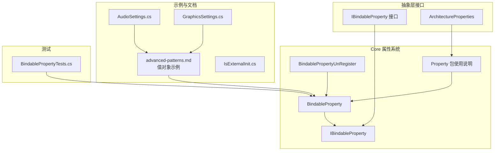
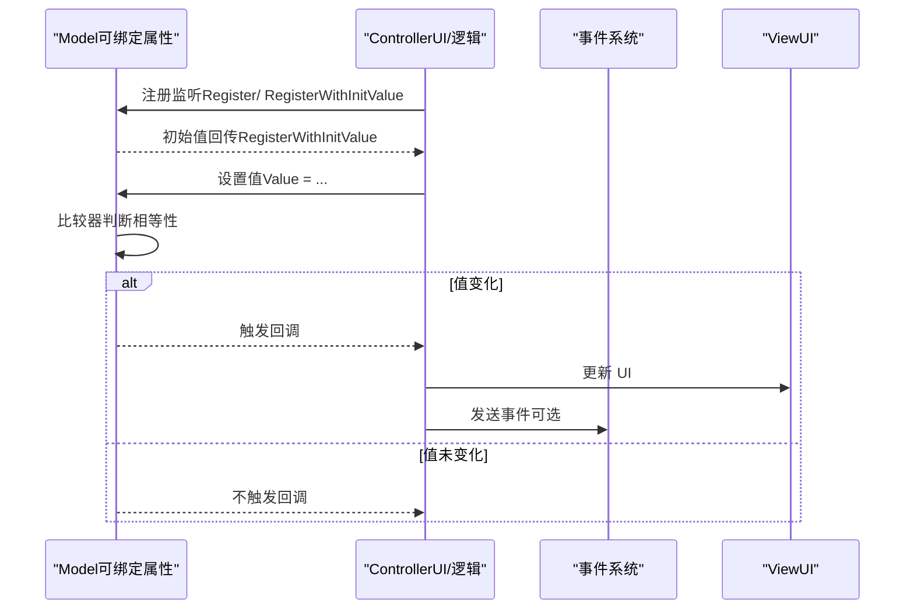
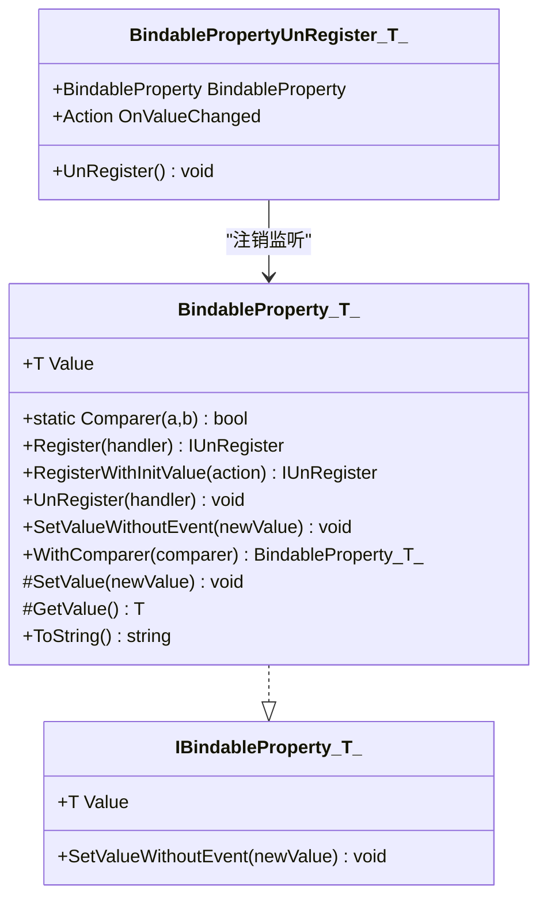
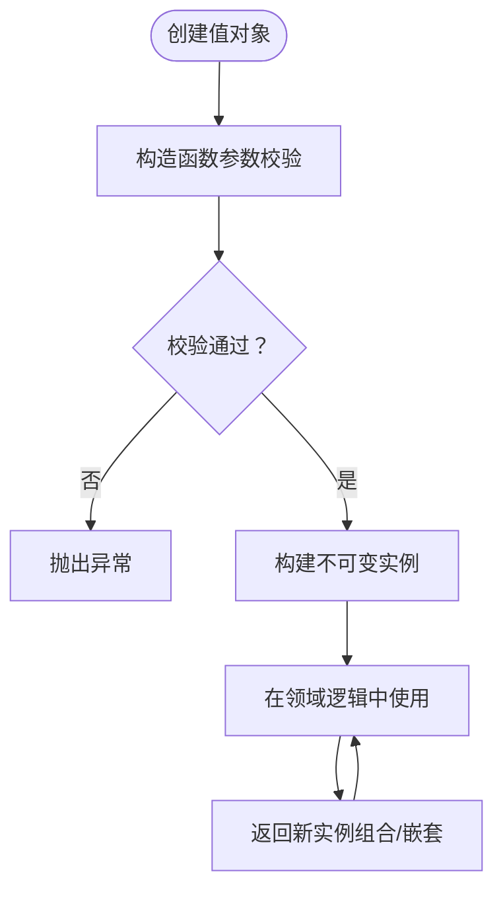
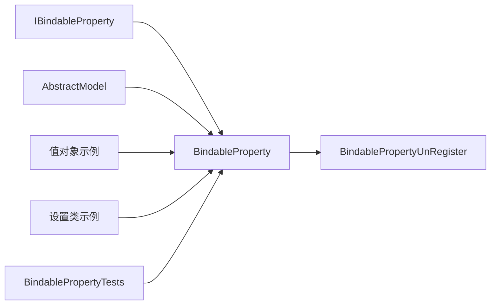

# 值对象

<cite>
**本文引用的文件**   
- [BindableProperty.cs](file://GFramework.Core/property/BindableProperty.cs)
- [IBindableProperty.cs](file://GFramework.Core.Abstractions/property/IBindableProperty.cs)
- [BindablePropertyUnRegister.cs](file://GFramework.Core/property/BindablePropertyUnRegister.cs)
- [README.md（Property 包）](file://GFramework.Core/property/README.md)
- [AbstractModel.cs](file://GFramework.Core/model/AbstractModel.cs)
- [README.md（GFramework.Core）](file://GFramework.Core/README.md)
- [advanced-patterns.md](file://docs/tutorials/advanced-patterns.md)
- [AudioSettings.cs](file://GFramework.Game.Abstractions/setting/AudioSettings.cs)
- [GraphicsSettings.cs](file://GFramework.Game.Abstractions/setting/GraphicsSettings.cs)
- [ArchitectureProperties.cs](file://GFramework.Core.Abstractions/properties/ArchitectureProperties.cs)
- [IsExternalInit.cs](file://GFramework.Game.Abstractions/internals/IsExternalInit.cs)
- [BindablePropertyTests.cs](file://GFramework.Core.Tests/property/BindablePropertyTests.cs)
</cite>

## 目录
1. [引言](#引言)
2. [项目结构](#项目结构)
3. [核心组件](#核心组件)
4. [架构总览](#架构总览)
5. [详细组件分析](#详细组件分析)
6. [依赖关系分析](#依赖关系分析)
7. [性能考量](#性能考量)
8. [故障排查指南](#故障排查指南)
9. [结论](#结论)
10. [附录](#附录)

## 引言
本篇文档聚焦于 GFramework 中“值对象”的概念、设计原则与实现要点，结合框架内的可绑定属性（BindableProperty）与领域驱动设计（DDD）示例，系统阐述值对象的不可变性、相等性比较、构造函数验证、线程安全与组合嵌套等关键主题，并给出在游戏开发中的典型应用场景（位置坐标、颜色值、货币金额、技能等级等），以及与 GFramework 属性系统的集成方式。

## 项目结构
围绕值对象与属性系统的相关文件主要分布在以下模块：
- Core 层属性系统：可绑定属性类及其接口、注销器、使用说明与测试
- 抽象层接口：定义属性契约
- 示例与文档：DDD 值对象示例、设置类示例、架构配置示例
- 测试：可绑定属性的行为验证

**图表来源**
- [BindableProperty.cs](file://GFramework.Core/property/BindableProperty.cs#L1-L135)
- [IBindableProperty.cs](file://GFramework.Core.Abstractions/property/IBindableProperty.cs#L1-L19)
- [BindablePropertyUnRegister.cs](file://GFramework.Core/property/BindablePropertyUnRegister.cs#L1-L39)
- [README.md（Property 包）](file://GFramework.Core/property/README.md#L1-L342)
- [ArchitectureProperties.cs](file://GFramework.Core.Abstractions/properties/ArchitectureProperties.cs#L1-L17)
- [advanced-patterns.md](file://docs/tutorials/advanced-patterns.md#L208-L513)
- [AudioSettings.cs](file://GFramework.Game.Abstractions/setting/AudioSettings.cs#L1-L32)
- [GraphicsSettings.cs](file://GFramework.Game.Abstractions/setting/GraphicsSettings.cs#L1-L32)
- [IsExternalInit.cs](file://GFramework.Game.Abstractions/internals/IsExternalInit.cs#L1-L11)
- [BindablePropertyTests.cs](file://GFramework.Core.Tests/property/BindablePropertyTests.cs#L1-L186)

**章节来源**
- [README.md（GFramework.Core）](file://GFramework.Core/README.md#L1-L508)

## 核心组件
- 可绑定属性（BindableProperty<T>）
  - 提供值变化监听与事件通知，支持自定义比较器、无事件设置、注册/注销等能力
  - 通过静态比较器与实例比较器实现相等性判断，避免无效触发
- 可绑定属性接口（IBindableProperty<T>）
  - 定义可读写属性值与无事件设置方法
- 注销器（BindablePropertyUnRegister<T>）
  - 负责取消监听并清理引用，确保生命周期内资源释放
- 值对象示例（来自 DDD 文档）
  - 使用 record 定义不可变值对象，构造函数中进行参数校验，提供派生构造与安全更新方法
- 设置类（示例）
  - 音频设置、图形设置等作为普通类值对象，提供默认值与 Reset 行为

**章节来源**
- [BindableProperty.cs](file://GFramework.Core/property/BindableProperty.cs#L1-L135)
- [IBindableProperty.cs](file://GFramework.Core.Abstractions/property/IBindableProperty.cs#L1-L19)
- [BindablePropertyUnRegister.cs](file://GFramework.Core/property/BindablePropertyUnRegister.cs#L1-L39)
- [README.md（Property 包）](file://GFramework.Core/property/README.md#L1-L342)
- [advanced-patterns.md](file://docs/tutorials/advanced-patterns.md#L208-L513)
- [AudioSettings.cs](file://GFramework.Game.Abstractions/setting/AudioSettings.cs#L1-L32)
- [GraphicsSettings.cs](file://GFramework.Game.Abstractions/setting/GraphicsSettings.cs#L1-L32)

## 架构总览
值对象与属性系统在 GFramework 中的协作关系如下：
- Model 层通过 BindableProperty 暴露可监听的状态
- Controller/View 通过注册监听实现数据绑定与 UI 更新
- 事件系统与属性系统共同构成响应式数据流

**图表来源**
- [BindableProperty.cs](file://GFramework.Core/property/BindableProperty.cs#L24-L41)
- [README.md（Property 包）](file://GFramework.Core/property/README.md#L131-L171)
- [README.md（GFramework.Core）](file://GFramework.Core/README.md#L339-L346)

## 详细组件分析

### 组件一：可绑定属性（BindableProperty<T>）
- 不可变性与构造函数验证
  - 通过构造函数设定默认值；在设置值前进行相等性判断，避免无效触发
  - 支持静态比较器与 WithComparer 实例方法，满足不同场景下的相等性语义
- 相等性比较
  - 默认使用 EqualityComparer<T>.Default 进行比较；可通过 Comparer 静态字段或 WithComparer 自定义
  - 针对浮点数等场景，建议使用 WithComparer 提供容差比较，减少抖动触发
- 线程安全
  - 属性值的读写与事件触发在单线程上下文中进行；若需跨线程访问，应在调用方保证线程安全
- 事件与注销
  - Register/RegisterWithInitValue 提供监听注册；UnRegister 解除监听；BindablePropertyUnRegister 负责清理
- 与 Model 的集成
  - Model 层定义 BindableProperty，Controller 层注册监听实现 UI 绑定；测试覆盖了基本行为与自定义比较器

**图表来源**
- [BindableProperty.cs](file://GFramework.Core/property/BindableProperty.cs#L11-L135)
- [IBindableProperty.cs](file://GFramework.Core.Abstractions/property/IBindableProperty.cs#L7-L19)
- [BindablePropertyUnRegister.cs](file://GFramework.Core/property/BindablePropertyUnRegister.cs#L11-L39)

**章节来源**
- [BindableProperty.cs](file://GFramework.Core/property/BindableProperty.cs#L11-L135)
- [IBindableProperty.cs](file://GFramework.Core.Abstractions/property/IBindableProperty.cs#L1-L19)
- [BindablePropertyUnRegister.cs](file://GFramework.Core/property/BindablePropertyUnRegister.cs#L1-L39)
- [README.md（Property 包）](file://GFramework.Core/property/README.md#L1-L342)
- [BindablePropertyTests.cs](file://GFramework.Core.Tests/property/BindablePropertyTests.cs#L1-L186)

### 组件二：值对象（DDD 示例）
- 不可变性
  - 使用 record 定义值对象，字段为只读，构造后不可变
- 构造函数验证
  - 在构造函数中进行参数校验（如范围、非空、格式），不符合条件抛出异常
- 安全更新
  - 通过返回新实例的方式实现“更新”，保持原值不变
- 组合与嵌套
  - 值对象可作为其他值对象的组成部分（如 Health 同时包含当前值与最大值）

**图表来源**
- [advanced-patterns.md](file://docs/tutorials/advanced-patterns.md#L371-L435)

**章节来源**
- [advanced-patterns.md](file://docs/tutorials/advanced-patterns.md#L208-L513)

### 组件三：设置类（值对象示例）
- 音频设置（AudioSettings）
  - 包含主音量、背景音乐音量、音效音量等属性，提供 Reset 方法恢复默认值
- 图形设置（GraphicsSettings）
  - 包含全屏、分辨率宽高属性，提供 Reset 方法恢复默认值
- 适用场景
  - 作为持久化配置的值对象载体，便于序列化与版本迁移

**章节来源**
- [AudioSettings.cs](file://GFramework.Game.Abstractions/setting/AudioSettings.cs#L1-L32)
- [GraphicsSettings.cs](file://GFramework.Game.Abstractions/setting/GraphicsSettings.cs#L1-L32)

### 组件四：架构属性（ArchitectureProperties）
- AllowLateRegistration：允许在初始化完成后进行组件注册
- StrictPhaseValidation：启用严格的阶段验证机制
- 与值对象的关系
  - 架构配置可影响值对象所在组件的生命周期与注册时机，间接影响值对象的可用性

**章节来源**
- [ArchitectureProperties.cs](file://GFramework.Core.Abstractions/properties/ArchitectureProperties.cs#L1-L17)

## 依赖关系分析
- BindableProperty 依赖 IBindableProperty 接口与事件系统（通过注册回调实现通知）
- Model 通过 AbstractModel 提供生命周期钩子，便于在 OnInit 中初始化可绑定属性
- 值对象示例与设置类作为数据载体，与属性系统协同工作
- 测试用例覆盖了基本行为、比较器与注销流程

**图表来源**
- [IBindableProperty.cs](file://GFramework.Core.Abstractions/property/IBindableProperty.cs#L1-L19)
- [BindableProperty.cs](file://GFramework.Core/property/BindableProperty.cs#L1-L135)
- [BindablePropertyUnRegister.cs](file://GFramework.Core/property/BindablePropertyUnRegister.cs#L1-L39)
- [AbstractModel.cs](file://GFramework.Core/model/AbstractModel.cs#L1-L34)
- [advanced-patterns.md](file://docs/tutorials/advanced-patterns.md#L208-L513)
- [AudioSettings.cs](file://GFramework.Game.Abstractions/setting/AudioSettings.cs#L1-L32)
- [GraphicsSettings.cs](file://GFramework.Game.Abstractions/setting/GraphicsSettings.cs#L1-L32)
- [BindablePropertyTests.cs](file://GFramework.Core.Tests/property/BindablePropertyTests.cs#L1-L186)

**章节来源**
- [README.md（GFramework.Core）](file://GFramework.Core/README.md#L1-L508)

## 性能考量
- 避免频繁触发
  - 使用 SetValueWithoutEvent 进行批量更新，最后统一触发一次事件，降低 UI 刷新与事件风暴
- 自定义比较器
  - 对浮点数等需要精度控制的属性，使用 WithComparer 提供容差比较，减少因微小差异导致的无效触发
- 监听管理
  - 使用 RegisterWithInitValue 首次即获取当前值，避免重复渲染；及时注销监听，防止内存泄漏与逻辑错误

**章节来源**
- [README.md（Property 包）](file://GFramework.Core/property/README.md#L278-L302)
- [README.md（GFramework.Core）](file://GFramework.Core/README.md#L403-L429)

## 故障排查指南
- 设置相同值仍触发事件
  - 检查 Comparer 是否被全局或实例级自定义覆盖，确认比较逻辑是否符合预期
- 注销后仍收到回调
  - 确认是否正确调用 UnRegister 或使用 BindablePropertyUnRegister 的 UnRegister 方法
- UI 不更新
  - 确认使用 RegisterWithInitValue 获取初始值；检查监听是否在正确的生命周期内注册
- 测试失败
  - 参考单元测试用例，验证默认行为、比较器、注销与 ToString 等关键路径

**章节来源**
- [BindablePropertyTests.cs](file://GFramework.Core.Tests/property/BindablePropertyTests.cs#L1-L186)
- [README.md（Property 包）](file://GFramework.Core/property/README.md#L1-L342)

## 结论
值对象在 GFramework 中通过 record 的不可变性与构造函数验证实现强健的数据建模；与可绑定属性系统结合，既保证了数据一致性，又实现了响应式的数据绑定与事件通知。通过自定义比较器、批量更新与完善的监听管理，能够在游戏开发中高效地处理位置坐标、颜色值、货币金额、技能等级等常见场景，并与架构配置、事件系统形成一致的开发范式。

## 附录
- 术语
  - 值对象：仅由数据组成、不可变、按值比较的领域对象
  - 可绑定属性：支持监听与事件通知的属性封装
- 参考路径
  - [Property 包使用说明](file://GFramework.Core/property/README.md#L1-L342)
  - [GFramework.Core 概览](file://GFramework.Core/README.md#L1-L508)
  - [DDD 值对象示例](file://docs/tutorials/advanced-patterns.md#L208-L513)
  - [IsExternalInit（兼容 init-only setter）](file://GFramework.Game.Abstractions/internals/IsExternalInit.cs#L1-L11)