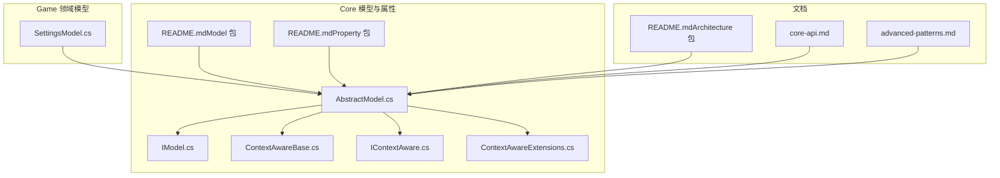
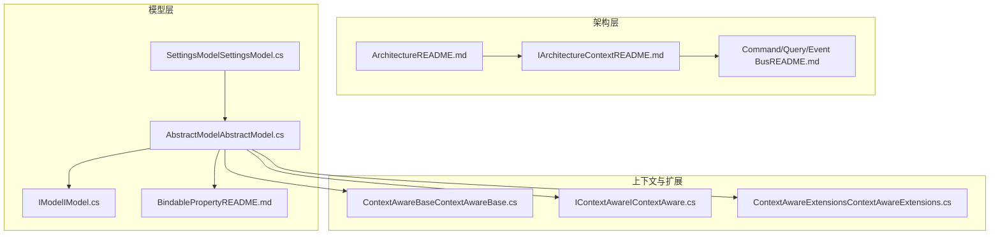
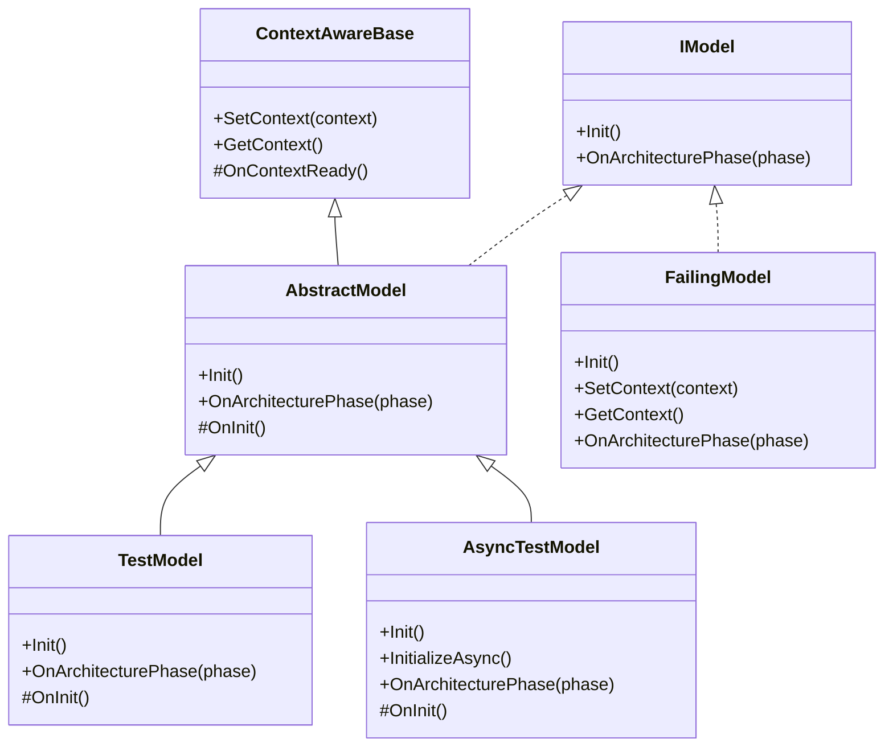
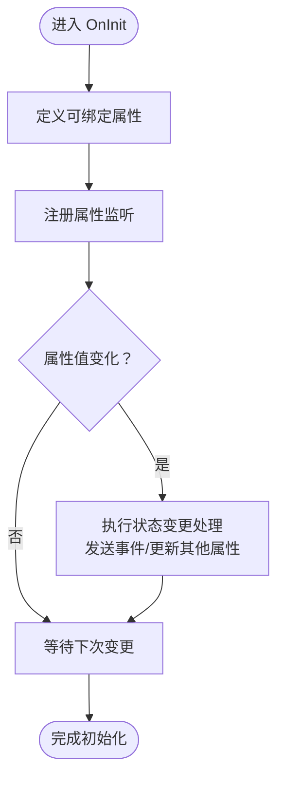
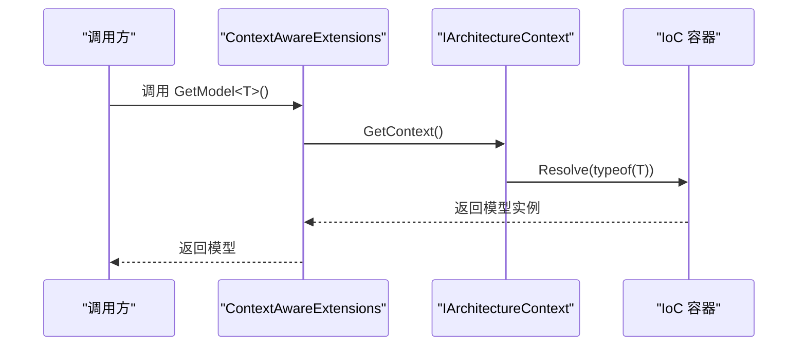
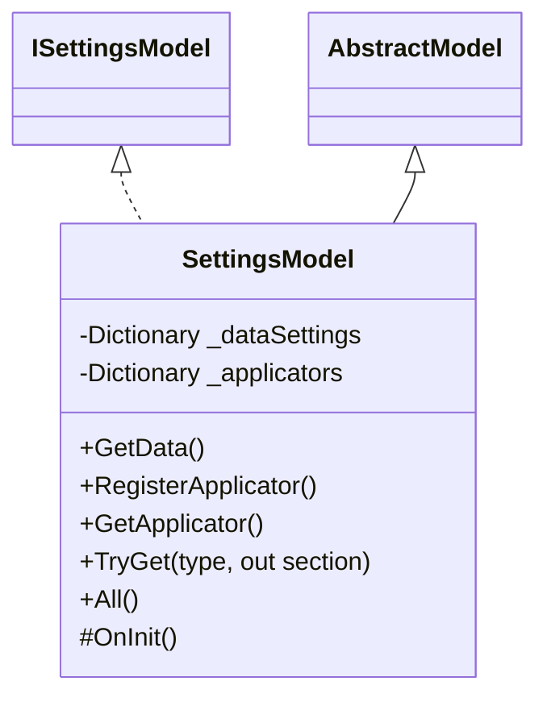
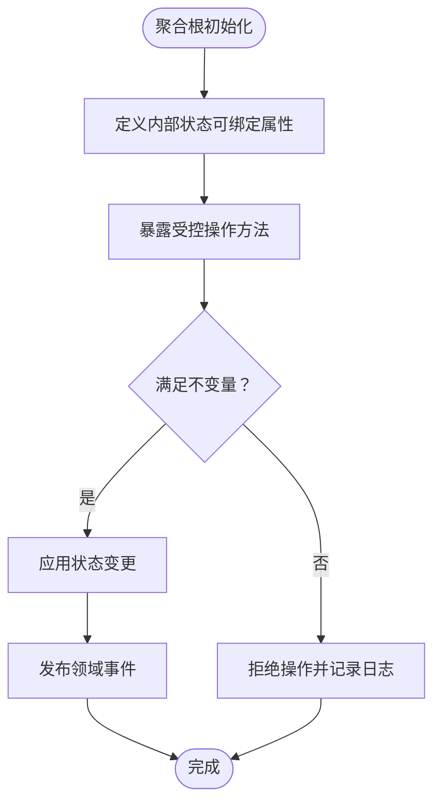
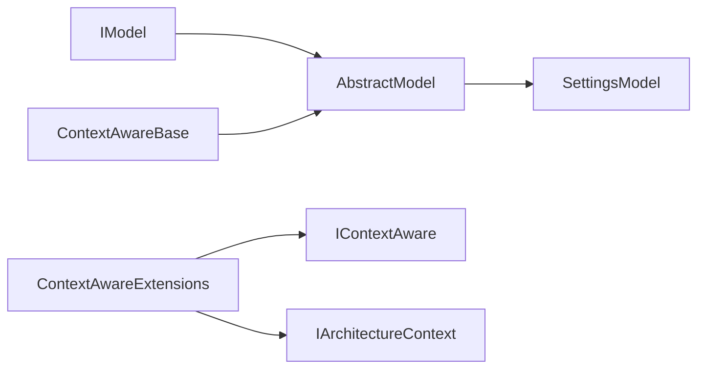

# 实体与聚合根

<cite>
**本文引用的文件**
- [AbstractModel.cs](file://GFramework.Core/model/AbstractModel.cs)
- [IModel.cs](file://GFramework.Core.Abstractions/model/IModel.cs)
- [README.md（Model 包）](file://GFramework.Core/model/README.md)
- [README.md（Property 包）](file://GFramework.Core/property/README.md)
- [README.md（Architecture 包）](file://GFramework.Core/architecture/README.md)
- [ContextAwareBase.cs](file://GFramework.Core/rule/ContextAwareBase.cs)
- [IContextAware.cs](file://GFramework.Core.Abstractions/rule/IContextAware.cs)
- [ContextAwareExtensions.cs](file://GFramework.Core/extensions/ContextAwareExtensions.cs)
- [TestModel.cs](file://GFramework.Core.Tests/model/TestModel.cs)
- [AsyncTestModel.cs](file://GFramework.Core.Tests/model/AsyncTestModel.cs)
- [FailingModel.cs](file://GFramework.Core.Tests/model/FailingModel.cs)
- [SettingsModel.cs](file://GFramework.Game/setting/SettingsModel.cs)
- [core-api.md](file://docs/api-reference/core-api.md)
- [advanced-patterns.md](file://docs/tutorials/advanced-patterns.md)
</cite>

## 目录
1. [引言](#引言)
2. [项目结构](#项目结构)
3. [核心组件](#核心组件)
4. [架构总览](#架构总览)
5. [详细组件分析](#详细组件分析)
6. [依赖分析](#依赖分析)
7. [性能考虑](#性能考虑)
8. [故障排查指南](#故障排查指南)
9. [结论](#结论)
10. [附录](#附录)

## 引言
本篇文档围绕 GFramework 中“实体与聚合根”的概念展开，结合仓库中现有的模型与属性体系，系统阐述实体的定义、特征与实现模式，重点覆盖以下主题：
- 实体与聚合根的边界与职责
- 标识符、生命周期、状态变更等核心概念
- 在 GFramework 中如何实现“可变实体”和“不可变实体”
- AbstractModel 的使用、实体初始化、状态管理等关键实现细节
- 游戏开发中的实际应用案例（玩家实体、角色实体等）

由于仓库中未提供名为 AbstractEntity 的实体基类，本文以“模型即实体”的思路进行说明，并通过 AbstractModel 与 BindableProperty 的组合，展示实体的可变性与状态管理；同时参考 DDD 教程中的“领域实体”示例，帮助读者理解聚合根的边界与不变量。

## 项目结构
GFramework 的实体与状态管理主要分布在以下模块：
- Core 层：模型与属性
  - model：模型抽象与接口
  - property：可绑定属性，用于状态变更与监听
  - rule：上下文感知基类与接口
  - extensions：上下文扩展方法
- Game 层：游戏领域的模型示例（设置模型）
- 文档：API 参考与高级模式教程

图表来源
- [AbstractModel.cs](file://GFramework.Core/model/AbstractModel.cs#L11-L33)
- [IModel.cs](file://GFramework.Core.Abstractions/model/IModel.cs#L10-L10)
- [ContextAwareBase.cs](file://GFramework.Core/rule/ContextAwareBase.cs#L10-L42)
- [IContextAware.cs](file://GFramework.Core.Abstractions/rule/IContextAware.cs#L8-L21)
- [ContextAwareExtensions.cs](file://GFramework.Core/extensions/ContextAwareExtensions.cs#L15-L34)
- [SettingsModel.cs](file://GFramework.Game/setting/SettingsModel.cs#L9-L103)
- [README.md（Model 包）](file://GFramework.Core/model/README.md#L32-L74)
- [README.md（Property 包）](file://GFramework.Core/property/README.md#L45-L129)
- [README.md（Architecture 包）](file://GFramework.Core/architecture/README.md#L82-L206)
- [core-api.md](file://docs/api-reference/core-api.md#L420-L490)
- [advanced-patterns.md](file://docs/tutorials/advanced-patterns.md#L213-L369)

章节来源
- [README.md（Model 包）](file://GFramework.Core/model/README.md#L1-L184)
- [README.md（Property 包）](file://GFramework.Core/property/README.md#L1-L342)
- [README.md（Architecture 包）](file://GFramework.Core/architecture/README.md#L1-L503)

## 核心组件
- IModel：模型接口，定义了模型的基本行为与生命周期能力（上下文感知、架构阶段事件、初始化）。
- AbstractModel：模型抽象基类，实现 IModel，提供 OnInit 抽象方法与架构阶段事件处理的空实现。
- BindableProperty：可绑定属性，用于模型状态的监听与响应式更新。
- ContextAwareBase：上下文感知基类，为模型提供架构上下文访问能力。
- ContextAwareExtensions：扩展方法，提供 GetModel/GetSystem 等便捷访问。

章节来源
- [IModel.cs](file://GFramework.Core.Abstractions/model/IModel.cs#L7-L10)
- [AbstractModel.cs](file://GFramework.Core/model/AbstractModel.cs#L11-L33)
- [ContextAwareBase.cs](file://GFramework.Core/rule/ContextAwareBase.cs#L10-L42)
- [ContextAwareExtensions.cs](file://GFramework.Core/extensions/ContextAwareExtensions.cs#L15-L34)
- [README.md（Model 包）](file://GFramework.Core/model/README.md#L32-L74)
- [README.md（Property 包）](file://GFramework.Core/property/README.md#L45-L129)

## 架构总览
GFramework 的架构采用 MVC 与 CQRS 结合的模式，模型层负责数据与状态，系统层负责业务规则，命令与查询负责交互入口。模型通过上下文感知能力访问系统与事件总线，实现松耦合。

图表来源
- [README.md（Architecture 包）](file://GFramework.Core/architecture/README.md#L82-L206)
- [IModel.cs](file://GFramework.Core.Abstractions/model/IModel.cs#L7-L10)
- [AbstractModel.cs](file://GFramework.Core/model/AbstractModel.cs#L11-L33)
- [ContextAwareBase.cs](file://GFramework.Core/rule/ContextAwareBase.cs#L10-L42)
- [IContextAware.cs](file://GFramework.Core.Abstractions/rule/IContextAware.cs#L8-L21)
- [ContextAwareExtensions.cs](file://GFramework.Core/extensions/ContextAwareExtensions.cs#L15-L34)
- [SettingsModel.cs](file://GFramework.Game/setting/SettingsModel.cs#L9-L103)
- [README.md（Property 包）](file://GFramework.Core/property/README.md#L45-L129)

## 详细组件分析

### AbstractModel：模型基类与生命周期
- 职责
  - 实现 IModel，提供初始化入口 OnInit
  - 提供 OnArchitecturePhase 的空实现，子类可按需覆盖
  - 继承 ContextAwareBase，具备上下文感知能力
- 关键点
  - OnInit：子类在此实现初始化逻辑，常用于注册属性监听、发送事件等
  - OnArchitecturePhase：按架构阶段（如 Ready/Destroying）执行相应处理
- 测试与示例
  - TestModel：演示同步初始化与阶段处理
  - AsyncTestModel：演示异步初始化与同步初始化的约束
  - FailingModel：演示初始化失败的异常处理

图表来源
- [IModel.cs](file://GFramework.Core.Abstractions/model/IModel.cs#L7-L10)
- [AbstractModel.cs](file://GFramework.Core/model/AbstractModel.cs#L11-L33)
- [ContextAwareBase.cs](file://GFramework.Core/rule/ContextAwareBase.cs#L10-L42)
- [TestModel.cs](file://GFramework.Core.Tests/model/TestModel.cs#L9-L36)
- [AsyncTestModel.cs](file://GFramework.Core.Tests/model/AsyncTestModel.cs#L10-L48)
- [FailingModel.cs](file://GFramework.Core.Tests/model/FailingModel.cs#L11-L51)

章节来源
- [AbstractModel.cs](file://GFramework.Core/model/AbstractModel.cs#L11-L33)
- [README.md（Model 包）](file://GFramework.Core/model/README.md#L32-L74)
- [TestModel.cs](file://GFramework.Core.Tests/model/TestModel.cs#L9-L36)
- [AsyncTestModel.cs](file://GFramework.Core.Tests/model/AsyncTestModel.cs#L10-L48)
- [FailingModel.cs](file://GFramework.Core.Tests/model/FailingModel.cs#L11-L51)

### 可绑定属性：状态变更与监听
- BindableProperty 的作用
  - 提供可监听的状态值，支持注册回调、立即触发回调、批量设置而不触发事件等
  - 在模型中用于表达实体状态（如生命值、等级、金币等），并通过事件通知外部
- 使用模式
  - 在模型中定义可绑定属性
  - 在 OnInit 中注册监听，根据状态变化发送事件或触发副作用
  - 在 UI 控制器中监听属性变化，实现数据绑定

图表来源
- [README.md（Property 包）](file://GFramework.Core/property/README.md#L101-L129)
- [README.md（Model 包）](file://GFramework.Core/model/README.md#L92-L132)

章节来源
- [README.md（Property 包）](file://GFramework.Core/property/README.md#L45-L129)
- [README.md（Model 包）](file://GFramework.Core/model/README.md#L92-L132)

### 上下文感知与模型获取
- ContextAwareBase 提供 SetContext/GetContext，使模型能够访问架构上下文
- ContextAwareExtensions 提供 GetModel/GetSystem 等扩展方法，简化模型与系统的获取

图表来源
- [ContextAwareExtensions.cs](file://GFramework.Core/extensions/ContextAwareExtensions.cs#L15-L34)
- [IContextAware.cs](file://GFramework.Core.Abstractions/rule/IContextAware.cs#L8-L21)
- [README.md（Architecture 包）](file://GFramework.Core/architecture/README.md#L32-L34)

章节来源
- [ContextAwareBase.cs](file://GFramework.Core/rule/ContextAwareBase.cs#L10-L42)
- [ContextAwareExtensions.cs](file://GFramework.Core/extensions/ContextAwareExtensions.cs#L15-L34)
- [README.md（Architecture 包）](file://GFramework.Core/architecture/README.md#L32-L34)

### 游戏领域模型示例：设置模型
- SettingsModel 展示了如何在模型中管理多种设置节（数据设置与应用器设置），并提供注册、获取与枚举能力
- 该模型同样继承 AbstractModel，体现“模型即实体”的思想

图表来源
- [SettingsModel.cs](file://GFramework.Game/setting/SettingsModel.cs#L9-L103)
- [AbstractModel.cs](file://GFramework.Core/model/AbstractModel.cs#L11-L33)

章节来源
- [SettingsModel.cs](file://GFramework.Game/setting/SettingsModel.cs#L9-L103)
- [README.md（Model 包）](file://GFramework.Core/model/README.md#L32-L74)

### DDD 领域实体与聚合根（概念映射）
- 仓库未提供 AbstractEntity，但教程中展示了“领域实体”的实现思路，可作为聚合根的参考
- 聚合根边界建议
  - 仅暴露必要的公开方法，内部通过不变量与领域服务维护一致性
  - 通过事件发布领域事件，避免跨聚合直接调用
- 在 GFramework 中的落地
  - 使用 AbstractModel 表达聚合根的状态与行为
  - 使用 BindableProperty 表达可观察的状态
  - 使用命令/查询/事件总线协调跨聚合交互

图表来源
- [advanced-patterns.md](file://docs/tutorials/advanced-patterns.md#L213-L369)
- [README.md（Property 包）](file://GFramework.Core/property/README.md#L101-L129)
- [README.md（Model 包）](file://GFramework.Core/model/README.md#L92-L132)

章节来源
- [advanced-patterns.md](file://docs/tutorials/advanced-patterns.md#L213-L369)

## 依赖分析
- 组件耦合
  - AbstractModel 依赖 IModel、ContextAwareBase、架构阶段枚举
  - ContextAwareExtensions 依赖 IContextAware 与 IArchitectureContext
  - SettingsModel 依赖 AbstractModel 与游戏抽象接口
- 外部依赖
  - 事件系统、命令/查询总线、IoC 容器由架构层提供

图表来源
- [IModel.cs](file://GFramework.Core.Abstractions/model/IModel.cs#L7-L10)
- [AbstractModel.cs](file://GFramework.Core/model/AbstractModel.cs#L11-L33)
- [ContextAwareBase.cs](file://GFramework.Core/rule/ContextAwareBase.cs#L10-L42)
- [ContextAwareExtensions.cs](file://GFramework.Core/extensions/ContextAwareExtensions.cs#L15-L34)
- [SettingsModel.cs](file://GFramework.Game/setting/SettingsModel.cs#L9-L103)

章节来源
- [README.md（Architecture 包）](file://GFramework.Core/architecture/README.md#L82-L206)

## 性能考虑
- 批量更新：使用 SetValueWithoutEvent 减少事件触发频率，最后统一发送事件
- 比较器优化：为浮点数等属性设置自定义比较器，避免微小波动引发的无效更新
- 监听注销：及时注销监听，防止内存泄漏与重复回调

章节来源
- [README.md（Property 包）](file://GFramework.Core/property/README.md#L278-L302)
- [README.md（Property 包）](file://GFramework.Core/property/README.md#L280-L294)

## 故障排查指南
- 初始化失败
  - 检查模型 OnInit 是否抛出异常
  - 使用测试模型 FailingModel 的模式定位问题
- 异步初始化冲突
  - 确保仅调用 InitializeAsync，避免调用 Init
- 循环依赖
  - 避免在属性监听中直接修改其他模型，改用事件或命令协调

章节来源
- [FailingModel.cs](file://GFramework.Core.Tests/model/FailingModel.cs#L11-L51)
- [AsyncTestModel.cs](file://GFramework.Core.Tests/model/AsyncTestModel.cs#L10-L48)
- [README.md（Model 包）](file://GFramework.Core/model/README.md#L170-L177)

## 结论
在 GFramework 中，“模型即实体”的设计使得实体与聚合根的职责清晰：模型承载状态与行为，通过可绑定属性与事件实现状态变更与对外通知；通过上下文感知与架构总线实现松耦合协作。对于需要强 DDD 边界的场景，可参考教程中的领域实体实现，将不变量与领域服务纳入模型边界，配合命令/事件总线实现跨聚合交互。

## 附录
- 实际应用案例
  - 玩家实体：使用可绑定属性表达玩家状态（等级、生命值、金币等），在 OnInit 中注册监听并在状态变化时发送事件
  - 角色实体：可参考教程中的 Player 类，将攻击、治疗、经验增长等行为封装为聚合根的操作方法
- API 使用示例
  - 命令/查询/事件在 API 文档中有完整示例，可参考其中的模型获取与事件发送模式

章节来源
- [README.md（Model 包）](file://GFramework.Core/model/README.md#L92-L168)
- [core-api.md](file://docs/api-reference/core-api.md#L420-L490)
- [advanced-patterns.md](file://docs/tutorials/advanced-patterns.md#L213-L369)