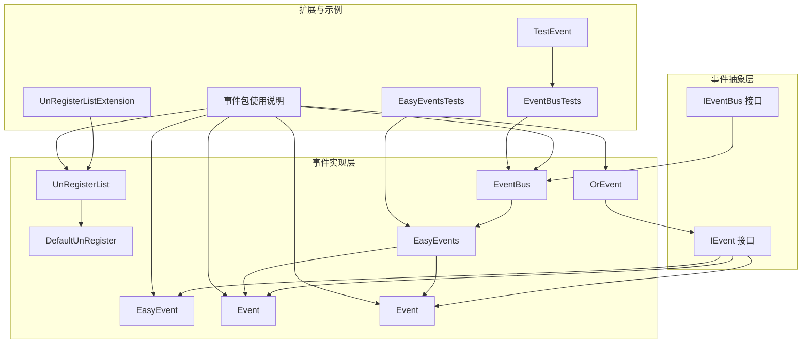
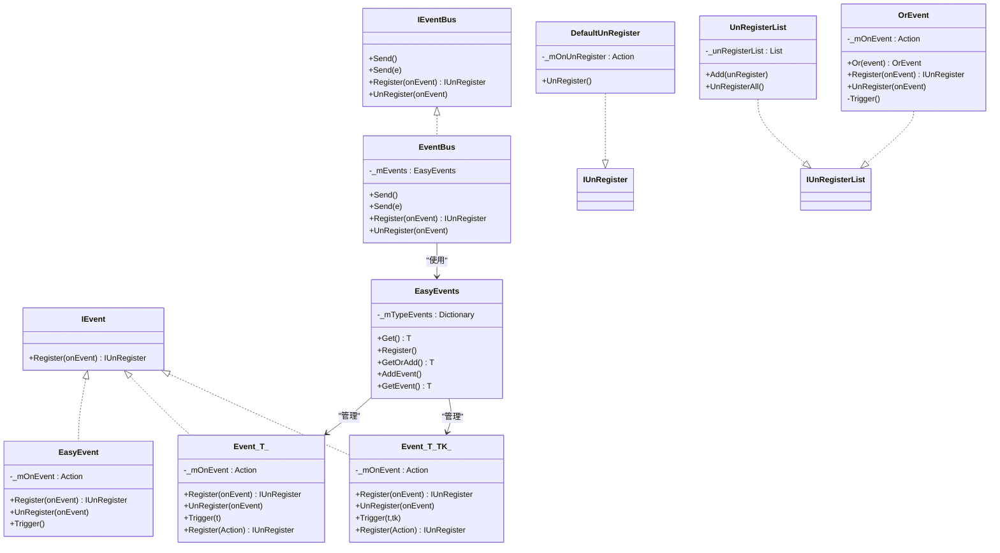
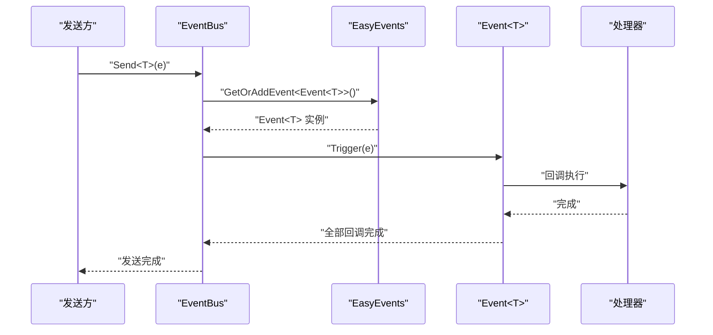
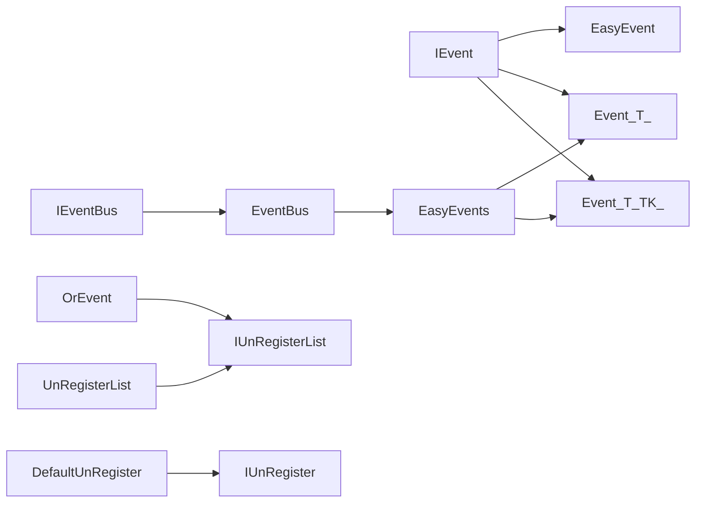

# 领域事件

<cite>
**本文引用的文件**
- [EasyEvent.cs](file://GFramework.Core/events/EasyEvent.cs)
- [EasyEventGeneric.cs](file://GFramework.Core/events/EasyEventGeneric.cs)
- [EasyEvents.cs](file://GFramework.Core/events/EasyEvents.cs)
- [EventBus.cs](file://GFramework.Core/events/EventBus.cs)
- [ArchitectureEvents.cs](file://GFramework.Core/events/ArchitectureEvents.cs)
- [DefaultUnRegister.cs](file://GFramework.Core/events/DefaultUnRegister.cs)
- [UnRegisterList.cs](file://GFramework.Core/events/UnRegisterList.cs)
- [OrEvent.cs](file://GFramework.Core/events/OrEvent.cs)
- [IEvent.cs](file://GFramework.Core.Abstractions/events/IEvent.cs)
- [IEventBus.cs](file://GFramework.Core.Abstractions/events/IEventBus.cs)
- [UnRegisterListExtension.cs](file://GFramework.Core/extensions/UnRegisterListExtension.cs)
- [README.md（事件包）](file://GFramework.Core/events/README.md)
- [EasyEventsTests.cs](file://GFramework.Core.Tests/events/EasyEventsTests.cs)
- [EventBusTests.cs](file://GFramework.Core.Tests/events/EventBusTests.cs)
- [TestEvent.cs](file://GFramework.Core.Tests/events/TestEvent.cs)
</cite>

## 目录
1. [简介](#简介)
2. [项目结构](#项目结构)
3. [核心组件](#核心组件)
4. [架构概览](#架构概览)
5. [详细组件分析](#详细组件分析)
6. [依赖分析](#依赖分析)
7. [性能考量](#性能考量)
8. [故障排查指南](#故障排查指南)
9. [结论](#结论)
10. [附录](#附录)

## 简介
本章节面向游戏开发中的领域事件体系，系统阐述事件的定义、触发时机与传播机制，覆盖事件生命周期、处理器注册与注销、事件组合与批量管理等关键主题。重点解析 EasyEvent 的实现原理与使用模式，展示如何在领域逻辑中正确发布与处理事件，并给出完整的代码示例路径与实战案例（玩家升级、物品获得、战斗结果等）。

## 项目结构
事件系统位于 GFramework.Core 的 events 目录下，核心由以下部分组成：
- 事件基元与泛型事件：EasyEvent、Event<T>、Event<T,TK>
- 事件管理与总线：EasyEvents、EventBus
- 注销与组合：DefaultUnRegister、UnRegisterList、OrEvent
- 抽象接口：IEvent、IEventBus
- 扩展与示例：UnRegisterListExtension、README.md、测试用例

图表来源
- [IEvent.cs](file://GFramework.Core.Abstractions/events/IEvent.cs#L8-L16)
- [IEventBus.cs](file://GFramework.Core.Abstractions/events/IEventBus.cs#L8-L37)
- [EasyEvent.cs](file://GFramework.Core/events/EasyEvent.cs#L8-L39)
- [EasyEventGeneric.cs](file://GFramework.Core/events/EasyEventGeneric.cs#L10-L62)
- [EasyEventGeneric.cs](file://GFramework.Core/events/EasyEventGeneric.cs#L70-L123)
- [OrEvent.cs](file://GFramework.Core/events/OrEvent.cs#L9-L57)
- [DefaultUnRegister.cs](file://GFramework.Core/events/DefaultUnRegister.cs#L9-L22)
- [UnRegisterList.cs](file://GFramework.Core/events/UnRegisterList.cs#L8-L37)
- [EventBus.cs](file://GFramework.Core/events/EventBus.cs#L8-L55)
- [EasyEvents.cs](file://GFramework.Core/events/EasyEvents.cs#L9-L85)
- [UnRegisterListExtension.cs](file://GFramework.Core/extensions/UnRegisterListExtension.cs#L8-L32)
- [README.md（事件包）](file://GFramework.Core/events/README.md#L1-L523)
- [EasyEventsTests.cs](file://GFramework.Core.Tests/events/EasyEventsTests.cs#L10-L62)
- [EventBusTests.cs](file://GFramework.Core.Tests/events/EventBusTests.cs#L10-L85)
- [TestEvent.cs](file://GFramework.Core.Tests/events/TestEvent.cs#L3-L8)

章节来源
- [README.md（事件包）](file://GFramework.Core/events/README.md#L1-L523)

## 核心组件
- EasyEvent：无参事件，支持注册、注销与触发。
- Event<T>/Event<T,TK>：单/双参数泛型事件，实现 IEvent，支持显式无参注册。
- EasyEvents：全局事件管理器，按类型注册/获取事件实例，支持 GetOrAdd 自动创建。
- EventBus：基于类型的事件总线，提供 Send/Register/UnRegister。
- DefaultUnRegister/UnRegisterList：注销器与注销列表，统一管理处理器生命周期。
- OrEvent：事件“或”组合器，任一子事件触发即触发自身。
- ArchitectureEvents：架构生命周期事件结构体集合。

章节来源
- [EasyEvent.cs](file://GFramework.Core/events/EasyEvent.cs#L8-L39)
- [EasyEventGeneric.cs](file://GFramework.Core/events/EasyEventGeneric.cs#L10-L62)
- [EasyEventGeneric.cs](file://GFramework.Core/events/EasyEventGeneric.cs#L70-L123)
- [EasyEvents.cs](file://GFramework.Core/events/EasyEvents.cs#L9-L85)
- [EventBus.cs](file://GFramework.Core/events/EventBus.cs#L8-L55)
- [DefaultUnRegister.cs](file://GFramework.Core/events/DefaultUnRegister.cs#L9-L22)
- [UnRegisterList.cs](file://GFramework.Core/events/UnRegisterList.cs#L8-L37)
- [OrEvent.cs](file://GFramework.Core/events/OrEvent.cs#L9-L57)
- [ArchitectureEvents.cs](file://GFramework.Core/events/ArchitectureEvents.cs#L6-L31)

## 架构概览
事件系统采用“抽象接口 + 具体实现 + 管理器/总线 + 注销/组合”的分层设计，既保证了松耦合的观察者模式，又提供了类型安全与生命周期管理能力。

图表来源
- [IEvent.cs](file://GFramework.Core.Abstractions/events/IEvent.cs#L8-L16)
- [IEventBus.cs](file://GFramework.Core.Abstractions/events/IEventBus.cs#L8-L37)
- [EasyEvent.cs](file://GFramework.Core/events/EasyEvent.cs#L8-L39)
- [EasyEventGeneric.cs](file://GFramework.Core/events/EasyEventGeneric.cs#L10-L62)
- [EasyEventGeneric.cs](file://GFramework.Core/events/EasyEventGeneric.cs#L70-L123)
- [EasyEvents.cs](file://GFramework.Core/events/EasyEvents.cs#L9-L85)
- [EventBus.cs](file://GFramework.Core/events/EventBus.cs#L8-L55)
- [DefaultUnRegister.cs](file://GFramework.Core/events/DefaultUnRegister.cs#L9-L22)
- [UnRegisterList.cs](file://GFramework.Core/events/UnRegisterList.cs#L8-L37)
- [OrEvent.cs](file://GFramework.Core/events/OrEvent.cs#L9-L57)

## 详细组件分析

### EasyEvent：无参事件
- 设计要点
  - 内部维护 Action 委托链，初始为空操作以避免 null 检查。
  - Register 返回 IUnRegister，便于注销；UnRegister 从委托链移除。
  - Trigger 调用所有已注册回调。
- 使用模式
  - 适合简单通知场景，如按钮点击、阶段切换等。
  - 与 UnRegisterList 或节点生命周期结合，确保及时注销。

章节来源
- [EasyEvent.cs](file://GFramework.Core/events/EasyEvent.cs#L8-L39)
- [DefaultUnRegister.cs](file://GFramework.Core/events/DefaultUnRegister.cs#L9-L22)
- [README.md（事件包）](file://GFramework.Core/events/README.md#L54-L76)

### Event<T>/Event<T,TK>：泛型事件
- 设计要点
  - 支持单/双参数事件，内部以 Action<T>/Action<T,TK> 存储回调。
  - 显式实现 IEvent.Register(Action)，允许无参订阅。
  - Trigger 分别传递参数给回调。
- 使用模式
  - 适合携带少量上下文的事件，如分数变更、位置变化等。
  - 与 EventBus/EasyEvents 结合，实现类型化事件总线。

章节来源
- [EasyEventGeneric.cs](file://GFramework.Core/events/EasyEventGeneric.cs#L10-L62)
- [EasyEventGeneric.cs](file://GFramework.Core/events/EasyEventGeneric.cs#L70-L123)
- [IEvent.cs](file://GFramework.Core.Abstractions/events/IEvent.cs#L8-L16)

### EasyEvents：全局事件管理器
- 设计要点
  - 以静态单例持有全局事件字典，键为事件类型，值为 IEvent 实例。
  - 提供 Register/Get/GetOrAdd/AddEvent 等方法，类型安全地管理事件。
- 使用模式
  - 作为全局事件中心，跨模块共享事件实例。
  - 与 EventBus 协作，简化事件注册/获取流程。

章节来源
- [EasyEvents.cs](file://GFramework.Core/events/EasyEvents.cs#L9-L85)
- [README.md（事件包）](file://GFramework.Core/events/README.md#L115-L137)

### EventBus：类型化事件总线
- 设计要点
  - 基于 EasyEvents，提供 Send<T>()（自动构造）、Send<T>(T e)（传入实例）、Register<T>、UnRegister<T>。
  - Send 内部通过 GetOrAddEvent<Event<T>> 获取/创建事件并触发。
- 使用模式
  - 适合模块间解耦通信，如系统向控制器广播事件。

章节来源
- [EventBus.cs](file://GFramework.Core/events/EventBus.cs#L8-L55)
- [IEventBus.cs](file://GFramework.Core.Abstractions/events/IEventBus.cs#L8-L37)
- [README.md（事件包）](file://GFramework.Core/events/README.md#L138-L163)

### 注销与组合：DefaultUnRegister、UnRegisterList、OrEvent
- DefaultUnRegister
  - 封装注销回调，调用后清理引用，防止重复注销。
- UnRegisterList
  - 批量管理 IUnRegister，提供 Add 与 UnRegisterAll。
- OrEvent
  - 将多个事件“或”组合，任一触发即触发自身；同时实现 IUnRegisterList，支持统一注销。

章节来源
- [DefaultUnRegister.cs](file://GFramework.Core/events/DefaultUnRegister.cs#L9-L22)
- [UnRegisterList.cs](file://GFramework.Core/events/UnRegisterList.cs#L8-L37)
- [OrEvent.cs](file://GFramework.Core/events/OrEvent.cs#L9-L57)
- [UnRegisterListExtension.cs](file://GFramework.Core/extensions/UnRegisterListExtension.cs#L8-L32)

### 架构事件：ArchitectureEvents
- 定义架构生命周期事件结构体，便于在架构初始化/销毁阶段进行通知与联动。

章节来源
- [ArchitectureEvents.cs](file://GFramework.Core/events/ArchitectureEvents.cs#L6-L31)

### 事件生命周期与传播机制
- 生命周期
  - 注册：调用 Register 返回 IUnRegister。
  - 触发：调用 Trigger 或 EventBus.Send。
  - 注销：调用 UnRegister 或 UnRegisterAll。
- 传播
  - 同类型事件的所有处理器按注册顺序依次执行。
  - 通过 EventBus/EasyEvents 实现跨模块传播。
  - 通过 OrEvent 实现多事件聚合触发。

图表来源
- [EventBus.cs](file://GFramework.Core/events/EventBus.cs#L16-L33)
- [EasyEvents.cs](file://GFramework.Core/events/EasyEvents.cs#L74-L84)
- [EasyEventGeneric.cs](file://GFramework.Core/events/EasyEventGeneric.cs#L58-L61)

### 异步处理与最佳实践
- 异步处理建议
  - 事件处理器应保持轻量，避免阻塞主线程。
  - 若需复杂逻辑，可在处理器内派发命令或查询，而非直接执行耗时操作。
- 最佳实践
  - 事件命名使用过去式+Event后缀，结构体承载数据。
  - 避免事件循环，谨慎在处理器中再次发送事件。
  - 使用 UnRegisterList 批量管理注销，利用节点生命周期自动注销。

章节来源
- [README.md（事件包）](file://GFramework.Core/events/README.md#L476-L506)

## 依赖分析
- 组件耦合
  - EventBus 依赖 EasyEvents；EasyEvents 管理 Event<T>/Event<T,TK>。
  - OrEvent 实现 IUnRegisterList，便于组合与注销。
  - DefaultUnRegister 实现 IUnRegister，统一注销语义。
- 外部依赖
  - 事件系统不依赖具体平台，但 README 展示了与 Godot 的集成思路（扩展与生命周期）。

图表来源
- [IEvent.cs](file://GFramework.Core.Abstractions/events/IEvent.cs#L8-L16)
- [IEventBus.cs](file://GFramework.Core.Abstractions/events/IEventBus.cs#L8-L37)
- [EventBus.cs](file://GFramework.Core/events/EventBus.cs#L8-L55)
- [EasyEvents.cs](file://GFramework.Core/events/EasyEvents.cs#L9-L85)
- [OrEvent.cs](file://GFramework.Core/events/OrEvent.cs#L9-L57)
- [DefaultUnRegister.cs](file://GFramework.Core/events/DefaultUnRegister.cs#L9-L22)
- [UnRegisterList.cs](file://GFramework.Core/events/UnRegisterList.cs#L8-L37)

## 性能考量
- 事件处理器保持轻量，避免高频触发（如每帧）。
- 使用结构体事件减少 GC 压力。
- 合理拆分事件粒度，避免单事件承载过多信息。
- 使用 UnRegisterList 批量注销，降低资源泄漏风险。

章节来源
- [README.md（事件包）](file://GFramework.Core/events/README.md#L502-L506)

## 故障排查指南
- 常见问题
  - 事件未触发：检查是否通过 EventBus.Send 或 Event<T>.Trigger 正确触发。
  - 处理器未注销：确认使用 IUnRegister.UnRegister 或 UnRegisterList.UnRegisterAll。
  - 重复触发导致异常：检查是否存在事件循环，必要时引入命令或查询打断依赖。
- 单元测试参考
  - EasyEvents：验证单/双参数事件的触发与参数传递。
  - EventBus：验证注册、注销与多处理器触发行为。

章节来源
- [EasyEventsTests.cs](file://GFramework.Core.Tests/events/EasyEventsTests.cs#L10-L62)
- [EventBusTests.cs](file://GFramework.Core.Tests/events/EventBusTests.cs#L10-L85)
- [TestEvent.cs](file://GFramework.Core.Tests/events/TestEvent.cs#L3-L8)

## 结论
GFramework 的事件系统以 IEvent/IEventBus 为核心抽象，配合 EasyEvent、Event<T>、EventBus、EasyEvents、UnRegisterList、OrEvent 等组件，构建了类型安全、生命周期友好、易于组合的领域事件框架。通过合理的事件设计与注销管理，可在游戏开发中高效实现跨模块通信与状态通知。

## 附录

### 完整使用流程示例（路径）
- 定义事件
  - 示例：[事件定义示例](file://GFramework.Core/events/README.md#L226-L247)
- 发布事件（模型/系统）
  - 示例：[模型发送事件](file://GFramework.Core/events/README.md#L249-L273)
  - 示例：[系统发送事件](file://GFramework.Core/events/README.md#L275-L295)
- 订阅事件（控制器）
  - 示例：[控制器注册事件](file://GFramework.Core/events/README.md#L297-L341)
- 生命周期管理
  - 批量注销：[使用 UnRegisterList](file://GFramework.Core/events/README.md#L439-L463)
  - 节点生命周期：[Godot 节点注销](file://GFramework.Core/events/README.md#L465-L474)

### 实战案例设计与实现（路径）
- 玩家升级事件
  - 定义事件：[升级事件结构体](file://GFramework.Core/events/README.md#L232-L247)
  - 发布：在模型属性变化时发送事件
  - 订阅：UI/日志系统订阅并更新界面
- 物品获得事件
  - 定义事件：包含物品ID、数量、来源等
  - 发布：在拾取逻辑中发送事件
  - 订阅：背包系统、统计系统订阅处理
- 战斗结果事件
  - 定义事件：包含胜负、伤害、时间戳等
  - 发布：在结算逻辑中发送事件
  - 订阅：UI、存档、成就系统订阅处理

章节来源
- [README.md（事件包）](file://GFramework.Core/events/README.md#L226-L341)
- [README.md（事件包）](file://GFramework.Core/events/README.md#L439-L474)