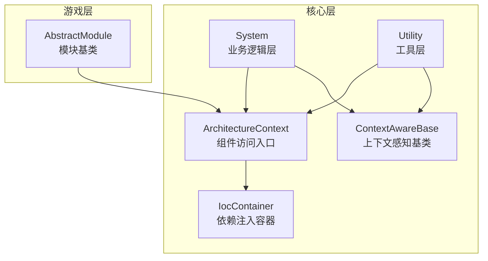
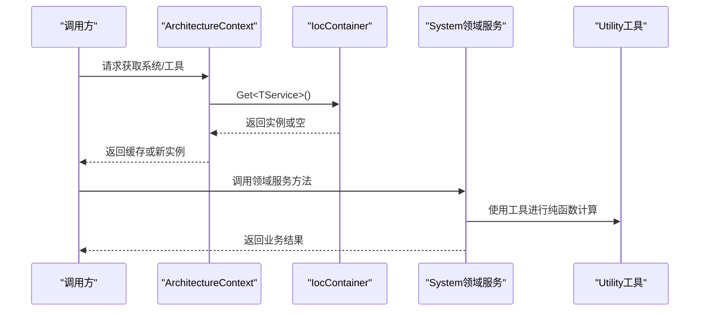
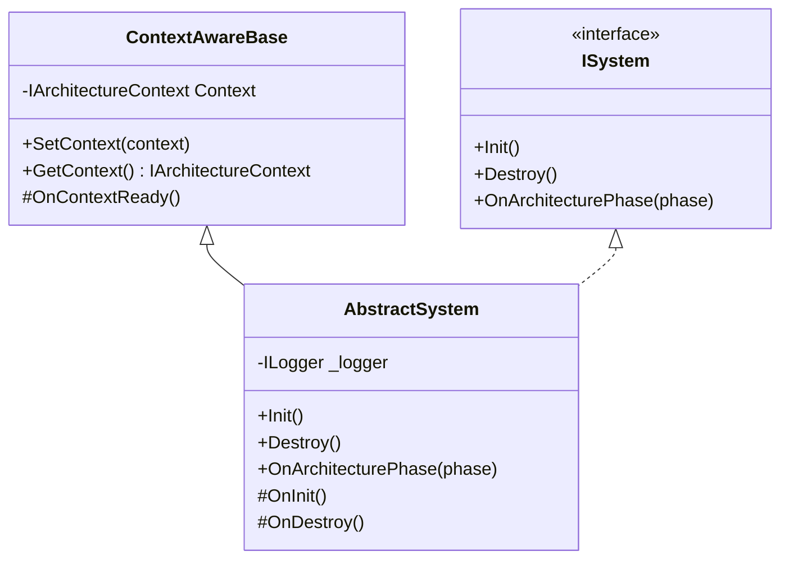
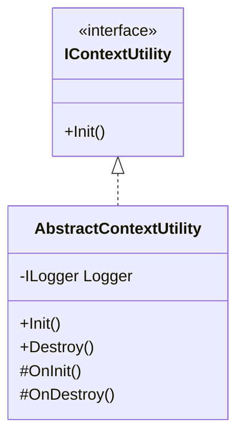
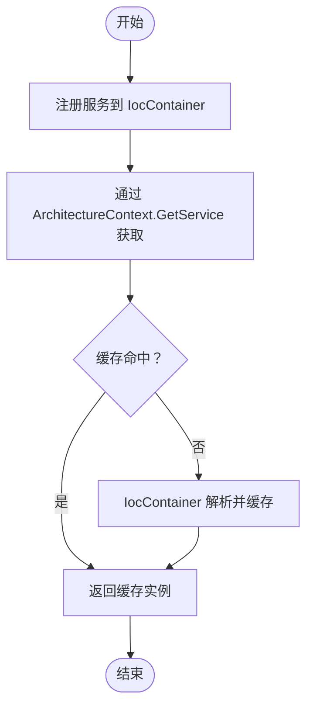
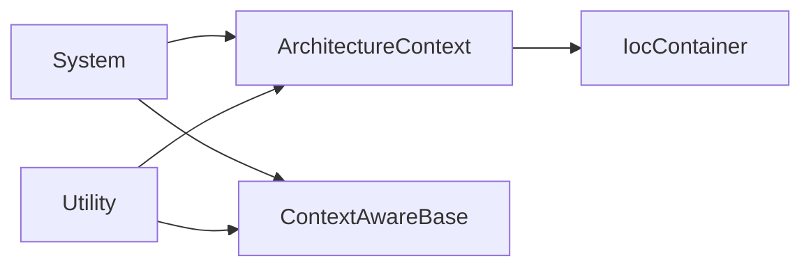

# 领域服务

<cite>
**本文引用的文件**
- [AbstractSystem.cs](file://GFramework.Core/system/AbstractSystem.cs)
- [ISystem.cs](file://GFramework.Core.Abstractions/system/ISystem.cs)
- [AbstractContextUtility.cs](file://GFramework.Core/utility/AbstractContextUtility.cs)
- [IContextUtility.cs](file://GFramework.Core.Abstractions/utility/IContextUtility.cs)
- [ContextAwareBase.cs](file://GFramework.Core/rule/ContextAwareBase.cs)
- [IocContainer.cs](file://GFramework.Core/ioc/IocContainer.cs)
- [GameContext.cs](file://GFramework.Core/architecture/GameContext.cs)
- [ArchitectureContext.cs](file://GFramework.Core/architecture/ArchitectureContext.cs)
- [README.md（System 使用说明）](file://GFramework.Core/system/README.md)
- [README.md（Utility 使用说明）](file://GFramework.Core/utility/README.md)
- [AbstractModule.cs](file://GFramework.Game/architecture/AbstractModule.cs)
- [IArchitecture.cs](file://GFramework.Core.Abstractions/architecture/IArchitecture.cs)
- [README.md（源生成器示例）](file://GFramework.SourceGenerators/README.md)
- [AbstractContextUtilityTests.cs](file://GFramework.Core.Tests/utility/AbstractContextUtilityTests.cs)
</cite>

## 目录
1. [简介](#简介)
2. [项目结构](#项目结构)
3. [核心组件](#核心组件)
4. [架构总览](#架构总览)
5. [详细组件分析](#详细组件分析)
6. [依赖分析](#依赖分析)
7. [性能考虑](#性能考虑)
8. [故障排查指南](#故障排查指南)
9. [结论](#结论)
10. [附录](#附录)

## 简介
本篇文档围绕 GFramework 中“领域服务”的概念展开，结合现有代码库中的 System 与 Utility 层，系统阐述领域服务的定义、职责与设计原则，并明确其与 System、Utility 的边界与协作方式。文档同时给出在 GFramework 中实现领域服务的完整路径：从抽象基类、上下文感知、依赖注入到服务注册与跨服务协作，最后提供战斗计算、物品合成、AI 决策等典型游戏场景的设计与实现思路。

## 项目结构
GFramework 的核心层由以下关键模块组成：
- system：业务逻辑层，负责复杂业务流程与跨聚合协作
- utility：工具层，提供无状态的通用功能
- architecture：架构上下文与组件访问入口
- ioc：依赖注入容器，统一管理对象注册与获取
- rule：上下文感知基类，为需要访问架构上下文的组件提供基础设施
- game/game.abstractions：游戏层与抽象定义（模块化扩展）

图表来源
- [ArchitectureContext.cs](file://GFramework.Core/architecture/ArchitectureContext.cs#L1-L225)
- [IocContainer.cs](file://GFramework.Core/ioc/IocContainer.cs#L1-L373)
- [ContextAwareBase.cs](file://GFramework.Core/rule/ContextAwareBase.cs#L1-L43)
- [AbstractModule.cs](file://GFramework.Game/architecture/AbstractModule.cs#L1-L33)

章节来源
- [ArchitectureContext.cs](file://GFramework.Core/architecture/ArchitectureContext.cs#L1-L225)
- [IocContainer.cs](file://GFramework.Core/ioc/IocContainer.cs#L1-L373)
- [ContextAwareBase.cs](file://GFramework.Core/rule/ContextAwareBase.cs#L1-L43)
- [AbstractModule.cs](file://GFramework.Game/architecture/AbstractModule.cs#L1-L33)

## 核心组件
- 领域服务（在 GFramework 中体现为 System）：负责复杂业务逻辑、跨聚合协作、事件驱动与状态变更，强调“有状态”和“业务编排”。参考 [AbstractSystem.cs](file://GFramework.Core/system/AbstractSystem.cs#L1-L62)、[ISystem.cs](file://GFramework.Core.Abstractions/system/ISystem.cs#L1-L11)。
- 工具服务（Utility）：提供无状态的通用功能，如数学、序列化、随机等，强调“纯函数”和“可复用”。参考 [AbstractContextUtility.cs](file://GFramework.Core/utility/AbstractContextUtility.cs#L1-L55)、[IContextUtility.cs](file://GFramework.Core.Abstractions/utility/IContextUtility.cs#L1-L10)。
- 上下文感知基类：为需要访问架构上下文的组件提供统一能力，包括上下文设置与获取。参考 [ContextAwareBase.cs](file://GFramework.Core/rule/ContextAwareBase.cs#L1-L43)。
- 依赖注入容器：集中管理对象注册、获取与生命周期，支持单例、多实现注册与冻结保护。参考 [IocContainer.cs](file://GFramework.Core/ioc/IocContainer.cs#L1-L373)。
- 架构上下文：统一暴露系统、模型、工具的获取入口，以及命令、查询、事件的执行通道。参考 [ArchitectureContext.cs](file://GFramework.Core/architecture/ArchitectureContext.cs#L1-L225)。

章节来源
- [AbstractSystem.cs](file://GFramework.Core/system/AbstractSystem.cs#L1-L62)
- [ISystem.cs](file://GFramework.Core.Abstractions/system/ISystem.cs#L1-L11)
- [AbstractContextUtility.cs](file://GFramework.Core/utility/AbstractContextUtility.cs#L1-L55)
- [IContextUtility.cs](file://GFramework.Core.Abstractions/utility/IContextUtility.cs#L1-L10)
- [ContextAwareBase.cs](file://GFramework.Core/rule/ContextAwareBase.cs#L1-L43)
- [IocContainer.cs](file://GFramework.Core/ioc/IocContainer.cs#L1-L373)
- [ArchitectureContext.cs](file://GFramework.Core/architecture/ArchitectureContext.cs#L1-L225)

## 架构总览
GFramework 的领域服务通过“系统（System）+ 工具（Utility）+ 架构上下文（ArchitectureContext）+ 依赖注入（IocContainer）+ 上下文感知（ContextAwareBase）”协同工作，形成清晰的分层与职责边界。

图表来源
- [ArchitectureContext.cs](file://GFramework.Core/architecture/ArchitectureContext.cs#L26-L105)
- [IocContainer.cs](file://GFramework.Core/ioc/IocContainer.cs#L211-L294)
- [AbstractSystem.cs](file://GFramework.Core/system/AbstractSystem.cs#L13-L62)
- [AbstractContextUtility.cs](file://GFramework.Core/utility/AbstractContextUtility.cs#L12-L55)

## 详细组件分析

### 领域服务（System）设计与实现
- 无状态或少状态：System 通过事件与模型交互，尽量将状态保留在模型中，System 仅做业务编排与决策。参考 [README.md（System 使用说明）](file://GFramework.Core/system/README.md#L484-L491)。
- 复杂业务逻辑封装：System 负责跨聚合的业务流程，如战斗、任务、状态机等。参考 [README.md（System 使用说明）](file://GFramework.Core/system/README.md#L162-L432)。
- 事件驱动与跨系统协作：System 通过事件与其他 System 松耦合协作，避免紧耦合。参考 [README.md（System 使用说明）](file://GFramework.Core/system/README.md#L282-L365)。
- 生命周期与上下文感知：System 继承自 ContextAwareBase，具备上下文注入能力，可在 OnInit/OnDestroy 中进行初始化与清理。参考 [AbstractSystem.cs](file://GFramework.Core/system/AbstractSystem.cs#L13-L62)、[ContextAwareBase.cs](file://GFramework.Core/rule/ContextAwareBase.cs#L10-L43)。

图表来源
- [ContextAwareBase.cs](file://GFramework.Core/rule/ContextAwareBase.cs#L10-L43)
- [ISystem.cs](file://GFramework.Core.Abstractions/system/ISystem.cs#L1-L11)
- [AbstractSystem.cs](file://GFramework.Core/system/AbstractSystem.cs#L13-L62)

章节来源
- [AbstractSystem.cs](file://GFramework.Core/system/AbstractSystem.cs#L1-L62)
- [ContextAwareBase.cs](file://GFramework.Core/rule/ContextAwareBase.cs#L1-L43)
- [README.md（System 使用说明）](file://GFramework.Core/system/README.md#L162-L432)

### 工具（Utility）与领域服务的关系
- 无状态与纯函数：Utility 是无状态的工具集合，提供纯函数式能力，避免依赖模型或系统。参考 [README.md（Utility 使用说明）](file://GFramework.Core/utility/README.md#L446-L494)。
- 与 System 的协作：System 通过 ArchitectureContext 获取 Utility，将复杂计算与通用逻辑下沉至 Utility，提升可测试性与复用性。参考 [ArchitectureContext.cs](file://GFramework.Core/architecture/ArchitectureContext.cs#L97-L105)。
- 上下文工具（IContextUtility）：当工具需要访问架构上下文时，可继承 AbstractContextUtility，获得上下文注入与日志记录能力。参考 [AbstractContextUtility.cs](file://GFramework.Core/utility/AbstractContextUtility.cs#L12-L55)、[IContextUtility.cs](file://GFramework.Core.Abstractions/utility/IContextUtility.cs#L1-L10)。

图表来源
- [IContextUtility.cs](file://GFramework.Core.Abstractions/utility/IContextUtility.cs#L1-L10)
- [AbstractContextUtility.cs](file://GFramework.Core/utility/AbstractContextUtility.cs#L12-L55)

章节来源
- [AbstractContextUtility.cs](file://GFramework.Core/utility/AbstractContextUtility.cs#L1-L55)
- [IContextUtility.cs](file://GFramework.Core.Abstractions/utility/IContextUtility.cs#L1-L10)
- [README.md（Utility 使用说明）](file://GFramework.Core/utility/README.md#L446-L494)

### 依赖注入与服务注册
- 注册与获取：IocContainer 支持 Register/Get/GetAll/GetRequired 等方法，提供线程安全与冻结保护。参考 [IocContainer.cs](file://GFramework.Core/ioc/IocContainer.cs#L69-L199)、[IocContainer.cs](file://GFramework.Core/ioc/IocContainer.cs#L211-L294)。
- 架构上下文缓存：ArchitectureContext 对服务进行缓存，避免重复解析与降低开销。参考 [ArchitectureContext.cs](file://GFramework.Core/architecture/ArchitectureContext.cs#L31-L41)。
- 架构接口：IArchitecture 提供 RegisterSystem/RegisterModel/RegisterUtility 等注册入口。参考 [IArchitecture.cs](file://GFramework.Core.Abstractions/architecture/IArchitecture.cs#L38-L68)。

图表来源
- [IocContainer.cs](file://GFramework.Core/ioc/IocContainer.cs#L130-L148)
- [ArchitectureContext.cs](file://GFramework.Core/architecture/ArchitectureContext.cs#L26-L41)

章节来源
- [IocContainer.cs](file://GFramework.Core/ioc/IocContainer.cs#L1-L373)
- [ArchitectureContext.cs](file://GFramework.Core/architecture/ArchitectureContext.cs#L1-L225)
- [IArchitecture.cs](file://GFramework.Core.Abstractions/architecture/IArchitecture.cs#L38-L68)

### 领域服务与系统（System）和工具（Utility）的区别与联系
- 区别
  - System：有状态、处理复杂业务流程、跨聚合协作、事件驱动。参考 [README.md（System 使用说明）](file://GFramework.Core/system/README.md#L434-L482)。
  - Utility：无状态、纯函数、通用工具、可复用性强。参考 [README.md（Utility 使用说明）](file://GFramework.Core/utility/README.md#L446-L494)。
- 联系
  - 两者均通过 ArchitectureContext 获取，System 可调用 Utility 完成纯函数计算。
  - 两者均可继承 ContextAwareBase，获得上下文注入能力。参考 [ContextAwareBase.cs](file://GFramework.Core/rule/ContextAwareBase.cs#L10-L43)。

章节来源
- [README.md（System 使用说明）](file://GFramework.Core/system/README.md#L434-L494)
- [README.md（Utility 使用说明）](file://GFramework.Core/utility/README.md#L446-L494)
- [ContextAwareBase.cs](file://GFramework.Core/rule/ContextAwareBase.cs#L1-L43)

### 实现示例与最佳实践
- 使用 AbstractSystem 与 AbstractContextUtility：参考 [AbstractSystem.cs](file://GFramework.Core/system/AbstractSystem.cs#L13-L62)、[AbstractContextUtility.cs](file://GFramework.Core/utility/AbstractContextUtility.cs#L12-L55)。
- 服务注册与依赖注入：参考 [IocContainer.cs](file://GFramework.Core/ioc/IocContainer.cs#L69-L199)、[IArchitecture.cs](file://GFramework.Core.Abstractions/architecture/IArchitecture.cs#L38-L68)。
- 跨服务协作：参考 [README.md（System 使用说明）](file://GFramework.Core/system/README.md#L282-L365)。
- 上下文感知与生命周期测试：参考 [AbstractContextUtilityTests.cs](file://GFramework.Core.Tests/utility/AbstractContextUtilityTests.cs#L1-L295)。

章节来源
- [AbstractSystem.cs](file://GFramework.Core/system/AbstractSystem.cs#L1-L62)
- [AbstractContextUtility.cs](file://GFramework.Core/utility/AbstractContextUtility.cs#L1-L55)
- [IocContainer.cs](file://GFramework.Core/ioc/IocContainer.cs#L1-L373)
- [IArchitecture.cs](file://GFramework.Core.Abstractions/architecture/IArchitecture.cs#L38-L68)
- [README.md（System 使用说明）](file://GFramework.Core/system/README.md#L282-L365)
- [AbstractContextUtilityTests.cs](file://GFramework.Core.Tests/utility/AbstractContextUtilityTests.cs#L1-L295)

### 典型游戏场景设计与实现思路
- 战斗计算服务
  - 设计要点：封装伤害计算、减伤、暴击、等级差影响等复杂逻辑；将纯计算下沉至 Utility，System 负责事件驱动与状态更新。
  - 参考实现路径：System 通过 ArchitectureContext 获取 Utility 完成计算，再更新模型并发布事件。参考 [README.md（System 使用说明）](file://GFramework.Core/system/README.md#L61-L114)、[README.md（Utility 使用说明）](file://GFramework.Core/utility/README.md#L224-L252)。
- 物品合成服务
  - 设计要点：根据配方与材料数量判断是否可合成；跨系统协作发放奖励；事件驱动状态变更。
  - 参考实现路径：System 监听配方事件，校验条件后触发奖励发放事件。参考 [README.md（System 使用说明）](file://GFramework.Core/system/README.md#L282-L365)。
- AI 决策服务
  - 设计要点：基于状态机与规则的决策流程；通过事件与模型交互；必要时使用工具进行概率与路径计算。
  - 参考实现路径：System 管理状态机，根据事件切换状态并派发命令或事件。参考 [README.md（System 使用说明）](file://GFramework.Core/system/README.md#L367-L432)、[README.md（Utility 使用说明）](file://GFramework.Core/utility/README.md#L542-L605)。

章节来源
- [README.md（System 使用说明）](file://GFramework.Core/system/README.md#L61-L114)
- [README.md（System 使用说明）](file://GFramework.Core/system/README.md#L282-L365)
- [README.md（System 使用说明）](file://GFramework.Core/system/README.md#L367-L432)
- [README.md（Utility 使用说明）](file://GFramework.Core/utility/README.md#L224-L252)
- [README.md（Utility 使用说明）](file://GFramework.Core/utility/README.md#L542-L605)

## 依赖分析
- 组件耦合与内聚
  - System 与 Utility 通过 ArchitectureContext 解耦，内聚于各自职责边界。
  - IocContainer 提供统一注册与获取，避免各层直接依赖具体实现。
- 直接与间接依赖
  - System/Utility 间接依赖 IocContainer 与 ArchitectureContext。
  - ContextAwareBase 为 System/Utility 提供上下文注入能力。
- 循环依赖
  - 通过接口与架构上下文解耦，避免循环依赖风险。
- 外部依赖与集成点
  - 事件总线、命令总线、查询总线通过 ArchitectureContext 统一接入。

图表来源
- [ArchitectureContext.cs](file://GFramework.Core/architecture/ArchitectureContext.cs#L1-L225)
- [IocContainer.cs](file://GFramework.Core/ioc/IocContainer.cs#L1-L373)
- [ContextAwareBase.cs](file://GFramework.Core/rule/ContextAwareBase.cs#L1-L43)

章节来源
- [ArchitectureContext.cs](file://GFramework.Core/architecture/ArchitectureContext.cs#L1-L225)
- [IocContainer.cs](file://GFramework.Core/ioc/IocContainer.cs#L1-L373)
- [ContextAwareBase.cs](file://GFramework.Core/rule/ContextAwareBase.cs#L1-L43)

## 性能考虑
- 避免频繁获取：在 System/Utility 中缓存常用引用，减少 GetModel/GetSystem/GetUtility 调用频率。参考 [README.md（System 使用说明）](file://GFramework.Core/system/README.md#L494-L517)。
- 批量处理：对大量实体的更新采用批量处理，减少事件风暴。参考 [README.md（System 使用说明）](file://GFramework.Core/system/README.md#L519-L534)。
- 服务缓存：ArchitectureContext 对服务进行缓存，降低重复解析成本。参考 [ArchitectureContext.cs](file://GFramework.Core/architecture/ArchitectureContext.cs#L31-L41)。
- 线程安全：IocContainer 使用读写锁保证并发安全。参考 [IocContainer.cs](file://GFramework.Core/ioc/IocContainer.cs#L21-L23)。

章节来源
- [README.md（System 使用说明）](file://GFramework.Core/system/README.md#L494-L534)
- [ArchitectureContext.cs](file://GFramework.Core/architecture/ArchitectureContext.cs#L31-L41)
- [IocContainer.cs](file://GFramework.Core/ioc/IocContainer.cs#L21-L23)

## 故障排查指南
- 初始化失败
  - 现象：System/Utility 无法初始化或上下文为空。
  - 排查：确认已通过 Architecture 注册并调用 Init；检查 ContextAwareBase 的上下文注入链路。参考 [AbstractSystem.cs](file://GFramework.Core/system/AbstractSystem.cs#L19-L29)、[AbstractContextUtility.cs](file://GFramework.Core/utility/AbstractContextUtility.cs#L19-L31)、[ContextAwareBase.cs](file://GFramework.Core/rule/ContextAwareBase.cs#L21-L35)。
- 依赖缺失
  - 现象：调用 GetService/GetSystem/GetUtility 返回空。
  - 排查：确认已在架构中注册对应服务；检查 IocContainer 的注册与冻结状态。参考 [IocContainer.cs](file://GFramework.Core/ioc/IocContainer.cs#L211-L294)、[ArchitectureContext.cs](file://GFramework.Core/architecture/ArchitectureContext.cs#L26-L41)。
- 生命周期问题
  - 现象：重复初始化/销毁异常。
  - 排查：遵循 AbstractSystem/AbstractContextUtility 的生命周期规范；避免在 Destroy 后继续使用实例。参考 [AbstractContextUtilityTests.cs](file://GFramework.Core.Tests/utility/AbstractContextUtilityTests.cs#L168-L186)。

章节来源
- [AbstractSystem.cs](file://GFramework.Core/system/AbstractSystem.cs#L19-L41)
- [AbstractContextUtility.cs](file://GFramework.Core/utility/AbstractContextUtility.cs#L19-L42)
- [ContextAwareBase.cs](file://GFramework.Core/rule/ContextAwareBase.cs#L21-L35)
- [IocContainer.cs](file://GFramework.Core/ioc/IocContainer.cs#L211-L294)
- [ArchitectureContext.cs](file://GFramework.Core/architecture/ArchitectureContext.cs#L26-L41)
- [AbstractContextUtilityTests.cs](file://GFramework.Core.Tests/utility/AbstractContextUtilityTests.cs#L168-L186)

## 结论
在 GFramework 中，领域服务以 System 为核心载体，通过 ArchitectureContext 与 IocContainer 实现解耦与可扩展，借助 ContextAwareBase 提供上下文感知能力；Utility 则承担无状态的通用计算与工具职责，二者协同完成复杂业务的封装与复用。遵循“System 有状态、Utility 无状态”的设计原则，配合事件驱动与模块化扩展，可构建高内聚、低耦合且易于维护的游戏业务框架。

## 附录
- 模块化扩展：通过 AbstractModule 与 IArchitectureModule 实现模块安装与阶段感知。参考 [AbstractModule.cs](file://GFramework.Game/architecture/AbstractModule.cs#L1-L33)、[IArchitecture.cs](file://GFramework.Core.Abstractions/architecture/IArchitecture.cs#L108-L116)。
- 示例参考：控制器与系统协作示例，展示事件监听与系统调用。参考 [README.md（源生成器示例）](file://GFramework.SourceGenerators/README.md#L566-L637)。

章节来源
- [AbstractModule.cs](file://GFramework.Game/architecture/AbstractModule.cs#L1-L33)
- [IArchitecture.cs](file://GFramework.Core.Abstractions/architecture/IArchitecture.cs#L108-L116)
- [README.md（源生成器示例）](file://GFramework.SourceGenerators/README.md#L566-L637)