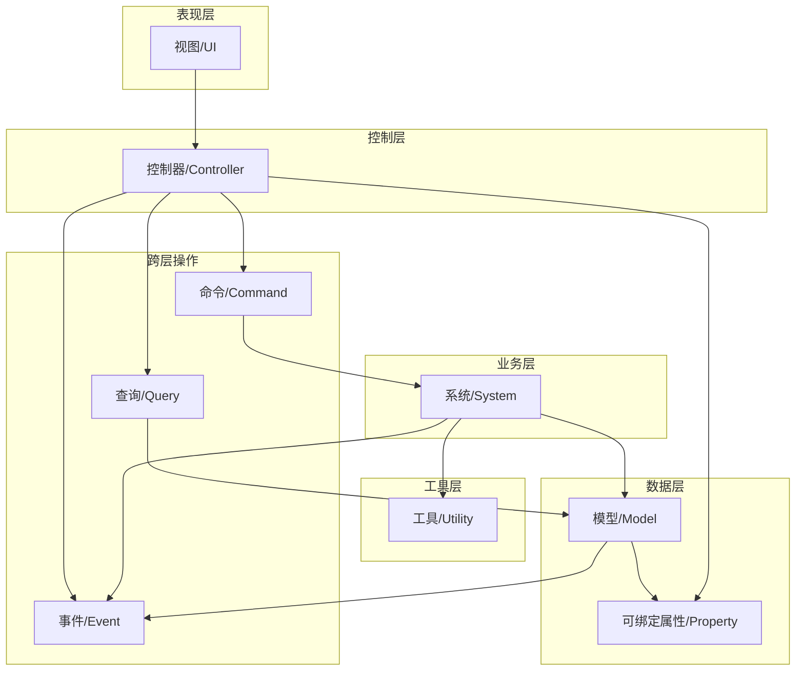
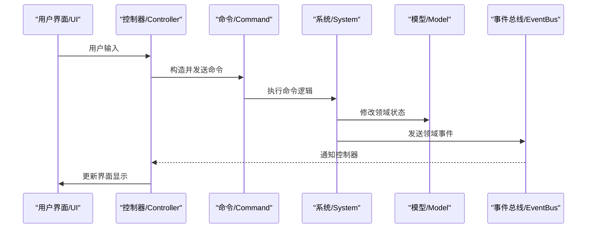
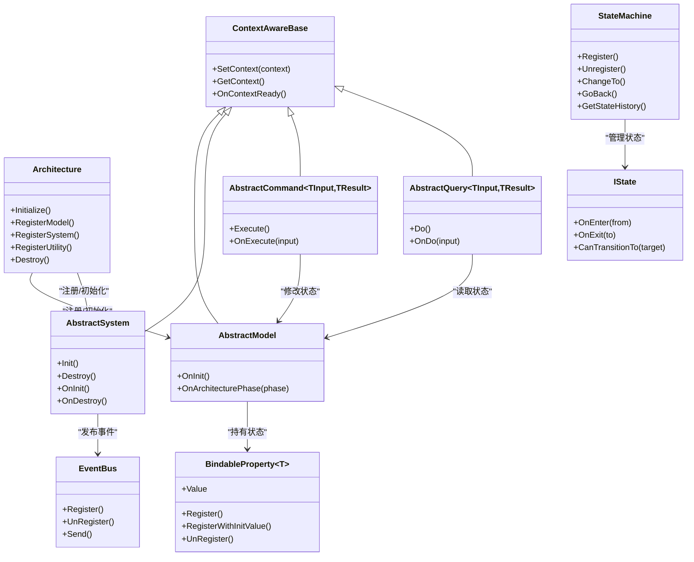

# 领域驱动设计

<cite>
**本文引用的文件**
- [README.md](file://GFramework.Core/README.md)
- [AbstractModel.cs](file://GFramework.Core/model/AbstractModel.cs)
- [IModel.cs](file://GFramework.Core.Abstractions/model/IModel.cs)
- [AbstractSystem.cs](file://GFramework.Core/system/AbstractSystem.cs)
- [ISystem.cs](file://GFramework.Core.Abstractions/system/ISystem.cs)
- [BindableProperty.cs](file://GFramework.Core/property/BindableProperty.cs)
- [AbstractCommand.cs](file://GFramework.Core/command/AbstractCommand.cs)
- [AbstractQuery.cs](file://GFramework.Core/query/AbstractQuery.cs)
- [EventBus.cs](file://GFramework.Core/events/EventBus.cs)
- [EasyEvent.cs](file://GFramework.Core/events/EasyEvent.cs)
- [Architecture.cs](file://GFramework.Core/architecture/Architecture.cs)
- [ContextAwareBase.cs](file://GFramework.Core/rule/ContextAwareBase.cs)
- [StateMachine.cs](file://GFramework.Core/state/StateMachine.cs)
- [IState.cs](file://GFramework.Core.Abstractions/state/IState.cs)
- [ContextAwareStateBase.cs](file://GFramework.Core/state/ContextAwareStateBase.cs)
</cite>

## 目录
1. [引言](#引言)
2. [项目结构](#项目结构)
3. [核心组件](#核心组件)
4. [架构总览](#架构总览)
5. [详细组件分析](#详细组件分析)
6. [依赖关系分析](#依赖关系分析)
7. [性能考量](#性能考量)
8. [故障排查指南](#故障排查指南)
9. [结论](#结论)
10. [附录](#附录)

## 引言
本教程面向希望在GFramework中实践领域驱动设计（DDD）的游戏开发者。我们将围绕实体（Entity）、值对象（Value Object）、领域事件（Domain Event）、领域服务（Domain Service）等核心概念，结合GFramework现有的架构层、事件系统、命令/查询模式、可绑定属性与状态机等组件，给出可落地的设计与实现思路，并提供游戏开发中的典型应用案例（玩家系统、物品系统、战斗系统）。

## 项目结构
GFramework采用“约定优于配置”的分层架构，核心分为四层：View/UI、Controller、System、Model、Utility，配合跨层操作（Command/Query/Event）与生命周期管理，形成清晰的职责边界与松耦合通信机制。

**图表来源**
- [README.md](file://GFramework.Core/README.md#L73-L108)

**章节来源**
- [README.md](file://GFramework.Core/README.md#L40-L108)

## 核心组件
- 架构与生命周期：通过架构基类集中管理组件注册、初始化阶段与销毁流程，确保组件在正确时机被创建与回收。
- 模型（Model）：承载领域状态，提供可绑定属性以实现响应式数据更新。
- 系统（System）：处理业务逻辑，通过事件驱动与其他组件解耦。
- 控制器（Controller）：桥接UI与业务，监听模型变化并更新界面。
- 命令/查询：封装写操作与读操作，保证操作意图明确且可追踪。
- 事件系统：提供类型化事件总线，支持注册、注销与触发。
- 状态机：管理状态注册、切换与历史，支持状态转换校验与回调。

**章节来源**
- [Architecture.cs](file://GFramework.Core/architecture/Architecture.cs#L23-L88)
- [AbstractModel.cs](file://GFramework.Core/model/AbstractModel.cs#L11-L33)
- [AbstractSystem.cs](file://GFramework.Core/system/AbstractSystem.cs#L13-L61)
- [BindableProperty.cs](file://GFramework.Core/property/BindableProperty.cs#L11-L135)
- [AbstractCommand.cs](file://GFramework.Core/command/AbstractCommand.cs#L11-L52)
- [AbstractQuery.cs](file://GFramework.Core/query/AbstractQuery.cs#L11-L28)
- [EventBus.cs](file://GFramework.Core/events/EventBus.cs#L8-L54)
- [StateMachine.cs](file://GFramework.Core/state/StateMachine.cs#L8-L276)

## 架构总览
下图展示了GFramework中命令执行、事件传播与数据绑定的整体流程，体现DDD中“命令写入状态、事件驱动协作、查询读取状态”的核心思想。

**图表来源**
- [README.md](file://GFramework.Core/README.md#L102-L108)
- [AbstractCommand.cs](file://GFramework.Core/command/AbstractCommand.cs#L11-L27)
- [AbstractSystem.cs](file://GFramework.Core/system/AbstractSystem.cs#L13-L61)
- [AbstractModel.cs](file://GFramework.Core/model/AbstractModel.cs#L11-L33)
- [EventBus.cs](file://GFramework.Core/events/EventBus.cs#L8-L54)
- [BindableProperty.cs](file://GFramework.Core/property/BindableProperty.cs#L11-L135)

## 详细组件分析

### 实体（Entity）
在GFramework中，实体通常以“模型”形态存在，承载领域不变量与状态。模型通过可绑定属性实现响应式更新，同时通过事件系统对外广播状态变化。

- 关键点
  - 模型实现初始化接口，在初始化阶段建立监听与不变量约束。
  - 使用可绑定属性作为实体的可变状态载体，避免直接暴露字段。
  - 通过事件系统发布领域事件，通知其他组件。

- 代码片段路径
  - [AbstractModel.cs](file://GFramework.Core/model/AbstractModel.cs#L11-L33)
  - [IModel.cs](file://GFramework.Core.Abstractions/model/IModel.cs#L10-L10)
  - [BindableProperty.cs](file://GFramework.Core/property/BindableProperty.cs#L11-L135)

- 设计要点
  - 将“状态”与“行为”分离：状态由模型持有，行为由系统处理。
  - 不变量通过系统逻辑在命令执行时强制校验，模型仅保存最终状态。
  - 事件用于跨组件通知，避免紧耦合。

**章节来源**
- [AbstractModel.cs](file://GFramework.Core/model/AbstractModel.cs#L11-L33)
- [IModel.cs](file://GFramework.Core.Abstractions/model/IModel.cs#L7-L10)
- [BindableProperty.cs](file://GFramework.Core/property/BindableProperty.cs#L11-L135)

### 值对象（Value Object）
值对象强调“不可变性”与“相等性基于结构”。在GFramework中，可通过可绑定属性的比较器定制与事件系统实现值对象语义。

- 关键点
  - 使用可绑定属性的比较器定制，确保相等判断符合值对象语义。
  - 值对象作为命令输入或查询条件，提升意图表达力。
  - 通过事件系统传播值对象的变化，便于系统与模型响应。

- 代码片段路径
  - [BindableProperty.cs](file://GFramework.Core/property/BindableProperty.cs#L103-L107)
  - [AbstractCommand.cs](file://GFramework.Core/command/AbstractCommand.cs#L11-L27)
  - [AbstractQuery.cs](file://GFramework.Core/query/AbstractQuery.cs#L11-L28)

- 设计要点
  - 值对象不应暴露可变状态；若需变化，应通过新实例替换。
  - 在命令/查询中以值对象作为输入参数，增强可读性与可测试性。

**章节来源**
- [BindableProperty.cs](file://GFramework.Core/property/BindableProperty.cs#L103-L107)
- [AbstractCommand.cs](file://GFramework.Core/command/AbstractCommand.cs#L11-L27)
- [AbstractQuery.cs](file://GFramework.Core/query/AbstractQuery.cs#L11-L28)

### 领域事件（Domain Event）
领域事件是跨组件通信的关键手段，GFramework提供类型化事件总线与简单事件类，支持注册、注销与触发。

- 关键点
  - 事件类型化，确保强类型安全与可发现性。
  - 事件总线支持注册/注销与触发，便于系统与模型响应。
  - 简单事件类提供无参事件的注册/触发能力，适配部分场景。

- 代码片段路径
  - [EventBus.cs](file://GFramework.Core/events/EventBus.cs#L8-L54)
  - [EasyEvent.cs](file://GFramework.Core/events/EasyEvent.cs#L8-L39)

- 设计要点
  - 领域事件应描述“发生了什么”，而非“如何处理”。
  - 事件发布应发生在状态变更之后，确保订阅者看到一致状态。

**章节来源**
- [EventBus.cs](file://GFramework.Core/events/EventBus.cs#L8-L54)
- [EasyEvent.cs](file://GFramework.Core/events/EasyEvent.cs#L8-L39)

### 领域服务（Domain Service）
领域服务封装跨实体的业务逻辑与规则。在GFramework中，系统层承担领域服务职责，通过事件驱动与其他组件协作。

- 关键点
  - 系统实现业务规则，监听事件并修改模型状态。
  - 通过架构基类提供的上下文能力访问容器与服务。
  - 生命周期管理确保系统在正确阶段初始化与销毁。

- 代码片段路径
  - [AbstractSystem.cs](file://GFramework.Core/system/AbstractSystem.cs#L13-L61)
  - [ISystem.cs](file://GFramework.Core.Abstractions/system/ISystem.cs#L7-L11)
  - [Architecture.cs](file://GFramework.Core/architecture/Architecture.cs#L23-L88)

- 设计要点
  - 领域服务不持有状态，仅处理业务规则与流程编排。
  - 通过事件与模型解耦，避免循环依赖。

**章节来源**
- [AbstractSystem.cs](file://GFramework.Core/system/AbstractSystem.cs#L13-L61)
- [ISystem.cs](file://GFramework.Core.Abstractions/system/ISystem.cs#L7-L11)
- [Architecture.cs](file://GFramework.Core/architecture/Architecture.cs#L23-L88)

### 状态机（状态驱动的领域）
状态机用于管理复杂的状态流转与转换规则，适合角色状态、UI状态等场景。

- 关键点
  - 状态注册、切换、历史记录与回退。
  - 转换前的合法性校验与拒绝回调。
  - 状态进入/退出与状态变更回调。

- 代码片段路径
  - [StateMachine.cs](file://GFramework.Core/state/StateMachine.cs#L8-L276)
  - [IState.cs](file://GFramework.Core.Abstractions/state/IState.cs#L6-L26)
  - [ContextAwareStateBase.cs](file://GFramework.Core/state/ContextAwareStateBase.cs#L13-L74)

- 设计要点
  - 状态转换规则集中在状态机内，避免分散的条件判断。
  - 历史记录支持回退，便于撤销与审计。

**章节来源**
- [StateMachine.cs](file://GFramework.Core/state/StateMachine.cs#L8-L276)
- [IState.cs](file://GFramework.Core.Abstractions/state/IState.cs#L6-L26)
- [ContextAwareStateBase.cs](file://GFramework.Core/state/ContextAwareStateBase.cs#L13-L74)

### 命令与查询（CQRS）
命令/查询职责分离，命令封装写操作，查询封装读操作，二者均通过上下文感知基类接入架构。

- 关键点
  - 命令：带输入参数，执行后可能修改模型状态并发布事件。
  - 查询：只读操作，返回结果给调用方。
  - 上下文感知：命令/查询可访问架构上下文与容器。

- 代码片段路径
  - [AbstractCommand.cs](file://GFramework.Core/command/AbstractCommand.cs#L11-L52)
  - [AbstractQuery.cs](file://GFramework.Core/query/AbstractQuery.cs#L11-L28)
  - [ContextAwareBase.cs](file://GFramework.Core/rule/ContextAwareBase.cs#L10-L43)

- 设计要点
  - 命令应具备可撤销/可重试能力（可结合持久化与日志）。
  - 查询应避免副作用，确保幂等性。

**章节来源**
- [AbstractCommand.cs](file://GFramework.Core/command/AbstractCommand.cs#L11-L52)
- [AbstractQuery.cs](file://GFramework.Core/query/AbstractQuery.cs#L11-L28)
- [ContextAwareBase.cs](file://GFramework.Core/rule/ContextAwareBase.cs#L10-L43)

## 依赖关系分析
下图展示DDD相关组件在GFramework中的依赖关系与交互：

**图表来源**
- [Architecture.cs](file://GFramework.Core/architecture/Architecture.cs#L23-L88)
- [ContextAwareBase.cs](file://GFramework.Core/rule/ContextAwareBase.cs#L10-L43)
- [AbstractModel.cs](file://GFramework.Core/model/AbstractModel.cs#L11-L33)
- [AbstractSystem.cs](file://GFramework.Core/system/AbstractSystem.cs#L13-L61)
- [BindableProperty.cs](file://GFramework.Core/property/BindableProperty.cs#L11-L135)
- [AbstractCommand.cs](file://GFramework.Core/command/AbstractCommand.cs#L11-L52)
- [AbstractQuery.cs](file://GFramework.Core/query/AbstractQuery.cs#L11-L28)
- [EventBus.cs](file://GFramework.Core/events/EventBus.cs#L8-L54)
- [StateMachine.cs](file://GFramework.Core/state/StateMachine.cs#L8-L276)
- [IState.cs](file://GFramework.Core.Abstractions/state/IState.cs#L6-L26)

**章节来源**
- [Architecture.cs](file://GFramework.Core/architecture/Architecture.cs#L23-L88)
- [ContextAwareBase.cs](file://GFramework.Core/rule/ContextAwareBase.cs#L10-L43)
- [AbstractModel.cs](file://GFramework.Core/model/AbstractModel.cs#L11-L33)
- [AbstractSystem.cs](file://GFramework.Core/system/AbstractSystem.cs#L13-L61)
- [BindableProperty.cs](file://GFramework.Core/property/BindableProperty.cs#L11-L135)
- [AbstractCommand.cs](file://GFramework.Core/command/AbstractCommand.cs#L11-L52)
- [AbstractQuery.cs](file://GFramework.Core/query/AbstractQuery.cs#L11-L28)
- [EventBus.cs](file://GFramework.Core/events/EventBus.cs#L8-L54)
- [StateMachine.cs](file://GFramework.Core/state/StateMachine.cs#L8-L276)
- [IState.cs](file://GFramework.Core.Abstractions/state/IState.cs#L6-L26)

## 性能考量
- 事件风暴与订阅管理
  - 使用统一的注销列表管理事件订阅，避免重复注册与内存泄漏。
  - 事件总线按类型索引事件，减少遍历成本。
- 可绑定属性
  - 通过比较器避免无效回调；批量更新时可使用“无事件设置”降低触发频率。
- 状态机历史
  - 历史记录大小受控，避免无限增长导致内存压力。
- 生命周期
  - 架构阶段化初始化与冻结容器，减少运行期开销。

[本节为通用指导，无需列出章节来源]

## 故障排查指南
- 事件未触发/未收到
  - 检查事件类型是否匹配，确认注册与注销是否成对出现。
  - 确认事件总线是否在正确阶段可用。
- 状态无法切换
  - 检查状态转换规则与目标状态是否已注册。
  - 查看拒绝回调与历史记录是否影响回退。
- 命令执行后状态未更新
  - 确认命令是否正确修改模型状态并发布事件。
  - 检查系统是否监听到相应事件并处理。
- UI 不更新
  - 确认模型属性使用可绑定属性并在控制器中注册回调。
  - 检查控制器是否在初始化阶段完成注册。

**章节来源**
- [EventBus.cs](file://GFramework.Core/events/EventBus.cs#L8-L54)
- [EasyEvent.cs](file://GFramework.Core/events/EasyEvent.cs#L8-L39)
- [BindableProperty.cs](file://GFramework.Core/property/BindableProperty.cs#L11-L135)
- [StateMachine.cs](file://GFramework.Core/state/StateMachine.cs#L8-L276)
- [AbstractCommand.cs](file://GFramework.Core/command/AbstractCommand.cs#L11-L52)
- [AbstractSystem.cs](file://GFramework.Core/system/AbstractSystem.cs#L13-L61)

## 结论
通过将DDD的核心概念映射到GFramework的分层架构与现有组件（模型、系统、事件、命令/查询、状态机、可绑定属性），可以构建高内聚、低耦合、可测试且可演进的游戏领域模型。建议在实际项目中：
- 将“状态”放入模型，“行为”放入系统；
- 使用命令/查询明确写读意图；
- 用事件解耦跨组件协作；
- 用值对象表达不可变语义；
- 用状态机管理复杂状态流转。

[本节为总结，无需列出章节来源]

## 附录

### 游戏开发中的DDD应用案例

- 玩家系统（Player）
  - 实体：玩家模型持有生命值、金币等可绑定属性。
  - 领域事件：玩家死亡、升级、获得物品等事件。
  - 领域服务：经验计算、等级上限校验、掉落分配。
  - 代码片段路径
    - [AbstractModel.cs](file://GFramework.Core/model/AbstractModel.cs#L11-L33)
    - [BindableProperty.cs](file://GFramework.Core/property/BindableProperty.cs#L11-L135)
    - [AbstractSystem.cs](file://GFramework.Core/system/AbstractSystem.cs#L13-L61)
    - [EventBus.cs](file://GFramework.Core/events/EventBus.cs#L8-L54)

- 物品系统（Item）
  - 值对象：物品属性（品质、数量、叠加上限）。
  - 命令：拾取、丢弃、合成、装备/卸下。
  - 查询：背包容量、某类物品数量、可合成配方。
  - 代码片段路径
    - [AbstractCommand.cs](file://GFramework.Core/command/AbstractCommand.cs#L11-L52)
    - [AbstractQuery.cs](file://GFramework.Core/query/AbstractQuery.cs#L11-L28)
    - [BindableProperty.cs](file://GFramework.Core/property/BindableProperty.cs#L11-L135)

- 战斗系统（Combat）
  - 领域事件：造成伤害、承受伤害、击杀、闪避。
  - 领域服务：伤害计算、护甲减免、暴击判定、状态效果。
  - 状态机：待机、移动、攻击、受击、死亡、眩晕。
  - 代码片段路径
    - [EventBus.cs](file://GFramework.Core/events/EventBus.cs#L8-L54)
    - [AbstractSystem.cs](file://GFramework.Core/system/AbstractSystem.cs#L13-L61)
    - [StateMachine.cs](file://GFramework.Core/state/StateMachine.cs#L8-L276)
    - [IState.cs](file://GFramework.Core.Abstractions/state/IState.cs#L6-L26)

### DDD概念与GFramework组件映射表
- 实体（Entity） ↔ 模型（Model） + 可绑定属性（BindableProperty）
- 值对象（Value Object） ↔ 命令/查询输入 + 比较器定制
- 领域事件（Domain Event） ↔ 事件总线（EventBus） + 简单事件（EasyEvent）
- 领域服务（Domain Service） ↔ 系统（System）
- 命令/查询（CQRS） ↔ 命令（AbstractCommand） + 查询（AbstractQuery）
- 状态机（State Machine） ↔ 状态机（StateMachine）

**章节来源**
- [AbstractModel.cs](file://GFramework.Core/model/AbstractModel.cs#L11-L33)
- [BindableProperty.cs](file://GFramework.Core/property/BindableProperty.cs#L11-L135)
- [AbstractCommand.cs](file://GFramework.Core/command/AbstractCommand.cs#L11-L52)
- [AbstractQuery.cs](file://GFramework.Core/query/AbstractQuery.cs#L11-L28)
- [EventBus.cs](file://GFramework.Core/events/EventBus.cs#L8-L54)
- [EasyEvent.cs](file://GFramework.Core/events/EasyEvent.cs#L8-L39)
- [AbstractSystem.cs](file://GFramework.Core/system/AbstractSystem.cs#L13-L61)
- [StateMachine.cs](file://GFramework.Core/state/StateMachine.cs#L8-L276)
- [IState.cs](file://GFramework.Core.Abstractions/state/IState.cs#L6-L26)