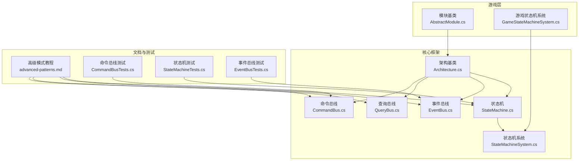
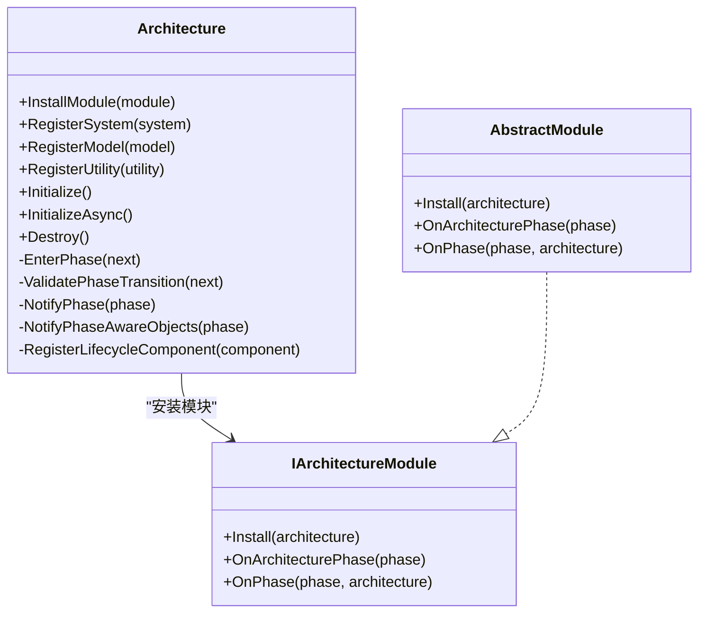
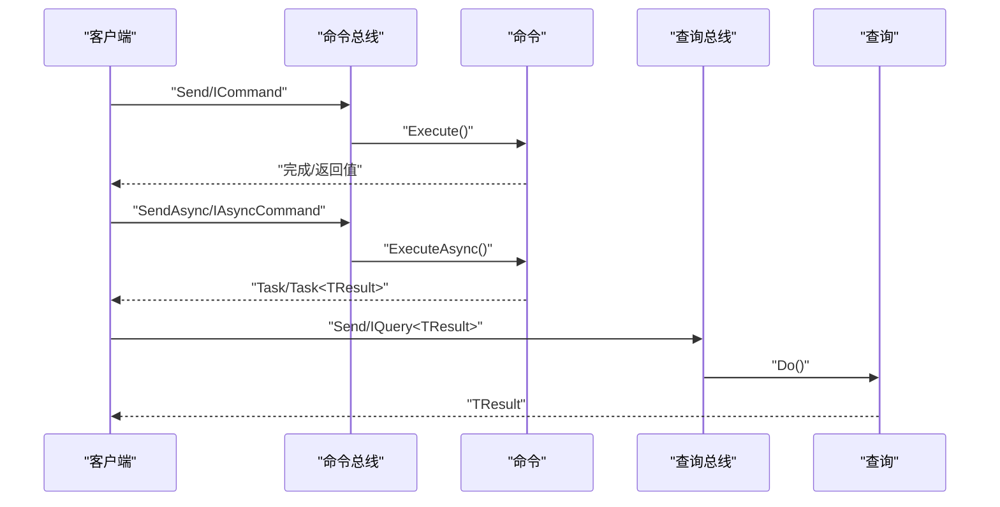
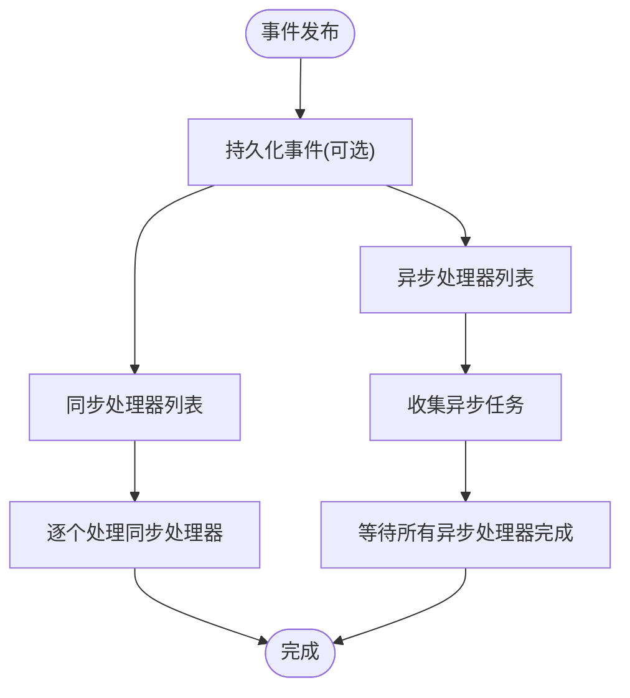
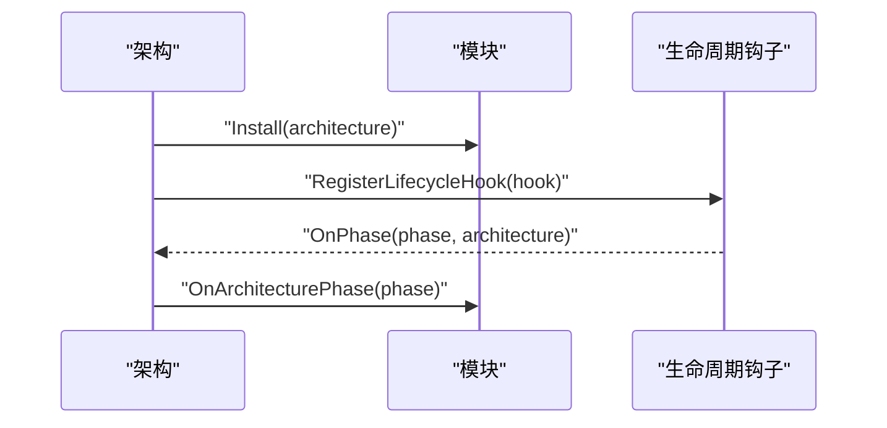
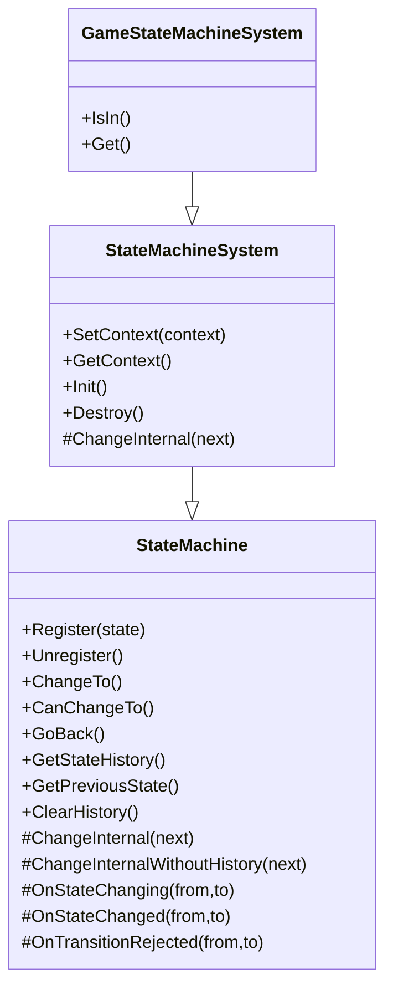
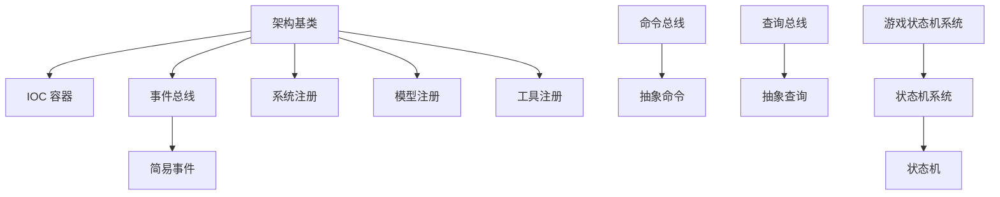

# 高级模式教程

<cite>
**本文档引用的文件**
- [Architecture.cs](file://GFramework.Core/architecture/Architecture.cs)
- [AbstractModule.cs](file://GFramework.Game/architecture/AbstractModule.cs)
- [CommandBus.cs](file://GFramework.Core/command/CommandBus.cs)
- [AbstractCommand.cs](file://GFramework.Core/command/AbstractCommand.cs)
- [QueryBus.cs](file://GFramework.Core/query/QueryBus.cs)
- [AbstractQuery.cs](file://GFramework.Core/query/AbstractQuery.cs)
- [EventBus.cs](file://GFramework.Core/events/EventBus.cs)
- [EasyEvent.cs](file://GFramework.Core/events/EasyEvent.cs)
- [StateMachine.cs](file://GFramework.Core/state/StateMachine.cs)
- [StateMachineSystem.cs](file://GFramework.Core/state/StateMachineSystem.cs)
- [GameStateMachineSystem.cs](file://GFramework.Game/state/GameStateMachineSystem.cs)
- [CommandBusTests.cs](file://GFramework.Core.Tests/command/CommandBusTests.cs)
- [StateMachineTests.cs](file://GFramework.Core.Tests/state/StateMachineTests.cs)
- [EventBusTests.cs](file://GFramework.Core.Tests/events/EventBusTests.cs)
- [advanced-patterns.md](file://docs/tutorials/advanced-patterns.md)
</cite>

## 目录
1. [简介](#简介)
2. [项目结构](#项目结构)
3. [核心组件](#核心组件)
4. [架构概览](#架构概览)
5. [详细组件分析](#详细组件分析)
6. [依赖关系分析](#依赖关系分析)
7. [性能考虑](#性能考虑)
8. [故障排除指南](#故障排除指南)
9. [结论](#结论)
10. [附录](#附录)

## 简介
本教程面向希望深入掌握 GFramework 高级架构模式的开发者，围绕以下主题展开：
- CQRS（命令查询职责分离）：命令总线与查询总线的实现、异步处理、输入输出模型设计
- 事件驱动架构：事件系统高级用法、事件聚合与事件溯源模式
- 插件系统：模块化架构、动态模块加载与模块间通信
- 状态机模式：复杂状态转换、状态持久化与扩展性设计
- 实战示例与最佳实践：通过测试用例与教程文档中的示例路径，帮助读者快速落地

## 项目结构
GFramework 采用分层与模块化的组织方式：
- GFramework.Core：核心框架，包含架构基类、命令/查询总线、事件系统、状态机、生命周期管理等
- GFramework.Game：游戏层实现，包含游戏状态机系统、设置系统、UI 路由等
- GFramework.Godot：Godot 平台适配层，提供平台特定的扩展与集成
- 文档与测试：教程文档与全面的单元测试覆盖关键组件的行为

**图表来源**
- [Architecture.cs](file://GFramework.Core/architecture/Architecture.cs#L1-L569)
- [CommandBus.cs](file://GFramework.Core/command/CommandBus.cs#L1-L62)
- [QueryBus.cs](file://GFramework.Core/query/QueryBus.cs#L1-L23)
- [EventBus.cs](file://GFramework.Core/events/EventBus.cs#L1-L55)
- [StateMachine.cs](file://GFramework.Core/state/StateMachine.cs#L1-L276)
- [StateMachineSystem.cs](file://GFramework.Core/state/StateMachineSystem.cs#L1-L96)
- [AbstractModule.cs](file://GFramework.Game/architecture/AbstractModule.cs#L1-L33)
- [GameStateMachineSystem.cs](file://GFramework.Game/state/GameStateMachineSystem.cs#L1-L26)
- [advanced-patterns.md](file://docs/tutorials/advanced-patterns.md#L1-L800)
- [CommandBusTests.cs](file://GFramework.Core.Tests/command/CommandBusTests.cs#L1-L265)
- [StateMachineTests.cs](file://GFramework.Core.Tests/state/StateMachineTests.cs#L1-L444)
- [EventBusTests.cs](file://GFramework.Core.Tests/events/EventBusTests.cs#L1-L85)

**章节来源**
- [Architecture.cs](file://GFramework.Core/architecture/Architecture.cs#L1-L569)
- [AbstractModule.cs](file://GFramework.Game/architecture/AbstractModule.cs#L1-L33)
- [advanced-patterns.md](file://docs/tutorials/advanced-patterns.md#L1-L800)

## 核心组件
本节聚焦于 CQRS、事件驱动与状态机三大核心能力，以及它们在架构中的位置与协作方式。

- 命令查询职责分离（CQRS）
  - 命令总线：同步与异步执行命令，支持带返回值与无返回值两种模式
  - 查询总线：执行查询并返回结果
  - 输入输出模型：命令/查询分别通过输入接口约束参数，确保职责清晰

- 事件驱动架构
  - 事件总线：基于类型的事件发送、注册与注销
  - 简易事件：最小化实现，便于快速注册/触发
  - 事件溯源：教程文档提供了事件存储、快照与聚合根重建的思路

- 状态机模式
  - 状态机：注册/注销状态、状态切换、历史记录与回退
  - 状态机系统：上下文感知、生命周期钩子、状态变更事件通知
  - 游戏状态机系统：针对游戏场景的状态判断与获取

**章节来源**
- [CommandBus.cs](file://GFramework.Core/command/CommandBus.cs#L1-L62)
- [AbstractCommand.cs](file://GFramework.Core/command/AbstractCommand.cs#L1-L53)
- [QueryBus.cs](file://GFramework.Core/query/QueryBus.cs#L1-L23)
- [AbstractQuery.cs](file://GFramework.Core/query/AbstractQuery.cs#L1-L29)
- [EventBus.cs](file://GFramework.Core/events/EventBus.cs#L1-L55)
- [EasyEvent.cs](file://GFramework.Core/events/EasyEvent.cs#L1-L39)
- [StateMachine.cs](file://GFramework.Core/state/StateMachine.cs#L1-L276)
- [StateMachineSystem.cs](file://GFramework.Core/state/StateMachineSystem.cs#L1-L96)
- [GameStateMachineSystem.cs](file://GFramework.Game/state/GameStateMachineSystem.cs#L1-L26)

## 架构概览
GFramework 的架构基类负责模块安装、生命周期管理、阶段转换与组件注册。它通过 IOC 容器统一管理系统、模型与工具，并在初始化完成后冻结容器，确保运行时的稳定性。

**图表来源**
- [Architecture.cs](file://GFramework.Core/architecture/Architecture.cs#L38-L48)
- [Architecture.cs](file://GFramework.Core/architecture/Architecture.cs#L423-L460)
- [Architecture.cs](file://GFramework.Core/architecture/Architecture.cs#L511-L566)
- [AbstractModule.cs](file://GFramework.Game/architecture/AbstractModule.cs#L9-L33)

**章节来源**
- [Architecture.cs](file://GFramework.Core/architecture/Architecture.cs#L1-L569)
- [AbstractModule.cs](file://GFramework.Game/architecture/AbstractModule.cs#L1-L33)

## 详细组件分析

### CQRS 模式实现与应用
CQRS 将写操作（命令）与读操作（查询）分离，提升系统的可扩展性与可维护性。GFramework 提供了命令总线与查询总线，配合抽象命令/查询基类，形成清晰的输入输出模型。

- 命令总线
  - 支持同步与异步命令执行
  - 带返回值与无返回值两种 Send/SendAsync 重载
  - 参数校验：空命令抛出异常

- 查询总线
  - 执行查询并返回结果
  - 通过抽象查询基类约束输入与输出

- 输入输出模型
  - 命令/查询均通过输入接口约束参数，确保职责单一
  - 可结合上下文与日志生成器，实现跨组件的上下文感知

**图表来源**
- [CommandBus.cs](file://GFramework.Core/command/CommandBus.cs#L16-L61)
- [AbstractCommand.cs](file://GFramework.Core/command/AbstractCommand.cs#L11-L27)
- [AbstractCommand.cs](file://GFramework.Core/command/AbstractCommand.cs#L35-L53)
- [QueryBus.cs](file://GFramework.Core/query/QueryBus.cs#L16-L22)
- [AbstractQuery.cs](file://GFramework.Core/query/AbstractQuery.cs#L11-L29)

- 实战示例与最佳实践
  - 教程文档提供了完整的 CQRS 示例：命令（创建玩家）、查询（获取玩家、统计信息）与领域事件
  - 使用上下文发送命令/查询，结合日志记录错误与成功信息
  - 建议将命令/查询输入参数封装为独立 DTO，便于测试与演进

**章节来源**
- [CommandBus.cs](file://GFramework.Core/command/CommandBus.cs#L1-L62)
- [AbstractCommand.cs](file://GFramework.Core/command/AbstractCommand.cs#L1-L53)
- [QueryBus.cs](file://GFramework.Core/query/QueryBus.cs#L1-L23)
- [AbstractQuery.cs](file://GFramework.Core/query/AbstractQuery.cs#L1-L29)
- [CommandBusTests.cs](file://GFramework.Core.Tests/command/CommandBusTests.cs#L1-L265)
- [advanced-patterns.md](file://docs/tutorials/advanced-patterns.md#L159-L205)

### 事件驱动架构实现
GFramework 的事件系统提供基于类型的事件发送、注册与注销，支持同步与异步处理。教程文档进一步展示了事件溯源与聚合根重建的思路。

- 事件总线
  - Send<T>() 自动实例化事件并触发
  - Send<T>(T e) 直接触发事件实例
  - Register/UnRegister 提供监听与注销

- 简易事件
  - 最小化实现，适合轻量事件场景

- 事件溯源与聚合根重建
  - 事件存储：按流存储事件，定期创建快照
  - 聚合根重建：从历史事件重建状态，清理未提交事件

**图表来源**
- [EventBus.cs](file://GFramework.Core/events/EventBus.cs#L16-L54)
- [EasyEvent.cs](file://GFramework.Core/events/EasyEvent.cs#L8-L39)
- [advanced-patterns.md](file://docs/tutorials/advanced-patterns.md#L519-L690)

**章节来源**
- [EventBus.cs](file://GFramework.Core/events/EventBus.cs#L1-L55)
- [EasyEvent.cs](file://GFramework.Core/events/EasyEvent.cs#L1-L39)
- [EventBusTests.cs](file://GFramework.Core.Tests/events/EventBusTests.cs#L1-L85)
- [advanced-patterns.md](file://docs/tutorials/advanced-patterns.md#L515-L690)

### 插件系统开发（模块化架构）
GFramework 通过架构基类与模块基类实现模块化与动态加载。模块安装时注册生命周期钩子，参与架构阶段转换与组件初始化。

- 模块安装
  - InstallModule：安装模块、注册生命周期钩子、调用模块 Install
  - 模块生命周期：OnArchitecturePhase、OnPhase

- 架构阶段管理
  - EnterPhase：验证阶段转换、通知阶段变更、通知阶段感知对象
  - 初始化顺序：工具 → 模型 → 系统，按阶段推进

**图表来源**
- [Architecture.cs](file://GFramework.Core/architecture/Architecture.cs#L38-L48)
- [Architecture.cs](file://GFramework.Core/architecture/Architecture.cs#L216-L223)
- [Architecture.cs](file://GFramework.Core/architecture/Architecture.cs#L189-L196)
- [AbstractModule.cs](file://GFramework.Game/architecture/AbstractModule.cs#L16-L32)

**章节来源**
- [Architecture.cs](file://GFramework.Core/architecture/Architecture.cs#L1-L569)
- [AbstractModule.cs](file://GFramework.Game/architecture/AbstractModule.cs#L1-L33)

### 状态机模式高级应用
GFramework 的状态机支持注册/注销状态、状态切换、历史记录与回退。状态机系统在状态切换时发送状态变更事件，便于监听与响应。

- 状态机核心能力
  - Register/Unregister：注册与注销状态
  - ChangeTo/CanChangeTo：切换与校验状态
  - 历史记录：最大历史长度限制，GoBack 回退
  - 回调：OnStateChanging/OnStateChanged/OnTransitionRejected

- 状态机系统
  - 上下文感知：为状态设置架构上下文
  - 生命周期：Init/Destroy
  - 事件通知：状态切换时发送状态变更事件

- 游戏状态机系统
  - IsIn<T>()：检查当前状态类型
  - Get<T>()：获取当前状态实例

**图表来源**
- [StateMachine.cs](file://GFramework.Core/state/StateMachine.cs#L27-L276)
- [StateMachineSystem.cs](file://GFramework.Core/state/StateMachineSystem.cs#L14-L96)
- [GameStateMachineSystem.cs](file://GFramework.Game/state/GameStateMachineSystem.cs#L9-L26)

**章节来源**
- [StateMachine.cs](file://GFramework.Core/state/StateMachine.cs#L1-L276)
- [StateMachineSystem.cs](file://GFramework.Core/state/StateMachineSystem.cs#L1-L96)
- [GameStateMachineSystem.cs](file://GFramework.Game/state/GameStateMachineSystem.cs#L1-L26)
- [StateMachineTests.cs](file://GFramework.Core.Tests/state/StateMachineTests.cs#L1-L444)

## 依赖关系分析
GFramework 的核心组件之间存在清晰的依赖关系与协作模式：

- 架构基类依赖 IOC 容器与事件总线，统一管理模块、系统、模型与工具
- 命令/查询总线依赖抽象命令/查询基类，确保输入输出模型一致
- 事件总线与状态机系统通过事件进行解耦协作
- 游戏状态机系统继承状态机系统，扩展游戏场景的状态判断

**图表来源**
- [Architecture.cs](file://GFramework.Core/architecture/Architecture.cs#L72-L77)
- [CommandBus.cs](file://GFramework.Core/command/CommandBus.cs#L9-L62)
- [AbstractCommand.cs](file://GFramework.Core/command/AbstractCommand.cs#L11-L53)
- [QueryBus.cs](file://GFramework.Core/query/QueryBus.cs#L8-L23)
- [AbstractQuery.cs](file://GFramework.Core/query/AbstractQuery.cs#L11-L29)
- [StateMachineSystem.cs](file://GFramework.Core/state/StateMachineSystem.cs#L14-L96)
- [GameStateMachineSystem.cs](file://GFramework.Game/state/GameStateMachineSystem.cs#L9-L26)
- [EventBus.cs](file://GFramework.Core/events/EventBus.cs#L8-L55)
- [EasyEvent.cs](file://GFramework.Core/events/EasyEvent.cs#L8-L39)

**章节来源**
- [Architecture.cs](file://GFramework.Core/architecture/Architecture.cs#L1-L569)
- [CommandBus.cs](file://GFramework.Core/command/CommandBus.cs#L1-L62)
- [QueryBus.cs](file://GFramework.Core/query/QueryBus.cs#L1-L23)
- [EventBus.cs](file://GFramework.Core/events/EventBus.cs#L1-L55)
- [StateMachineSystem.cs](file://GFramework.Core/state/StateMachineSystem.cs#L1-L96)
- [GameStateMachineSystem.cs](file://GFramework.Game/state/GameStateMachineSystem.cs#L1-L26)

## 性能考虑
- 命令/查询总线
  - 同步命令建议在主线程执行，避免频繁切换线程上下文
  - 异步命令优先使用 SendAsync，充分利用异步 I/O 与协程调度
  - 输入输出模型尽量简单，减少序列化/反序列化成本

- 事件系统
  - 事件处理器应避免长时间阻塞，必要时拆分为异步处理器
  - 事件存储需考虑并发写入与快照策略，降低重放成本

- 状态机
  - 历史记录大小受控，避免内存膨胀
  - 状态切换回调应尽量轻量，避免在 OnStateChanging/OnStateChanged 中执行耗时操作

[本节为通用指导，无需列出章节来源]

## 故障排除指南
- 命令总线
  - 空命令异常：确保传入的命令不为 null
  - 异步命令执行失败：检查异常捕获与日志记录，定位具体命令实现

- 查询总线
  - 查询执行异常：检查查询输入参数与业务逻辑，确保 Do() 正确实现

- 事件总线
  - 处理器未触发：确认事件类型匹配与处理器注册顺序
  - 注销无效：确保注销的是同一委托实例

- 状态机
  - 无法切换状态：检查 CanTransitionTo 与状态注册情况
  - 回退失败：确认历史记录中仍存在有效状态

**章节来源**
- [CommandBusTests.cs](file://GFramework.Core.Tests/command/CommandBusTests.cs#L48-L123)
- [EventBusTests.cs](file://GFramework.Core.Tests/events/EventBusTests.cs#L28-L77)
- [StateMachineTests.cs](file://GFramework.Core.Tests/state/StateMachineTests.cs#L132-L195)

## 结论
通过 CQRS、事件驱动与状态机三大模式，GFramework 为复杂游戏系统提供了清晰的架构骨架。结合模块化与上下文感知能力，开发者可以在保证可维护性的同时，实现高性能与高扩展性的系统设计。建议在实际项目中：
- 明确命令/查询边界，使用输入输出模型约束参数
- 采用事件总线解耦模块，必要时引入事件溯源增强可观测性
- 善用状态机管理复杂状态流转，结合游戏状态机系统进行场景化扩展

[本节为总结性内容，无需列出章节来源]

## 附录
- 教程文档中的完整 CQRS 示例与 DDD 设计思路，可作为实战参考
- 单元测试覆盖命令总线、状态机与事件总线的关键行为，便于对照与扩展

**章节来源**
- [advanced-patterns.md](file://docs/tutorials/advanced-patterns.md#L1-L800)
- [CommandBusTests.cs](file://GFramework.Core.Tests/command/CommandBusTests.cs#L1-L265)
- [StateMachineTests.cs](file://GFramework.Core.Tests/state/StateMachineTests.cs#L1-L444)
- [EventBusTests.cs](file://GFramework.Core.Tests/events/EventBusTests.cs#L1-L85)