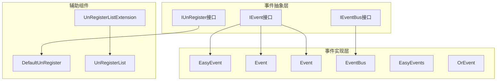
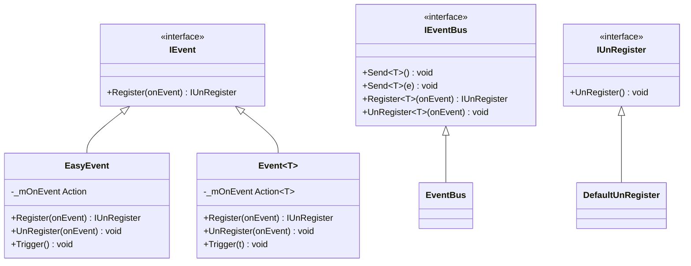
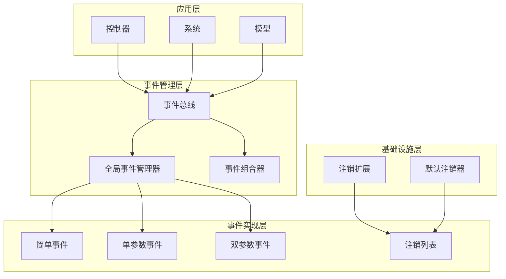
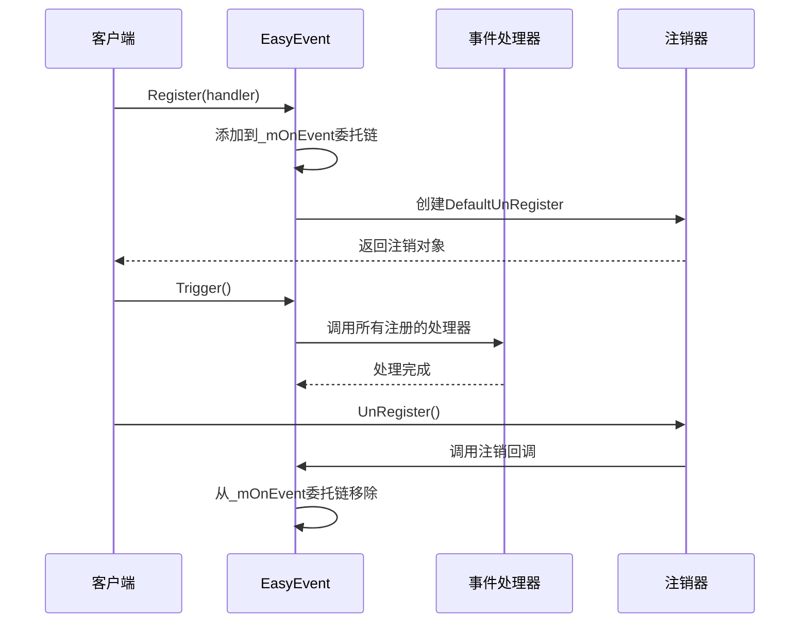
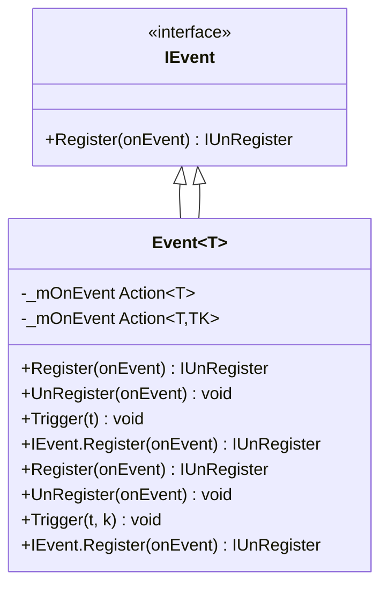
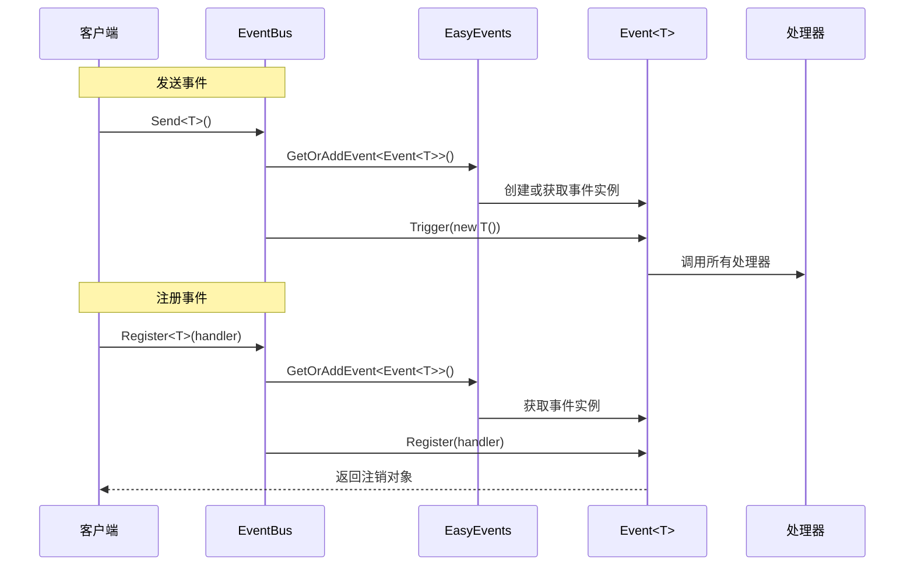
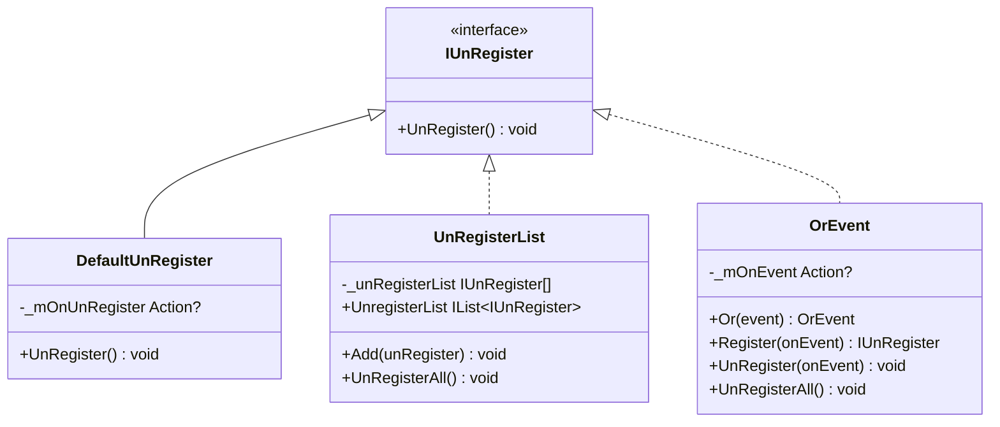
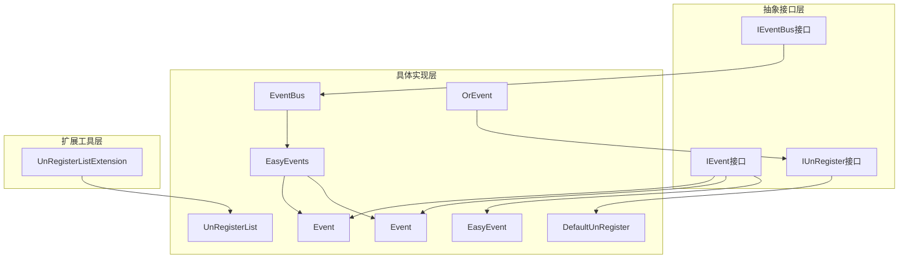

# EasyEvent事件机制

<cite>
**本文档引用的文件**
- [EasyEvent.cs](file://GFramework.Core/events/EasyEvent.cs)
- [EasyEventGeneric.cs](file://GFramework.Core/events/EasyEventGeneric.cs)
- [EventBus.cs](file://GFramework.Core/events/EventBus.cs)
- [EasyEvents.cs](file://GFramework.Core/events/EasyEvents.cs)
- [DefaultUnRegister.cs](file://GFramework.Core/events/DefaultUnRegister.cs)
- [UnRegisterList.cs](file://GFramework.Core/events/UnRegisterList.cs)
- [OrEvent.cs](file://GFramework.Core/events/OrEvent.cs)
- [IEvent.cs](file://GFramework.Core.Abstractions/events/IEvent.cs)
- [IEventBus.cs](file://GFramework.Core.Abstractions/events/IEventBus.cs)
- [IUnRegister.cs](file://GFramework.Core.Abstractions/events/IUnRegister.cs)
- [UnRegisterListExtension.cs](file://GFramework.Core/extensions/UnRegisterListExtension.cs)
- [README.md](file://GFramework.Core/events/README.md)
- [EventTests.cs](file://GFramework.Core.Tests/events/EventTests.cs)
- [EasyEventsTests.cs](file://GFramework.Core.Tests/events/EasyEventsTests.cs)
- [EventBusTests.cs](file://GFramework.Core.Tests/events/EventBusTests.cs)
</cite>

## 目录
1. [简介](#简介)
2. [项目结构](#项目结构)
3. [核心组件](#核心组件)
4. [架构概览](#架构概览)
5. [详细组件分析](#详细组件分析)
6. [依赖分析](#依赖分析)
7. [性能考虑](#性能考虑)
8. [故障排除指南](#故障排除指南)
9. [结论](#结论)
10. [附录](#附录)

## 简介

EasyEvent事件机制是GFramework框架中一套完整的事件系统，实现了观察者模式（Observer Pattern），为游戏开发提供了松耦合的组件间通信能力。该系统支持无参和带参事件、事件注册/注销、以及灵活的事件组合。

事件机制的核心设计理念包括：
- **松耦合通信**：组件间通过事件进行解耦
- **类型安全**：利用泛型确保编译时类型安全
- **内存优化**：采用空操作委托避免null检查
- **生命周期管理**：提供完整的注册和注销机制
- **批量处理**：支持事件处理器的批量添加和移除

## 项目结构

事件系统位于GFramework.Core项目的events目录下，采用分层设计：



**图表来源**
- [IEvent.cs](file://GFramework.Core.Abstractions/events/IEvent.cs#L8-L16)
- [IEventBus.cs](file://GFramework.Core.Abstractions/events/IEventBus.cs#L8-L37)
- [EasyEvent.cs](file://GFramework.Core/events/EasyEvent.cs#L8-L39)
- [EasyEventGeneric.cs](file://GFramework.Core/events/EasyEventGeneric.cs#L10-L123)

**章节来源**
- [README.md](file://GFramework.Core/events/README.md#L1-L523)

## 核心组件

### 事件接口体系

事件系统基于三个核心接口构建：

1. **IEvent接口**：定义事件注册的基本功能
2. **IEventBus接口**：提供基于类型的事件发送和注册
3. **IUnRegister接口**：用于取消事件注册



**图表来源**
- [IEvent.cs](file://GFramework.Core.Abstractions/events/IEvent.cs#L8-L16)
- [IEventBus.cs](file://GFramework.Core.Abstractions/events/IEventBus.cs#L8-L37)
- [EasyEvent.cs](file://GFramework.Core/events/EasyEvent.cs#L8-L39)
- [EasyEventGeneric.cs](file://GFramework.Core/events/EasyEventGeneric.cs#L10-L62)

**章节来源**
- [IEvent.cs](file://GFramework.Core.Abstractions/events/IEvent.cs#L1-L16)
- [IEventBus.cs](file://GFramework.Core.Abstractions/events/IEventBus.cs#L1-L37)
- [IUnRegister.cs](file://GFramework.Core.Abstractions/events/IUnRegister.cs#L1-L12)

## 架构概览

事件系统采用分层架构设计，从底层的事件实现到上层的事件总线，形成了完整的事件处理生态：



**图表来源**
- [EventBus.cs](file://GFramework.Core/events/EventBus.cs#L8-L55)
- [EasyEvents.cs](file://GFramework.Core/events/EasyEvents.cs#L9-L85)
- [OrEvent.cs](file://GFramework.Core/events/OrEvent.cs#L9-L57)

## 详细组件分析

### EasyEvent组件分析

EasyEvent是最简单的事件实现，支持无参事件的注册、注销和触发：



**图表来源**
- [EasyEvent.cs](file://GFramework.Core/events/EasyEvent.cs#L17-L38)
- [DefaultUnRegister.cs](file://GFramework.Core/events/DefaultUnRegister.cs#L9-L22)

EasyEvent的关键特性：
- **委托链管理**：使用Action委托链存储多个处理器
- **空操作优化**：初始状态为空操作委托，避免null检查
- **即时注销**：注册时返回的注销对象支持立即注销

**章节来源**
- [EasyEvent.cs](file://GFramework.Core/events/EasyEvent.cs#L1-L39)

### 泛型事件组件分析

EasyEventGeneric提供了支持泛型参数的事件实现，包括单参数和双参数事件：



**图表来源**
- [EasyEventGeneric.cs](file://GFramework.Core/events/EasyEventGeneric.cs#L10-L123)

泛型事件的实现特点：
- **类型安全**：编译时确保参数类型正确
- **接口显式实现**：支持无参Action的注册
- **委托链优化**：同样采用空操作委托避免null检查

**章节来源**
- [EasyEventGeneric.cs](file://GFramework.Core/events/EasyEventGeneric.cs#L1-L123)

### 事件总线组件分析

EventBus提供了基于类型的事件发送、注册和注销功能：



**图表来源**
- [EventBus.cs](file://GFramework.Core/events/EventBus.cs#L16-L54)
- [EasyEvents.cs](file://GFramework.Core/events/EasyEvents.cs#L74-L84)

**章节来源**
- [EventBus.cs](file://GFramework.Core/events/EventBus.cs#L1-L55)
- [EasyEvents.cs](file://GFramework.Core/events/EasyEvents.cs#L1-L85)

### 注销管理组件分析

事件系统提供了多种注销管理策略：



**图表来源**
- [DefaultUnRegister.cs](file://GFramework.Core/events/DefaultUnRegister.cs#L9-L22)
- [UnRegisterList.cs](file://GFramework.Core/events/UnRegisterList.cs#L8-L37)
- [OrEvent.cs](file://GFramework.Core/events/OrEvent.cs#L9-L57)

**章节来源**
- [DefaultUnRegister.cs](file://GFramework.Core/events/DefaultUnRegister.cs#L1-L22)
- [UnRegisterList.cs](file://GFramework.Core/events/UnRegisterList.cs#L1-L37)
- [OrEvent.cs](file://GFramework.Core/events/OrEvent.cs#L1-L57)

## 依赖分析

事件系统各组件之间的依赖关系如下：



**图表来源**
- [README.md](file://GFramework.Core/events/README.md#L1-L523)

**章节来源**
- [README.md](file://GFramework.Core/events/README.md#L1-L523)

## 性能考虑

事件系统在设计时充分考虑了性能优化：

### 内存优化策略

1. **空操作委托**：事件初始状态使用空操作委托，避免null检查开销
2. **委托链管理**：使用.NET内置的委托链机制，提供高效的事件分发
3. **类型安全**：通过泛型避免装箱拆箱操作

### 性能特性

- **O(1)** 注册/注销复杂度：委托链的添加和移除操作
- **O(n)** 触发复杂度：n为已注册处理器数量
- **零GC压力**：事件处理器作为委托，避免额外的对象分配

### 最佳实践建议

1. **避免频繁触发**：对于高频事件（如每帧触发），考虑使用批处理策略
2. **处理器轻量化**：事件处理器应保持简洁，避免复杂的计算逻辑
3. **及时注销**：在适当的生命周期结束时注销事件处理器

## 故障排除指南

### 常见问题及解决方案

#### 1. 事件处理器未被调用

**可能原因**：
- 事件处理器已被注销
- 事件实例未正确创建
- 注册时机不当

**解决方法**：
- 检查注销对象是否被意外调用
- 确认事件实例的生命周期
- 验证注册时机的正确性

#### 2. 内存泄漏问题

**可能原因**：
- 未及时注销事件处理器
- 长生命周期对象持有短生命周期事件

**解决方法**：
- 使用UnRegisterList统一管理注销
- 利用框架提供的生命周期管理工具
- 定期检查事件处理器的注册状态

#### 3. 事件循环问题

**可能原因**：
- 事件处理器中直接触发相同事件
- 事件处理逻辑相互依赖

**解决方法**：
- 避免在事件处理器中直接发送新事件
- 使用命令模式替代事件循环
- 实施事件过滤和条件处理

**章节来源**
- [README.md](file://GFramework.Core/events/README.md#L437-L523)

## 结论

EasyEvent事件机制为游戏开发提供了强大而灵活的组件间通信能力。通过精心设计的接口体系和优化的实现策略，该系统在保证类型安全的同时，提供了优秀的性能表现和易用性。

关键优势包括：
- **设计简洁**：接口设计直观，易于理解和使用
- **性能优秀**：采用委托链机制，提供高效的事件分发
- **类型安全**：泛型支持确保编译时类型检查
- **生命周期友好**：完善的注销管理机制
- **扩展性强**：支持事件组合和批量处理

在游戏开发中，该事件机制特别适用于：
- 游戏状态变化通知
- 跨模块通信
- 用户输入处理
- 游戏事件记录
- 系统间解耦通信

## 附录

### 使用示例

以下是一些典型的使用场景和代码示例：

#### 基础事件使用
```csharp
// 创建简单事件
var onClicked = new EasyEvent();

// 注册监听
var unregister = onClicked.Register(() => 
{
    GD.Print("Button clicked!");
});

// 触发事件
onClicked.Trigger();

// 取消注册
unregister.UnRegister();
```

#### 泛型事件使用
```csharp
// 创建带参数的事件
var onScoreChanged = new Event<int>();

// 注册监听
onScoreChanged.Register(newScore => 
{
    GD.Print($"Score changed to: {newScore}");
});

// 触发事件并传递参数
onScoreChanged.Trigger(100);
```

#### 事件总线使用
```csharp
// 使用全局事件系统
var eventBus = new EventBus();

// 注册类型化事件
eventBus.Register<PlayerDiedEvent>(e => 
{
    GD.Print($"Player died at position: {e.Position}");
});

// 发送事件（传递实例）
eventBus.Send(new PlayerDiedEvent 
{ 
    Position = new Vector3(10, 0, 5) 
});

// 发送事件（自动创建实例）
eventBus.Send<PlayerDiedEvent>();
```

#### 批量事件管理
```csharp
var unregisterList = new UnRegisterList();

// 添加到列表
someEvent.Register(OnEvent).AddToUnregisterList(unregisterList);

// 批量注销
unregisterList.UnRegisterAll();
```

**章节来源**
- [README.md](file://GFramework.Core/events/README.md#L54-L523)