# EventBus核心实现

<cite>
**本文档引用的文件**
- [EventBus.cs](file://GFramework.Core/events/EventBus.cs)
- [EasyEvents.cs](file://GFramework.Core/events/EasyEvents.cs)
- [EasyEvent.cs](file://GFramework.Core/events/EasyEvent.cs)
- [EasyEventGeneric.cs](file://GFramework.Core/events/EasyEventGeneric.cs)
- [DefaultUnRegister.cs](file://GFramework.Core/events/DefaultUnRegister.cs)
- [UnRegisterList.cs](file://GFramework.Core/events/UnRegisterList.cs)
- [IEventBus.cs](file://GFramework.Core.Abstractions/events/IEventBus.cs)
- [IEvent.cs](file://GFramework.Core.Abstractions/events/IEvent.cs)
- [IUnRegister.cs](file://GFramework.Core.Abstractions/events/IUnRegister.cs)
- [OrEvent.cs](file://GFramework.Core/events/OrEvent.cs)
- [README.md](file://GFramework.Core/events/README.md)
- [EventBusTests.cs](file://GFramework.Core.Tests/events/EventBusTests.cs)
- [UnRegisterListExtension.cs](file://GFramework.Core/extensions/UnRegisterListExtension.cs)
</cite>

## 目录
1. [简介](#简介)
2. [项目结构](#项目结构)
3. [核心组件](#核心组件)
4. [架构概览](#架构概览)
5. [详细组件分析](#详细组件分析)
6. [依赖关系分析](#依赖关系分析)
7. [性能考虑](#性能考虑)
8. [故障排除指南](#故障排除指南)
9. [结论](#结论)
10. [附录](#附录)

## 简介

EventBus是GFramework核心库中的事件系统，实现了类型安全的事件发布订阅机制。它提供了基于类型的事件发送、注册和注销功能，支持无参和带参事件处理，采用观察者模式实现组件间的松耦合通信。

该系统的核心特性包括：
- 类型安全的事件处理机制
- 两种Send方法重载形式
- Register和UnRegister方法的完整实现
- EasyEvents容器和Event<T>事件包装机制
- IUnRegister接口的返回和管理
- 性能优化和内存管理策略

## 项目结构

EventBus相关的核心文件组织如下：

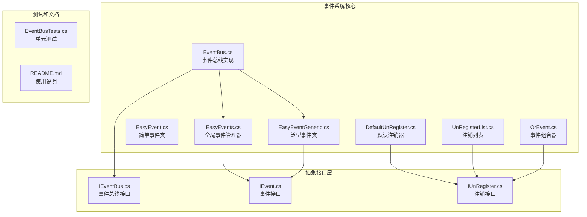

**图表来源**
- [EventBus.cs](file://GFramework.Core/events/EventBus.cs#L1-L55)
- [EasyEvents.cs](file://GFramework.Core/events/EasyEvents.cs#L1-L85)
- [IEventBus.cs](file://GFramework.Core.Abstractions/events/IEventBus.cs#L1-L37)

**章节来源**
- [EventBus.cs](file://GFramework.Core/events/EventBus.cs#L1-L55)
- [EasyEvents.cs](file://GFramework.Core/events/EasyEvents.cs#L1-L85)
- [README.md](file://GFramework.Core/events/README.md#L1-L523)

## 核心组件

### 事件总线接口

IEventBus接口定义了事件系统的核心功能：

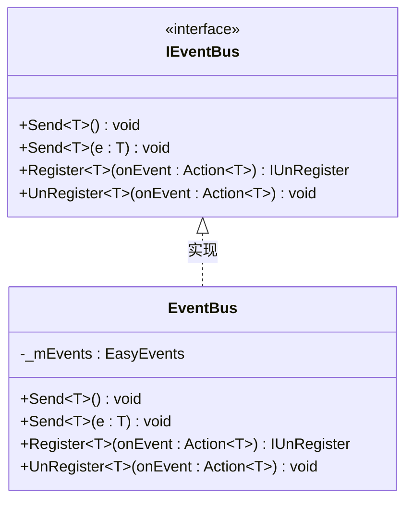

**图表来源**
- [IEventBus.cs](file://GFramework.Core.Abstractions/events/IEventBus.cs#L8-L36)
- [EventBus.cs](file://GFramework.Core/events/EventBus.cs#L8-L54)

### EasyEvents全局管理器

EasyEvents提供了全局事件管理功能：

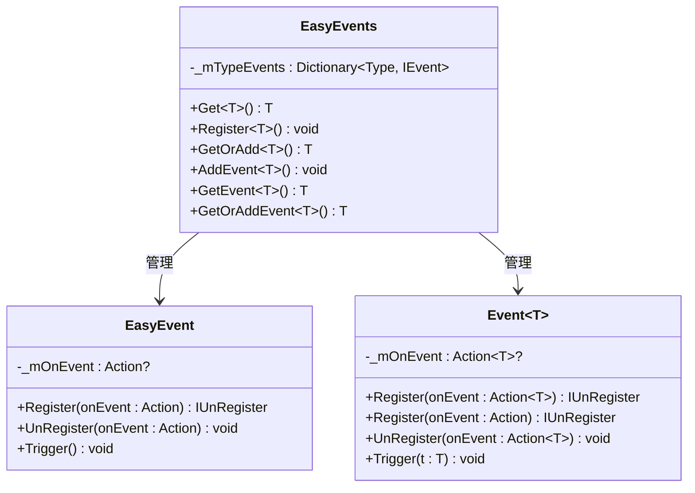

**图表来源**
- [EasyEvents.cs](file://GFramework.Core/events/EasyEvents.cs#L9-L84)
- [EasyEvent.cs](file://GFramework.Core/events/EasyEvent.cs#L8-L38)
- [EasyEventGeneric.cs](file://GFramework.Core/events/EasyEventGeneric.cs#L10-L61)

**章节来源**
- [IEventBus.cs](file://GFramework.Core.Abstractions/events/IEventBus.cs#L1-L37)
- [EventBus.cs](file://GFramework.Core/events/EventBus.cs#L1-L55)
- [EasyEvents.cs](file://GFramework.Core/events/EasyEvents.cs#L1-L85)

## 架构概览

EventBus系统采用分层架构设计，实现了清晰的关注点分离：

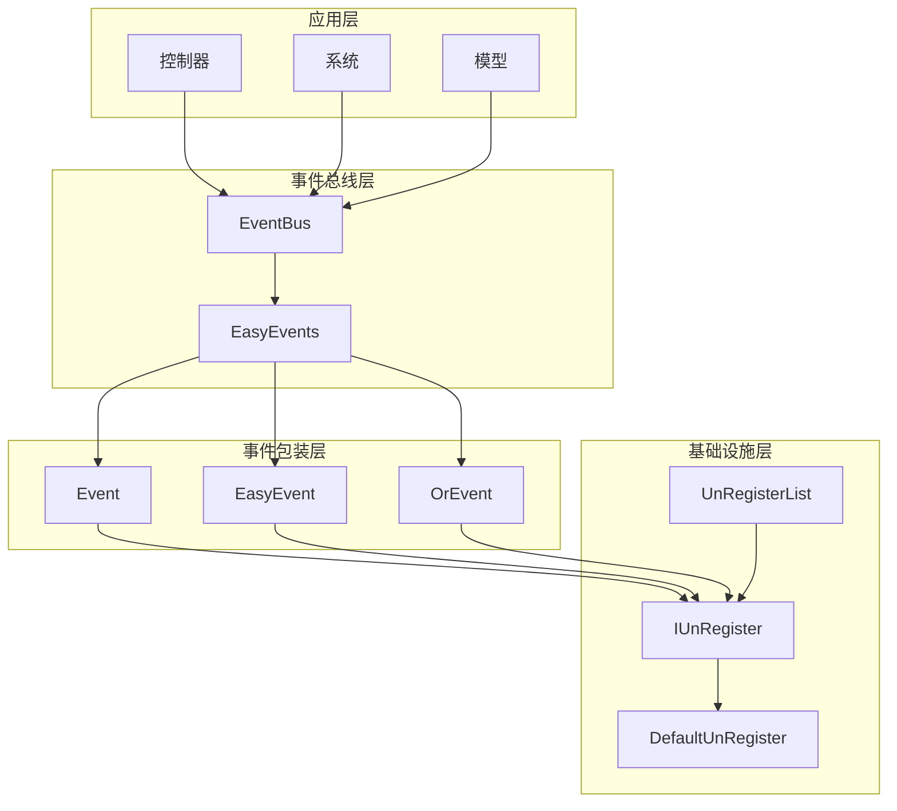

**图表来源**
- [EventBus.cs](file://GFramework.Core/events/EventBus.cs#L8-L54)
- [EasyEvents.cs](file://GFramework.Core/events/EasyEvents.cs#L9-L84)
- [IEventBus.cs](file://GFramework.Core.Abstractions/events/IEventBus.cs#L8-L36)

## 详细组件分析

### EventBus实现分析

EventBus是事件系统的主入口，提供了类型安全的事件处理能力：

#### Send方法重载机制

EventBus实现了两种Send方法重载：

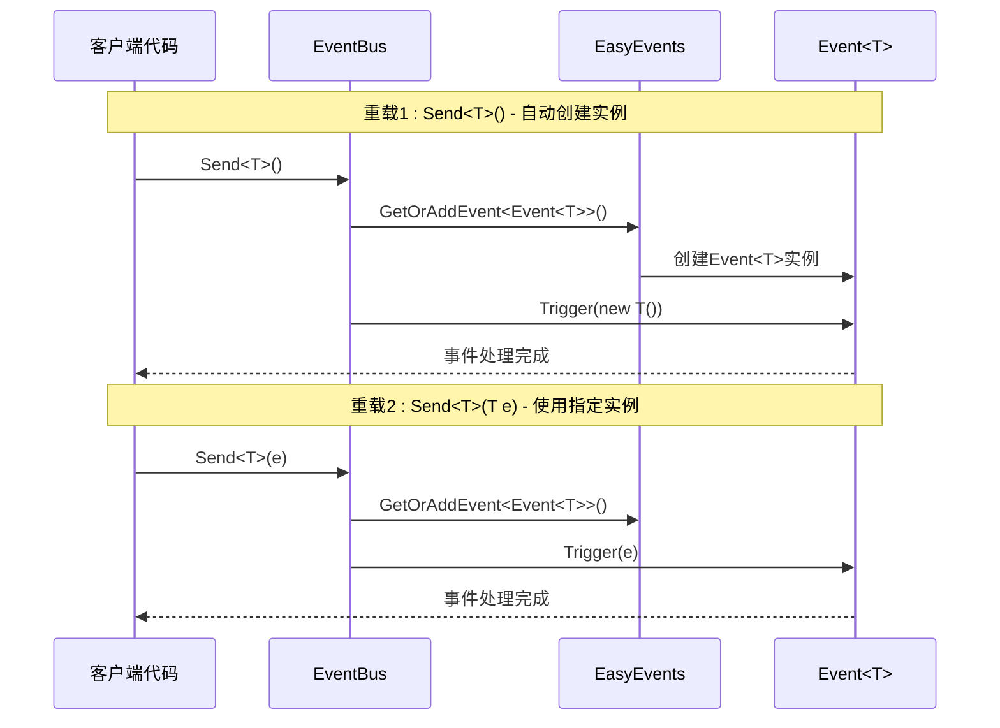

**图表来源**
- [EventBus.cs](file://GFramework.Core/events/EventBus.cs#L16-L33)

#### Register和UnRegister方法实现

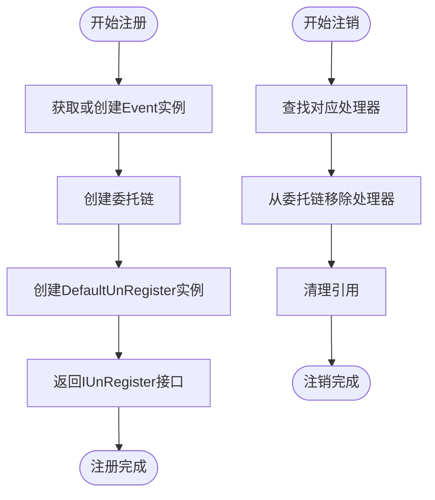

**图表来源**
- [EventBus.cs](file://GFramework.Core/events/EventBus.cs#L41-L54)
- [DefaultUnRegister.cs](file://GFramework.Core/events/DefaultUnRegister.cs#L9-L21)

**章节来源**
- [EventBus.cs](file://GFramework.Core/events/EventBus.cs#L1-L55)

### EasyEvents容器机制

EasyEvents作为全局事件管理器，提供了类型安全的事件实例管理：

#### 事件实例生命周期管理

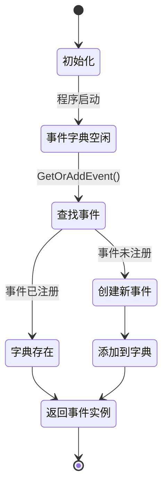

**图表来源**
- [EasyEvents.cs](file://GFramework.Core/events/EasyEvents.cs#L74-L84)

#### 类型安全的事件管理

EasyEvents确保了以下类型安全特性：
- 编译时类型检查
- 运行时类型验证
- 泛型约束保证
- 异常处理机制

**章节来源**
- [EasyEvents.cs](file://GFramework.Core/events/EasyEvents.cs#L1-L85)

### Event<T>事件包装机制

Event<T>实现了IEvent接口，提供了灵活的事件处理能力：

#### 泛型事件处理器

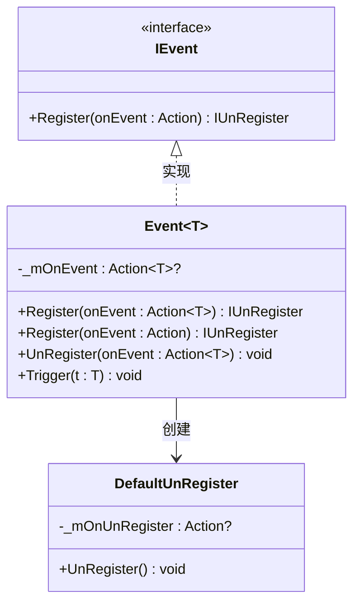

**图表来源**
- [EasyEventGeneric.cs](file://GFramework.Core/events/EasyEventGeneric.cs#L10-L61)
- [IEvent.cs](file://GFramework.Core.Abstractions/events/IEvent.cs#L8-L15)
- [DefaultUnRegister.cs](file://GFramework.Core/events/DefaultUnRegister.cs#L9-L21)

#### 双参数事件支持

Event<T, TK>扩展了单参数事件的功能，支持更复杂的数据传递：

**章节来源**
- [EasyEventGeneric.cs](file://GFramework.Core/events/EasyEventGeneric.cs#L1-L123)

### IUnRegister接口和注销机制

IUnRegister接口提供了统一的注销管理：

#### 注销流程设计

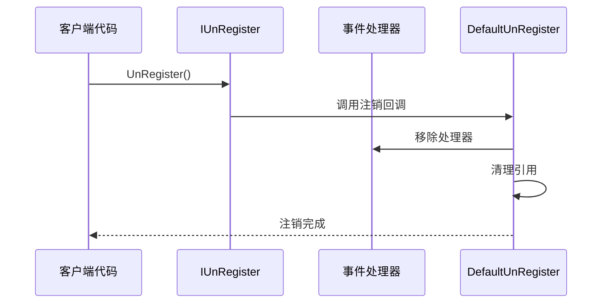

**图表来源**
- [IUnRegister.cs](file://GFramework.Core.Abstractions/events/IUnRegister.cs#L6-L11)
- [DefaultUnRegister.cs](file://GFramework.Core/events/DefaultUnRegister.cs#L16-L21)

**章节来源**
- [IUnRegister.cs](file://GFramework.Core.Abstractions/events/IUnRegister.cs#L1-L12)
- [DefaultUnRegister.cs](file://GFramework.Core/events/DefaultUnRegister.cs#L1-L22)

### 事件组合和高级功能

#### OrEvent事件组合器

OrEvent实现了事件的逻辑或运算，支持多个事件的组合：

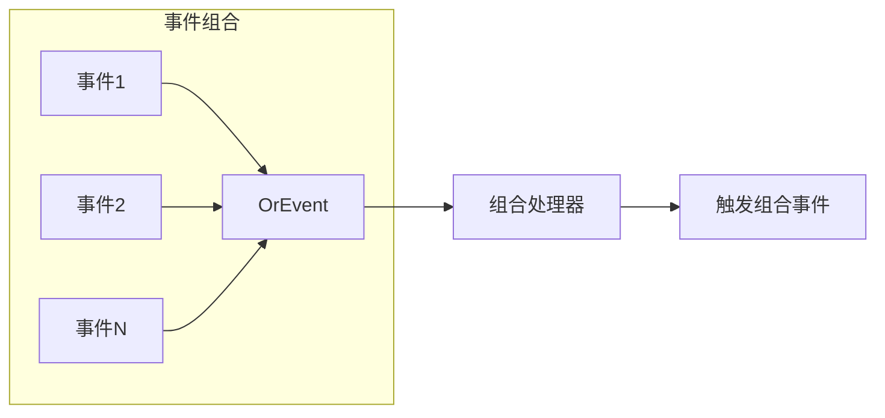

**图表来源**
- [OrEvent.cs](file://GFramework.Core/events/OrEvent.cs#L23-L27)

**章节来源**
- [OrEvent.cs](file://GFramework.Core/events/OrEvent.cs#L1-L57)

## 依赖关系分析

EventBus系统的依赖关系体现了清晰的层次结构：

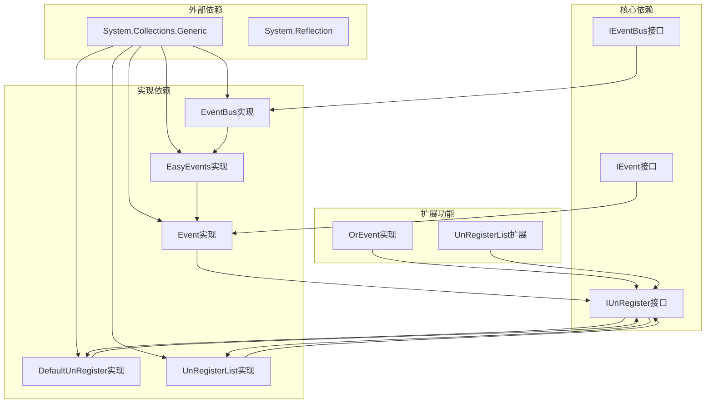

**图表来源**
- [EventBus.cs](file://GFramework.Core/events/EventBus.cs#L1-L10)
- [EasyEvents.cs](file://GFramework.Core/events/EasyEvents.cs#L1-L19)
- [IEventBus.cs](file://GFramework.Core.Abstractions/events/IEventBus.cs#L1-L8)

**章节来源**
- [EventBus.cs](file://GFramework.Core/events/EventBus.cs#L1-L55)
- [EasyEvents.cs](file://GFramework.Core/events/EasyEvents.cs#L1-L85)

## 性能考虑

### 内存管理策略

EventBus采用了多种内存管理优化策略：

#### 事件实例复用
- EasyEvents使用字典缓存事件实例
- 避免重复创建Event<T>实例
- 减少垃圾回收压力

#### 委托链优化
- 使用空操作委托避免null检查
- 委托链的高效添加和移除
- 及时清理引用防止内存泄漏

#### 泛型约束保证
- 编译时类型检查减少运行时开销
- 无参构造函数约束确保实例创建效率

### 性能特征

#### 时间复杂度
- 事件注册: O(1) 平均情况
- 事件注销: O(n) 其中n为处理器数量
- 事件触发: O(n) 其中n为已注册处理器数量

#### 空间复杂度
- 事件实例存储: O(k) 其中k为已注册事件类型数量
- 处理器存储: O(n) 其中n为处理器总数

## 故障排除指南

### 常见问题和解决方案

#### 事件未触发问题
**症状**: 注册的事件处理器没有被调用
**可能原因**:
- 事件类型未正确实现无参构造函数
- 事件实例未正确发送
- 注销操作过早执行

**解决方法**:
1. 确保事件类型具有无参构造函数
2. 验证Send方法调用时机
3. 检查注销时机和作用域

#### 内存泄漏问题
**症状**: 应用程序内存持续增长
**可能原因**:
- 未正确注销事件处理器
- 长生命周期对象持有事件引用
- 循环引用问题

**解决方法**:
1. 使用IUnRegister接口管理注销
2. 实现UnRegisterList批量注销
3. 遵循生命周期管理最佳实践

#### 性能问题
**症状**: 事件处理延迟或卡顿
**可能原因**:
- 事件处理器执行时间过长
- 频繁触发高成本事件
- 大量事件处理器同时处理

**解决方法**:
1. 优化事件处理器逻辑
2. 使用事件过滤和条件处理
3. 考虑使用命令模式替代某些事件

**章节来源**
- [EventBusTests.cs](file://GFramework.Core.Tests/events/EventBusTests.cs#L1-L85)
- [README.md](file://GFramework.Core/events/README.md#L476-L523)

## 结论

EventBus系统通过精心设计的架构实现了高效的类型安全事件处理机制。其核心优势包括：

1. **类型安全性**: 编译时类型检查确保事件处理的正确性
2. **灵活性**: 支持无参和带参事件处理
3. **性能优化**: 事件实例缓存和委托链优化
4. **易用性**: 简洁的API设计和丰富的扩展功能
5. **内存管理**: 完善的注销机制防止内存泄漏

该系统适用于需要松耦合通信的大型应用程序，特别是在游戏开发和企业级应用中表现出色。

## 附录

### API使用示例

#### 基本事件发送和注册

```csharp
// 创建事件总线实例
var eventBus = new EventBus();

// 注册事件处理器
var unregister = eventBus.Register<PlayerDiedEvent>(e =>
{
    Console.WriteLine($"玩家死亡位置: {e.Position}");
});

// 发送事件实例
eventBus.Send(new PlayerDiedEvent 
{ 
    Position = new Vector3(10, 0, 5) 
});

// 发送事件（自动创建实例）
eventBus.Send<PlayerDiedEvent>();

// 注销事件处理器
unregister.UnRegister();
```

#### 批量事件管理

```csharp
// 使用注销列表管理多个事件
var unregisterList = new UnRegisterList();

this.RegisterEvent<GameStartedEvent>(OnGameStarted)
    .AddToUnregisterList(unregisterList);
    
this.RegisterEvent<PlayerDiedEvent>(OnPlayerDied)
    .AddToUnregisterList(unregisterList);

// 批量注销
unregisterList.UnRegisterAll();
```

#### 事件组合使用

```csharp
// 组合多个输入事件
var onAnyInput = new OrEvent()
    .Or(onKeyPressed)
    .Or(onMouseClicked)
    .Or(onTouchDetected);

onAnyInput.Register(() => 
{
    Console.WriteLine("检测到输入!");
});
```

**章节来源**
- [README.md](file://GFramework.Core/events/README.md#L142-L162)
- [README.md](file://GFramework.Core/events/README.md#L201-L211)
- [README.md](file://GFramework.Core/events/README.md#L348-L358)