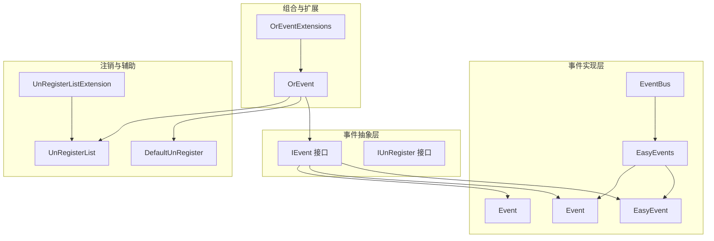
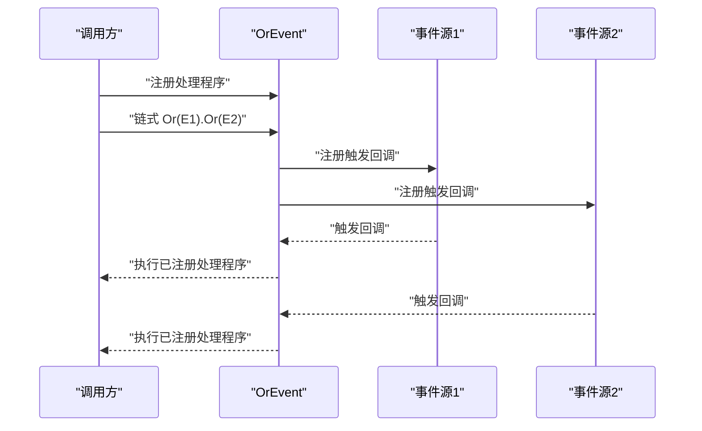
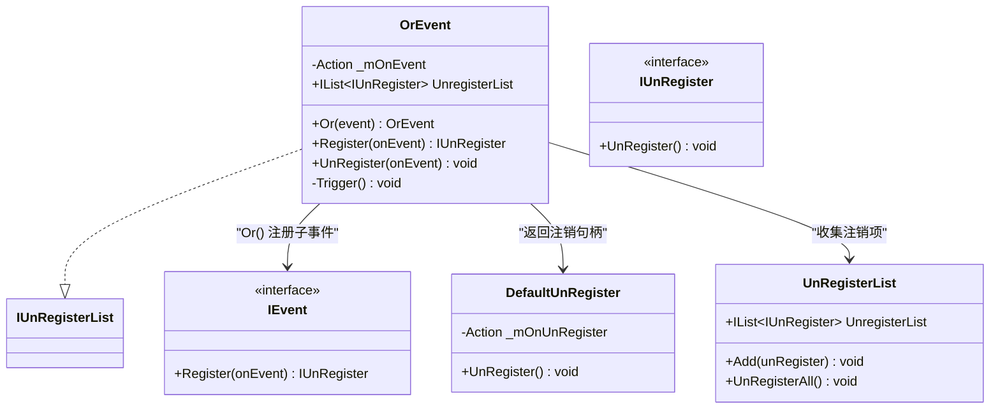
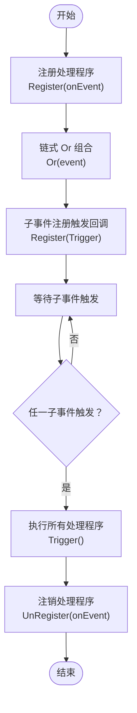
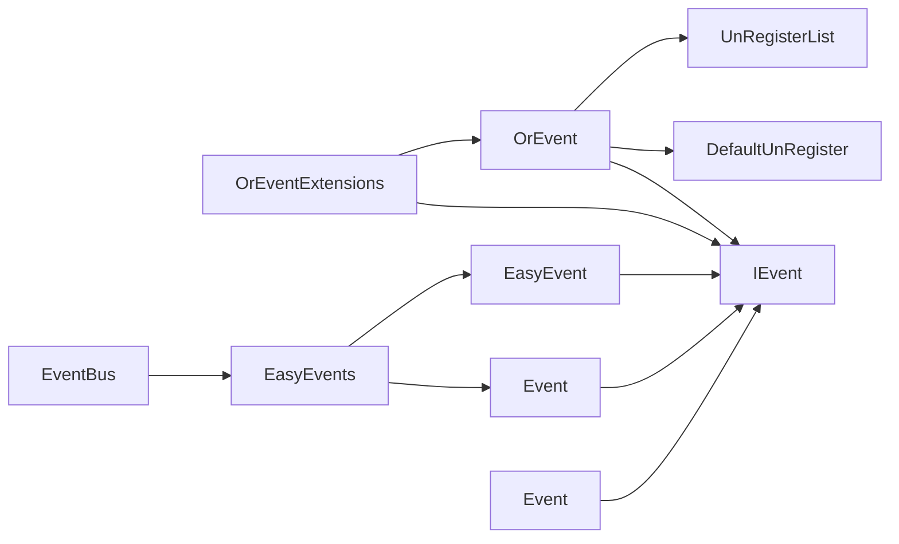

# OrEvent组合事件

<cite>
**本文引用的文件**
- [OrEvent.cs](file://GFramework.Core/events/OrEvent.cs)
- [OrEventExtensions.cs](file://GFramework.Core/extensions/OrEventExtensions.cs)
- [EasyEvent.cs](file://GFramework.Core/events/EasyEvent.cs)
- [EasyEventGeneric.cs](file://GFramework.Core/events/EasyEventGeneric.cs)
- [EasyEvents.cs](file://GFramework.Core/events/EasyEvents.cs)
- [EventBus.cs](file://GFramework.Core/events/EventBus.cs)
- [IEvent.cs](file://GFramework.Core.Abstractions/events/IEvent.cs)
- [IUnRegister.cs](file://GFramework.Core.Abstractions/events/IUnRegister.cs)
- [DefaultUnRegister.cs](file://GFramework.Core/events/DefaultUnRegister.cs)
- [UnRegisterList.cs](file://GFramework.Core/events/UnRegisterList.cs)
- [UnRegisterListExtension.cs](file://GFramework.Core/extensions/UnRegisterListExtension.cs)
- [OrEventTests.cs](file://GFramework.Core.Tests/events/OrEventTests.cs)
- [README.md（事件包）](file://GFramework.Core/events/README.md)
</cite>

## 目录
1. [引言](#引言)
2. [项目结构](#项目结构)
3. [核心组件](#核心组件)
4. [架构概览](#架构概览)
5. [详细组件分析](#详细组件分析)
6. [依赖分析](#依赖分析)
7. [性能考量](#性能考量)
8. [故障排查指南](#故障排查指南)
9. [结论](#结论)
10. [附录](#附录)

## 引言
本技术文档聚焦于 OrEvent 组合事件系统，系统性阐述其“或逻辑”组合设计理念、多事件源合并处理机制、事件传播策略、事件聚合与优先级处理规则，以及注册、触发与注销的完整流程。同时提供多条件触发、事件合并等实际应用场景，并与传统事件系统进行对比分析，帮助读者高效构建复杂事件处理逻辑。

## 项目结构
围绕事件系统的核心文件分布如下：
- 事件抽象与基础设施：IEvent、IUnRegister、DefaultUnRegister、UnRegisterList、UnRegisterListExtension
- 事件实现：EasyEvent、Event<T>、Event<T,TK>、EasyEvents、EventBus
- 组合事件：OrEvent、OrEventExtensions
- 测试与文档：OrEventTests、事件包使用说明

图表来源
- [IEvent.cs](file://GFramework.Core.Abstractions/events/IEvent.cs#L8-L16)
- [IUnRegister.cs](file://GFramework.Core.Abstractions/events/IUnRegister.cs#L6-L12)
- [EasyEvent.cs](file://GFramework.Core/events/EasyEvent.cs#L8-L39)
- [EasyEventGeneric.cs](file://GFramework.Core/events/EasyEventGeneric.cs#L10-L123)
- [EasyEvents.cs](file://GFramework.Core/events/EasyEvents.cs#L9-L85)
- [EventBus.cs](file://GFramework.Core/events/EventBus.cs#L8-L55)
- [OrEvent.cs](file://GFramework.Core/events/OrEvent.cs#L9-L57)
- [OrEventExtensions.cs](file://GFramework.Core/extensions/OrEventExtensions.cs#L9-L21)
- [DefaultUnRegister.cs](file://GFramework.Core/events/DefaultUnRegister.cs#L9-L22)
- [UnRegisterList.cs](file://GFramework.Core/events/UnRegisterList.cs#L8-L37)
- [UnRegisterListExtension.cs](file://GFramework.Core/extensions/UnRegisterListExtension.cs#L8-L32)

章节来源
- [README.md（事件包）](file://GFramework.Core/events/README.md#L1-L523)

## 核心组件
- OrEvent：实现“或逻辑”组合，任一子事件触发即触发组合事件；支持链式 Or 组合与多处理程序注册。
- OrEventExtensions：提供便捷扩展方法，快速创建两个事件的 Or 组合。
- IEvent/IUnRegister：事件与注销的统一抽象，保证组合与普通事件一致的注册/注销语义。
- DefaultUnRegister/UnRegisterList：统一注销机制与批量注销能力，简化生命周期管理。
- EasyEvent/Event<T>/Event<T,TK>：基础事件与泛型事件，提供参数化事件能力。
- EasyEvents/EventBus：全局事件管理与类型化事件总线，便于跨模块事件分发。

章节来源
- [OrEvent.cs](file://GFramework.Core/events/OrEvent.cs#L9-L57)
- [OrEventExtensions.cs](file://GFramework.Core/extensions/OrEventExtensions.cs#L9-L21)
- [IEvent.cs](file://GFramework.Core.Abstractions/events/IEvent.cs#L8-L16)
- [IUnRegister.cs](file://GFramework.Core.Abstractions/events/IUnRegister.cs#L6-L12)
- [DefaultUnRegister.cs](file://GFramework.Core/events/DefaultUnRegister.cs#L9-L22)
- [UnRegisterList.cs](file://GFramework.Core/events/UnRegisterList.cs#L8-L37)
- [EasyEvent.cs](file://GFramework.Core/events/EasyEvent.cs#L8-L39)
- [EasyEventGeneric.cs](file://GFramework.Core/events/EasyEventGeneric.cs#L10-L123)
- [EasyEvents.cs](file://GFramework.Core/events/EasyEvents.cs#L9-L85)
- [EventBus.cs](file://GFramework.Core/events/EventBus.cs#L8-L55)

## 架构概览
OrEvent 将多个 IEvent 作为输入源，通过注册回调的方式监听各子事件；当任意子事件触发时，统一回调会执行，从而触发组合事件的处理程序集合。组合事件本身不存储事件数据，仅承载“或逻辑”的触发语义。

图表来源
- [OrEvent.cs](file://GFramework.Core/events/OrEvent.cs#L23-L56)
- [IEvent.cs](file://GFramework.Core.Abstractions/events/IEvent.cs#L10-L16)
- [DefaultUnRegister.cs](file://GFramework.Core/events/DefaultUnRegister.cs#L9-L22)

## 详细组件分析

### OrEvent 组件分析
- 设计理念：以最小代价实现“或逻辑”组合，保持与 IEvent 一致的注册/注销语义，支持链式组合与多处理程序。
- 关键行为：
  - Or：将指定事件注册为子事件源，内部通过注册统一触发回调，并将注销句柄加入注销列表。
  - Register/UnRegister：维护组合事件的处理程序集合，支持动态增删。
  - Trigger：由子事件触发回调统一调用，确保任一子事件触发即触发组合事件。
- 事件传播策略：采用“冒泡式”传播，子事件触发 -> 组合事件触发回调 -> 执行所有已注册处理程序。
- 事件聚合与优先级：OrEvent 不引入额外的聚合逻辑与优先级排序，遵循“先注册先触发”的委托链顺序。

图表来源
- [OrEvent.cs](file://GFramework.Core/events/OrEvent.cs#L9-L57)
- [IEvent.cs](file://GFramework.Core.Abstractions/events/IEvent.cs#L8-L16)
- [IUnRegister.cs](file://GFramework.Core.Abstractions/events/IUnRegister.cs#L6-L12)
- [DefaultUnRegister.cs](file://GFramework.Core/events/DefaultUnRegister.cs#L9-L22)
- [UnRegisterList.cs](file://GFramework.Core/events/UnRegisterList.cs#L8-L37)

章节来源
- [OrEvent.cs](file://GFramework.Core/events/OrEvent.cs#L9-L57)
- [OrEventTests.cs](file://GFramework.Core.Tests/events/OrEventTests.cs#L16-L103)

### OrEventExtensions 组件分析
- 提供便捷扩展方法，将两个 IEvent 进行 Or 组合，形成新的 OrEvent 实例，便于链式组合与快速构建。
- 语义等价于：new OrEvent().Or(self).Or(e)。

章节来源
- [OrEventExtensions.cs](file://GFramework.Core/extensions/OrEventExtensions.cs#L9-L21)

### 事件聚合与优先级处理规则
- 聚合逻辑：OrEvent 仅负责将多个事件源的触发汇聚到自身触发回调，不做数据聚合或去重。
- 优先级规则：未引入显式优先级；处理程序按注册顺序依次执行，遵循委托链的先后顺序。

章节来源
- [OrEvent.cs](file://GFramework.Core/events/OrEvent.cs#L34-L56)

### 注册、触发与注销流程
- 注册：调用 Register 注册处理程序，返回 IUnRegister；Or 组合时，子事件通过 Register(Trigger) 注册统一触发回调，并将注销句柄加入 OrEvent 的注销列表。
- 触发：任一子事件触发时，调用 Trigger，进而执行所有已注册处理程序。
- 注销：调用 UnRegister 移除指定处理程序；OrEvent 的注销会触发其注销列表中所有子事件的注销。

图表来源
- [OrEvent.cs](file://GFramework.Core/events/OrEvent.cs#L23-L56)
- [IUnRegister.cs](file://GFramework.Core.Abstractions/events/IUnRegister.cs#L6-L12)

章节来源
- [OrEvent.cs](file://GFramework.Core/events/OrEvent.cs#L23-L56)
- [UnRegisterListExtension.cs](file://GFramework.Core/extensions/UnRegisterListExtension.cs#L15-L31)

### 与传统事件系统的对比分析
- 传统事件系统（如 EasyEvent/Event<T>）：面向单一事件源，适合一对一或一对多的直接通信。
- OrEvent 组合事件：面向多事件源的“或逻辑”聚合，适合多条件触发、事件合并等场景，降低分支判断复杂度。
- 适用性建议：
  - 使用 EasyEvent/Event<T>：明确单一事件源、需要参数化事件数据。
  - 使用 OrEvent：需要将多个事件源合并为一个触发点，简化上层逻辑。

章节来源
- [README.md（事件包）](file://GFramework.Core/events/README.md#L507-L523)

### 实际应用示例
- 多条件触发：将键盘输入、鼠标点击、触摸检测等多个输入事件组合为“任意输入即触发”，统一进入输入处理流程。
- 事件合并：将物理伤害、魔法伤害、中毒伤害等不同来源的伤害事件合并为“任何伤害”事件，集中播放受击特效与音效。
- 与全局事件系统结合：通过 EasyEvents/EventBus 获取/发送事件，再用 OrEvent 进行组合，实现模块间解耦的复合事件。

章节来源
- [README.md（事件包）](file://GFramework.Core/events/README.md#L182-L195)
- [EasyEvents.cs](file://GFramework.Core/events/EasyEvents.cs#L26-L48)
- [EventBus.cs](file://GFramework.Core/events/EventBus.cs#L16-L44)

## 依赖分析
- OrEvent 依赖 IEvent 抽象，确保与具体事件实现解耦；通过 DefaultUnRegister 提供统一注销能力；通过 UnRegisterList 收集子事件的注销句柄，实现批量注销。
- OrEventExtensions 依赖 OrEvent 与 IEvent，提供便捷组合入口。
- EasyEvent/Event<T>/Event<T,TK> 提供参数化事件能力，支撑 OrEvent 的数据无关特性（OrEvent 仅关注触发时机）。
- EasyEvents/EventBus 提供全局事件管理与类型化事件总线，便于跨模块事件分发与组合。

图表来源
- [OrEvent.cs](file://GFramework.Core/events/OrEvent.cs#L9-L57)
- [OrEventExtensions.cs](file://GFramework.Core/extensions/OrEventExtensions.cs#L9-L21)
- [IEvent.cs](file://GFramework.Core.Abstractions/events/IEvent.cs#L8-L16)
- [DefaultUnRegister.cs](file://GFramework.Core/events/DefaultUnRegister.cs#L9-L22)
- [UnRegisterList.cs](file://GFramework.Core/events/UnRegisterList.cs#L8-L37)
- [EasyEvent.cs](file://GFramework.Core/events/EasyEvent.cs#L8-L39)
- [EasyEventGeneric.cs](file://GFramework.Core/events/EasyEventGeneric.cs#L10-L123)
- [EasyEvents.cs](file://GFramework.Core/events/EasyEvents.cs#L9-L85)
- [EventBus.cs](file://GFramework.Core/events/EventBus.cs#L8-L55)

章节来源
- [OrEvent.cs](file://GFramework.Core/events/OrEvent.cs#L9-L57)
- [OrEventExtensions.cs](file://GFramework.Core/extensions/OrEventExtensions.cs#L9-L21)
- [EasyEvent.cs](file://GFramework.Core/events/EasyEvent.cs#L8-L39)
- [EasyEventGeneric.cs](file://GFramework.Core/events/EasyEventGeneric.cs#L10-L123)
- [EasyEvents.cs](file://GFramework.Core/events/EasyEvents.cs#L9-L85)
- [EventBus.cs](file://GFramework.Core/events/EventBus.cs#L8-L55)

## 性能考量
- OrEvent 本身不存储事件数据，仅维护处理程序委托链，触发开销主要来自委托链执行与一次统一回调。
- 子事件数量增加会线性增加注册回调数量，但触发路径仍为常数级（一次统一回调 -> 多处理程序）。
- 建议：
  - 控制组合事件中的子事件数量，避免过长的处理程序链。
  - 将耗时逻辑放入异步或延迟执行，避免阻塞触发路径。
  - 使用 UnRegisterList 批量注销，防止事件泄漏导致处理程序累积。

## 故障排查指南
- 组合事件未触发：
  - 检查是否正确调用链式 Or 组合并注册处理程序。
  - 确认子事件确实被触发，且未被提前注销。
- 处理程序未被注销：
  - 使用返回的 IUnRegister 或 UnRegisterList.UnRegisterAll 进行注销。
  - 确保在合适的生命周期（如退出场景树）执行注销。
- 多处理程序重复触发：
  - 检查是否重复注册同一处理程序。
  - 使用 UnRegister 移除多余处理程序。

章节来源
- [OrEventTests.cs](file://GFramework.Core.Tests/events/OrEventTests.cs#L16-L103)
- [UnRegisterListExtension.cs](file://GFramework.Core/extensions/UnRegisterListExtension.cs#L24-L31)

## 结论
OrEvent 通过“或逻辑”组合多个事件源，显著简化多条件触发与事件合并场景的上层逻辑。其与 IEvent 抽象、DefaultUnRegister、UnRegisterList 的协作，提供了统一、可扩展、易维护的事件组合能力。配合 EasyEvents/EventBus，可在模块间实现松耦合的复合事件处理，适用于游戏开发中常见的输入聚合、状态合并、跨模块通知等场景。

## 附录
- 快速上手要点：
  - 使用 OrEventExtensions 快速组合两个事件。
  - 通过链式 Or 组合多个事件源。
  - 使用 Register/UnRegister 管理处理程序。
  - 使用 UnRegisterList 管理批量注销。

章节来源
- [README.md（事件包）](file://GFramework.Core/events/README.md#L182-L195)
- [OrEventExtensions.cs](file://GFramework.Core/extensions/OrEventExtensions.cs#L17-L20)
- [UnRegisterList.cs](file://GFramework.Core/events/UnRegisterList.cs#L29-L36)