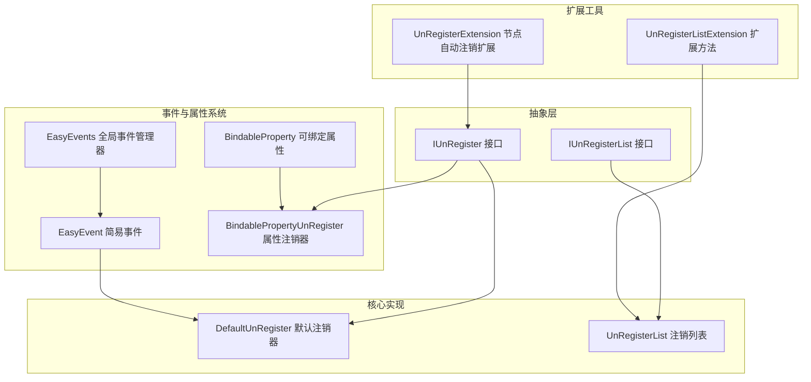
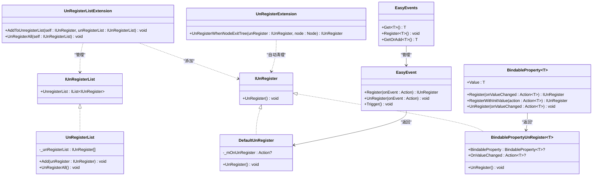
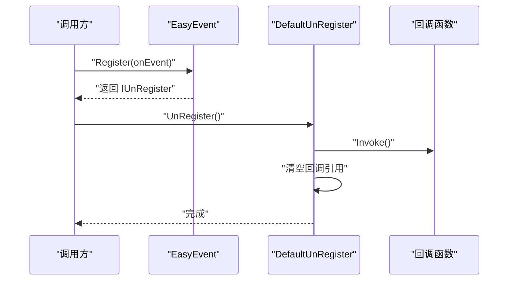
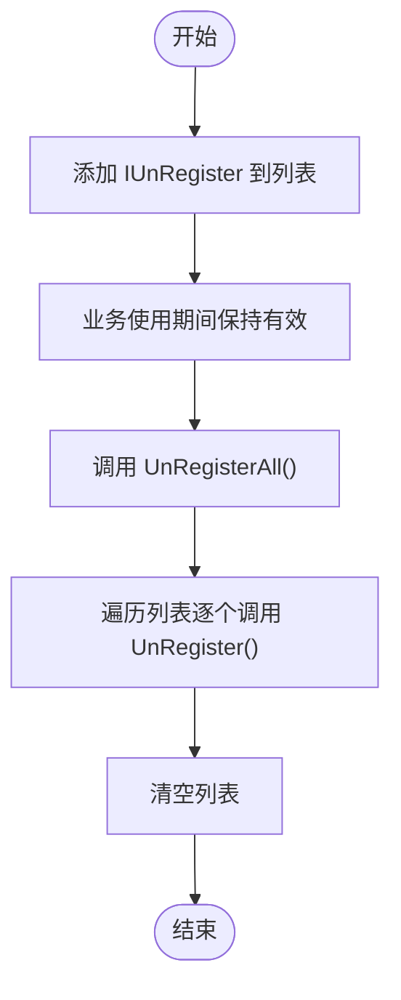
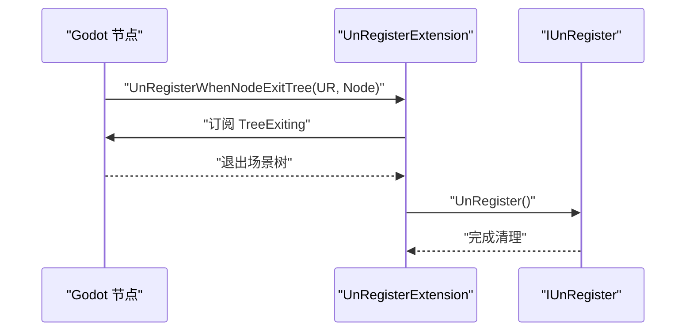
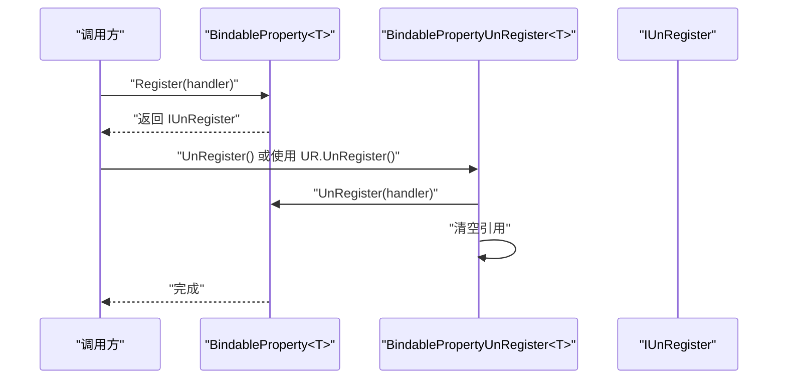
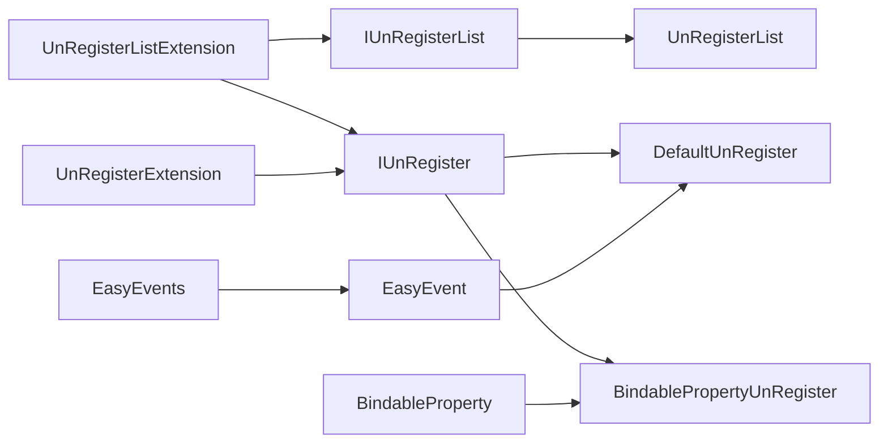

# UnRegister注销管理

<cite>
**本文引用的文件**
- [IUnRegister.cs](file://GFramework.Core.Abstractions/events/IUnRegister.cs)
- [IUnRegisterList.cs](file://GFramework.Core.Abstractions/events/IUnRegisterList.cs)
- [DefaultUnRegister.cs](file://GFramework.Core/events/DefaultUnRegister.cs)
- [UnRegisterList.cs](file://GFramework.Core/events/UnRegisterList.cs)
- [UnRegisterListExtension.cs](file://GFramework.Core/extensions/UnRegisterListExtension.cs)
- [EasyEvent.cs](file://GFramework.Core/events/EasyEvent.cs)
- [EasyEvents.cs](file://GFramework.Core/events/EasyEvents.cs)
- [BindableProperty.cs](file://GFramework.Core/property/BindableProperty.cs)
- [BindablePropertyUnRegister.cs](file://GFramework.Core/property/BindablePropertyUnRegister.cs)
- [UnRegisterExtension.cs](file://GFramework.Godot/extensions/UnRegisterExtension.cs)
- [UnRegisterTests.cs](file://GFramework.Core.Tests/events/UnRegisterTests.cs)
- [EasyEventsTests.cs](file://GFramework.Core.Tests/events/EasyEventsTests.cs)
</cite>

## 目录
1. [简介](#简介)
2. [项目结构](#项目结构)
3. [核心组件](#核心组件)
4. [架构总览](#架构总览)
5. [详细组件分析](#详细组件分析)
6. [依赖分析](#依赖分析)
7. [性能考虑](#性能考虑)
8. [故障排查指南](#故障排查指南)
9. [结论](#结论)
10. [附录](#附录)

## 简介
本技术文档围绕UnRegister注销管理系统展开，系统性阐述以下主题：
- IUnRegister接口的设计理念与职责边界
- DefaultUnRegister的默认实现及其内存泄漏防护策略
- UnRegisterList的自动注销管理机制与批量注销能力
- 事件监听器的自动清理与手动注销的协同机制
- 在复杂游戏场景中的应用示例与最佳实践
- 常见陷阱与规避方法，帮助开发者正确使用注销接口，防止内存泄漏与资源浪费

## 项目结构
UnRegister注销管理位于事件与属性系统模块中，采用“抽象接口 + 核心实现 + 扩展工具”的分层设计：
- 抽象层：IUnRegister、IUnRegisterList 定义统一的注销契约
- 核心实现：DefaultUnRegister、UnRegisterList 提供默认与集合化注销能力
- 扩展工具：UnRegisterListExtension、UnRegisterExtension 提供便捷的注册/注销与自动清理能力
- 事件与属性集成：EasyEvent、EasyEvents、BindableProperty、BindablePropertyUnRegister 将注销与事件/属性系统无缝衔接

图表来源
- [IUnRegister.cs](file://GFramework.Core.Abstractions/events/IUnRegister.cs#L1-L12)
- [IUnRegisterList.cs](file://GFramework.Core.Abstractions/events/IUnRegisterList.cs#L1-L14)
- [DefaultUnRegister.cs](file://GFramework.Core/events/DefaultUnRegister.cs#L1-L22)
- [UnRegisterList.cs](file://GFramework.Core/events/UnRegisterList.cs#L1-L37)
- [UnRegisterListExtension.cs](file://GFramework.Core/extensions/UnRegisterListExtension.cs#L1-L32)
- [UnRegisterExtension.cs](file://GFramework.Godot/extensions/UnRegisterExtension.cs#L1-L23)
- [EasyEvent.cs](file://GFramework.Core/events/EasyEvent.cs#L1-L39)
- [EasyEvents.cs](file://GFramework.Core/events/EasyEvents.cs#L1-L85)
- [BindableProperty.cs](file://GFramework.Core/property/BindableProperty.cs#L1-L135)
- [BindablePropertyUnRegister.cs](file://GFramework.Core/property/BindablePropertyUnRegister.cs#L1-L39)

章节来源
- [IUnRegister.cs](file://GFramework.Core.Abstractions/events/IUnRegister.cs#L1-L12)
- [IUnRegisterList.cs](file://GFramework.Core.Abstractions/events/IUnRegisterList.cs#L1-L14)
- [DefaultUnRegister.cs](file://GFramework.Core/events/DefaultUnRegister.cs#L1-L22)
- [UnRegisterList.cs](file://GFramework.Core/events/UnRegisterList.cs#L1-L37)
- [UnRegisterListExtension.cs](file://GFramework.Core/extensions/UnRegisterListExtension.cs#L1-L32)
- [UnRegisterExtension.cs](file://GFramework.Godot/extensions/UnRegisterExtension.cs#L1-L23)
- [EasyEvent.cs](file://GFramework.Core/events/EasyEvent.cs#L1-L39)
- [EasyEvents.cs](file://GFramework.Core/events/EasyEvents.cs#L1-L85)
- [BindableProperty.cs](file://GFramework.Core/property/BindableProperty.cs#L1-L135)
- [BindablePropertyUnRegister.cs](file://GFramework.Core/property/BindablePropertyUnRegister.cs#L1-L39)

## 核心组件
- IUnRegister：最小化注销契约，仅暴露一个UnRegister方法，确保任何可注销对象都遵循统一的释放语义
- DefaultUnRegister：最简默认实现，持有注销回调并在调用后清空引用，防止重复执行与悬挂引用
- UnRegisterList：集合化管理器，维护IUnRegister列表，提供批量注销与清空能力
- UnRegisterListExtension：扩展方法，提供AddToUnregisterList与UnRegisterAll的便捷调用
- UnRegisterExtension（Godot）：在节点退出场景树时自动触发注销，避免遗漏清理
- EasyEvent/EasyEvents：事件系统与全局事件管理器，注册时返回IUnRegister，便于统一管理
- BindableProperty/BindablePropertyUnRegister：属性系统与属性注销器，注册时返回IUnRegister，支持立即初始化回调

章节来源
- [IUnRegister.cs](file://GFramework.Core.Abstractions/events/IUnRegister.cs#L1-L12)
- [DefaultUnRegister.cs](file://GFramework.Core/events/DefaultUnRegister.cs#L1-L22)
- [UnRegisterList.cs](file://GFramework.Core/events/UnRegisterList.cs#L1-L37)
- [UnRegisterListExtension.cs](file://GFramework.Core/extensions/UnRegisterListExtension.cs#L1-L32)
- [UnRegisterExtension.cs](file://GFramework.Godot/extensions/UnRegisterExtension.cs#L1-L23)
- [EasyEvent.cs](file://GFramework.Core/events/EasyEvent.cs#L1-L39)
- [EasyEvents.cs](file://GFramework.Core/events/EasyEvents.cs#L1-L85)
- [BindableProperty.cs](file://GFramework.Core/property/BindableProperty.cs#L1-L135)
- [BindablePropertyUnRegister.cs](file://GFramework.Core/property/BindablePropertyUnRegister.cs#L1-L39)

## 架构总览
下图展示了注销系统在事件与属性系统中的交互关系，以及与Godot扩展的自动清理联动。

图表来源
- [IUnRegister.cs](file://GFramework.Core.Abstractions/events/IUnRegister.cs#L1-L12)
- [DefaultUnRegister.cs](file://GFramework.Core/events/DefaultUnRegister.cs#L1-L22)
- [IUnRegisterList.cs](file://GFramework.Core.Abstractions/events/IUnRegisterList.cs#L1-L14)
- [UnRegisterList.cs](file://GFramework.Core/events/UnRegisterList.cs#L1-L37)
- [UnRegisterListExtension.cs](file://GFramework.Core/extensions/UnRegisterListExtension.cs#L1-L32)
- [UnRegisterExtension.cs](file://GFramework.Godot/extensions/UnRegisterExtension.cs#L1-L23)
- [EasyEvent.cs](file://GFramework.Core/events/EasyEvent.cs#L1-L39)
- [EasyEvents.cs](file://GFramework.Core/events/EasyEvents.cs#L1-L85)
- [BindableProperty.cs](file://GFramework.Core/property/BindableProperty.cs#L1-L135)
- [BindablePropertyUnRegister.cs](file://GFramework.Core/property/BindablePropertyUnRegister.cs#L1-L39)

## 详细组件分析

### IUnRegister接口与DefaultUnRegister默认实现
- 设计理念
  - 最小化契约：仅定义UnRegister方法，确保任何可注销对象都能被统一管理
  - 解耦与复用：通过接口隔离具体注销逻辑，便于替换与扩展
- DefaultUnRegister实现要点
  - 持有注销回调并在调用后置空引用，防止重复执行与悬挂委托
  - 对空回调的安全处理，避免NRE
  - 与事件系统配合：EasyEvent在注册时返回DefaultUnRegister，使事件回调具备可注销性
- 内存泄漏防护策略
  - 引用清空：调用后将回调引用置空，避免闭包捕获导致的长生命周期对象无法回收
  - 幂等性：多次调用UnRegister不会重复触发回调，减少副作用风险

图表来源
- [EasyEvent.cs](file://GFramework.Core/events/EasyEvent.cs#L1-L39)
- [DefaultUnRegister.cs](file://GFramework.Core/events/DefaultUnRegister.cs#L1-L22)

章节来源
- [IUnRegister.cs](file://GFramework.Core.Abstractions/events/IUnRegister.cs#L1-L12)
- [DefaultUnRegister.cs](file://GFramework.Core/events/DefaultUnRegister.cs#L1-L22)
- [EasyEvent.cs](file://GFramework.Core/events/EasyEvent.cs#L1-L39)

### UnRegisterList的自动注销管理与批量注销
- 自动注销管理机制
  - 维护IUnRegister列表，支持按需添加与统一注销
  - 批量注销：遍历列表逐个调用UnRegister，并在完成后清空列表
- 生命周期管理
  - 列表本身无自动销毁逻辑，应在合适的生命周期节点（如场景切换、系统关闭）调用UnRegisterAll
  - 与扩展方法配合：UnRegisterListExtension提供便捷的AddToUnregisterList与UnRegisterAll
- 内存泄漏防护策略
  - 批量清空：注销后清空列表，避免残留引用导致对象无法回收
  - 幂等性：重复调用UnRegisterAll不会引发异常

图表来源
- [UnRegisterList.cs](file://GFramework.Core/events/UnRegisterList.cs#L1-L37)
- [UnRegisterListExtension.cs](file://GFramework.Core/extensions/UnRegisterListExtension.cs#L1-L32)

章节来源
- [UnRegisterList.cs](file://GFramework.Core/events/UnRegisterList.cs#L1-L37)
- [UnRegisterListExtension.cs](file://GFramework.Core/extensions/UnRegisterListExtension.cs#L1-L32)

### 事件监听器的自动清理与手动注销的协调
- 自动清理（Godot）
  - UnRegisterExtension提供UnRegisterWhenNodeExitTree扩展，监听节点TreeExiting事件，自动触发注销
  - 适用于UI页面、场景节点等生命周期明确的场景
- 手动注销
  - 通过IUnRegister.UnRegister主动调用，适用于跨生命周期或需要即时释放的场景
- 协调机制
  - 优先使用自动清理扩展，避免遗漏；在必要时补充手动注销，确保强约束释放
  - 在复杂场景中，结合UnRegisterList统一管理多个监听器

图表来源
- [UnRegisterExtension.cs](file://GFramework.Godot/extensions/UnRegisterExtension.cs#L1-L23)

章节来源
- [UnRegisterExtension.cs](file://GFramework.Godot/extensions/UnRegisterExtension.cs#L1-L23)

### 与事件系统和属性系统的集成
- EasyEvent
  - Register返回IUnRegister，便于与UnRegisterList或自动清理扩展组合使用
  - UnRegister用于移除特定回调，适合细粒度控制
- EasyEvents
  - 全局事件管理器，支持类型安全的事件获取与创建
- BindableProperty
  - Register/RegisterWithInitValue返回IUnRegister，支持立即初始化回调
  - UnRegister用于移除属性值变化监听
- BindablePropertyUnRegister
  - 专门用于属性注销，调用后清空内部引用，防止循环引用

图表来源
- [BindableProperty.cs](file://GFramework.Core/property/BindableProperty.cs#L1-L135)
- [BindablePropertyUnRegister.cs](file://GFramework.Core/property/BindablePropertyUnRegister.cs#L1-L39)

章节来源
- [EasyEvent.cs](file://GFramework.Core/events/EasyEvent.cs#L1-L39)
- [EasyEvents.cs](file://GFramework.Core/events/EasyEvents.cs#L1-L85)
- [BindableProperty.cs](file://GFramework.Core/property/BindableProperty.cs#L1-L135)
- [BindablePropertyUnRegister.cs](file://GFramework.Core/property/BindablePropertyUnRegister.cs#L1-L39)

## 依赖分析
- 组件耦合
  - DefaultUnRegister与IUnRegister强耦合，与事件系统弱耦合（通过返回值）
  - UnRegisterList与IUnRegisterList强耦合，与扩展方法弱耦合（通过静态扩展）
  - UnRegisterExtension依赖Godot Node类型，提供平台特定的自动清理能力
  - BindableProperty与BindablePropertyUnRegister形成一对注销器-被注销者的关系
- 外部依赖
  - Godot扩展依赖Godot引擎的节点生命周期事件
  - 事件系统依赖EasyEvents全局管理器

图表来源
- [IUnRegister.cs](file://GFramework.Core.Abstractions/events/IUnRegister.cs#L1-L12)
- [DefaultUnRegister.cs](file://GFramework.Core/events/DefaultUnRegister.cs#L1-L22)
- [IUnRegisterList.cs](file://GFramework.Core.Abstractions/events/IUnRegisterList.cs#L1-L14)
- [UnRegisterList.cs](file://GFramework.Core/events/UnRegisterList.cs#L1-L37)
- [UnRegisterListExtension.cs](file://GFramework.Core/extensions/UnRegisterListExtension.cs#L1-L32)
- [UnRegisterExtension.cs](file://GFramework.Godot/extensions/UnRegisterExtension.cs#L1-L23)
- [EasyEvent.cs](file://GFramework.Core/events/EasyEvent.cs#L1-L39)
- [EasyEvents.cs](file://GFramework.Core/events/EasyEvents.cs#L1-L85)
- [BindableProperty.cs](file://GFramework.Core/property/BindableProperty.cs#L1-L135)
- [BindablePropertyUnRegister.cs](file://GFramework.Core/property/BindablePropertyUnRegister.cs#L1-L39)

章节来源
- [UnRegisterList.cs](file://GFramework.Core/events/UnRegisterList.cs#L1-L37)
- [UnRegisterListExtension.cs](file://GFramework.Core/extensions/UnRegisterListExtension.cs#L1-L32)
- [UnRegisterExtension.cs](file://GFramework.Godot/extensions/UnRegisterExtension.cs#L1-L23)
- [EasyEvent.cs](file://GFramework.Core/events/EasyEvent.cs#L1-L39)
- [EasyEvents.cs](file://GFramework.Core/events/EasyEvents.cs#L1-L85)
- [BindableProperty.cs](file://GFramework.Core/property/BindableProperty.cs#L1-L135)
- [BindablePropertyUnRegister.cs](file://GFramework.Core/property/BindablePropertyUnRegister.cs#L1-L39)

## 性能考虑
- 回调调用成本
  - DefaultUnRegister在UnRegister时仅触发一次回调并清空引用，开销极低
- 列表遍历成本
  - UnRegisterAll对列表进行线性遍历，建议在高频场景中控制注册数量或合并注销
- 扩展方法的零拷贝
  - UnRegisterListExtension与UnRegisterExtension均为轻量级包装，避免额外分配
- 事件系统优化
  - EasyEvent使用委托聚合，注册/注销为O(1)，触发为O(n)（n为回调数量）

## 故障排查指南
- 常见问题
  - 回调重复触发：确认DefaultUnRegister是否被多次UnRegister，或是否存在闭包捕获导致的重复引用
  - 内存泄漏：检查UnRegisterList是否在生命周期结束时调用UnRegisterAll，或节点是否正确使用UnRegisterWhenNodeExitTree
  - 属性注销无效：确认BindablePropertyUnRegister的引用未被外部保留，且UnRegister后内部引用已被清空
- 调试建议
  - 使用单元测试验证注销行为（参考UnRegisterTests与EasyEventsTests）
  - 在关键生命周期节点打印注销日志，定位遗漏清理点
  - 对高频注册场景进行压力测试，观察UnRegisterAll耗时

章节来源
- [UnRegisterTests.cs](file://GFramework.Core.Tests/events/UnRegisterTests.cs#L1-L114)
- [EasyEventsTests.cs](file://GFramework.Core.Tests/events/EasyEventsTests.cs#L1-L62)

## 结论
UnRegister注销管理系统通过抽象接口与默认实现解耦了注销逻辑，结合列表化管理与Godot自动清理扩展，提供了灵活而可靠的资源释放方案。遵循本文的最佳实践与故障排查建议，可在复杂游戏场景中有效避免内存泄漏与资源浪费。

## 附录
- 最佳实践
  - 优先使用UnRegisterWhenNodeExitTree进行Godot节点的自动清理
  - 使用UnRegisterList统一管理一组监听器，集中调用UnRegisterAll
  - 注册事件时保存IUnRegister，以便在需要时手动注销
  - 属性注册使用RegisterWithInitValue时，注意及时注销以避免不必要的回调
- 常见陷阱
  - 忘记调用UnRegisterAll导致监听器残留
  - 重复UnRegister造成回调重复执行的风险
  - 闭包捕获导致的长生命周期引用，应避免在回调中持有大对象
- 应用示例（概念性描述）
  - UI页面：在页面退出时自动注销所有事件监听器
  - 游戏状态机：在状态切换时统一注销上一状态的监听器
  - 数据绑定：在模型销毁时注销所有属性监听器