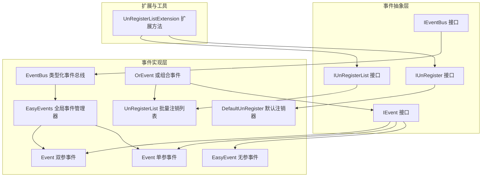
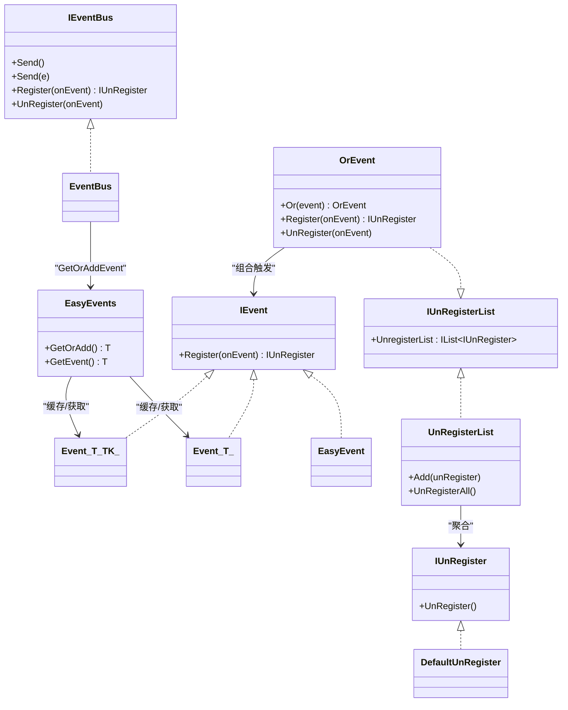
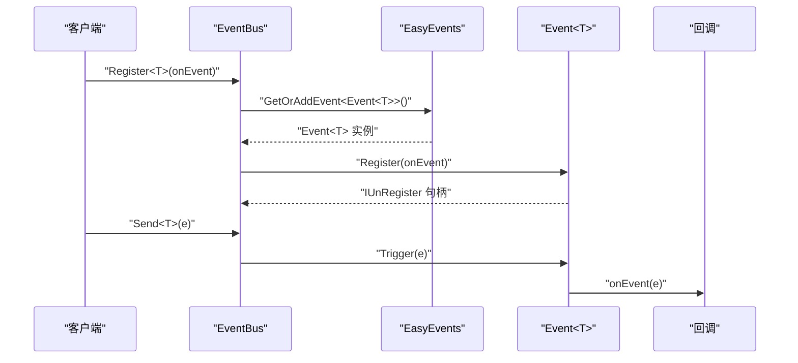
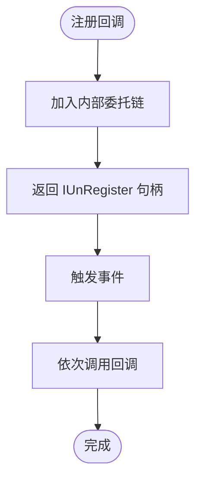
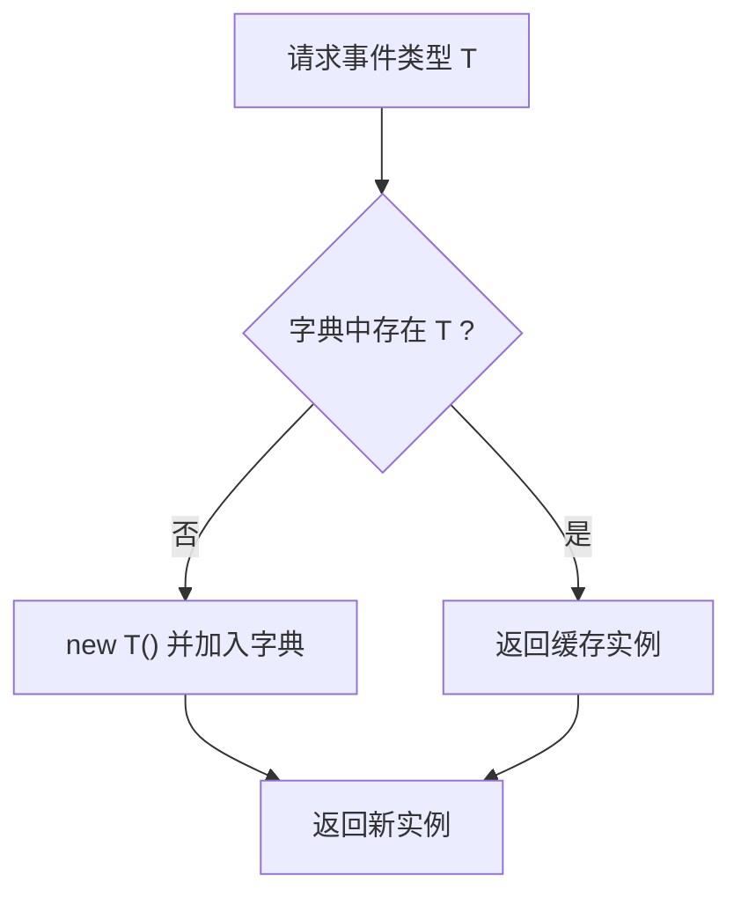
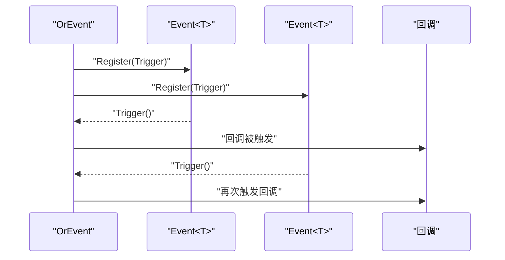
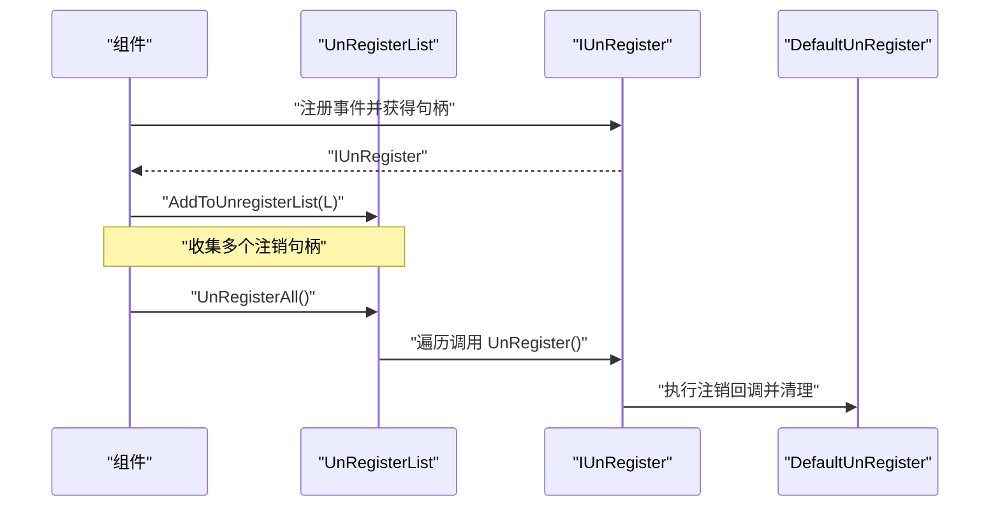
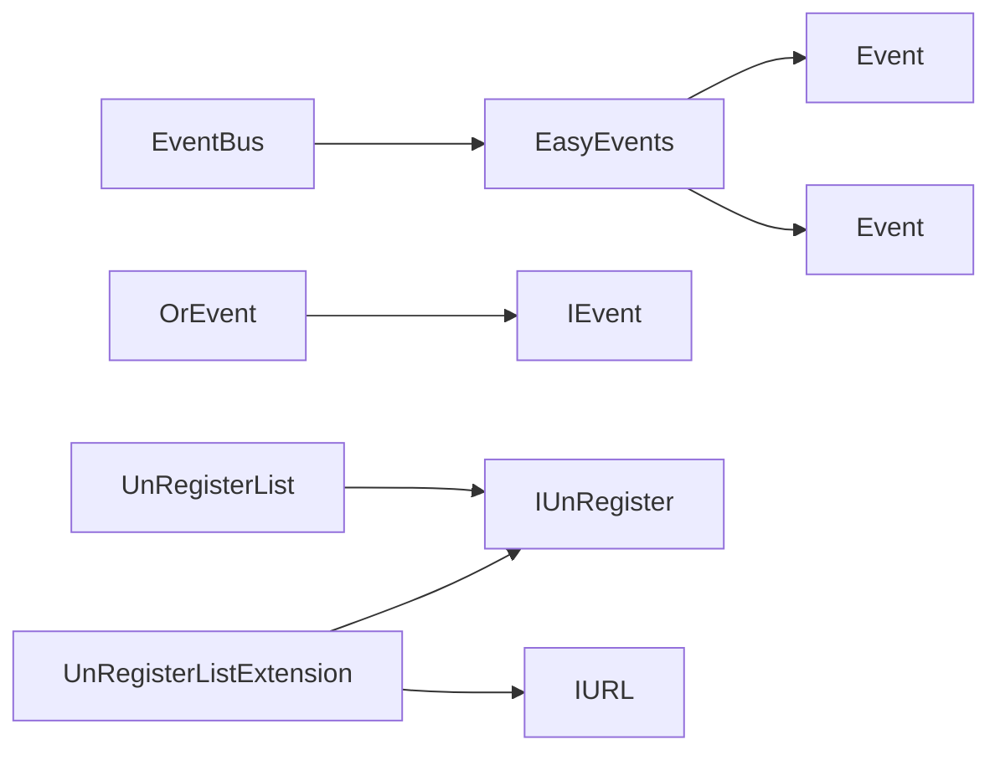

# 事件系统

<cite>
**本文引用的文件**
- [EventBus.cs](file://GFramework.Core/events/EventBus.cs)
- [EasyEvent.cs](file://GFramework.Core/events/EasyEvent.cs)
- [EasyEvents.cs](file://GFramework.Core/events/EasyEvents.cs)
- [EasyEventGeneric.cs](file://GFramework.Core/events/EasyEventGeneric.cs)
- [OrEvent.cs](file://GFramework.Core/events/OrEvent.cs)
- [UnRegisterList.cs](file://GFramework.Core/events/UnRegisterList.cs)
- [DefaultUnRegister.cs](file://GFramework.Core/events/DefaultUnRegister.cs)
- [IEvent.cs](file://GFramework.Core.Abstractions/events/IEvent.cs)
- [IEventBus.cs](file://GFramework.Core.Abstractions/events/IEventBus.cs)
- [IUnRegister.cs](file://GFramework.Core.Abstractions/events/IUnRegister.cs)
- [IUnRegisterList.cs](file://GFramework.Core.Abstractions/events/IUnRegisterList.cs)
- [UnRegisterListExtension.cs](file://GFramework.Core/extensions/UnRegisterListExtension.cs)
- [README.md](file://GFramework.Core/events/README.md)
- [EventBusTests.cs](file://GFramework.Core.Tests/events/EventBusTests.cs)
- [EasyEventsTests.cs](file://GFramework.Core.Tests/events/EasyEventsTests.cs)
- [OrEventTests.cs](file://GFramework.Core.Tests/events/OrEventTests.cs)
- [UnRegisterTests.cs](file://GFramework.Core.Tests/events/UnRegisterTests.cs)
</cite>

## 目录
1. [简介](#简介)
2. [项目结构](#项目结构)
3. [核心组件](#核心组件)
4. [架构总览](#架构总览)
5. [详细组件分析](#详细组件分析)
6. [依赖分析](#依赖分析)
7. [性能考量](#性能考量)
8. [故障排除指南](#故障排除指南)
9. [结论](#结论)
10. [附录](#附录)

## 简介
本文件系统性地解析 GFramework 事件系统，涵盖 EventBus 的类型化事件发布订阅机制、EasyEvent/EasyEvents 的事件定义与注册/触发/注销流程、OrEvent 的组合事件与传播策略、UnRegisterList 的自动注销与内存防护、以及性能优化与最佳实践。文档面向不同技术背景读者，既提供高层概览也给出代码级图示与来源标注。

## 项目结构
事件系统位于 GFramework.Core 的 events 目录，配合抽象接口层与扩展方法，形成“接口定义 + 具体实现 + 工具扩展”的分层结构；测试用例覆盖核心行为验证。

图表来源
- [IEvent.cs](file://GFramework.Core.Abstractions/events/IEvent.cs#L8-L16)
- [IEventBus.cs](file://GFramework.Core.Abstractions/events/IEventBus.cs#L8-L37)
- [IUnRegister.cs](file://GFramework.Core.Abstractions/events/IUnRegister.cs)
- [IUnRegisterList.cs](file://GFramework.Core.Abstractions/events/IUnRegisterList.cs)
- [EasyEvent.cs](file://GFramework.Core/events/EasyEvent.cs#L8-L39)
- [EasyEventGeneric.cs](file://GFramework.Core/events/EasyEventGeneric.cs#L10-L62)
- [EasyEvents.cs](file://GFramework.Core/events/EasyEvents.cs#L9-L85)
- [EventBus.cs](file://GFramework.Core/events/EventBus.cs#L8-L55)
- [OrEvent.cs](file://GFramework.Core/events/OrEvent.cs#L9-L57)
- [DefaultUnRegister.cs](file://GFramework.Core/events/DefaultUnRegister.cs#L9-L22)
- [UnRegisterList.cs](file://GFramework.Core/events/UnRegisterList.cs#L8-L37)
- [UnRegisterListExtension.cs](file://GFramework.Core/extensions/UnRegisterListExtension.cs#L8-L32)

章节来源
- [README.md](file://GFramework.Core/events/README.md#L1-L523)

## 核心组件
- IEvent/IEventBus/IUnRegister/IUnRegisterList：定义事件注册、发送、注销与批量管理的契约。
- EasyEvent/EasyEventGeneric：无参与单/双参事件的具体实现，支持注册、注销、触发。
- EasyEvents：全局事件管理器，按类型缓存事件实例，提供静态访问与懒加载。
- EventBus：类型化事件总线，封装 Send/Register/UnRegister 的统一入口。
- OrEvent：组合事件，支持“任一触发即触发”的或逻辑组合。
- UnRegisterList/DefaultUnRegister：注销对象与批量注销列表，保障资源回收与内存安全。
- UnRegisterListExtension：扩展方法，简化注册对象加入注销列表与批量注销。

章节来源
- [IEvent.cs](file://GFramework.Core.Abstractions/events/IEvent.cs#L8-L16)
- [IEventBus.cs](file://GFramework.Core.Abstractions/events/IEventBus.cs#L8-L37)
- [IUnRegister.cs](file://GFramework.Core.Abstractions/events/IUnRegister.cs)
- [IUnRegisterList.cs](file://GFramework.Core.Abstractions/events/IUnRegisterList.cs)
- [EasyEvent.cs](file://GFramework.Core/events/EasyEvent.cs#L8-L39)
- [EasyEventGeneric.cs](file://GFramework.Core/events/EasyEventGeneric.cs#L10-L62)
- [EasyEvents.cs](file://GFramework.Core/events/EasyEvents.cs#L9-L85)
- [EventBus.cs](file://GFramework.Core/events/EventBus.cs#L8-L55)
- [OrEvent.cs](file://GFramework.Core/events/OrEvent.cs#L9-L57)
- [UnRegisterList.cs](file://GFramework.Core/events/UnRegisterList.cs#L8-L37)
- [DefaultUnRegister.cs](file://GFramework.Core/events/DefaultUnRegister.cs#L9-L22)
- [UnRegisterListExtension.cs](file://GFramework.Core/extensions/UnRegisterListExtension.cs#L8-L32)

## 架构总览
事件系统采用“接口 + 具体实现 + 扩展”的分层设计，EventBus 作为门面协调 EasyEvents 的事件实例与用户回调之间的注册/触发关系；OrEvent 提供组合能力；UnRegisterList/DefaultUnRegister 提供生命周期管理与内存防护。

图表来源
- [IEvent.cs](file://GFramework.Core.Abstractions/events/IEvent.cs#L8-L16)
- [IEventBus.cs](file://GFramework.Core.Abstractions/events/IEventBus.cs#L8-L37)
- [IUnRegister.cs](file://GFramework.Core.Abstractions/events/IUnRegister.cs)
- [IUnRegisterList.cs](file://GFramework.Core.Abstractions/events/IUnRegisterList.cs)
- [EasyEvent.cs](file://GFramework.Core/events/EasyEvent.cs#L8-L39)
- [EasyEventGeneric.cs](file://GFramework.Core/events/EasyEventGeneric.cs#L10-L62)
- [EasyEvents.cs](file://GFramework.Core/events/EasyEvents.cs#L9-L85)
- [EventBus.cs](file://GFramework.Core/events/EventBus.cs#L8-L55)
- [OrEvent.cs](file://GFramework.Core/events/OrEvent.cs#L9-L57)
- [DefaultUnRegister.cs](file://GFramework.Core/events/DefaultUnRegister.cs#L9-L22)
- [UnRegisterList.cs](file://GFramework.Core/events/UnRegisterList.cs#L8-L37)

## 详细组件分析

### EventBus：类型化事件总线
- 设计要点
  - 基于 EasyEvents 的类型缓存，按类型获取/创建事件实例。
  - Send<T>() 自动构造事件实例并触发；Send<T>(T e) 直接触发指定实例。
  - Register<T>/UnRegister<T> 将用户回调与具体事件绑定，返回可注销句柄。
- 关键流程
  - 注册：通过 EasyEvents.GetOrAddEvent<Event<T>>() 获取事件，再调用其 Register。
  - 发送：根据是否传入实例选择自动构造或直接触发。
  - 注销：定位事件实例并调用 UnRegister 移除回调。

图表来源
- [EventBus.cs](file://GFramework.Core/events/EventBus.cs#L16-L44)
- [EasyEvents.cs](file://GFramework.Core/events/EasyEvents.cs#L74-L84)
- [EasyEventGeneric.cs](file://GFramework.Core/events/EasyEventGeneric.cs#L39-L43)

章节来源
- [EventBus.cs](file://GFramework.Core/events/EventBus.cs#L8-L55)
- [EventBusTests.cs](file://GFramework.Core.Tests/events/EventBusTests.cs#L27-L77)

### EasyEvent 与 Event<T>/Event<T,TK>：事件定义与触发
- EasyEvent：无参事件，支持注册/注销/触发，内部以空操作委托避免空检查。
- Event<T>/Event<T,TK>：泛型事件，支持单/双参数触发，同时显式实现 IEvent.Register(Action)，允许无参订阅。
- 注册/注销：均返回 IUnRegister，确保可随时注销；触发时调用内部委托链。

图表来源
- [EasyEvent.cs](file://GFramework.Core/events/EasyEvent.cs#L17-L38)
- [EasyEventGeneric.cs](file://GFramework.Core/events/EasyEventGeneric.cs#L39-L61)

章节来源
- [EasyEvent.cs](file://GFramework.Core/events/EasyEvent.cs#L8-L39)
- [EasyEventGeneric.cs](file://GFramework.Core/events/EasyEventGeneric.cs#L10-L62)
- [EasyEventsTests.cs](file://GFramework.Core.Tests/events/EasyEventsTests.cs#L27-L61)

### EasyEvents：全局事件管理器
- 功能：全局单例缓存事件类型与其实例映射；提供静态/实例方法获取/注册/添加事件。
- 行为：GetOrAddEvent<T>() 若不存在则自动构造并加入字典；GetEvent<T>() 返回默认值（若不存在）。
- 用途：为 EventBus 提供事件实例的集中管理与复用。

图表来源
- [EasyEvents.cs](file://GFramework.Core/events/EasyEvents.cs#L74-L84)

章节来源
- [EasyEvents.cs](file://GFramework.Core/events/EasyEvents.cs#L9-L85)

### OrEvent：组合事件与传播策略
- 设计：将多个 IEvent 通过 Or 进行“或”组合，任意子事件触发即触发 OrEvent。
- 传播：内部维护回调链，子事件触发时调用私有 Trigger()，进而触发所有注册到 OrEvent 的回调。
- 注销：支持普通注销；注销回调时会触发 UnRegisterAll，清理组合内的子事件注册。

图表来源
- [OrEvent.cs](file://GFramework.Core/events/OrEvent.cs#L23-L56)
- [OrEventTests.cs](file://GFramework.Core.Tests/events/OrEventTests.cs#L17-L32)

章节来源
- [OrEvent.cs](file://GFramework.Core/events/OrEvent.cs#L9-L57)
- [OrEventTests.cs](file://GFramework.Core.Tests/events/OrEventTests.cs#L10-L104)

### UnRegisterList 与 DefaultUnRegister：自动注销与内存防护
- DefaultUnRegister：封装注销回调，执行后清理引用，避免重复执行。
- UnRegisterList：聚合多个 IUnRegister，提供 UnRegisterAll 一键注销并清空列表。
- 扩展方法：AddToUnregisterList/UnRegisterAll 简化注册与批量注销流程。

图表来源
- [UnRegisterList.cs](file://GFramework.Core/events/UnRegisterList.cs#L21-L36)
- [DefaultUnRegister.cs](file://GFramework.Core/events/DefaultUnRegister.cs#L16-L21)
- [UnRegisterListExtension.cs](file://GFramework.Core/extensions/UnRegisterListExtension.cs#L15-L31)

章节来源
- [UnRegisterList.cs](file://GFramework.Core/events/UnRegisterList.cs#L8-L37)
- [DefaultUnRegister.cs](file://GFramework.Core/events/DefaultUnRegister.cs#L9-L22)
- [UnRegisterListExtension.cs](file://GFramework.Core/extensions/UnRegisterListExtension.cs#L8-L32)
- [UnRegisterTests.cs](file://GFramework.Core.Tests/events/UnRegisterTests.cs#L17-L51)

## 依赖分析
- 组件内聚与耦合
  - EventBus 与 EasyEvents 高度耦合：前者依赖后者进行事件实例缓存与获取。
  - EasyEvent/EasyEventGeneric 与 IEvent 解耦，通过接口约束统一注册/触发行为。
  - OrEvent 与 IEvent/IUnRegisterList 解耦，通过组合与扩展方法实现功能。
  - UnRegisterList 与 IUnRegister 解耦，通过聚合实现批量管理。
- 外部依赖
  - 无外部第三方库依赖，纯 .NET 抽象与标准集合。
- 循环依赖
  - 未发现循环依赖；EventBus 依赖 EasyEvents，EasyEvents 依赖事件类型，但不反向依赖。

图表来源
- [EventBus.cs](file://GFramework.Core/events/EventBus.cs#L10-L10)
- [EasyEvents.cs](file://GFramework.Core/events/EasyEvents.cs#L19-L19)
- [EasyEventGeneric.cs](file://GFramework.Core/events/EasyEventGeneric.cs#L16-L16)
- [OrEvent.cs](file://GFramework.Core/events/OrEvent.cs#L16-L16)
- [UnRegisterList.cs](file://GFramework.Core/events/UnRegisterList.cs#L10-L10)
- [UnRegisterListExtension.cs](file://GFramework.Core/extensions/UnRegisterListExtension.cs#L15-L18)

章节来源
- [EventBus.cs](file://GFramework.Core/events/EventBus.cs#L8-L55)
- [EasyEvents.cs](file://GFramework.Core/events/EasyEvents.cs#L9-L85)
- [OrEvent.cs](file://GFramework.Core/events/OrEvent.cs#L9-L57)
- [UnRegisterList.cs](file://GFramework.Core/events/UnRegisterList.cs#L8-L37)
- [UnRegisterListExtension.cs](file://GFramework.Core/extensions/UnRegisterListExtension.cs#L8-L32)

## 性能考量
- 事件缓存与懒加载
  - EasyEvents 使用字典缓存事件实例，避免重复构造，降低 GC 压力。
- 委托链与空操作
  - 内部默认使用空操作委托，减少 null 检查与分支开销。
- 结构体事件
  - README 建议使用 struct 事件以减少堆分配，提升吞吐。
- 触发频率控制
  - 避免高频事件（如每帧触发），建议使用批处理或节流策略。
- 回调轻量化
  - 事件处理器应保持轻量，避免长耗时逻辑阻塞主线程。

章节来源
- [EasyEvents.cs](file://GFramework.Core/events/EasyEvents.cs#L19-L19)
- [EasyEvent.cs](file://GFramework.Core/events/EasyEvent.cs#L10-L10)
- [EasyEventGeneric.cs](file://GFramework.Core/events/EasyEventGeneric.cs#L16-L16)
- [README.md](file://GFramework.Core/events/README.md#L502-L506)

## 故障排除指南
- 注册后未触发
  - 检查事件类型是否一致；确认 Send<T>() 是否传入了正确的事件实例。
  - 参考测试用例验证注册/触发流程。
- 注销无效
  - 确认使用的是同一回调引用；注销需与注册时的委托引用一致。
  - 使用 UnRegisterList 统一管理，避免遗漏。
- OrEvent 未按预期触发
  - 确认已通过 Or() 将子事件加入组合；检查子事件是否已注册回调。
- 内存泄漏风险
  - 确保在组件生命周期结束时调用 UnRegisterAll；避免持有事件实例的强引用导致无法释放。
- 回调重复执行
  - DefaultUnRegister 在执行后会清理回调引用，避免重复执行；若仍出现，请检查是否重复注册。

章节来源
- [EventBusTests.cs](file://GFramework.Core.Tests/events/EventBusTests.cs#L27-L77)
- [OrEventTests.cs](file://GFramework.Core.Tests/events/OrEventTests.cs#L17-L103)
- [UnRegisterTests.cs](file://GFramework.Core.Tests/events/UnRegisterTests.cs#L17-L51)
- [UnRegisterList.cs](file://GFramework.Core/events/UnRegisterList.cs#L29-L36)
- [DefaultUnRegister.cs](file://GFramework.Core/events/DefaultUnRegister.cs#L16-L21)

## 结论
GFramework 事件系统通过清晰的接口与分层实现，提供了类型安全、易于组合、可批量管理的事件机制。EventBus/EasyEvents 提供统一入口与缓存；EasyEvent/EasyEventGeneric 支持多参数场景；OrEvent 实现灵活的组合传播；UnRegisterList/DefaultUnRegister 强化生命周期管理与内存安全。结合性能建议与最佳实践，可在复杂游戏架构中构建松耦合、高可维护的组件通信体系。

## 附录

### API 参考（摘要）
- IEvent
  - Register(Action onEvent) IUnRegister
- IEventBus
  - Send<T>()（自动构造）
  - Send<T>(T e)
  - Register<T>(Action<T> onEvent) IUnRegister
  - UnRegister<T>(Action<T> onEvent)
- IUnRegister
  - UnRegister()
- IUnRegisterList
  - UnregisterList : IList<IUnRegister>
- EasyEvent
  - Register(Action) IUnRegister
  - UnRegister(Action)
  - Trigger()
- Event<T>/Event<T,TK>
  - Register(Action<T>) / Register(Action<T,TK>) IUnRegister
  - UnRegister(Action<T>) / UnRegister(Action<T,TK>)
  - Trigger(T) / Trigger(T,TK)
- EasyEvents
  - GetOrAdd<T>() T
  - GetEvent<T>() T
- OrEvent
  - Or(IEvent) OrEvent
  - Register(Action) IUnRegister
  - UnRegister(Action)
- UnRegisterList
  - Add(IUnRegister)
  - UnRegisterAll()
- DefaultUnRegister
  - UnRegister()

章节来源
- [IEvent.cs](file://GFramework.Core.Abstractions/events/IEvent.cs#L8-L16)
- [IEventBus.cs](file://GFramework.Core.Abstractions/events/IEventBus.cs#L8-L37)
- [IUnRegister.cs](file://GFramework.Core.Abstractions/events/IUnRegister.cs)
- [IUnRegisterList.cs](file://GFramework.Core.Abstractions/events/IUnRegisterList.cs)
- [EasyEvent.cs](file://GFramework.Core/events/EasyEvent.cs#L17-L38)
- [EasyEventGeneric.cs](file://GFramework.Core/events/EasyEventGeneric.cs#L39-L61)
- [EasyEvents.cs](file://GFramework.Core/events/EasyEvents.cs#L74-L84)
- [OrEvent.cs](file://GFramework.Core/events/OrEvent.cs#L23-L56)
- [UnRegisterList.cs](file://GFramework.Core/events/UnRegisterList.cs#L21-L36)
- [DefaultUnRegister.cs](file://GFramework.Core/events/DefaultUnRegister.cs#L16-L21)

### 使用示例（路径指引）
- 无参事件
  - [EasyEvent 使用示例](file://GFramework.Core/events/README.md#L58-L75)
- 单/双参事件
  - [Event<T> 使用示例](file://GFramework.Core/events/README.md#L81-L95)
  - [Event<T,TK> 使用示例](file://GFramework.Core/events/README.md#L101-L113)
- 全局事件管理
  - [EasyEvents 使用示例](file://GFramework.Core/events/README.md#L119-L136)
- 事件总线
  - [EventBus 使用示例](file://GFramework.Core/events/README.md#L142-L162)
- 组合事件
  - [OrEvent 使用示例](file://GFramework.Core/events/README.md#L182-L195)
- 批量注销
  - [UnRegisterList 使用示例](file://GFramework.Core/events/README.md#L201-L211)
- 架构集成与控制器注册
  - [架构中使用事件（模型/系统/控制器）](file://GFramework.Core/events/README.md#L249-L341)

### 最佳实践（摘要）
- 事件命名与数据设计：使用过去式 + Event 后缀；事件结构体化；最小化数据。
- 避免事件循环：谨慎在处理器中发送新事件；必要时使用命令。
- 合理使用事件：通知状态变化与跨模块通信；查询使用 Query。
- 注销管理：始终注销；使用 IUnRegisterList；利用节点生命周期。
- 性能优化：避免高频事件；处理器轻量化；使用结构体事件减少 GC。

章节来源
- [README.md](file://GFramework.Core/events/README.md#L476-L523)