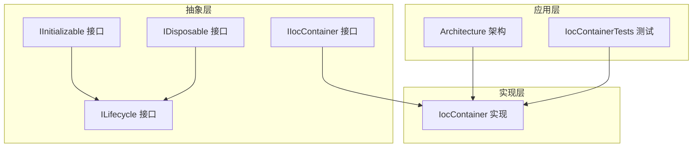
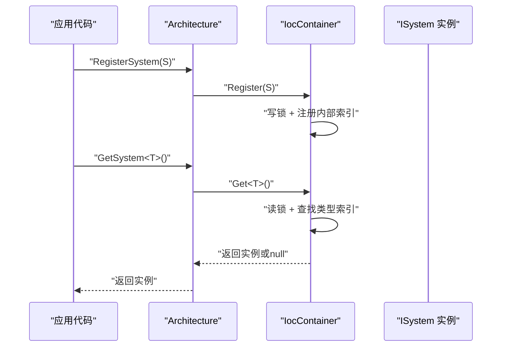
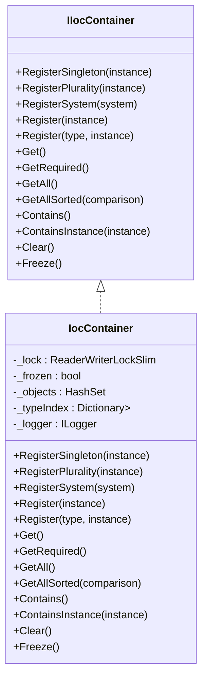
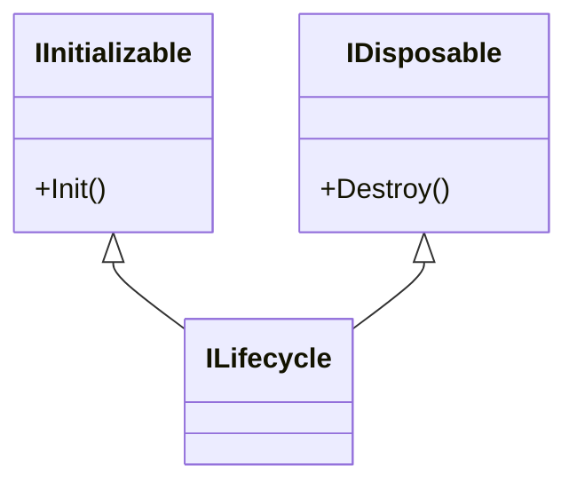
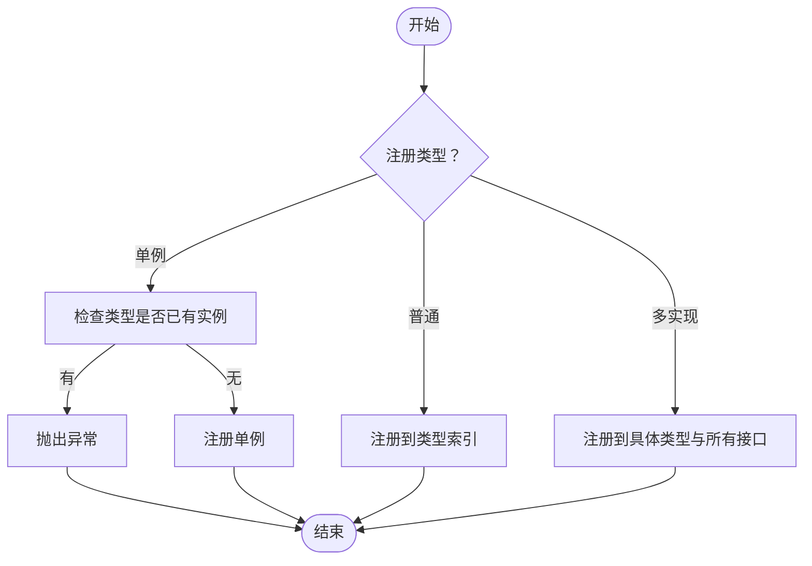
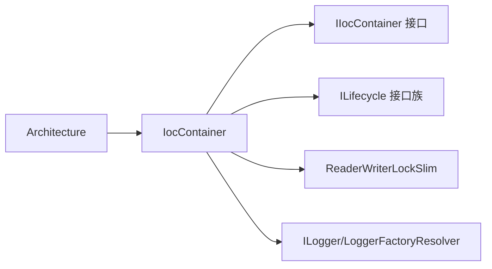

# 依赖注入系统

<cite>
**本文档引用的文件**
- [IocContainer.cs](file://GFramework.Core/ioc/IocContainer.cs)
- [IIocContainer.cs](file://GFramework.Core.Abstractions/ioc/IIocContainer.cs)
- [README.md（IoC包）](file://GFramework.Core/ioc/README.md)
- [IInitializable.cs](file://GFramework.Core.Abstractions/lifecycle/IInitializable.cs)
- [IDisposable.cs](file://GFramework.Core.Abstractions/lifecycle/IDisposable.cs)
- [ILifecycle.cs](file://GFramework.Core.Abstractions/lifecycle/ILifecycle.cs)
- [Architecture.cs](file://GFramework.Core/architecture/Architecture.cs)
- [IocContainerTests.cs](file://GFramework.Core.Tests/ioc/IocContainerTests.cs)
</cite>

## 目录
1. [简介](#简介)
2. [项目结构](#项目结构)
3. [核心组件](#核心组件)
4. [架构总览](#架构总览)
5. [详细组件分析](#详细组件分析)
6. [依赖分析](#依赖分析)
7. [性能考虑](#性能考虑)
8. [故障排除指南](#故障排除指南)
9. [结论](#结论)
10. [附录](#附录)

## 简介
本文件面向GFramework的依赖注入系统，聚焦于IocContainer的实现与设计模式，系统阐述容器的注册与解析流程、生命周期管理机制（IInitializable、IDisposable）、类型安全与编译时检查、容器冻结与线程安全、最佳实践与故障排除，并给出可测试与可维护的架构建议。

## 项目结构
IoC相关代码位于以下位置：
- 核心实现：GFramework.Core/ioc/IocContainer.cs
- 接口定义：GFramework.Core.Abstractions/ioc/IIocContainer.cs
- 生命周期接口：GFramework.Core.Abstractions/lifecycle/IInitializable.cs、IDisposable.cs、ILifecycle.cs
- 使用说明与示例：GFramework.Core/ioc/README.md
- 架构集成：GFramework.Core/architecture/Architecture.cs
- 单元测试：GFramework.Core.Tests/ioc/IocContainerTests.cs

图表来源
- [IIocContainer.cs](file://GFramework.Core.Abstractions/ioc/IIocContainer.cs#L1-L116)
- [IocContainer.cs](file://GFramework.Core/ioc/IocContainer.cs#L1-L373)
- [IInitializable.cs](file://GFramework.Core.Abstractions/lifecycle/IInitializable.cs#L1-L12)
- [IDisposable.cs](file://GFramework.Core.Abstractions/lifecycle/IDisposable.cs#L1-L12)
- [ILifecycle.cs](file://GFramework.Core.Abstractions/lifecycle/ILifecycle.cs#L1-L6)
- [Architecture.cs](file://GFramework.Core/architecture/Architecture.cs#L1-L200)
- [IocContainerTests.cs](file://GFramework.Core.Tests/ioc/IocContainerTests.cs#L1-L200)

章节来源
- [IocContainer.cs](file://GFramework.Core/ioc/IocContainer.cs#L1-L373)
- [IIocContainer.cs](file://GFramework.Core.Abstractions/ioc/IIocContainer.cs#L1-L116)
- [README.md（IoC包）](file://GFramework.Core/ioc/README.md#L1-L681)

## 核心组件
- IIocContainer：定义注册、解析、查询与容器管理的契约，涵盖单例、多实现、系统实例注册，以及Get/GetAll/GetRequired等解析方法。
- IocContainer：IIocContainer的具体实现，提供基于字典+集合的索引结构、读写锁的线程安全、容器冻结保护、日志记录与错误处理。
- 生命周期接口：IInitializable、IDisposable、ILifecycle，为组件提供初始化与销毁的标准能力，便于与容器生命周期协同。

章节来源
- [IIocContainer.cs](file://GFramework.Core.Abstractions/ioc/IIocContainer.cs#L1-L116)
- [IocContainer.cs](file://GFramework.Core/ioc/IocContainer.cs#L1-L373)
- [IInitializable.cs](file://GFramework.Core.Abstractions/lifecycle/IInitializable.cs#L1-L12)
- [IDisposable.cs](file://GFramework.Core.Abstractions/lifecycle/IDisposable.cs#L1-L12)
- [ILifecycle.cs](file://GFramework.Core.Abstractions/lifecycle/ILifecycle.cs#L1-L6)

## 架构总览
IocContainer作为架构（Architecture）的核心组件之一，贯穿System/Model/Utility的注册与获取。容器采用“手动注册、类型安全、线程安全、容器冻结”的设计，避免自动解析带来的复杂度，强调可控的生命周期与清晰的依赖关系。

图表来源
- [Architecture.cs](file://GFramework.Core/architecture/Architecture.cs#L150-L175)
- [IocContainer.cs](file://GFramework.Core/ioc/IocContainer.cs#L166-L199)
- [IocContainer.cs](file://GFramework.Core/ioc/IocContainer.cs#L211-L230)

## 详细组件分析

### IocContainer 实现与设计模式
- 设计模式：控制反转（IoC）与简单工厂结合，通过接口隔离与具体实现解耦。
- 数据结构：
  - _objects：HashSet<object>，用于去重与快速判断实例是否存在。
  - _typeIndex：Dictionary<Type, HashSet<object>>，按类型索引实例集合，支持多实现。
- 并发控制：ReaderWriterLockSlim，读多写少场景下提升并发性能。
- 冻结机制：_frozen标志位，防止初始化后继续修改容器内容。
- 日志与错误：统一通过ILogger记录Debug/Info/Error，异常类型为InvalidOperationException。

图表来源
- [IIocContainer.cs](file://GFramework.Core.Abstractions/ioc/IIocContainer.cs#L1-L116)
- [IocContainer.cs](file://GFramework.Core/ioc/IocContainer.cs#L1-L373)

章节来源
- [IocContainer.cs](file://GFramework.Core/ioc/IocContainer.cs#L12-L373)
- [IIocContainer.cs](file://GFramework.Core.Abstractions/ioc/IIocContainer.cs#L11-L116)

### 生命周期管理机制
- IInitializable：提供Init()，用于组件初始化。
- IDisposable：提供Destroy()，用于资源释放。
- ILifecycle：组合IInitializable与IDisposable，形成统一生命周期接口。
- 与容器的关系：容器本身不自动管理生命周期，但可通过注册实现ILifecycle的实例并在外部触发Init/Destroy，从而与容器管理的对象保持一致的生命周期节奏。

图表来源
- [IInitializable.cs](file://GFramework.Core.Abstractions/lifecycle/IInitializable.cs#L1-L12)
- [IDisposable.cs](file://GFramework.Core.Abstractions/lifecycle/IDisposable.cs#L1-L12)
- [ILifecycle.cs](file://GFramework.Core.Abstractions/lifecycle/ILifecycle.cs#L1-L6)

章节来源
- [IInitializable.cs](file://GFramework.Core.Abstractions/lifecycle/IInitializable.cs#L1-L12)
- [IDisposable.cs](file://GFramework.Core.Abstractions/lifecycle/IDisposable.cs#L1-L12)
- [ILifecycle.cs](file://GFramework.Core.Abstractions/lifecycle/ILifecycle.cs#L1-L6)

### 服务注册与解析流程
- 注册路径
  - Register<T>/Register(Type, object)：写入内部索引，支持多实现。
  - RegisterSingleton<T>：检查类型是否已有实例，避免重复单例。
  - RegisterPlurality：将实例同时注册到具体类型与其所有接口上。
  - RegisterSystem：系统实例的便捷注册。
- 解析路径
  - Get<T>()：返回首个实例或null。
  - GetAll<T>()：返回全部实例列表。
  - GetRequired<T>()：要求唯一实例，否则抛出异常。
  - GetAllSorted<T>：对实例进行排序后返回。
- 查询与工具
  - Contains<T>()：检查类型是否已注册。
  - ContainsInstance(object)：检查具体实例是否在容器中。
  - Clear()：清空容器。
  - Freeze()：冻结容器，禁止后续修改。

图表来源
- [IocContainer.cs](file://GFramework.Core/ioc/IocContainer.cs#L69-L98)
- [IocContainer.cs](file://GFramework.Core/ioc/IocContainer.cs#L166-L199)
- [IocContainer.cs](file://GFramework.Core/ioc/IocContainer.cs#L105-L123)

章节来源
- [IocContainer.cs](file://GFramework.Core/ioc/IocContainer.cs#L69-L199)
- [IocContainer.cs](file://GFramework.Core/ioc/IocContainer.cs#L211-L294)

### 类型安全与编译时检查
- 泛型约束：所有注册/解析均使用泛型，编译期类型检查，避免字符串键导致的错误。
- 接口契约：通过IIocContainer定义明确的API边界，IDE友好，支持智能提示与重构。

章节来源
- [IIocContainer.cs](file://GFramework.Core.Abstractions/ioc/IIocContainer.cs#L1-L116)
- [README.md（IoC包）](file://GFramework.Core/ioc/README.md#L518-L523)

### 容器冻结与线程安全
- 冻结机制：Freeze()后禁止任何注册操作，防止运行时修改容器内容。
- 线程安全：读写锁保护注册/解析过程，读多写少场景下提升吞吐。

章节来源
- [IocContainer.cs](file://GFramework.Core/ioc/IocContainer.cs#L357-L370)
- [IocContainer.cs](file://GFramework.Core/ioc/IocContainer.cs#L21-L21)
- [README.md（IoC包）](file://GFramework.Core/ioc/README.md#L524-L529)

### 与架构的集成
- Architecture持有IocContainer实例，封装RegisterSystem/GetSystem等常用方法，使注册与解析对上层透明。
- 通过RegisterSystem/Model/Utility等方法间接使用IocContainer，保证注册顺序与依赖关系可控。

章节来源
- [Architecture.cs](file://GFramework.Core/architecture/Architecture.cs#L154-L173)
- [README.md（IoC包）](file://GFramework.Core/ioc/README.md#L147-L215)

## 依赖分析
- 组件耦合
  - Architecture依赖IocContainer，实现注册与解析的高层封装。
  - IocContainer依赖生命周期接口（IInitializable/IDisposable/ILifecycle），但不强制执行，仅作为类型约定。
- 外部依赖
  - System.Threading.ReaderWriterLockSlim：提供高性能读写锁。
  - ILogger/LoggerFactoryResolver：提供日志能力，便于调试与诊断。

图表来源
- [Architecture.cs](file://GFramework.Core/architecture/Architecture.cs#L154-L173)
- [IocContainer.cs](file://GFramework.Core/ioc/IocContainer.cs#L1-L373)
- [IIocContainer.cs](file://GFramework.Core.Abstractions/ioc/IIocContainer.cs#L1-L116)
- [ILifecycle.cs](file://GFramework.Core.Abstractions/lifecycle/ILifecycle.cs#L1-L6)

章节来源
- [Architecture.cs](file://GFramework.Core/architecture/Architecture.cs#L154-L173)
- [IocContainer.cs](file://GFramework.Core/ioc/IocContainer.cs#L1-L373)

## 性能考虑
- 结构选择：字典+集合的索引结构，平均O(1)的插入与查找，GetAll返回快照列表，避免并发修改导致的异常。
- 并发模型：读写锁在读多写少场景下显著提升性能；写锁粒度小，仅在注册阶段持有。
- 冻结策略：初始化完成后冻结容器，避免运行时注册带来的额外开销与不确定性。
- 建议
  - 将高频解析的类型尽量注册为具体类型而非接口，减少接口查找成本。
  - 控制注册数量与层级，避免过度注册导致索引膨胀。
  - 使用GetRequired在关键路径上确保唯一性，减少分支判断。

[本节为通用性能指导，不直接分析具体文件]

## 故障排除指南
- “容器已冻结”异常
  - 触发条件：在调用Freeze()之后再次尝试注册。
  - 处理建议：将所有注册集中在初始化阶段完成，初始化结束后调用Freeze()。
- “重复单例注册”异常
  - 触发条件：对同一类型多次调用RegisterSingleton<T>()。
  - 处理建议：确认单例注册逻辑，避免重复注册；或改用Register<T>()注册多实现。
- “未找到实例”或“返回null”
  - 触发条件：Get<T>()未匹配到实例。
  - 处理建议：使用GetAll<T>()确认是否注册；或改用GetRequired<T>()在开发期暴露问题。
- “存在多个实例”异常
  - 触发条件：GetRequired<T>()匹配到多个实例。
  - 处理建议：改为GetAll<T>()获取列表，或调整注册策略确保唯一性。
- 线程安全相关问题
  - 触发条件：在多线程环境下同时进行注册与解析。
  - 处理建议：遵循容器自带的读写锁机制，不要在外部自行加锁；确保初始化阶段完成所有注册后再并发访问。

章节来源
- [IocContainer.cs](file://GFramework.Core/ioc/IocContainer.cs#L76-L98)
- [IocContainer.cs](file://GFramework.Core/ioc/IocContainer.cs#L240-L259)
- [IocContainerTests.cs](file://GFramework.Core.Tests/ioc/IocContainerTests.cs#L1-L200)

## 结论
GFramework的IocContainer以简单、类型安全、线程安全与容器冻结为核心特性，适合需要明确生命周期与可控依赖关系的架构。通过与Architecture的集成，开发者可以在初始化阶段集中管理组件注册，运行时通过类型安全的API进行解析，配合ILifecycle接口实现统一的初始化与销毁流程。建议在实际项目中遵循初始化阶段注册、接口优先、避免运行时频繁注册、合理使用冻结与日志等最佳实践，以获得稳定、可测试且可维护的系统。

[本节为总结性内容，不直接分析具体文件]

## 附录

### API参考（摘要）
- 注册
  - RegisterSingleton<T>(T instance)
  - RegisterPlurality(object instance)
  - RegisterSystem(ISystem system)
  - Register<T>(T instance)
  - Register(Type type, object instance)
- 解析
  - Get<T>()：返回首个实例或null
  - GetRequired<T>()：要求唯一实例，否则抛异常
  - GetAll<T>()：返回全部实例
  - GetAllSorted<T>(Comparison<T>)：返回排序后的实例
- 查询与工具
  - Contains<T>()：检查类型是否已注册
  - ContainsInstance(object)：检查具体实例是否在容器中
  - Clear()：清空容器
  - Freeze()：冻结容器，禁止后续修改

章节来源
- [IIocContainer.cs](file://GFramework.Core.Abstractions/ioc/IIocContainer.cs#L13-L116)
- [IocContainer.cs](file://GFramework.Core/ioc/IocContainer.cs#L69-L370)

### 配置示例与使用要点
- 在架构初始化阶段集中注册System/Model/Utility。
- 使用接口类型注册，便于替换实现。
- 初始化完成后调用Freeze()，防止运行时修改。
- 使用GetRequired<T>()在开发期暴露多实现或未注册问题。

章节来源
- [README.md（IoC包）](file://GFramework.Core/ioc/README.md#L577-L660)
- [Architecture.cs](file://GFramework.Core/architecture/Architecture.cs#L154-L173)