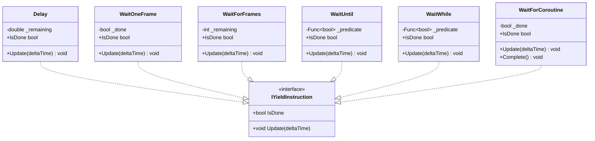

# 协程句柄与元数据

<cite>
**本文引用的文件**
- [CoroutineHandle.cs](file://GFramework.Core/coroutine/CoroutineHandle.cs)
- [CoroutineMetadata.cs](file://GFramework.Core/coroutine/CoroutineMetadata.cs)
- [CoroutineSlot.cs](file://GFramework.Core/coroutine/CoroutineSlot.cs)
- [CoroutineScheduler.cs](file://GFramework.Core/coroutine/CoroutineScheduler.cs)
- [CoroutineState.cs](file://GFramework.Core.Abstractions/coroutine/CoroutineState.cs)
- [IYieldInstruction.cs](file://GFramework.Core.Abstractions/coroutine/IYieldInstruction.cs)
- [CoroutineHelper.cs](file://GFramework.Core/coroutine/CoroutineHelper.cs)
- [Delay.cs](file://GFramework.Core/coroutine/Delay.cs)
- [WaitOneFrame.cs](file://GFramework.Core/coroutine/WaitOneFrame.cs)
- [WaitForFrames.cs](file://GFramework.Core/coroutine/WaitForFrames.cs)
- [WaitUntil.cs](file://GFramework.Core/coroutine/WaitUntil.cs)
- [WaitWhile.cs](file://GFramework.Core/coroutine/WaitWhile.cs)
- [WaitForCoroutine.cs](file://GFramework.Core/coroutine/WaitForCoroutine.cs)
- [CoroutineHandleTests.cs](file://GFramework.Core.Tests/coroutine/CoroutineHandleTests.cs)
- [CoroutineSchedulerTests.cs](file://GFramework.Core.Tests/coroutine/CoroutineSchedulerTests.cs)
</cite>

## 目录
1. [简介](#简介)
2. [项目结构](#项目结构)
3. [核心组件](#核心组件)
4. [架构总览](#架构总览)
5. [详细组件分析](#详细组件分析)
6. [依赖关系分析](#依赖关系分析)
7. [性能考量](#性能考量)
8. [故障排查指南](#故障排查指南)
9. [结论](#结论)
10. [附录](#附录)

## 简介
本文件围绕协程句柄与元数据管理系统进行深入技术解析，涵盖以下主题：
- 协程句柄的设计理念与唯一标识机制（实例ID、句柄有效性验证）
- 协程元数据的数据结构与状态跟踪（槽位索引、协程状态、标签信息）
- 协程槽位的内存结构与性能优化（枚举器存储、等待状态管理）
- 协程状态枚举的转换与条件判断
- 协程槽位的内存池化策略与容量扩展机制
- 协程标识符的生成算法与冲突避免
- 状态同步机制与并发安全性
- 高并发场景下的性能表现与优化建议

## 项目结构
该系统位于 GFramework.Core 的 coroutine 命名空间下，并通过抽象层 IYieldInstruction 和 CoroutineState 提供跨平台与可扩展的协程基础能力。


图表来源
- [CoroutineState.cs](file://GFramework.Core.Abstractions/coroutine/CoroutineState.cs#L1-L32)
- [IYieldInstruction.cs](file://GFramework.Core.Abstractions/coroutine/IYieldInstruction.cs#L1-L18)
- [CoroutineHandle.cs](file://GFramework.Core/coroutine/CoroutineHandle.cs#L1-L94)
- [CoroutineMetadata.cs](file://GFramework.Core/coroutine/CoroutineMetadata.cs#L1-L32)
- [CoroutineSlot.cs](file://GFramework.Core/coroutine/CoroutineSlot.cs#L1-L24)
- [CoroutineScheduler.cs](file://GFramework.Core/coroutine/CoroutineScheduler.cs#L1-L392)
- [CoroutineHelper.cs](file://GFramework.Core/coroutine/CoroutineHelper.cs#L1-L101)
- [Delay.cs](file://GFramework.Core/coroutine/Delay.cs#L1-L29)
- [WaitOneFrame.cs](file://GFramework.Core/coroutine/WaitOneFrame.cs#L1-L26)
- [WaitForFrames.cs](file://GFramework.Core/coroutine/WaitForFrames.cs#L1-L29)
- [WaitUntil.cs](file://GFramework.Core/coroutine/WaitUntil.cs#L1-L26)
- [WaitWhile.cs](file://GFramework.Core/coroutine/WaitWhile.cs#L1-L26)
- [WaitForCoroutine.cs](file://GFramework.Core/coroutine/WaitForCoroutine.cs#L1-L29)

章节来源
- [CoroutineHandle.cs](file://GFramework.Core/coroutine/CoroutineHandle.cs#L1-L94)
- [CoroutineMetadata.cs](file://GFramework.Core/coroutine/CoroutineMetadata.cs#L1-L32)
- [CoroutineSlot.cs](file://GFramework.Core/coroutine/CoroutineSlot.cs#L1-L24)
- [CoroutineScheduler.cs](file://GFramework.Core/coroutine/CoroutineScheduler.cs#L1-L392)
- [CoroutineState.cs](file://GFramework.Core.Abstractions/coroutine/CoroutineState.cs#L1-L32)
- [IYieldInstruction.cs](file://GFramework.Core.Abstractions/coroutine/IYieldInstruction.cs#L1-L18)
- [CoroutineHelper.cs](file://GFramework.Core/coroutine/CoroutineHelper.cs#L1-L101)
- [Delay.cs](file://GFramework.Core/coroutine/Delay.cs#L1-L29)
- [WaitOneFrame.cs](file://GFramework.Core/coroutine/WaitOneFrame.cs#L1-L26)
- [WaitForFrames.cs](file://GFramework.Core/coroutine/WaitForFrames.cs#L1-L29)
- [WaitUntil.cs](file://GFramework.Core/coroutine/WaitUntil.cs#L1-L26)
- [WaitWhile.cs](file://GFramework.Core/coroutine/WaitWhile.cs#L1-L26)
- [WaitForCoroutine.cs](file://GFramework.Core/coroutine/WaitForCoroutine.cs#L1-L29)

## 核心组件
- 协程句柄（CoroutineHandle）：轻量级结构体，负责唯一标识协程实例，支持有效性判断与相等性比较。
- 元数据（CoroutineMetadata）：记录协程在调度器中的槽位索引、当前状态与标签信息，并提供活跃状态判断。
- 槽位（CoroutineSlot）：承载单个协程的枚举器、当前状态与等待指令，是调度器内存池的基本单元。
- 调度器（CoroutineScheduler）：管理协程生命周期、状态更新、暂停/恢复/终止、等待机制、标签管理与容量扩展。
- 状态枚举（CoroutineState）：定义协程的执行状态集合。
- 等待指令（IYieldInstruction 及其实现）：封装等待条件与时间控制，驱动协程暂停与恢复。

章节来源
- [CoroutineHandle.cs](file://GFramework.Core/coroutine/CoroutineHandle.cs#L7-L94)
- [CoroutineMetadata.cs](file://GFramework.Core/coroutine/CoroutineMetadata.cs#L8-L32)
- [CoroutineSlot.cs](file://GFramework.Core/coroutine/CoroutineSlot.cs#L8-L24)
- [CoroutineScheduler.cs](file://GFramework.Core/coroutine/CoroutineScheduler.cs#L11-L392)
- [CoroutineState.cs](file://GFramework.Core.Abstractions/coroutine/CoroutineState.cs#L6-L32)
- [IYieldInstruction.cs](file://GFramework.Core.Abstractions/coroutine/IYieldInstruction.cs#L6-L18)

## 架构总览
调度器采用“槽位数组 + 字典映射”的内存池化设计，通过句柄与元数据建立索引，实现 O(1) 级别的状态查询与更新；等待机制通过字典维护“被等待者 → 等待者集合”，在被等待者完成后批量唤醒。


图表来源
- [CoroutineHandle.cs](file://GFramework.Core/coroutine/CoroutineHandle.cs#L7-L94)
- [CoroutineMetadata.cs](file://GFramework.Core/coroutine/CoroutineMetadata.cs#L8-L32)
- [CoroutineSlot.cs](file://GFramework.Core/coroutine/CoroutineSlot.cs#L8-L24)
- [CoroutineScheduler.cs](file://GFramework.Core/coroutine/CoroutineScheduler.cs#L11-L392)
- [CoroutineState.cs](file://GFramework.Core.Abstractions/coroutine/CoroutineState.cs#L6-L32)
- [IYieldInstruction.cs](file://GFramework.Core.Abstractions/coroutine/IYieldInstruction.cs#L6-L18)

## 详细组件分析

### 协程句柄（CoroutineHandle）
- 设计理念
  - 使用只读结构体，确保不可变性与高性能。
  - 通过“实例ID + 递增步长”生成唯一内部ID，Key 为低4位，用于区分同一实例内的不同槽位。
- 唯一标识与冲突避免
  - NextIndex[instanceId] 按 ReservedSpace+1 步长递增，保证同一实例内句柄Key不冲突。
  - Key=0 视为无效句柄，default(CoroutineHandle) 无效。
- 有效性验证
  - IsValid 基于 Key 是否为 0。
  - 相等性比较基于内部ID，操作符重载与 GetHasCode 保持一致性。


图表来源
- [CoroutineHandle.cs](file://GFramework.Core/coroutine/CoroutineHandle.cs#L29-L57)

章节来源
- [CoroutineHandle.cs](file://GFramework.Core/coroutine/CoroutineHandle.cs#L7-L94)
- [CoroutineHandleTests.cs](file://GFramework.Core.Tests/coroutine/CoroutineHandleTests.cs#L16-L228)

### 协程元数据（CoroutineMetadata）
- 数据结构
  - SlotIndex：协程在调度器槽位数组中的索引。
  - State：当前执行状态（运行/暂停/持有/完成/取消）。
  - Tag：协程标签，便于按标签管理与查找。
  - IsActive：活跃状态判断（运行/暂停/持有）。
- 作用
  - 作为调度器字典的值，提供从句柄到槽位与状态的快速映射。

章节来源
- [CoroutineMetadata.cs](file://GFramework.Core/coroutine/CoroutineMetadata.cs#L8-L32)

### 协程槽位（CoroutineSlot）
- 数据结构
  - Enumerator：协程枚举器，承载协程执行逻辑。
  - State：当前状态。
  - Waiting：当前等待指令，控制暂停与恢复。
- 性能优化
  - 使用非空槽位数组，避免频繁分配与GC。
  - 通过预热（Prewarm）在首次运行时推进一步，减少首帧延迟。

章节来源
- [CoroutineSlot.cs](file://GFramework.Core/coroutine/CoroutineSlot.cs#L8-L24)
- [CoroutineScheduler.cs](file://GFramework.Core/coroutine/CoroutineScheduler.cs#L264-L285)

### 协程调度器（CoroutineScheduler）
- 生命周期管理
  - Run：创建句柄、分配槽位、初始化元数据、预热、注册标签。
  - Update：遍历槽位，处理等待指令、推进枚举器、异常捕获与清理。
  - Pause/Resume/Kill：修改槽位与元数据状态，维护活跃计数。
- 等待机制
  - WaitForCoroutine：将当前协程置为 Held，登记“被等待者 → 等待者集合”，被等待者完成后批量唤醒。
- 标签管理
  - AddTag/RemoveTag：按标签维护句柄集合，支持 KillByTag。
- 容量扩展
  - Expand：按2倍扩容槽位数组，保证摊销成本合理。
- 并发与同步
  - Update 中对每个槽位独立处理，避免跨协程竞争。
  - 元数据与槽位通过句柄与索引关联，读写路径清晰。

```mermaid
sequenceDiagram
participant S as "调度器"
participant T as "时间源"
participant SL as "槽位"
participant Y as "等待指令"
S->>T : Update()
T-->>S : DeltaTime
loop 遍历槽位
S->>SL : 读取状态
alt 状态为运行
S->>SL : 若存在等待指令
S->>Y : Update(DeltaTime)
alt 未完成
S-->>S : 跳过本轮
else 已完成
S->>SL : 清空Waiting
end
end
S->>SL : Enumerator.MoveNext()
alt 成功
S->>SL : 设置Waiting = Current
else 失败
S->>S : Complete(SlotIndex)
end
else 非运行
S-->>S : 跳过
end
end
```

图表来源
- [CoroutineScheduler.cs](file://GFramework.Core/coroutine/CoroutineScheduler.cs#L82-L121)

章节来源
- [CoroutineScheduler.cs](file://GFramework.Core/coroutine/CoroutineScheduler.cs#L11-L392)

### 协程状态枚举（CoroutineState）
- 状态定义
  - Running：运行中
  - Paused：已暂停
  - Held：被锁定或等待其他协程
  - Completed：已完成
  - Cancelled：已取消
- 条件判断
  - IsActive 基于 Running/Paused/Held 三态。
  - 等待机制中，WaitForCoroutine 将当前协程置为 Held，直至被等待者完成。

章节来源
- [CoroutineState.cs](file://GFramework.Core.Abstractions/coroutine/CoroutineState.cs#L6-L32)
- [CoroutineMetadata.cs](file://GFramework.Core/coroutine/CoroutineMetadata.cs#L28-L32)
- [CoroutineScheduler.cs](file://GFramework.Core/coroutine/CoroutineScheduler.cs#L188-L215)

### 等待指令体系（IYieldInstruction 及实现）
- 接口契约
  - IsDone：是否完成
  - Update(deltaTime)：每帧更新状态
- 常见实现
  - Delay：基于剩余时间计数
  - WaitOneFrame：单帧等待
  - WaitForFrames：基于剩余帧数
  - WaitUntil/WaitWhile：基于谓词函数
  - WaitForCoroutine：内部完成标记



图表来源
- [IYieldInstruction.cs](file://GFramework.Core.Abstractions/coroutine/IYieldInstruction.cs#L6-L18)
- [Delay.cs](file://GFramework.Core/coroutine/Delay.cs#L9-L29)
- [WaitOneFrame.cs](file://GFramework.Core/coroutine/WaitOneFrame.cs#L9-L26)
- [WaitForFrames.cs](file://GFramework.Core/coroutine/WaitForFrames.cs#L9-L29)
- [WaitUntil.cs](file://GFramework.Core/coroutine/WaitUntil.cs#L9-L26)
- [WaitWhile.cs](file://GFramework.Core/coroutine/WaitWhile.cs#L9-L26)
- [WaitForCoroutine.cs](file://GFramework.Core/coroutine/WaitForCoroutine.cs#L8-L29)

章节来源
- [CoroutineHelper.cs](file://GFramework.Core/coroutine/CoroutineHelper.cs#L8-L101)
- [Delay.cs](file://GFramework.Core/coroutine/Delay.cs#L9-L29)
- [WaitOneFrame.cs](file://GFramework.Core/coroutine/WaitOneFrame.cs#L9-L26)
- [WaitForFrames.cs](file://GFramework.Core/coroutine/WaitForFrames.cs#L9-L29)
- [WaitUntil.cs](file://GFramework.Core/coroutine/WaitUntil.cs#L9-L26)
- [WaitWhile.cs](file://GFramework.Core/coroutine/WaitWhile.cs#L9-L26)
- [WaitForCoroutine.cs](file://GFramework.Core/coroutine/WaitForCoroutine.cs#L8-L29)

## 依赖关系分析
- 抽象依赖
  - CoroutineScheduler 依赖 IYieldInstruction 与 CoroutineState，确保调度逻辑与等待指令解耦。
- 内部耦合
  - 调度器通过句柄与元数据建立索引，再定位槽位，形成稳定的读写路径。
  - 元数据与槽位一一对应，通过 SlotIndex 关联，避免额外映射开销。
- 外部依赖
  - 时间源 ITimeSource 由外部注入，便于测试与平台适配。


图表来源
- [CoroutineScheduler.cs](file://GFramework.Core/coroutine/CoroutineScheduler.cs#L11-L392)
- [IYieldInstruction.cs](file://GFramework.Core.Abstractions/coroutine/IYieldInstruction.cs#L6-L18)
- [CoroutineState.cs](file://GFramework.Core.Abstractions/coroutine/CoroutineState.cs#L6-L32)

章节来源
- [CoroutineScheduler.cs](file://GFramework.Core/coroutine/CoroutineScheduler.cs#L11-L392)
- [IYieldInstruction.cs](file://GFramework.Core.Abstractions/coroutine/IYieldInstruction.cs#L6-L18)
- [CoroutineState.cs](file://GFramework.Core.Abstractions/coroutine/CoroutineState.cs#L6-L32)

## 性能考量
- 内存池化与容量扩展
  - 槽位数组按2倍扩容，摊销插入成本；初始容量可配置以平衡启动内存占用。
- 状态更新复杂度
  - Update 对每个槽位执行常数次操作，整体 O(n)，n 为已分配槽位数。
- 等待机制
  - 等待字典使用 HashSet 存储等待者，唤醒时批量处理，避免逐个检查。
- 哈希与相等性
  - 句柄基于内部ID的哈希与相等性，适合字典键使用，冲突概率低。
- 并发安全
  - Update 为单线程推进，无锁设计；若需多线程，应在外部加锁或使用线程安全队列。

章节来源
- [CoroutineScheduler.cs](file://GFramework.Core/coroutine/CoroutineScheduler.cs#L350-L353)
- [CoroutineHandle.cs](file://GFramework.Core/coroutine/CoroutineHandle.cs#L73-L77)
- [CoroutineSchedulerTests.cs](file://GFramework.Core.Tests/coroutine/CoroutineSchedulerTests.cs#L324-L340)

## 故障排查指南
- 句柄无效
  - 现象：IsValid 为 false 或 Key 为 0。
  - 排查：确认是否使用了 default 句柄或实例ID超过预留空间导致偏移。
- 协程未更新
  - 现象：暂停后 Update 不推进。
  - 排查：确认 Pause/Resume 流程与状态切换。
- 等待死锁
  - 现象：WaitForCoroutine 导致协程长期 Held。
  - 排查：确认被等待者最终完成并触发唤醒。
- 异常处理
  - 现象：协程抛出异常后活跃计数未减少。
  - 排查：确认 OnError 路径正确清理并输出日志。
- 标签管理
  - 现象：KillByTag 无法终止目标协程。
  - 排查：确认标签注册与注销流程一致。

章节来源
- [CoroutineHandleTests.cs](file://GFramework.Core.Tests/coroutine/CoroutineHandleTests.cs#L16-L228)
- [CoroutineSchedulerTests.cs](file://GFramework.Core.Tests/coroutine/CoroutineSchedulerTests.cs#L114-L187)
- [CoroutineSchedulerTests.cs](file://GFramework.Core.Tests/coroutine/CoroutineSchedulerTests.cs#L190-L228)
- [CoroutineSchedulerTests.cs](file://GFramework.Core.Tests/coroutine/CoroutineSchedulerTests.cs#L294-L320)
- [CoroutineScheduler.cs](file://GFramework.Core/coroutine/CoroutineScheduler.cs#L341-L345)

## 结论
该协程系统通过“句柄 + 元数据 + 槽位”的组合，实现了高效、可扩展的协程调度与管理。其关键优势包括：
- 唯一标识与冲突避免：基于实例ID与步长的句柄生成策略。
- 状态跟踪与等待机制：通过元数据与等待字典实现清晰的状态流转。
- 内存池化与容量扩展：数组式槽位与2倍扩容，兼顾性能与弹性。
- 解耦与可测试性：抽象接口与注入式时间源，便于单元测试与平台适配。

## 附录
- 单元测试参考
  - 句柄有效性、相等性、哈希一致性与多实例独立性。
  - 调度器运行、暂停/恢复、终止、等待、标签管理与容量扩展。
- 使用建议
  - 在高并发场景下，建议在外部统一推进 Update，避免多线程竞争。
  - 合理设置 initialCapacity，减少扩容次数。
  - 使用标签进行分组管理，配合 KillByTag 快速清理。

章节来源
- [CoroutineHandleTests.cs](file://GFramework.Core.Tests/coroutine/CoroutineHandleTests.cs#L16-L228)
- [CoroutineSchedulerTests.cs](file://GFramework.Core.Tests/coroutine/CoroutineSchedulerTests.cs#L24-L467)