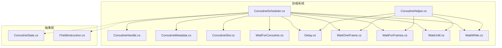
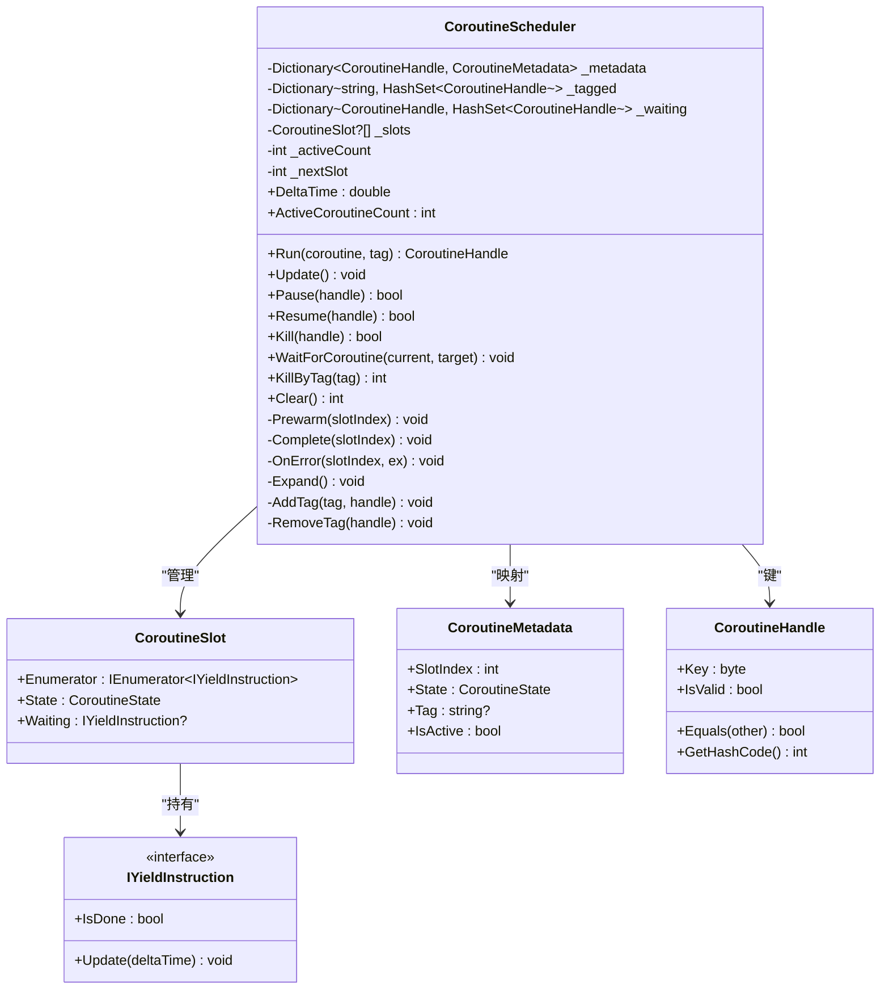
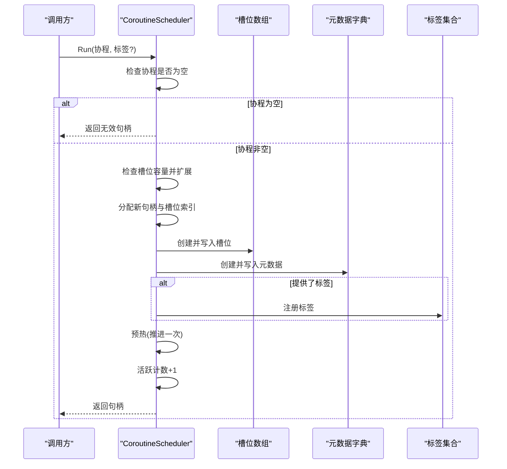
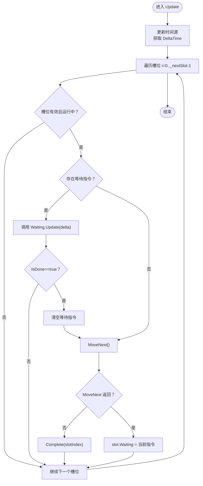
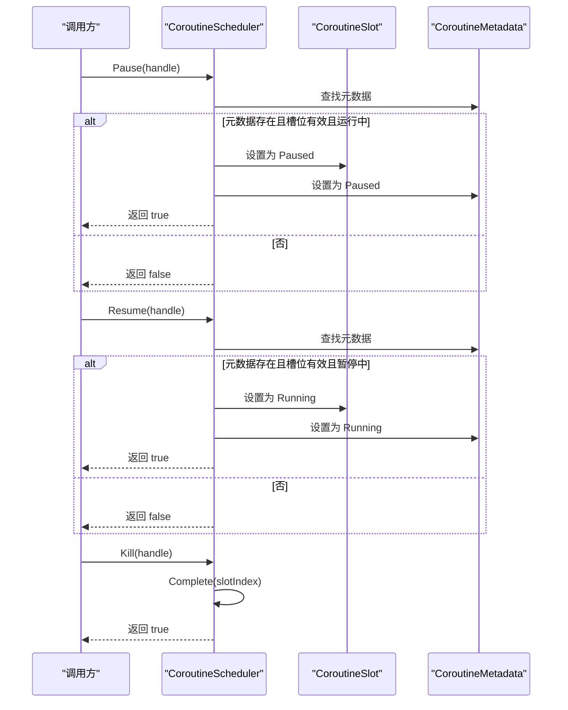
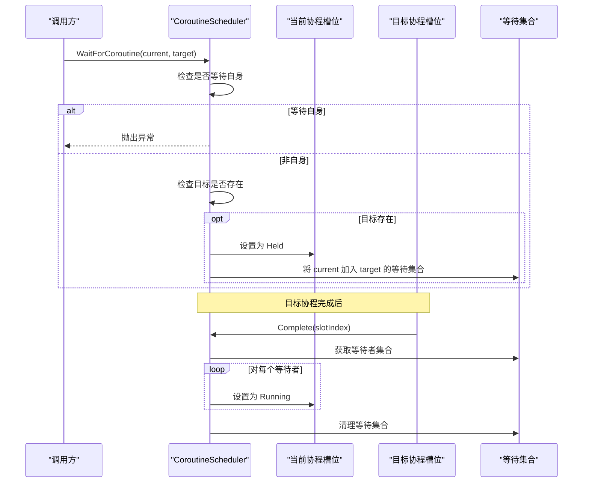
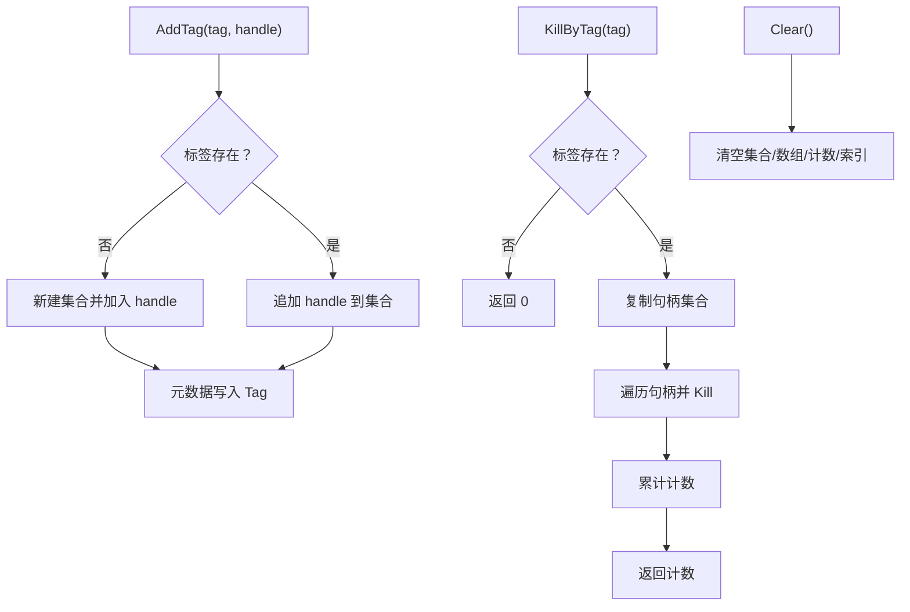
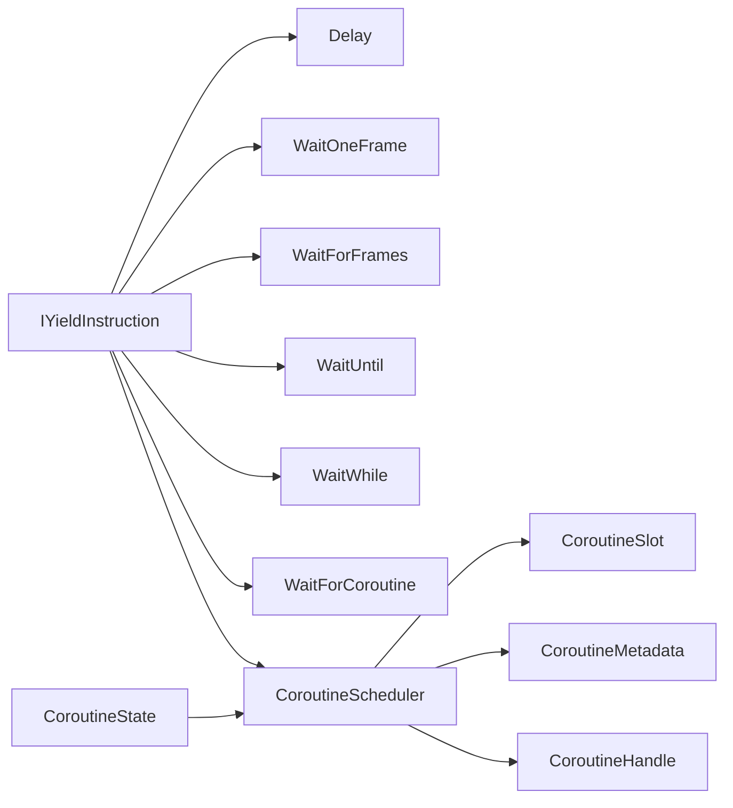

# 协程调度器核心

<cite>
**本文引用的文件**
- [CoroutineScheduler.cs](file://GFramework.Core/coroutine/CoroutineScheduler.cs)
- [CoroutineHandle.cs](file://GFramework.Core/coroutine/CoroutineHandle.cs)
- [CoroutineMetadata.cs](file://GFramework.Core/coroutine/CoroutineMetadata.cs)
- [CoroutineSlot.cs](file://GFramework.Core/coroutine/CoroutineSlot.cs)
- [WaitForCoroutine.cs](file://GFramework.Core/coroutine/WaitForCoroutine.cs)
- [Delay.cs](file://GFramework.Core/coroutine/Delay.cs)
- [WaitOneFrame.cs](file://GFramework.Core/coroutine/WaitOneFrame.cs)
- [WaitForFrames.cs](file://GFramework.Core/coroutine/WaitForFrames.cs)
- [WaitUntil.cs](file://GFramework.Core/coroutine/WaitUntil.cs)
- [WaitWhile.cs](file://GFramework.Core/coroutine/WaitWhile.cs)
- [CoroutineHelper.cs](file://GFramework.Core/coroutine/CoroutineHelper.cs)
- [CoroutineState.cs](file://GFramework.Core.Abstractions/coroutine/CoroutineState.cs)
- [IYieldInstruction.cs](file://GFramework.Core.Abstractions/coroutine/IYieldInstruction.cs)
- [CoroutineSchedulerTests.cs](file://GFramework.Core.Tests/coroutine/CoroutineSchedulerTests.cs)
</cite>

## 目录
1. [简介](#简介)
2. [项目结构](#项目结构)
3. [核心组件](#核心组件)
4. [架构总览](#架构总览)
5. [详细组件分析](#详细组件分析)
6. [依赖关系分析](#依赖关系分析)
7. [性能考量](#性能考量)
8. [故障排查指南](#故障排查指南)
9. [结论](#结论)
10. [附录](#附录)

## 简介
本文件围绕 CoroutineScheduler 核心调度器进行深入技术文档化，重点解释其架构设计、高性能执行引擎实现以及关键方法的工作流程。文档覆盖以下主题：
- Run 方法的协程启动流程：槽位分配、元数据创建、预热机制
- Update 方法的协程状态更新循环：等待指令处理、协程推进、异常捕获
- 协程生命周期管理：暂停(Pause)、恢复(Resume)、终止(Kill)
- 协程等待机制：WaitForCoroutine 的依赖等待与唤醒逻辑
- 协程标签系统与批量管理
- 性能优化策略与内存管理最佳实践
- 实际使用示例与常见问题解决方案

## 项目结构
该调度器位于 GFramework.Core/coroutine 目录下，配合抽象层接口与若干等待指令实现共同构成协程系统。

图表来源
- [CoroutineScheduler.cs](file://GFramework.Core/coroutine/CoroutineScheduler.cs#L1-L392)
- [CoroutineHandle.cs](file://GFramework.Core/coroutine/CoroutineHandle.cs#L1-L94)
- [CoroutineMetadata.cs](file://GFramework.Core/coroutine/CoroutineMetadata.cs#L1-L32)
- [CoroutineSlot.cs](file://GFramework.Core/coroutine/CoroutineSlot.cs#L1-L24)
- [WaitForCoroutine.cs](file://GFramework.Core/coroutine/WaitForCoroutine.cs#L1-L29)
- [Delay.cs](file://GFramework.Core/coroutine/Delay.cs#L1-L29)
- [WaitOneFrame.cs](file://GFramework.Core/coroutine/WaitOneFrame.cs#L1-L26)
- [WaitForFrames.cs](file://GFramework.Core/coroutine/WaitForFrames.cs#L1-L29)
- [WaitUntil.cs](file://GFramework.Core/coroutine/WaitUntil.cs#L1-L26)
- [WaitWhile.cs](file://GFramework.Core/coroutine/WaitWhile.cs#L1-L26)
- [CoroutineHelper.cs](file://GFramework.Core/coroutine/CoroutineHelper.cs#L1-L101)
- [CoroutineState.cs](file://GFramework.Core.Abstractions/coroutine/CoroutineState.cs#L1-L32)
- [IYieldInstruction.cs](file://GFramework.Core.Abstractions/coroutine/IYieldInstruction.cs#L1-L18)

章节来源
- [CoroutineScheduler.cs](file://GFramework.Core/coroutine/CoroutineScheduler.cs#L1-L392)
- [CoroutineHandle.cs](file://GFramework.Core/coroutine/CoroutineHandle.cs#L1-L94)
- [CoroutineMetadata.cs](file://GFramework.Core/coroutine/CoroutineMetadata.cs#L1-L32)
- [CoroutineSlot.cs](file://GFramework.Core/coroutine/CoroutineSlot.cs#L1-L24)
- [WaitForCoroutine.cs](file://GFramework.Core/coroutine/WaitForCoroutine.cs#L1-L29)
- [Delay.cs](file://GFramework.Core/coroutine/Delay.cs#L1-L29)
- [WaitOneFrame.cs](file://GFramework.Core/coroutine/WaitOneFrame.cs#L1-L26)
- [WaitForFrames.cs](file://GFramework.Core/coroutine/WaitForFrames.cs#L1-L29)
- [WaitUntil.cs](file://GFramework.Core/coroutine/WaitUntil.cs#L1-L26)
- [WaitWhile.cs](file://GFramework.Core/coroutine/WaitWhile.cs#L1-L26)
- [CoroutineHelper.cs](file://GFramework.Core/coroutine/CoroutineHelper.cs#L1-L101)
- [CoroutineState.cs](file://GFramework.Core.Abstractions/coroutine/CoroutineState.cs#L1-L32)
- [IYieldInstruction.cs](file://GFramework.Core.Abstractions/coroutine/IYieldInstruction.cs#L1-L18)

## 核心组件
- 协程调度器 CoroutineScheduler：负责协程的创建、更新、暂停/恢复/终止、等待与标签管理、容量扩展与异常处理。
- 协程句柄 CoroutineHandle：唯一标识协程实例，支持实例隔离与键值提取。
- 协程槽位 CoroutineSlot：承载单个协程的枚举器、状态与等待指令。
- 协程元数据 CoroutineMetadata：记录槽位索引、状态、标签与活跃性判断。
- 等待指令 IYieldInstruction 及其实现：Delay、WaitOneFrame、WaitForFrames、WaitUntil、WaitWhile、WaitForCoroutine。
- 协程辅助工具 CoroutineHelper：提供常用等待指令的便捷构造方法。

章节来源
- [CoroutineScheduler.cs](file://GFramework.Core/coroutine/CoroutineScheduler.cs#L11-L392)
- [CoroutineHandle.cs](file://GFramework.Core/coroutine/CoroutineHandle.cs#L7-L94)
- [CoroutineSlot.cs](file://GFramework.Core/coroutine/CoroutineSlot.cs#L8-L24)
- [CoroutineMetadata.cs](file://GFramework.Core/coroutine/CoroutineMetadata.cs#L8-L32)
- [IYieldInstruction.cs](file://GFramework.Core.Abstractions/coroutine/IYieldInstruction.cs#L6-L18)
- [Delay.cs](file://GFramework.Core/coroutine/Delay.cs#L9-L29)
- [WaitOneFrame.cs](file://GFramework.Core/coroutine/WaitOneFrame.cs#L9-L26)
- [WaitForFrames.cs](file://GFramework.Core/coroutine/WaitForFrames.cs#L9-L29)
- [WaitUntil.cs](file://GFramework.Core/coroutine/WaitUntil.cs#L9-L26)
- [WaitWhile.cs](file://GFramework.Core/coroutine/WaitWhile.cs#L9-L26)
- [WaitForCoroutine.cs](file://GFramework.Core/coroutine/WaitForCoroutine.cs#L8-L29)
- [CoroutineHelper.cs](file://GFramework.Core/coroutine/CoroutineHelper.cs#L8-L101)

## 架构总览
调度器采用“槽位+元数据”的双映射结构：
- 槽位数组按顺序存储协程执行上下文，便于 O(1) 遍历与更新。
- 元数据字典将句柄映射到状态、槽位索引与标签，支持快速查询与状态变更。
- 等待集合维护“被等待者”到“等待者”的反向依赖，实现唤醒链路。
- 标签集合支持按标签批量管理协程。

图表来源
- [CoroutineScheduler.cs](file://GFramework.Core/coroutine/CoroutineScheduler.cs#L11-L392)
- [CoroutineSlot.cs](file://GFramework.Core/coroutine/CoroutineSlot.cs#L8-L24)
- [CoroutineMetadata.cs](file://GFramework.Core/coroutine/CoroutineMetadata.cs#L8-L32)
- [CoroutineHandle.cs](file://GFramework.Core/coroutine/CoroutineHandle.cs#L7-L94)
- [IYieldInstruction.cs](file://GFramework.Core.Abstractions/coroutine/IYieldInstruction.cs#L6-L18)

## 详细组件分析

### Run 方法：协程启动流程
- 输入校验：若协程为空，直接返回无效句柄。
- 槽位扩容：若当前槽位已满，则按倍增策略扩展数组容量。
- 分配句柄与槽位：生成新的协程句柄，并递增下一个可用槽位索引。
- 创建槽位：初始化枚举器与运行状态。
- 创建元数据：记录槽位索引、运行状态与可选标签。
- 标签注册：若提供标签，加入标签集合。
- 预热执行：立即推进一次协程，读取首个等待指令；异常将被捕获并完成协程。
- 活跃计数增加：确保统计准确。

图表来源
- [CoroutineScheduler.cs](file://GFramework.Core/coroutine/CoroutineScheduler.cs#L43-L77)
- [CoroutineScheduler.cs](file://GFramework.Core/coroutine/CoroutineScheduler.cs#L264-L285)

章节来源
- [CoroutineScheduler.cs](file://GFramework.Core/coroutine/CoroutineScheduler.cs#L43-L77)
- [CoroutineScheduler.cs](file://GFramework.Core/coroutine/CoroutineScheduler.cs#L264-L285)

### Update 方法：协程状态更新循环
- 时间源更新：先驱动时间源，获取 DeltaTime。
- 遍历槽位：仅遍历已分配的槽位（_nextSlot），跳过空槽位与非运行状态。
- 等待指令处理：若存在等待指令，调用 Update(delta)，若未完成则跳过本次推进。
- 协程推进：MoveNext()，若返回 false 则完成协程；否则将当前指令作为等待指令。
- 异常捕获：任何异常均转交 OnError，统一完成协程并输出错误日志。

图表来源
- [CoroutineScheduler.cs](file://GFramework.Core/coroutine/CoroutineScheduler.cs#L82-L121)
- [CoroutineScheduler.cs](file://GFramework.Core/coroutine/CoroutineScheduler.cs#L291-L345)

章节来源
- [CoroutineScheduler.cs](file://GFramework.Core/coroutine/CoroutineScheduler.cs#L82-L121)
- [CoroutineScheduler.cs](file://GFramework.Core/coroutine/CoroutineScheduler.cs#L291-L345)

### 生命周期管理：Pause/Resume/Kill
- Pause：仅对运行中的协程生效，将其与元数据同时置为暂停。
- Resume：仅对暂停中的协程生效，恢复为运行。
- Kill：直接完成指定槽位的协程，触发标签移除与等待者唤醒。

图表来源
- [CoroutineScheduler.cs](file://GFramework.Core/coroutine/CoroutineScheduler.cs#L132-L177)
- [CoroutineScheduler.cs](file://GFramework.Core/coroutine/CoroutineScheduler.cs#L291-L334)

章节来源
- [CoroutineScheduler.cs](file://GFramework.Core/coroutine/CoroutineScheduler.cs#L132-L177)
- [CoroutineScheduler.cs](file://GFramework.Core/coroutine/CoroutineScheduler.cs#L291-L334)

### 等待机制：WaitForCoroutine 依赖等待与唤醒
- 自等待检查：禁止协程等待自身。
- 目标存在性：若目标不存在，直接返回（不阻塞当前协程）。
- 当前协程状态：设置为 Held，防止被 Update 推进。
- 等待登记：将当前协程加入“被等待者”的等待集合。
- 唤醒逻辑：目标协程完成后，遍历等待者集合，逐个恢复为 Running 并清理等待登记。

图表来源
- [CoroutineScheduler.cs](file://GFramework.Core/coroutine/CoroutineScheduler.cs#L188-L215)
- [CoroutineScheduler.cs](file://GFramework.Core/coroutine/CoroutineScheduler.cs#L316-L333)

章节来源
- [CoroutineScheduler.cs](file://GFramework.Core/coroutine/CoroutineScheduler.cs#L188-L215)
- [CoroutineScheduler.cs](file://GFramework.Core/coroutine/CoroutineScheduler.cs#L316-L333)

### 标签系统与批量管理
- 标签注册：Run 时若提供标签，加入标签集合并同步到元数据。
- 批量终止：KillByTag 遍历标签集合中的句柄，逐一调用 Kill。
- 清空：Clear 将所有集合清空并重置计数与索引。

图表来源
- [CoroutineScheduler.cs](file://GFramework.Core/coroutine/CoroutineScheduler.cs#L360-L389)
- [CoroutineScheduler.cs](file://GFramework.Core/coroutine/CoroutineScheduler.cs#L222-L254)

章节来源
- [CoroutineScheduler.cs](file://GFramework.Core/coroutine/CoroutineScheduler.cs#L360-L389)
- [CoroutineScheduler.cs](file://GFramework.Core/coroutine/CoroutineScheduler.cs#L222-L254)

### 等待指令族与使用建议
- Delay：基于剩余时间递减，适合秒级延迟。
- WaitOneFrame：每帧完成一次，适合简单帧等待。
- WaitForFrames：基于帧计数，适合固定帧数等待。
- WaitUntil/WaitWhile：基于谓词函数，适合条件等待。
- WaitForCoroutine：用于协程间依赖等待，需配合调度器的等待登记与唤醒。

章节来源
- [Delay.cs](file://GFramework.Core/coroutine/Delay.cs#L9-L29)
- [WaitOneFrame.cs](file://GFramework.Core/coroutine/WaitOneFrame.cs#L9-L26)
- [WaitForFrames.cs](file://GFramework.Core/coroutine/WaitForFrames.cs#L9-L29)
- [WaitUntil.cs](file://GFramework.Core/coroutine/WaitUntil.cs#L9-L26)
- [WaitWhile.cs](file://GFramework.Core/coroutine/WaitWhile.cs#L9-L26)
- [WaitForCoroutine.cs](file://GFramework.Core/coroutine/WaitForCoroutine.cs#L8-L29)
- [CoroutineHelper.cs](file://GFramework.Core/coroutine/CoroutineHelper.cs#L15-L100)

## 依赖关系分析
- 调度器依赖抽象接口 IYieldInstruction 与枚举 CoroutineState，保证跨平台与可替换性。
- 等待指令实现遵循统一接口，调度器通过 Update 驱动其状态变化。
- 句柄与元数据形成强关联，槽位数组提供 O(1) 访问，元数据字典提供 O(1) 查询。
- 标签集合与等待集合均为哈希结构，支持高效插入、删除与遍历。

图表来源
- [IYieldInstruction.cs](file://GFramework.Core.Abstractions/coroutine/IYieldInstruction.cs#L6-L18)
- [CoroutineState.cs](file://GFramework.Core.Abstractions/coroutine/CoroutineState.cs#L6-L32)
- [CoroutineScheduler.cs](file://GFramework.Core/coroutine/CoroutineScheduler.cs#L11-L392)
- [Delay.cs](file://GFramework.Core/coroutine/Delay.cs#L9-L29)
- [WaitOneFrame.cs](file://GFramework.Core/coroutine/WaitOneFrame.cs#L9-L26)
- [WaitForFrames.cs](file://GFramework.Core/coroutine/WaitForFrames.cs#L9-L29)
- [WaitUntil.cs](file://GFramework.Core/coroutine/WaitUntil.cs#L9-L26)
- [WaitWhile.cs](file://GFramework.Core/coroutine/WaitWhile.cs#L9-L26)
- [WaitForCoroutine.cs](file://GFramework.Core/coroutine/WaitForCoroutine.cs#L8-L29)

章节来源
- [CoroutineScheduler.cs](file://GFramework.Core/coroutine/CoroutineScheduler.cs#L11-L392)
- [IYieldInstruction.cs](file://GFramework.Core.Abstractions/coroutine/IYieldInstruction.cs#L6-L18)
- [CoroutineState.cs](file://GFramework.Core.Abstractions/coroutine/CoroutineState.cs#L6-L32)

## 性能考量
- 时间源驱动：Update 先驱动时间源，确保等待指令的 Update 使用一致的 DeltaTime。
- 线性遍历：Update 对已分配槽位线性扫描，复杂度 O(N)；N 为已分配槽位数。
- 等待指令短路：若等待未完成，跳过 MoveNext，避免无意义推进。
- 预热机制：Run 时预热一次，减少首帧推进成本。
- 容量扩展：按倍增策略扩容，摊销写入成本，降低频繁扩容开销。
- 异常处理：统一捕获并完成协程，避免异常传播影响调度器稳定性。
- 标签与等待集合：使用 HashSet，插入/删除/查找平均 O(1)，适合高频操作。

章节来源
- [CoroutineScheduler.cs](file://GFramework.Core/coroutine/CoroutineScheduler.cs#L82-L121)
- [CoroutineScheduler.cs](file://GFramework.Core/coroutine/CoroutineScheduler.cs#L350-L353)
- [CoroutineScheduler.cs](file://GFramework.Core/coroutine/CoroutineScheduler.cs#L341-L345)

## 故障排查指南
- 协程未推进：确认协程枚举器返回的等待指令是否正确，且 IsDone 在条件满足时为 true。
- 协程卡住：检查等待指令 Update 是否被调用，以及剩余时间/帧数是否递减。
- WaitForCoroutine 无效：确认目标协程句柄有效，且当前协程被设置为 Held。
- 标签批量终止无效：确认标签名一致，且句柄仍在调度器中。
- 异常导致协程提前结束：查看控制台错误输出，定位异常点并修复协程逻辑。
- 槽位不足：观察活跃协程数量增长趋势，必要时增大 initialCapacity 或优化协程生命周期。

章节来源
- [CoroutineScheduler.cs](file://GFramework.Core/coroutine/CoroutineScheduler.cs#L188-L215)
- [CoroutineScheduler.cs](file://GFramework.Core/coroutine/CoroutineScheduler.cs#L341-L345)
- [CoroutineSchedulerTests.cs](file://GFramework.Core.Tests/coroutine/CoroutineSchedulerTests.cs#L190-L228)
- [CoroutineSchedulerTests.cs](file://GFramework.Core.Tests/coroutine/CoroutineSchedulerTests.cs#L294-L320)

## 结论
CoroutineScheduler 通过“槽位+元数据”的紧凑结构实现了高性能的协程调度，结合统一的等待指令接口与完善的生命周期管理，既保证了易用性也兼顾了性能与可维护性。配合标签系统与批量管理能力，能够满足复杂场景下的协程编排需求。

## 附录

### 使用示例与最佳实践
- 基础使用：通过 Run 启动协程，传入等待指令实现延迟、帧等待或条件等待。
- 条件等待：使用 WaitUntil/WaitWhile 根据业务状态动态决定协程推进时机。
- 协程间依赖：使用 WaitForCoroutine 建立依赖关系，目标完成后自动唤醒等待者。
- 标签管理：为协程打标签，便于批量终止与统计。
- 性能优化：合理设置 initialCapacity，避免频繁扩容；尽量使用轻量等待指令；及时 Kill 长生命周期协程。

章节来源
- [CoroutineHelper.cs](file://GFramework.Core/coroutine/CoroutineHelper.cs#L15-L100)
- [CoroutineScheduler.cs](file://GFramework.Core/coroutine/CoroutineScheduler.cs#L43-L77)
- [CoroutineScheduler.cs](file://GFramework.Core/coroutine/CoroutineScheduler.cs#L188-L215)
- [CoroutineScheduler.cs](file://GFramework.Core/coroutine/CoroutineScheduler.cs#L222-L254)