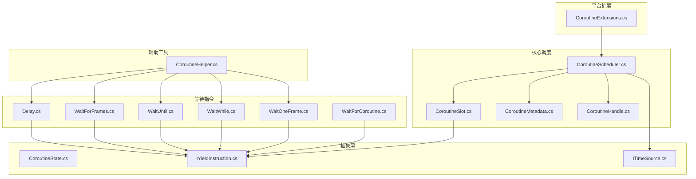
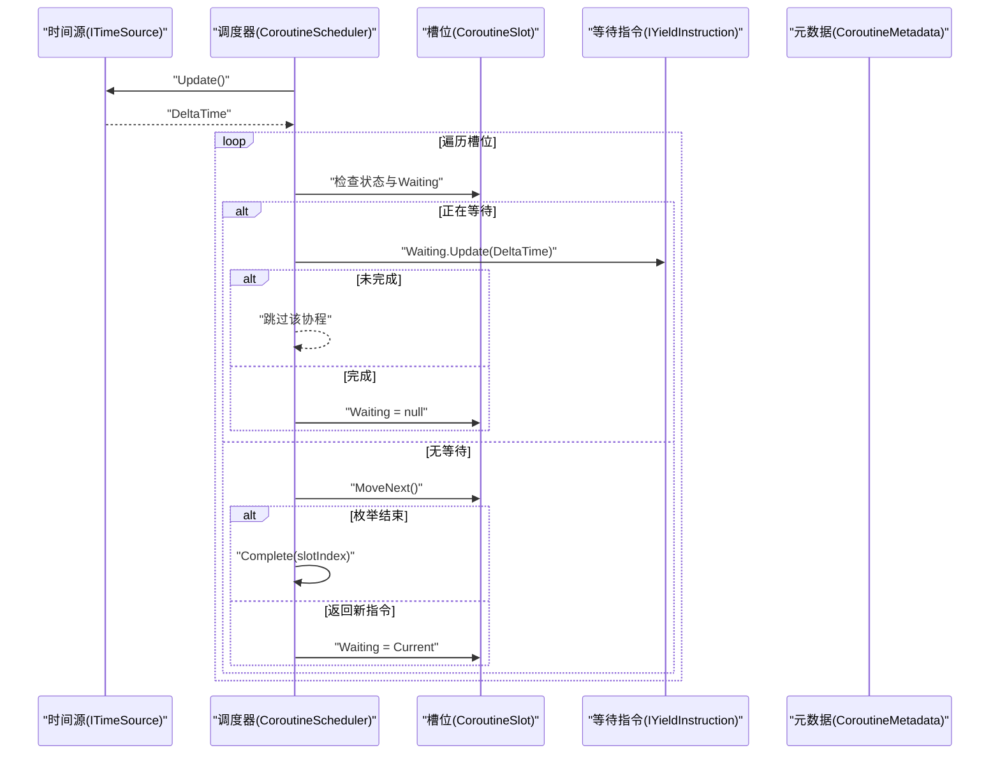
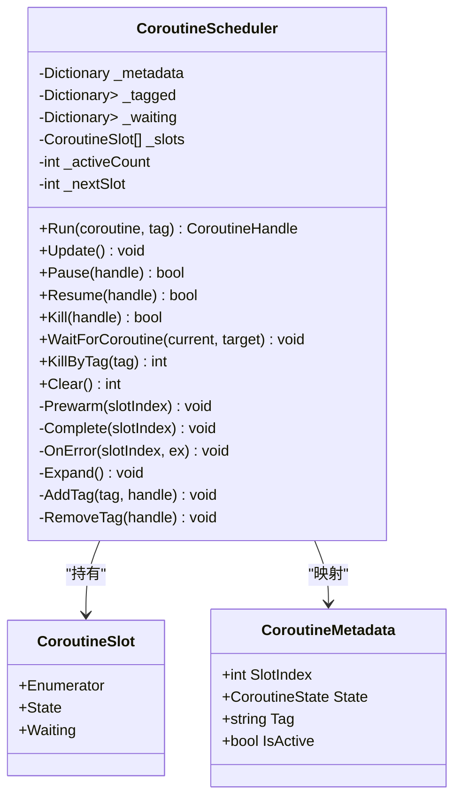
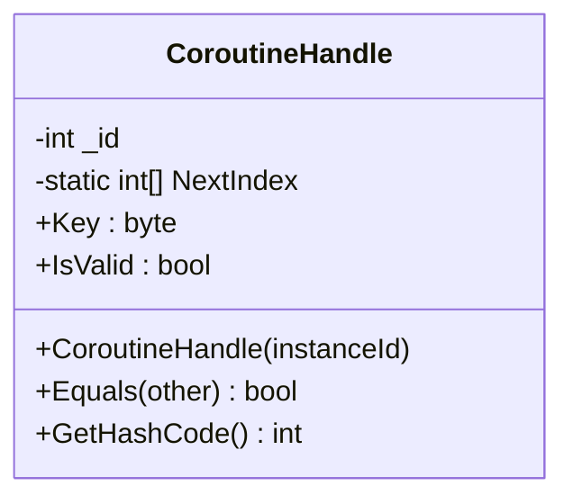
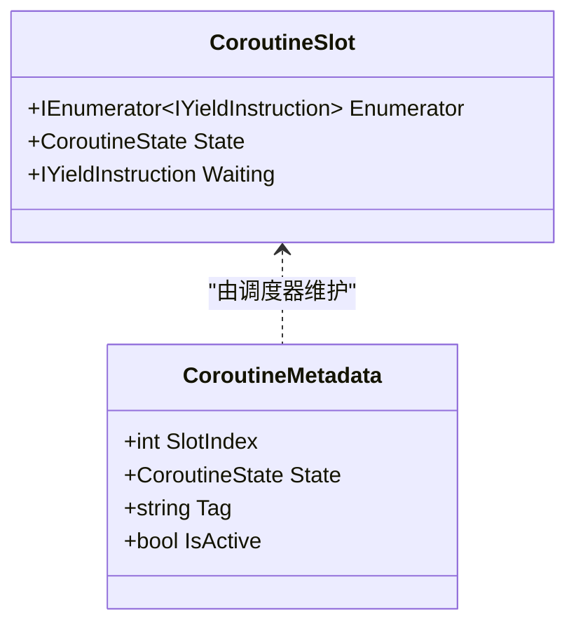
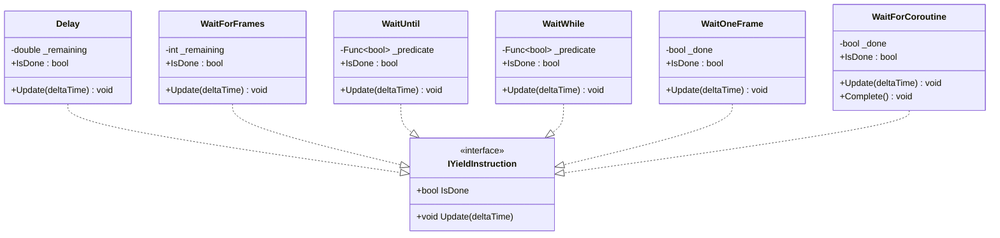
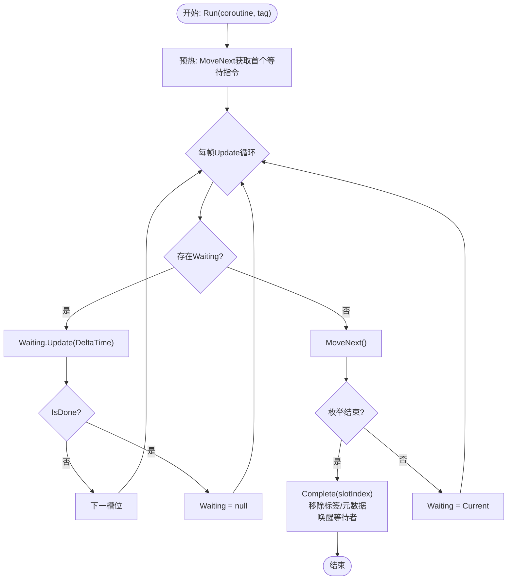
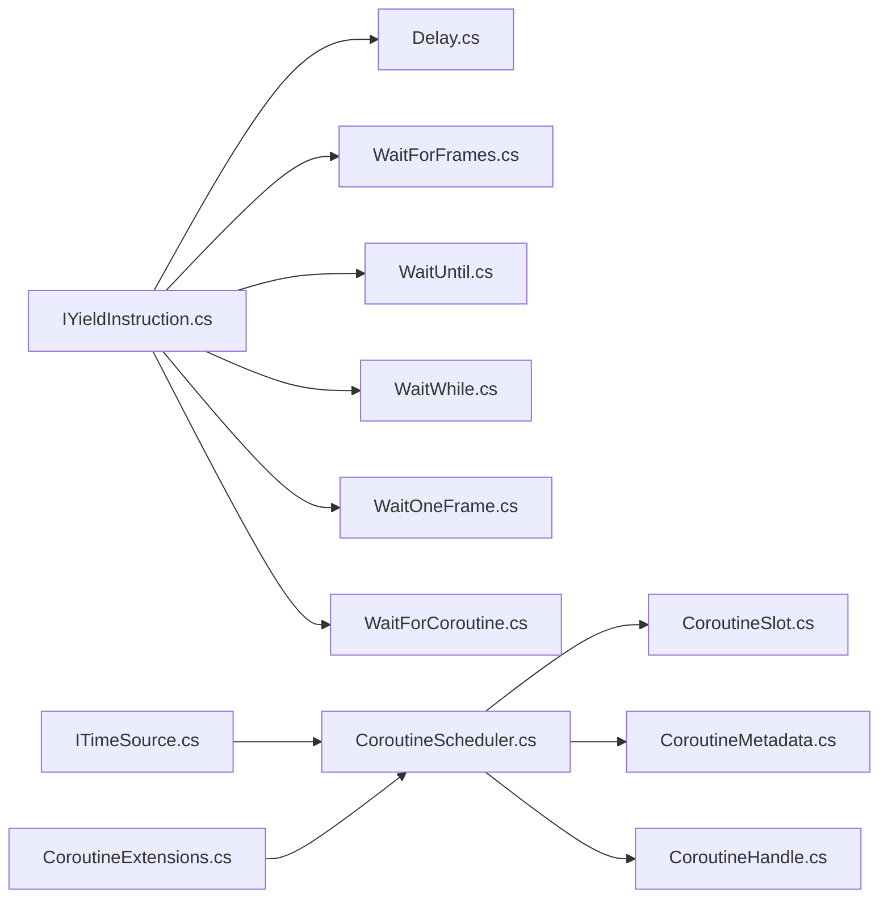

# 协程调度系统

<cite>
**本文引用的文件**
- [CoroutineScheduler.cs](file://GFramework.Core/coroutine/CoroutineScheduler.cs)
- [CoroutineHandle.cs](file://GFramework.Core/coroutine/CoroutineHandle.cs)
- [CoroutineSlot.cs](file://GFramework.Core/coroutine/CoroutineSlot.cs)
- [CoroutineMetadata.cs](file://GFramework.Core/coroutine/CoroutineMetadata.cs)
- [CoroutineHelper.cs](file://GFramework.Core/coroutine/CoroutineHelper.cs)
- [Delay.cs](file://GFramework.Core/coroutine/Delay.cs)
- [WaitForFrames.cs](file://GFramework.Core/coroutine/WaitForFrames.cs)
- [WaitUntil.cs](file://GFramework.Core/coroutine/WaitUntil.cs)
- [WaitWhile.cs](file://GFramework.Core/coroutine/WaitWhile.cs)
- [WaitOneFrame.cs](file://GFramework.Core/coroutine/WaitOneFrame.cs)
- [WaitForCoroutine.cs](file://GFramework.Core/coroutine/WaitForCoroutine.cs)
- [CoroutineState.cs](file://GFramework.Core.Abstractions/coroutine/CoroutineState.cs)
- [IYieldInstruction.cs](file://GFramework.Core.Abstractions/coroutine/IYieldInstruction.cs)
- [ITimeSource.cs](file://GFramework.Core.Abstractions/coroutine/ITimeSource.cs)
- [CoroutineExtensions.cs](file://GFramework.Godot/coroutine/CoroutineExtensions.cs)
</cite>

## 目录
1. [简介](#简介)
2. [项目结构](#项目结构)
3. [核心组件](#核心组件)
4. [架构总览](#架构总览)
5. [详细组件分析](#详细组件分析)
6. [依赖关系分析](#依赖关系分析)
7. [性能考量](#性能考量)
8. [故障排查指南](#故障排查指南)
9. [结论](#结论)
10. [附录](#附录)

## 简介
本文件面向GFramework协程调度系统，围绕CoroutineScheduler高性能执行引擎的设计与实现进行深入解析，涵盖协程状态管理、元数据与槽位的内存复用策略、各类YieldInstruction的使用场景与性能特征、协程生命周期与取消机制，并提供性能优化与最佳实践建议，帮助开发者构建高效稳定的异步游戏逻辑。

## 项目结构
协程子系统位于GFramework.Core与GFramework.Core.Abstractions中，Godot平台扩展位于GFramework.Godot。核心文件组织如下：
- 抽象层：定义协程状态、等待指令接口与时间源接口
- 核心调度：调度器、句柄、槽位、元数据
- 等待指令：Delay、WaitForFrames、WaitUntil、WaitWhile、WaitOneFrame、WaitForCoroutine
- 辅助工具：CoroutineHelper提供常用等待指令与重复调用模式
- 平台扩展：Godot扩展提供节点生存期与协程取消的便捷方法

图表来源
- [CoroutineScheduler.cs](file://GFramework.Core/coroutine/CoroutineScheduler.cs#L1-L392)
- [CoroutineHandle.cs](file://GFramework.Core/coroutine/CoroutineHandle.cs#L1-L94)
- [CoroutineSlot.cs](file://GFramework.Core/coroutine/CoroutineSlot.cs#L1-L24)
- [CoroutineMetadata.cs](file://GFramework.Core/coroutine/CoroutineMetadata.cs#L1-L32)
- [Delay.cs](file://GFramework.Core/coroutine/Delay.cs#L1-L29)
- [WaitForFrames.cs](file://GFramework.Core/coroutine/WaitForFrames.cs#L1-L29)
- [WaitUntil.cs](file://GFramework.Core/coroutine/WaitUntil.cs#L1-L26)
- [WaitWhile.cs](file://GFramework.Core/coroutine/WaitWhile.cs#L1-L26)
- [WaitOneFrame.cs](file://GFramework.Core/coroutine/WaitOneFrame.cs#L1-L26)
- [WaitForCoroutine.cs](file://GFramework.Core/coroutine/WaitForCoroutine.cs#L1-L29)
- [CoroutineHelper.cs](file://GFramework.Core/coroutine/CoroutineHelper.cs#L1-L101)
- [CoroutineState.cs](file://GFramework.Core.Abstractions/coroutine/CoroutineState.cs#L1-L32)
- [IYieldInstruction.cs](file://GFramework.Core.Abstractions/coroutine/IYieldInstruction.cs#L1-L18)
- [ITimeSource.cs](file://GFramework.Core.Abstractions/coroutine/ITimeSource.cs#L1-L22)
- [CoroutineExtensions.cs](file://GFramework.Godot/coroutine/CoroutineExtensions.cs#L1-L66)

章节来源
- [CoroutineScheduler.cs](file://GFramework.Core/coroutine/CoroutineScheduler.cs#L1-L392)
- [CoroutineState.cs](file://GFramework.Core.Abstractions/coroutine/CoroutineState.cs#L1-L32)
- [IYieldInstruction.cs](file://GFramework.Core.Abstractions/coroutine/IYieldInstruction.cs#L1-L18)
- [ITimeSource.cs](file://GFramework.Core.Abstractions/coroutine/ITimeSource.cs#L1-L22)

## 核心组件
- 协程调度器 CoroutineScheduler：负责协程的启动、推进、暂停、恢复、终止、按标签清理、等待其他协程完成等；维护槽位数组、元数据字典、标签集合、等待映射与活跃计数。
- 协程句柄 CoroutineHandle：轻量级唯一标识符，支持实例隔离与键校验，用于快速定位与比较协程。
- 协程槽位 CoroutineSlot：承载单个协程的枚举器、当前状态与等待指令。
- 协程元数据 CoroutineMetadata：记录槽位索引、状态、标签与活跃判定。
- 等待指令 IYieldInstruction：统一的等待协议，各具体指令实现Update与IsDone。
- 辅助工具 CoroutineHelper：提供常用等待指令与重复调用模式的便捷封装。
- 平台扩展 CoroutineExtensions（Godot）：提供RunCoroutine扩展与基于节点生存期的自动取消。

章节来源
- [CoroutineScheduler.cs](file://GFramework.Core/coroutine/CoroutineScheduler.cs#L11-L392)
- [CoroutineHandle.cs](file://GFramework.Core/coroutine/CoroutineHandle.cs#L7-L94)
- [CoroutineSlot.cs](file://GFramework.Core/coroutine/CoroutineSlot.cs#L8-L24)
- [CoroutineMetadata.cs](file://GFramework.Core/coroutine/CoroutineMetadata.cs#L8-L32)
- [IYieldInstruction.cs](file://GFramework.Core.Abstractions/coroutine/IYieldInstruction.cs#L6-L18)
- [CoroutineHelper.cs](file://GFramework.Core/coroutine/CoroutineHelper.cs#L8-L101)
- [CoroutineExtensions.cs](file://GFramework.Godot/coroutine/CoroutineExtensions.cs#L7-L66)

## 架构总览
调度器采用“槽位+元数据”的双索引模型，以数组O(1)访问协程，配合字典实现标签与等待关系管理。每帧Update遍历所有槽位，推进协程状态机，处理等待指令与异常，最终完成并唤醒等待者。

图表来源
- [CoroutineScheduler.cs](file://GFramework.Core/coroutine/CoroutineScheduler.cs#L82-L121)
- [ITimeSource.cs](file://GFramework.Core.Abstractions/coroutine/ITimeSource.cs#L6-L22)
- [IYieldInstruction.cs](file://GFramework.Core.Abstractions/coroutine/IYieldInstruction.cs#L6-L18)

## 详细组件分析

### 协程调度器 CoroutineScheduler
- 关键职责
  - 启动协程：预热推进一次MoveNext，立即获取首个等待指令
  - 每帧推进：遍历槽位，处理Waiting与MoveNext，捕获异常并完成协程
  - 生命周期管理：Pause/Resume/Kill/WaitForCoroutine/Clear
  - 标签管理：按标签批量终止
- 数据结构
  - 槽位数组：按索引O(1)访问协程
  - 元数据字典：Handle->Meta，记录槽位索引、状态、标签
  - 标签集合：Tag->Handles，支持按标签清理
  - 等待映射：Target->Waiters，完成时唤醒等待者
- 性能特性
  - 预热Prewarm减少首帧开销
  - 扩容策略Array.Resize按倍增长
  - 异常路径直接Complete，避免悬挂状态

图表来源
- [CoroutineScheduler.cs](file://GFramework.Core/coroutine/CoroutineScheduler.cs#L11-L392)
- [CoroutineSlot.cs](file://GFramework.Core/coroutine/CoroutineSlot.cs#L8-L24)
- [CoroutineMetadata.cs](file://GFramework.Core/coroutine/CoroutineMetadata.cs#L8-L32)

章节来源
- [CoroutineScheduler.cs](file://GFramework.Core/coroutine/CoroutineScheduler.cs#L35-L392)

### 协程句柄 CoroutineHandle
- 设计要点
  - 使用低4位作为Key，高4位作为实例ID，支持最多16个实例槽位
  - 通过静态NextIndex数组为每个实例分配连续ID，避免冲突
  - 有效性判断基于Key是否为0
- 适用场景
  - 快速Handle比较与字典键
  - 与调度器内部索引解耦，便于跨模块传递

图表来源
- [CoroutineHandle.cs](file://GFramework.Core/coroutine/CoroutineHandle.cs#L7-L94)

章节来源
- [CoroutineHandle.cs](file://GFramework.Core/coroutine/CoroutineHandle.cs#L7-L94)

### 协程槽位与元数据
- CoroutineSlot
  - 保存Enumerator、State、Waiting，承载单协程的执行上下文
- CoroutineMetadata
  - 保存SlotIndex、State、Tag与IsActive判定，用于调度器查询与清理

图表来源
- [CoroutineSlot.cs](file://GFramework.Core/coroutine/CoroutineSlot.cs#L8-L24)
- [CoroutineMetadata.cs](file://GFramework.Core/coroutine/CoroutineMetadata.cs#L8-L32)

章节来源
- [CoroutineSlot.cs](file://GFramework.Core/coroutine/CoroutineSlot.cs#L8-L24)
- [CoroutineMetadata.cs](file://GFramework.Core/coroutine/CoroutineMetadata.cs#L8-L32)

### 等待指令 IYieldInstruction 及其实现
- 协议
  - Update(deltaTime)：每帧由调度器调用，推进等待状态
  - IsDone：指示等待是否完成
- 具体实现
  - Delay：基于剩余秒数递减，适合通用延时
  - WaitForFrames：基于帧计数递减，适合固定帧率同步
  - WaitUntil：基于谓词函数，适合条件达成即继续
  - WaitWhile：基于谓词取反，适合条件持续满足时阻塞
  - WaitOneFrame：单帧等待，适合简单帧同步
  - WaitForCoroutine：内部指令，配合调度器等待其他协程完成

图表来源
- [IYieldInstruction.cs](file://GFramework.Core.Abstractions/coroutine/IYieldInstruction.cs#L6-L18)
- [Delay.cs](file://GFramework.Core/coroutine/Delay.cs#L9-L29)
- [WaitForFrames.cs](file://GFramework.Core/coroutine/WaitForFrames.cs#L9-L29)
- [WaitUntil.cs](file://GFramework.Core/coroutine/WaitUntil.cs#L9-L26)
- [WaitWhile.cs](file://GFramework.Core/coroutine/WaitWhile.cs#L9-L26)
- [WaitOneFrame.cs](file://GFramework.Core/coroutine/WaitOneFrame.cs#L9-L26)
- [WaitForCoroutine.cs](file://GFramework.Core/coroutine/WaitForCoroutine.cs#L8-L29)

章节来源
- [IYieldInstruction.cs](file://GFramework.Core.Abstractions/coroutine/IYieldInstruction.cs#L6-L18)
- [Delay.cs](file://GFramework.Core/coroutine/Delay.cs#L9-L29)
- [WaitForFrames.cs](file://GFramework.Core/coroutine/WaitForFrames.cs#L9-L29)
- [WaitUntil.cs](file://GFramework.Core/coroutine/WaitUntil.cs#L9-L26)
- [WaitWhile.cs](file://GFramework.Core/coroutine/WaitWhile.cs#L9-L26)
- [WaitOneFrame.cs](file://GFramework.Core/coroutine/WaitOneFrame.cs#L9-L26)
- [WaitForCoroutine.cs](file://GFramework.Core/coroutine/WaitForCoroutine.cs#L8-L29)

### 协程生命周期与取消机制
- 生命周期
  - 创建：Run生成Handle并分配槽位，预热推进一次
  - 执行：Update推进枚举器，处理Waiting与MoveNext
  - 完成：枚举结束或异常触发Complete，移除标签与元数据，唤醒等待者
  - 清理：Pause/Resume/Kill/WaitForCoroutine/Clear
- 取消与平台集成
  - Godot扩展提供CancelWith系列方法，基于节点生存期自动停止协程迭代
  - WaitForCoroutine内部指令用于显式等待其他协程完成

图表来源
- [CoroutineScheduler.cs](file://GFramework.Core/coroutine/CoroutineScheduler.cs#L43-L121)
- [CoroutineScheduler.cs](file://GFramework.Core/coroutine/CoroutineScheduler.cs#L291-L334)

章节来源
- [CoroutineScheduler.cs](file://GFramework.Core/coroutine/CoroutineScheduler.cs#L43-L121)
- [CoroutineScheduler.cs](file://GFramework.Core/coroutine/CoroutineScheduler.cs#L291-L334)
- [CoroutineExtensions.cs](file://GFramework.Godot/coroutine/CoroutineExtensions.cs#L23-L54)

### 协程状态管理与元数据
- 状态枚举 CoroutineState
  - Running/Paused/Held/Completed/Cancelled，覆盖暂停、等待其他协程、完成与取消等场景
- 元数据字段
  - SlotIndex：用于快速定位槽位
  - State：当前状态
  - Tag：标签，支持按标签批量管理
  - IsActive：运行中/暂停/挂起视为活跃

章节来源
- [CoroutineState.cs](file://GFramework.Core.Abstractions/coroutine/CoroutineState.cs#L6-L32)
- [CoroutineMetadata.cs](file://GFramework.Core/coroutine/CoroutineMetadata.cs#L8-L32)

### 协程槽位的内存管理与复用
- 槽位数组
  - 初始容量可配置，按倍增长扩容，降低频繁分配成本
  - 完成后仅清空引用，不释放数组本身，实现复用
- 标签与等待映射
  - 使用HashSet存储Handle，避免重复与频繁扩容
  - 完成时清理等待映射，防止悬挂引用

章节来源
- [CoroutineScheduler.cs](file://GFramework.Core/coroutine/CoroutineScheduler.cs#L23-L353)

### 协程辅助工具与常用模式
- CoroutineHelper
  - WaitForSeconds/WaitForFrames/WaitUntil/WaitWhile/WaitOneFrame
  - DelayedCall/RepeatCall/RepeatCallForever：组合等待指令与动作委托，形成常用异步模式

章节来源
- [CoroutineHelper.cs](file://GFramework.Core/coroutine/CoroutineHelper.cs#L8-L101)

## 依赖关系分析
- 抽象接口驱动实现：IYieldInstruction与ITimeSource定义了调度器与等待指令的契约
- 调度器依赖：ITimeSource提供DeltaTime；CoroutineSlot与CoroutineMetadata承载执行上下文
- 平台扩展：Godot扩展通过Timing与节点生存期集成，增强取消语义

图表来源
- [IYieldInstruction.cs](file://GFramework.Core.Abstractions/coroutine/IYieldInstruction.cs#L6-L18)
- [ITimeSource.cs](file://GFramework.Core.Abstractions/coroutine/ITimeSource.cs#L6-L22)
- [CoroutineScheduler.cs](file://GFramework.Core/coroutine/CoroutineScheduler.cs#L11-L392)
- [CoroutineSlot.cs](file://GFramework.Core/coroutine/CoroutineSlot.cs#L8-L24)
- [CoroutineMetadata.cs](file://GFramework.Core/coroutine/CoroutineMetadata.cs#L8-L32)
- [CoroutineHandle.cs](file://GFramework.Core/coroutine/CoroutineHandle.cs#L7-L94)
- [CoroutineExtensions.cs](file://GFramework.Godot/coroutine/CoroutineExtensions.cs#L7-L66)

章节来源
- [IYieldInstruction.cs](file://GFramework.Core.Abstractions/coroutine/IYieldInstruction.cs#L6-L18)
- [ITimeSource.cs](file://GFramework.Core.Abstractions/coroutine/ITimeSource.cs#L6-L22)
- [CoroutineScheduler.cs](file://GFramework.Core/coroutine/CoroutineScheduler.cs#L11-L392)

## 性能考量
- 时间源与DeltaTime
  - 通过ITimeSource集中管理时间，确保调度器与外部系统解耦
- 槽位数组与字典
  - 数组O(1)访问，字典O(1)查找，避免线性扫描
  - 扩容策略按倍增长，摊销分配成本
- 预热与异常处理
  - 预热减少首帧等待，异常路径直接Complete，避免悬挂
- 等待指令选择
  - 帧对齐需求优先WaitForFrames；通用延时优先Delay；条件等待优先WaitUntil/WaitWhile
- 标签与等待映射
  - 按标签批量清理，避免逐个Handle遍历
- 平台取消
  - 基于节点生存期的CancelWith减少泄漏与无效迭代

章节来源
- [CoroutineScheduler.cs](file://GFramework.Core/coroutine/CoroutineScheduler.cs#L82-L121)
- [CoroutineScheduler.cs](file://GFramework.Core/coroutine/CoroutineScheduler.cs#L350-L353)
- [CoroutineExtensions.cs](file://GFramework.Godot/coroutine/CoroutineExtensions.cs#L23-L54)

## 故障排查指南
- 协程未推进
  - 检查是否正确调用Update；确认Handle有效；查看Waiting是否卡住
- 协程无法暂停/恢复
  - 确认当前状态为Running/Paused；检查状态切换逻辑
- 协程无法按标签终止
  - 检查标签是否正确设置；确认标签集合是否存在
- 等待指令不生效
  - 确认Update被每帧调用；检查IsDone逻辑；验证参数边界（如WaitForFrames最小值）
- 异常导致协程悬挂
  - 查看OnError路径是否触发Complete；确认异常被捕获并清理资源

章节来源
- [CoroutineScheduler.cs](file://GFramework.Core/coroutine/CoroutineScheduler.cs#L116-L120)
- [CoroutineScheduler.cs](file://GFramework.Core/coroutine/CoroutineScheduler.cs#L341-L345)

## 结论
GFramework协程调度系统以“槽位+元数据”为核心，结合抽象接口与平台扩展，实现了高性能、可维护、易扩展的异步执行引擎。通过合理的等待指令选择、生命周期管理与取消机制，开发者可以构建稳定高效的异步游戏逻辑。

## 附录
- 最佳实践
  - 优先使用WaitForFrames进行帧对齐；使用Delay进行通用延时；使用WaitUntil/WaitWhile表达条件等待
  - 为长生命周期协程设置标签，便于批量管理与清理
  - 在Godot中使用CancelWith确保节点销毁时协程自动停止
  - 避免在协程中进行重型同步操作；尽量拆分为多步等待
- 常见陷阱
  - 忘记调用Update导致协程停滞
  - 在协程中直接抛出未捕获异常造成悬挂
  - 使用WaitForCoroutine时等待自身或目标不存在
  - 标签管理不当导致内存泄漏