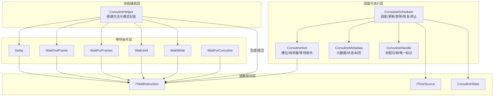
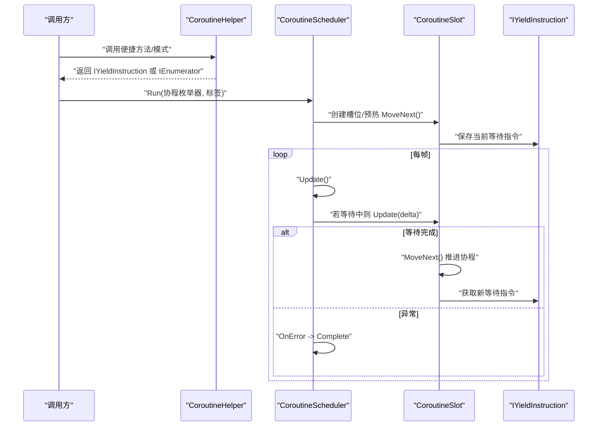
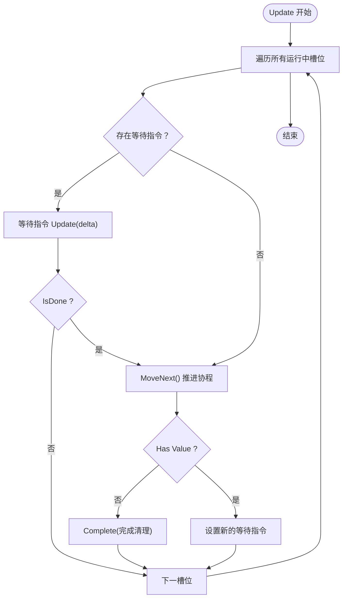
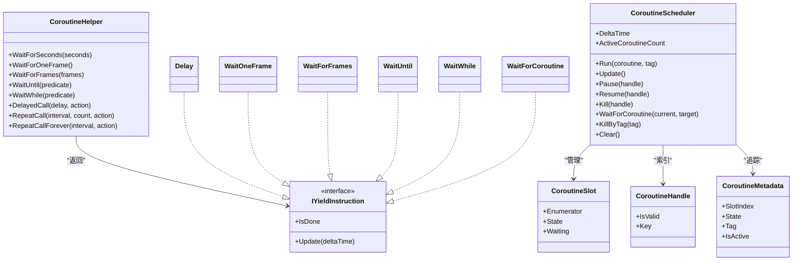

# 协程辅助工具

<cite>
**本文引用的文件**
- [CoroutineHelper.cs](file://GFramework.Core/coroutine/CoroutineHelper.cs)
- [CoroutineScheduler.cs](file://GFramework.Core/coroutine/CoroutineScheduler.cs)
- [CoroutineHandle.cs](file://GFramework.Core/coroutine/CoroutineHandle.cs)
- [CoroutineSlot.cs](file://GFramework.Core/coroutine/CoroutineSlot.cs)
- [CoroutineMetadata.cs](file://GFramework.Core/coroutine/CoroutineMetadata.cs)
- [Delay.cs](file://GFramework.Core/coroutine/Delay.cs)
- [WaitOneFrame.cs](file://GFramework.Core/coroutine/WaitOneFrame.cs)
- [WaitForFrames.cs](file://GFramework.Core/coroutine/WaitForFrames.cs)
- [WaitUntil.cs](file://GFramework.Core/coroutine/WaitUntil.cs)
- [WaitWhile.cs](file://GFramework.Core/coroutine/WaitWhile.cs)
- [WaitForCoroutine.cs](file://GFramework.Core/coroutine/WaitForCoroutine.cs)
- [CoroutineState.cs](file://GFramework.Core.Abstractions/coroutine/CoroutineState.cs)
- [IYieldInstruction.cs](file://GFramework.Core.Abstractions/coroutine/IYieldInstruction.cs)
- [ITimeSource.cs](file://GFramework.Core.Abstractions/coroutine/ITimeSource.cs)
- [CoroutineHelperTests.cs](file://GFramework.Core.Tests/coroutine/CoroutineHelperTests.cs)
- [CoroutineSchedulerTests.cs](file://GFramework.Core.Tests/coroutine/CoroutineSchedulerTests.cs)
</cite>

## 目录
1. [简介](#简介)
2. [项目结构](#项目结构)
3. [核心组件](#核心组件)
4. [架构总览](#架构总览)
5. [组件详解](#组件详解)
6. [依赖关系分析](#依赖关系分析)
7. [性能考量](#性能考量)
8. [故障排查指南](#故障排查指南)
9. [结论](#结论)
10. [附录](#附录)

## 简介
本技术文档围绕协程辅助工具类 CoroutineHelper 及其配套的协程调度与等待指令体系，系统阐述协程创建、管理、链式调用与组合模式、参数与结果处理、异常与错误传播、性能监控与调试、与异步任务的互操作、典型游戏场景应用模式、重构与维护建议，以及与第三方库的集成注意事项与兼容性方案。文档面向不同层次读者，既提供高层概览也给出代码级图示与来源标注，帮助快速理解并高效使用该协程基础设施。

## 项目结构
协程子系统位于 GFramework.Core 的 coroutine 目录，采用“辅助工具 + 调度器 + 等待指令”的分层设计：
- 辅助工具：CoroutineHelper 提供常用协程模式封装与便捷方法
- 调度器：CoroutineScheduler 负责协程生命周期管理、状态推进与异常处理
- 等待指令：Delay、WaitOneFrame、WaitForFrames、WaitUntil、WaitWhile、WaitForCoroutine 实现 IYieldInstruction
- 元数据与句柄：CoroutineHandle、CoroutineSlot、CoroutineMetadata 支持协程标识、槽位与状态追踪
- 抽象接口：IYieldInstruction、ITimeSource、CoroutineState 定义跨平台与跨框架的契约

图表来源
- [CoroutineHelper.cs](file://GFramework.Core/coroutine/CoroutineHelper.cs#L1-L101)
- [CoroutineScheduler.cs](file://GFramework.Core/coroutine/CoroutineScheduler.cs#L1-L392)
- [CoroutineHandle.cs](file://GFramework.Core/coroutine/CoroutineHandle.cs#L1-L94)
- [CoroutineSlot.cs](file://GFramework.Core/coroutine/CoroutineSlot.cs#L1-L24)
- [CoroutineMetadata.cs](file://GFramework.Core/coroutine/CoroutineMetadata.cs#L1-L32)
- [Delay.cs](file://GFramework.Core/coroutine/Delay.cs#L1-L29)
- [WaitForFrames.cs](file://GFramework.Core/coroutine/WaitForFrames.cs#L1-L29)
- [WaitOneFrame.cs](file://GFramework.Core/coroutine/WaitOneFrame.cs#L1-L26)
- [WaitUntil.cs](file://GFramework.Core/coroutine/WaitUntil.cs#L1-L26)
- [WaitWhile.cs](file://GFramework.Core/coroutine/WaitWhile.cs#L1-L26)
- [WaitForCoroutine.cs](file://GFramework.Core/coroutine/WaitForCoroutine.cs#L1-L29)
- [IYieldInstruction.cs](file://GFramework.Core.Abstractions/coroutine/IYieldInstruction.cs#L1-L18)
- [ITimeSource.cs](file://GFramework.Core.Abstractions/coroutine/ITimeSource.cs#L1-L22)
- [CoroutineState.cs](file://GFramework.Core.Abstractions/coroutine/CoroutineState.cs#L1-L32)

章节来源
- [CoroutineHelper.cs](file://GFramework.Core/coroutine/CoroutineHelper.cs#L1-L101)
- [CoroutineScheduler.cs](file://GFramework.Core/coroutine/CoroutineScheduler.cs#L1-L392)

## 核心组件
- 协程辅助工具 CoroutineHelper：提供 WaitForSeconds、WaitForOneFrame、WaitForFrames、WaitUntil、WaitWhile 等便捷方法；以及 DelayedCall、RepeatCall、RepeatCallForever 等常用协程模式封装，统一返回 IYieldInstruction 以便与调度器配合。
- 协程调度器 CoroutineScheduler：负责运行、更新、暂停、恢复、终止协程；支持按标签批量终止；支持协程间等待（WaitForCoroutine）；内置异常捕获与清理。
- 等待指令 IYieldInstruction 及其实现：Delay、WaitOneFrame、WaitForFrames、WaitUntil、WaitWhile、WaitForCoroutine，统一以 Update(deltaTime) 驱动状态推进，IsDone 控制协程前进。
- 协程句柄与元数据：CoroutineHandle 提供唯一标识与有效性判断；CoroutineSlot/CoroutineMetadata 管理枚举器、等待指令、状态与标签，支撑调度器的高效查询与管理。

章节来源
- [CoroutineHelper.cs](file://GFramework.Core/coroutine/CoroutineHelper.cs#L1-L101)
- [CoroutineScheduler.cs](file://GFramework.Core/coroutine/CoroutineScheduler.cs#L1-L392)
- [IYieldInstruction.cs](file://GFramework.Core.Abstractions/coroutine/IYieldInstruction.cs#L1-L18)
- [CoroutineHandle.cs](file://GFramework.Core/coroutine/CoroutineHandle.cs#L1-L94)
- [CoroutineSlot.cs](file://GFramework.Core/coroutine/CoroutineSlot.cs#L1-L24)
- [CoroutineMetadata.cs](file://GFramework.Core/coroutine/CoroutineMetadata.cs#L1-L32)

## 架构总览
下图展示了从协程辅助工具到调度器与等待指令的整体交互流程，体现“模式封装 → 指令驱动 → 调度推进 → 状态流转”的执行闭环。

图表来源
- [CoroutineHelper.cs](file://GFramework.Core/coroutine/CoroutineHelper.cs#L1-L101)
- [CoroutineScheduler.cs](file://GFramework.Core/coroutine/CoroutineScheduler.cs#L82-L121)
- [IYieldInstruction.cs](file://GFramework.Core.Abstractions/coroutine/IYieldInstruction.cs#L1-L18)

## 组件详解

### 协程辅助工具 CoroutineHelper
- 等待指令工厂
  - WaitForSeconds(seconds): 返回 Delay 指令，支持负数/零秒，内部以剩余时间递减判断完成
  - WaitForOneFrame(): 返回 WaitOneFrame 指令，首帧即完成
  - WaitForFrames(frames): 返回 WaitForFrames 指令，按帧递减计数
  - WaitUntil(predicate): 返回 WaitUntil 指令，基于谓词函数判断完成
  - WaitWhile(predicate): 返回 WaitWhile 指令，谓词为假时完成
- 常用协程模式
  - DelayedCall(delay, action): 延迟后执行动作，返回可推进的枚举器
  - RepeatCall(interval, count, action): 重复执行指定次数，每次间隔为 interval
  - RepeatCallForever(interval, action): 无限循环执行，适合心跳/节流任务
- 设计要点
  - 统一返回 IYieldInstruction 或 IEnumerator<IYieldInstruction>，便于与调度器无缝协作
  - 对外暴露简洁 API，隐藏等待指令细节，降低使用者心智负担
  - 对 null 动作进行安全处理，避免空引用导致的异常

章节来源
- [CoroutineHelper.cs](file://GFramework.Core/coroutine/CoroutineHelper.cs#L1-L101)
- [CoroutineHelperTests.cs](file://GFramework.Core.Tests/coroutine/CoroutineHelperTests.cs#L1-L342)

### 协程调度器 CoroutineScheduler
- 生命周期管理
  - Run(coroutine, tag): 分配句柄、创建槽位、预热推进一次 MoveNext()，记录元数据与标签
  - Update(): 遍历所有运行中的槽位，若等待指令未完成则 Update(delta)，完成后 MoveNext() 获取新指令；异常被捕获并清理
  - Pause/Resume/Kill: 精确控制协程状态；Kill 后唤醒等待者
  - WaitForCoroutine(current, target): 当前协程进入 Held 状态，等待目标协程完成后自动恢复
  - KillByTag(tag)/Clear(): 批量终止与清空
- 性能与容量
  - 内部使用定长数组槽位，满载时按倍数扩容
  - 使用字典维护元数据、标签集合与等待映射，保证 O(1) 查找与更新
- 错误处理
  - 捕获协程执行期间的异常，输出错误日志并完成该协程，避免影响其他协程

图表来源
- [CoroutineScheduler.cs](file://GFramework.Core/coroutine/CoroutineScheduler.cs#L82-L121)
- [CoroutineScheduler.cs](file://GFramework.Core/coroutine/CoroutineScheduler.cs#L291-L334)

章节来源
- [CoroutineScheduler.cs](file://GFramework.Core/coroutine/CoroutineScheduler.cs#L1-L392)
- [CoroutineSchedulerTests.cs](file://GFramework.Core.Tests/coroutine/CoroutineSchedulerTests.cs#L1-L492)

### 协程句柄与元数据
- CoroutineHandle
  - 通过静态索引与实例 ID 计算唯一 ID，Key 用于区分实例槽位，IsValid 判断有效性
  - 支持相等性比较与哈希，适合作为字典键或集合元素
- CoroutineSlot
  - 保存枚举器、当前状态与等待指令，是调度器推进协程的最小执行单元
- CoroutineMetadata
  - 记录槽位索引、状态、标签，提供 IsActive 快速判断活跃状态

章节来源
- [CoroutineHandle.cs](file://GFramework.Core/coroutine/CoroutineHandle.cs#L1-L94)
- [CoroutineSlot.cs](file://GFramework.Core/coroutine/CoroutineSlot.cs#L1-L24)
- [CoroutineMetadata.cs](file://GFramework.Core/coroutine/CoroutineMetadata.cs#L1-L32)

### 等待指令 IYieldInstruction 及其实现
- IYieldInstruction
  - 定义 Update(deltaTime) 与 IsDone 属性，作为协程推进的统一契约
- Delay
  - 基于剩余时间递减，适合通用延时
- WaitOneFrame
  - 首帧完成，适合简单帧同步
- WaitForFrames
  - 帧计数递减，最小值为 1
- WaitUntil/WaitWhile
  - 基于谓词函数，前者满足即完成，后者为假时完成
- WaitForCoroutine
  - 由调度器内部使用，标记等待目标协程完成后自身完成

章节来源
- [IYieldInstruction.cs](file://GFramework.Core.Abstractions/coroutine/IYieldInstruction.cs#L1-L18)
- [Delay.cs](file://GFramework.Core/coroutine/Delay.cs#L1-L29)
- [WaitOneFrame.cs](file://GFramework.Core/coroutine/WaitOneFrame.cs#L1-L26)
- [WaitForFrames.cs](file://GFramework.Core/coroutine/WaitForFrames.cs#L1-L29)
- [WaitUntil.cs](file://GFramework.Core/coroutine/WaitUntil.cs#L1-L26)
- [WaitWhile.cs](file://GFramework.Core/coroutine/WaitWhile.cs#L1-L26)
- [WaitForCoroutine.cs](file://GFramework.Core/coroutine/WaitForCoroutine.cs#L1-L29)

### 协程链式调用与组合模式
- 组合策略
  - 将多个等待指令与动作组合为一个 IEnumerator，形成链式调用：先等待，再执行，再等待，再执行……
  - 通过 DelayedCall/RepeatCall/RepeatCallForever 与 WaitForSeconds/WaitForFrames 等指令组合，构建复杂流程
- 协程间等待
  - 使用 WaitForCoroutine 使当前协程在目标协程完成后继续执行，实现串行化编排
- 参数与结果
  - 通过闭包捕获外部变量实现参数传递；结果可通过回调或共享状态上报
  - 注意避免捕获大对象导致的内存压力，必要时使用轻量参数或上下文对象

章节来源
- [CoroutineHelper.cs](file://GFramework.Core/coroutine/CoroutineHelper.cs#L65-L100)
- [CoroutineScheduler.cs](file://GFramework.Core/coroutine/CoroutineScheduler.cs#L188-L215)

### 协程参数传递与结果返回
- 参数传递
  - 在协程枚举器内通过闭包访问外部作用域变量，实现无显式入参的参数注入
  - 对于多参数场景，可将参数打包为匿名对象或专用结构体，提升可读性与可维护性
- 结果返回
  - 通过回调、事件总线或共享状态上报结果
  - 对于一次性结果，可在协程末尾触发事件或写入上下文对象
- 最佳实践
  - 避免在协程中长时间持有大型对象引用
  - 使用弱引用或延迟释放策略，防止内存泄漏

章节来源
- [CoroutineHelper.cs](file://GFramework.Core/coroutine/CoroutineHelper.cs#L65-L100)

### 协程异常处理与错误传播
- 异常捕获
  - 调度器在推进协程时捕获异常，输出错误日志并完成该协程，避免异常扩散
- 错误传播
  - 对于需要上抛的错误，可在协程末尾抛出或通过回调/事件通知调用方
  - 对关键路径增加重试或降级策略，确保系统稳定性
- 调试建议
  - 为协程打标签，便于按标签定位与终止
  - 在关键节点输出日志，记录当前等待指令与状态

章节来源
- [CoroutineScheduler.cs](file://GFramework.Core/coroutine/CoroutineScheduler.cs#L116-L120)
- [CoroutineScheduler.cs](file://GFramework.Core/coroutine/CoroutineScheduler.cs#L341-L345)

### 性能监控与调试工具
- 性能指标
  - ActiveCoroutineCount：监控活跃协程数量，识别潜在泄漏
  - DeltaTime：验证时间源更新频率与帧率一致性
- 调试手段
  - KillByTag：按场景/阶段快速终止协程
  - Clear：在场景切换或重启时清理残留协程
  - 日志：在异常处理与完成阶段输出错误与统计信息
- 优化建议
  - 合理设置 initialCapacity，减少扩容开销
  - 使用 WaitOneFrame/WaitForFrames 替代过短的 Delay，降低频繁推进成本
  - 避免在 Update 中执行重型逻辑，将耗时任务拆分为多帧

章节来源
- [CoroutineScheduler.cs](file://GFramework.Core/coroutine/CoroutineScheduler.cs#L28-L33)
- [CoroutineScheduler.cs](file://GFramework.Core/coroutine/CoroutineScheduler.cs#L241-L254)
- [CoroutineScheduler.cs](file://GFramework.Core/coroutine/CoroutineScheduler.cs#L350-L353)

### 与异步任务(Task)的互操作性
- 协程到 Task
  - 将协程封装为 Task：在协程完成时触发 Task 完成，或通过回调桥接
- Task 到协程
  - 将 Task 包装为等待指令：在 Task 完成时标记等待指令完成，协程继续推进
- 注意事项
  - 避免在 Update 中阻塞调度器线程
  - 在 Unity 等主线程模型中，注意切换线程上下文与同步点

（本小节为概念性指导，不直接分析具体文件）

### 典型游戏场景应用模式
- 加载进度
  - 使用 RepeatCallForever 以固定间隔推进进度条，结合 WaitWhile 监听资源状态
- 动画序列
  - 使用 WaitForSeconds/WaitForFrames 组合实现多段动画的顺序播放
- AI 行为
  - 使用 WaitUntil/WaitWhile 实现条件驱动的行为切换与等待
- 用户交互
  - 使用 DelayedCall 实现点击反馈、倒计时提示等

（本小节为概念性指导，不直接分析具体文件）

### 重构技巧与维护性改进建议
- 抽象与解耦
  - 将等待条件抽取为独立函数，提升可测试性与复用性
  - 将动作封装为可注入的委托或服务，便于替换与模拟
- 可观测性
  - 为协程添加标签与日志，建立统一的可观测体系
- 可靠性
  - 对外暴露超时与取消机制，避免协程长期悬挂
- 可测试性
  - 使用 TestTimeSource 驱动时间推进，编写稳定的单元测试

章节来源
- [CoroutineHelperTests.cs](file://GFramework.Core.Tests/coroutine/CoroutineHelperTests.cs#L1-L342)
- [CoroutineSchedulerTests.cs](file://GFramework.Core.Tests/coroutine/CoroutineSchedulerTests.cs#L1-L492)

### 与第三方库集成的注意事项与兼容性方案
- 接口对齐
  - 确保第三方时间源实现 ITimeSource，等待指令实现 IYieldInstruction
- 线程模型
  - 在单线程 UI 框架中，确保协程推进与 UI 更新在同一上下文中进行
- 资源管理
  - 对第三方资源（如信号、事件）提供统一的注销与回收机制，避免泄漏
- 版本兼容
  - 通过抽象层隔离具体实现，便于在不同版本间平滑迁移

（本小节为概念性指导，不直接分析具体文件）

## 依赖关系分析
- 协助工具依赖等待指令与调度器契约
- 调度器依赖时间源与状态枚举
- 等待指令实现统一接口，彼此独立，便于组合
- 句柄与元数据为调度器提供索引与状态追踪能力

图表来源
- [CoroutineHelper.cs](file://GFramework.Core/coroutine/CoroutineHelper.cs#L1-L101)
- [CoroutineScheduler.cs](file://GFramework.Core/coroutine/CoroutineScheduler.cs#L1-L392)
- [CoroutineHandle.cs](file://GFramework.Core/coroutine/CoroutineHandle.cs#L1-L94)
- [CoroutineSlot.cs](file://GFramework.Core/coroutine/CoroutineSlot.cs#L1-L24)
- [CoroutineMetadata.cs](file://GFramework.Core/coroutine/CoroutineMetadata.cs#L1-L32)
- [IYieldInstruction.cs](file://GFramework.Core.Abstractions/coroutine/IYieldInstruction.cs#L1-L18)
- [Delay.cs](file://GFramework.Core/coroutine/Delay.cs#L1-L29)
- [WaitOneFrame.cs](file://GFramework.Core/coroutine/WaitOneFrame.cs#L1-L26)
- [WaitForFrames.cs](file://GFramework.Core/coroutine/WaitForFrames.cs#L1-L29)
- [WaitUntil.cs](file://GFramework.Core/coroutine/WaitUntil.cs#L1-L26)
- [WaitWhile.cs](file://GFramework.Core/coroutine/WaitWhile.cs#L1-L26)
- [WaitForCoroutine.cs](file://GFramework.Core/coroutine/WaitForCoroutine.cs#L1-L29)

## 性能考量
- 槽位容量与扩容
  - 初始容量应结合场景并发协程峰值估算，减少扩容次数
- 等待指令选择
  - 长时间等待优先使用 Delay，短等待优先使用 WaitOneFrame/WaitForFrames，避免微小间隔导致的高推进频率
- 异常与清理
  - 异常会触发完成清理，避免协程堆积；但频繁异常仍会影响性能，需在业务层规避
- 并发与锁
  - 当前实现为单线程推进，无需额外并发控制；若扩展为多线程，需引入锁或无锁队列

（本节为通用指导，不直接分析具体文件）

## 故障排查指南
- 常见问题
  - 协程不前进：检查等待指令是否正确推进，确认 Update(delta) 是否被调用
  - 协程无法终止：确认句柄是否有效，标签是否正确，是否存在相互等待
  - 异常导致协程中断：查看错误日志，定位异常抛出点并修复
- 调试步骤
  - 为协程添加标签，使用 KillByTag 快速定位
  - 在关键节点输出当前等待指令类型与状态
  - 使用 Clear 在极端情况下快速清理

章节来源
- [CoroutineScheduler.cs](file://GFramework.Core/coroutine/CoroutineScheduler.cs#L341-L345)
- [CoroutineSchedulerTests.cs](file://GFramework.Core.Tests/coroutine/CoroutineSchedulerTests.cs#L294-L320)

## 结论
CoroutineHelper 与 CoroutineScheduler 构成了简洁而强大的协程基础设施：前者提供易用的模式封装与等待指令工厂，后者提供高效的调度与状态管理。通过统一的 IYieldInstruction 契约与完善的异常处理，该体系能够稳定支撑加载、动画、AI 等多种游戏场景。配合标签管理、性能监控与可测试性设计，开发者可以更高效地构建可维护的协程逻辑。

## 附录
- 关键 API 速查
  - 等待指令：WaitForSeconds、WaitForOneFrame、WaitForFrames、WaitUntil、WaitWhile
  - 协程模式：DelayedCall、RepeatCall、RepeatCallForever
  - 调度控制：Run、Update、Pause、Resume、Kill、WaitForCoroutine、KillByTag、Clear
- 测试参考
  - 单元测试覆盖了等待指令行为、协程模式执行、异常处理与调度器状态管理

章节来源
- [CoroutineHelperTests.cs](file://GFramework.Core.Tests/coroutine/CoroutineHelperTests.cs#L1-L342)
- [CoroutineSchedulerTests.cs](file://GFramework.Core.Tests/coroutine/CoroutineSchedulerTests.cs#L1-L492)