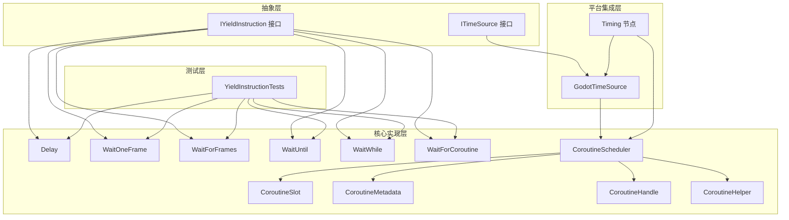
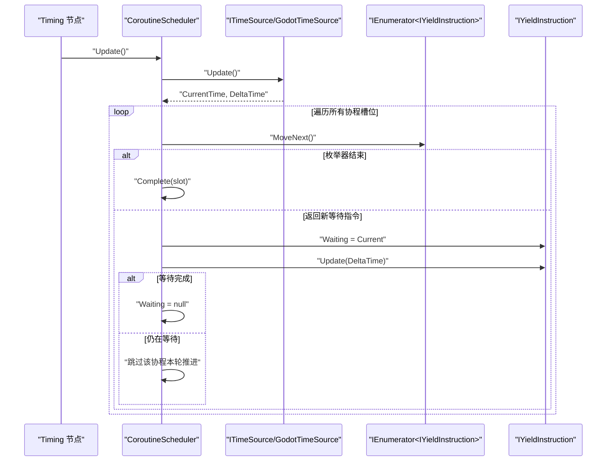
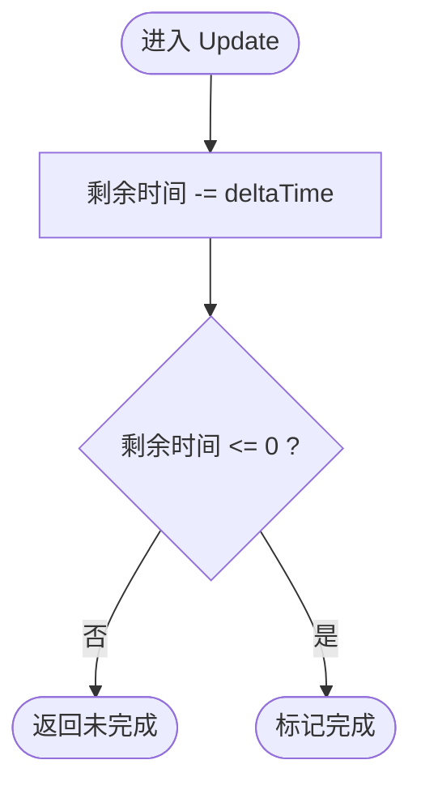
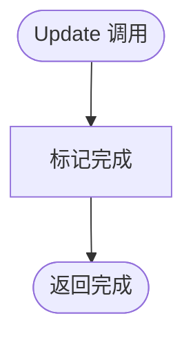
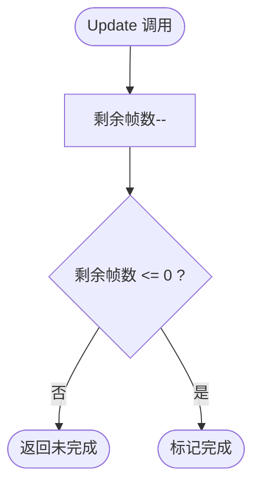
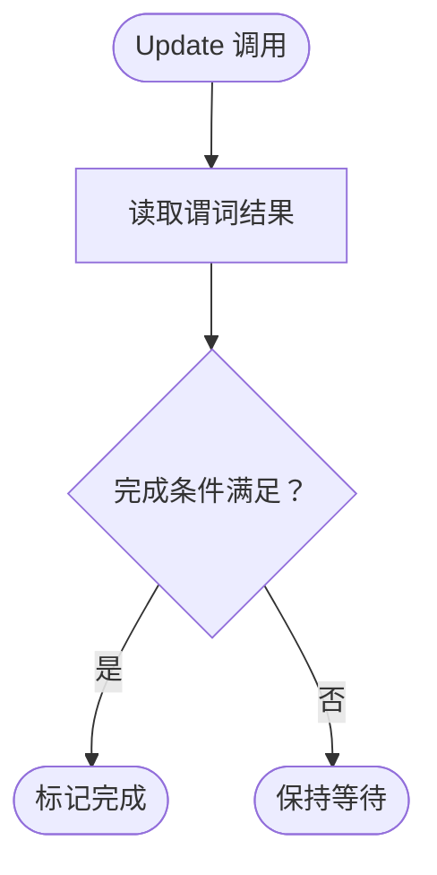
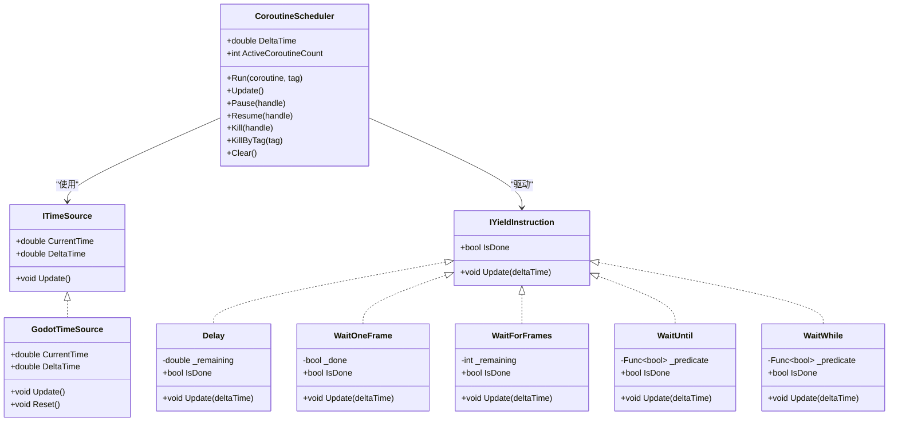
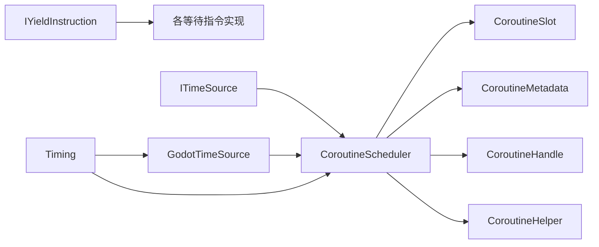

# 等待指令系统

<cite>
**本文档引用的文件**
- [IYieldInstruction.cs](file://GFramework.Core.Abstractions/coroutine/IYieldInstruction.cs)
- [ITimeSource.cs](file://GFramework.Core.Abstractions/coroutine/ITimeSource.cs)
- [Delay.cs](file://GFramework.Core/coroutine/Delay.cs)
- [WaitOneFrame.cs](file://GFramework.Core/coroutine/WaitOneFrame.cs)
- [WaitForFrames.cs](file://GFramework.Core/coroutine/WaitForFrames.cs)
- [WaitUntil.cs](file://GFramework.Core/coroutine/WaitUntil.cs)
- [WaitWhile.cs](file://GFramework.Core/coroutine/WaitWhile.cs)
- [WaitForCoroutine.cs](file://GFramework.Core/coroutine/WaitForCoroutine.cs)
- [CoroutineScheduler.cs](file://GFramework.Core/coroutine/CoroutineScheduler.cs)
- [CoroutineSlot.cs](file://GFramework.Core/coroutine/CoroutineSlot.cs)
- [CoroutineMetadata.cs](file://GFramework.Core/coroutine/CoroutineMetadata.cs)
- [CoroutineHandle.cs](file://GFramework.Core/coroutine/CoroutineHandle.cs)
- [CoroutineHelper.cs](file://GFramework.Core/coroutine/CoroutineHelper.cs)
- [GodotTimeSource.cs](file://GFramework.Godot/coroutine/GodotTimeSource.cs)
- [Timing.cs](file://GFramework.Godot/coroutine/Timing.cs)
- [YieldInstructionTests.cs](file://GFramework.Core.Tests/coroutine/YieldInstructionTests.cs)
</cite>

## 目录
1. [简介](#简介)
2. [项目结构](#项目结构)
3. [核心组件](#核心组件)
4. [架构总览](#架构总览)
5. [详细组件分析](#详细组件分析)
6. [依赖关系分析](#依赖关系分析)
7. [性能考量](#性能考量)
8. [故障排查指南](#故障排查指南)
9. [结论](#结论)
10. [附录](#附录)

## 简介
本文件面向游戏开发中的协程等待指令系统，提供完整的API文档与使用指南。内容涵盖等待指令接口设计、各等待指令的实现原理与使用场景、调度器工作流、时间源抽象、在Godot平台的集成方式、性能对比与选择建议、复杂等待组合的最佳实践，以及调试技巧与常见陷阱。

## 项目结构
等待指令系统由“抽象接口层”“核心实现层”“平台集成层”“测试验证层”构成：
- 抽象接口层：定义等待指令与时间源的契约，确保跨平台可替换性
- 核心实现层：提供具体等待指令与调度器、句柄、元数据、槽位等
- 平台集成层：Godot时间源与Timing节点，提供三段式（Process/PhysicsProcess/Deferred）协程调度
- 测试验证层：对各等待指令行为进行单元测试，覆盖边界与正确性

图表来源
- [IYieldInstruction.cs](file://GFramework.Core.Abstractions/coroutine/IYieldInstruction.cs#L1-L18)
- [ITimeSource.cs](file://GFramework.Core.Abstractions/coroutine/ITimeSource.cs#L1-L22)
- [Delay.cs](file://GFramework.Core/coroutine/Delay.cs#L1-L29)
- [WaitOneFrame.cs](file://GFramework.Core/coroutine/WaitOneFrame.cs#L1-L26)
- [WaitForFrames.cs](file://GFramework.Core/coroutine/WaitForFrames.cs#L1-L29)
- [WaitUntil.cs](file://GFramework.Core/coroutine/WaitUntil.cs#L1-L26)
- [WaitWhile.cs](file://GFramework.Core/coroutine/WaitWhile.cs#L1-L26)
- [WaitForCoroutine.cs](file://GFramework.Core/coroutine/WaitForCoroutine.cs#L1-L29)
- [CoroutineScheduler.cs](file://GFramework.Core/coroutine/CoroutineScheduler.cs#L1-L392)
- [CoroutineSlot.cs](file://GFramework.Core/coroutine/CoroutineSlot.cs#L1-L24)
- [CoroutineMetadata.cs](file://GFramework.Core/coroutine/CoroutineMetadata.cs#L1-L32)
- [CoroutineHandle.cs](file://GFramework.Core/coroutine/CoroutineHandle.cs#L1-L94)
- [CoroutineHelper.cs](file://GFramework.Core/coroutine/CoroutineHelper.cs#L1-L101)
- [GodotTimeSource.cs](file://GFramework.Godot/coroutine/GodotTimeSource.cs#L1-L44)
- [Timing.cs](file://GFramework.Godot/coroutine/Timing.cs#L1-L518)
- [YieldInstructionTests.cs](file://GFramework.Core.Tests/coroutine/YieldInstructionTests.cs#L1-L397)

章节来源
- [IYieldInstruction.cs](file://GFramework.Core.Abstractions/coroutine/IYieldInstruction.cs#L1-L18)
- [ITimeSource.cs](file://GFramework.Core.Abstractions/coroutine/ITimeSource.cs#L1-L22)
- [CoroutineScheduler.cs](file://GFramework.Core/coroutine/CoroutineScheduler.cs#L1-L392)

## 核心组件
- IYieldInstruction：等待指令契约，定义每帧更新与完成判定
- ITimeSource：时间源契约，提供当前时间与时间增量
- Delay：基于时间的延迟等待
- WaitOneFrame：单帧等待
- WaitForFrames：按帧数等待
- WaitUntil/WaitWhile：基于布尔谓词的条件等待
- WaitForCoroutine：等待另一个协程完成
- CoroutineScheduler：协程调度器，驱动等待指令与推进协程
- CoroutineSlot/Metadata/Handle：调度器内部数据结构
- CoroutineHelper：等待指令工厂与常用组合
- GodotTimeSource/Timing：Godot平台的时间源与三段式调度入口

章节来源
- [IYieldInstruction.cs](file://GFramework.Core.Abstractions/coroutine/IYieldInstruction.cs#L1-L18)
- [ITimeSource.cs](file://GFramework.Core.Abstractions/coroutine/ITimeSource.cs#L1-L22)
- [CoroutineScheduler.cs](file://GFramework.Core/coroutine/CoroutineScheduler.cs#L1-L392)
- [CoroutineSlot.cs](file://GFramework.Core/coroutine/CoroutineSlot.cs#L1-L24)
- [CoroutineMetadata.cs](file://GFramework.Core/coroutine/CoroutineMetadata.cs#L1-L32)
- [CoroutineHandle.cs](file://GFramework.Core/coroutine/CoroutineHandle.cs#L1-L94)
- [CoroutineHelper.cs](file://GFramework.Core/coroutine/CoroutineHelper.cs#L1-L101)
- [GodotTimeSource.cs](file://GFramework.Godot/coroutine/GodotTimeSource.cs#L1-L44)
- [Timing.cs](file://GFramework.Godot/coroutine/Timing.cs#L1-L518)

## 架构总览
等待指令系统采用“接口抽象 + 可插拔时间源 + 调度器驱动”的架构。调度器在每帧读取时间源增量，驱动当前等待指令更新，若完成则推进协程枚举器；若遇到新的等待指令则切换等待对象。

图表来源
- [Timing.cs](file://GFramework.Godot/coroutine/Timing.cs#L135-L165)
- [CoroutineScheduler.cs](file://GFramework.Core/coroutine/CoroutineScheduler.cs#L80-L121)
- [ITimeSource.cs](file://GFramework.Core.Abstractions/coroutine/ITimeSource.cs#L1-L22)
- [GodotTimeSource.cs](file://GFramework.Godot/coroutine/GodotTimeSource.cs#L25-L44)

## 详细组件分析

### IYieldInstruction 接口与实现规范
- 设计要点
  - 每帧由调度器调用 Update(deltaTime)，用于更新内部状态
  - IsDone 用于表达等待是否完成，调度器据此决定是否推进协程
  - 实现应保持幂等与无副作用，避免在 Update 中产生不可预期的外部状态变化
- 实现约定
  - 对于时间型等待，应在 Update 中消耗剩余时间并更新完成标志
  - 对于帧型等待，应在 Update 中减少剩余帧数或标记完成
  - 对于条件等待，应在 Update 中保持空实现，完成标志由 IsDone 的谓词决定

章节来源
- [IYieldInstruction.cs](file://GFramework.Core.Abstractions/coroutine/IYieldInstruction.cs#L1-L18)

### Delay 时间延迟机制
- 功能概述
  - 基于秒数的绝对时间等待，内部维护剩余时间并在每帧递减
- 关键行为
  - 初始剩余时间为最大值（秒数取非负），Update 递减剩余时间
  - 完成条件为剩余时间小于等于 0
- 精确度与性能
  - 精确度受 DeltaTime 影响，建议在高帧率场景下注意累积误差
  - 性能开销极小，仅需一次浮点减法与一次比较
- 使用建议
  - 适合通用延迟、节流、倒计时等场景
  - 与 RepeatCall/RepeatCallForever 组合可实现周期性任务

图表来源
- [Delay.cs](file://GFramework.Core/coroutine/Delay.cs#L14-L28)

章节来源
- [Delay.cs](file://GFramework.Core/coroutine/Delay.cs#L1-L29)
- [YieldInstructionTests.cs](file://GFramework.Core.Tests/coroutine/YieldInstructionTests.cs#L20-L66)

### WaitOneFrame 单帧等待
- 功能概述
  - 等待恰好一帧，常用于“下一帧再执行”的语义
- 关键行为
  - Update 第一次调用即标记完成
  - 适合需要严格帧序控制的场景
- 性能
  - 开销极低，仅一次布尔赋值
- 使用建议
  - 与动画同步、UI刷新节奏配合
  - 注意与其他按帧等待指令叠加时的语义

图表来源
- [WaitOneFrame.cs](file://GFramework.Core/coroutine/WaitOneFrame.cs#L17-L25)

章节来源
- [WaitOneFrame.cs](file://GFramework.Core/coroutine/WaitOneFrame.cs#L1-L26)
- [YieldInstructionTests.cs](file://GFramework.Core.Tests/coroutine/YieldInstructionTests.cs#L68-L89)

### WaitForFrames 帧等待
- 功能概述
  - 等待固定帧数，内部维护剩余帧数并在每帧递减
- 关键行为
  - 最小等待帧数为 1，0 或负数均视为 1 帧
  - 每次 Update 减少 1 帧，完成条件为剩余帧数 ≤ 0
- 性能
  - 每帧一次整数递减与比较，开销极低
- 使用建议
  - 适合与渲染/物理更新节奏对齐的任务
  - 与 Delay 组合可实现“先延迟 N 秒，再等待 M 帧”的复合效果

图表来源
- [WaitForFrames.cs](file://GFramework.Core/coroutine/WaitForFrames.cs#L20-L28)

章节来源
- [WaitForFrames.cs](file://GFramework.Core/coroutine/WaitForFrames.cs#L1-L29)
- [YieldInstructionTests.cs](file://GFramework.Core.Tests/coroutine/YieldInstructionTests.cs#L92-L154)

### WaitUntil 与 WaitWhile 条件等待
- 功能概述
  - WaitUntil：当谓词返回 true 时完成
  - WaitWhile：当谓词返回 false 时完成（即“条件为真时继续等待”）
- 关键行为
  - Update 为空实现，完成标志直接由谓词结果决定
  - 谓词必须稳定、无副作用，避免外部状态在 Update 期间被修改
- 性能
  - 每帧一次谓词调用与一次布尔比较
  - 建议谓词逻辑轻量，避免阻塞或昂贵运算
- 使用建议
  - WaitUntil 适合“等待某事件发生”
  - WaitWhile 适合“持续等待某条件不再满足”

图表来源
- [WaitUntil.cs](file://GFramework.Core/coroutine/WaitUntil.cs#L17-L25)
- [WaitWhile.cs](file://GFramework.Core/coroutine/WaitWhile.cs#L17-L25)

章节来源
- [WaitUntil.cs](file://GFramework.Core/coroutine/WaitUntil.cs#L1-L26)
- [WaitWhile.cs](file://GFramework.Core/coroutine/WaitWhile.cs#L1-L26)
- [YieldInstructionTests.cs](file://GFramework.Core.Tests/coroutine/YieldInstructionTests.cs#L173-L274)

### WaitForCoroutine 等待协程完成
- 功能概述
  - 等待另一个协程完成，通常通过调度器的等待机制实现
- 关键行为
  - Update 不改变状态，完成标志由外部标记（内部方法）控制
  - 一般通过调度器的“等待协程”机制唤醒当前协程
- 使用建议
  - 适合协程间同步执行顺序
  - 注意避免自等待（调度器会拒绝）

章节来源
- [WaitForCoroutine.cs](file://GFramework.Core/coroutine/WaitForCoroutine.cs#L1-L29)
- [CoroutineScheduler.cs](file://GFramework.Core/coroutine/CoroutineScheduler.cs#L188-L215)

### 调度器与时间源
- CoroutineScheduler
  - 管理协程槽位、元数据与等待集合，负责推进协程与处理异常
  - 每帧更新时先驱动等待指令，再推进协程枚举器
  - 支持暂停/恢复/终止/按标签终止/清空等控制
- ITimeSource/GodotTimeSource
  - 提供 DeltaTime 与 CurrentTime，GodotTimeSource 从引擎获取增量时间并累加总时间
- Timing（Godot）
  - 提供三段式调度：Process/PhysicsProcess/Deferred
  - 每帧驱动对应调度器，支持延迟调用与协程控制 API

图表来源
- [IYieldInstruction.cs](file://GFramework.Core.Abstractions/coroutine/IYieldInstruction.cs#L1-L18)
- [ITimeSource.cs](file://GFramework.Core.Abstractions/coroutine/ITimeSource.cs#L1-L22)
- [Delay.cs](file://GFramework.Core/coroutine/Delay.cs#L1-L29)
- [WaitOneFrame.cs](file://GFramework.Core/coroutine/WaitOneFrame.cs#L1-L26)
- [WaitForFrames.cs](file://GFramework.Core/coroutine/WaitForFrames.cs#L1-L29)
- [WaitUntil.cs](file://GFramework.Core/coroutine/WaitUntil.cs#L1-L26)
- [WaitWhile.cs](file://GFramework.Core/coroutine/WaitWhile.cs#L1-L26)
- [CoroutineScheduler.cs](file://GFramework.Core/coroutine/CoroutineScheduler.cs#L1-L392)
- [GodotTimeSource.cs](file://GFramework.Godot/coroutine/GodotTimeSource.cs#L1-L44)

章节来源
- [CoroutineScheduler.cs](file://GFramework.Core/coroutine/CoroutineScheduler.cs#L1-L392)
- [CoroutineSlot.cs](file://GFramework.Core/coroutine/CoroutineSlot.cs#L1-L24)
- [CoroutineMetadata.cs](file://GFramework.Core/coroutine/CoroutineMetadata.cs#L1-L32)
- [CoroutineHandle.cs](file://GFramework.Core/coroutine/CoroutineHandle.cs#L1-L94)
- [CoroutineHelper.cs](file://GFramework.Core/coroutine/CoroutineHelper.cs#L1-L101)
- [GodotTimeSource.cs](file://GFramework.Godot/coroutine/GodotTimeSource.cs#L1-L44)
- [Timing.cs](file://GFramework.Godot/coroutine/Timing.cs#L1-L518)

## 依赖关系分析
- 组件耦合
  - IYieldInstruction 是所有等待指令的统一契约，降低调度器与具体等待逻辑的耦合
  - ITimeSource 抽象时间源，使调度器可在不同平台复用
  - Timing 将调度器与 Godot 的生命周期绑定，提供三段式调度入口
- 外部依赖
  - GodotTimeSource 依赖引擎提供的增量时间函数
  - 调度器内部使用字典与数组管理协程，注意扩容与内存占用
- 循环依赖
  - 未发现直接循环依赖；WaitForCoroutine 通过调度器等待集合间接关联

图表来源
- [IYieldInstruction.cs](file://GFramework.Core.Abstractions/coroutine/IYieldInstruction.cs#L1-L18)
- [ITimeSource.cs](file://GFramework.Core.Abstractions/coroutine/ITimeSource.cs#L1-L22)
- [CoroutineScheduler.cs](file://GFramework.Core/coroutine/CoroutineScheduler.cs#L1-L392)
- [CoroutineSlot.cs](file://GFramework.Core/coroutine/CoroutineSlot.cs#L1-L24)
- [CoroutineMetadata.cs](file://GFramework.Core/coroutine/CoroutineMetadata.cs#L1-L32)
- [CoroutineHandle.cs](file://GFramework.Core/coroutine/CoroutineHandle.cs#L1-L94)
- [CoroutineHelper.cs](file://GFramework.Core/coroutine/CoroutineHelper.cs#L1-L101)
- [GodotTimeSource.cs](file://GFramework.Godot/coroutine/GodotTimeSource.cs#L1-L44)
- [Timing.cs](file://GFramework.Godot/coroutine/Timing.cs#L1-L518)

章节来源
- [CoroutineScheduler.cs](file://GFramework.Core/coroutine/CoroutineScheduler.cs#L1-L392)
- [Timing.cs](file://GFramework.Godot/coroutine/Timing.cs#L1-L518)

## 性能考量
- 时间型 vs 帧型 vs 条件型
  - Delay：每帧一次浮点减法与比较，开销极低
  - WaitOneFrame/WaitForFrames：整数递减与比较，开销极低
  - WaitUntil/WaitWhile：每帧一次谓词调用与比较，开销取决于谓词复杂度
- 选择建议
  - 需要与帧率解耦的延迟：优先 Delay
  - 需要与渲染/物理节奏对齐：优先 WaitForFrames
  - 需要语义化条件：优先 WaitUntil/WaitWhile
  - 复杂等待组合：建议拆分为多个简单指令，便于调试与性能分析
- 优化技巧
  - 将谓词逻辑尽量轻量化，避免在 Update 中执行昂贵操作
  - 合理使用标签与句柄，避免大规模遍历
  - 控制并发协程数量，防止调度器扩容与内存压力

[本节为通用性能指导，无需特定文件引用]

## 故障排查指南
- 常见问题
  - 条件等待永不完成：检查谓词是否可终止，避免无限循环
  - 帧等待异常提前完成：确认传入帧数为正整数，注意最小帧数约束
  - 协程卡住：检查是否有未完成的等待指令或异常被捕获并导致提前结束
  - 自等待异常：WaitForCoroutine 不允许等待自身
- 调试技巧
  - 使用测试用例验证边界行为（零/负数秒、零帧、谓词瞬时满足）
  - 在 Timing 节点中观察各段活跃协程数量
  - 通过标签批量终止协程，定位问题协程
- 常见陷阱
  - 在 Update 中修改共享状态导致谓词不稳定
  - 忽略异常处理，导致协程意外结束
  - 过度依赖高频率轮询，造成性能问题

章节来源
- [YieldInstructionTests.cs](file://GFramework.Core.Tests/coroutine/YieldInstructionTests.cs#L1-L397)
- [CoroutineScheduler.cs](file://GFramework.Core/coroutine/CoroutineScheduler.cs#L336-L345)
- [Timing.cs](file://GFramework.Godot/coroutine/Timing.cs#L80-L96)

## 结论
等待指令系统通过清晰的接口抽象与可插拔时间源，提供了高效、可组合的协程等待能力。在 Godot 平台上，Timing 节点进一步将调度器与引擎生命周期绑定，支持多段式调度。合理选择等待指令、遵循实现规范与性能建议，可显著提升游戏开发中的异步流程可控性与稳定性。

[本节为总结性内容，无需特定文件引用]

## 附录

### API 一览与使用建议
- Delay(seconds)
  - 适用：通用延迟、节流、倒计时
  - 建议：与 RepeatCall/RepeatCallForever 组合
- WaitOneFrame()
  - 适用：严格帧序控制
  - 建议：与动画/UI刷新节奏配合
- WaitForFrames(frames)
  - 适用：与渲染/物理节奏对齐
  - 建议：最小帧数为 1，避免 0/- 帧
- WaitUntil(predicate)
  - 适用：等待事件发生
  - 建议：谓词稳定、无副作用
- WaitWhile(predicate)
  - 适用：持续等待条件不再满足
  - 建议：谓词稳定、无副作用
- WaitForCoroutine()
  - 适用：协程间同步
  - 建议：避免自等待，使用调度器等待机制

章节来源
- [CoroutineHelper.cs](file://GFramework.Core/coroutine/CoroutineHelper.cs#L1-L101)
- [YieldInstructionTests.cs](file://GFramework.Core.Tests/coroutine/YieldInstructionTests.cs#L1-L397)

### 典型应用场景
- 动画同步：使用 WaitForFrames 对齐关键帧
- 延迟执行：使用 Delay 实现延迟调用
- 条件触发：使用 WaitUntil/WaitWhile 实现事件驱动
- 复杂等待组合：将多个简单等待指令串联，形成清晰的流程图

[本节为概念性内容，无需特定文件引用]