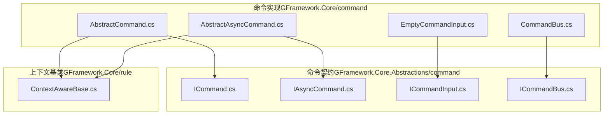
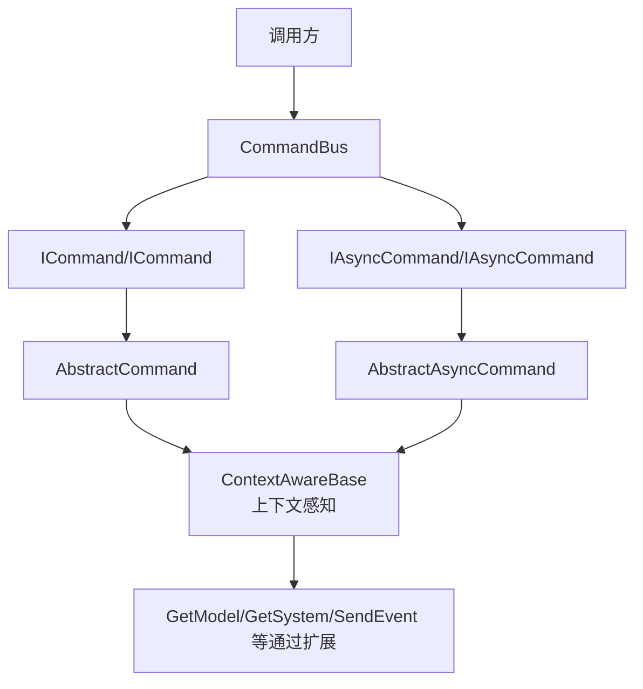
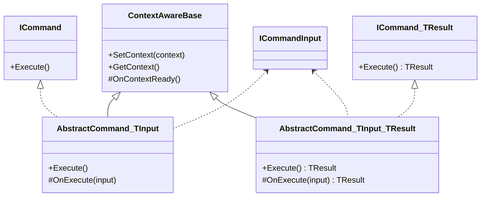
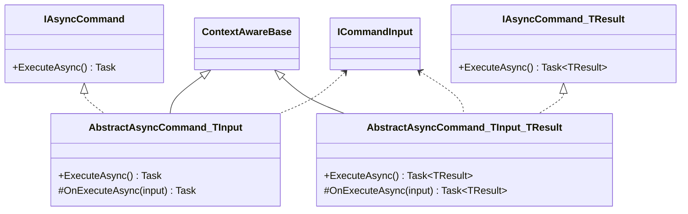
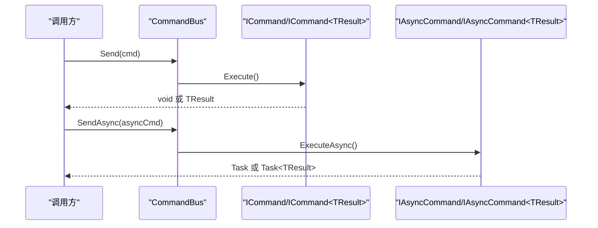
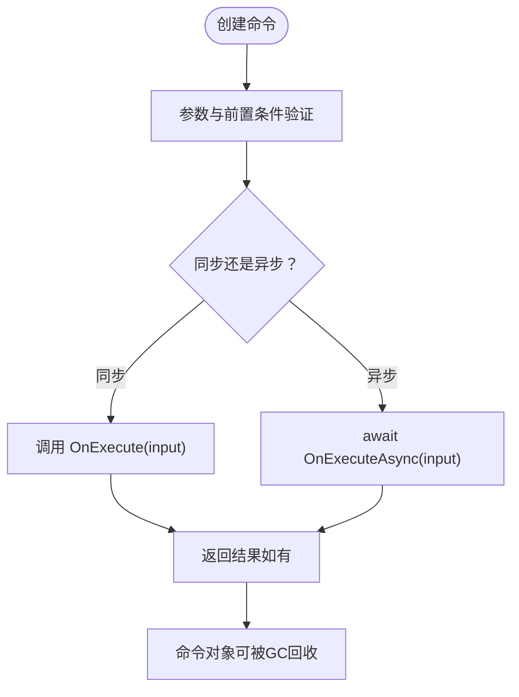
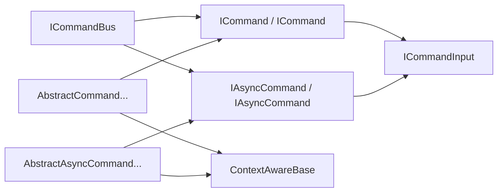

# 命令基类体系

<cite>
**本文引用的文件**
- [AbstractCommand.cs](file://GFramework.Core/command/AbstractCommand.cs)
- [AbstractAsyncCommand.cs](file://GFramework.Core/command/AbstractAsyncCommand.cs)
- [EmptyCommandInput.cs](file://GFramework.Core/command/EmptyCommandInput.cs)
- [CommandBus.cs](file://GFramework.Core/command/CommandBus.cs)
- [ICommand.cs](file://GFramework.Core.Abstractions/command/ICommand.cs)
- [IAsyncCommand.cs](file://GFramework.Core.Abstractions/command/IAsyncCommand.cs)
- [ICommandInput.cs](file://GFramework.Core.Abstractions/command/ICommandInput.cs)
- [ICommandBus.cs](file://GFramework.Core.Abstractions/command/ICommandBus.cs)
- [ContextAwareBase.cs](file://GFramework.Core/rule/ContextAwareBase.cs)
- [README.md（命令包）](file://GFramework.Core/command/README.md)
- [README.md（抽象层）](file://GFramework.Core.Abstractions/README.md)
- [AbstractAsyncCommandTests.cs](file://GFramework.Core.Tests/command/AbstractAsyncCommandTests.cs)
- [CommandBusTests.cs](file://GFramework.Core.Tests/command/CommandBusTests.cs)
</cite>

## 目录
1. [引言](#引言)
2. [项目结构](#项目结构)
3. [核心组件](#核心组件)
4. [架构总览](#架构总览)
5. [详细组件分析](#详细组件分析)
6. [依赖分析](#依赖分析)
7. [性能考虑](#性能考虑)
8. [故障排查指南](#故障排查指南)
9. [结论](#结论)
10. [附录](#附录)

## 引言
本文件系统化梳理命令基类体系，围绕抽象命令与异步命令基类的设计理念、契约接口、输入模型、生命周期、继承扩展、参数验证与错误处理、与其他组件的集成方式，以及最佳实践与性能优化建议展开，帮助读者快速理解并高效使用命令模式在架构中的落地。

## 项目结构
命令相关代码位于 GFramework.Core 的 command 与 rule 子目录，契约接口位于 GFramework.Core.Abstractions 的 command 与 rule 子目录；配套测试位于 GFramework.Core.Tests 的 command 子目录；README 提供使用说明与最佳实践。

图表来源
- [AbstractCommand.cs](file://GFramework.Core/command/AbstractCommand.cs#L1-L53)
- [AbstractAsyncCommand.cs](file://GFramework.Core/command/AbstractAsyncCommand.cs#L1-L53)
- [EmptyCommandInput.cs](file://GFramework.Core/command/EmptyCommandInput.cs#L1-L13)
- [CommandBus.cs](file://GFramework.Core/command/CommandBus.cs#L1-L62)
- [ICommand.cs](file://GFramework.Core.Abstractions/command/ICommand.cs#L1-L31)
- [IAsyncCommand.cs](file://GFramework.Core.Abstractions/command/IAsyncCommand.cs#L1-L29)
- [ICommandInput.cs](file://GFramework.Core.Abstractions/command/ICommandInput.cs#L1-L7)
- [ICommandBus.cs](file://GFramework.Core.Abstractions/command/ICommandBus.cs#L1-L37)
- [ContextAwareBase.cs](file://GFramework.Core/rule/ContextAwareBase.cs#L1-L43)

章节来源
- [AbstractCommand.cs](file://GFramework.Core/command/AbstractCommand.cs#L1-L53)
- [AbstractAsyncCommand.cs](file://GFramework.Core/command/AbstractAsyncCommand.cs#L1-L53)
- [EmptyCommandInput.cs](file://GFramework.Core/command/EmptyCommandInput.cs#L1-L13)
- [CommandBus.cs](file://GFramework.Core/command/CommandBus.cs#L1-L62)
- [ICommand.cs](file://GFramework.Core.Abstractions/command/ICommand.cs#L1-L31)
- [IAsyncCommand.cs](file://GFramework.Core.Abstractions/command/IAsyncCommand.cs#L1-L29)
- [ICommandInput.cs](file://GFramework.Core.Abstractions/command/ICommandInput.cs#L1-L7)
- [ICommandBus.cs](file://GFramework.Core.Abstractions/command/ICommandBus.cs#L1-L37)
- [ContextAwareBase.cs](file://GFramework.Core/rule/ContextAwareBase.cs#L1-L43)

## 核心组件
- 命令接口族：ICommand、ICommand<TResult>、IAsyncCommand、IAsyncCommand<TResult>，定义执行契约与返回语义。
- 输入模型接口：ICommandInput，作为命令输入的标记接口，EmptyCommandInput 作为“无输入”占位实现。
- 抽象命令基类：AbstractCommand<TInput>、AbstractCommand<TInput,TResult>、AbstractAsyncCommand<TInput>、AbstractAsyncCommand<TInput,TResult>，提供 Execute/ExecuteAsync 的桥接与 OnExecute/OnExecuteAsync 的抽象实现。
- 命令总线：CommandBus，统一发送与执行命令，支持同步与异步、有返回值与无返回值。
- 上下文感知基类：ContextAwareBase，为命令提供架构上下文访问能力（GetModel、SendEvent 等横切能力通过扩展方法在其他模块提供）。

章节来源
- [ICommand.cs](file://GFramework.Core.Abstractions/command/ICommand.cs#L1-L31)
- [IAsyncCommand.cs](file://GFramework.Core.Abstractions/command/IAsyncCommand.cs#L1-L29)
- [ICommandInput.cs](file://GFramework.Core.Abstractions/command/ICommandInput.cs#L1-L7)
- [AbstractCommand.cs](file://GFramework.Core/command/AbstractCommand.cs#L1-L53)
- [AbstractAsyncCommand.cs](file://GFramework.Core/command/AbstractAsyncCommand.cs#L1-L53)
- [EmptyCommandInput.cs](file://GFramework.Core/command/EmptyCommandInput.cs#L1-L13)
- [CommandBus.cs](file://GFramework.Core/command/CommandBus.cs#L1-L62)
- [ContextAwareBase.cs](file://GFramework.Core/rule/ContextAwareBase.cs#L1-L43)

## 架构总览
命令模式在框架中的定位：命令封装写操作，通过命令总线统一调度，命令内部通过上下文基类访问系统、模型、事件总线等能力，形成清晰的职责边界与解耦。

图表来源
- [CommandBus.cs](file://GFramework.Core/command/CommandBus.cs#L1-L62)
- [AbstractCommand.cs](file://GFramework.Core/command/AbstractCommand.cs#L1-L53)
- [AbstractAsyncCommand.cs](file://GFramework.Core/command/AbstractAsyncCommand.cs#L1-L53)
- [ContextAwareBase.cs](file://GFramework.Core/rule/ContextAwareBase.cs#L1-L43)
- [README.md（命令包）](file://GFramework.Core/command/README.md#L1-L309)

## 详细组件分析

### 抽象命令基类（同步）
- 设计要点
  - 封装 Execute 到 OnExecute 的桥接，保证接口契约与实现分离。
  - 泛型约束 TInput : ICommandInput，强制输入模型实现标记接口。
  - 继承 ContextAwareBase，天然具备上下文访问能力。
- 生命周期
  - 创建：传入 TInput 构造。
  - 执行：ICommand.Execute 调用 OnExecute(input)。
  - 返回：ICommand<TResult>.Execute 返回 OnExecute(input)。
  - 清理：命令对象执行后可被 GC 回收（无状态）。
- 适用场景
  - 需要立即执行且无需返回值的写操作。
  - 需要返回结果的写操作（减少分支与歧义）。

图表来源
- [AbstractCommand.cs](file://GFramework.Core/command/AbstractCommand.cs#L1-L53)
- [ContextAwareBase.cs](file://GFramework.Core/rule/ContextAwareBase.cs#L1-L43)
- [ICommand.cs](file://GFramework.Core.Abstractions/command/ICommand.cs#L1-L31)
- [ICommandInput.cs](file://GFramework.Core.Abstractions/command/ICommandInput.cs#L1-L7)

章节来源
- [AbstractCommand.cs](file://GFramework.Core/command/AbstractCommand.cs#L1-L53)
- [README.md（命令包）](file://GFramework.Core/command/README.md#L31-L141)

### 抽象命令基类（异步）
- 设计要点
  - 封装 ExecuteAsync 到 OnExecuteAsync 的桥接，支持 Task 与 Task<TResult>。
  - 同样继承 ContextAwareBase，具备上下文能力。
- 生命周期
  - 创建：传入 TInput 构造。
  - 执行：IAsyncCommand.ExecuteAsync 调用 await OnExecuteAsync(input)。
  - 返回：IAsyncCommand<TResult>.ExecuteAsync 返回 await OnExecuteAsync(input)。
  - 清理：命令对象执行后可被 GC 回收（无状态）。
- 适用场景
  - 需要等待 IO 或异步流程的写操作。
  - 需要返回结果的异步写操作。

图表来源
- [AbstractAsyncCommand.cs](file://GFramework.Core/command/AbstractAsyncCommand.cs#L1-L53)
- [ContextAwareBase.cs](file://GFramework.Core/rule/ContextAwareBase.cs#L1-L43)
- [IAsyncCommand.cs](file://GFramework.Core.Abstractions/command/IAsyncCommand.cs#L1-L29)
- [ICommandInput.cs](file://GFramework.Core.Abstractions/command/ICommandInput.cs#L1-L7)

章节来源
- [AbstractAsyncCommand.cs](file://GFramework.Core/command/AbstractAsyncCommand.cs#L1-L53)
- [README.md（命令包）](file://GFramework.Core/command/README.md#L1-L309)

### 命令执行接口（契约）
- ICommand/ICommand<TResult>
  - Execute() 无返回值；Execute() TResult 有返回值。
  - 继承 IContextAware，具备上下文能力。
- IAsyncCommand/IAsyncCommand<TResult>
  - ExecuteAsync() 无返回值；ExecuteAsync() TResult 有返回值。
  - 继承 IContextAware，具备上下文能力。
- ICommandBus
  - Send(ICommand)/Send<TResult>(ICommand<TResult>) 同步执行。
  - SendAsync(IAsyncCommand)/SendAsync<TResult>(IAsyncCommand<TResult>) 异步执行。
  - 对 null 参数进行显式校验，抛出 ArgumentNullException。

图表来源
- [ICommandBus.cs](file://GFramework.Core.Abstractions/command/ICommandBus.cs#L1-L37)
- [CommandBus.cs](file://GFramework.Core/command/CommandBus.cs#L1-L62)
- [ICommand.cs](file://GFramework.Core.Abstractions/command/ICommand.cs#L1-L31)
- [IAsyncCommand.cs](file://GFramework.Core.Abstractions/command/IAsyncCommand.cs#L1-L29)

章节来源
- [ICommand.cs](file://GFramework.Core.Abstractions/command/ICommand.cs#L1-L31)
- [IAsyncCommand.cs](file://GFramework.Core.Abstractions/command/IAsyncCommand.cs#L1-L29)
- [ICommandBus.cs](file://GFramework.Core.Abstractions/command/ICommandBus.cs#L1-L37)
- [CommandBus.cs](file://GFramework.Core/command/CommandBus.cs#L1-L62)

### 命令输入模型设计
- ICommandInput
  - 标记接口，不包含成员，用于约束命令输入类型。
- EmptyCommandInput
  - 无成员的实现，用于“无输入”的命令场景。
- 自定义输入类型
  - 定义 struct/class 实现 ICommandInput，承载命令所需参数。
  - 在命令构造函数中接收并缓存，避免命令持有长期状态。
- 最佳实践
  - 输入参数结构化、不可变（init-only 属性）。
  - 仅在必要时使用 TResult，避免过度设计。

章节来源
- [ICommandInput.cs](file://GFramework.Core.Abstractions/command/ICommandInput.cs#L1-L7)
- [EmptyCommandInput.cs](file://GFramework.Core/command/EmptyCommandInput.cs#L1-L13)
- [README.md（命令包）](file://GFramework.Core/command/README.md#L175-L192)

### 命令生命周期管理
- 创建：命令对象实例化，注入输入参数。
- 验证：命令内部可通过上下文访问系统/模型进行参数校验（如存在性、范围、权限等）。
- 执行：CommandBus 调用 Execute/ExecuteAsync，委托至 OnExecute/OnExecuteAsync。
- 清理：命令执行完毕即释放，适合无状态一次性操作。
- 测试验证：单元测试覆盖了生命周期完整性、多次执行、异常传播等。

图表来源
- [AbstractCommand.cs](file://GFramework.Core/command/AbstractCommand.cs#L1-L53)
- [AbstractAsyncCommand.cs](file://GFramework.Core/command/AbstractAsyncCommand.cs#L1-L53)
- [CommandBus.cs](file://GFramework.Core/command/CommandBus.cs#L1-L62)

章节来源
- [AbstractAsyncCommandTests.cs](file://GFramework.Core.Tests/command/AbstractAsyncCommandTests.cs#L181-L214)
- [CommandBusTests.cs](file://GFramework.Core.Tests/command/CommandBusTests.cs#L30-L124)

### 继承与扩展示例
- 同步命令
  - 继承 AbstractCommand<TInput> 或 AbstractCommand<TInput,TResult>，重写 OnExecute/OnExecute。
  - 示例参考测试用例中的 TestCommand、TestCommandWithResult。
- 异步命令
  - 继承 AbstractAsyncCommand<TInput> 或 AbstractAsyncCommand<TInput,TResult>，重写 OnExecuteAsync/OnExecuteAsync。
  - 示例参考测试用例中的 TestAsyncCommand、TestAsyncCommandWithResult。
- 空输入命令
  - 使用 EmptyCommandInput 作为输入类型，简化无参命令。

章节来源
- [AbstractCommand.cs](file://GFramework.Core/command/AbstractCommand.cs#L1-L53)
- [AbstractAsyncCommand.cs](file://GFramework.Core/command/AbstractAsyncCommand.cs#L1-L53)
- [CommandBusTests.cs](file://GFramework.Core.Tests/command/CommandBusTests.cs#L137-L265)
- [AbstractAsyncCommandTests.cs](file://GFramework.Core.Tests/command/AbstractAsyncCommandTests.cs#L247-L399)
- [README.md（命令包）](file://GFramework.Core/command/README.md#L31-L141)

### 参数验证与错误处理
- 参数验证
  - 建议在 OnExecute/OnExecuteAsync 内部进行参数合法性检查与前置条件断言。
  - 可通过上下文访问系统/模型进行业务规则校验。
- 错误处理
  - 命令内部异常应向上抛出，交由调用方或上层中间件处理。
  - CommandBus 对传入命令进行 null 校验，避免空引用。
- 测试覆盖
  - 单元测试验证 ExecuteAsync 异常传播、上下文设置与获取、生命周期完整性等。

章节来源
- [CommandBus.cs](file://GFramework.Core/command/CommandBus.cs#L16-L61)
- [AbstractAsyncCommandTests.cs](file://GFramework.Core.Tests/command/AbstractAsyncCommandTests.cs#L104-L114)
- [AbstractAsyncCommandTests.cs](file://GFramework.Core.Tests/command/AbstractAsyncCommandTests.cs#L117-L147)

### 与架构其他组件的集成
- 上下文能力
  - 命令通过 ContextAwareBase 获得上下文，结合扩展方法可访问系统、模型、事件总线等。
- 总线协作
  - CommandBus 统一调度命令，与 QueryBus、EventBus 形成 CQRS 与事件驱动的协同。
- 模块化
  - 命令作为写操作单元，与系统、模型、工具等模块解耦，便于测试与替换。

章节来源
- [ContextAwareBase.cs](file://GFramework.Core/rule/ContextAwareBase.cs#L1-L43)
- [README.md（抽象层）](file://GFramework.Core.Abstractions/README.md#L318-L327)
- [README.md（命令包）](file://GFramework.Core/command/README.md#L1-L309)

## 依赖分析
- 抽象命令基类依赖上下文感知基类，从而获得架构上下文能力。
- 命令接口族依赖上下文感知能力接口，确保命令可访问系统、模型、事件等。
- 命令总线依赖命令接口族，提供统一的发送与执行入口。
- 输入模型接口为命令输入的契约，EmptyCommandInput 作为默认实现。

图表来源
- [ICommandBus.cs](file://GFramework.Core.Abstractions/command/ICommandBus.cs#L1-L37)
- [ICommand.cs](file://GFramework.Core.Abstractions/command/ICommand.cs#L1-L31)
- [IAsyncCommand.cs](file://GFramework.Core.Abstractions/command/IAsyncCommand.cs#L1-L29)
- [ICommandInput.cs](file://GFramework.Core.Abstractions/command/ICommandInput.cs#L1-L7)
- [AbstractCommand.cs](file://GFramework.Core/command/AbstractCommand.cs#L1-L53)
- [AbstractAsyncCommand.cs](file://GFramework.Core/command/AbstractAsyncCommand.cs#L1-L53)
- [ContextAwareBase.cs](file://GFramework.Core/rule/ContextAwareBase.cs#L1-L43)

章节来源
- [ICommandBus.cs](file://GFramework.Core.Abstractions/command/ICommandBus.cs#L1-L37)
- [ICommand.cs](file://GFramework.Core.Abstractions/command/ICommand.cs#L1-L31)
- [IAsyncCommand.cs](file://GFramework.Core.Abstractions/command/IAsyncCommand.cs#L1-L29)
- [ICommandInput.cs](file://GFramework.Core.Abstractions/command/ICommandInput.cs#L1-L7)
- [AbstractCommand.cs](file://GFramework.Core/command/AbstractCommand.cs#L1-L53)
- [AbstractAsyncCommand.cs](file://GFramework.Core/command/AbstractAsyncCommand.cs#L1-L53)
- [ContextAwareBase.cs](file://GFramework.Core/rule/ContextAwareBase.cs#L1-L43)

## 性能考虑
- 命令无状态：每次执行后即可回收，降低内存压力。
- 避免命令嵌套：命令内尽量通过事件与查询与其他模块交互，减少耦合与栈深度。
- 合理使用返回值：仅在确需结果时使用带返回值命令，避免不必要的开销。
- 异步优先：涉及 IO 或长耗时操作时使用异步命令，提升吞吐。
- 输入参数结构化：使用结构化输入减少重复校验与参数传递成本。

## 故障排查指南
- 命令未执行
  - 检查是否通过 CommandBus 正确 Send/SendAsync。
  - 确认命令对象非 null。
- 异常未被捕获
  - 命令内部异常会向上传播，确认调用方是否正确 await 或处理异常。
- 上下文未生效
  - 确认命令已通过上下文感知机制注入架构上下文。
- 多次执行结果不一致
  - 确保命令无状态，输入参数不可变，避免共享可变状态。

章节来源
- [CommandBus.cs](file://GFramework.Core/command/CommandBus.cs#L16-L61)
- [AbstractAsyncCommandTests.cs](file://GFramework.Core.Tests/command/AbstractAsyncCommandTests.cs#L104-L114)
- [AbstractAsyncCommandTests.cs](file://GFramework.Core.Tests/command/AbstractAsyncCommandTests.cs#L117-L147)
- [CommandBusTests.cs](file://GFramework.Core.Tests/command/CommandBusTests.cs#L44-L123)

## 结论
命令基类体系通过清晰的契约、简洁的抽象与统一的总线，实现了命令模式在框架中的高内聚、低耦合与可测试性。配合上下文感知能力与输入模型设计，命令能够在保证可维护性的同时，满足同步与异步、有返回值与无返回值的多样化需求。遵循最佳实践与性能建议，可在大型项目中稳定落地命令模式。

## 附录
- 使用场景参考
  - 用户交互：保存游戏、加载关卡等。
  - 业务流程：战斗伤害计算、角色移动等。
- 扩展方向
  - 命令撤销/重做（可选扩展）。
  - 命令批处理与事务化（可选扩展）。

章节来源
- [README.md（命令包）](file://GFramework.Core/command/README.md#L194-L296)