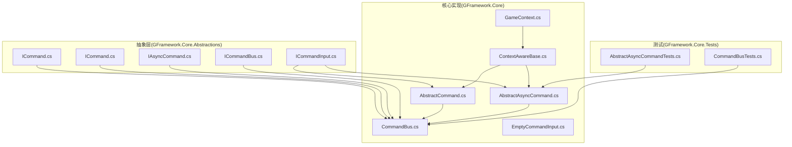
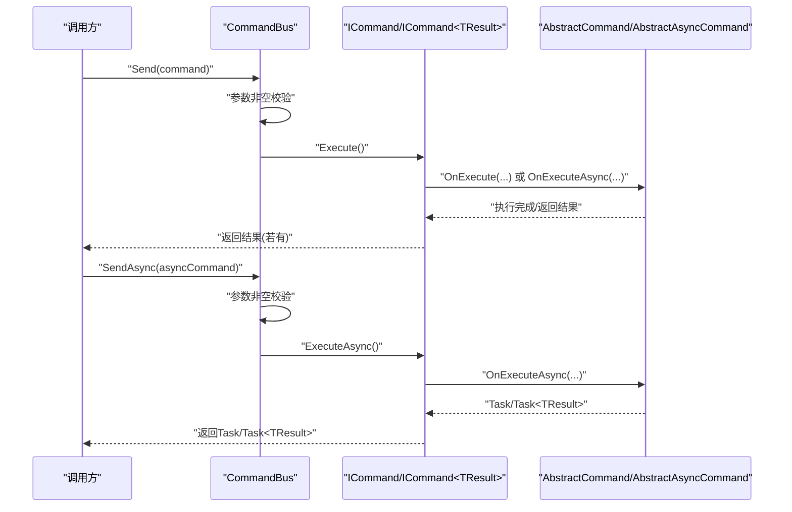
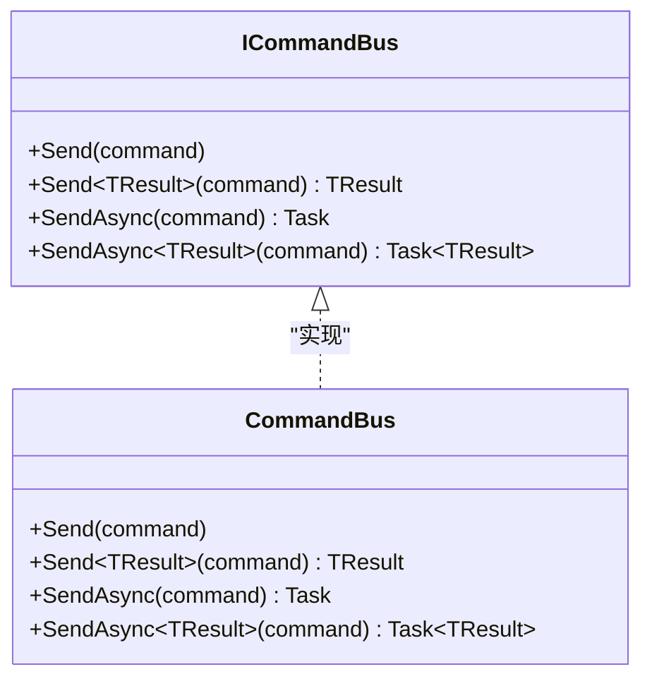
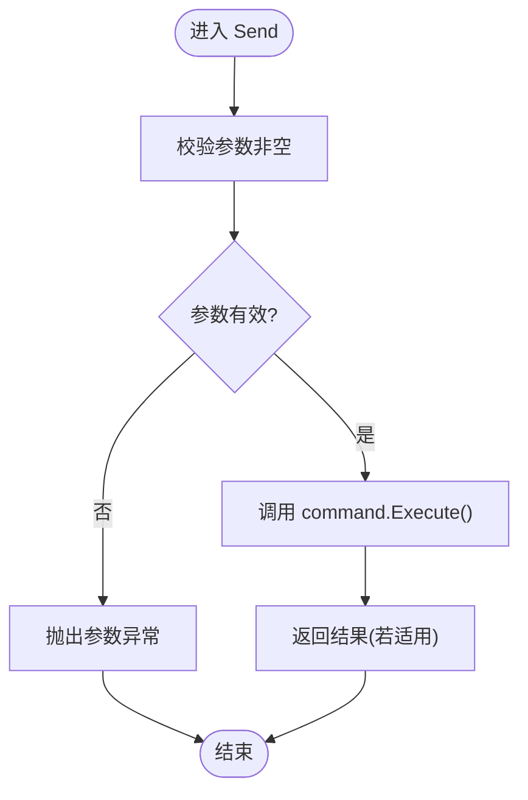
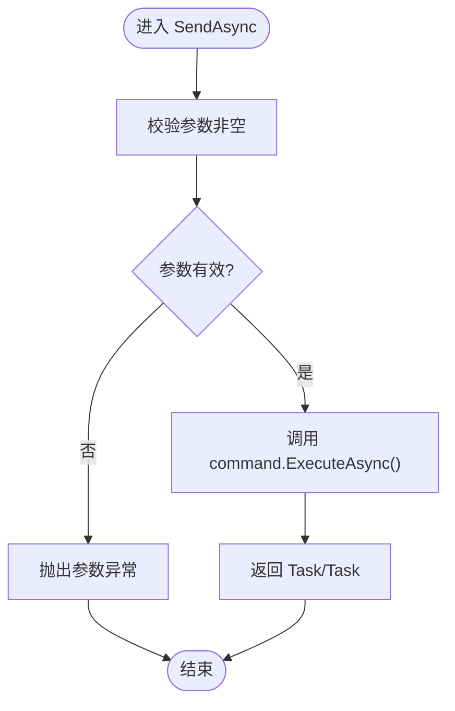
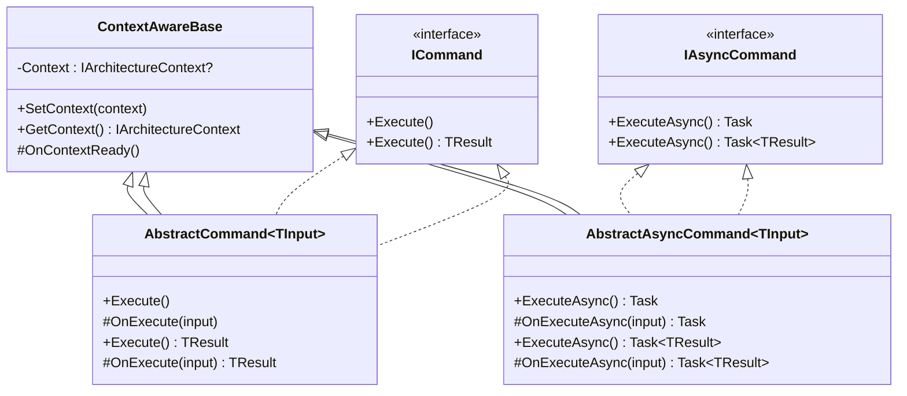
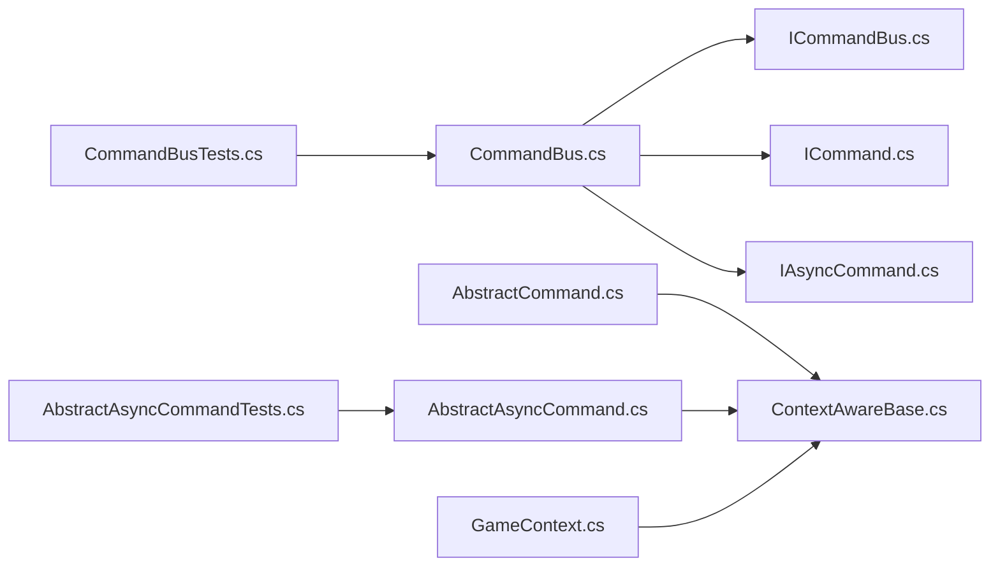

# 命令总线(CommandBus)

<cite>
**本文引用的文件**
- [CommandBus.cs](file://GFramework.Core/command/CommandBus.cs)
- [ICommandBus.cs](file://GFramework.Core.Abstractions/command/ICommandBus.cs)
- [ICommand.cs](file://GFramework.Core.Abstractions/command/ICommand.cs)
- [ICommand<TResult>.cs](file://GFramework.Core.Abstractions/command/ICommand.cs)
- [IAsyncCommand.cs](file://GFramework.Core.Abstractions/command/IAsyncCommand.cs)
- [ICommandInput.cs](file://GFramework.Core.Abstractions/command/ICommandInput.cs)
- [AbstractCommand.cs](file://GFramework.Core/command/AbstractCommand.cs)
- [AbstractAsyncCommand.cs](file://GFramework.Core/command/AbstractAsyncCommand.cs)
- [EmptyCommandInput.cs](file://GFramework.Core/command/EmptyCommandInput.cs)
- [ContextAwareBase.cs](file://GFramework.Core/rule/ContextAwareBase.cs)
- [GameContext.cs](file://GFramework.Core/architecture/GameContext.cs)
- [CommandBusTests.cs](file://GFramework.Core.Tests/command/CommandBusTests.cs)
- [AbstractAsyncCommandTests.cs](file://GFramework.Core.Tests/command/AbstractAsyncCommandTests.cs)
- [README.md（命令包）](file://GFramework.Core/command/README.md)
- [README.md（抽象层）](file://GFramework.Core.Abstractions/README.md)
</cite>

## 目录
1. [引言](#引言)
2. [项目结构](#项目结构)
3. [核心组件](#核心组件)
4. [架构总览](#架构总览)
5. [详细组件分析](#详细组件分析)
6. [依赖分析](#依赖分析)
7. [性能考虑](#性能考虑)
8. [故障排查指南](#故障排查指南)
9. [结论](#结论)
10. [附录](#附录)

## 引言
本文件围绕命令总线（CommandBus）进行深入技术文档编写，重点解释其作为命令处理核心组件的设计原理与实现细节，覆盖以下主题：
- 同步命令执行机制：Send 对 ICommand 与 ICommand<TResult> 的处理流程
- 异步命令执行支持：SendAsync 对 IAsyncCommand 与 IAsyncCommand<TResult> 的异步处理模式
- 命令参数验证与异常处理策略
- 使用示例：从简单命令到复杂命令的处理流程
- 在整体架构中的角色与与其他组件的交互关系
- 性能考量与最佳实践

## 项目结构
命令总线位于核心库的 command 子目录，配合抽象层接口与测试用例共同构成完整的能力边界与行为验证。

图表来源
- [ICommandBus.cs](file://GFramework.Core.Abstractions/command/ICommandBus.cs#L8-L37)
- [CommandBus.cs](file://GFramework.Core/command/CommandBus.cs#L9-L62)
- [ICommand.cs](file://GFramework.Core.Abstractions/command/ICommand.cs#L9-L31)
- [IAsyncCommand.cs](file://GFramework.Core.Abstractions/command/IAsyncCommand.cs#L9-L29)
- [AbstractCommand.cs](file://GFramework.Core/command/AbstractCommand.cs#L11-L53)
- [AbstractAsyncCommand.cs](file://GFramework.Core/command/AbstractAsyncCommand.cs#L10-L53)
- [ContextAwareBase.cs](file://GFramework.Core/rule/ContextAwareBase.cs#L10-L43)
- [GameContext.cs](file://GFramework.Core/architecture/GameContext.cs#L9-L111)
- [CommandBusTests.cs](file://GFramework.Core.Tests/command/CommandBusTests.cs#L20-L124)
- [AbstractAsyncCommandTests.cs](file://GFramework.Core.Tests/command/AbstractAsyncCommandTests.cs#L30-L231)

章节来源
- [CommandBus.cs](file://GFramework.Core/command/CommandBus.cs#L9-L62)
- [ICommandBus.cs](file://GFramework.Core.Abstractions/command/ICommandBus.cs#L8-L37)

## 核心组件
- 命令总线接口：定义发送同步/异步命令的契约，包括无返回值与带返回值两类方法族。
- 命令总线实现：接收命令对象并直接调用其 Execute 或 ExecuteAsync，实现“转发”式调度。
- 同步命令抽象基类：为无返回值与带返回值命令提供统一入口与上下文感知能力。
- 异步命令抽象基类：为无返回值与带返回值异步命令提供统一入口与上下文感知能力。
- 空命令输入：用于不需要参数的简单命令场景。
- 上下文感知基类与游戏上下文：为命令提供架构上下文访问能力。

章节来源
- [ICommandBus.cs](file://GFramework.Core.Abstractions/command/ICommandBus.cs#L8-L37)
- [CommandBus.cs](file://GFramework.Core/command/CommandBus.cs#L9-L62)
- [AbstractCommand.cs](file://GFramework.Core/command/AbstractCommand.cs#L11-L53)
- [AbstractAsyncCommand.cs](file://GFramework.Core/command/AbstractAsyncCommand.cs#L10-L53)
- [EmptyCommandInput.cs](file://GFramework.Core/command/EmptyCommandInput.cs#L12-L13)
- [ContextAwareBase.cs](file://GFramework.Core/rule/ContextAwareBase.cs#L10-L43)
- [GameContext.cs](file://GFramework.Core/architecture/GameContext.cs#L9-L111)

## 架构总览
CommandBus 在命令模式中扮演“调度器”角色，将调用方与具体命令实现解耦。命令通过抽象基类获得上下文能力，可在执行期间访问系统、模型、事件总线等服务；命令总线仅负责参数校验与方法转发。

图表来源
- [CommandBus.cs](file://GFramework.Core/command/CommandBus.cs#L16-L61)
- [ICommand.cs](file://GFramework.Core.Abstractions/command/ICommand.cs#L9-L31)
- [IAsyncCommand.cs](file://GFramework.Core.Abstractions/command/IAsyncCommand.cs#L9-L29)
- [AbstractCommand.cs](file://GFramework.Core/command/AbstractCommand.cs#L11-L53)
- [AbstractAsyncCommand.cs](file://GFramework.Core/command/AbstractAsyncCommand.cs#L10-L53)

## 详细组件分析

### 命令总线接口与实现
- 接口职责：定义 Send/Send<TResult>/SendAsync/SendAsync<TResult> 四个方法族，覆盖同步与异步、有返回值与无返回值场景。
- 实现策略：在实现中仅进行参数非空校验，随后直接调用命令对象的 Execute/ExecuteAsync，不做额外中间处理。
- 异常策略：对 null 参数抛出参数异常；命令内部异常由命令自身处理，不被总线捕获。

图表来源
- [ICommandBus.cs](file://GFramework.Core.Abstractions/command/ICommandBus.cs#L8-L37)
- [CommandBus.cs](file://GFramework.Core/command/CommandBus.cs#L9-L62)

章节来源
- [ICommandBus.cs](file://GFramework.Core.Abstractions/command/ICommandBus.cs#L8-L37)
- [CommandBus.cs](file://GFramework.Core/command/CommandBus.cs#L16-L61)

### 同步命令执行流程（Send）
- 输入：ICommand 或 ICommand<TResult>
- 处理：参数非空校验 → 调用 command.Execute()
- 返回：ICommand<TResult> 返回 TResult
- 异常：参数为 null 抛出参数异常

图表来源
- [CommandBus.cs](file://GFramework.Core/command/CommandBus.cs#L16-L35)
- [ICommand.cs](file://GFramework.Core.Abstractions/command/ICommand.cs#L9-L31)

章节来源
- [CommandBus.cs](file://GFramework.Core/command/CommandBus.cs#L16-L35)
- [CommandBusTests.cs](file://GFramework.Core.Tests/command/CommandBusTests.cs#L34-L51)

### 异步命令执行流程（SendAsync）
- 输入：IAsyncCommand 或 IAsyncCommand<TResult>
- 处理：参数非空校验 → 调用 command.ExecuteAsync()
- 返回：Task 或 Task<TResult>
- 异常：参数为 null 抛出参数异常

图表来源
- [CommandBus.cs](file://GFramework.Core/command/CommandBus.cs#L42-L61)
- [IAsyncCommand.cs](file://GFramework.Core.Abstractions/command/IAsyncCommand.cs#L9-L29)

章节来源
- [CommandBus.cs](file://GFramework.Core/command/CommandBus.cs#L42-L61)
- [CommandBusTests.cs](file://GFramework.Core.Tests/command/CommandBusTests.cs#L81-L123)

### 命令抽象基类与上下文感知
- AbstractCommand<TInput>：实现 ICommand，入口方法委托至受保护的 OnExecute(TInput)，派生类仅需实现业务逻辑。
- AbstractCommand<TInput,TResult>：实现 ICommand<TResult>，入口方法委托至受保护的 OnExecute(TInput) 并返回结果。
- AbstractAsyncCommand<TInput>：实现 IAsyncCommand，入口方法委托至受保护的 OnExecuteAsync(TInput)。
- AbstractAsyncCommand<TInput,TResult>：实现 IAsyncCommand<TResult>，入口方法委托至受保护的 OnExecuteAsync(TInput) 并返回 Task<TResult>。
- 上下文感知：所有抽象基类均继承 ContextAwareBase，可在命令执行前后访问架构上下文，获取系统、模型、事件总线等服务。

图表来源
- [AbstractCommand.cs](file://GFramework.Core/command/AbstractCommand.cs#L11-L53)
- [AbstractAsyncCommand.cs](file://GFramework.Core/command/AbstractAsyncCommand.cs#L10-L53)
- [ContextAwareBase.cs](file://GFramework.Core/rule/ContextAwareBase.cs#L10-L43)
- [ICommand.cs](file://GFramework.Core.Abstractions/command/ICommand.cs#L9-L31)
- [IAsyncCommand.cs](file://GFramework.Core.Abstractions/command/IAsyncCommand.cs#L9-L29)

章节来源
- [AbstractCommand.cs](file://GFramework.Core/command/AbstractCommand.cs#L11-L53)
- [AbstractAsyncCommand.cs](file://GFramework.Core/command/AbstractAsyncCommand.cs#L10-L53)
- [ContextAwareBase.cs](file://GFramework.Core/rule/ContextAwareBase.cs#L10-L43)

### 空命令输入与简单命令
- EmptyCommandInput：实现 ICommandInput 的空壳类型，适用于不需要参数的简单命令。
- 使用场景：快速构建轻量级命令，避免为无参命令定义冗余输入结构体。

章节来源
- [EmptyCommandInput.cs](file://GFramework.Core/command/EmptyCommandInput.cs#L12-L13)
- [README.md（命令包）](file://GFramework.Core/command/README.md#L175-L193)

### 命令参数验证与异常处理策略
- 参数验证：总线侧仅进行 null 校验，其余参数有效性由命令实现自行保证。
- 异常传播：命令内部抛出的异常由命令自身处理，不被总线拦截；调用方应按需 await/Task.Result/Wait 等待异步命令完成并捕获异常。
- 测试验证：单元测试覆盖了 null 命令抛异常、同步/异步命令正常执行、带返回值命令返回预期结果等场景。

章节来源
- [CommandBus.cs](file://GFramework.Core/command/CommandBus.cs#L16-L61)
- [CommandBusTests.cs](file://GFramework.Core.Tests/command/CommandBusTests.cs#L34-L123)
- [AbstractAsyncCommandTests.cs](file://GFramework.Core.Tests/command/AbstractAsyncCommandTests.cs#L74-L114)

### 使用示例与流程
- 简单命令（无返回值）：定义实现 AbstractCommand<TInput> 的命令类，重写 OnExecute；通过 CommandBus.Send 执行。
- 复杂命令（带返回值）：定义实现 AbstractCommand<TInput,TResult> 的命令类，重写 OnExecute 返回结果；通过 CommandBus.Send 获取结果。
- 异步命令：定义实现 AbstractAsyncCommand<TInput> 或 AbstractAsyncCommand<TInput,TResult> 的命令类，重写 OnExecuteAsync；通过 CommandBus.SendAsync 执行并 await。
- 事件与上下文：命令可通过上下文访问系统、模型、事件总线等服务，实现跨组件协作。

章节来源
- [README.md（命令包）](file://GFramework.Core/command/README.md#L36-L141)
- [AbstractAsyncCommandTests.cs](file://GFramework.Core.Tests/command/AbstractAsyncCommandTests.cs#L74-L114)
- [ContextAwareBase.cs](file://GFramework.Core/rule/ContextAwareBase.cs#L10-L43)

## 依赖分析
- 命令总线依赖抽象接口与命令抽象基类，不依赖具体实现，满足依赖倒置原则。
- 命令抽象基类依赖上下文感知基类，从而获得架构上下文能力。
- 测试用例覆盖同步/异步命令、带返回值/无返回值、null 参数等关键路径，保障行为一致性。

图表来源
- [CommandBus.cs](file://GFramework.Core/command/CommandBus.cs#L9-L62)
- [ICommandBus.cs](file://GFramework.Core.Abstractions/command/ICommandBus.cs#L8-L37)
- [ICommand.cs](file://GFramework.Core.Abstractions/command/ICommand.cs#L9-L31)
- [IAsyncCommand.cs](file://GFramework.Core.Abstractions/command/IAsyncCommand.cs#L9-L29)
- [AbstractCommand.cs](file://GFramework.Core/command/AbstractCommand.cs#L11-L53)
- [AbstractAsyncCommand.cs](file://GFramework.Core/command/AbstractAsyncCommand.cs#L10-L53)
- [ContextAwareBase.cs](file://GFramework.Core/rule/ContextAwareBase.cs#L10-L43)
- [GameContext.cs](file://GFramework.Core/architecture/GameContext.cs#L9-L111)
- [CommandBusTests.cs](file://GFramework.Core.Tests/command/CommandBusTests.cs#L20-L124)
- [AbstractAsyncCommandTests.cs](file://GFramework.Core.Tests/command/AbstractAsyncCommandTests.cs#L30-L231)

章节来源
- [README.md（抽象层）](file://GFramework.Core.Abstractions/README.md#L136-L154)

## 性能考虑
- 调度开销极低：总线仅做参数校验与方法转发，无额外中间层，适合高频命令调用。
- 异步优先：对于 IO 密集或耗时操作，推荐使用异步命令，避免阻塞调用线程。
- 命令原子性：单次命令应完成原子操作，减少重复调度与上下文切换。
- 参数结构化：通过 ICommandInput 结构化参数，降低序列化与拷贝成本。
- 上下文缓存：命令内部可缓存常用服务引用，避免频繁上下文查询。

## 故障排查指南
- 症状：调用 Send/SendAsync 抛出参数异常
  - 原因：传入 null 命令
  - 处理：确保命令实例非空后再调用
- 症状：异步命令未生效或未等待完成
  - 原因：未 await Task/Task<TResult>
  - 处理：在调用方 await 或使用 Wait/Result（不推荐）
- 症状：命令内部异常未被捕获
  - 原因：异常由命令自身处理，总线不拦截
  - 处理：在命令实现中捕获并记录异常，或在调用方 await 后处理异常
- 症状：命令上下文不可用
  - 原因：未设置上下文或上下文未绑定
  - 处理：确认命令已通过上下文感知机制设置架构上下文

章节来源
- [CommandBus.cs](file://GFramework.Core/command/CommandBus.cs#L16-L61)
- [CommandBusTests.cs](file://GFramework.Core.Tests/command/CommandBusTests.cs#L48-L123)
- [AbstractAsyncCommandTests.cs](file://GFramework.Core.Tests/command/AbstractAsyncCommandTests.cs#L107-L114)
- [ContextAwareBase.cs](file://GFramework.Core/rule/ContextAwareBase.cs#L21-L35)
- [GameContext.cs](file://GFramework.Core/architecture/GameContext.cs#L27-L42)

## 结论
CommandBus 以极简设计实现命令的统一调度：通过严格的参数校验与直接方法转发，将调用方与命令实现解耦；结合抽象命令基类与上下文感知能力，命令可在执行期灵活访问架构服务。同步与异步命令并行支持，满足不同性能与交互需求。建议在实际工程中遵循参数结构化、命令原子性与异步优先等最佳实践，以获得稳定、可维护且高性能的命令执行体验。

## 附录
- 相关接口与契约参考：命令总线接口、命令接口、异步命令接口、命令输入接口
- 命令生命周期与使用场景参考：命令包 README 中的生命周期说明与示例

章节来源
- [README.md（命令包）](file://GFramework.Core/command/README.md#L143-L174)
- [README.md（抽象层）](file://GFramework.Core.Abstractions/README.md#L136-L154)