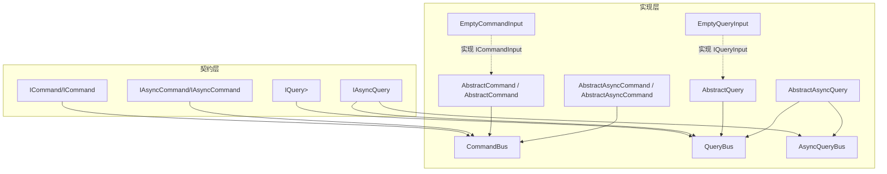
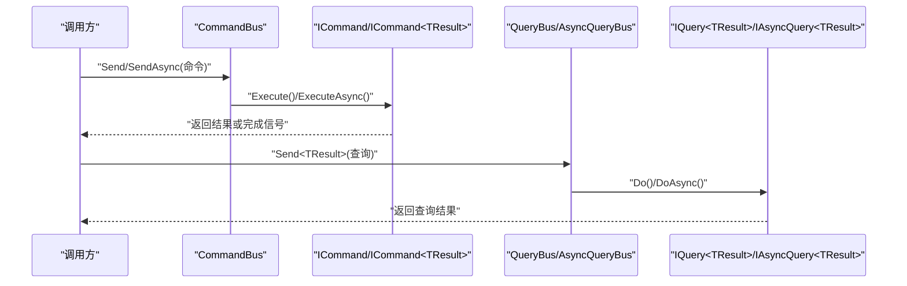
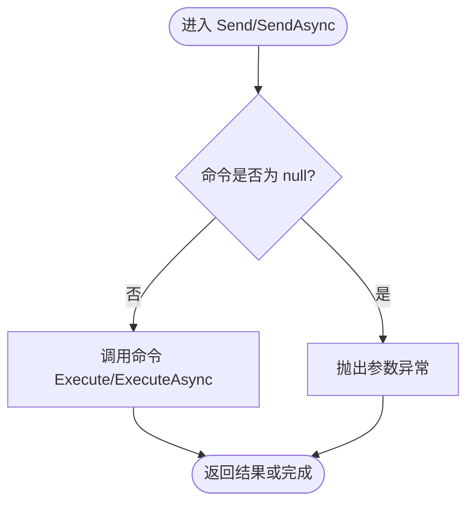
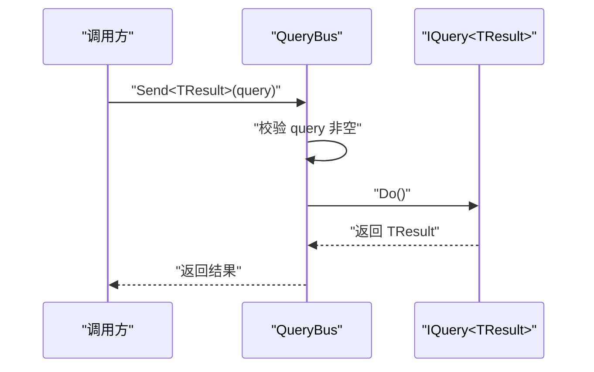
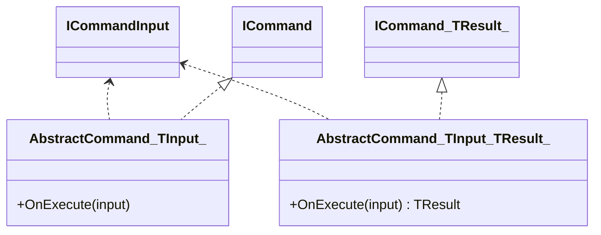
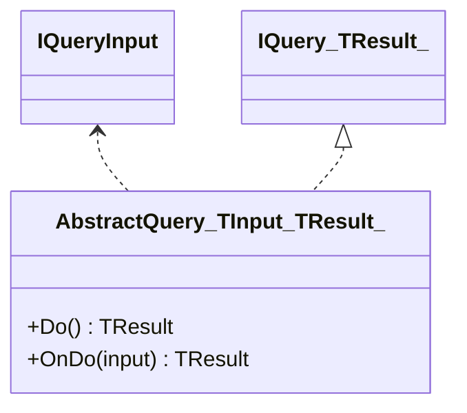
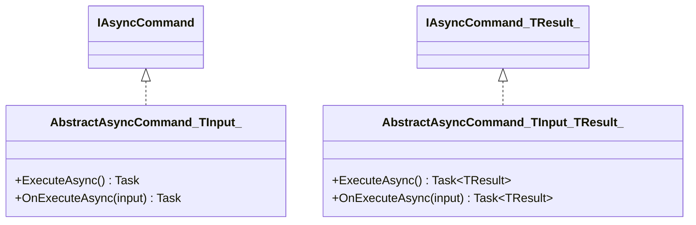
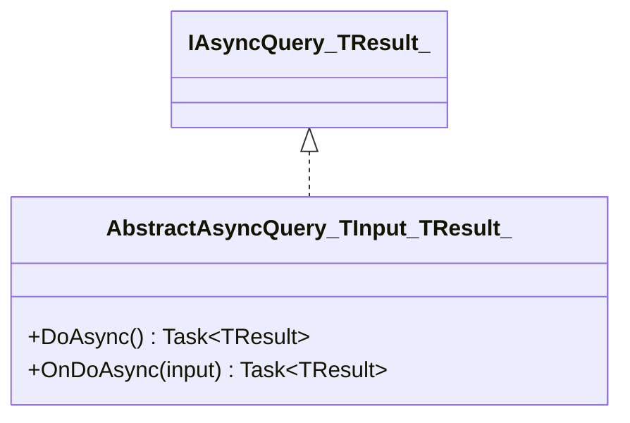
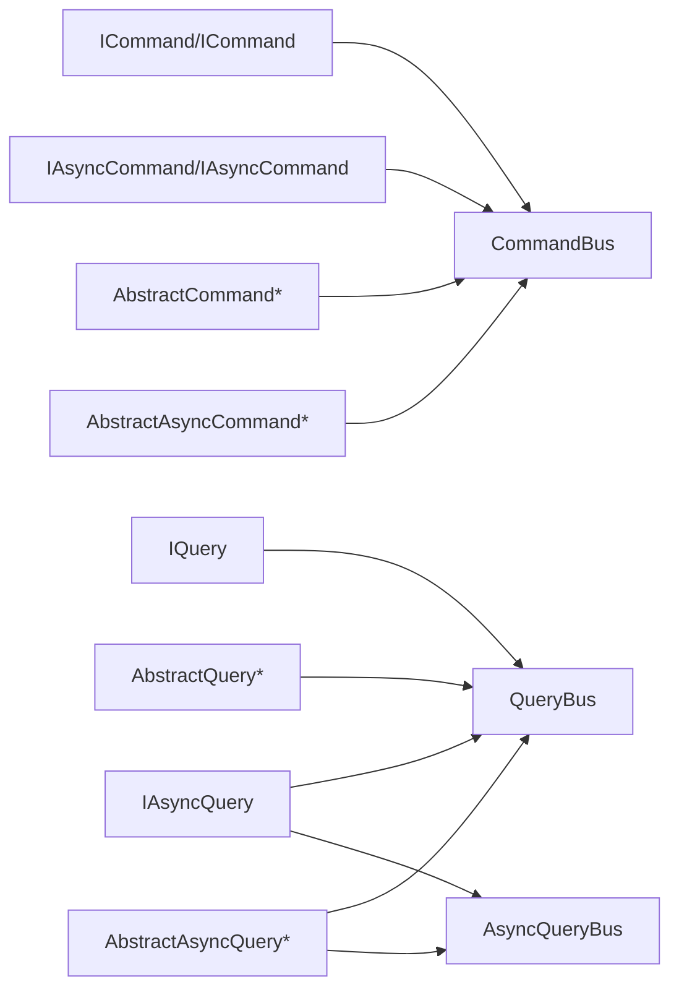

# 命令查询系统

<cite>
**本文引用的文件**
- [GFramework.Core\command\CommandBus.cs](file://GFramework.Core/command/CommandBus.cs)
- [GFramework.Core\query\QueryBus.cs](file://GFramework.Core/query/QueryBus.cs)
- [GFramework.Core\command\AbstractCommand.cs](file://GFramework.Core/command/AbstractCommand.cs)
- [GFramework.Core\query\AbstractQuery.cs](file://GFramework.Core/query/AbstractQuery.cs)
- [GFramework.Core\command\AbstractAsyncCommand.cs](file://GFramework.Core/command/AbstractAsyncCommand.cs)
- [GFramework.Core\query\AbstractAsyncQuery.cs](file://GFramework.Core/query/AbstractAsyncQuery.cs)
- [GFramework.Core\command\EmptyCommandInput.cs](file://GFramework.Core/command/EmptyCommandInput.cs)
- [GFramework.Core\query\EmptyQueryInput.cs](file://GFramework.Core/query/EmptyQueryInput.cs)
- [GFramework.Core\query\AsyncQueryBus.cs](file://GFramework.Core/query/AsyncQueryBus.cs)
- [GFramework.Core.Abstractions\command\ICommand.cs](file://GFramework.Core.Abstractions/command/ICommand.cs)
- [GFramework.Core.Abstractions\query\IQuery.cs](file://GFramework.Core.Abstractions/query/IQuery.cs)
- [GFramework.Core.Abstractions\command\IAsyncCommand.cs](file://GFramework.Core.Abstractions/command/IAsyncCommand.cs)
- [GFramework.Core.Abstractions\query\IAsyncQuery.cs](file://GFramework.Core.Abstractions/query/IAsyncQuery.cs)
- [GFramework.Core.Tests\command\CommandBusTests.cs](file://GFramework.Core.Tests/command/CommandBusTests.cs)
- [GFramework.Core.Tests\query\QueryBusTests.cs](file://GFramework.Core.Tests/query/QueryBusTests.cs)
- [GFramework.Core.Tests\command\AbstractAsyncCommandTests.cs](file://GFramework.Core.Tests/command/AbstractAsyncCommandTests.cs)
- [GFramework.Core.Tests\query\AbstractAsyncQueryTests.cs](file://GFramework.Core.Tests/query/AbstractAsyncQueryTests.cs)
</cite>

## 目录
1. [引言](#引言)
2. [项目结构](#项目结构)
3. [核心组件](#核心组件)
4. [架构概览](#架构概览)
5. [详细组件分析](#详细组件分析)
6. [依赖关系分析](#依赖关系分析)
7. [性能考虑](#性能考虑)
8. [故障排查指南](#故障排查指南)
9. [结论](#结论)
10. [附录：API 参考与使用示例](#附录api-参考与使用示例)

## 引言
本技术文档围绕 GFramework 的命令查询系统，系统性阐述 CQRS（命令查询职责分离）模式在该框架中的实现与优势。文档重点覆盖以下方面：
- 命令总线与查询总线的设计与职责边界
- 基于抽象基类的命令与查询实现（同步与异步）
- 输入输出模型与类型安全设计
- 参数验证与错误处理策略
- 最佳实践：事务一致性与查询优化
- 完整 API 参考与可直接定位到源码路径的使用示例

## 项目结构
命令查询系统位于 GFramework.Core 与 GFramework.Core.Abstractions 两个命名空间中，分别提供实现与抽象契约。核心文件组织如下：
- 契约层（Abstractions）：定义 ICommand/IQuery/IAsyncCommand/IAsyncQuery 等接口
- 实现层（Core）：提供 CommandBus/QueryBus/AsyncQueryBus 以及 AbstractCommand/AbstractQuery/AbstractAsyncCommand/AbstractAsyncQuery 等实现
- 输入模型：EmptyCommandInput/EmptyQueryInput 提供“无输入”场景的类型安全占位
- 测试层：通过单元测试展示典型使用方式与边界条件

图表来源
- [GFramework.Core.Abstractions\command\ICommand.cs](file://GFramework.Core.Abstractions/command/ICommand.cs#L1-L31)
- [GFramework.Core.Abstractions\query\IQuery.cs](file://GFramework.Core.Abstractions/query/IQuery.cs#L1-L16)
- [GFramework.Core.Abstractions\command\IAsyncCommand.cs](file://GFramework.Core.Abstractions/command/IAsyncCommand.cs#L1-L29)
- [GFramework.Core\command\CommandBus.cs](file://GFramework.Core/command/CommandBus.cs#L1-L62)
- [GFramework.Core\query\QueryBus.cs](file://GFramework.Core/query/QueryBus.cs#L1-L23)
- [GFramework.Core\query\AsyncQueryBus.cs](file://GFramework.Core/query/AsyncQueryBus.cs#L1-L22)
- [GFramework.Core\command\AbstractCommand.cs](file://GFramework.Core/command/AbstractCommand.cs#L1-L53)
- [GFramework.Core\query\AbstractQuery.cs](file://GFramework.Core/query/AbstractQuery.cs#L1-L29)
- [GFramework.Core\command\AbstractAsyncCommand.cs](file://GFramework.Core/command/AbstractAsyncCommand.cs#L1-L53)
- [GFramework.Core\query\AbstractAsyncQuery.cs](file://GFramework.Core/query/AbstractAsyncQuery.cs#L1-L32)
- [GFramework.Core\command\EmptyCommandInput.cs](file://GFramework.Core/command/EmptyCommandInput.cs#L1-L13)
- [GFramework.Core\query\EmptyQueryInput.cs](file://GFramework.Core/query/EmptyQueryInput.cs#L1-L11)

章节来源
- [GFramework.Core\command\CommandBus.cs](file://GFramework.Core/command/CommandBus.cs#L1-L62)
- [GFramework.Core\query\QueryBus.cs](file://GFramework.Core/query/QueryBus.cs#L1-L23)
- [GFramework.Core\query\AsyncQueryBus.cs](file://GFramework.Core/query/AsyncQueryBus.cs#L1-L22)
- [GFramework.Core\command\AbstractCommand.cs](file://GFramework.Core/command/AbstractCommand.cs#L1-L53)
- [GFramework.Core\query\AbstractQuery.cs](file://GFramework.Core/query/AbstractQuery.cs#L1-L29)
- [GFramework.Core\command\AbstractAsyncCommand.cs](file://GFramework.Core/command/AbstractAsyncCommand.cs#L1-L53)
- [GFramework.Core\query\AbstractAsyncQuery.cs](file://GFramework.Core/query/AbstractAsyncQuery.cs#L1-L32)
- [GFramework.Core\command\EmptyCommandInput.cs](file://GFramework.Core/command/EmptyCommandInput.cs#L1-L13)
- [GFramework.Core\query\EmptyQueryInput.cs](file://GFramework.Core/query/EmptyQueryInput.cs#L1-L11)

## 核心组件
- 命令总线（CommandBus）：统一调度 ICommand/ICommand<TResult>/IAsyncCommand/IAsyncCommand<TResult>，负责参数校验与执行分发
- 查询总线（QueryBus/AsyncQueryBus）：统一调度 IQuery<TResult>/IAsyncQuery<TResult>，提供同步与异步查询执行入口
- 抽象命令（AbstractCommand/AbstractAsyncCommand）：为具体命令提供输入模型绑定、上下文感知与执行骨架
- 抽象查询（AbstractQuery/AbstractAsyncQuery）：为具体查询提供输入模型绑定、上下文感知与执行骨架
- 输入模型（EmptyCommandInput/EmptyQueryInput）：类型安全的“无输入”占位符，便于零参数命令/查询的声明式建模

章节来源
- [GFramework.Core\command\CommandBus.cs](file://GFramework.Core/command/CommandBus.cs#L1-L62)
- [GFramework.Core\query\QueryBus.cs](file://GFramework.Core/query/QueryBus.cs#L1-L23)
- [GFramework.Core\query\AsyncQueryBus.cs](file://GFramework.Core/query/AsyncQueryBus.cs#L1-L22)
- [GFramework.Core\command\AbstractCommand.cs](file://GFramework.Core/command/AbstractCommand.cs#L1-L53)
- [GFramework.Core\query\AbstractQuery.cs](file://GFramework.Core/query/AbstractQuery.cs#L1-L29)
- [GFramework.Core\command\AbstractAsyncCommand.cs](file://GFramework.Core/command/AbstractAsyncCommand.cs#L1-L53)
- [GFramework.Core\query\AbstractAsyncQuery.cs](file://GFramework.Core/query/AbstractAsyncQuery.cs#L1-L32)
- [GFramework.Core\command\EmptyCommandInput.cs](file://GFramework.Core/command/EmptyCommandInput.cs#L1-L13)
- [GFramework.Core\query\EmptyQueryInput.cs](file://GFramework.Core/query/EmptyQueryInput.cs#L1-L11)

## 架构概览
CQRS 在本框架中的体现：
- 命令侧：写操作（变更状态），通过 CommandBus 统一调度，支持同步与异步命令
- 查询侧：读操作（只读），通过 QueryBus/AsyncQueryBus 统一调度，支持同步与异步查询
- 输入输出模型：所有命令/查询均通过泛型输入模型与结果类型进行强约束，避免运行期类型错误
- 参数验证：总线在执行前对命令/查询对象进行非空校验，确保调用方契约清晰

图表来源
- [GFramework.Core\command\CommandBus.cs](file://GFramework.Core/command/CommandBus.cs#L1-L62)
- [GFramework.Core\query\QueryBus.cs](file://GFramework.Core/query/QueryBus.cs#L1-L23)
- [GFramework.Core\query\AsyncQueryBus.cs](file://GFramework.Core/query/AsyncQueryBus.cs#L1-L22)
- [GFramework.Core.Abstractions\command\ICommand.cs](file://GFramework.Core.Abstractions/command/ICommand.cs#L1-L31)
- [GFramework.Core.Abstractions\query\IQuery.cs](file://GFramework.Core.Abstractions/query/IQuery.cs#L1-L16)
- [GFramework.Core.Abstractions\command\IAsyncCommand.cs](file://GFramework.Core.Abstractions/command/IAsyncCommand.cs#L1-L29)

## 详细组件分析

### 命令总线（CommandBus）
- 职责：接收命令对象并触发执行；提供同步与异步两类 Send/SendAsync 方法族
- 参数验证：对传入命令进行非空检查，防止空引用传播
- 执行路径：
  - 同步命令：ICommand.Execute 或 ICommand<TResult>.Execute
  - 异步命令：IAsyncCommand.ExecuteAsync 或 IAsyncCommand<TResult>.ExecuteAsync
- 错误处理：空命令参数抛出参数异常；命令内部异常由命令自身处理

图表来源
- [GFramework.Core\command\CommandBus.cs](file://GFramework.Core/command/CommandBus.cs#L1-L62)

章节来源
- [GFramework.Core\command\CommandBus.cs](file://GFramework.Core/command/CommandBus.cs#L1-L62)

### 查询总线（QueryBus/AsyncQueryBus）
- QueryBus：面向同步查询 IQuery<TResult>，执行 Do 并返回结果
- AsyncQueryBus：面向异步查询 IAsyncQuery<TResult>，执行 DoAsync 并返回 Task<TResult>
- 共同点：均对查询对象进行非空校验，确保调用契约

图表来源
- [GFramework.Core\query\QueryBus.cs](file://GFramework.Core/query/QueryBus.cs#L1-L23)
- [GFramework.Core.Abstractions\query\IQuery.cs](file://GFramework.Core.Abstractions/query/IQuery.cs#L1-L16)

章节来源
- [GFramework.Core\query\QueryBus.cs](file://GFramework.Core/query/QueryBus.cs#L1-L23)
- [GFramework.Core\query\AsyncQueryBus.cs](file://GFramework.Core/query/AsyncQueryBus.cs#L1-L22)

### 抽象命令（AbstractCommand）
- 设计要点：
  - 泛型输入模型绑定：TInput 必须实现 ICommandInput
  - 继承上下文感知基类，便于访问架构/系统/模型等能力
  - 派生类仅需实现 OnExecute(OnExecute<TResult>) 即可完成业务逻辑
- 类型安全：通过泛型约束确保输入与结果类型明确，避免运行期类型转换

图表来源
- [GFramework.Core\command\AbstractCommand.cs](file://GFramework.Core/command/AbstractCommand.cs#L1-L53)
- [GFramework.Core.Abstractions\command\ICommand.cs](file://GFramework.Core.Abstractions/command/ICommand.cs#L1-L31)

章节来源
- [GFramework.Core\command\AbstractCommand.cs](file://GFramework.Core/command/AbstractCommand.cs#L1-L53)

### 抽象查询（AbstractQuery）
- 设计要点：
  - 泛型输入模型绑定：TInput 必须实现 IQueryInput
  - 继承上下文感知基类，便于访问架构/系统/模型等能力
  - 派生类仅需实现 OnDo(OnDo<TResult>) 即可完成查询逻辑
- 类型安全：通过泛型约束确保输入与结果类型明确

图表来源
- [GFramework.Core\query\AbstractQuery.cs](file://GFramework.Core/query/AbstractQuery.cs#L1-L29)
- [GFramework.Core.Abstractions\query\IQuery.cs](file://GFramework.Core.Abstractions/query/IQuery.cs#L1-L16)

章节来源
- [GFramework.Core\query\AbstractQuery.cs](file://GFramework.Core/query/AbstractQuery.cs#L1-L29)

### 异步命令（AbstractAsyncCommand）
- 支持：
  - 无返回值：IAsyncCommand.ExecuteAsync
  - 有返回值：IAsyncCommand<TResult>.ExecuteAsync
- 设计要点：
  - 派生类实现 OnExecuteAsync(OnExecuteAsync<TResult>)，可自由组合 I/O 与网络请求
  - 继承上下文感知基类，便于访问架构/系统/模型等能力

图表来源
- [GFramework.Core\command\AbstractAsyncCommand.cs](file://GFramework.Core/command/AbstractAsyncCommand.cs#L1-L53)
- [GFramework.Core.Abstractions\command\IAsyncCommand.cs](file://GFramework.Core.Abstractions/command/IAsyncCommand.cs#L1-L29)

章节来源
- [GFramework.Core\command\AbstractAsyncCommand.cs](file://GFramework.Core/command/AbstractAsyncCommand.cs#L1-L53)

### 异步查询（AbstractAsyncQuery）
- 支持：
  - 有返回值：IAsyncQuery<TResult>.DoAsync
- 设计要点：
  - 派生类实现 OnDoAsync(OnDoAsync<TResult>)，适合数据库/远程服务等异步场景
  - 继承上下文感知基类，便于访问架构/系统/模型等能力

图表来源
- [GFramework.Core\query\AbstractAsyncQuery.cs](file://GFramework.Core/query/AbstractAsyncQuery.cs#L1-L32)
- [GFramework.Core.Abstractions\query\IAsyncQuery.cs](file://GFramework.Core.Abstractions/query/IAsyncQuery.cs#L1-L16)

章节来源
- [GFramework.Core\query\AbstractAsyncQuery.cs](file://GFramework.Core/query/AbstractAsyncQuery.cs#L1-L32)

### 输入输出模型与类型安全
- EmptyCommandInput/EmptyQueryInput：实现对应输入接口，作为“无输入”场景的类型安全占位
- 类型安全保证：
  - 命令/查询通过泛型输入与结果类型约束，避免运行期类型错误
  - 总线在执行前进行非空校验，确保调用契约清晰

章节来源
- [GFramework.Core\command\EmptyCommandInput.cs](file://GFramework.Core/command/EmptyCommandInput.cs#L1-L13)
- [GFramework.Core\query\EmptyQueryInput.cs](file://GFramework.Core/query/EmptyQueryInput.cs#L1-L11)

## 依赖关系分析
- 契约与实现解耦：Abstractions 定义接口，Core 提供默认实现，便于替换与扩展
- 总线与命令/查询：总线仅依赖接口契约，不关心具体实现，降低耦合度
- 上下文感知：抽象基类统一继承上下文感知基类，便于访问架构能力

图表来源
- [GFramework.Core.Abstractions\command\ICommand.cs](file://GFramework.Core.Abstractions/command/ICommand.cs#L1-L31)
- [GFramework.Core.Abstractions\command\IAsyncCommand.cs](file://GFramework.Core.Abstractions/command/IAsyncCommand.cs#L1-L29)
- [GFramework.Core.Abstractions\query\IQuery.cs](file://GFramework.Core.Abstractions/query/IQuery.cs#L1-L16)
- [GFramework.Core\command\CommandBus.cs](file://GFramework.Core/command/CommandBus.cs#L1-L62)
- [GFramework.Core\query\QueryBus.cs](file://GFramework.Core/query/QueryBus.cs#L1-L23)
- [GFramework.Core\query\AsyncQueryBus.cs](file://GFramework.Core/query/AsyncQueryBus.cs#L1-L22)
- [GFramework.Core\command\AbstractCommand.cs](file://GFramework.Core/command/AbstractCommand.cs#L1-L53)
- [GFramework.Core\query\AbstractQuery.cs](file://GFramework.Core/query/AbstractQuery.cs#L1-L29)
- [GFramework.Core\command\AbstractAsyncCommand.cs](file://GFramework.Core/command/AbstractAsyncCommand.cs#L1-L53)
- [GFramework.Core\query\AbstractAsyncQuery.cs](file://GFramework.Core/query/AbstractAsyncQuery.cs#L1-L32)

章节来源
- [GFramework.Core\command\CommandBus.cs](file://GFramework.Core/command/CommandBus.cs#L1-L62)
- [GFramework.Core\query\QueryBus.cs](file://GFramework.Core/query/QueryBus.cs#L1-L23)
- [GFramework.Core\query\AsyncQueryBus.cs](file://GFramework.Core/query/AsyncQueryBus.cs#L1-L22)
- [GFramework.Core\command\AbstractCommand.cs](file://GFramework.Core/command/AbstractCommand.cs#L1-L53)
- [GFramework.Core\query\AbstractQuery.cs](file://GFramework.Core/query/AbstractQuery.cs#L1-L29)
- [GFramework.Core\command\AbstractAsyncCommand.cs](file://GFramework.Core/command/AbstractAsyncCommand.cs#L1-L53)
- [GFramework.Core\query\AbstractAsyncQuery.cs](file://GFramework.Core/query/AbstractAsyncQuery.cs#L1-L32)

## 性能考虑
- 异步优先：对于 I/O 密集或外部服务交互，优先使用 AbstractAsyncCommand/AbstractAsyncQuery 与 AsyncQueryBus，避免阻塞主线程
- 结果复用：对昂贵查询结果进行缓存（建议结合上层缓存策略），减少重复计算
- 输入最小化：尽量使用 EmptyCommandInput/EmptyQueryInput 进行零参数场景，减少序列化与传输开销
- 事务边界：命令执行应尽量保持短事务，必要时将长流程拆分为多个命令，配合事件驱动实现最终一致

## 故障排查指南
- 空命令/查询异常：若出现参数异常，检查调用处是否传入 null，或确认总线调用链是否正确
- 异常传播：命令/查询内部抛出的异常会沿调用栈传播，需在命令/查询实现中妥善处理并记录日志
- 上下文缺失：若命令/查询依赖上下文能力，请确保在执行前设置上下文

章节来源
- [GFramework.Core\command\CommandBus.cs](file://GFramework.Core/command/CommandBus.cs#L1-L62)
- [GFramework.Core\query\QueryBus.cs](file://GFramework.Core/query/QueryBus.cs#L1-L23)
- [GFramework.Core\query\AsyncQueryBus.cs](file://GFramework.Core/query/AsyncQueryBus.cs#L1-L22)
- [GFramework.Core.Tests\command\AbstractAsyncCommandTests.cs](file://GFramework.Core.Tests/command/AbstractAsyncCommandTests.cs#L1-L399)
- [GFramework.Core.Tests\query\AbstractAsyncQueryTests.cs](file://GFramework.Core.Tests/query/AbstractAsyncQueryTests.cs#L1-L414)

## 结论
GFramework 的命令查询系统以 CQRS 为核心思想，通过总线与抽象基类实现清晰的职责分离与类型安全。命令侧强调写操作的一致性与可追踪性，查询侧强调读操作的可扩展与可优化。结合异步能力与输入模型占位，开发者可在保证类型安全的同时快速构建高性能的命令查询应用。

## 附录：API 参考与使用示例
- 契约接口
  - 命令接口：ICommand、ICommand<TResult>
  - 异步命令接口：IAsyncCommand、IAsyncCommand<TResult>
  - 查询接口：IQuery<TResult>
  - 异步查询接口：IAsyncQuery<TResult>
- 实现类
  - 命令总线：CommandBus
  - 查询总线：QueryBus、AsyncQueryBus
  - 抽象命令：AbstractCommand<TInput>、AbstractCommand<TInput,TResult>、AbstractAsyncCommand<TInput>、AbstractAsyncCommand<TInput,TResult>
  - 抽象查询：AbstractQuery<TInput,TResult>、AbstractAsyncQuery<TInput,TResult>
  - 输入模型：EmptyCommandInput、EmptyQueryInput
- 使用示例（路径定位）
  - 命令总线用法与断言：参见 [CommandBusTests.cs](file://GFramework.Core.Tests/command/CommandBusTests.cs#L1-L265)
  - 查询总线用法与断言：参见 [QueryBusTests.cs](file://GFramework.Core.Tests/query/QueryBusTests.cs#L1-L125)
  - 异步命令生命周期与异常传播：参见 [AbstractAsyncCommandTests.cs](file://GFramework.Core.Tests/command/AbstractAsyncCommandTests.cs#L1-L399)
  - 异步查询生命周期与多类型返回：参见 [AbstractAsyncQueryTests.cs](file://GFramework.Core.Tests/query/AbstractAsyncQueryTests.cs#L1-L414)

章节来源
- [GFramework.Core.Abstractions\command\ICommand.cs](file://GFramework.Core.Abstractions/command/ICommand.cs#L1-L31)
- [GFramework.Core.Abstractions\command\IAsyncCommand.cs](file://GFramework.Core.Abstractions/command/IAsyncCommand.cs#L1-L29)
- [GFramework.Core.Abstractions\query\IQuery.cs](file://GFramework.Core.Abstractions/query/IQuery.cs#L1-L16)
- [GFramework.Core\command\CommandBus.cs](file://GFramework.Core/command/CommandBus.cs#L1-L62)
- [GFramework.Core\query\QueryBus.cs](file://GFramework.Core/query/QueryBus.cs#L1-L23)
- [GFramework.Core\query\AsyncQueryBus.cs](file://GFramework.Core/query/AsyncQueryBus.cs#L1-L22)
- [GFramework.Core\command\AbstractCommand.cs](file://GFramework.Core/command/AbstractCommand.cs#L1-L53)
- [GFramework.Core\query\AbstractQuery.cs](file://GFramework.Core/query/AbstractQuery.cs#L1-L29)
- [GFramework.Core\command\AbstractAsyncCommand.cs](file://GFramework.Core/command/AbstractAsyncCommand.cs#L1-L53)
- [GFramework.Core\query\AbstractAsyncQuery.cs](file://GFramework.Core/query/AbstractAsyncQuery.cs#L1-L32)
- [GFramework.Core\command\EmptyCommandInput.cs](file://GFramework.Core/command/EmptyCommandInput.cs#L1-L13)
- [GFramework.Core\query\EmptyQueryInput.cs](file://GFramework.Core/query/EmptyQueryInput.cs#L1-L11)
- [GFramework.Core.Tests\command\CommandBusTests.cs](file://GFramework.Core.Tests/command/CommandBusTests.cs#L1-L265)
- [GFramework.Core.Tests\query\QueryBusTests.cs](file://GFramework.Core.Tests/query/QueryBusTests.cs#L1-L125)
- [GFramework.Core.Tests\command\AbstractAsyncCommandTests.cs](file://GFramework.Core.Tests/command/AbstractAsyncCommandTests.cs#L1-L399)
- [GFramework.Core.Tests\query\AbstractAsyncQueryTests.cs](file://GFramework.Core.Tests/query/AbstractAsyncQueryTests.cs#L1-L414)