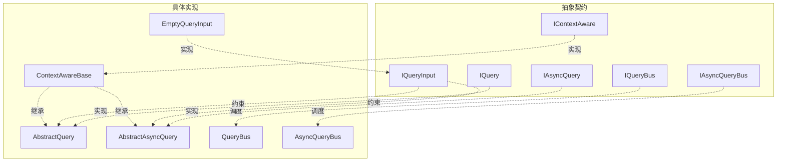
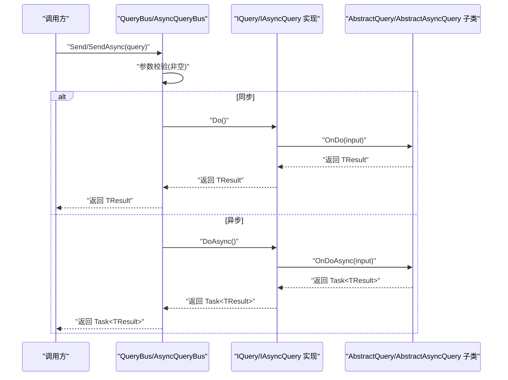
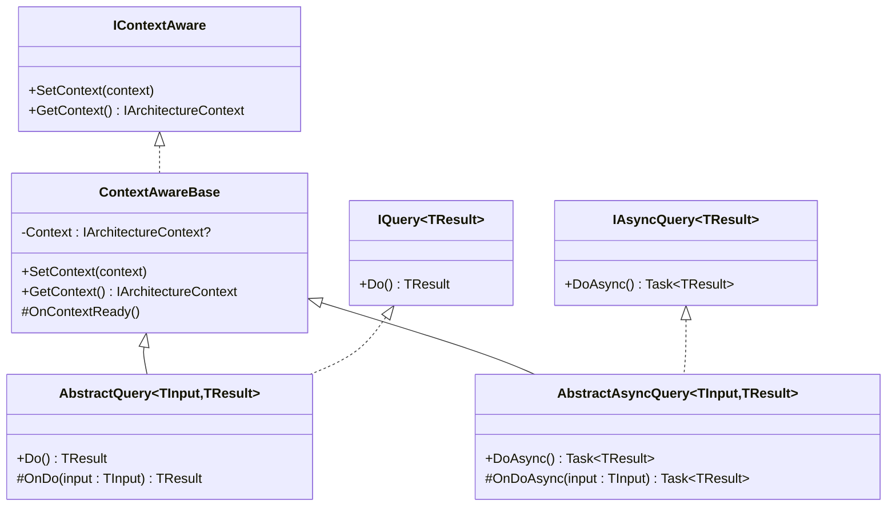
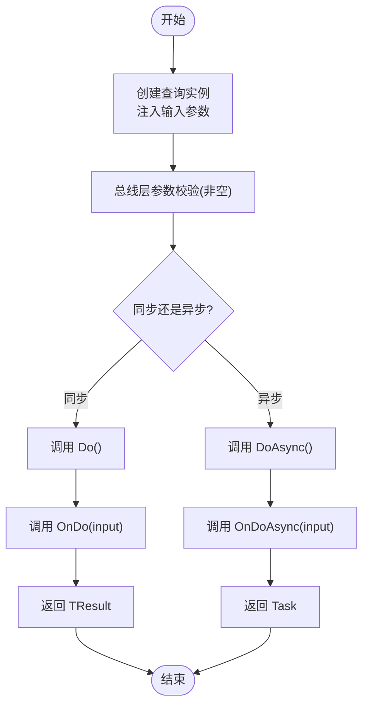
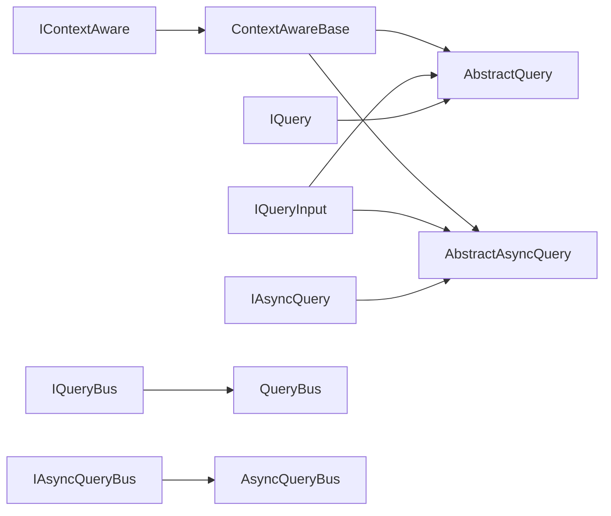

# 查询基类体系

<cite>
**本文引用的文件**
- [AbstractQuery.cs](file://GFramework.Core/query/AbstractQuery.cs)
- [AbstractAsyncQuery.cs](file://GFramework.Core/query/AbstractAsyncQuery.cs)
- [EmptyQueryInput.cs](file://GFramework.Core/query/EmptyQueryInput.cs)
- [QueryBus.cs](file://GFramework.Core/query/QueryBus.cs)
- [AsyncQueryBus.cs](file://GFramework.Core/query/AsyncQueryBus.cs)
- [IQuery.cs](file://GFramework.Core.Abstractions/query/IQuery.cs)
- [IAsyncQuery.cs](file://GFramework.Core.Abstractions/query/IAsyncQuery.cs)
- [IQueryBus.cs](file://GFramework.Core.Abstractions/query/IQueryBus.cs)
- [IAsyncQueryBus.cs](file://GFramework.Core.Abstractions/query/IAsyncQueryBus.cs)
- [IQueryInput.cs](file://GFramework.Core.Abstractions/query/IQueryInput.cs)
- [ContextAwareBase.cs](file://GFramework.Core/rule/ContextAwareBase.cs)
- [IContextAware.cs](file://GFramework.Core.Abstractions/rule/IContextAware.cs)
- [QueryBusTests.cs](file://GFramework.Core.Tests/query/QueryBusTests.cs)
- [AsyncQueryBusTests.cs](file://GFramework.Core.Tests/query/AsyncQueryBusTests.cs)
- [AbstractAsyncQueryTests.cs](file://GFramework.Core.Tests/query/AbstractAsyncQueryTests.cs)
</cite>

## 目录
1. [引言](#引言)
2. [项目结构](#项目结构)
3. [核心组件](#核心组件)
4. [架构概览](#架构概览)
5. [详细组件分析](#详细组件分析)
6. [依赖关系分析](#依赖关系分析)
7. [性能考虑](#性能考虑)
8. [故障排查指南](#故障排查指南)
9. [结论](#结论)
10. [附录](#附录)

## 引言
本文件系统化梳理查询基类体系，围绕以下目标展开：深入解释同步与异步查询基类的设计理念与实现细节；阐明查询执行接口的契约与实现要求；说明查询输入模型的设计模式（含 EmptyQueryInput 的使用场景与自定义输入类型的实现方法）；解释查询生命周期（创建、验证、执行、结果处理）；给出继承与扩展示例；介绍参数验证机制与结果映射策略；说明与架构其他组件的集成方式，并总结最佳实践、性能优化与缓存策略。

## 项目结构
查询体系位于 GFramework.Core 与 GFramework.Core.Abstractions 两个工程中，分别提供具体实现与抽象契约。核心文件分布如下：
- 抽象层（契约）：IQuery、IAsyncQuery、IQueryBus、IAsyncQueryBus、IQueryInput、IContextAware
- 具体实现：AbstractQuery、AbstractAsyncQuery、EmptyQueryInput、QueryBus、AsyncQueryBus
- 上下文感知：ContextAwareBase
- 测试：QueryBusTests、AsyncQueryBusTests、AbstractAsyncQueryTests

图表来源
- [IQuery.cs](file://GFramework.Core.Abstractions/query/IQuery.cs#L1-L16)
- [IAsyncQuery.cs](file://GFramework.Core.Abstractions/query/IAsyncQuery.cs#L1-L16)
- [IQueryBus.cs](file://GFramework.Core.Abstractions/query/IQueryBus.cs#L1-L15)
- [IAsyncQueryBus.cs](file://GFramework.Core.Abstractions/query/IAsyncQueryBus.cs#L1-L17)
- [IQueryInput.cs](file://GFramework.Core.Abstractions/query/IQueryInput.cs#L1-L6)
- [IContextAware.cs](file://GFramework.Core.Abstractions/rule/IContextAware.cs#L1-L21)
- [AbstractQuery.cs](file://GFramework.Core/query/AbstractQuery.cs#L1-L29)
- [AbstractAsyncQuery.cs](file://GFramework.Core/query/AbstractAsyncQuery.cs#L1-L32)
- [EmptyQueryInput.cs](file://GFramework.Core/query/EmptyQueryInput.cs#L1-L11)
- [QueryBus.cs](file://GFramework.Core/query/QueryBus.cs#L1-L23)
- [AsyncQueryBus.cs](file://GFramework.Core/query/AsyncQueryBus.cs#L1-L22)
- [ContextAwareBase.cs](file://GFramework.Core/rule/ContextAwareBase.cs#L1-L43)

章节来源
- [AbstractQuery.cs](file://GFramework.Core/query/AbstractQuery.cs#L1-L29)
- [AbstractAsyncQuery.cs](file://GFramework.Core/query/AbstractAsyncQuery.cs#L1-L32)
- [EmptyQueryInput.cs](file://GFramework.Core/query/EmptyQueryInput.cs#L1-L11)
- [QueryBus.cs](file://GFramework.Core/query/QueryBus.cs#L1-L23)
- [AsyncQueryBus.cs](file://GFramework.Core/query/AsyncQueryBus.cs#L1-L22)
- [IQuery.cs](file://GFramework.Core.Abstractions/query/IQuery.cs#L1-L16)
- [IAsyncQuery.cs](file://GFramework.Core.Abstractions/query/IAsyncQuery.cs#L1-L16)
- [IQueryBus.cs](file://GFramework.Core.Abstractions/query/IQueryBus.cs#L1-L15)
- [IAsyncQueryBus.cs](file://GFramework.Core.Abstractions/query/IAsyncQueryBus.cs#L1-L17)
- [IQueryInput.cs](file://GFramework.Core.Abstractions/query/IQueryInput.cs#L1-L6)
- [ContextAwareBase.cs](file://GFramework.Core/rule/ContextAwareBase.cs#L1-L43)
- [IContextAware.cs](file://GFramework.Core.Abstractions/rule/IContextAware.cs#L1-L21)

## 核心组件
- 同步查询基类 AbstractQuery<TInput, TResult>
  - 设计要点：通过泛型约束 TInput 实现 IQueryInput，封装 Do() 调用 OnDo(input)，子类仅需实现 OnDo。
  - 生命周期：创建（构造注入 input）、验证（由调用方保证 input 有效）、执行（Do -> OnDo）、结果返回。
- 异步查询基类 AbstractAsyncQuery<TInput, TResult>
  - 设计要点：与同步版本一致，但 DoAsync -> OnDoAsync 返回 Task<TResult>，适合 IO 密集或需要取消的场景。
- 查询输入模型 EmptyQueryInput
  - 使用场景：无需任何输入参数的查询；作为占位符实现 IQueryInput。
  - 自定义输入类型：实现 IQueryInput 并在查询类中声明对应泛型 TInput。
- 查询总线 QueryBus / AsyncQueryBus
  - 职责：接收 IQuery/IAsyncQuery 对象，进行参数校验（非空），转发到查询对象执行并返回结果。
  - 同步总线：Send(IQuery<TResult>) -> query.Do()
  - 异步总线：SendAsync(IAsyncQuery<TResult>) -> query.DoAsync()

章节来源
- [AbstractQuery.cs](file://GFramework.Core/query/AbstractQuery.cs#L11-L29)
- [AbstractAsyncQuery.cs](file://GFramework.Core/query/AbstractAsyncQuery.cs#L12-L32)
- [EmptyQueryInput.cs](file://GFramework.Core/query/EmptyQueryInput.cs#L5-L11)
- [QueryBus.cs](file://GFramework.Core/query/QueryBus.cs#L16-L22)
- [AsyncQueryBus.cs](file://GFramework.Core/query/AsyncQueryBus.cs#L16-L21)
- [IQueryInput.cs](file://GFramework.Core.Abstractions/query/IQueryInput.cs#L1-L6)

## 架构概览
查询体系采用“接口契约 + 抽象基类 + 总线分发”的分层设计，确保：
- 契约清晰：IQuery/IAsyncQuery 定义最小可执行能力
- 执行解耦：AbstractQuery/AbstractAsyncQuery 将执行细节留给子类
- 分发统一：QueryBus/AsyncQueryBus 提供集中式入口与基础验证
- 上下文感知：ContextAwareBase 为查询提供架构上下文访问能力

图表来源
- [QueryBus.cs](file://GFramework.Core/query/QueryBus.cs#L16-L22)
- [AsyncQueryBus.cs](file://GFramework.Core/query/AsyncQueryBus.cs#L16-L21)
- [IQuery.cs](file://GFramework.Core.Abstractions/query/IQuery.cs#L9-L16)
- [IAsyncQuery.cs](file://GFramework.Core.Abstractions/query/IAsyncQuery.cs#L9-L16)
- [AbstractQuery.cs](file://GFramework.Core/query/AbstractQuery.cs#L18-L21)
- [AbstractAsyncQuery.cs](file://GFramework.Core/query/AbstractAsyncQuery.cs#L21-L24)

## 详细组件分析

### 接口契约与实现要求
- IQuery<TResult>
  - 方法：Do() -> TResult
  - 实现要求：提供确定性、无副作用或受控副作用的纯查询逻辑
- IAsyncQuery<TResult>
  - 方法：DoAsync() -> Task<TResult>
  - 实现要求：避免阻塞，支持取消与超时；错误应直接传播
- IQueryBus / IAsyncQueryBus
  - 方法：Send/SendAsync 接收 IQuery/IAsyncQuery，返回 TResult/Task<TResult>
  - 实现要求：必须进行非空校验；其余交由查询对象处理

章节来源
- [IQuery.cs](file://GFramework.Core.Abstractions/query/IQuery.cs#L9-L16)
- [IAsyncQuery.cs](file://GFramework.Core.Abstractions/query/IAsyncQuery.cs#L9-L16)
- [IQueryBus.cs](file://GFramework.Core.Abstractions/query/IQueryBus.cs#L7-L14)
- [IAsyncQueryBus.cs](file://GFramework.Core.Abstractions/query/IAsyncQueryBus.cs#L8-L17)

### 抽象基类设计与实现细节
- AbstractQuery<TInput, TResult>
  - 构造：接收 TInput input（实现 IQueryInput）
  - Do() -> OnDo(input)；子类仅实现 OnDo
  - 适用场景：CPU 密集或内存内数据查询
- AbstractAsyncQuery<TInput, TResult>
  - 构造：接收 TInput input（实现 IQueryInput）
  - DoAsync() -> OnDoAsync(input)；子类仅实现 OnDoAsync
  - 适用场景：IO 操作、网络请求、可取消任务

图表来源
- [ContextAwareBase.cs](file://GFramework.Core/rule/ContextAwareBase.cs#L10-L43)
- [AbstractQuery.cs](file://GFramework.Core/query/AbstractQuery.cs#L11-L29)
- [AbstractAsyncQuery.cs](file://GFramework.Core/query/AbstractAsyncQuery.cs#L12-L32)
- [IContextAware.cs](file://GFramework.Core.Abstractions/rule/IContextAware.cs#L8-L21)
- [IQuery.cs](file://GFramework.Core.Abstractions/query/IQuery.cs#L9-L16)
- [IAsyncQuery.cs](file://GFramework.Core.Abstractions/query/IAsyncQuery.cs#L9-L16)

章节来源
- [AbstractQuery.cs](file://GFramework.Core/query/AbstractQuery.cs#L11-L29)
- [AbstractAsyncQuery.cs](file://GFramework.Core/query/AbstractAsyncQuery.cs#L12-L32)
- [ContextAwareBase.cs](file://GFramework.Core/rule/ContextAwareBase.cs#L10-L43)

### 查询输入模型设计模式
- EmptyQueryInput
  - 作用：实现 IQueryInput，作为“无输入”查询的占位符
  - 使用建议：当查询完全依赖上下文或全局状态时，避免冗余输入参数
- 自定义输入类型
  - 步骤：实现 IQueryInput；在查询类中声明为泛型 TInput；在构造函数中注入
  - 注意：输入应尽量轻量、不可变、可序列化（便于日志与调试）

章节来源
- [EmptyQueryInput.cs](file://GFramework.Core/query/EmptyQueryInput.cs#L5-L11)
- [IQueryInput.cs](file://GFramework.Core.Abstractions/query/IQueryInput.cs#L1-L6)

### 查询生命周期管理
- 创建：构造 AbstractQuery/AbstractAsyncQuery 时注入 TInput
- 验证：总线层对 query 进行非空校验；输入参数的有效性由子类 OnDo/OnDoAsync 内部处理
- 执行：同步 Do() 或异步 DoAsync()；内部委托给 OnDo/OnDoAsync
- 结果处理：返回 TResult 或 Task<TResult>；异常直接传播

图表来源
- [QueryBus.cs](file://GFramework.Core/query/QueryBus.cs#L16-L22)
- [AsyncQueryBus.cs](file://GFramework.Core/query/AsyncQueryBus.cs#L16-L21)
- [AbstractQuery.cs](file://GFramework.Core/query/AbstractQuery.cs#L18-L21)
- [AbstractAsyncQuery.cs](file://GFramework.Core/query/AbstractAsyncQuery.cs#L21-L24)

章节来源
- [QueryBus.cs](file://GFramework.Core/query/QueryBus.cs#L16-L22)
- [AsyncQueryBus.cs](file://GFramework.Core/query/AsyncQueryBus.cs#L16-L21)
- [AbstractQuery.cs](file://GFramework.Core/query/AbstractQuery.cs#L18-L21)
- [AbstractAsyncQuery.cs](file://GFramework.Core/query/AbstractAsyncQuery.cs#L21-L24)

### 继承与扩展示例
- 同步查询示例（来自测试）
  - 输入：TestQueryInput（实现 IQueryInput）
  - 查询：TestQuery（继承 AbstractQuery<TestQueryInput, int>）
  - 实现：重写 OnDo，返回 input.Value * 2
- 异步查询示例（来自测试）
  - 输入：TestAsyncQueryInput（实现 IQueryInput）
  - 查询：TestAsyncQuery（继承 AbstractAsyncQuery<TestAsyncQueryInput, int>）
  - 实现：重写 OnDoAsync，返回 Task.FromResult(input.Value * 2)
- 空输入查询
  - 使用 EmptyQueryInput 作为输入，查询内部从上下文或其他来源取值

章节来源
- [QueryBusTests.cs](file://GFramework.Core.Tests/query/QueryBusTests.cs#L81-L100)
- [AsyncQueryBusTests.cs](file://GFramework.Core.Tests/query/AsyncQueryBusTests.cs#L157-L176)
- [AbstractAsyncQueryTests.cs](file://GFramework.Core.Tests/query/AbstractAsyncQueryTests.cs#L254-L279)

### 参数验证机制与结果映射策略
- 参数验证
  - 总线层：对查询对象进行非空校验（ArgumentNullException）
  - 输入层：TInput 必须实现 IQueryInput；具体业务参数有效性由 OnDo/OnDoAsync 内部校验
- 结果映射
  - 直接映射：OnDo/OnDoAsync 返回 TResult
  - 复杂对象：可返回自定义 DTO 或实体；测试中展示了复杂对象与字符串、布尔等类型的返回
  - 异常传播：查询内部抛出的异常由总线层直接传播，便于上层统一处理

章节来源
- [QueryBus.cs](file://GFramework.Core/query/QueryBus.cs#L18-L21)
- [AsyncQueryBus.cs](file://GFramework.Core/query/AsyncQueryBus.cs#L18-L20)
- [QueryBusTests.cs](file://GFramework.Core.Tests/query/QueryBusTests.cs#L44-L47)
- [AsyncQueryBusTests.cs](file://GFramework.Core.Tests/query/AsyncQueryBusTests.cs#L46-L49)
- [AbstractAsyncQueryTests.cs](file://GFramework.Core.Tests/query/AbstractAsyncQueryTests.cs#L77-L84)

### 与架构其他组件的集成
- 上下文感知
  - AbstractQuery/AbstractAsyncQuery 继承 ContextAwareBase，可访问 IArchitectureContext
  - 通过 IContextAware.SetContext/GetContext 注入与获取上下文
- 与其他总线的协作
  - 查询总线与命令总线、事件总线协同工作，遵循统一的“输入-执行-输出”范式
- 可测试性
  - 测试覆盖了 Do/DoAsync 调用链、异常传播、多实例独立性、不同返回类型等

章节来源
- [ContextAwareBase.cs](file://GFramework.Core/rule/ContextAwareBase.cs#L21-L35)
- [IContextAware.cs](file://GFramework.Core.Abstractions/rule/IContextAware.cs#L14-L20)
- [AbstractAsyncQueryTests.cs](file://GFramework.Core.Tests/query/AbstractAsyncQueryTests.cs#L90-L117)

## 依赖关系分析
- 抽象层依赖
  - IQuery/IAsyncQuery 依赖 IContextAware（同步查询基类间接依赖）
  - IQueryBus/IAsyncQueryBus 依赖各自对应的接口
- 实现层依赖
  - AbstractQuery/AbstractAsyncQuery 依赖 ContextAwareBase 与 IQueryInput
  - QueryBus/AsyncQueryBus 依赖各自接口与查询对象
- 测试依赖
  - 测试类依赖具体查询实现与输入类型，验证契约与行为

图表来源
- [IContextAware.cs](file://GFramework.Core.Abstractions/rule/IContextAware.cs#L8-L21)
- [ContextAwareBase.cs](file://GFramework.Core/rule/ContextAwareBase.cs#L10-L43)
- [AbstractQuery.cs](file://GFramework.Core/query/AbstractQuery.cs#L11-L12)
- [AbstractAsyncQuery.cs](file://GFramework.Core/query/AbstractAsyncQuery.cs#L12-L15)
- [IQueryInput.cs](file://GFramework.Core.Abstractions/query/IQueryInput.cs#L1-L6)
- [IQuery.cs](file://GFramework.Core.Abstractions/query/IQuery.cs#L9-L16)
- [IAsyncQuery.cs](file://GFramework.Core.Abstractions/query/IAsyncQuery.cs#L9-L16)
- [IQueryBus.cs](file://GFramework.Core.Abstractions/query/IQueryBus.cs#L6-L14)
- [IAsyncQueryBus.cs](file://GFramework.Core.Abstractions/query/IAsyncQueryBus.cs#L8-L17)
- [QueryBus.cs](file://GFramework.Core/query/QueryBus.cs#L8-L22)
- [AsyncQueryBus.cs](file://GFramework.Core/query/AsyncQueryBus.cs#L8-L22)

章节来源
- [IContextAware.cs](file://GFramework.Core.Abstractions/rule/IContextAware.cs#L8-L21)
- [ContextAwareBase.cs](file://GFramework.Core/rule/ContextAwareBase.cs#L10-L43)
- [AbstractQuery.cs](file://GFramework.Core/query/AbstractQuery.cs#L11-L12)
- [AbstractAsyncQuery.cs](file://GFramework.Core/query/AbstractAsyncQuery.cs#L12-L15)
- [IQueryInput.cs](file://GFramework.Core.Abstractions/query/IQueryInput.cs#L1-L6)
- [IQuery.cs](file://GFramework.Core.Abstractions/query/IQuery.cs#L9-L16)
- [IAsyncQuery.cs](file://GFramework.Core.Abstractions/query/IAsyncQuery.cs#L9-L16)
- [IQueryBus.cs](file://GFramework.Core.Abstractions/query/IQueryBus.cs#L6-L14)
- [IAsyncQueryBus.cs](file://GFramework.Core.Abstractions/query/IAsyncQueryBus.cs#L8-L17)
- [QueryBus.cs](file://GFramework.Core/query/QueryBus.cs#L8-L22)
- [AsyncQueryBus.cs](file://GFramework.Core/query/AsyncQueryBus.cs#L8-L22)

## 性能考虑
- 选择同步或异步
  - CPU 密集且快速：优先 AbstractQuery，减少异步开销
  - IO 密集或可取消：优先 AbstractAsyncQuery，提升吞吐与响应性
- 结果类型
  - 尽量使用轻量、不可变的 DTO；避免大对象频繁拷贝
- 总线层校验
  - 利用总线层的非空校验，减少重复校验成本
- 缓存策略（建议）
  - 对于稳定查询，可在查询内部或上层总线层引入只读缓存（基于输入哈希键）
  - 注意缓存失效与一致性，结合事件驱动更新
- 并发与隔离
  - 多实例独立性已在测试中验证，避免共享可变状态

## 故障排查指南
- 常见问题
  - 传入空查询对象：总线层会抛出参数异常；请检查构造与注入
  - 查询内部异常：异常会直接传播至上层；请在上层捕获并记录
  - 上下文未设置：若查询依赖上下文，请确保通过 SetContext 注入
- 定位手段
  - 单元测试覆盖了异常路径与多实例行为，可参考测试用例定位问题
  - 在 OnDo/OnDoAsync 中增加必要的日志与断言

章节来源
- [QueryBus.cs](file://GFramework.Core/query/QueryBus.cs#L18-L21)
- [AsyncQueryBus.cs](file://GFramework.Core/query/AsyncQueryBus.cs#L18-L20)
- [QueryBusTests.cs](file://GFramework.Core.Tests/query/QueryBusTests.cs#L44-L47)
- [AsyncQueryBusTests.cs](file://GFramework.Core.Tests/query/AsyncQueryBusTests.cs#L46-L49)
- [AbstractAsyncQueryTests.cs](file://GFramework.Core.Tests/query/AbstractAsyncQueryTests.cs#L77-L84)

## 结论
查询基类体系通过清晰的契约、可复用的抽象与统一的总线分发，提供了高内聚、低耦合的查询执行框架。同步与异步基类分别适配不同场景，EmptyQueryInput 与自定义输入类型满足多样化的输入需求。配合上下文感知与严格的生命周期管理，查询体系易于扩展、测试与维护。建议在实际项目中遵循本文最佳实践，结合业务场景选择合适的执行模型与缓存策略。

## 附录
- 最佳实践
  - 明确输入模型：尽量使用 IQueryInput 的强类型输入，避免魔法参数
  - 控制副作用：查询应尽量无副作用或受控；必要时通过命令总线分离
  - 异常处理：在总线层统一捕获与记录，查询内部抛出语义化异常
  - 可测试性：为查询编写单元测试，覆盖正常路径、异常路径与边界条件
- 性能优化
  - 选择合适基类：根据任务特性选择同步或异步
  - 结果建模：使用不可变、轻量的数据结构
  - 缓存：对稳定查询引入只读缓存，注意一致性
- 集成建议
  - 与事件总线、命令总线协同，形成完整的 CQRS/事件驱动架构
  - 通过上下文注入访问服务与配置，避免硬编码