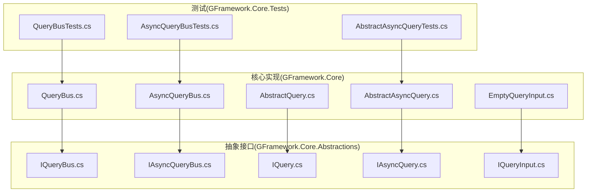
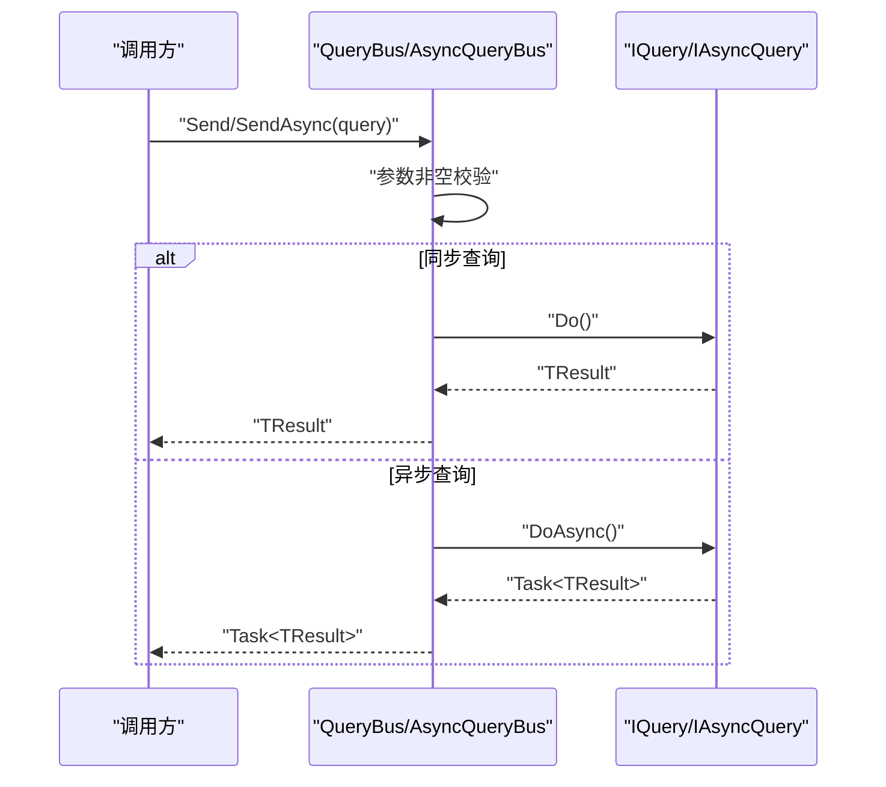
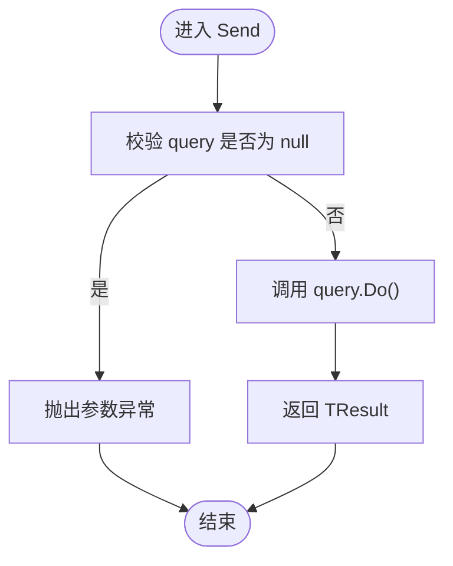
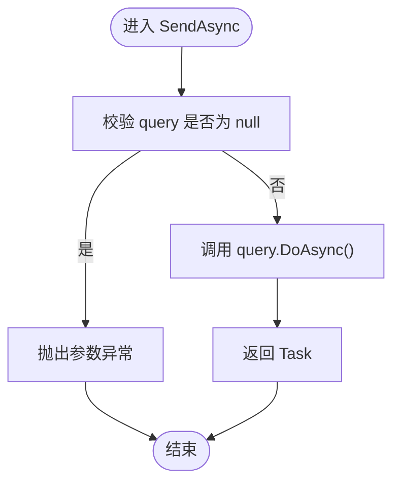
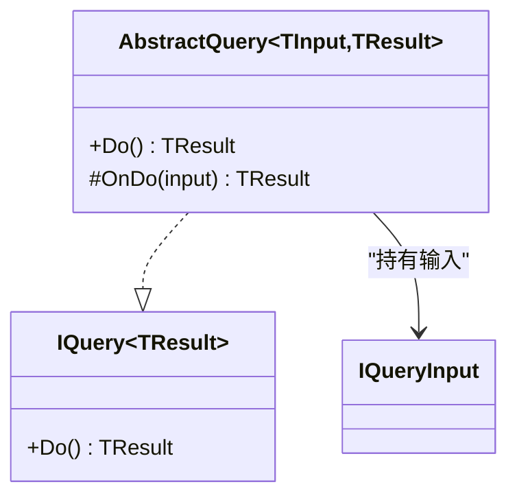
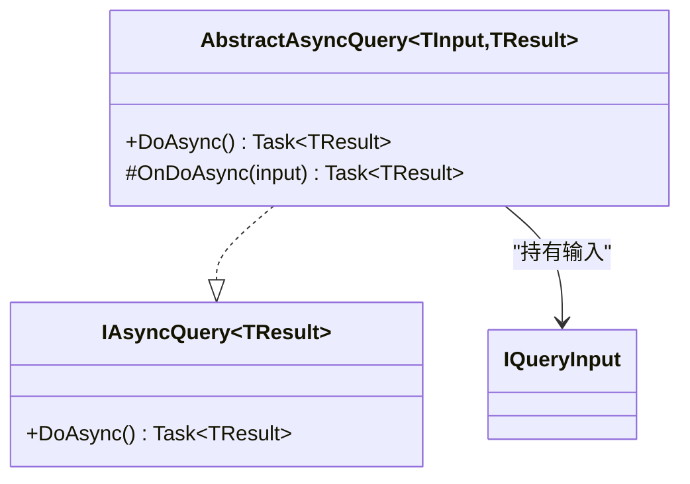
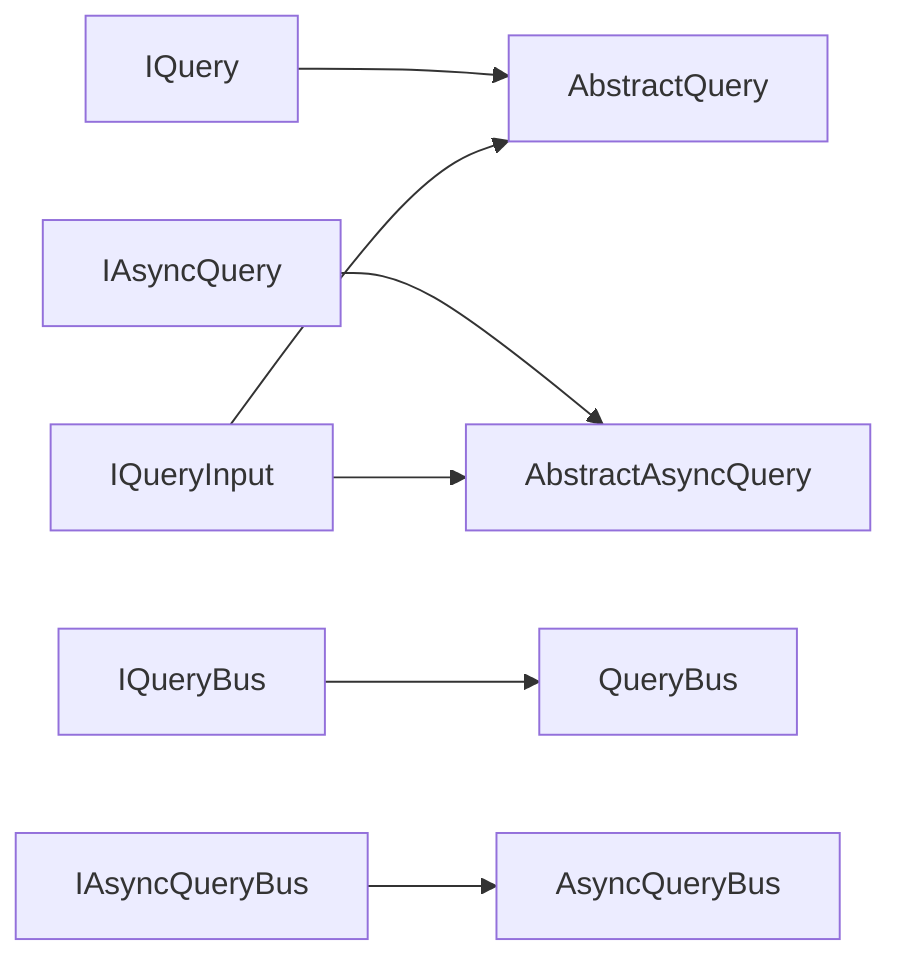

# 查询总线(QueryBus)

<cite>
**本文引用的文件**
- [GFramework.Core\query\QueryBus.cs](file://GFramework.Core/query\QueryBus.cs)
- [GFramework.Core\query\AsyncQueryBus.cs](file://GFramework.Core/query/AsyncQueryBus.cs)
- [GFramework.Core\query\AbstractQuery.cs](file://GFramework.Core/query/AbstractQuery.cs)
- [GFramework.Core\query\AbstractAsyncQuery.cs](file://GFramework.Core/query/AbstractAsyncQuery.cs)
- [GFramework.Core\query\EmptyQueryInput.cs](file://GFramework.Core/query/EmptyQueryInput.cs)
- [GFramework.Core.Abstractions\query\IQueryBus.cs](file://GFramework.Core.Abstractions/query/IQueryBus.cs)
- [GFramework.Core.Abstractions\query\IAsyncQueryBus.cs](file://GFramework.Core.Abstractions/query/IAsyncQueryBus.cs)
- [GFramework.Core.Abstractions\query\IQuery.cs](file://GFramework.Core.Abstractions/query/IQuery.cs)
- [GFramework.Core.Abstractions\query\IAsyncQuery.cs](file://GFramework.Core.Abstractions/query/IAsyncQuery.cs)
- [GFramework.Core.Abstractions\query\IQueryInput.cs](file://GFramework.Core.Abstractions/query/IQueryInput.cs)
- [GFramework.Core\query\README.md](file://GFramework.Core/query/README.md)
- [GFramework.Core.Tests\query\QueryBusTests.cs](file://GFramework.Core.Tests/query/QueryBusTests.cs)
- [GFramework.Core.Tests\query\AsyncQueryBusTests.cs](file://GFramework.Core.Tests/query/AsyncQueryBusTests.cs)
- [GFramework.Core.Tests\query\AbstractAsyncQueryTests.cs](file://GFramework.Core.Tests/query/AbstractAsyncQueryTests.cs)
</cite>

## 目录
1. [简介](#简介)
2. [项目结构](#项目结构)
3. [核心组件](#核心组件)
4. [架构概览](#架构概览)
5. [详细组件分析](#详细组件分析)
6. [依赖关系分析](#依赖关系分析)
7. [性能考量](#性能考量)
8. [故障排查指南](#故障排查指南)
9. [结论](#结论)
10. [附录](#附录)

## 简介
本文件围绕查询总线(QueryBus)与异步查询总线(AsyncQueryBus)进行系统化技术文档编写，目标包括：
- 解释查询总线作为查询处理核心组件的设计原理与实现细节
- 详述同步查询(IQuery/IQuery<TResult>)与异步查询(IAsyncQuery/IAsyncQuery<TResult>)的执行流程
- 说明查询参数传递与结果返回机制
- 提供简单与复杂查询的使用示例
- 介绍查询缓存策略与性能优化技术
- 对比查询总线与命令总线的差异及适用场景
- 总结最佳实践与错误处理策略

## 项目结构
查询相关代码位于 GFramework.Core 的 query 目录，并通过 GFramework.Core.Abstractions 定义跨层接口契约；测试位于 GFramework.Core.Tests 的 query 子目录。

图表来源
- [GFramework.Core\query\QueryBus.cs](file://GFramework.Core/query\QueryBus.cs#L1-L23)
- [GFramework.Core\query\AsyncQueryBus.cs](file://GFramework.Core/query/AsyncQueryBus.cs#L1-L22)
- [GFramework.Core\query\AbstractQuery.cs](file://GFramework.Core/query/AbstractQuery.cs#L1-L29)
- [GFramework.Core\query\AbstractAsyncQuery.cs](file://GFramework.Core/query/AbstractAsyncQuery.cs#L1-L32)
- [GFramework.Core\query\EmptyQueryInput.cs](file://GFramework.Core/query/EmptyQueryInput.cs#L1-L11)
- [GFramework.Core.Abstractions\query\IQueryBus.cs](file://GFramework.Core.Abstractions/query/IQueryBus.cs#L1-L15)
- [GFramework.Core.Abstractions\query\IAsyncQueryBus.cs](file://GFramework.Core.Abstractions/query/IAsyncQueryBus.cs#L1-L17)
- [GFramework.Core.Abstractions\query\IQuery.cs](file://GFramework.Core.Abstractions/query/IQuery.cs#L1-L16)
- [GFramework.Core.Abstractions\query\IAsyncQuery.cs](file://GFramework.Core.Abstractions/query/IAsyncQuery.cs#L1-L16)
- [GFramework.Core.Abstractions\query\IQueryInput.cs](file://GFramework.Core.Abstractions/query/IQueryInput.cs#L1-L6)
- [GFramework.Core.Tests\query\QueryBusTests.cs](file://GFramework.Core.Tests/query/QueryBusTests.cs#L1-L125)
- [GFramework.Core.Tests\query\AsyncQueryBusTests.cs](file://GFramework.Core.Tests/query/AsyncQueryBusTests.cs#L1-L296)
- [GFramework.Core.Tests\query\AbstractAsyncQueryTests.cs](file://GFramework.Core.Tests/query/AbstractAsyncQueryTests.cs#L1-L414)

章节来源
- [GFramework.Core\query\QueryBus.cs](file://GFramework.Core/query\QueryBus.cs#L1-L23)
- [GFramework.Core\query\AsyncQueryBus.cs](file://GFramework.Core/query/AsyncQueryBus.cs#L1-L22)
- [GFramework.Core.Abstractions\query\IQueryBus.cs](file://GFramework.Core.Abstractions/query/IQueryBus.cs#L1-L15)
- [GFramework.Core.Abstractions\query\IAsyncQueryBus.cs](file://GFramework.Core.Abstractions/query/IAsyncQueryBus.cs#L1-L17)

## 核心组件
- 同步查询总线：负责接收 IQuery<TResult> 并直接调用其 Do() 返回结果。
- 异步查询总线：负责接收 IAsyncQuery<TResult> 并直接调用其 DoAsync() 返回 Task<TResult>。
- 抽象查询基类：为同步查询提供模板方法，封装输入参数与上下文感知能力。
- 抽象异步查询基类：为异步查询提供模板方法，封装输入参数与上下文感知能力。
- 空查询输入：用于无需参数的查询场景。

章节来源
- [GFramework.Core\query\QueryBus.cs](file://GFramework.Core/query\QueryBus.cs#L16-L22)
- [GFramework.Core\query\AsyncQueryBus.cs](file://GFramework.Core/query/AsyncQueryBus.cs#L16-L21)
- [GFramework.Core\query\AbstractQuery.cs](file://GFramework.Core/query/AbstractQuery.cs#L18-L28)
- [GFramework.Core\query\AbstractAsyncQuery.cs](file://GFramework.Core/query/AbstractAsyncQuery.cs#L21-L31)
- [GFramework.Core\query\EmptyQueryInput.cs](file://GFramework.Core/query/EmptyQueryInput.cs#L11)

## 架构概览
查询总线遵循 CQRS 的查询侧设计，将“读取”与“写入”解耦。查询通过总线进入，由具体查询对象执行业务逻辑并返回结果；异步查询则返回 Task 以便在等待 I/O 或复杂计算时避免阻塞。

图表来源
- [GFramework.Core\query\QueryBus.cs](file://GFramework.Core/query\QueryBus.cs#L16-L22)
- [GFramework.Core\query\AsyncQueryBus.cs](file://GFramework.Core/query/AsyncQueryBus.cs#L16-L21)
- [GFramework.Core.Abstractions\query\IQuery.cs](file://GFramework.Core.Abstractions/query/IQuery.cs#L15)
- [GFramework.Core.Abstractions\query\IAsyncQuery.cs](file://GFramework.Core.Abstractions/query/IAsyncQuery.cs#L15)

## 详细组件分析

### 同步查询总线：QueryBus
- 职责：接收 IQuery<TResult>，进行空值校验后直接调用 Do() 返回结果。
- 参数与返回：泛型 TResult 表示查询结果类型；输入通过查询对象自身携带。
- 错误处理：对空查询抛出参数异常；查询内部异常由查询对象自行处理并传播。

图表来源
- [GFramework.Core\query\QueryBus.cs](file://GFramework.Core/query\QueryBus.cs#L16-L22)

章节来源
- [GFramework.Core\query\QueryBus.cs](file://GFramework.Core/query\QueryBus.cs#L16-L22)
- [GFramework.Core.Tests\query\QueryBusTests.cs](file://GFramework.Core.Tests/query/QueryBusTests.cs#L28-L62)

### 异步查询总线：AsyncQueryBus
- 职责：接收 IAsyncQuery<TResult>，进行空值校验后直接调用 DoAsync() 返回 Task<TResult>。
- 参数与返回：同样通过查询对象携带输入；返回 Task<TResult> 便于 await。
- 错误处理：对空查询抛出参数异常；查询内部异常随 Task 传播。

图表来源
- [GFramework.Core\query\AsyncQueryBus.cs](file://GFramework.Core/query/AsyncQueryBus.cs#L16-L21)

章节来源
- [GFramework.Core\query\AsyncQueryBus.cs](file://GFramework.Core/query/AsyncQueryBus.cs#L16-L21)
- [GFramework.Core.Tests\query\AsyncQueryBusTests.cs](file://GFramework.Core.Tests/query/AsyncQueryBusTests.cs#L29-L139)

### 抽象查询基类：AbstractQuery<TInput,TResult>
- 设计：继承上下文感知基类，构造函数注入输入参数 TInput（需实现 IQueryInput），对外暴露 Do()。
- 执行：Do() 内部调用受保护的 OnDo(TInput input)，子类仅需实现 OnDo 即可完成业务逻辑。
- 输入：通过构造函数注入，避免在 Do() 中重复解析参数。

图表来源
- [GFramework.Core\query\AbstractQuery.cs](file://GFramework.Core/query/AbstractQuery.cs#L11-L28)
- [GFramework.Core.Abstractions\query\IQuery.cs](file://GFramework.Core.Abstractions/query/IQuery.cs#L9-L15)
- [GFramework.Core.Abstractions\query\IQueryInput.cs](file://GFramework.Core.Abstractions/query/IQueryInput.cs#L1-L6)

章节来源
- [GFramework.Core\query\AbstractQuery.cs](file://GFramework.Core/query/AbstractQuery.cs#L11-L28)
- [GFramework.Core.Tests\query\QueryBusTests.cs](file://GFramework.Core.Tests/query/QueryBusTests.cs#L78-L100)

### 抽象异步查询基类：AbstractAsyncQuery<TInput,TResult>
- 设计：与同步版本类似，但 DoAsync() 返回 Task<TResult>，子类实现 OnDoAsync(TInput input)。
- 执行：DoAsync() 内部调用 OnDoAsync(input)，便于在复杂逻辑或 I/O 中异步执行。
- 输入：同样通过构造函数注入，保证一致性。

图表来源
- [GFramework.Core\query\AbstractAsyncQuery.cs](file://GFramework.Core/query/AbstractAsyncQuery.cs#L12-L31)
- [GFramework.Core.Abstractions\query\IAsyncQuery.cs](file://GFramework.Core.Abstractions/query/IAsyncQuery.cs#L9-L15)
- [GFramework.Core.Abstractions\query\IQueryInput.cs](file://GFramework.Core.Abstractions/query/IQueryInput.cs#L1-L6)

章节来源
- [GFramework.Core\query\AbstractAsyncQuery.cs](file://GFramework.Core/query/AbstractAsyncQuery.cs#L12-L31)
- [GFramework.Core.Tests\query\AbstractAsyncQueryTests.cs](file://GFramework.Core.Tests/query/AbstractAsyncQueryTests.cs#L254-L278)

### 空查询输入：EmptyQueryInput
- 作用：作为无参查询的占位输入，简化构造过程，避免冗余参数。
- 使用：在查询构造函数中传入 new EmptyQueryInput()，即可获得“无输入”的查询对象。

章节来源
- [GFramework.Core\query\EmptyQueryInput.cs](file://GFramework.Core/query/EmptyQueryInput.cs#L11)
- [GFramework.Core\query\README.md](file://GFramework.Core/query/README.md#L76-L86)

### 查询参数传递与结果返回机制
- 参数传递：通过查询对象的构造函数注入 TInput（实现 IQueryInput）。同步查询由 QueryBus 直接调用 Do()；异步查询由 AsyncQueryBus 直接调用 DoAsync()。
- 结果返回：同步查询返回 TResult；异步查询返回 Task<TResult>，调用方可 await 获取结果。
- 上下文感知：抽象查询基类均继承上下文感知基类，可在查询内访问架构上下文、模型与系统等资源。

章节来源
- [GFramework.Core\query\AbstractQuery.cs](file://GFramework.Core/query/AbstractQuery.cs#L11-L28)
- [GFramework.Core\query\AbstractAsyncQuery.cs](file://GFramework.Core/query/AbstractAsyncQuery.cs#L12-L31)
- [GFramework.Core\query\QueryBus.cs](file://GFramework.Core/query\QueryBus.cs#L16-L22)
- [GFramework.Core\query\AsyncQueryBus.cs](file://GFramework.Core/query/AsyncQueryBus.cs#L16-L21)

### 使用示例

#### 简单查询（无参）
- 定义查询输入：EmptyQueryInput
- 定义查询类：继承 AbstractQuery<EmptyQueryInput, TResult>，实现 OnDo
- 发送查询：在控制器或系统中通过 QueryBus.Send(query) 获取结果

章节来源
- [GFramework.Core\query\README.md](file://GFramework.Core/query/README.md#L76-L101)
- [GFramework.Core.Tests\query\QueryBusTests.cs](file://GFramework.Core.Tests/query/QueryBusTests.cs#L78-L100)

#### 复杂查询（带参数与组合）
- 带参数查询：定义输入类实现 IQueryInput，构造时传入 AbstractQuery<TInput,TResult>
- 组合查询：在一个查询中调用其他查询（如聚合数据、跨系统查询）
- 异步复杂查询：使用 AbstractAsyncQuery<TInput,TResult>，在 OnDoAsync 中执行异步逻辑

章节来源
- [GFramework.Core\query\README.md](file://GFramework.Core/query/README.md#L184-L202)
- [GFramework.Core\query\README.md](file://GFramework.Core/query/README.md#L208-L244)
- [GFramework.Core\query\README.md](file://GFramework.Core/query/README.md#L289-L320)
- [GFramework.Core.Tests\query\AbstractAsyncQueryTests.cs](file://GFramework.Core.Tests/query/AbstractAsyncQueryTests.cs#L254-L278)

## 依赖关系分析
- 接口到实现：IQueryBus/IAsyncQueryBus 分别被 QueryBus/AsyncQueryBus 实现；IQuery/IAsyncQuery 分别被 AbstractQuery/AbstractAsyncQuery 实现。
- 输入契约：所有查询均要求输入实现 IQueryInput，确保统一的输入约束。
- 测试覆盖：QueryBusTests、AsyncQueryBusTests、AbstractAsyncQueryTests 分别验证总线与查询的行为与异常传播。

图表来源
- [GFramework.Core.Abstractions\query\IQuery.cs](file://GFramework.Core.Abstractions/query/IQuery.cs#L9-L15)
- [GFramework.Core.Abstractions\query\IAsyncQuery.cs](file://GFramework.Core.Abstractions/query/IAsyncQuery.cs#L9-L15)
- [GFramework.Core.Abstractions\query\IQueryBus.cs](file://GFramework.Core.Abstractions/query/IQueryBus.cs#L6-L14)
- [GFramework.Core.Abstractions\query\IAsyncQueryBus.cs](file://GFramework.Core.Abstractions/query/IAsyncQueryBus.cs#L8-L16)
- [GFramework.Core.Abstractions\query\IQueryInput.cs](file://GFramework.Core.Abstractions/query/IQueryInput.cs#L1-L6)
- [GFramework.Core\query\AbstractQuery.cs](file://GFramework.Core/query/AbstractQuery.cs#L11-L28)
- [GFramework.Core\query\AbstractAsyncQuery.cs](file://GFramework.Core/query/AbstractAsyncQuery.cs#L12-L31)
- [GFramework.Core\query\QueryBus.cs](file://GFramework.Core/query\QueryBus.cs#L8)
- [GFramework.Core\query\AsyncQueryBus.cs](file://GFramework.Core/query/AsyncQueryBus.cs#L8)

章节来源
- [GFramework.Core.Abstractions\query\IQuery.cs](file://GFramework.Core.Abstractions/query/IQuery.cs#L9-L15)
- [GFramework.Core.Abstractions\query\IAsyncQuery.cs](file://GFramework.Core.Abstractions/query/IAsyncQuery.cs#L9-L15)
- [GFramework.Core.Abstractions\query\IQueryBus.cs](file://GFramework.Core.Abstractions/query/IQueryBus.cs#L6-L14)
- [GFramework.Core.Abstractions\query\IAsyncQueryBus.cs](file://GFramework.Core.Abstractions/query/IAsyncQueryBus.cs#L8-L16)
- [GFramework.Core\query\AbstractQuery.cs](file://GFramework.Core/query/AbstractQuery.cs#L11-L28)
- [GFramework.Core\query\AbstractAsyncQuery.cs](file://GFramework.Core/query/AbstractAsyncQuery.cs#L12-L31)
- [GFramework.Core\query\QueryBus.cs](file://GFramework.Core/query/QueryBus.cs#L8)
- [GFramework.Core\query\AsyncQueryBus.cs](file://GFramework.Core/query/AsyncQueryBus.cs#L8)

## 性能考量
- 缓存策略：建议在模型层对昂贵计算结果进行缓存，并提供失效机制；参考 README 中的示例。
- 批量查询：一次性查询多个数据，减少多次往返；参考 README 中的批量查询示例。
- 异步执行：对于 I/O 密集或复杂计算，优先使用 AsyncQueryBus 与 AbstractAsyncQuery，避免阻塞主线程。
- 避免过度查询：频繁读取的数据可通过可绑定属性或本地缓存降低查询频率。

章节来源
- [GFramework.Core\query\README.md](file://GFramework.Core/query/README.md#L379-L425)

## 故障排查指南
- 空查询异常：当传入 null 到总线时，会抛出参数异常。请确保查询对象非空后再发送。
- 查询内部异常：查询对象内部抛出的异常会直接传播至调用方；请在查询内部做好异常处理与日志记录。
- 异步异常：异步查询的异常通过 Task 传播，await 时会重新抛出；请在调用处使用 try/catch 或断言测试捕获。

章节来源
- [GFramework.Core.Tests\query\QueryBusTests.cs](file://GFramework.Core.Tests/query/QueryBusTests.cs#L44-L47)
- [GFramework.Core.Tests\query\AsyncQueryBusTests.cs](file://GFramework.Core.Tests/query/AsyncQueryBusTests.cs#L46-L49)
- [GFramework.Core.Tests\query\AbstractAsyncQueryTests.cs](file://GFramework.Core.Tests/query/AbstractAsyncQueryTests.cs#L77-L84)

## 结论
查询总线(QueryBus)与异步查询总线(AsyncQueryBus)构成了 GFramework 查询侧的核心执行通道。通过 IQuery/IAsyncQuery 与 AbstractQuery/AbstractAsyncQuery 的模板方法设计，开发者可以专注于业务逻辑的实现；通过 EmptyQueryInput 与 IQueryInput 的契约约束，保证了查询参数的一致性与可扩展性。配合 README 中的示例与最佳实践，查询总线能够在保持高内聚、低耦合的同时，兼顾性能与可维护性。

## 附录

### 查询总线与命令总线的对比
- 查询(Query)：只读取数据，返回结果；不应修改系统状态。
- 命令(Command)：修改系统状态，通常无返回值；用于表达意图并触发副作用。
- 选择建议：需要读取数据时使用 Query 与 QueryBus；需要改变系统状态时使用 Command 与 CommandBus。

章节来源
- [GFramework.Core\query\README.md](file://GFramework.Core/query/README.md#L323-L369)