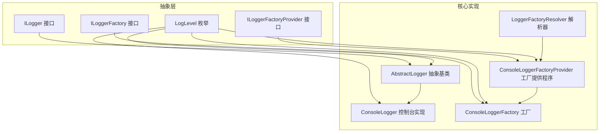
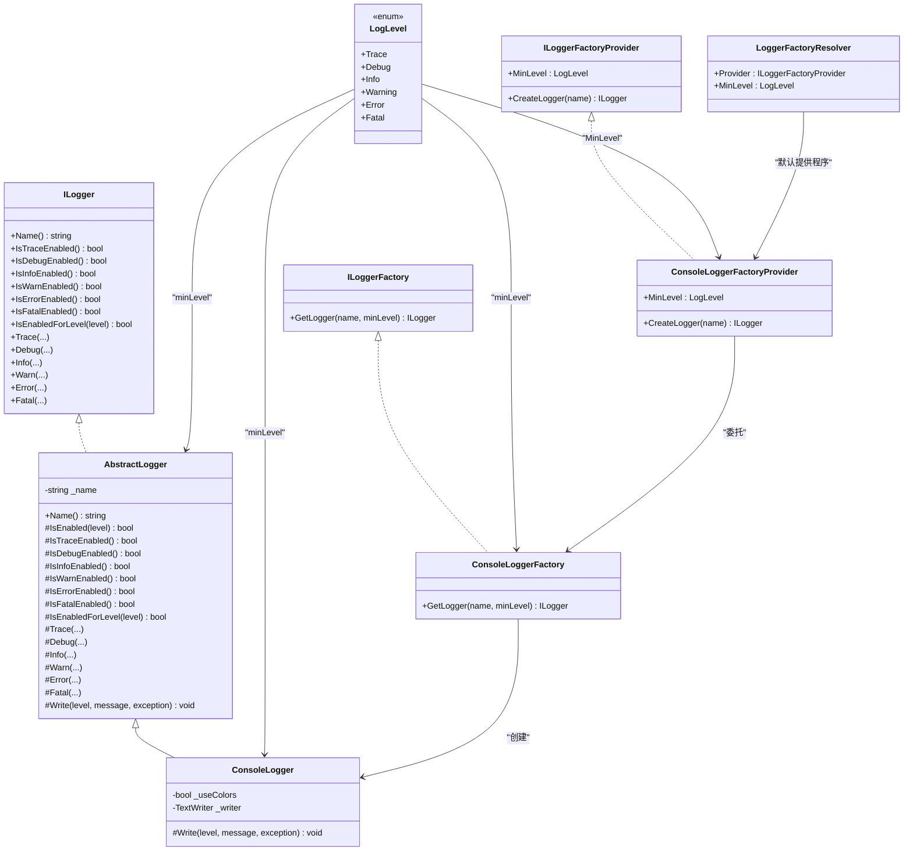
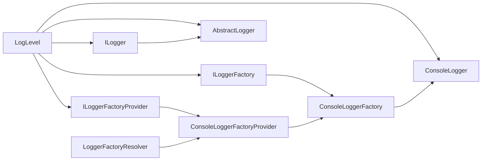

# 日志系统

<cite>
**本文引用的文件**
- [ILogger.cs](file://GFramework.Core.Abstractions/logging/ILogger.cs)
- [ILoggerFactory.cs](file://GFramework.Core.Abstractions/logging/ILoggerFactory.cs)
- [ILoggerFactoryProvider.cs](file://GFramework.Core.Abstractions/logging/ILoggerFactoryProvider.cs)
- [LogLevel.cs](file://GFramework.Core.Abstractions/logging/LogLevel.cs)
- [AbstractLogger.cs](file://GFramework.Core/logging/AbstractLogger.cs)
- [ConsoleLogger.cs](file://GFramework.Core/logging/ConsoleLogger.cs)
- [ConsoleLoggerFactory.cs](file://GFramework.Core/logging/ConsoleLoggerFactory.cs)
- [ConsoleLoggerFactoryProvider.cs](file://GFramework.Core/logging/ConsoleLoggerFactoryProvider.cs)
- [LoggerFactoryResolver.cs](file://GFramework.Core/logging/LoggerFactoryResolver.cs)
- [README.md](file://GFramework.Core/logging/README.md)
- [LoggerTests.cs](file://GFramework.Core.Tests/logging/LoggerTests.cs)
- [ConsoleLoggerTests.cs](file://GFramework.Core.Tests/logging/ConsoleLoggerTests.cs)
- [LoggerFactoryTests.cs](file://GFramework.Core.Tests/logging/LoggerFactoryTests.cs)
</cite>

## 目录
1. [简介](#简介)
2. [项目结构](#项目结构)
3. [核心组件](#核心组件)
4. [架构总览](#架构总览)
5. [组件详解](#组件详解)
6. [依赖关系分析](#依赖关系分析)
7. [性能考量](#性能考量)
8. [故障排查指南](#故障排查指南)
9. [结论](#结论)
10. [附录](#附录)

## 简介
本文件为 GFramework 日志系统的技术文档，围绕日志抽象层、控制台输出、工厂模式与解析器、日志级别与最佳实践展开，帮助开发者快速理解并扩展日志能力，构建可观测的游戏架构。

## 项目结构
日志系统位于 GFramework.Core 与 GFramework.Core.Abstractions 两个项目中，分别提供抽象接口与具体实现；Godot 平台另提供 GodotLogger 等扩展（本篇聚焦核心日志体系）。

图表来源
- [ILogger.cs](file://GFramework.Core.Abstractions/logging/ILogger.cs#L8-L314)
- [ILoggerFactory.cs](file://GFramework.Core.Abstractions/logging/ILoggerFactory.cs#L6-L15)
- [ILoggerFactoryProvider.cs](file://GFramework.Core.Abstractions/logging/ILoggerFactoryProvider.cs#L6-L19)
- [LogLevel.cs](file://GFramework.Core.Abstractions/logging/LogLevel.cs#L6-L37)
- [AbstractLogger.cs](file://GFramework.Core/logging/AbstractLogger.cs#L10-L12)
- [ConsoleLogger.cs](file://GFramework.Core/logging/ConsoleLogger.cs#L10-L14)
- [ConsoleLoggerFactory.cs](file://GFramework.Core/logging/ConsoleLoggerFactory.cs#L8-L20)
- [ConsoleLoggerFactoryProvider.cs](file://GFramework.Core/logging/ConsoleLoggerFactoryProvider.cs#L8-L24)
- [LoggerFactoryResolver.cs](file://GFramework.Core/logging/LoggerFactoryResolver.cs#L8-L26)

章节来源
- [README.md](file://GFramework.Core/logging/README.md#L1-L364)

## 核心组件
- 抽象接口层：定义日志记录器、工厂、工厂提供程序与日志级别的统一契约。
- 抽象基类：封装级别判断、格式化与异常处理，子类仅需实现 Write。
- 具体实现：ConsoleLogger 提供控制台输出与彩色打印；ConsoleLoggerFactory/Provider 提供实例创建；LoggerFactoryResolver 统一解析与配置。

章节来源
- [ILogger.cs](file://GFramework.Core.Abstractions/logging/ILogger.cs#L8-L314)
- [ILoggerFactory.cs](file://GFramework.Core.Abstractions/logging/ILoggerFactory.cs#L6-L15)
- [ILoggerFactoryProvider.cs](file://GFramework.Core.Abstractions/logging/ILoggerFactoryProvider.cs#L6-L19)
- [LogLevel.cs](file://GFramework.Core.Abstractions/logging/LogLevel.cs#L6-L37)
- [AbstractLogger.cs](file://GFramework.Core/logging/AbstractLogger.cs#L10-L12)
- [ConsoleLogger.cs](file://GFramework.Core/logging/ConsoleLogger.cs#L10-L14)
- [ConsoleLoggerFactory.cs](file://GFramework.Core/logging/ConsoleLoggerFactory.cs#L8-L20)
- [ConsoleLoggerFactoryProvider.cs](file://GFramework.Core/logging/ConsoleLoggerFactoryProvider.cs#L8-L24)
- [LoggerFactoryResolver.cs](file://GFramework.Core/logging/LoggerFactoryResolver.cs#L8-L26)

## 架构总览
日志系统采用“接口抽象 + 工厂 + 解析器”的分层设计，便于替换输出目标（控制台、文件、网络等），并通过解析器集中管理默认提供程序与全局最小级别。

图表来源
- [ILogger.cs](file://GFramework.Core.Abstractions/logging/ILogger.cs#L8-L314)
- [ILoggerFactory.cs](file://GFramework.Core.Abstractions/logging/ILoggerFactory.cs#L6-L15)
- [ILoggerFactoryProvider.cs](file://GFramework.Core.Abstractions/logging/ILoggerFactoryProvider.cs#L6-L19)
- [LogLevel.cs](file://GFramework.Core.Abstractions/logging/LogLevel.cs#L6-L37)
- [AbstractLogger.cs](file://GFramework.Core/logging/AbstractLogger.cs#L10-L12)
- [ConsoleLogger.cs](file://GFramework.Core/logging/ConsoleLogger.cs#L10-L14)
- [ConsoleLoggerFactory.cs](file://GFramework.Core/logging/ConsoleLoggerFactory.cs#L8-L20)
- [ConsoleLoggerFactoryProvider.cs](file://GFramework.Core/logging/ConsoleLoggerFactoryProvider.cs#L8-L24)
- [LoggerFactoryResolver.cs](file://GFramework.Core/logging/LoggerFactoryResolver.cs#L8-L26)

## 组件详解

### ILogger 接口与日志抽象层
- 设计要点
  - 统一日志级别检查与记录方法族，覆盖 Trace/Debug/Info/Warn/Error/Fatal。
  - 支持格式化参数与异常附带，避免不必要的字符串拼接开销。
  - 通过 Name() 提供命名空间级隔离，便于多模块日志分类。
- 复杂度与性能
  - 级别检查为 O(1)，格式化在启用时进行，未启用级别直接短路。
- 错误处理
  - 对未知级别抛出参数异常，保证上层调用健壮性。

章节来源
- [ILogger.cs](file://GFramework.Core.Abstractions/logging/ILogger.cs#L8-L314)
- [LoggerTests.cs](file://GFramework.Core.Tests/logging/LoggerTests.cs#L10-L421)

### AbstractLogger 抽象基类
- 设计模式
  - 模板方法：子类仅需实现 Write，其余级别判断、格式化、异常处理由基类完成。
- 关键机制
  - 最小级别 minLevel：IsEnabled(level) 做前置过滤。
  - 核心管道：Log(...) 负责格式化与异常包装，最终调用 Write。
  - 名称常量 ROOTLoggerName 用于默认日志器标识。
- 性能优化
  - 启用检查优先，避免格式化与 IO。
  - 参数化日志使用字符串格式化，减少中间字符串对象。

章节来源
- [AbstractLogger.cs](file://GFramework.Core/logging/AbstractLogger.cs#L10-L12)
- [AbstractLogger.cs](file://GFramework.Core/logging/AbstractLogger.cs#L49-L127)
- [AbstractLogger.cs](file://GFramework.Core/logging/AbstractLogger.cs#L462-L490)

### ConsoleLogger 控制台实现
- 输出格式
  - 时间戳：精确到毫秒。
  - 级别：大写并右对齐占位，统一宽度。
  - 名称：[Name()] 标识来源。
  - 异常：换行追加异常文本。
- 彩色输出
  - 仅在 writer 指向 Console.Out 且 useColors=true 时启用。
  - 不同级别映射不同控制台前景色。
- 可定制性
  - 支持自定义 TextWriter 与 useColors。
  - 默认最小级别为 Info，可通过构造函数调整。

章节来源
- [ConsoleLogger.cs](file://GFramework.Core/logging/ConsoleLogger.cs#L10-L14)
- [ConsoleLogger.cs](file://GFramework.Core/logging/ConsoleLogger.cs#L25-L38)
- [ConsoleLogger.cs](file://GFramework.Core/logging/ConsoleLogger.cs#L47-L78)
- [ConsoleLoggerTests.cs](file://GFramework.Core.Tests/logging/ConsoleLoggerTests.cs#L17-L278)

### ILoggerFactory 与 ConsoleLoggerFactory
- ILoggerFactory
  - 根据名称与最小级别创建 ILogger 实例。
- ConsoleLoggerFactory
  - 返回 ConsoleLogger 实例，内部默认最小级别为 Info。
- 使用建议
  - 通过工厂按模块/服务创建独立日志器，便于分级与过滤。

章节来源
- [ILoggerFactory.cs](file://GFramework.Core.Abstractions/logging/ILoggerFactory.cs#L6-L15)
- [ConsoleLoggerFactory.cs](file://GFramework.Core/logging/ConsoleLoggerFactory.cs#L8-L20)
- [LoggerFactoryTests.cs](file://GFramework.Core.Tests/logging/LoggerFactoryTests.cs#L14-L60)

### ILoggerFactoryProvider 与 ConsoleLoggerFactoryProvider
- ILoggerFactoryProvider
  - 暴露 MinLevel 属性，用于统一设定最小级别。
  - CreateLogger(name) 返回带名称与 MinLevel 的 ILogger。
- ConsoleLoggerFactoryProvider
  - 默认 MinLevel=Info；委托 ConsoleLoggerFactory.GetLogger(name, minLevel)。
- 多实例支持
  - 可创建多个提供程序实例，各自持有独立 MinLevel，互不影响已创建实例。

章节来源
- [ILoggerFactoryProvider.cs](file://GFramework.Core.Abstractions/logging/ILoggerFactoryProvider.cs#L6-L19)
- [ConsoleLoggerFactoryProvider.cs](file://GFramework.Core/logging/ConsoleLoggerFactoryProvider.cs#L8-L24)
- [LoggerFactoryTests.cs](file://GFramework.Core.Tests/logging/LoggerFactoryTests.cs#L62-L167)

### LoggerFactoryResolver 工厂解析机制
- 职责
  - Provider：全局默认工厂提供程序（默认 ConsoleLoggerFactoryProvider）。
  - MinLevel：全局最小级别（默认 Info）。
- 用法
  - 通过 Provider.CreateLogger(name) 获取日志器，自动应用 Provider 的 MinLevel。
  - 可动态切换 Provider 与 MinLevel，影响后续创建的日志器。
- 多实例支持
  - 已创建的日志器维持其构造时的 minLevel，不受 Provider.MinLevel 后续变更影响。

章节来源
- [LoggerFactoryResolver.cs](file://GFramework.Core/logging/LoggerFactoryResolver.cs#L8-L26)
- [LoggerFactoryTests.cs](file://GFramework.Core.Tests/logging/LoggerFactoryTests.cs#L96-L221)

### 日志级别设计与使用场景
- 级别定义
  - Trace → Debug → Info → Warning → Error → Fatal（数值递增）
- 使用建议
  - Trace：复杂流程追踪、函数调用链。
  - Debug：开发期变量、分支状态。
  - Info：关键业务流程、系统状态。
  - Warning：潜在问题，不影响运行。
  - Error：功能异常，可恢复。
  - Fatal：不可恢复错误。
- 性能与可读性
  - 通过最小级别裁剪日志量，避免生产环境噪声。
  - 结合命名空间区分模块，提升检索效率。

章节来源
- [LogLevel.cs](file://GFramework.Core.Abstractions/logging/LogLevel.cs#L6-L37)
- [README.md](file://GFramework.Core/logging/README.md#L289-L299)

## 依赖关系分析
- 抽象依赖
  - ILogger 依赖 LogLevel；ILoggerFactory/Provider 依赖 ILogger。
- 实现依赖
  - AbstractLogger 实现 ILogger，并依赖 LogLevel。
  - ConsoleLogger 继承 AbstractLogger，依赖控制台输出与颜色 API。
  - ConsoleLoggerFactory/Provider 依赖 ConsoleLogger 与 LogLevel。
  - LoggerFactoryResolver 依赖 ConsoleLoggerFactoryProvider 作为默认提供程序。
- 耦合与内聚
  - 抽象清晰，实现可替换；工厂与解析器解耦，便于扩展与测试。

图表来源
- [ILogger.cs](file://GFramework.Core.Abstractions/logging/ILogger.cs#L8-L314)
- [ILoggerFactory.cs](file://GFramework.Core.Abstractions/logging/ILoggerFactory.cs#L6-L15)
- [ILoggerFactoryProvider.cs](file://GFramework.Core.Abstractions/logging/ILoggerFactoryProvider.cs#L6-L19)
- [LogLevel.cs](file://GFramework.Core.Abstractions/logging/LogLevel.cs#L6-L37)
- [AbstractLogger.cs](file://GFramework.Core/logging/AbstractLogger.cs#L10-L12)
- [ConsoleLogger.cs](file://GFramework.Core/logging/ConsoleLogger.cs#L10-L14)
- [ConsoleLoggerFactory.cs](file://GFramework.Core/logging/ConsoleLoggerFactory.cs#L8-L20)
- [ConsoleLoggerFactoryProvider.cs](file://GFramework.Core/logging/ConsoleLoggerFactoryProvider.cs#L8-L24)
- [LoggerFactoryResolver.cs](file://GFramework.Core/logging/LoggerFactoryResolver.cs#L8-L26)

## 性能考量
- 级别检查优先：在记录前进行 IsEnabled 判断，避免格式化与 IO。
- 参数化日志：使用格式化方法减少中间字符串对象创建。
- 控制台输出：彩色输出仅在 Console.Out 且启用时生效，避免跨流色彩污染。
- 批量输出：多行日志分行输出，注意外部缓冲区大小与刷新策略。
- 生产建议：将 MinLevel 提升至 Info 或 Warning，降低日志写入压力。

章节来源
- [AbstractLogger.cs](file://GFramework.Core/logging/AbstractLogger.cs#L49-L52)
- [AbstractLogger.cs](file://GFramework.Core/logging/AbstractLogger.cs#L474-L478)
- [ConsoleLogger.cs](file://GFramework.Core/logging/ConsoleLogger.cs#L47-L78)
- [README.md](file://GFramework.Core/logging/README.md#L342-L355)

## 故障排查指南
- 日志未输出
  - 检查最小级别是否高于当前级别；通过 IsEnabledForLevel 验证。
  - 确认构造函数传入的 minLevel 是否正确。
- 输出不符合预期
  - ConsoleLogger 仅在 writer 为 Console.Out 且 useColors=true 时启用彩色。
  - 若传入自定义 TextWriter，请确认其是否被正确刷新。
- 多实例行为差异
  - Provider.MinLevel 变更不影响已创建实例；如需一致行为，重新创建实例。
- 异常信息未显示
  - 确保调用带 Exception 的重载方法；异常会在单独行追加。

章节来源
- [LoggerTests.cs](file://GFramework.Core.Tests/logging/LoggerTests.cs#L10-L421)
- [ConsoleLoggerTests.cs](file://GFramework.Core.Tests/logging/ConsoleLoggerTests.cs#L17-L278)
- [LoggerFactoryTests.cs](file://GFramework.Core.Tests/logging/LoggerFactoryTests.cs#L96-L257)

## 结论
GFramework 日志系统以清晰的抽象层与工厂解析机制为核心，既满足控制台开发的即时可观测性，又为多平台输出与多实例管理奠定基础。通过合理的日志级别与命名策略，结合参数化日志与最小级别裁剪，可在性能与可观测性之间取得平衡。

## 附录

### API 一览（核心）
- ILogger
  - 级别检查：IsTraceEnabled/IsDebugEnabled/IsInfoEnabled/IsWarnEnabled/IsErrorEnabled/IsFatalEnabled/IsEnabledForLevel
  - 记录方法：Trace/Debug/Info/Warn/Error/Fatal（支持格式化与异常）
  - 元数据：Name()
- ILoggerFactory：GetLogger(name, minLevel)
- ILoggerFactoryProvider：MinLevel + CreateLogger(name)
- LogLevel：Trace/Debug/Info/Warning/Error/Fatal
- AbstractLogger：模板方法 Write(level, message, exception)
- ConsoleLogger：控制台输出 + 彩色打印 + 可定制 TextWriter/useColors
- LoggerFactoryResolver：Provider（默认 ConsoleLoggerFactoryProvider）+ MinLevel（默认 Info）

章节来源
- [ILogger.cs](file://GFramework.Core.Abstractions/logging/ILogger.cs#L8-L314)
- [ILoggerFactory.cs](file://GFramework.Core.Abstractions/logging/ILoggerFactory.cs#L6-L15)
- [ILoggerFactoryProvider.cs](file://GFramework.Core.Abstractions/logging/ILoggerFactoryProvider.cs#L6-L19)
- [LogLevel.cs](file://GFramework.Core.Abstractions/logging/LogLevel.cs#L6-L37)
- [AbstractLogger.cs](file://GFramework.Core/logging/AbstractLogger.cs#L10-L12)
- [ConsoleLogger.cs](file://GFramework.Core/logging/ConsoleLogger.cs#L10-L14)
- [ConsoleLoggerFactory.cs](file://GFramework.Core/logging/ConsoleLoggerFactory.cs#L8-L20)
- [ConsoleLoggerFactoryProvider.cs](file://GFramework.Core/logging/ConsoleLoggerFactoryProvider.cs#L8-L24)
- [LoggerFactoryResolver.cs](file://GFramework.Core/logging/LoggerFactoryResolver.cs#L8-L26)

### 最佳实践
- 合理选择日志级别：Info 记录主业务，Debug 记录开发期细节，Warning/Error/Fatal 分级告警。
- 提供上下文：在消息中包含关键上下文（如用户 ID、任务 ID），便于检索。
- 异常记录：统一使用带 Exception 的重载，保留堆栈信息。
- 分类日志：按模块/服务创建独立日志器，使用名称区分来源。
- 性能监控：在关键路径埋点，结合日志与指标，形成闭环观测。

章节来源
- [README.md](file://GFramework.Core/logging/README.md#L300-L341)