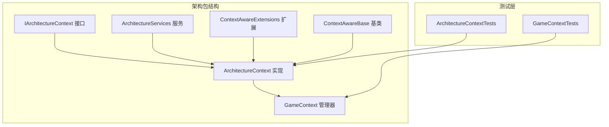
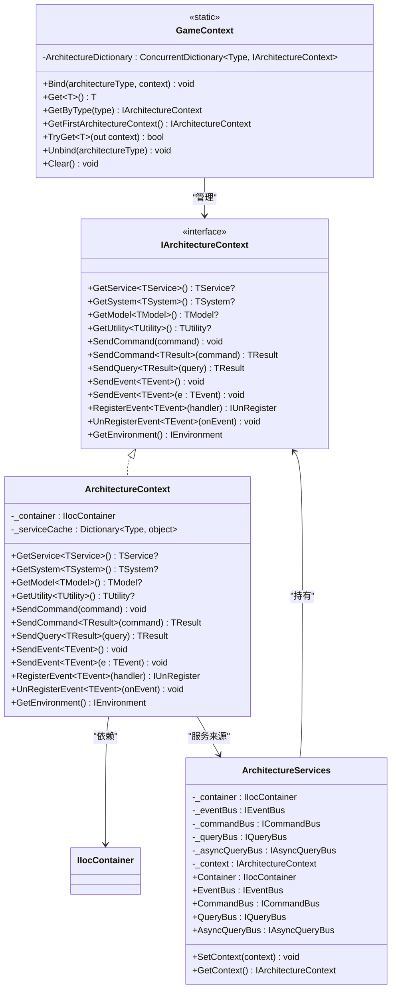
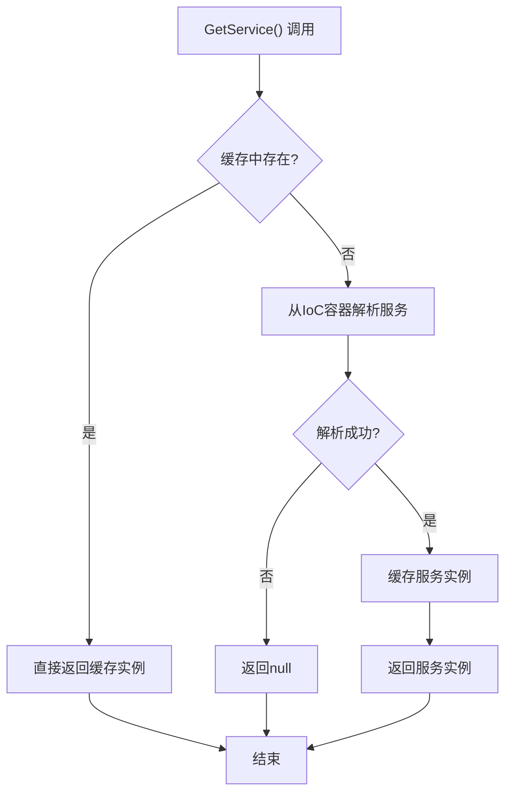
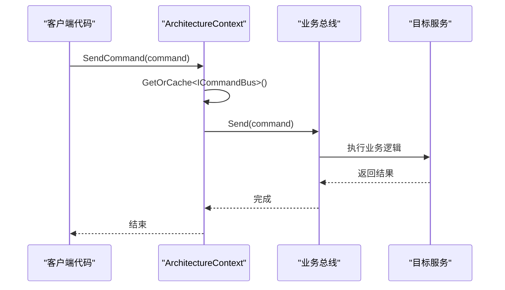
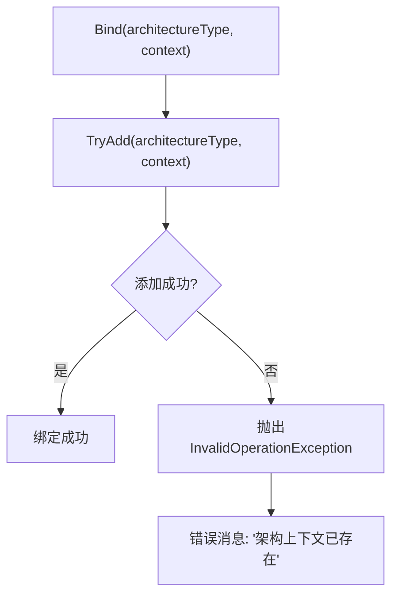
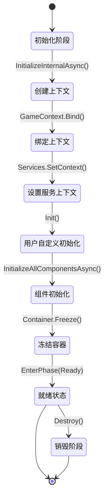
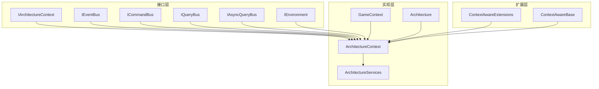

# 上下文管理

<cite>
**本文档引用的文件**
- [ArchitectureContext.cs](file://GFramework.Core/architecture/ArchitectureContext.cs)
- [GameContext.cs](file://GFramework.Core/architecture/GameContext.cs)
- [IArchitectureContext.cs](file://GFramework.Core.Abstractions/architecture/IArchitectureContext.cs)
- [ArchitectureServices.cs](file://GFramework.Core/architecture/ArchitectureServices.cs)
- [Architecture.cs](file://GFramework.Core/architecture/Architecture.cs)
- [ContextAwareExtensions.cs](file://GFramework.Core/extensions/ContextAwareExtensions.cs)
- [ContextAwareBase.cs](file://GFramework.Core/rule/ContextAwareBase.cs)
- [README.md](file://GFramework.Core/architecture/README.md)
- [ArchitectureContextTests.cs](file://GFramework.Core.Tests/architecture/ArchitectureContextTests.cs)
- [GameContextTests.cs](file://GFramework.Core.Tests/architecture/GameContextTests.cs)
</cite>

## 目录
1. [简介](#简介)
2. [项目结构](#项目结构)
3. [核心组件](#核心组件)
4. [架构概览](#架构概览)
5. [详细组件分析](#详细组件分析)
6. [依赖关系分析](#依赖关系分析)
7. [性能考量](#性能考量)
8. [故障排除指南](#故障排除指南)
9. [结论](#结论)
10. [附录](#附录)

## 简介
本文档深入解析GFramework的上下文管理系统，重点阐述ArchitectureContext类的设计理念与实现细节，详细说明GameContext的绑定机制，解释IArchitectureContext接口的职责分工，以及上下文在组件生命周期中的关键作用。同时提供线程安全考虑、性能优化策略、最佳实践示例和与其他架构组件的集成方式。

## 项目结构
GFramework的上下文管理位于Core架构包中，采用清晰的分层设计：
- 核心接口层：定义上下文访问契约
- 实现层：提供具体上下文实现和管理器
- 扩展层：为上下文感知组件提供便捷访问
- 测试层：验证上下文行为的正确性



**图表来源**
- [ArchitectureContext.cs](file://GFramework.Core/architecture/ArchitectureContext.cs#L1-L225)
- [GameContext.cs](file://GFramework.Core/architecture/GameContext.cs#L1-L111)
- [IArchitectureContext.cs](file://GFramework.Core.Abstractions/architecture/IArchitectureContext.cs#L1-L123)

**章节来源**
- [README.md](file://GFramework.Core/architecture/README.md#L1-L503)

## 核心组件
GFramework上下文管理系统由以下核心组件构成：

### IArchitectureContext接口
定义了架构上下文的标准契约，提供统一的服务访问入口：
- 服务获取：GetService<TService>()
- 组件访问：GetSystem<T>()、GetModel<T>()、GetUtility<T>()
- 业务操作：SendCommand()、SendQuery()、SendEvent()
- 环境管理：GetEnvironment()

### ArchitectureContext类
IArchitectureContext的具体实现，作为架构组件的统一上下文容器：
- 依赖注入容器集成：通过IIocContainer获取服务
- 服务缓存机制：避免重复解析和创建服务实例
- 业务操作封装：统一命令、查询、事件的执行入口
- 环境访问：提供对IEnvironment的便捷访问

### GameContext管理器
静态管理器负责维护架构上下文与类型的映射关系：
- 类型到上下文的绑定：Bind(Type, IArchitectureContext)
- 上下文检索：Get<T>()、GetByType()、GetFirstArchitectureContext()
- 线程安全：使用ConcurrentDictionary保证并发安全
- 生命周期管理：Clear()、Unbind()等清理方法

**章节来源**
- [IArchitectureContext.cs](file://GFramework.Core.Abstractions/architecture/IArchitectureContext.cs#L16-L123)
- [ArchitectureContext.cs](file://GFramework.Core/architecture/ArchitectureContext.cs#L16-L225)
- [GameContext.cs](file://GFramework.Core/architecture/GameContext.cs#L9-L111)

## 架构概览
GFramework的上下文管理系统采用分层架构设计，实现了松耦合的服务访问和统一的业务操作入口。



**图表来源**
- [IArchitectureContext.cs](file://GFramework.Core.Abstractions/architecture/IArchitectureContext.cs#L16-L123)
- [ArchitectureContext.cs](file://GFramework.Core/architecture/ArchitectureContext.cs#L16-L225)
- [GameContext.cs](file://GFramework.Core/architecture/GameContext.cs#L9-L111)
- [ArchitectureServices.cs](file://GFramework.Core/architecture/ArchitectureServices.cs#L17-L106)

## 详细组件分析

### ArchitectureContext类深度解析

#### 设计目的与实现原理
ArchitectureContext作为架构组件的统一上下文容器，其设计体现了以下核心理念：

1. **单一职责原则**：集中管理所有架构相关服务的访问
2. **懒加载优化**：仅在首次请求时解析和缓存服务实例
3. **类型安全**：通过泛型约束确保类型安全性
4. **错误处理**：提供明确的异常信息指导开发者

#### 服务缓存机制
ArchitectureContext实现了智能的服务缓存机制：



**图表来源**
- [ArchitectureContext.cs](file://GFramework.Core/architecture/ArchitectureContext.cs#L31-L41)

#### 业务操作封装
ArchitectureContext统一封装了命令、查询、事件的执行流程：



**图表来源**
- [ArchitectureContext.cs](file://GFramework.Core/architecture/ArchitectureContext.cs#L115-L134)

**章节来源**
- [ArchitectureContext.cs](file://GFramework.Core/architecture/ArchitectureContext.cs#L16-L225)

### GameContext绑定机制详解

#### Bind方法实现逻辑
GameContext的Bind方法实现了架构上下文与类型的绑定关系：



**图表来源**
- [GameContext.cs](file://GFramework.Core/architecture/GameContext.cs#L27-L32)

#### 类型到上下文的映射关系
GameContext维护了一个ConcurrentDictionary<Type, IArchitectureContext>来管理映射关系：

| 方法 | 功能 | 线程安全 |
|------|------|----------|
| Bind | 绑定架构类型到上下文 | 是 |
| Get | 获取指定类型的上下文 | 是 |
| GetByType | 根据类型获取上下文 | 是 |
| GetFirstArchitectureContext | 获取第一个上下文 | 是 |
| TryGet | 尝试获取上下文 | 是 |
| Unbind | 移除绑定 | 是 |
| Clear | 清空所有绑定 | 是 |

**章节来源**
- [GameContext.cs](file://GFramework.Core/architecture/GameContext.cs#L9-L111)

### IArchitectureContext接口职责分析

#### 服务访问职责
IArchitectureContext接口定义了统一的服务访问标准：

1. **通用服务获取**：GetService<TService>()提供任意服务的访问
2. **特定组件访问**：GetSystem<T>()、GetModel<T>()、GetUtility<T>()提供强类型访问
3. **环境访问**：GetEnvironment()提供运行环境信息

#### 业务操作职责
接口还定义了统一的业务操作入口：

1. **命令处理**：SendCommand()系列方法支持同步和异步命令执行
2. **查询处理**：SendQuery()系列方法支持同步和异步查询执行  
3. **事件管理**：SendEvent()、RegisterEvent()、UnRegisterEvent()提供完整的事件生命周期管理

**章节来源**
- [IArchitectureContext.cs](file://GFramework.Core.Abstractions/architecture/IArchitectureContext.cs#L16-L123)

### 上下文在组件生命周期中的作用

#### SetContext方法调用时机
在Architecture基类中，上下文的设置遵循严格的生命周期：



**图表来源**
- [Architecture.cs](file://GFramework.Core/architecture/Architecture.cs#L531-L566)

#### 上下文传递机制
组件通过以下方式接收上下文：

1. **自动传递**：Architecture.RegisterSystem/RegisterModel/RegisterUtility自动调用SetContext
2. **手动获取**：ContextAwareBase通过GameContext.GetFirstArchitectureContext()获取
3. **扩展方法**：ContextAwareExtensions提供便捷的上下文访问方法

**章节来源**
- [Architecture.cs](file://GFramework.Core/architecture/Architecture.cs#L423-L483)
- [ContextAwareBase.cs](file://GFramework.Core/rule/ContextAwareBase.cs#L10-L43)
- [ContextAwareExtensions.cs](file://GFramework.Core/extensions/ContextAwareExtensions.cs#L15-L231)

## 依赖关系分析

### 组件依赖图
GFramework上下文管理系统各组件之间的依赖关系如下：



**图表来源**
- [IArchitectureContext.cs](file://GFramework.Core.Abstractions/architecture/IArchitectureContext.cs#L16-L123)
- [ArchitectureContext.cs](file://GFramework.Core/architecture/ArchitectureContext.cs#L16-L225)
- [GameContext.cs](file://GFramework.Core/architecture/GameContext.cs#L9-L111)
- [ArchitectureServices.cs](file://GFramework.Core/architecture/ArchitectureServices.cs#L17-L106)
- [Architecture.cs](file://GFramework.Core/architecture/Architecture.cs#L23-L569)
- [ContextAwareExtensions.cs](file://GFramework.Core/extensions/ContextAwareExtensions.cs#L15-L231)
- [ContextAwareBase.cs](file://GFramework.Core/rule/ContextAwareBase.cs#L10-L43)

### 依赖注入与服务注册
ArchitectureServices负责核心服务的注册和管理：

| 服务类型 | 实现类 | 注册位置 | 用途 |
|----------|--------|----------|------|
| IEventBus | EventBus | 构造函数 | 事件发布订阅 |
| ICommandBus | CommandBus | 构造函数 | 命令执行调度 |
| IQueryBus | QueryBus | 构造函数 | 查询执行调度 |
| IAsyncQueryBus | AsyncQueryBus | 构造函数 | 异步查询执行调度 |
| IIocContainer | IocContainer | 构造函数 | 依赖注入容器 |

**章节来源**
- [ArchitectureServices.cs](file://GFramework.Core/architecture/ArchitectureServices.cs#L17-L106)

## 性能考量

### 线程安全设计
GFramework在上下文管理中采用了多种线程安全策略：

1. **ConcurrentDictionary**：GameContext使用ConcurrentDictionary确保多线程环境下的一致性
2. **服务缓存**：ArchitectureContext的Dictionary在单线程环境下使用，避免锁竞争
3. **不可变配置**：架构常量使用ImmutableDictionary确保并发安全

### 性能优化策略

#### 缓存优化
- **服务实例缓存**：避免重复解析IoC容器中的服务实例
- **懒加载机制**：仅在首次访问时创建和缓存服务
- **弱引用策略**：对于可能被销毁的服务，考虑使用弱引用避免内存泄漏

#### 并发优化
- **无锁数据结构**：优先使用ConcurrentDictionary而非加锁的普通字典
- **批量操作**：支持批量注册和获取组件，减少方法调用开销
- **异步处理**：提供异步版本的业务操作，避免阻塞主线程

#### 内存管理
- **对象池化**：对于频繁创建销毁的对象，考虑使用对象池
- **及时释放**：确保不再使用的上下文引用能够被垃圾回收
- **弱事件订阅**：避免事件订阅导致的循环引用

**章节来源**
- [GameContext.cs](file://GFramework.Core/architecture/GameContext.cs#L11-L12)
- [ArchitectureContext.cs](file://GFramework.Core/architecture/ArchitectureContext.cs#L18-L19)

## 故障排除指南

### 常见问题与解决方案

#### 上下文未绑定问题
**症状**：调用GameContext.Get<T>()时抛出"架构上下文未找到"异常
**原因**：架构实例未正确初始化或上下文未绑定
**解决方案**：
1. 确保Architecture.Initialize()或InitializeAsync()已调用
2. 检查GameContext.Bind()是否在架构初始化后调用
3. 验证架构类型参数是否正确

#### 服务未注册问题
**症状**：调用GetService<T>()返回null或抛出"服务未注册"异常
**原因**：目标服务未在IoC容器中注册
**解决方案**：
1. 确保服务在Architecture.Init()中正确注册
2. 检查服务的生命周期和作用域
3. 验证服务接口与实现类的匹配

#### 线程安全问题
**症状**：多线程环境下出现数据不一致或死锁
**原因**：对GameContext的并发访问
**解决方案**：
1. 使用TryGet<T>()进行安全的上下文获取
2. 避免在多线程环境中修改GameContext的状态
3. 对于需要修改的操作，使用适当的同步机制

### 调试技巧
1. **日志追踪**：利用架构的日志系统跟踪上下文的创建和销毁过程
2. **断点调试**：在SetContext调用处设置断点，验证上下文传递的正确性
3. **单元测试**：编写针对上下文管理的单元测试，验证边界条件

**章节来源**
- [GameContextTests.cs](file://GFramework.Core.Tests/architecture/GameContextTests.cs#L156-L198)
- [ArchitectureContextTests.cs](file://GFramework.Core.Tests/architecture/ArchitectureContextTests.cs#L85-L111)

## 结论
GFramework的上下文管理系统通过精心设计的架构，实现了组件间松耦合的通信和统一的服务访问。ArchitectureContext作为核心容器，不仅提供了强大的服务管理能力，还通过智能缓存和统一的业务操作入口，显著提升了系统的可维护性和性能。GameContext的线程安全设计和灵活的绑定机制，确保了在复杂应用场景下的稳定性和可靠性。结合IArchitectureContext接口的标准化契约，整个系统形成了清晰的层次结构和明确的职责分工。

## 附录

### 最佳实践示例

#### 在组件中正确获取和使用上下文
```csharp
// 方式1：通过ContextAwareBase基类
public class MyComponent : ContextAwareBase
{
    protected override void OnContextReady()
    {
        // 在这里可以安全地使用Context
        var system = Context.GetSystem<MySystem>();
        var model = Context.GetModel<MyModel>();
    }
}

// 方式2：通过ContextAwareExtensions扩展方法
public class MyComponent : IContextAware
{
    public void DoSomething()
    {
        // 使用扩展方法获取上下文服务
        var system = this.GetSystem<MySystem>();
        var result = this.SendQuery(new MyQuery());
    }
}
```

#### 上下文系统的集成方式
1. **架构初始化**：在Architecture.Init()中注册所有需要的组件
2. **上下文绑定**：确保GameContext.Bind()在架构初始化完成后调用
3. **组件设置**：通过Architecture.RegisterSystem/RegisterModel自动设置上下文
4. **服务访问**：在组件中通过Context或扩展方法访问服务

#### 性能优化建议
1. **合理使用缓存**：利用ArchitectureContext的缓存机制避免重复解析
2. **异步操作**：优先使用异步版本的业务操作提升响应性
3. **批量处理**：对于大量组件的注册和初始化，考虑批量操作
4. **内存管理**：及时释放不再使用的上下文引用，避免内存泄漏