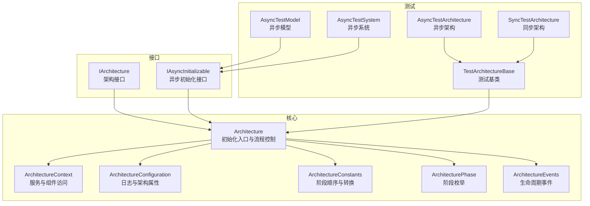
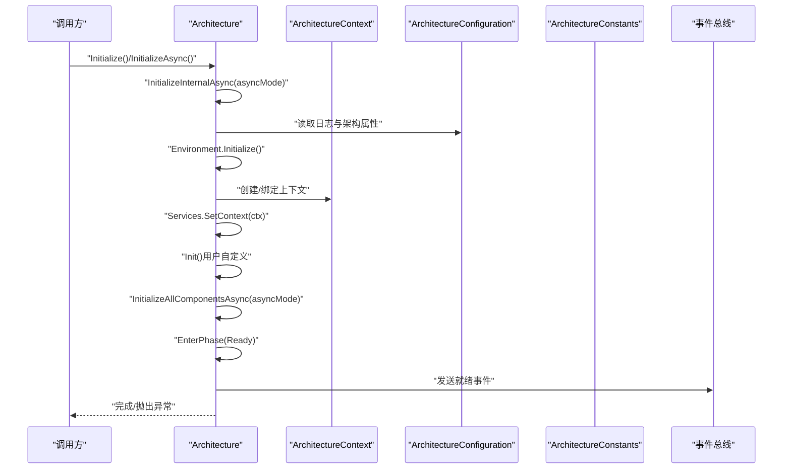
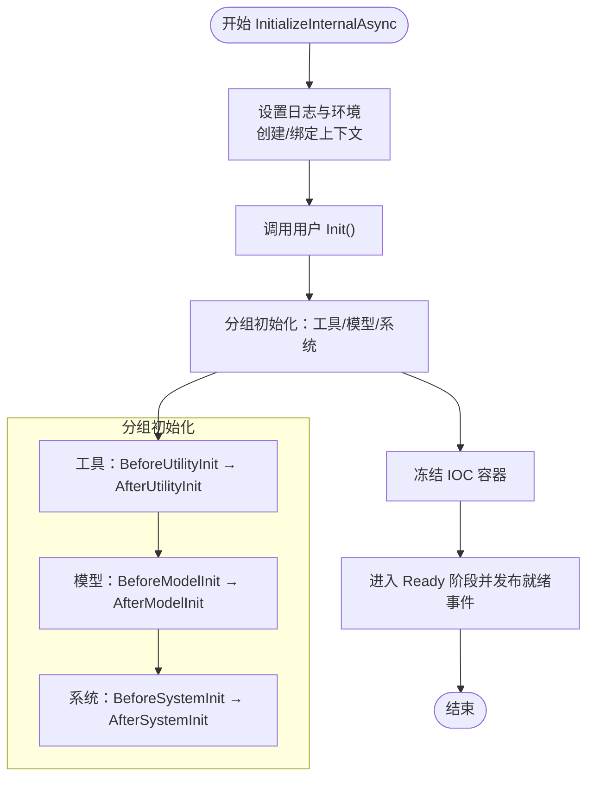
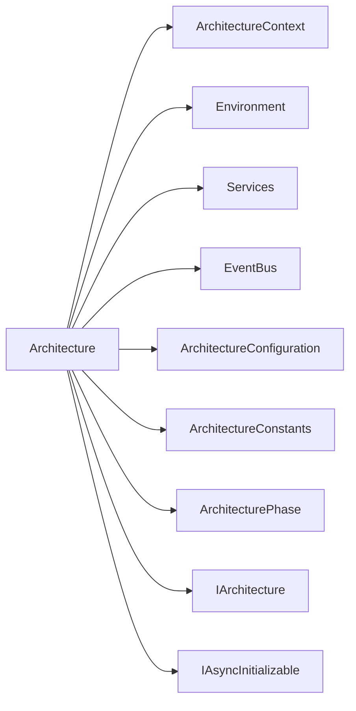

# 初始化流程

<cite>
**本文引用的文件**
- [GFramework.Core/architecture/Architecture.cs](file://GFramework.Core/architecture/Architecture.cs)
- [GFramework.Core/architecture/ArchitectureContext.cs](file://GFramework.Core/architecture/ArchitectureContext.cs)
- [GFramework.Core/architecture/ArchitectureConfiguration.cs](file://GFramework.Core/architecture/ArchitectureConfiguration.cs)
- [GFramework.Core/architecture/ArchitectureConstants.cs](file://GFramework.Core/architecture/ArchitectureConstants.cs)
- [GFramework.Core.Abstractions/architecture/IArchitecture.cs](file://GFramework.Core.Abstractions/architecture/IArchitecture.cs)
- [GFramework.Core.Abstractions/architecture/IAsyncInitializable.cs](file://GFramework.Core.Abstractions/architecture/IAsyncInitializable.cs)
- [GFramework.Core.Abstractions/enums/ArchitecturePhase.cs](file://GFramework.Core.Abstractions/enums/ArchitecturePhase.cs)
- [GFramework.Core/events/ArchitectureEvents.cs](file://GFramework.Core/events/ArchitectureEvents.cs)
- [GFramework.Core.Tests/architecture/TestArchitectureBase.cs](file://GFramework.Core.Tests/architecture/TestArchitectureBase.cs)
- [GFramework.Core.Tests/architecture/AsyncTestArchitecture.cs](file://GFramework.Core.Tests/architecture/AsyncTestArchitecture.cs)
- [GFramework.Core.Tests/architecture/SyncTestArchitecture.cs](file://GFramework.Core.Tests/architecture/SyncTestArchitecture.cs)
- [GFramework.Core.Tests/model/AsyncTestModel.cs](file://GFramework.Core.Tests/model/AsyncTestModel.cs)
- [GFramework.Core.Tests/system/AsyncTestSystem.cs](file://GFramework.Core.Tests/system/AsyncTestSystem.cs)
</cite>

## 目录
1. [简介](#简介)
2. [项目结构](#项目结构)
3. [核心组件](#核心组件)
4. [架构总览](#架构总览)
5. [详细组件分析](#详细组件分析)
6. [依赖分析](#依赖分析)
7. [性能考虑](#性能考虑)
8. [故障排查指南](#故障排查指南)
9. [结论](#结论)
10. [附录](#附录)

## 简介
本文件聚焦于 GFramework 的架构初始化流程，系统性解析以下主题：
- Initialize 与 InitializeAsync 的区别及适用场景
- InitializeInternalAsync 的完整初始化步骤与阶段划分
- 基础环境设置、架构上下文初始化、用户自定义初始化、组件初始化分组、容器冻结与就绪通知
- 异步初始化模式（asyncMode）的选择与 IAsyncInitializable 接口支持
- 初始化失败处理机制与 ArchitecturePhase.FailedInitialization 的触发条件
- 初始化流程时序图与同步/异步最佳实践示例

## 项目结构
围绕初始化流程的关键代码分布在以下模块：
- 核心架构与上下文：Architecture、ArchitectureContext
- 架构阶段与常量：ArchitecturePhase、ArchitectureConstants
- 配置与事件：ArchitectureConfiguration、ArchitectureEvents
- 接口契约：IArchitecture、IAsyncInitializable
- 测试样例：TestArchitectureBase、AsyncTestArchitecture、SyncTestArchitecture、AsyncTestModel、AsyncTestSystem

图表来源
- [GFramework.Core/architecture/Architecture.cs](file://GFramework.Core/architecture/Architecture.cs#L23-L569)
- [GFramework.Core/architecture/ArchitectureContext.cs](file://GFramework.Core/architecture/ArchitectureContext.cs#L16-L225)
- [GFramework.Core/architecture/ArchitectureConfiguration.cs](file://GFramework.Core/architecture/ArchitectureConfiguration.cs#L12-L35)
- [GFramework.Core/architecture/ArchitectureConstants.cs](file://GFramework.Core/architecture/ArchitectureConstants.cs#L9-L54)
- [GFramework.Core.Abstractions/architecture/IArchitecture.cs](file://GFramework.Core.Abstractions/architecture/IArchitecture.cs#L11-L68)
- [GFramework.Core.Abstractions/architecture/IAsyncInitializable.cs](file://GFramework.Core.Abstractions/architecture/IAsyncInitializable.cs#L8-L15)
- [GFramework.Core.Abstractions/enums/ArchitecturePhase.cs](file://GFramework.Core.Abstractions/enums/ArchitecturePhase.cs#L10-L66)
- [GFramework.Core/events/ArchitectureEvents.cs](file://GFramework.Core/events/ArchitectureEvents.cs#L6-L31)
- [GFramework.Core.Tests/architecture/TestArchitectureBase.cs](file://GFramework.Core.Tests/architecture/TestArchitectureBase.cs#L10-L58)
- [GFramework.Core.Tests/architecture/AsyncTestArchitecture.cs](file://GFramework.Core.Tests/architecture/AsyncTestArchitecture.cs#L9-L22)
- [GFramework.Core.Tests/architecture/SyncTestArchitecture.cs](file://GFramework.Core.Tests/architecture/SyncTestArchitecture.cs#L9-L20)
- [GFramework.Core.Tests/model/AsyncTestModel.cs](file://GFramework.Core.Tests/model/AsyncTestModel.cs#L10-L48)
- [GFramework.Core.Tests/system/AsyncTestSystem.cs](file://GFramework.Core.Tests/system/AsyncTestSystem.cs#L10-L46)

章节来源
- [GFramework.Core/architecture/Architecture.cs](file://GFramework.Core/architecture/Architecture.cs#L23-L569)
- [GFramework.Core/architecture/ArchitectureContext.cs](file://GFramework.Core/architecture/ArchitectureContext.cs#L16-L225)
- [GFramework.Core/architecture/ArchitectureConfiguration.cs](file://GFramework.Core/architecture/ArchitectureConfiguration.cs#L12-L35)
- [GFramework.Core/architecture/ArchitectureConstants.cs](file://GFramework.Core/architecture/ArchitectureConstants.cs#L9-L54)
- [GFramework.Core.Abstractions/architecture/IArchitecture.cs](file://GFramework.Core.Abstractions/architecture/IArchitecture.cs#L11-L68)
- [GFramework.Core.Abstractions/architecture/IAsyncInitializable.cs](file://GFramework.Core.Abstractions/architecture/IAsyncInitializable.cs#L8-L15)
- [GFramework.Core.Abstractions/enums/ArchitecturePhase.cs](file://GFramework.Core.Abstractions/enums/ArchitecturePhase.cs#L10-L66)
- [GFramework.Core/events/ArchitectureEvents.cs](file://GFramework.Core/events/ArchitectureEvents.cs#L6-L31)
- [GFramework.Core.Tests/architecture/TestArchitectureBase.cs](file://GFramework.Core.Tests/architecture/TestArchitectureBase.cs#L10-L58)
- [GFramework.Core.Tests/architecture/AsyncTestArchitecture.cs](file://GFramework.Core.Tests/architecture/AsyncTestArchitecture.cs#L9-L22)
- [GFramework.Core.Tests/architecture/SyncTestArchitecture.cs](file://GFramework.Core.Tests/architecture/SyncTestArchitecture.cs#L9-L20)
- [GFramework.Core.Tests/model/AsyncTestModel.cs](file://GFramework.Core.Tests/model/AsyncTestModel.cs#L10-L48)
- [GFramework.Core.Tests/system/AsyncTestSystem.cs](file://GFramework.Core.Tests/system/AsyncTestSystem.cs#L10-L46)

## 核心组件
- Architecture：提供 Initialize/InitializeAsync 入口，驱动 InitializeInternalAsync 完成初始化；负责阶段推进、事件通知、组件注册与销毁。
- ArchitectureContext：基于 IOC 容器的服务缓存与组件检索，封装命令/查询/事件的派发。
- ArchitectureConfiguration：默认日志工厂与架构属性（如是否允许后期注册、是否严格阶段校验）。
- ArchitectureConstants：阶段顺序与允许的阶段转换映射，定义 FailedInitialization 的“任意可达”特性。
- IArchitecture：继承 IAsyncInitializable，暴露 Initialize/Destroy、组件注册与模块安装等能力。
- IAsyncInitializable：定义 InitializeAsync 异步初始化契约。
- ArchitecturePhase：线性阶段序列，贯穿初始化与销毁全过程。
- ArchitectureEvents：初始化就绪、销毁中/完成、初始化失败等事件。

章节来源
- [GFramework.Core/architecture/Architecture.cs](file://GFramework.Core/architecture/Architecture.cs#L23-L569)
- [GFramework.Core/architecture/ArchitectureContext.cs](file://GFramework.Core/architecture/ArchitectureContext.cs#L16-L225)
- [GFramework.Core/architecture/ArchitectureConfiguration.cs](file://GFramework.Core/architecture/ArchitectureConfiguration.cs#L12-L35)
- [GFramework.Core/architecture/ArchitectureConstants.cs](file://GFramework.Core/architecture/ArchitectureConstants.cs#L9-L54)
- [GFramework.Core.Abstractions/architecture/IArchitecture.cs](file://GFramework.Core.Abstractions/architecture/IArchitecture.cs#L11-L68)
- [GFramework.Core.Abstractions/architecture/IAsyncInitializable.cs](file://GFramework.Core.Abstractions/architecture/IAsyncInitializable.cs#L8-L15)
- [GFramework.Core.Abstractions/enums/ArchitecturePhase.cs](file://GFramework.Core.Abstractions/enums/ArchitecturePhase.cs#L10-L66)
- [GFramework.Core/events/ArchitectureEvents.cs](file://GFramework.Core/events/ArchitectureEvents.cs#L6-L31)

## 架构总览
初始化流程由两条主线构成：
- 同步初始化：Initialize 内部通过阻塞等待 InitializeInternalAsync 完成，随后抛出失败阶段或继续。
- 异步初始化：InitializeAsync 直接 await InitializeInternalAsync，便于在 UI 线程或协程中挂起等待。

初始化主流程分为四个阶段：
1) 基础环境与上下文设置
2) 用户 Init 自定义初始化
3) 组件初始化分组（工具/模型/系统）
4) 容器冻结与就绪通知

图表来源
- [GFramework.Core/architecture/Architecture.cs](file://GFramework.Core/architecture/Architecture.cs#L492-L566)
- [GFramework.Core/architecture/ArchitectureContext.cs](file://GFramework.Core/architecture/ArchitectureContext.cs#L16-L225)
- [GFramework.Core/architecture/ArchitectureConfiguration.cs](file://GFramework.Core/architecture/ArchitectureConfiguration.cs#L12-L35)
- [GFramework.Core/architecture/ArchitectureConstants.cs](file://GFramework.Core/architecture/ArchitectureConstants.cs#L9-L54)
- [GFramework.Core/events/ArchitectureEvents.cs](file://GFramework.Core/events/ArchitectureEvents.cs#L6-L31)

## 详细组件分析

### Initialize 与 InitializeAsync 的区别与使用场景
- Initialize
  - 语义：阻塞式同步初始化，适合控制台应用或可安全阻塞的场景。
  - 实现：内部通过 GetAwaiter().GetResult() 等待 InitializeInternalAsync 完成，若异常则进入 FailedInitialization 并抛出。
- InitializeAsync
  - 语义：非阻塞式异步初始化，适合 Unity 主线程协程、UI 线程或需要并发控制的场景。
  - 实现：直接 await InitializeInternalAsync，异常同上处理。

章节来源
- [GFramework.Core/architecture/Architecture.cs](file://GFramework.Core/architecture/Architecture.cs#L492-L524)

### InitializeInternalAsync 的完整步骤
- 基础环境与上下文设置
  - 设置日志工厂提供程序与最小日志级别
  - 初始化 Environment
  - 创建/绑定 ArchitectureContext，设置 Services.Context
- 用户 Init
  - 调用受保护的 Init()，由子类实现注册组件与自定义逻辑
- 组件初始化分组
  - 工具（IContextUtility）、模型（IModel）、系统（ISystem）三类分组初始化
  - 每组在 Before*/After* 阶段间执行，支持异步/同步初始化
- 初始化完成
  - 冻结 IOC 容器，标记已初始化
  - 进入 Ready 阶段，发布 ArchitectureLifecycleReadyEvent

章节来源
- [GFramework.Core/architecture/Architecture.cs](file://GFramework.Core/architecture/Architecture.cs#L531-L566)
- [GFramework.Core/architecture/ArchitectureContext.cs](file://GFramework.Core/architecture/ArchitectureContext.cs#L16-L225)
- [GFramework.Core/architecture/ArchitectureConfiguration.cs](file://GFramework.Core/architecture/ArchitectureConfiguration.cs#L12-L35)
- [GFramework.Core/events/ArchitectureEvents.cs](file://GFramework.Core/events/ArchitectureEvents.cs#L6-L31)

### 组件初始化分组与阶段推进
- 分组策略
  - 工具：IContextUtility，先 AfterUtilityInit 再 BeforeModelInit
  - 模型：IModel，先 AfterModelInit 再 BeforeSystemInit
  - 系统：ISystem，最后 AfterSystemInit
- 阶段推进
  - 每个分组前后均进入对应 Before*/After* 阶段
  - 严格线性顺序，受 ArchitectureConstants 控制
- 异步支持
  - asyncMode=true 且组件实现 IAsyncInitializable 时调用 InitializeAsync
  - 否则调用 Init()

图表来源
- [GFramework.Core/architecture/Architecture.cs](file://GFramework.Core/architecture/Architecture.cs#L531-L566)
- [GFramework.Core/architecture/ArchitectureConstants.cs](file://GFramework.Core/architecture/ArchitectureConstants.cs#L9-L54)

章节来源
- [GFramework.Core/architecture/Architecture.cs](file://GFramework.Core/architecture/Architecture.cs#L264-L330)
- [GFramework.Core/architecture/ArchitectureConstants.cs](file://GFramework.Core/architecture/ArchitectureConstants.cs#L9-L54)

### 异步初始化模式（asyncMode）与 IAsyncInitializable 支持
- asyncMode 选择
  - true：优先尝试 IAsyncInitializable.InitializeAsync
  - false：回退到 IInitializable.Init
- IAsyncInitializable
  - 作为 IArchitecture 的父接口，保证架构自身具备异步初始化能力
  - 组件若实现该接口，将在 InitializeAllComponentsAsync 中被识别并异步初始化

章节来源
- [GFramework.Core/architecture/Architecture.cs](file://GFramework.Core/architecture/Architecture.cs#L337-L347)
- [GFramework.Core.Abstractions/architecture/IAsyncInitializable.cs](file://GFramework.Core.Abstractions/architecture/IAsyncInitializable.cs#L8-L15)
- [GFramework.Core.Abstractions/architecture/IArchitecture.cs](file://GFramework.Core.Abstractions/architecture/IArchitecture.cs#L11-L12)

### 初始化失败处理与 FailedInitialization 触发
- 触发条件
  - Initialize/InitializeAsync 在执行 InitializeInternalAsync 期间抛出异常
- 处理流程
  - 记录错误日志
  - 进入 ArchitecturePhase.FailedInitialization
  - 发布 ArchitectureFailedInitializationEvent
  - 重新抛出异常
- 阶段特性
  - FailedInitialization 可从任意阶段转换而来，便于兜底恢复

章节来源
- [GFramework.Core/architecture/Architecture.cs](file://GFramework.Core/architecture/Architecture.cs#L494-L504)
- [GFramework.Core/architecture/Architecture.cs](file://GFramework.Core/architecture/Architecture.cs#L513-L523)
- [GFramework.Core/architecture/Architecture.cs](file://GFramework.Core/architecture/Architecture.cs#L164-L183)
- [GFramework.Core.Abstractions/enums/ArchitecturePhase.cs](file://GFramework.Core.Abstractions/enums/ArchitecturePhase.cs#L62-L66)
- [GFramework.Core/events/ArchitectureEvents.cs](file://GFramework.Core/events/ArchitectureEvents.cs#L26-L31)

### 阶段推进与事件通知
- EnterPhase
  - 校验阶段转换合法性（受 ArchitectureProperties.StrictPhaseValidation 控制）
  - 通知生命周期钩子与架构阶段感知对象
- ArchitectureConstants
  - 定义线性阶段顺序与允许转换
  - FailedInitialization 作为“任意可达”的失败路径

章节来源
- [GFramework.Core/architecture/Architecture.cs](file://GFramework.Core/architecture/Architecture.cs#L142-L209)
- [GFramework.Core/architecture/ArchitectureConstants.cs](file://GFramework.Core/architecture/ArchitectureConstants.cs#L9-L54)
- [GFramework.Core/architecture/ArchitectureConfiguration.cs](file://GFramework.Core/architecture/ArchitectureConfiguration.cs#L30-L34)

### 使用示例与最佳实践
- 同步初始化（控制台/后台）
  - 适用于无需 UI 协程或阻塞可控的场景
  - 示例参考：[GFramework.Core.Tests/architecture/SyncTestArchitecture.cs](file://GFramework.Core.Tests/architecture/SyncTestArchitecture.cs#L9-L20)
- 异步初始化（Unity/前端）
  - 适用于主线程协程或需要避免阻塞 UI 的场景
  - 示例参考：[GFramework.Core.Tests/architecture/AsyncTestArchitecture.cs](file://GFramework.Core.Tests/architecture/AsyncTestArchitecture.cs#L9-L22)
- 组件异步初始化
  - 模型/系统实现 IAsyncInitializable，InitializeAsync 中执行异步逻辑
  - 示例参考：[GFramework.Core.Tests/model/AsyncTestModel.cs](file://GFramework.Core.Tests/model/AsyncTestModel.cs#L10-L48)、[GFramework.Core.Tests/system/AsyncTestSystem.cs](file://GFramework.Core.Tests/system/AsyncTestSystem.cs#L10-L46)
- 阶段感知与事件监听
  - 通过 ArchitectureContext.RegisterEvent 订阅就绪事件
  - 示例参考：[GFramework.Core.Tests/architecture/TestArchitectureBase.cs](file://GFramework.Core.Tests/architecture/TestArchitectureBase.cs#L41-L46)

章节来源
- [GFramework.Core.Tests/architecture/SyncTestArchitecture.cs](file://GFramework.Core.Tests/architecture/SyncTestArchitecture.cs#L9-L20)
- [GFramework.Core.Tests/architecture/AsyncTestArchitecture.cs](file://GFramework.Core.Tests/architecture/AsyncTestArchitecture.cs#L9-L22)
- [GFramework.Core.Tests/model/AsyncTestModel.cs](file://GFramework.Core.Tests/model/AsyncTestModel.cs#L10-L48)
- [GFramework.Core.Tests/system/AsyncTestSystem.cs](file://GFramework.Core.Tests/system/AsyncTestSystem.cs#L10-L46)
- [GFramework.Core.Tests/architecture/TestArchitectureBase.cs](file://GFramework.Core.Tests/architecture/TestArchitectureBase.cs#L41-L46)

## 依赖分析
- Architecture 对各子系统（环境、上下文、服务、事件总线、IOC 容器）存在强耦合，负责统一调度
- 组件注册遵循生命周期：先注册到 IOC，再登记到待初始化队列，最后在 Ready 前完成初始化
- 阶段推进依赖 ArchitectureConstants 的线性约束，FailedInitialization 作为兜底路径

图表来源
- [GFramework.Core/architecture/Architecture.cs](file://GFramework.Core/architecture/Architecture.cs#L23-L569)
- [GFramework.Core/architecture/ArchitectureContext.cs](file://GFramework.Core/architecture/ArchitectureContext.cs#L16-L225)
- [GFramework.Core/architecture/ArchitectureConfiguration.cs](file://GFramework.Core/architecture/ArchitectureConfiguration.cs#L12-L35)
- [GFramework.Core/architecture/ArchitectureConstants.cs](file://GFramework.Core/architecture/ArchitectureConstants.cs#L9-L54)
- [GFramework.Core.Abstractions/architecture/IArchitecture.cs](file://GFramework.Core.Abstractions/architecture/IArchitecture.cs#L11-L68)
- [GFramework.Core.Abstractions/architecture/IAsyncInitializable.cs](file://GFramework.Core.Abstractions/architecture/IAsyncInitializable.cs#L8-L15)
- [GFramework.Core.Abstractions/enums/ArchitecturePhase.cs](file://GFramework.Core.Abstractions/enums/ArchitecturePhase.cs#L10-L66)

章节来源
- [GFramework.Core/architecture/Architecture.cs](file://GFramework.Core/architecture/Architecture.cs#L23-L569)
- [GFramework.Core/architecture/ArchitectureContext.cs](file://GFramework.Core/architecture/ArchitectureContext.cs#L16-L225)
- [GFramework.Core/architecture/ArchitectureConfiguration.cs](file://GFramework.Core/architecture/ArchitectureConfiguration.cs#L12-L35)
- [GFramework.Core/architecture/ArchitectureConstants.cs](file://GFramework.Core/architecture/ArchitectureConstants.cs#L9-L54)
- [GFramework.Core.Abstractions/architecture/IArchitecture.cs](file://GFramework.Core.Abstractions/architecture/IArchitecture.cs#L11-L68)
- [GFramework.Core.Abstractions/architecture/IAsyncInitializable.cs](file://GFramework.Core.Abstractions/architecture/IAsyncInitializable.cs#L8-L15)
- [GFramework.Core.Abstractions/enums/ArchitecturePhase.cs](file://GFramework.Core.Abstractions/enums/ArchitecturePhase.cs#L10-L66)

## 性能考虑
- 组件分组初始化按类型顺序执行，避免跨类型依赖导致的死锁
- InitializeAllComponentsAsync 在每组内串行初始化，保证依赖顺序；如需并行，可在组件内部自行拆分子任务
- IOC 容器在 Ready 前冻结，有助于减少后续解析开销
- 日志级别与工厂提供程序可通过 ArchitectureConfiguration 调整，避免过度日志影响性能

## 故障排查指南
- 初始化失败
  - 现象：抛出异常并进入 FailedInitialization
  - 排查：检查 InitializeInternalAsync 中的用户 Init 与组件 InitializeAsync 是否正确实现
  - 参考：[GFramework.Core/architecture/Architecture.cs](file://GFramework.Core/architecture/Architecture.cs#L494-L504)、[GFramework.Core/architecture/Architecture.cs](file://GFramework.Core/architecture/Architecture.cs#L513-L523)
- 阶段转换异常
  - 现象：抛出非法阶段转换异常
  - 排查：确认是否启用了严格阶段校验，以及转换是否在允许列表内
  - 参考：[GFramework.Core/architecture/Architecture.cs](file://GFramework.Core/architecture/Architecture.cs#L164-L183)、[GFramework.Core/architecture/ArchitectureConstants.cs](file://GFramework.Core/architecture/ArchitectureConstants.cs#L38-L54)
- 组件注册时机
  - 现象：在 Ready 后注册组件抛出异常
  - 排查：调整 ArchitectureConfiguration.ArchitectureProperties.AllowLateRegistration 或在 Ready 前完成注册
  - 参考：[GFramework.Core/architecture/Architecture.cs](file://GFramework.Core/architecture/Architecture.cs#L407-L414)

章节来源
- [GFramework.Core/architecture/Architecture.cs](file://GFramework.Core/architecture/Architecture.cs#L494-L504)
- [GFramework.Core/architecture/Architecture.cs](file://GFramework.Core/architecture/Architecture.cs#L513-L523)
- [GFramework.Core/architecture/Architecture.cs](file://GFramework.Core/architecture/Architecture.cs#L164-L183)
- [GFramework.Core/architecture/ArchitectureConstants.cs](file://GFramework.Core/architecture/ArchitectureConstants.cs#L38-L54)
- [GFramework.Core/architecture/Architecture.cs](file://GFramework.Core/architecture/Architecture.cs#L407-L414)

## 结论
GFramework 的初始化流程以 Architecture 为核心，通过 Initialize/InitializeAsync 提供同步与异步两种模式，借助 ArchitectureContext、ArchitectureConfiguration、ArchitectureConstants 与 ArchitecturePhase 形成清晰的生命周期与阶段控制。InitializeInternalAsync 将初始化拆解为基础环境设置、用户 Init、组件分组初始化与容器冻结四个阶段，既保证了初始化顺序与一致性，又通过 IAsyncInitializable 支持异步组件。失败路径通过 FailedInitialization 与事件机制提供兜底，便于上层进行恢复与诊断。

## 附录
- 关键接口与职责
  - IArchitecture：架构入口与生命周期管理
  - IAsyncInitializable：异步初始化契约
  - ArchitecturePhase：阶段枚举与线性顺序
  - ArchitectureEvents：生命周期事件
- 测试参考
  - 同步/异步架构与组件示例，便于对照验证初始化行为

章节来源
- [GFramework.Core.Abstractions/architecture/IArchitecture.cs](file://GFramework.Core.Abstractions/architecture/IArchitecture.cs#L11-L68)
- [GFramework.Core.Abstractions/architecture/IAsyncInitializable.cs](file://GFramework.Core.Abstractions/architecture/IAsyncInitializable.cs#L8-L15)
- [GFramework.Core.Abstractions/enums/ArchitecturePhase.cs](file://GFramework.Core.Abstractions/enums/ArchitecturePhase.cs#L10-L66)
- [GFramework.Core/events/ArchitectureEvents.cs](file://GFramework.Core/events/ArchitectureEvents.cs#L6-L31)
- [GFramework.Core.Tests/architecture/AsyncTestArchitecture.cs](file://GFramework.Core.Tests/architecture/AsyncTestArchitecture.cs#L9-L22)
- [GFramework.Core.Tests/architecture/SyncTestArchitecture.cs](file://GFramework.Core.Tests/architecture/SyncTestArchitecture.cs#L9-L20)
- [GFramework.Core.Tests/model/AsyncTestModel.cs](file://GFramework.Core.Tests/model/AsyncTestModel.cs#L10-L48)
- [GFramework.Core.Tests/system/AsyncTestSystem.cs](file://GFramework.Core.Tests/system/AsyncTestSystem.cs#L10-L46)