# 架构基类设计

<cite>
**本文档引用的文件**
- [Architecture.cs](file://GFramework.Core/architecture/Architecture.cs)
- [IArchitecture.cs](file://GFramework.Core.Abstractions/architecture/IArchitecture.cs)
- [IArchitectureConfiguration.cs](file://GFramework.Core.Abstractions/architecture/IArchitectureConfiguration.cs)
- [IArchitectureContext.cs](file://GFramework.Core.Abstractions/architecture/IArchitectureContext.cs)
- [IArchitectureServices.cs](file://GFramework.Core.Abstractions/architecture/IArchitectureServices.cs)
- [ArchitectureConfiguration.cs](file://GFramework.Core/architecture/ArchitectureConfiguration.cs)
- [ArchitectureContext.cs](file://GFramework.Core/architecture/ArchitectureContext.cs)
- [ArchitectureServices.cs](file://GFramework.Core/architecture/ArchitectureServices.cs)
- [ArchitectureConstants.cs](file://GFramework.Core/architecture/ArchitectureConstants.cs)
- [ArchitecturePhase.cs](file://GFramework.Core.Abstractions/enums/ArchitecturePhase.cs)
- [ArchitectureProperties.cs](file://GFramework.Core.Abstractions/properties/ArchitectureProperties.cs)
- [LoggerProperties.cs](file://GFramework.Core.Abstractions/properties/LoggerProperties.cs)
- [DefaultEnvironment.cs](file://GFramework.Core/environment/DefaultEnvironment.cs)
- [TestArchitectureBase.cs](file://GFramework.Core.Tests/architecture/TestArchitectureBase.cs)
- [SyncTestArchitecture.cs](file://GFramework.Core.Tests/architecture/SyncTestArchitecture.cs)
- [AsyncTestArchitecture.cs](file://GFramework.Core.Tests/architecture/AsyncTestArchitecture.cs)
- [GameContext.cs](file://GFramework.Core/architecture/GameContext.cs)
</cite>

## 目录
1. [引言](#引言)
2. [项目结构](#项目结构)
3. [核心组件](#核心组件)
4. [架构概览](#架构概览)
5. [详细组件分析](#详细组件分析)
6. [依赖关系分析](#依赖关系分析)
7. [性能考虑](#性能考虑)
8. [故障排除指南](#故障排除指南)
9. [结论](#结论)
10. [附录](#附录)

## 引言

GFramework架构基类是整个游戏开发框架的核心基础设施，它提供了一个完整的组件注册与管理中心，专注于系统、模型、工具等组件的生命周期管理。该架构基类采用组合优于继承的设计原则，通过依赖注入容器和事件总线实现了高度模块化的架构设计。

本文档将深入解析Architecture基类的设计理念、实现原理和最佳实践，帮助开发者理解如何正确使用和扩展这个强大的架构基类。

## 项目结构

GFramework架构基类位于核心库的architecture目录下，与抽象接口定义形成清晰的层次结构：

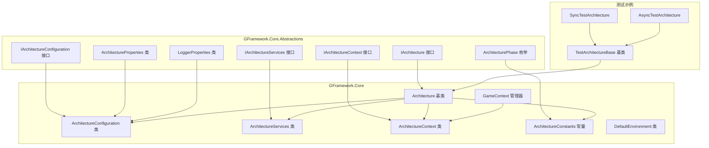

**图表来源**
- [Architecture.cs](file://GFramework.Core/architecture/Architecture.cs#L19-L30)
- [IArchitecture.cs](file://GFramework.Core.Abstractions/architecture/IArchitecture.cs#L7-L11)

**章节来源**
- [Architecture.cs](file://GFramework.Core/architecture/Architecture.cs#L1-L569)
- [IArchitecture.cs](file://GFramework.Core.Abstractions/architecture/IArchitecture.cs#L1-L68)

## 核心组件

### 架构基类架构概览

Architecture基类作为系统、模型、工具等组件的注册与管理中心，提供了以下核心功能：

1. **生命周期管理**：完整的组件生命周期控制，包括初始化、运行和销毁阶段
2. **组件注册系统**：支持系统、模型、工具的注册和获取
3. **事件驱动架构**：基于事件总线的松耦合通信机制
4. **依赖注入容器**：内置IoC容器支持组件间的依赖管理
5. **阶段化初始化**：严格的阶段控制确保组件按正确顺序初始化

### 构造函数参数详解

架构基类的构造函数接受四个可选参数，每个参数都有其特定的职责和配置方式：

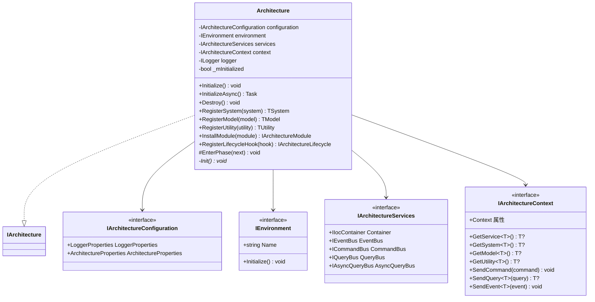

**图表来源**
- [Architecture.cs](file://GFramework.Core/architecture/Architecture.cs#L23-L29)
- [IArchitecture.cs](file://GFramework.Core.Abstractions/architecture/IArchitecture.cs#L11-L68)

#### IArchitectureConfiguration 参数

IArchitectureConfiguration负责架构的整体配置，包括：

- **LoggerProperties**：日志配置，包含日志工厂提供程序和最小日志级别
- **ArchitectureProperties**：架构行为配置，包括延迟注册和严格阶段验证

#### IEnvironment 参数

IEnvironment提供运行环境信息，支持不同平台的环境适配：

- **Name**：环境名称标识
- **Initialize()**：环境初始化方法

#### IArchitectureServices 参数

IArchitectureServices提供核心服务组件：

- **IIocContainer**：依赖注入容器
- **IEventBus**：事件总线
- **ICommandBus**：命令总线
- **IQueryBus**：查询总线
- **IAsyncQueryBus**：异步查询总线

#### IArchitectureContext 参数

IArchitectureContext提供组件访问和通信能力：

- **服务获取**：系统、模型、工具的获取
- **命令执行**：同步和异步命令发送
- **查询执行**：查询请求处理
- **事件管理**：事件发送和注册

**章节来源**
- [Architecture.cs](file://GFramework.Core/architecture/Architecture.cs#L23-L29)
- [IArchitectureConfiguration.cs](file://GFramework.Core.Abstractions/architecture/IArchitectureConfiguration.cs#L8-L19)
- [IArchitectureServices.cs](file://GFramework.Core.Abstractions/architecture/IArchitectureServices.cs#L12-L40)
- [IArchitectureContext.cs](file://GFramework.Core.Abstractions/architecture/IArchitectureContext.cs#L16-L123)

## 架构概览

### 设计模式选择

Architecture基类采用了多种设计模式来实现其强大的功能：

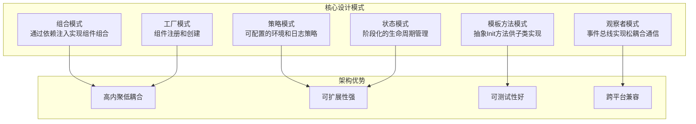

**图表来源**
- [Architecture.cs](file://GFramework.Core/architecture/Architecture.cs#L19-L22)
- [Architecture.cs](file://GFramework.Core/architecture/Architecture.cs#L352-L352)

### 组合优于继承的优势

Architecture基类采用组合优于继承的设计原则，主要体现在：

1. **灵活性**：通过接口注入而非继承，提高了代码的灵活性
2. **可替换性**：不同的实现可以在运行时替换
3. **单一职责**：每个组件专注于自己的职责
4. **易于测试**：可以通过模拟对象轻松测试

## 详细组件分析

### 生命周期管理系统

Architecture基类实现了完整的生命周期管理，包括五个主要阶段：

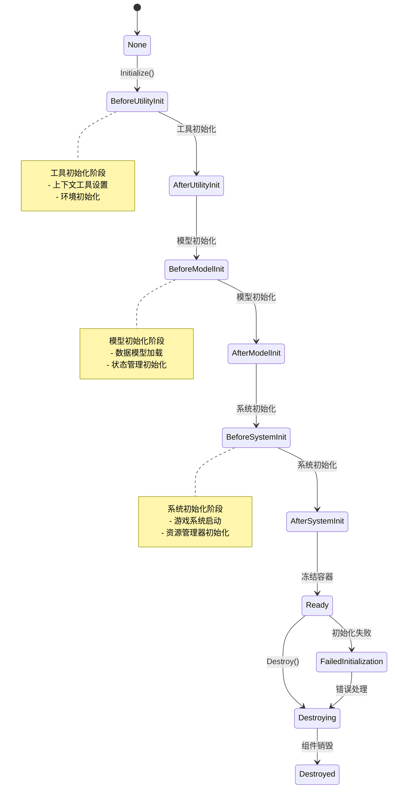

**图表来源**
- [ArchitectureConstants.cs](file://GFramework.Core/architecture/ArchitectureConstants.cs#L17-L29)
- [ArchitecturePhase.cs](file://GFramework.Core.Abstractions/enums/ArchitecturePhase.cs#L10-L66)

#### 阶段转换验证

架构基类实现了严格的阶段转换验证机制：

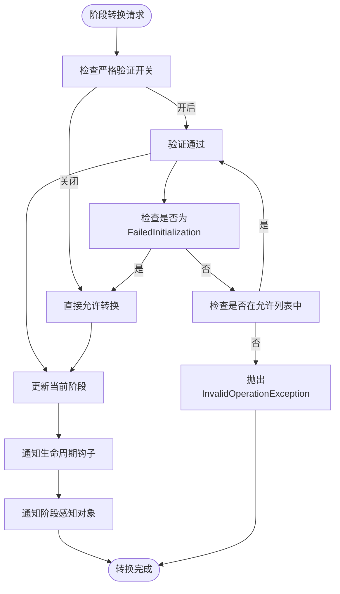

**图表来源**
- [Architecture.cs](file://GFramework.Core/architecture/Architecture.cs#L164-L183)

**章节来源**
- [Architecture.cs](file://GFramework.Core/architecture/Architecture.cs#L142-L224)
- [ArchitectureConstants.cs](file://GFramework.Core/architecture/ArchitectureConstants.cs#L38-L54)

### 组件注册与管理

Architecture基类提供了三种主要的组件注册方式：

#### 系统注册

系统注册是最常见的组件注册方式，适用于游戏的核心功能模块：

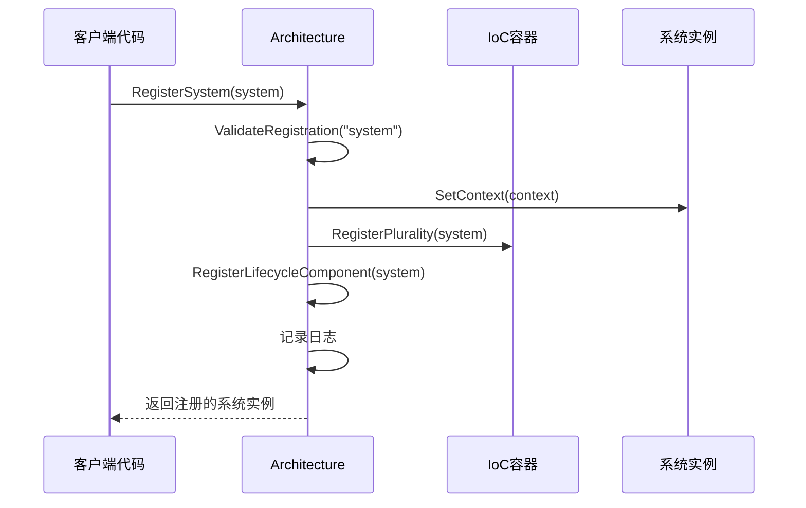

**图表来源**
- [Architecture.cs](file://GFramework.Core/architecture/Architecture.cs#L423-L437)

#### 模型注册

模型注册专门用于数据模型和状态管理：

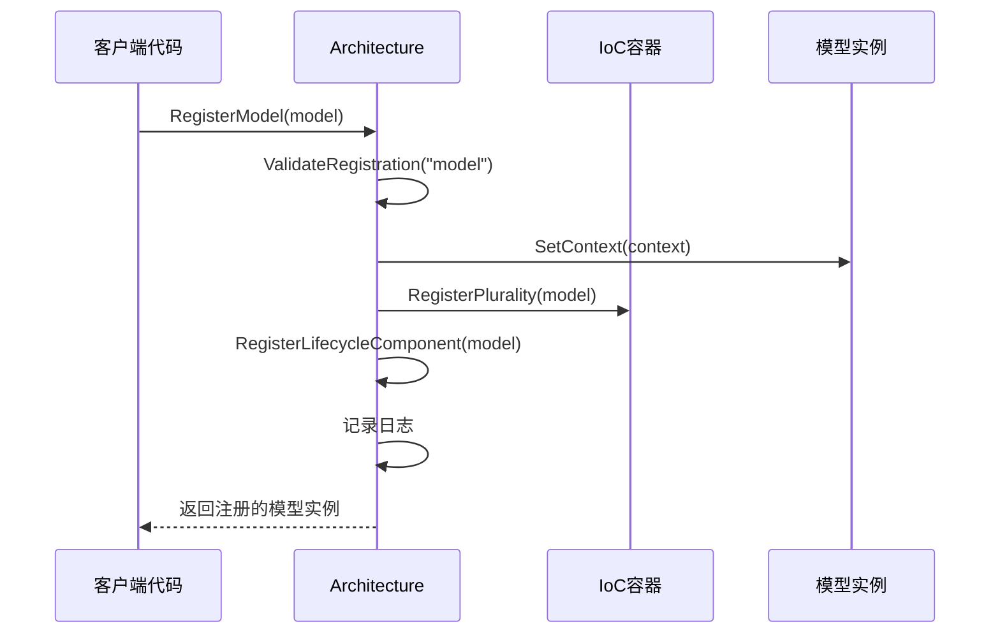

**图表来源**
- [Architecture.cs](file://GFramework.Core/architecture/Architecture.cs#L446-L460)

#### 工具注册

工具注册用于各种辅助功能和实用程序：

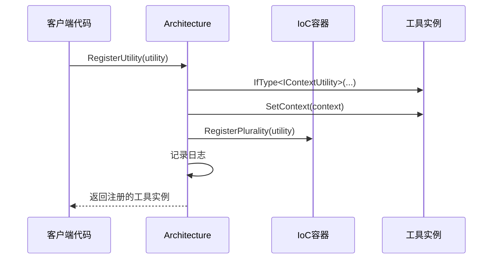

**图表来源**
- [Architecture.cs](file://GFramework.Core/architecture/Architecture.cs#L468-L483)

**章节来源**
- [Architecture.cs](file://GFramework.Core/architecture/Architecture.cs#L423-L483)

### 初始化流程控制

Architecture基类的初始化流程分为三个主要阶段：

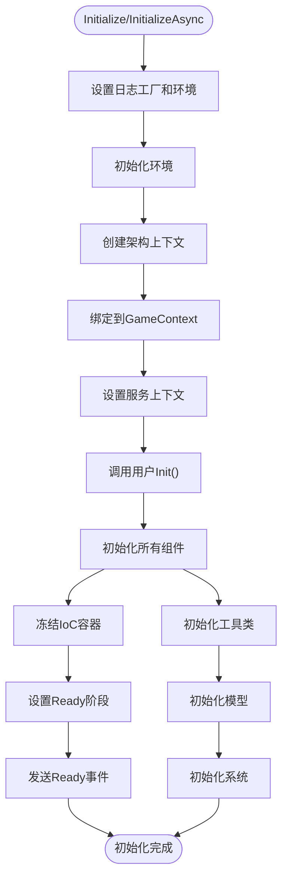

**图表来源**
- [Architecture.cs](file://GFramework.Core/architecture/Architecture.cs#L531-L566)

#### 组件初始化顺序

架构基类严格按照预定义的顺序初始化不同类型的组件：

1. **工具类初始化**：总是先于其他组件初始化
2. **模型初始化**：数据层组件的初始化
3. **系统初始化**：核心游戏系统的初始化

这种顺序确保了组件间的依赖关系得到正确处理。

**章节来源**
- [Architecture.cs](file://GFramework.Core/architecture/Architecture.cs#L264-L330)

### 事件系统集成

Architecture基类通过事件总线实现了松耦合的组件通信：

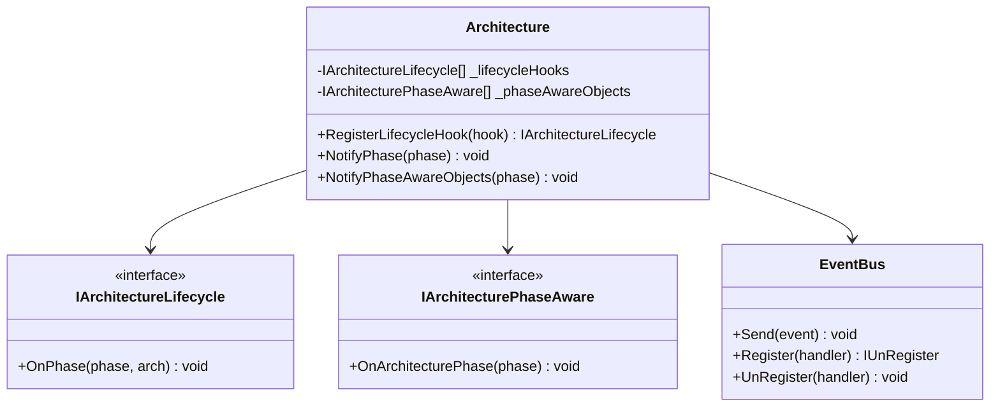

**图表来源**
- [Architecture.cs](file://GFramework.Core/architecture/Architecture.cs#L189-L209)

**章节来源**
- [Architecture.cs](file://GFramework.Core/architecture/Architecture.cs#L189-L223)

## 依赖关系分析

### 组件间依赖关系

Architecture基类的依赖关系体现了清晰的分层架构：

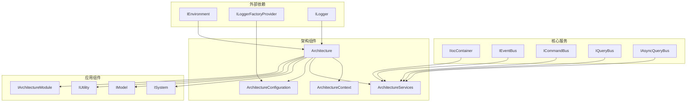

**图表来源**
- [Architecture.cs](file://GFramework.Core/architecture/Architecture.cs#L1-L16)
- [ArchitectureServices.cs](file://GFramework.Core/architecture/ArchitectureServices.cs#L1-L12)

### 依赖注入容器管理

Architecture基类通过IoC容器实现了组件的自动管理和依赖解析：

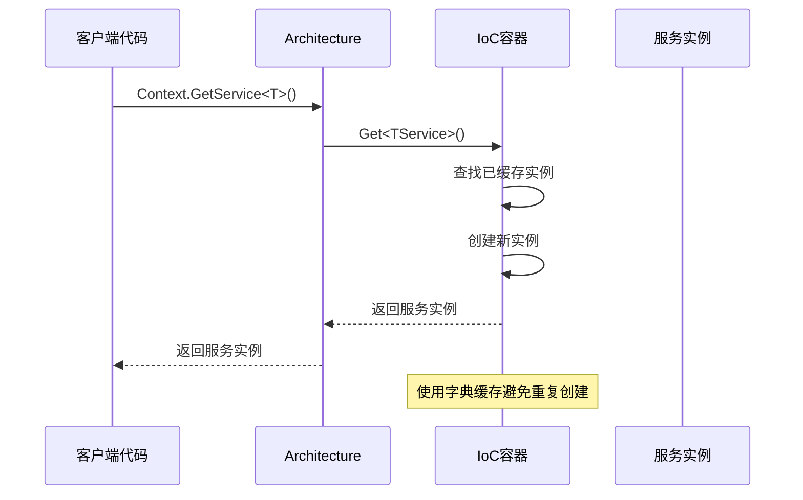

**图表来源**
- [ArchitectureContext.cs](file://GFramework.Core/architecture/ArchitectureContext.cs#L31-L41)

**章节来源**
- [ArchitectureContext.cs](file://GFramework.Core/architecture/ArchitectureContext.cs#L16-L225)
- [ArchitectureServices.cs](file://GFramework.Core/architecture/ArchitectureServices.cs#L17-L106)

## 性能考虑

### 内存管理优化

Architecture基类在内存管理方面采用了多项优化措施：

1. **组件去重机制**：使用HashSet确保同一组件不会被重复注册
2. **有序列表管理**：使用List保持组件注册的顺序一致性
3. **服务缓存**：ArchitectureContext使用字典缓存已获取的服务实例
4. **异步初始化**：支持异步组件初始化，避免阻塞主线程

### 并发安全性

架构基类在并发环境下表现稳定：

- **GameContext**：使用ConcurrentDictionary确保多线程安全
- **组件注册**：在Ready阶段后禁止注册，避免运行时修改
- **事件处理**：事件总线支持异步事件处理

## 故障排除指南

### 常见问题及解决方案

#### 初始化失败问题

当架构初始化失败时，系统会自动进入FailedInitialization阶段：

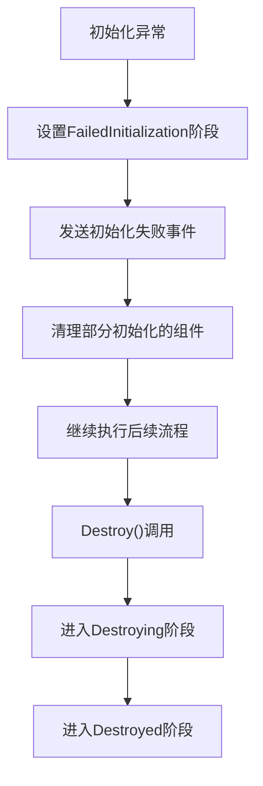

**图表来源**
- [Architecture.cs](file://GFramework.Core/architecture/Architecture.cs#L494-L504)
- [Architecture.cs](file://GFramework.Core/architecture/Architecture.cs#L513-L523)

#### 组件注册时机错误

如果在Ready阶段后尝试注册组件，会抛出InvalidOperationException：

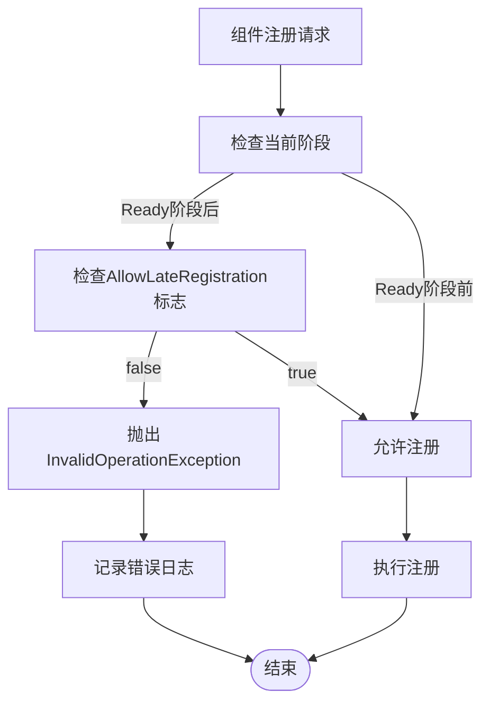

**图表来源**
- [Architecture.cs](file://GFramework.Core/architecture/Architecture.cs#L407-L414)

**章节来源**
- [Architecture.cs](file://GFramework.Core/architecture/Architecture.cs#L492-L524)

## 结论

GFramework架构基类通过精心设计的架构模式和实现细节，为游戏开发提供了一个强大而灵活的基础框架。其核心优势包括：

1. **清晰的职责分离**：通过接口定义和组合模式实现了高度的模块化
2. **严格的生命周期管理**：确保组件按正确的顺序初始化和销毁
3. **灵活的配置系统**：支持运行时配置和环境适配
4. **强大的事件系统**：实现了松耦合的组件通信机制
5. **优秀的可扩展性**：为开发者提供了丰富的扩展点

通过遵循本文档的最佳实践，开发者可以充分利用Architecture基类的强大功能，构建高质量的游戏架构。

## 附录

### 最佳实践使用示例

#### 基本架构实现

```csharp
// 继承Architecture基类
public class MyGameArchitecture : Architecture
{
    // 实现抽象Init方法
    protected override void Init()
    {
        // 注册游戏组件
        RegisterModel(new GameStateModel());
        RegisterSystem(new GameManagerSystem());
        RegisterUtility(new SaveGameManager());
        
        // 可选：注册架构模块
        InstallModule(new UISystemModule());
    }
}
```

#### 自定义配置

```csharp
// 创建自定义配置
var config = new ArchitectureConfiguration
{
    LoggerProperties = new LoggerProperties
    {
        LoggerFactoryProvider = new FileLoggerFactoryProvider()
    },
    ArchitectureProperties = new ArchitectureProperties
    {
        AllowLateRegistration = true,
        StrictPhaseValidation = false
    }
};

// 使用自定义配置创建架构
var arch = new MyGameArchitecture(config);
```

#### 异步组件支持

```csharp
public class AsyncTestArchitecture : TestArchitectureBase
{
    protected override void Init()
    {
        // 注册异步模型
        RegisterModel(new AsyncLoadModel());
        
        // 注册异步系统
        RegisterSystem(new AsyncResourceLoader());
        
        base.Init();
    }
}
```

**章节来源**
- [TestArchitectureBase.cs](file://GFramework.Core.Tests/architecture/TestArchitectureBase.cs#L41-L57)
- [SyncTestArchitecture.cs](file://GFramework.Core.Tests/architecture/SyncTestArchitecture.cs#L14-L19)
- [AsyncTestArchitecture.cs](file://GFramework.Core.Tests/architecture/AsyncTestArchitecture.cs#L14-L21)