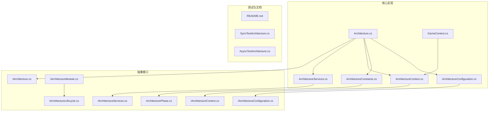
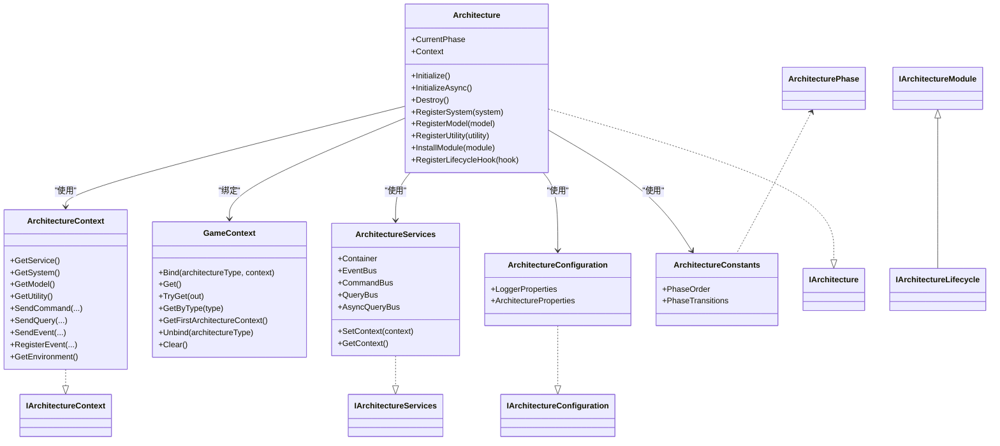
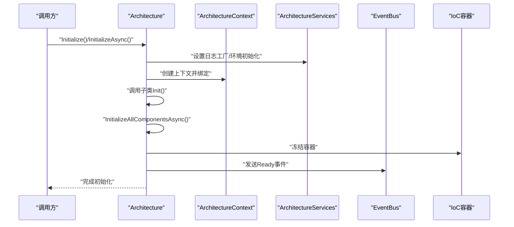
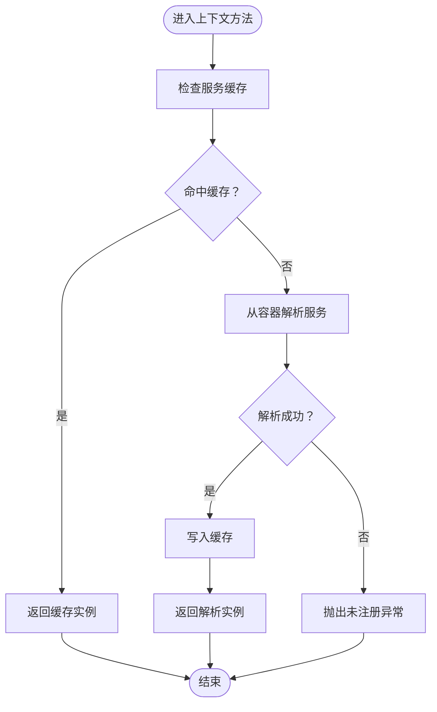
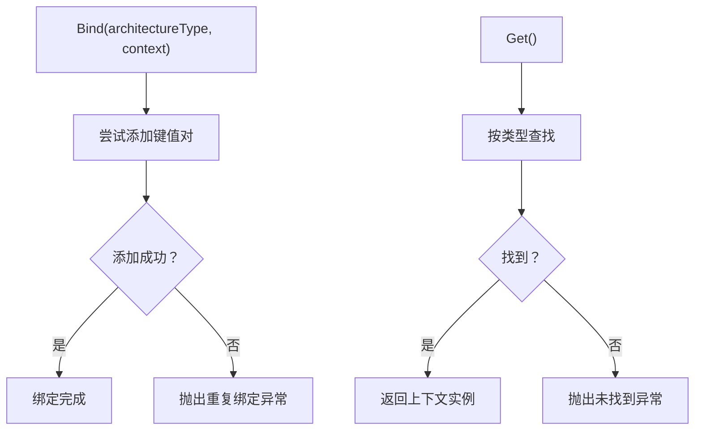
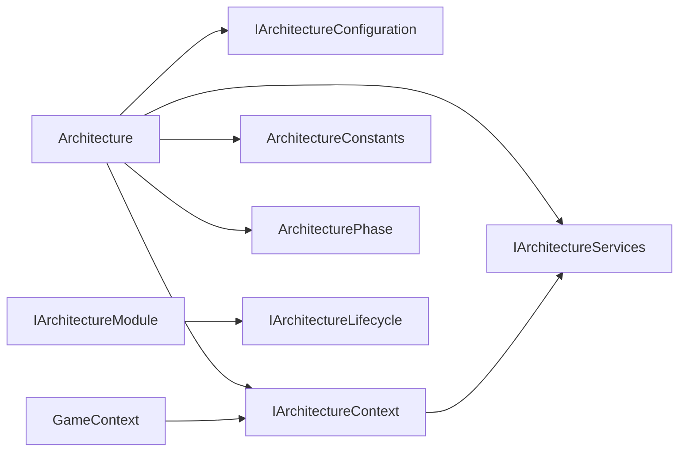
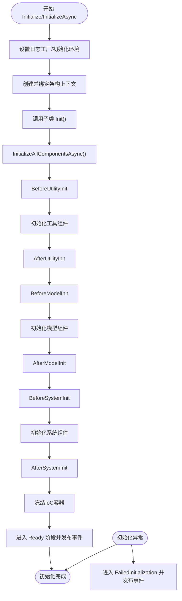

# 架构管理系统

<cite>
**本文档引用的文件**
- [Architecture.cs](file://GFramework.Core/architecture/Architecture.cs)
- [ArchitectureContext.cs](file://GFramework.Core/architecture/ArchitectureContext.cs)
- [GameContext.cs](file://GFramework.Core/architecture/GameContext.cs)
- [ArchitectureConfiguration.cs](file://GFramework.Core/architecture/ArchitectureConfiguration.cs)
- [ArchitectureServices.cs](file://GFramework.Core/architecture/ArchitectureServices.cs)
- [ArchitectureConstants.cs](file://GFramework.Core/architecture/ArchitectureConstants.cs)
- [IArchitecture.cs](file://GFramework.Core.Abstractions/architecture/IArchitecture.cs)
- [IArchitectureConfiguration.cs](file://GFramework.Core.Abstractions/architecture/IArchitectureConfiguration.cs)
- [IArchitectureContext.cs](file://GFramework.Core.Abstractions/architecture/IArchitectureContext.cs)
- [IArchitectureServices.cs](file://GFramework.Core.Abstractions/architecture/IArchitectureServices.cs)
- [IArchitectureModule.cs](file://GFramework.Core.Abstractions/architecture/IArchitectureModule.cs)
- [IArchitectureLifecycle.cs](file://GFramework.Core.Abstractions/architecture/IArchitectureLifecycle.cs)
- [ArchitecturePhase.cs](file://GFramework.Core.Abstractions/enums/ArchitecturePhase.cs)
- [README.md](file://GFramework.Core/architecture/README.md)
- [SyncTestArchitecture.cs](file://GFramework.Core.Tests/architecture/SyncTestArchitecture.cs)
- [AsyncTestArchitecture.cs](file://GFramework.Core.Tests/architecture/AsyncTestArchitecture.cs)
</cite>

## 目录
1. [简介](#简介)
2. [项目结构](#项目结构)
3. [核心组件](#核心组件)
4. [架构总览](#架构总览)
5. [详细组件分析](#详细组件分析)
6. [依赖关系分析](#依赖关系分析)
7. [性能考虑](#性能考虑)
8. [故障排查指南](#故障排查指南)
9. [结论](#结论)
10. [附录](#附录)

## 简介
本文件面向GFramework架构管理系统，围绕Architecture基类的设计与实现展开，系统性阐述其作为系统、模型、工具等组件的注册与管理中心，生命周期管理机制（阶段转换、初始化流程控制、销毁过程），组件注册体系（RegisterSystem、RegisterModel、RegisterUtility等），模块安装机制（InstallModule）与插件化架构，架构上下文（ArchitectureContext）与GameContext绑定机制，以及架构配置（IArchitectureConfiguration）与架构服务（IArchitectureServices）的使用范式。同时提供架构初始化的完整流程图与最佳实践建议。

## 项目结构
GFramework.Core的architecture目录为核心实现区域，包含架构基类、上下文、服务、配置与常量等关键文件；Abstractions目录提供接口契约；Tests目录包含使用示例与测试架构；README.md提供使用说明与最佳实践。

图表来源
- [Architecture.cs](file://GFramework.Core/architecture/Architecture.cs#L1-L569)
- [ArchitectureContext.cs](file://GFramework.Core/architecture/ArchitectureContext.cs#L1-L225)
- [GameContext.cs](file://GFramework.Core/architecture/GameContext.cs#L1-L111)
- [ArchitectureConfiguration.cs](file://GFramework.Core/architecture/ArchitectureConfiguration.cs#L1-L35)
- [ArchitectureServices.cs](file://GFramework.Core/architecture/ArchitectureServices.cs#L1-L106)
- [ArchitectureConstants.cs](file://GFramework.Core/architecture/ArchitectureConstants.cs#L1-L54)
- [IArchitecture.cs](file://GFramework.Core.Abstractions/architecture/IArchitecture.cs#L1-L68)
- [IArchitectureConfiguration.cs](file://GFramework.Core.Abstractions/architecture/IArchitectureConfiguration.cs#L1-L19)
- [IArchitectureContext.cs](file://GFramework.Core.Abstractions/architecture/IArchitectureContext.cs#L1-L123)
- [IArchitectureServices.cs](file://GFramework.Core.Abstractions/architecture/IArchitectureServices.cs#L1-L40)
- [IArchitectureModule.cs](file://GFramework.Core.Abstractions/architecture/IArchitectureModule.cs#L1-L14)
- [IArchitectureLifecycle.cs](file://GFramework.Core.Abstractions/architecture/IArchitectureLifecycle.cs#L1-L16)
- [ArchitecturePhase.cs](file://GFramework.Core.Abstractions/enums/ArchitecturePhase.cs#L1-L66)
- [README.md](file://GFramework.Core/architecture/README.md#L1-L503)
- [SyncTestArchitecture.cs](file://GFramework.Core.Tests/architecture/SyncTestArchitecture.cs#L1-L20)
- [AsyncTestArchitecture.cs](file://GFramework.Core.Tests/architecture/AsyncTestArchitecture.cs#L1-L22)

章节来源
- [README.md](file://GFramework.Core/architecture/README.md#L1-L503)

## 核心组件
- Architecture基类：实现IArchitecture，负责生命周期管理、初始化流程控制、阶段转换、组件注册与销毁、模块安装与生命周期钩子管理。
- ArchitectureContext：实现IArchitectureContext，提供服务获取、命令/查询/事件执行、系统/模型/工具获取、环境访问等。
- GameContext：静态管理器，维护架构类型到架构上下文的绑定映射。
- ArchitectureServices：实现IArchitectureServices，提供IoC容器、事件总线、命令/查询总线等核心服务。
- ArchitectureConfiguration：实现IArchitectureConfiguration，提供日志与架构行为配置。
- ArchitectureConstants：定义阶段顺序与允许的阶段转换关系。
- 架构阶段枚举：ArchitecturePhase定义完整的生命周期阶段序列。

章节来源
- [Architecture.cs](file://GFramework.Core/architecture/Architecture.cs#L19-L89)
- [ArchitectureContext.cs](file://GFramework.Core/architecture/ArchitectureContext.cs#L13-L24)
- [GameContext.cs](file://GFramework.Core/architecture/GameContext.cs#L6-L32)
- [ArchitectureServices.cs](file://GFramework.Core/architecture/ArchitectureServices.cs#L14-L61)
- [ArchitectureConfiguration.cs](file://GFramework.Core/architecture/ArchitectureConfiguration.cs#L8-L35)
- [ArchitectureConstants.cs](file://GFramework.Core/architecture/ArchitectureConstants.cs#L6-L54)
- [ArchitecturePhase.cs](file://GFramework.Core.Abstractions/enums/ArchitecturePhase.cs#L10-L66)

## 架构总览
下图展示Architecture基类与其依赖的上下文、服务、配置、常量之间的交互关系，以及模块安装与生命周期钩子的集成点。

图表来源
- [Architecture.cs](file://GFramework.Core/architecture/Architecture.cs#L23-L89)
- [ArchitectureContext.cs](file://GFramework.Core/architecture/ArchitectureContext.cs#L16-L41)
- [GameContext.cs](file://GFramework.Core/architecture/GameContext.cs#L9-L111)
- [ArchitectureServices.cs](file://GFramework.Core/architecture/ArchitectureServices.cs#L17-L106)
- [ArchitectureConfiguration.cs](file://GFramework.Core/architecture/ArchitectureConfiguration.cs#L12-L35)
- [ArchitectureConstants.cs](file://GFramework.Core/architecture/ArchitectureConstants.cs#L9-L54)
- [IArchitecture.cs](file://GFramework.Core.Abstractions/architecture/IArchitecture.cs#L11-L68)
- [IArchitectureContext.cs](file://GFramework.Core.Abstractions/architecture/IArchitectureContext.cs#L16-L123)
- [IArchitectureServices.cs](file://GFramework.Core.Abstractions/architecture/IArchitectureServices.cs#L12-L40)
- [IArchitectureConfiguration.cs](file://GFramework.Core.Abstractions/architecture/IArchitectureConfiguration.cs#L8-L19)
- [IArchitectureModule.cs](file://GFramework.Core.Abstractions/architecture/IArchitectureModule.cs#L7-L14)
- [IArchitectureLifecycle.cs](file://GFramework.Core.Abstractions/architecture/IArchitectureLifecycle.cs#L8-L16)
- [ArchitecturePhase.cs](file://GFramework.Core.Abstractions/enums/ArchitecturePhase.cs#L10-L66)

## 详细组件分析

### Architecture基类：生命周期与初始化流程
- 阶段管理
  - EnterPhase负责阶段转换校验、状态更新、事件通知与阶段感知对象通知。
  - ValidatePhaseTransition根据ArchitectureConstants的允许转换表与配置项StrictPhaseValidation进行校验。
  - NotifyPhase与NotifyPhaseAwareObjects分别通知生命周期钩子与IArchitecturePhaseAware对象。
- 组件注册与生命周期
  - RegisterLifecycleComponent统一处理IInitializable与IDisposable组件的登记与去重，保证初始化顺序与逆序销毁。
  - RegisterSystem/RegisterModel/RegisterUtility在注册时设置上下文、登记生命周期并写入容器。
- 初始化流程
  - Initialize/InitializeAsync封装InitializeInternalAsync，负责日志工厂设置、环境初始化、上下文创建与绑定、调用子类Init、组件分阶段初始化、容器冻结、进入Ready并发布事件。
  - InitializeAllComponentsAsync按工具、模型、系统三阶段顺序初始化，支持同步与异步组件。
- 销毁流程
  - Destroy进入Destroying阶段并发布事件，按逆序销毁IDisposable组件，最后进入Destroyed并发布事件。
- 模块安装
  - InstallModule安装IArchitectureModule，注册生命周期钩子、登记模块实例、调用Install以完成模块内组件注册。

图表来源
- [Architecture.cs](file://GFramework.Core/architecture/Architecture.cs#L492-L566)
- [ArchitectureServices.cs](file://GFramework.Core/architecture/ArchitectureServices.cs#L46-L61)
- [ArchitectureContext.cs](file://GFramework.Core/architecture/ArchitectureContext.cs#L21-L54)

章节来源
- [Architecture.cs](file://GFramework.Core/architecture/Architecture.cs#L135-L396)
- [Architecture.cs](file://GFramework.Core/architecture/Architecture.cs#L400-L485)
- [Architecture.cs](file://GFramework.Core/architecture/Architecture.cs#L487-L566)

### ArchitectureContext：上下文服务与组件访问
- 服务缓存：通过私有字典缓存已解析的服务实例，减少容器查询开销。
- 组件获取：GetService/GetSystem/GetModel/GetUtility提供类型化服务解析。
- 命令/查询/事件：封装CommandBus、QueryBus、EventBus的发送与注册。
- 环境访问：GetEnvironment返回已注册的环境实例。

图表来源
- [ArchitectureContext.cs](file://GFramework.Core/architecture/ArchitectureContext.cs#L26-L41)
- [ArchitectureContext.cs](file://GFramework.Core/architecture/ArchitectureContext.cs#L75-L107)

章节来源
- [ArchitectureContext.cs](file://GFramework.Core/architecture/ArchitectureContext.cs#L16-L225)

### GameContext：架构上下文绑定与管理
- 绑定：Bind将架构类型与上下文实例建立唯一映射，防止重复绑定。
- 获取：Get/Get<T>/TryGet<T>提供强类型与泛型安全的上下文访问。
- 字典：使用并发字典保证多线程场景下的安全性。
- 清理：Unbind/Clear支持解除绑定与清空。

图表来源
- [GameContext.cs](file://GFramework.Core/architecture/GameContext.cs#L27-L32)
- [GameContext.cs](file://GFramework.Core/architecture/GameContext.cs#L66-L73)

章节来源
- [GameContext.cs](file://GFramework.Core/architecture/GameContext.cs#L9-L111)

### ArchitectureServices：核心服务聚合
- 容器与总线：提供IoC容器、事件总线、命令总线、查询总线与异步查询总线。
- 上下文设置：SetContext将架构上下文传递给容器与自身，确保服务可用。
- 注册：在构造函数中将核心服务注册到容器，供上下文解析。

章节来源
- [ArchitectureServices.cs](file://GFramework.Core/architecture/ArchitectureServices.cs#L17-L106)

### ArchitectureConfiguration：配置与策略
- 日志配置：LoggerProperties包含日志工厂提供程序与最小日志级别。
- 架构选项：ArchitectureProperties包含AllowLateRegistration与StrictPhaseValidation等策略开关。

章节来源
- [ArchitectureConfiguration.cs](file://GFramework.Core/architecture/ArchitectureConfiguration.cs#L12-L35)

### ArchitectureConstants：阶段与转换规则
- 阶段顺序：PhaseOrder定义线性阶段序列。
- 转换规则：PhaseTransitions定义允许的阶段转换集合，支持从任意阶段转入FailedInitialization。

章节来源
- [ArchitectureConstants.cs](file://GFramework.Core/architecture/ArchitectureConstants.cs#L9-L54)

### 接口契约与模块化
- IArchitecture：定义初始化、销毁、组件注册、模块安装与生命周期钩子注册。
- IArchitectureContext：定义服务获取、命令/查询/事件执行与环境访问。
- IArchitectureServices：定义容器与核心总线服务。
- IArchitectureModule：模块安装接口，继承生命周期与阶段感知。
- IArchitectureLifecycle：阶段回调接口。
- ArchitecturePhase：阶段枚举。

章节来源
- [IArchitecture.cs](file://GFramework.Core.Abstractions/architecture/IArchitecture.cs#L11-L68)
- [IArchitectureContext.cs](file://GFramework.Core.Abstractions/architecture/IArchitectureContext.cs#L16-L123)
- [IArchitectureServices.cs](file://GFramework.Core.Abstractions/architecture/IArchitectureServices.cs#L12-L40)
- [IArchitectureModule.cs](file://GFramework.Core.Abstractions/architecture/IArchitectureModule.cs#L7-L14)
- [IArchitectureLifecycle.cs](file://GFramework.Core.Abstractions/architecture/IArchitectureLifecycle.cs#L8-L16)
- [ArchitecturePhase.cs](file://GFramework.Core.Abstractions/enums/ArchitecturePhase.cs#L10-L66)

### 测试架构示例：使用模式
- 同步测试架构：在Init中注册同步模型与系统，演示标准注册流程。
- 异步测试架构：在Init中注册异步模型与系统，演示异步初始化流程。

章节来源
- [SyncTestArchitecture.cs](file://GFramework.Core.Tests/architecture/SyncTestArchitecture.cs#L9-L20)
- [AsyncTestArchitecture.cs](file://GFramework.Core.Tests/architecture/AsyncTestArchitecture.cs#L9-L22)

## 依赖关系分析
- Architecture对IArchitectureConfiguration、IArchitectureServices、IArchitectureContext、ArchitectureConstants、ArchitecturePhase的依赖清晰且稳定。
- ArchitectureContext依赖IArchitectureServices与IArchitectureContext接口，通过容器解析核心服务。
- GameContext独立于架构实现，仅持有IArchitectureContext实例，提供全局绑定管理。
- 模块与生命周期钩子通过IArchitectureModule与IArchitectureLifecycle接入，增强扩展性。

图表来源
- [Architecture.cs](file://GFramework.Core/architecture/Architecture.cs#L23-L89)
- [ArchitectureContext.cs](file://GFramework.Core/architecture/ArchitectureContext.cs#L16-L41)
- [GameContext.cs](file://GFramework.Core/architecture/GameContext.cs#L9-L32)
- [IArchitectureModule.cs](file://GFramework.Core.Abstractions/architecture/IArchitectureModule.cs#L7-L14)
- [IArchitectureLifecycle.cs](file://GFramework.Core.Abstractions/architecture/IArchitectureLifecycle.cs#L8-L16)

章节来源
- [Architecture.cs](file://GFramework.Core/architecture/Architecture.cs#L1-L569)
- [ArchitectureContext.cs](file://GFramework.Core/architecture/ArchitectureContext.cs#L1-L225)
- [GameContext.cs](file://GFramework.Core/architecture/GameContext.cs#L1-L111)

## 性能考虑
- 服务缓存：ArchitectureContext对服务解析结果进行缓存，降低容器查询成本。
- 去重与顺序：Architecture使用HashSet与List双重结构管理待初始化与可销毁组件，确保原子去重与确定性顺序。
- 异步初始化：支持IAsyncInitializable与IAsyncQuery，充分利用异步I/O提升初始化吞吐。
- 容器冻结：初始化完成后冻结IoC容器，避免后续注册带来的性能与一致性问题。

## 故障排查指南
- 初始化失败
  - 现象：Initialize/InitializeAsync抛出异常后进入FailedInitialization阶段并发布失败事件。
  - 排查：检查Init中注册的组件是否正确实现接口、依赖是否已注册、日志级别是否足够详细。
- 阶段转换异常
  - 现象：ValidatePhaseTransition抛出非法转换异常。
  - 排查：确认当前阶段与允许转换表，必要时调整StrictPhaseValidation策略。
- 组件注册时机
  - 现象：在Ready阶段后注册组件抛出异常。
  - 排查：通过AllowLateRegistration策略控制注册窗口，或在Init中集中注册。
- 销毁异常
  - 现象：销毁过程中某个组件抛出异常但不影响其他组件。
  - 排查：捕获异常并记录日志，确保资源清理的幂等性。

章节来源
- [Architecture.cs](file://GFramework.Core/architecture/Architecture.cs#L164-L183)
- [Architecture.cs](file://GFramework.Core/architecture/Architecture.cs#L494-L504)
- [Architecture.cs](file://GFramework.Core/architecture/Architecture.cs#L377-L387)

## 结论
Architecture基类通过明确的阶段化生命周期、严格的注册时机控制、统一的组件注册与销毁机制，以及模块化与上下文绑定设计，构建了高内聚、低耦合、可扩展的架构管理体系。结合ArchitectureContext与GameContext提供的全局绑定与服务访问，开发者可以以一致的方式组织系统、模型与工具组件，并通过IArchitectureConfiguration与IArchitectureServices灵活定制行为与服务。

## 附录

### 架构初始化完整流程图

图表来源
- [Architecture.cs](file://GFramework.Core/architecture/Architecture.cs#L531-L566)
- [Architecture.cs](file://GFramework.Core/architecture/Architecture.cs#L264-L330)
- [ArchitectureConstants.cs](file://GFramework.Core/architecture/ArchitectureConstants.cs#L17-L29)

### 最佳实践建议
- 在Init中集中注册组件，避免在Ready后注册导致异常。
- 合理划分Utility/Model/System职责边界，遵循“数据/状态”、“业务逻辑/规则”、“无状态工具”的分层原则。
- 使用模块化（InstallModule）扩展架构功能，保持核心简洁。
- 通过IArchitectureConfiguration定制日志与阶段验证策略，满足不同部署需求。
- 使用ArchitectureContext进行服务访问，避免直接依赖具体实现。
- 对可能耗时的初始化使用异步组件，提升整体启动性能。

章节来源
- [README.md](file://GFramework.Core/architecture/README.md#L476-L487)
- [Architecture.cs](file://GFramework.Core/architecture/Architecture.cs#L492-L566)