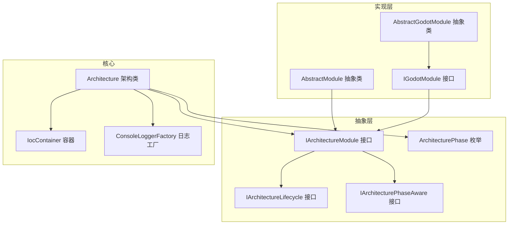
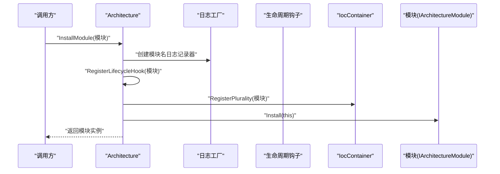
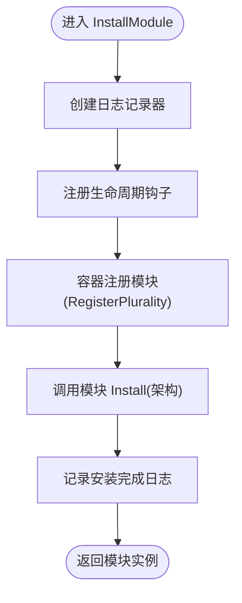
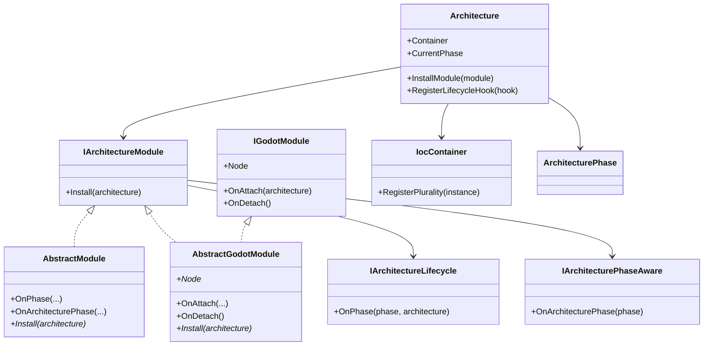

# 模块系统

<cite>
**本文档引用的文件**
- [IArchitectureModule.cs](file://GFramework.Core.Abstractions/architecture/IArchitectureModule.cs)
- [AbstractModule.cs](file://GFramework.Game/architecture/AbstractModule.cs)
- [IGodotModule.cs](file://GFramework.Godot/architecture/IGodotModule.cs)
- [AbstractGodotModule.cs](file://GFramework.Godot/architecture/AbstractGodotModule.cs)
- [Architecture.cs](file://GFramework.Core/architecture/Architecture.cs)
- [IArchitectureLifecycle.cs](file://GFramework.Core.Abstractions/architecture/IArchitectureLifecycle.cs)
- [IArchitecturePhaseAware.cs](file://GFramework.Core.Abstractions/architecture/IArchitecturePhaseAware.cs)
- [ArchitecturePhase.cs](file://GFramework.Core.Abstractions/enums/ArchitecturePhase.cs)
- [IocContainer.cs](file://GFramework.Core/ioc/IocContainer.cs)
- [ConsoleLoggerFactory.cs](file://GFramework.Core/logging/ConsoleLoggerFactory.cs)
- [README.md（Architecture）](file://GFramework.Core/architecture/README.md)
- [core-api.md](file://docs/api-reference/core-api.md)
- [godot-integration.md](file://docs/tutorials/godot-integration.md)
</cite>

## 目录
1. [简介](#简介)
2. [项目结构](#项目结构)
3. [核心组件](#核心组件)
4. [架构总览](#架构总览)
5. [详细组件分析](#详细组件分析)
6. [依赖分析](#依赖分析)
7. [性能考虑](#性能考虑)
8. [故障排查指南](#故障排查指南)
9. [结论](#结论)
10. [附录](#附录)

## 简介
本文件围绕 GFramework 的模块系统展开，重点解释 InstallModule 方法的模块安装机制，涵盖模块验证、生命周期钩子注册、容器注册与模块安装调用的完整流程；阐述 IArchitectureModule 接口的设计要求与 Install 方法实现规范；说明模块安装过程中的日志记录与错误处理；解释模块系统如何支持插件化架构与动态功能扩展；介绍模块与架构生命周期的集成方式及模块对架构阶段变化的响应；最后提供模块开发的完整示例与最佳实践。

## 项目结构
模块系统横跨抽象层与具体实现层：
- 抽象层定义模块接口与生命周期契约，位于 Core.Abstractions；
- 具体实现包含通用模块基类（Game）、Godot 平台模块（Godot），以及核心架构（Core）负责模块安装与生命周期广播；
- 依赖注入容器（IocContainer）与日志工厂（ConsoleLoggerFactory）贯穿安装与初始化流程。

图示来源
- [IArchitectureModule.cs](file://GFramework.Core.Abstractions/architecture/IArchitectureModule.cs#L1-L14)
- [AbstractModule.cs](file://GFramework.Game/architecture/AbstractModule.cs#L1-L33)
- [IGodotModule.cs](file://GFramework.Godot/architecture/IGodotModule.cs#L1-L27)
- [AbstractGodotModule.cs](file://GFramework.Godot/architecture/AbstractGodotModule.cs#L1-L55)
- [Architecture.cs](file://GFramework.Core/architecture/Architecture.cs#L38-L48)
- [IocContainer.cs](file://GFramework.Core/ioc/IocContainer.cs#L105-L123)
- [ConsoleLoggerFactory.cs](file://GFramework.Core/logging/ConsoleLoggerFactory.cs#L8-L20)
- [ArchitecturePhase.cs](file://GFramework.Core.Abstractions/enums/ArchitecturePhase.cs#L10-L66)

章节来源
- [IArchitectureModule.cs](file://GFramework.Core.Abstractions/architecture/IArchitectureModule.cs#L1-L14)
- [AbstractModule.cs](file://GFramework.Game/architecture/AbstractModule.cs#L1-L33)
- [IGodotModule.cs](file://GFramework.Godot/architecture/IGodotModule.cs#L1-L27)
- [AbstractGodotModule.cs](file://GFramework.Godot/architecture/AbstractGodotModule.cs#L1-L55)
- [Architecture.cs](file://GFramework.Core/architecture/Architecture.cs#L38-L48)
- [IocContainer.cs](file://GFramework.Core/ioc/IocContainer.cs#L105-L123)
- [ConsoleLoggerFactory.cs](file://GFramework.Core/logging/ConsoleLoggerFactory.cs#L8-L20)
- [ArchitecturePhase.cs](file://GFramework.Core.Abstractions/enums/ArchitecturePhase.cs#L10-L66)

## 核心组件
- IArchitectureModule：模块安装的标准入口，继承生命周期与阶段感知接口，要求实现 Install 方法。
- AbstractModule：通用模块基类，提供空实现的生命周期与阶段回调，便于子类按需覆写。
- AbstractGodotModule / IGodotModule：Godot 平台模块扩展，增加节点关联、附加/分离回调与阶段感知。
- Architecture.InstallModule：模块安装主流程，负责日志记录、生命周期钩子注册、容器注册与调用模块 Install。
- IocContainer.RegisterPlurality：将模块实例注册到容器，自动注册到其实现的所有接口与具体类型。
- ArchitecturePhase：定义架构生命周期阶段，模块可通过生命周期钩子与阶段感知接口参与阶段切换。

章节来源
- [IArchitectureModule.cs](file://GFramework.Core.Abstractions/architecture/IArchitectureModule.cs#L7-L14)
- [AbstractModule.cs](file://GFramework.Game/architecture/AbstractModule.cs#L9-L33)
- [IGodotModule.cs](file://GFramework.Godot/architecture/IGodotModule.cs#L10-L27)
- [AbstractGodotModule.cs](file://GFramework.Godot/architecture/AbstractGodotModule.cs#L11-L55)
- [Architecture.cs](file://GFramework.Core/architecture/Architecture.cs#L38-L48)
- [IocContainer.cs](file://GFramework.Core/ioc/IocContainer.cs#L105-L123)
- [ArchitecturePhase.cs](file://GFramework.Core.Abstractions/enums/ArchitecturePhase.cs#L10-L66)

## 架构总览
InstallModule 的调用序列如下：

图示来源
- [Architecture.cs](file://GFramework.Core/architecture/Architecture.cs#L38-L48)
- [IocContainer.cs](file://GFramework.Core/ioc/IocContainer.cs#L105-L123)
- [ConsoleLoggerFactory.cs](file://GFramework.Core/logging/ConsoleLoggerFactory.cs#L8-L20)

章节来源
- [Architecture.cs](file://GFramework.Core/architecture/Architecture.cs#L38-L48)

## 详细组件分析

### InstallModule 方法与模块安装机制
- 模块验证：InstallModule 通过模块类型名创建日志记录器，便于追踪模块安装过程。
- 生命周期钩子注册：InstallModule 调用 RegisterLifecycleHook 将模块加入生命周期钩子列表，使其在架构阶段变化时收到通知。
- 容器注册：InstallModule 调用 Container.RegisterPlurality 将模块注册到容器，自动注册到其所有接口与具体类型，便于后续按接口获取。
- 模块安装调用：InstallModule 最终调用模块的 Install 方法，传入当前架构实例，模块在此阶段完成自身组件注册与初始化。
- 日志记录：安装开始与结束分别记录 Debug 与 Info 级别日志，便于审计与排障。
- 错误处理：InstallModule 未显式捕获异常，异常将沿调用栈向上传播，由架构初始化流程统一处理。

图示来源
- [Architecture.cs](file://GFramework.Core/architecture/Architecture.cs#L38-L48)
- [IocContainer.cs](file://GFramework.Core/ioc/IocContainer.cs#L105-L123)

章节来源
- [Architecture.cs](file://GFramework.Core/architecture/Architecture.cs#L38-L48)

### IArchitectureModule 接口设计与 Install 方法规范
- 设计要求：IArchitectureModule 继承生命周期与阶段感知接口，确保模块能响应架构阶段变化并参与生命周期管理。
- Install 方法规范：模块应在 Install 中完成自身组件注册（系统、模型、工具等），并可读取架构上下文与服务；避免在 Install 中执行耗时或阻塞操作，建议将复杂初始化推迟到架构 Ready 阶段或异步初始化。

章节来源
- [IArchitectureModule.cs](file://GFramework.Core.Abstractions/architecture/IArchitectureModule.cs#L7-L14)
- [IArchitectureLifecycle.cs](file://GFramework.Core.Abstractions/architecture/IArchitectureLifecycle.cs#L8-L16)
- [IArchitecturePhaseAware.cs](file://GFramework.Core.Abstractions/architecture/IArchitecturePhaseAware.cs#L8-L15)

### 生命周期钩子与阶段感知
- 生命周期钩子：模块作为 IArchitectureLifecycle 实例，在架构阶段变化时通过 OnPhase 收到通知；适合做阶段性的资源管理与性能监控。
- 阶段感知：模块作为 IArchitecturePhaseAware 实例，在架构 Ready 等关键阶段收到通知；适合做一次性初始化或收尾工作。
- 架构阶段：通过 ArchitecturePhase 枚举定义阶段，模块可在 OnArchitecturePhase 或 OnPhase 中根据阶段执行相应逻辑。

章节来源
- [AbstractModule.cs](file://GFramework.Game/architecture/AbstractModule.cs#L16-L26)
- [AbstractGodotModule.cs](file://GFramework.Godot/architecture/AbstractGodotModule.cs#L23-L33)
- [Architecture.cs](file://GFramework.Core/architecture/Architecture.cs#L189-L209)
- [ArchitecturePhase.cs](file://GFramework.Core.Abstractions/enums/ArchitecturePhase.cs#L10-L66)

### 容器注册与模块交互
- RegisterPlurality：将模块注册到容器，自动注册到其所有接口与具体类型，便于通过接口获取模块实例或其接口视图。
- 模块间交互：模块可通过架构上下文与服务与其他模块协作；也可通过事件总线进行松耦合通信。

章节来源
- [IocContainer.cs](file://GFramework.Core/ioc/IocContainer.cs#L105-L123)
- [Architecture.cs](file://GFramework.Core/architecture/Architecture.cs#L72-L78)

### 日志记录与错误处理
- 日志记录：InstallModule 使用日志工厂为模块创建日志记录器，安装开始与结束分别记录 Debug 与 Info 级别日志。
- 错误处理：InstallModule 未捕获异常，异常将沿调用栈向上传播；架构初始化流程会在失败时进入特定阶段并发送失败事件。

章节来源
- [Architecture.cs](file://GFramework.Core/architecture/Architecture.cs#L40-L46)
- [ConsoleLoggerFactory.cs](file://GFramework.Core/logging/ConsoleLoggerFactory.cs#L8-L20)

### 插件化架构与动态扩展
- 模块化扩展：通过 IArchitectureModule 接口，开发者可按需实现模块并在架构初始化前或初始化后安装，实现功能的动态扩展。
- 平台集成：Godot 模块通过 IGodotModule 与 AbstractGodotModule 提供节点关联与附加/分离回调，便于与平台深度集成。

章节来源
- [AbstractModule.cs](file://GFramework.Game/architecture/AbstractModule.cs#L9-L33)
- [IGodotModule.cs](file://GFramework.Godot/architecture/IGodotModule.cs#L10-L27)
- [AbstractGodotModule.cs](file://GFramework.Godot/architecture/AbstractGodotModule.cs#L11-L55)

### 模块与架构生命周期集成
- 阶段广播：架构在 EnterPhase 时通知所有 IArchitectureLifecycle 与 IArchitecturePhaseAware 实例，模块可据此调整自身状态。
- 严格阶段验证：可通过配置启用严格阶段验证，非法转换将抛出异常并记录致命日志。

章节来源
- [Architecture.cs](file://GFramework.Core/architecture/Architecture.cs#L142-L183)
- [Architecture.cs](file://GFramework.Core/architecture/Architecture.cs#L189-L209)

### 模块开发完整示例
- 通用模块示例：参考文档中的模块示例，展示如何实现 Install 并注册系统与工具。
- Godot 模块示例：参考文档中的 Godot 集成示例，展示节点关联、附加/分离回调与阶段响应。

章节来源
- [core-api.md](file://docs/api-reference/core-api.md#L179-L190)
- [godot-integration.md](file://docs/tutorials/godot-integration.md#L43-L114)

## 依赖分析
模块系统的关键依赖关系如下：

图示来源
- [IArchitectureModule.cs](file://GFramework.Core.Abstractions/architecture/IArchitectureModule.cs#L7-L14)
- [AbstractModule.cs](file://GFramework.Game/architecture/AbstractModule.cs#L9-L33)
- [IGodotModule.cs](file://GFramework.Godot/architecture/IGodotModule.cs#L10-L27)
- [AbstractGodotModule.cs](file://GFramework.Godot/architecture/AbstractGodotModule.cs#L11-L55)
- [Architecture.cs](file://GFramework.Core/architecture/Architecture.cs#L38-L48)
- [IocContainer.cs](file://GFramework.Core/ioc/IocContainer.cs#L105-L123)
- [ArchitecturePhase.cs](file://GFramework.Core.Abstractions/enums/ArchitecturePhase.cs#L10-L66)

章节来源
- [IArchitectureModule.cs](file://GFramework.Core.Abstractions/architecture/IArchitectureModule.cs#L7-L14)
- [AbstractModule.cs](file://GFramework.Game/architecture/AbstractModule.cs#L9-L33)
- [IGodotModule.cs](file://GFramework.Godot/architecture/IGodotModule.cs#L10-L27)
- [AbstractGodotModule.cs](file://GFramework.Godot/architecture/AbstractGodotModule.cs#L11-L55)
- [Architecture.cs](file://GFramework.Core/architecture/Architecture.cs#L38-L48)
- [IocContainer.cs](file://GFramework.Core/ioc/IocContainer.cs#L105-L123)
- [ArchitecturePhase.cs](file://GFramework.Core.Abstractions/enums/ArchitecturePhase.cs#L10-L66)

## 性能考虑
- 容器冻结：架构在 Ready 阶段冻结容器，防止后续注册，确保运行期稳定性与性能。
- 异步初始化：架构支持异步初始化，模块可结合异步初始化接口提升启动性能。
- 日志级别：Debug/Info 级别日志便于开发调试，生产环境可调整日志级别降低开销。

章节来源
- [Architecture.cs](file://GFramework.Core/architecture/Architecture.cs#L558-L566)
- [IocContainer.cs](file://GFramework.Core/ioc/IocContainer.cs#L357-L370)
- [README.md（Architecture）](file://GFramework.Core/architecture/README.md#L231-L250)

## 故障排查指南
- 模块安装失败：检查 Install 方法内是否正确注册组件；确认未在 Ready 阶段后进行注册；查看日志记录器输出定位问题。
- 生命周期钩子注册限制：生命周期钩子只能在 Ready 阶段前注册，否则会抛出异常；确认注册时机。
- 阶段转换异常：启用严格阶段验证时，非法转换会抛出异常并记录致命日志；核对阶段转换顺序。
- 销毁阶段异常：销毁流程中单个组件异常不会中断整体销毁，但会记录错误日志；逐个排查组件的 Destroy 实现。

章节来源
- [Architecture.cs](file://GFramework.Core/architecture/Architecture.cs#L216-L223)
- [Architecture.cs](file://GFramework.Core/architecture/Architecture.cs#L164-L183)
- [Architecture.cs](file://GFramework.Core/architecture/Architecture.cs#L377-L387)

## 结论
GFramework 的模块系统通过 IArchitectureModule 接口与 Architecture.InstallModule 方法，提供了标准化的模块安装流程：先注册生命周期钩子与容器，再调用模块 Install 完成组件注册。模块可同时响应架构生命周期与阶段变化，实现插件化与动态扩展。配合严格的阶段验证、完善的日志与错误处理，模块系统在保证稳定性的同时提供了良好的可维护性与可扩展性。

## 附录
- 使用示例与 API 参考可参见文档：
  - [core-api.md](file://docs/api-reference/core-api.md#L169-L190)
  - [godot-integration.md](file://docs/tutorials/godot-integration.md#L43-L114)
  - [README.md（Architecture）](file://GFramework.Core/architecture/README.md#L251-L281)