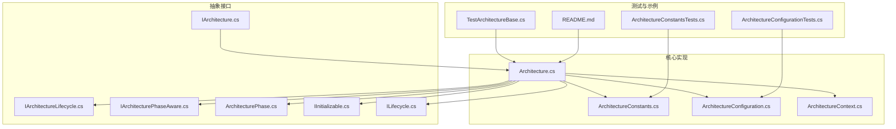
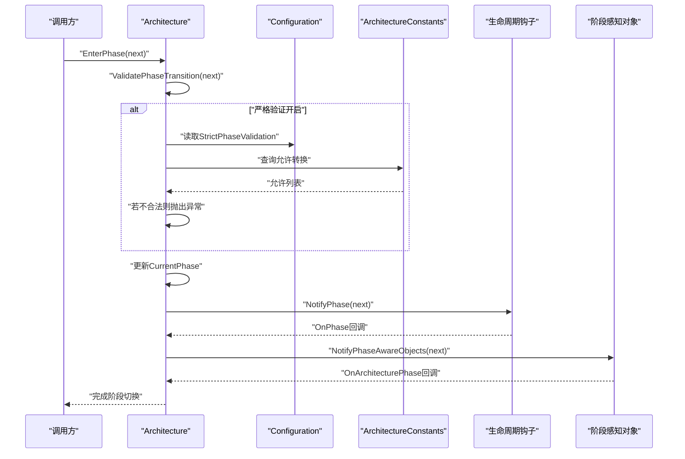
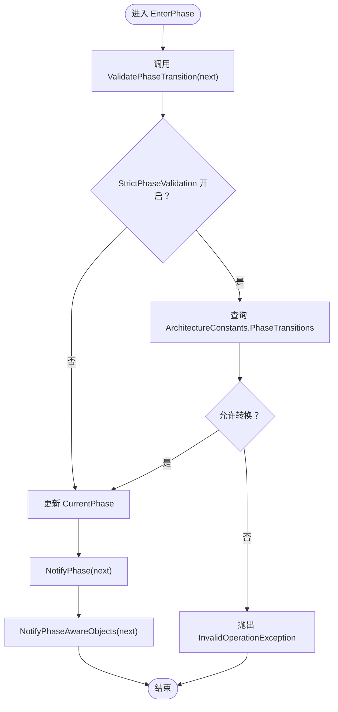
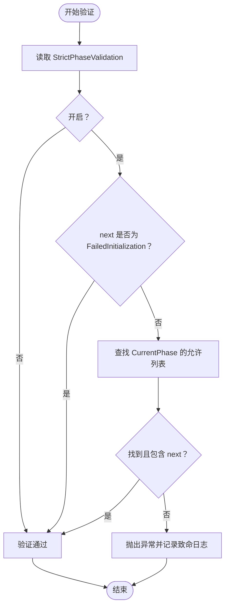
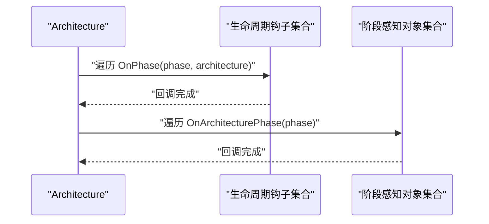
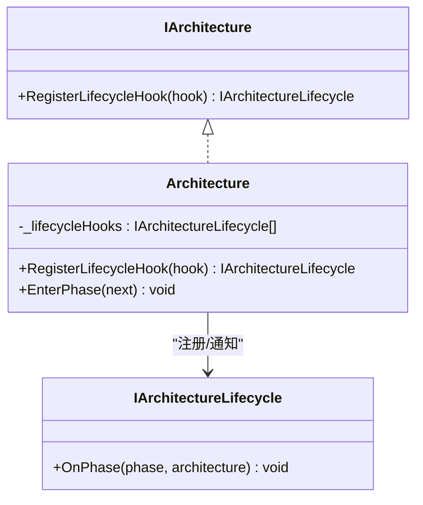
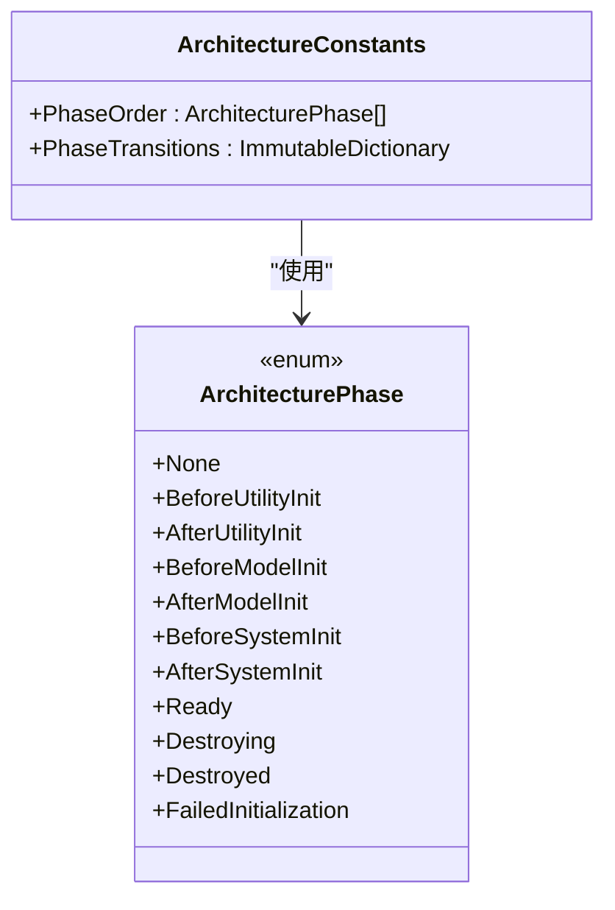
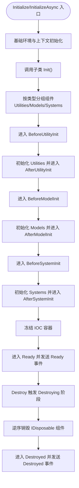
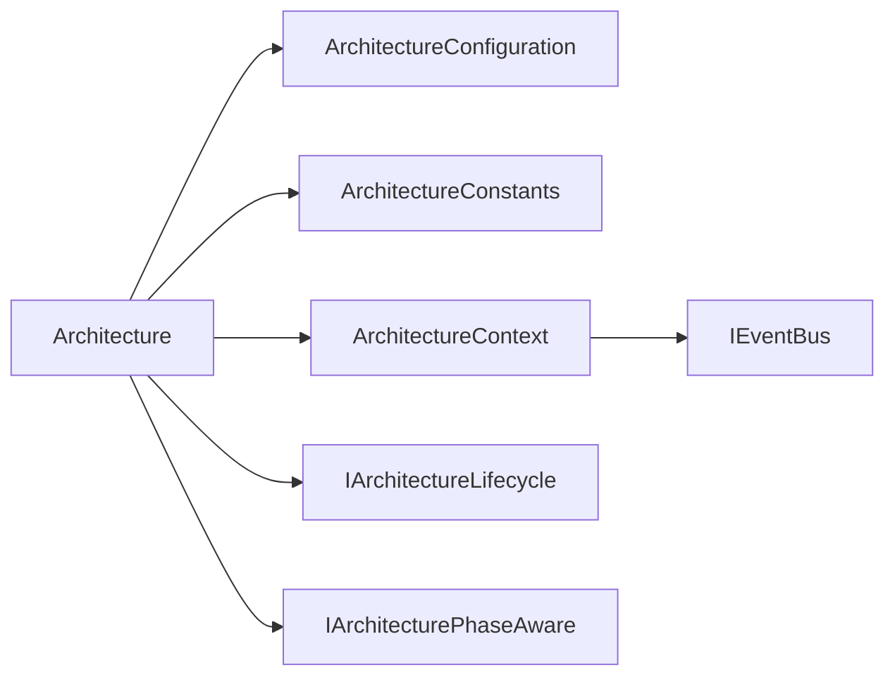

# 生命周期管理

<cite>
**本文引用的文件**
- [Architecture.cs](file://GFramework.Core/architecture/Architecture.cs)
- [IArchitectureLifecycle.cs](file://GFramework.Core.Abstractions/architecture/IArchitectureLifecycle.cs)
- [IArchitecturePhaseAware.cs](file://GFramework.Core.Abstractions/architecture/IArchitecturePhaseAware.cs)
- [ArchitecturePhase.cs](file://GFramework.Core.Abstractions/enums/ArchitecturePhase.cs)
- [ArchitectureConstants.cs](file://GFramework.Core/architecture/ArchitectureConstants.cs)
- [ArchitectureConfiguration.cs](file://GFramework.Core/architecture/ArchitectureConfiguration.cs)
- [ArchitectureContext.cs](file://GFramework.Core/architecture/ArchitectureContext.cs)
- [IArchitecture.cs](file://GFramework.Core.Abstractions/architecture/IArchitecture.cs)
- [IInitializable.cs](file://GFramework.Core.Abstractions/lifecycle/IInitializable.cs)
- [ILifecycle.cs](file://GFramework.Core.Abstractions/lifecycle/ILifecycle.cs)
- [ArchitectureConstantsTests.cs](file://GFramework.Core.Tests/architecture/ArchitectureConstantsTests.cs)
- [ArchitectureConfigurationTests.cs](file://GFramework.Core.Tests/architecture/ArchitectureConfigurationTests.cs)
- [TestArchitectureBase.cs](file://GFramework.Core.Tests/architecture/TestArchitectureBase.cs)
- [README.md](file://GFramework.Core/architecture/README.md)
</cite>

## 目录
1. [简介](#简介)
2. [项目结构](#项目结构)
3. [核心组件](#核心组件)
4. [架构总览](#架构总览)
5. [详细组件分析](#详细组件分析)
6. [依赖分析](#依赖分析)
7. [性能考虑](#性能考虑)
8. [故障排查指南](#故障排查指南)
9. [结论](#结论)
10. [附录](#附录)

## 简介
本文件聚焦于GFramework的架构生命周期管理，围绕EnterPhase方法的实现机制展开，深入解析阶段转换验证、阶段变更通知、阶段感知对象处理，以及生命周期钩子注册与IArchitectureLifecycle接口的实现要求。同时，详细说明ValidatePhaseTransition的阶段转换规则与StrictPhaseValidation配置的作用，解释NotifyPhase与NotifyPhaseAwareObjects的通知流程，并介绍架构阶段枚举ArchitecturePhase与阶段常量定义。最后提供生命周期管理的完整流程图与实际使用示例，包含错误处理与调试技巧。

## 项目结构
生命周期管理主要位于核心库的architecture目录下，配合抽象层接口与测试用例共同构成完整的生命周期体系：
- 核心实现：Architecture.cs（生命周期入口、阶段转换、通知、注册）
- 接口定义：IArchitectureLifecycle.cs、IArchitecturePhaseAware.cs、IArchitecture.cs
- 枚举与常量：ArchitecturePhase.cs、ArchitectureConstants.cs
- 配置与上下文：ArchitectureConfiguration.cs、ArchitectureContext.cs
- 生命周期接口：IInitializable.cs、ILifecycle.cs
- 测试与示例：ArchitectureConstantsTests.cs、ArchitectureConfigurationTests.cs、TestArchitectureBase.cs、README.md

**图表来源**
- [Architecture.cs](file://GFramework.Core/architecture/Architecture.cs#L1-L569)
- [ArchitectureConstants.cs](file://GFramework.Core/architecture/ArchitectureConstants.cs#L1-L54)
- [ArchitectureConfiguration.cs](file://GFramework.Core/architecture/ArchitectureConfiguration.cs#L1-L35)
- [ArchitectureContext.cs](file://GFramework.Core/architecture/ArchitectureContext.cs#L1-L225)
- [IArchitectureLifecycle.cs](file://GFramework.Core.Abstractions/architecture/IArchitectureLifecycle.cs#L1-L16)
- [IArchitecturePhaseAware.cs](file://GFramework.Core.Abstractions/architecture/IArchitecturePhaseAware.cs#L1-L15)
- [IArchitecture.cs](file://GFramework.Core.Abstractions/architecture/IArchitecture.cs#L1-L68)
- [ArchitecturePhase.cs](file://GFramework.Core.Abstractions/enums/ArchitecturePhase.cs#L1-L66)
- [IInitializable.cs](file://GFramework.Core.Abstractions/lifecycle/IInitializable.cs#L1-L12)
- [ILifecycle.cs](file://GFramework.Core.Abstractions/lifecycle/ILifecycle.cs#L1-L6)
- [ArchitectureConstantsTests.cs](file://GFramework.Core.Tests/architecture/ArchitectureConstantsTests.cs#L1-L195)
- [ArchitectureConfigurationTests.cs](file://GFramework.Core.Tests/architecture/ArchitectureConfigurationTests.cs#L1-L192)
- [TestArchitectureBase.cs](file://GFramework.Core.Tests/architecture/TestArchitectureBase.cs#L1-L58)
- [README.md](file://GFramework.Core/architecture/README.md#L296-L357)

**章节来源**
- [Architecture.cs](file://GFramework.Core/architecture/Architecture.cs#L1-L569)
- [ArchitectureConstants.cs](file://GFramework.Core/architecture/ArchitectureConstants.cs#L1-L54)
- [ArchitectureConfiguration.cs](file://GFramework.Core/architecture/ArchitectureConfiguration.cs#L1-L35)
- [ArchitectureContext.cs](file://GFramework.Core/architecture/ArchitectureContext.cs#L1-L225)
- [IArchitectureLifecycle.cs](file://GFramework.Core.Abstractions/architecture/IArchitectureLifecycle.cs#L1-L16)
- [IArchitecturePhaseAware.cs](file://GFramework.Core.Abstractions/architecture/IArchitecturePhaseAware.cs#L1-L15)
- [IArchitecture.cs](file://GFramework.Core.Abstractions/architecture/IArchitecture.cs#L1-L68)
- [ArchitecturePhase.cs](file://GFramework.Core.Abstractions/enums/ArchitecturePhase.cs#L1-L66)
- [IInitializable.cs](file://GFramework.Core.Abstractions/lifecycle/IInitializable.cs#L1-L12)
- [ILifecycle.cs](file://GFramework.Core.Abstractions/lifecycle/ILifecycle.cs#L1-L6)
- [ArchitectureConstantsTests.cs](file://GFramework.Core.Tests/architecture/ArchitectureConstantsTests.cs#L1-L195)
- [ArchitectureConfigurationTests.cs](file://GFramework.Core.Tests/architecture/ArchitectureConfigurationTests.cs#L1-L192)
- [TestArchitectureBase.cs](file://GFramework.Core.Tests/architecture/TestArchitectureBase.cs#L1-L58)
- [README.md](file://GFramework.Core/architecture/README.md#L296-L357)

## 核心组件
- EnterPhase：进入指定架构阶段的核心方法，负责阶段转换验证、阶段变更记录与通知。
- ValidatePhaseTransition：阶段转换规则校验，受StrictPhaseValidation影响。
- NotifyPhase：通知所有生命周期钩子当前阶段。
- NotifyPhaseAwareObjects：通知所有IArchitecturePhaseAware对象阶段变更。
- RegisterLifecycleHook：注册生命周期钩子，受AllowLateRegistration限制。
- ArchitecturePhase：阶段枚举，定义线性生命周期序列。
- ArchitectureConstants：阶段常量与转换规则定义。
- ArchitectureConfiguration：默认配置，含StrictPhaseValidation与AllowLateRegistration。
- ArchitectureContext：上下文服务访问与事件总线集成点。

**章节来源**
- [Architecture.cs](file://GFramework.Core/architecture/Architecture.cs#L142-L223)
- [ArchitectureConstants.cs](file://GFramework.Core/architecture/ArchitectureConstants.cs#L38-L54)
- [ArchitectureConfiguration.cs](file://GFramework.Core/architecture/ArchitectureConfiguration.cs#L30-L34)
- [ArchitectureContext.cs](file://GFramework.Core/architecture/ArchitectureContext.cs#L1-L225)

## 架构总览
生命周期管理采用“线性状态机”模式，阶段按固定顺序推进。EnterPhase作为入口，先进行转换验证，再更新CurrentPhase，随后通知生命周期钩子与阶段感知对象。初始化流程贯穿工具、模型、系统三类组件，最终进入Ready并冻结容器。

**图表来源**
- [Architecture.cs](file://GFramework.Core/architecture/Architecture.cs#L142-L183)
- [ArchitectureConstants.cs](file://GFramework.Core/architecture/ArchitectureConstants.cs#L38-L54)
- [ArchitectureConfiguration.cs](file://GFramework.Core/architecture/ArchitectureConfiguration.cs#L30-L34)

## 详细组件分析

### EnterPhase 方法实现机制
- 阶段转换验证：调用ValidatePhaseTransition，依据StrictPhaseValidation与ArchitectureConstants.PhaseTransitions判断合法性。
- 阶段变更记录：保存previousPhase，更新CurrentPhase，仅在阶段变化时记录日志。
- 阶段变更通知：先NotifyPhase通知生命周期钩子，再NotifyPhaseAwareObjects通知阶段感知对象。

**图表来源**
- [Architecture.cs](file://GFramework.Core/architecture/Architecture.cs#L142-L157)
- [Architecture.cs](file://GFramework.Core/architecture/Architecture.cs#L164-L183)
- [ArchitectureConstants.cs](file://GFramework.Core/architecture/ArchitectureConstants.cs#L38-L54)

**章节来源**
- [Architecture.cs](file://GFramework.Core/architecture/Architecture.cs#L142-L157)
- [Architecture.cs](file://GFramework.Core/architecture/Architecture.cs#L164-L183)

### ValidatePhaseTransition 阶段转换规则与StrictPhaseValidation
- StrictPhaseValidation关闭：跳过验证，允许任意转换。
- StrictPhaseValidation开启：仅允许线性顺序转换，且FailedInitialization可从任意阶段转入。
- 转换规则来源于ArchitectureConstants.PhaseTransitions，保证阶段顺序一致性与失败路径存在性。

**图表来源**
- [Architecture.cs](file://GFramework.Core/architecture/Architecture.cs#L164-L183)
- [ArchitectureConstants.cs](file://GFramework.Core/architecture/ArchitectureConstants.cs#L38-L54)
- [ArchitectureConfiguration.cs](file://GFramework.Core/architecture/ArchitectureConfiguration.cs#L30-L34)

**章节来源**
- [Architecture.cs](file://GFramework.Core/architecture/Architecture.cs#L164-L183)
- [ArchitectureConstants.cs](file://GFramework.Core/architecture/ArchitectureConstants.cs#L38-L54)
- [ArchitectureConfiguration.cs](file://GFramework.Core/architecture/ArchitectureConfiguration.cs#L30-L34)

### NotifyPhase 与 NotifyPhaseAwareObjects 通知机制
- NotifyPhase：遍历生命周期钩子列表，逐个调用OnPhase(phase, architecture)，并记录跟踪日志。
- NotifyPhaseAwareObjects：通过容器检索IArchitecturePhaseAware实例，逐个调用OnArchitecturePhase(phase)，并记录跟踪日志。

**图表来源**
- [Architecture.cs](file://GFramework.Core/architecture/Architecture.cs#L198-L209)
- [Architecture.cs](file://GFramework.Core/architecture/Architecture.cs#L189-L196)

**章节来源**
- [Architecture.cs](file://GFramework.Core/architecture/Architecture.cs#L189-L209)

### 生命周期钩子注册机制与 IArchitectureLifecycle 实现要求
- RegisterLifecycleHook：在CurrentPhase达到Ready之后，若未开启AllowLateRegistration，则拒绝注册；否则加入_hooks列表。
- IArchitectureLifecycle：必须实现OnPhase(ArchitecturePhase, IArchitecture)，用于接收阶段变更通知。
- IArchitecture：对外暴露RegisterLifecycleHook方法，便于外部注册。

**图表来源**
- [IArchitecture.cs](file://GFramework.Core.Abstractions/architecture/IArchitecture.cs#L62-L67)
- [Architecture.cs](file://GFramework.Core/architecture/Architecture.cs#L216-L223)
- [IArchitectureLifecycle.cs](file://GFramework.Core.Abstractions/architecture/IArchitectureLifecycle.cs#L8-L16)

**章节来源**
- [Architecture.cs](file://GFramework.Core/architecture/Architecture.cs#L216-L223)
- [IArchitecture.cs](file://GFramework.Core.Abstractions/architecture/IArchitecture.cs#L62-L67)
- [IArchitectureLifecycle.cs](file://GFramework.Core.Abstractions/architecture/IArchitectureLifecycle.cs#L8-L16)

### 阶段感知对象处理（IArchitecturePhaseAware）
- 通过容器检索IArchitecturePhaseAware实例，逐一调用OnArchitecturePhase(phase)。
- 适用于需要在特定阶段执行逻辑的对象，如资源加载、UI状态同步等。

**章节来源**
- [Architecture.cs](file://GFramework.Core/architecture/Architecture.cs#L189-L196)
- [IArchitecturePhaseAware.cs](file://GFramework.Core.Abstractions/architecture/IArchitecturePhaseAware.cs#L8-L15)

### 架构阶段枚举与阶段常量定义
- ArchitecturePhase：定义None、BeforeUtilityInit、AfterUtilityInit、BeforeModelInit、AfterModelInit、BeforeSystemInit、AfterSystemInit、Ready、Destroying、Destroyed、FailedInitialization等阶段。
- ArchitectureConstants：定义PhaseOrder线性顺序与PhaseTransitions转换映射，确保严格线性推进与失败路径存在。

**图表来源**
- [ArchitecturePhase.cs](file://GFramework.Core.Abstractions/enums/ArchitecturePhase.cs#L10-L66)
- [ArchitectureConstants.cs](file://GFramework.Core/architecture/ArchitectureConstants.cs#L17-L54)

**章节来源**
- [ArchitecturePhase.cs](file://GFramework.Core.Abstractions/enums/ArchitecturePhase.cs#L10-L66)
- [ArchitectureConstants.cs](file://GFramework.Core/architecture/ArchitectureConstants.cs#L17-L54)

### 生命周期管理完整流程图（初始化与销毁）

**图表来源**
- [Architecture.cs](file://GFramework.Core/architecture/Architecture.cs#L531-L566)
- [Architecture.cs](file://GFramework.Core/architecture/Architecture.cs#L357-L396)
- [ArchitectureConstants.cs](file://GFramework.Core/architecture/ArchitectureConstants.cs#L17-L29)

**章节来源**
- [Architecture.cs](file://GFramework.Core/architecture/Architecture.cs#L531-L566)
- [Architecture.cs](file://GFramework.Core/architecture/Architecture.cs#L357-L396)
- [ArchitectureConstants.cs](file://GFramework.Core/architecture/ArchitectureConstants.cs#L17-L29)

### 实际使用示例与最佳实践
- 生命周期钩子示例：参考README中的PerformanceMonitorHook示例，展示在各阶段打印日志。
- 钩子注册时机：必须在Ready阶段之前注册，否则会抛出异常。
- 阶段检查：通过CurrentPhase判断架构状态，避免在错误阶段执行操作。

**章节来源**
- [README.md](file://GFramework.Core/architecture/README.md#L296-L357)
- [Architecture.cs](file://GFramework.Core/architecture/Architecture.cs#L216-L223)

## 依赖分析
- Architecture依赖Configuration与ArchitectureConstants进行阶段验证与顺序约束。
- 通过容器检索IArchitecturePhaseAware与IArchitectureLifecycle，实现松耦合通知。
- ArchitectureContext提供服务缓存与事件总线集成，支持查询、命令、事件的统一访问。

**图表来源**
- [Architecture.cs](file://GFramework.Core/architecture/Architecture.cs#L57-L78)
- [ArchitectureContext.cs](file://GFramework.Core/architecture/ArchitectureContext.cs#L16-L24)
- [IArchitecture.cs](file://GFramework.Core.Abstractions/architecture/IArchitecture.cs#L11-L16)

**章节来源**
- [Architecture.cs](file://GFramework.Core/architecture/Architecture.cs#L57-L78)
- [ArchitectureContext.cs](file://GFramework.Core/architecture/ArchitectureContext.cs#L16-L24)
- [IArchitecture.cs](file://GFramework.Core.Abstractions/architecture/IArchitecture.cs#L11-L16)

## 性能考虑
- 去重集合：使用HashSet维护待初始化与可销毁组件，确保O(1)去重与O(1)插入/删除。
- 顺序与逆序：组件注册顺序保持初始化顺序，销毁时逆序执行，减少依赖破坏风险。
- 日志粒度：Info/Debug/Trace按重要性分级，避免过度日志影响性能。
- 异步初始化：支持IAsyncInitializable与IAsyncCommand，提升长耗时初始化效率。

[本节为通用指导，无需具体文件分析]

## 故障排查指南
- 阶段转换异常：检查StrictPhaseValidation与PhaseTransitions，确认转换是否符合线性顺序。
- Ready后注册钩子：若CurrentPhase已达Ready且未开启AllowLateRegistration，将抛出异常。
- 初始化失败：捕获Initialize/InitializeAsync异常后进入FailedInitialization并发送失败事件。
- 销毁异常：Destroy过程中单个组件异常会被捕获并记录，不影响其他组件销毁。

**章节来源**
- [Architecture.cs](file://GFramework.Core/architecture/Architecture.cs#L164-L183)
- [Architecture.cs](file://GFramework.Core/architecture/Architecture.cs#L216-L223)
- [Architecture.cs](file://GFramework.Core/architecture/Architecture.cs#L492-L524)
- [Architecture.cs](file://GFramework.Core/architecture/Architecture.cs#L357-L396)

## 结论
GFramework的生命周期管理以EnterPhase为核心，结合StrictPhaseValidation与ArchitectureConstants确保严格的线性状态机行为；通过NotifyPhase与NotifyPhaseAwareObjects实现钩子与感知对象的统一通知；借助ArchitectureConfiguration提供灵活的配置开关。整体设计清晰、可扩展，适合复杂游戏架构的生命周期编排。

[本节为总结，无需具体文件分析]

## 附录

### 阶段常量与转换规则验证（来自测试）
- PhaseOrder包含全部阶段且顺序正确。
- PhaseTransitions包含线性转换与失败路径，且每阶段最多一个转换。
- PhaseOrder与PhaseTransitions一致，保证转换方向正确。

**章节来源**
- [ArchitectureConstantsTests.cs](file://GFramework.Core.Tests/architecture/ArchitectureConstantsTests.cs#L24-L91)
- [ArchitectureConstantsTests.cs](file://GFramework.Core.Tests/architecture/ArchitectureConstantsTests.cs#L113-L195)

### 配置默认值与可定制性（来自测试）
- ArchitectureConfiguration默认StrictPhaseValidation为true，AllowLateRegistration为false。
- 支持独立修改LoggerProperties与ArchitectureProperties，不影响其他实例。

**章节来源**
- [ArchitectureConfigurationTests.cs](file://GFramework.Core.Tests/architecture/ArchitectureConfigurationTests.cs#L66-L83)
- [ArchitectureConfigurationTests.cs](file://GFramework.Core.Tests/architecture/ArchitectureConfigurationTests.cs#L107-L126)
- [ArchitectureConfigurationTests.cs](file://GFramework.Core.Tests/architecture/ArchitectureConfigurationTests.cs#L160-L191)

### 测试架构基类（扩展EnterPhase以记录阶段历史）
- 通过重写EnterPhase记录PhaseHistory，便于断言阶段推进顺序。

**章节来源**
- [TestArchitectureBase.cs](file://GFramework.Core.Tests/architecture/TestArchitectureBase.cs#L50-L57)