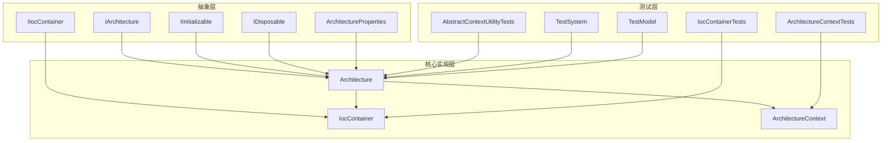
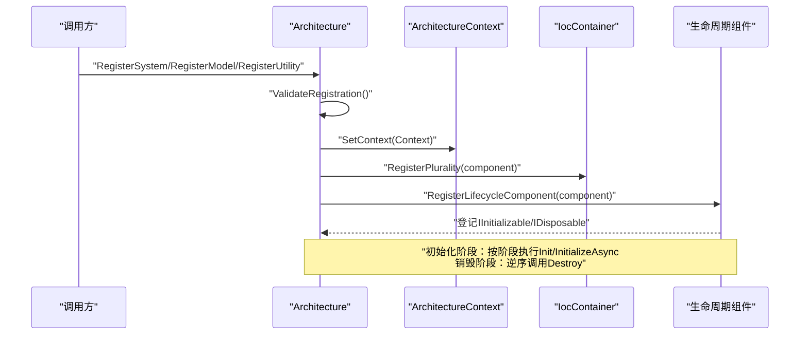
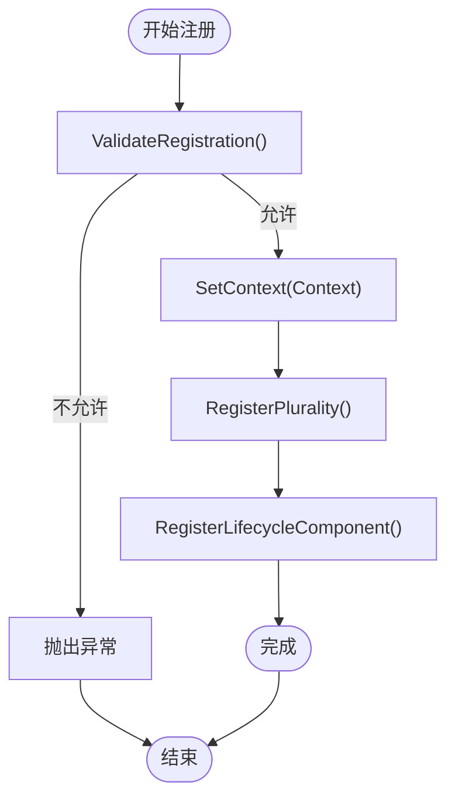
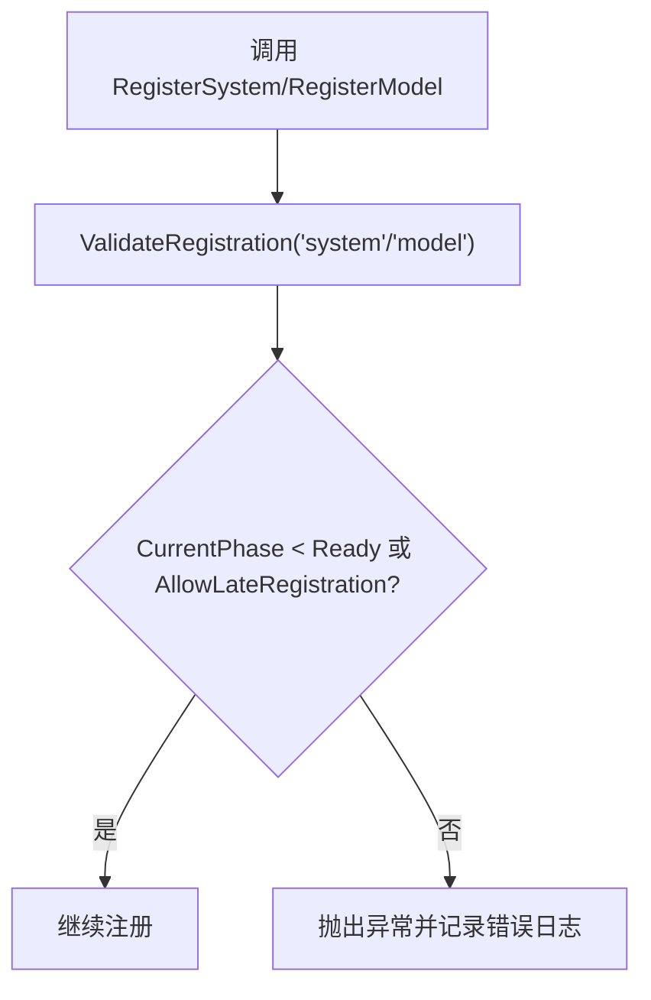
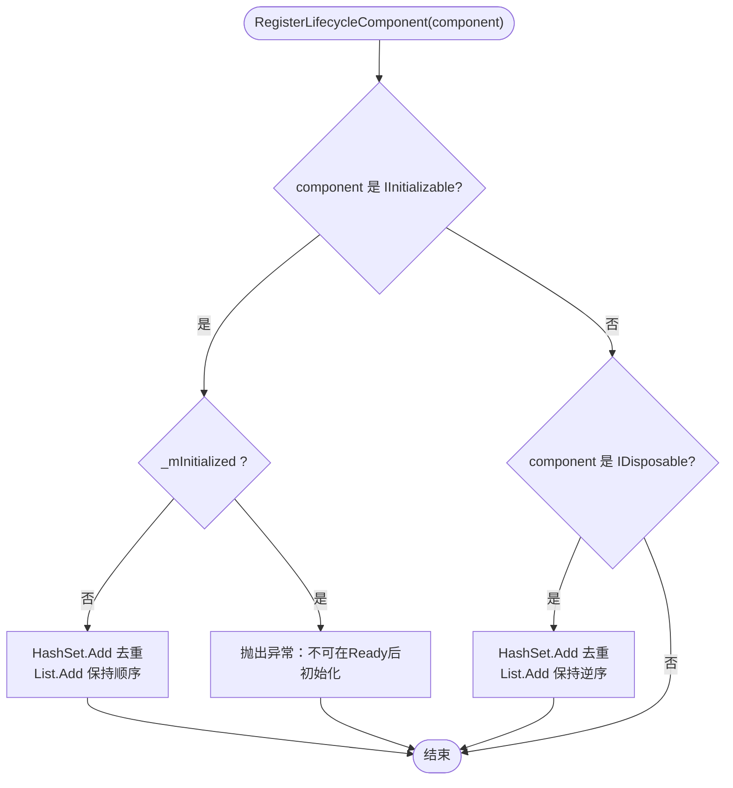
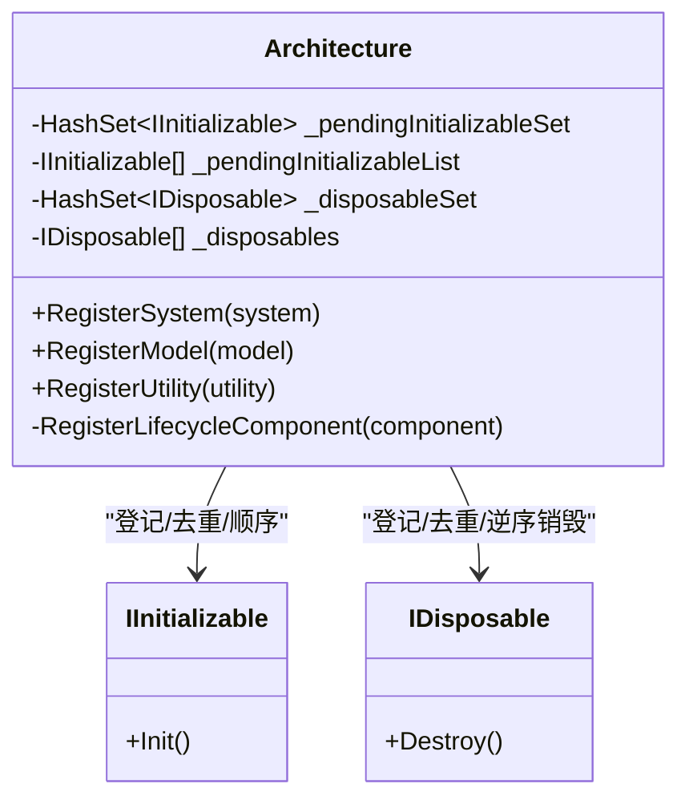
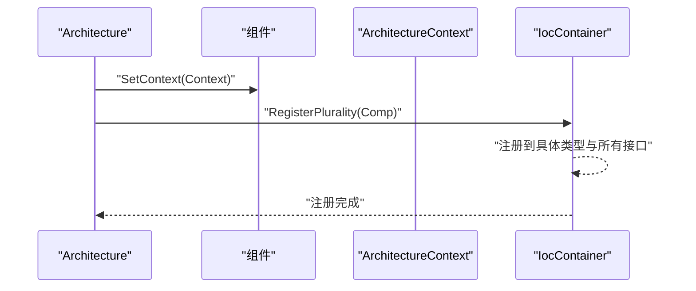
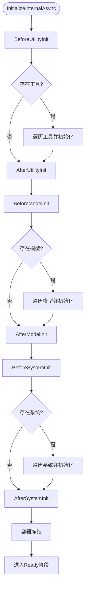
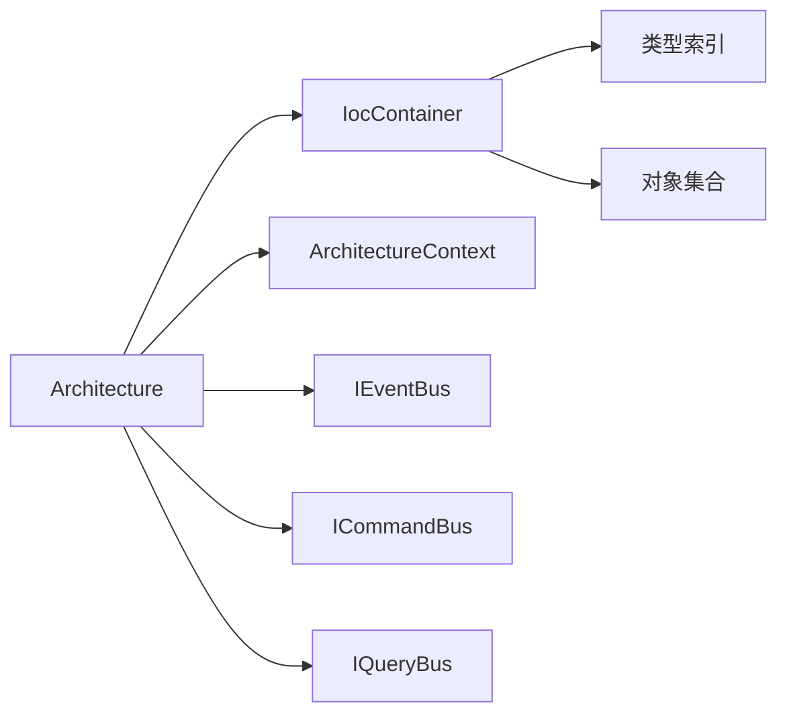

# 组件注册系统

<cite>
**本文引用的文件**
- [Architecture.cs](file://GFramework.Core/architecture/Architecture.cs)
- [IIocContainer.cs](file://GFramework.Core.Abstractions/ioc/IIocContainer.cs)
- [IocContainer.cs](file://GFramework.Core/ioc/IocContainer.cs)
- [ArchitectureContext.cs](file://GFramework.Core/architecture/ArchitectureContext.cs)
- [IArchitecture.cs](file://GFramework.Core.Abstractions/architecture/IArchitecture.cs)
- [ArchitectureProperties.cs](file://GFramework.Core.Abstractions/properties/ArchitectureProperties.cs)
- [IInitializable.cs](file://GFramework.Core.Abstractions/lifecycle/IInitializable.cs)
- [IDisposable.cs](file://GFramework.Core.Abstractions/lifecycle/IDisposable.cs)
- [ILifecycle.cs](file://GFramework.Core.Abstractions/lifecycle/ILifecycle.cs)
- [AbstractContextUtilityTests.cs](file://GFramework.Core.Tests/utility/AbstractContextUtilityTests.cs)
- [IocContainerTests.cs](file://GFramework.Core.Tests/ioc/IocContainerTests.cs)
- [ArchitectureContextTests.cs](file://GFramework.Core.Tests/architecture/ArchitectureContextTests.cs)
- [TestSystem.cs](file://GFramework.Core.Tests/system/TestSystem.cs)
- [TestModel.cs](file://GFramework.Core.Tests/model/TestModel.cs)
- [README.md（Utility）](file://GFramework.Core/utility/README.md)
</cite>

## 目录
1. [简介](#简介)
2. [项目结构](#项目结构)
3. [核心组件](#核心组件)
4. [架构总览](#架构总览)
5. [详细组件分析](#详细组件分析)
6. [依赖分析](#依赖分析)
7. [性能考量](#性能考量)
8. [故障排查指南](#故障排查指南)
9. [结论](#结论)
10. [附录](#附录)

## 简介
本文件面向GFramework的组件注册系统，围绕RegisterSystem、RegisterModel、RegisterUtility三大核心注册方法展开，深入解释其实现原理、使用差异与最佳实践；同时阐明ValidateRegistration的注册时机验证机制及AllowLateRegistration配置的影响；解释RegisterLifecycleComponent如何统一处理组件生命周期（IInitializable与IDisposable），并说明去重机制（HashSet）与顺序保持机制（List）的设计考量；最后介绍组件上下文设置（SetContext）与容器注册（Container.RegisterPlurality）过程，并提供异步初始化与错误处理策略示例。

## 项目结构
GFramework采用“抽象层 + 实现层”的清晰分层：
- 抽象层（Abstractions）定义接口与契约，如IArchitecture、IIocContainer、IInitializable、IDisposable等；
- 核心实现层（Core）提供具体实现，如Architecture、IocContainer、ArchitectureContext等；
- 测试层（Core.Tests）覆盖注册、生命周期、上下文与容器行为；
- 示例与文档位于各模块的README中，便于理解典型用法。

**图表来源**
- [IArchitecture.cs](file://GFramework.Core.Abstractions/architecture/IArchitecture.cs#L11-L68)
- [IIocContainer.cs](file://GFramework.Core.Abstractions/ioc/IIocContainer.cs#L11-L40)
- [IInitializable.cs](file://GFramework.Core.Abstractions/lifecycle/IInitializable.cs#L6-L12)
- [IDisposable.cs](file://GFramework.Core.Abstractions/lifecycle/IDisposable.cs#L6-L12)
- [ArchitectureProperties.cs](file://GFramework.Core.Abstractions/properties/ArchitectureProperties.cs#L6-L17)
- [Architecture.cs](file://GFramework.Core/architecture/Architecture.cs#L23-L29)
- [IocContainer.cs](file://GFramework.Core/ioc/IocContainer.cs#L12-L12)
- [ArchitectureContext.cs](file://GFramework.Core/architecture/ArchitectureContext.cs#L16-L24)

**章节来源**
- [IArchitecture.cs](file://GFramework.Core.Abstractions/architecture/IArchitecture.cs#L11-L68)
- [IIocContainer.cs](file://GFramework.Core.Abstractions/ioc/IIocContainer.cs#L11-L40)
- [Architecture.cs](file://GFramework.Core/architecture/Architecture.cs#L23-L29)
- [IocContainer.cs](file://GFramework.Core/ioc/IocContainer.cs#L12-L12)
- [ArchitectureContext.cs](file://GFramework.Core/architecture/ArchitectureContext.cs#L16-L24)

## 核心组件
- Architecture：架构基类，负责模块安装、组件注册（系统/模型/工具）、生命周期钩子注册、阶段推进、初始化与销毁。
- IocContainer：依赖注入容器，提供RegisterPlurality、RegisterSingleton、Register等注册方法，支持线程安全与冻结保护。
- ArchitectureContext：架构上下文，封装对系统、模型、工具的获取，以及命令、查询、事件的派发。
- 生命周期接口：IInitializable、IDisposable、ILifecycle，统一组件初始化与销毁流程。

**章节来源**
- [Architecture.cs](file://GFramework.Core/architecture/Architecture.cs#L400-L485)
- [IocContainer.cs](file://GFramework.Core/ioc/IocContainer.cs#L105-L158)
- [ArchitectureContext.cs](file://GFramework.Core/architecture/ArchitectureContext.cs#L26-L105)
- [IInitializable.cs](file://GFramework.Core.Abstractions/lifecycle/IInitializable.cs#L6-L12)
- [IDisposable.cs](file://GFramework.Core.Abstractions/lifecycle/IDisposable.cs#L6-L12)
- [ILifecycle.cs](file://GFramework.Core.Abstractions/lifecycle/ILifecycle.cs#L3-L6)

## 架构总览
注册系统的关键流程：
- ValidateRegistration根据当前阶段与AllowLateRegistration决定是否允许注册；
- SetContext为组件注入上下文；
- Container.RegisterPlurality将组件注册到其具体类型与所有接口；
- RegisterLifecycleComponent对IInitializable与IDisposable分别进行去重与顺序管理；
- 初始化阶段按工具→模型→系统分阶段执行，支持同步/异步初始化；
- 销毁阶段按注册逆序调用Destroy。

**图表来源**
- [Architecture.cs](file://GFramework.Core/architecture/Architecture.cs#L407-L483)
- [IocContainer.cs](file://GFramework.Core/ioc/IocContainer.cs#L105-L123)
- [ArchitectureContext.cs](file://GFramework.Core/architecture/ArchitectureContext.cs#L26-L105)

## 详细组件分析

### RegisterSystem、RegisterModel、RegisterUtility 的实现与差异
- RegisterSystem
  - 触发ValidateRegistration，校验注册时机；
  - 调用component.SetContext(Context)，注入上下文；
  - Container.RegisterPlurality(system)注册到具体类型与所有接口；
  - RegisterLifecycleComponent(system)登记IInitializable/IDisposable；
  - 返回注册的系统实例。
- RegisterModel
  - 与RegisterSystem一致的流程，但针对IModel；
  - 适用于有状态的数据载体，通常参与初始化阶段。
- RegisterUtility
  - 对IContextUtility分支：先SetContext，再RegisterLifecycleComponent；
  - 无论是否上下文工具，均执行Container.RegisterPlurality；
  - 适用于无状态或上下文感知的工具类。

**图表来源**
- [Architecture.cs](file://GFramework.Core/architecture/Architecture.cs#L407-L483)
- [IIocContainer.cs](file://GFramework.Core.Abstractions/ioc/IIocContainer.cs#L25-L40)

**章节来源**
- [Architecture.cs](file://GFramework.Core/architecture/Architecture.cs#L417-L483)
- [IIocContainer.cs](file://GFramework.Core.Abstractions/ioc/IIocContainer.cs#L25-L40)

### ValidateRegistration 与 AllowLateRegistration 的注册时机验证
- ValidateRegistration在RegisterSystem/RegisterModel前调用，判断：
  - 当前阶段是否小于Ready，或配置允许延迟注册；
  - 否则抛出InvalidOperationException，阻止在Ready之后注册。
- AllowLateRegistration为true时，可在Ready后继续注册（受架构阶段与钩子注册限制）。

**图表来源**
- [Architecture.cs](file://GFramework.Core/architecture/Architecture.cs#L407-L414)
- [ArchitectureProperties.cs](file://GFramework.Core.Abstractions/properties/ArchitectureProperties.cs#L10-L11)

**章节来源**
- [Architecture.cs](file://GFramework.Core/architecture/Architecture.cs#L407-L414)
- [ArchitectureProperties.cs](file://GFramework.Core.Abstractions/properties/ArchitectureProperties.cs#L10-L11)

### RegisterLifecycleComponent 的生命周期统一处理
- IInitializable处理：
  - 若未初始化，使用HashSet去重，再追加到List保持注册顺序；
  - 若已初始化，抛出异常，禁止在Ready后初始化。
- IDisposable处理：
  - 使用HashSet去重，追加到List，按注册逆序销毁；
  - 销毁阶段逐个调用Destroy，捕获异常并继续，保证整体稳定性。

**图表来源**
- [Architecture.cs](file://GFramework.Core/architecture/Architecture.cs#L229-L258)
- [IDisposable.cs](file://GFramework.Core.Abstractions/lifecycle/IDisposable.cs#L6-L12)
- [IInitializable.cs](file://GFramework.Core.Abstractions/lifecycle/IInitializable.cs#L6-L12)

**章节来源**
- [Architecture.cs](file://GFramework.Core/architecture/Architecture.cs#L229-L258)
- [IDisposable.cs](file://GFramework.Core.Abstractions/lifecycle/IDisposable.cs#L6-L12)
- [IInitializable.cs](file://GFramework.Core.Abstractions/lifecycle/IInitializable.cs#L6-L12)

### 去重机制（HashSet）与顺序保持机制（List）的设计考量
- 去重（HashSet）：
  - 避免重复登记同一组件，确保初始化/销毁不重复执行；
  - HashSet.Add返回布尔值，天然支持原子去重。
- 顺序（List）：
  - 保持注册顺序，确保初始化阶段的确定性；
  - 销毁逆序，保证资源释放的对称性与安全性。

**图表来源**
- [Architecture.cs](file://GFramework.Core/architecture/Architecture.cs#L96-L111)
- [Architecture.cs](file://GFramework.Core/architecture/Architecture.cs#L229-L258)

**章节来源**
- [Architecture.cs](file://GFramework.Core/architecture/Architecture.cs#L96-L111)
- [Architecture.cs](file://GFramework.Core/architecture/Architecture.cs#L229-L258)

### 组件上下文设置（SetContext）与容器注册（Container.RegisterPlurality）
- SetContext：
  - RegisterSystem/RegisterModel对组件调用SetContext(Context)；
  - RegisterUtility对IContextUtility分支同样设置上下文；
  - 使组件可通过Context访问系统、模型、工具与事件总线等。
- RegisterPlurality：
  - 将实例注册到具体类型与所有实现接口；
  - IocContainer内部维护类型索引与对象集合，支持线程安全与冻结保护。

**图表来源**
- [Architecture.cs](file://GFramework.Core/architecture/Architecture.cs#L429-L430)
- [Architecture.cs](file://GFramework.Core/architecture/Architecture.cs#L452-L453)
- [Architecture.cs](file://GFramework.Core/architecture/Architecture.cs#L475-L477)
- [IocContainer.cs](file://GFramework.Core/ioc/IocContainer.cs#L105-L123)

**章节来源**
- [Architecture.cs](file://GFramework.Core/architecture/Architecture.cs#L429-L430)
- [Architecture.cs](file://GFramework.Core/architecture/Architecture.cs#L452-L453)
- [Architecture.cs](file://GFramework.Core/architecture/Architecture.cs#L475-L477)
- [IocContainer.cs](file://GFramework.Core/ioc/IocContainer.cs#L105-L123)

### 初始化与销毁流程（含异步）
- 初始化阶段：
  - 分阶段执行：BeforeUtilityInit → AfterUtilityInit → BeforeModelInit → AfterModelInit → BeforeSystemInit → AfterSystemInit；
  - 按类型分组：工具、模型、系统；
  - 支持同步Init与异步InitializeAsync（IAsyncInitializable）。
- 销毁阶段：
  - 逆序遍历_disposables，逐个调用Destroy；
  - 捕获异常并继续，避免单点失败影响整体销毁。

**图表来源**
- [Architecture.cs](file://GFramework.Core/architecture/Architecture.cs#L531-L566)
- [Architecture.cs](file://GFramework.Core/architecture/Architecture.cs#L264-L330)
- [Architecture.cs](file://GFramework.Core/architecture/Architecture.cs#L357-L396)

**章节来源**
- [Architecture.cs](file://GFramework.Core/architecture/Architecture.cs#L531-L566)
- [Architecture.cs](file://GFramework.Core/architecture/Architecture.cs#L264-L330)
- [Architecture.cs](file://GFramework.Core/architecture/Architecture.cs#L357-L396)

### 注册示例与最佳实践
- 系统注册与使用
  - 在架构Init中注册系统，随后通过Context.GetSystem获取；
  - 参考测试用例与README示例路径：
    - [TestSystem.cs](file://GFramework.Core.Tests/system/TestSystem.cs#L10-L64)
    - [ArchitectureContextTests.cs](file://GFramework.Core.Tests/architecture/ArchitectureContextTests.cs#L218-L228)
    - [README.md（Utility）](file://GFramework.Core/utility/README.md#L140-L220)
- 模型注册与使用
  - 在架构Init中注册模型，通过Context.GetModel获取；
  - 参考测试用例：
    - [TestModel.cs](file://GFramework.Core.Tests/model/TestModel.cs#L9-L36)
    - [ArchitectureContextTests.cs](file://GFramework.Core.Tests/architecture/ArchitectureContextTests.cs#L244-L254)
- 工具注册与使用
  - RegisterUtility用于无状态或上下文工具；
  - 参考README示例路径：
    - [README.md（Utility）](file://GFramework.Core/utility/README.md#L140-L220)
- 异步初始化与错误处理
  - IAsyncInitializable在异步模式下使用InitializeAsync；
  - 错误处理：初始化失败进入FailedInitialization阶段，发送事件并抛出异常；
  - 销毁阶段捕获异常继续销毁，避免中断。

**章节来源**
- [TestSystem.cs](file://GFramework.Core.Tests/system/TestSystem.cs#L10-L64)
- [TestModel.cs](file://GFramework.Core.Tests/model/TestModel.cs#L9-L36)
- [ArchitectureContextTests.cs](file://GFramework.Core.Tests/architecture/ArchitectureContextTests.cs#L218-L228)
- [ArchitectureContextTests.cs](file://GFramework.Core.Tests/architecture/ArchitectureContextTests.cs#L244-L254)
- [README.md（Utility）](file://GFramework.Core/utility/README.md#L140-L220)
- [Architecture.cs](file://GFramework.Core/architecture/Architecture.cs#L511-L524)
- [Architecture.cs](file://GFramework.Core/architecture/Architecture.cs#L357-L396)

## 依赖分析
- 组件耦合与内聚：
  - Architecture对IocContainer与ArchitectureContext强依赖，形成高内聚的注册与生命周期管理；
  - IocContainer对类型索引与对象集合的管理，确保注册与解析的高效性与一致性。
- 外部依赖与集成点：
  - 事件总线、命令总线、查询总线通过ArchitectureContext统一访问；
  - 日志工厂与环境初始化在架构初始化阶段完成。

**图表来源**
- [Architecture.cs](file://GFramework.Core/architecture/Architecture.cs#L531-L566)
- [IocContainer.cs](file://GFramework.Core/ioc/IocContainer.cs#L41-L47)
- [ArchitectureContext.cs](file://GFramework.Core/architecture/ArchitectureContext.cs#L26-L105)

**章节来源**
- [Architecture.cs](file://GFramework.Core/architecture/Architecture.cs#L531-L566)
- [IocContainer.cs](file://GFramework.Core/ioc/IocContainer.cs#L41-L47)
- [ArchitectureContext.cs](file://GFramework.Core/architecture/ArchitectureContext.cs#L26-L105)

## 性能考量
- 线程安全：IocContainer使用ReaderWriterLockSlim保护注册与解析，降低锁竞争；
- 去重与索引：HashSet保证唯一性，Dictionary+HashSet实现O(1)级别的类型查找；
- 初始化顺序：分阶段与分组初始化减少跨阶段依赖，提升可维护性；
- 销毁逆序：确保资源释放的对称性，避免遗漏。

[本节为通用指导，无需列出具体文件来源]

## 故障排查指南
- 注册时机错误
  - 症状：在Ready后注册抛出InvalidOperationException；
  - 处理：开启AllowLateRegistration或在Init中完成注册。
  - 参考：
    - [Architecture.cs](file://GFramework.Core/architecture/Architecture.cs#L407-L414)
    - [ArchitectureProperties.cs](file://GFramework.Core.Abstractions/properties/ArchitectureProperties.cs#L10-L11)
- 容器冻结后注册失败
  - 症状：RegisterPlurality/Register抛出InvalidOperationException；
  - 处理：在Initialize后不再注册，或使用AllowLateRegistration（视场景）。
  - 参考：
    - [IocContainer.cs](file://GFramework.Core/ioc/IocContainer.cs#L132-L137)
    - [IocContainer.cs](file://GFramework.Core/ioc/IocContainer.cs#L357-L370)
- 生命周期异常
  - 症状：初始化/销毁阶段异常导致整体失败；
  - 处理：初始化阶段捕获异常并进入FailedInitialization；销毁阶段捕获异常继续。
  - 参考：
    - [Architecture.cs](file://GFramework.Core/architecture/Architecture.cs#L494-L504)
    - [Architecture.cs](file://GFramework.Core/architecture/Architecture.cs#L377-L386)

**章节来源**
- [Architecture.cs](file://GFramework.Core/architecture/Architecture.cs#L407-L414)
- [ArchitectureProperties.cs](file://GFramework.Core.Abstractions/properties/ArchitectureProperties.cs#L10-L11)
- [IocContainer.cs](file://GFramework.Core/ioc/IocContainer.cs#L132-L137)
- [IocContainer.cs](file://GFramework.Core/ioc/IocContainer.cs#L357-L370)
- [Architecture.cs](file://GFramework.Core/architecture/Architecture.cs#L494-L504)
- [Architecture.cs](file://GFramework.Core/architecture/Architecture.cs#L377-L386)

## 结论
GFramework的组件注册系统通过ValidateRegistration、SetContext、RegisterPlurality与RegisterLifecycleComponent四个关键环节，实现了对系统、模型、工具的统一注册与生命周期管理。去重（HashSet）与顺序保持（List）确保了初始化与销毁的确定性与安全性；AllowLateRegistration提供了灵活的注册时机控制；异步初始化与错误处理策略完善了复杂场景下的健壮性。结合ArchitectureContext与IocContainer，开发者可以以最小成本完成组件装配与运行时访问。

[本节为总结性内容，无需列出具体文件来源]

## 附录
- 关键接口与契约
  - IArchitecture：注册与生命周期入口；
  - IIocContainer：注册与解析契约；
  - IInitializable/IDisposable/ILifecycle：生命周期标准。
- 相关测试参考
  - IocContainerTests：容器注册与冻结行为；
  - ArchitectureContextTests：组件获取行为；
  - AbstractContextUtilityTests：上下文工具生命周期。

**章节来源**
- [IArchitecture.cs](file://GFramework.Core.Abstractions/architecture/IArchitecture.cs#L11-L68)
- [IIocContainer.cs](file://GFramework.Core.Abstractions/ioc/IIocContainer.cs#L11-L40)
- [IInitializable.cs](file://GFramework.Core.Abstractions/lifecycle/IInitializable.cs#L6-L12)
- [IDisposable.cs](file://GFramework.Core.Abstractions/lifecycle/IDisposable.cs#L6-L12)
- [ILifecycle.cs](file://GFramework.Core.Abstractions/lifecycle/ILifecycle.cs#L3-L6)
- [IocContainerTests.cs](file://GFramework.Core.Tests/ioc/IocContainerTests.cs#L76-L84)
- [ArchitectureContextTests.cs](file://GFramework.Core.Tests/architecture/ArchitectureContextTests.cs#L218-L228)
- [AbstractContextUtilityTests.cs](file://GFramework.Core.Tests/utility/AbstractContextUtilityTests.cs#L46-L54)