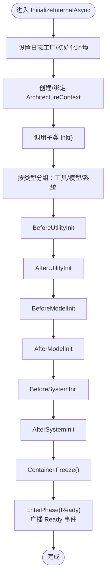

# 核心架构模块

<cite>
**本文引用的文件**
- [Architecture.cs](file://GFramework.Core/architecture/Architecture.cs)
- [ArchitectureContext.cs](file://GFramework.Core/architecture/ArchitectureContext.cs)
- [ArchitectureServices.cs](file://GFramework.Core/architecture/ArchitectureServices.cs)
- [EventBus.cs](file://GFramework.Core/events/EventBus.cs)
- [EasyEvent.cs](file://GFramework.Core/events/EasyEvent.cs)
- [EasyEvents.cs](file://GFramework.Core/events/EasyEvents.cs)
- [CommandBus.cs](file://GFramework.Core/command/CommandBus.cs)
- [AbstractCommand.cs](file://GFramework.Core/command/AbstractCommand.cs)
- [QueryBus.cs](file://GFramework.Core/query/QueryBus.cs)
- [AbstractQuery.cs](file://GFramework.Core/query/AbstractQuery.cs)
- [CoroutineScheduler.cs](file://GFramework.Core/coroutine/CoroutineScheduler.cs)
- [CoroutineHandle.cs](file://GFramework.Core/coroutine/CoroutineHandle.cs)
- [WaitForFrames.cs](file://GFramework.Core/coroutine/WaitForFrames.cs)
- [IocContainer.cs](file://GFramework.Core/ioc/IocContainer.cs)
- [ConsoleLoggerFactory.cs](file://GFramework.Core/logging/ConsoleLoggerFactory.cs)
</cite>

## 目录
1. [简介](#简介)
2. [项目结构](#项目结构)
3. [核心组件](#核心组件)
4. [架构总览](#架构总览)
5. [详细组件分析](#详细组件分析)
6. [依赖分析](#依赖分析)
7. [性能考量](#性能考量)
8. [故障排查指南](#故障排查指南)
9. [结论](#结论)
10. [附录](#附录)

## 简介
本文件面向GFramework核心架构模块，系统化梳理以下能力：
- 架构管理系统：Architecture基类的设计模式、生命周期管理机制与组件注册体系
- 事件系统：EventBus的类型安全实现、EasyEvent机制与事件传播
- 命令查询分离（CQRS）：CommandBus/QueryBus实现、异步处理与输入输出模型
- 协程调度系统：CoroutineScheduler工作原理、YieldInstruction机制与性能优化
- 依赖注入：IocContainer生命周期与服务注册解析
- 日志系统：结构化设计与多级别支持
- API参考、使用示例与最佳实践
- 设计决策与权衡

## 项目结构
核心模块位于GFramework.Core，采用“按职责分层+按领域聚合”的组织方式：
- architecture：架构基类、上下文、服务装配与配置
- events：事件总线与易用事件容器
- command/query：命令与查询总线及抽象基类
- coroutine：协程调度器与等待指令
- ioc：依赖注入容器
- logging：日志工厂与记录器
- abstractions：各模块的接口契约

图表来源
- [Architecture.cs](file://GFramework.Core/architecture/Architecture.cs#L19-L569)
- [ArchitectureContext.cs](file://GFramework.Core/architecture/ArchitectureContext.cs#L13-L225)
- [ArchitectureServices.cs](file://GFramework.Core/architecture/ArchitectureServices.cs#L14-L106)
- [EventBus.cs](file://GFramework.Core/events/EventBus.cs#L5-L55)
- [EasyEvents.cs](file://GFramework.Core/events/EasyEvents.cs#L5-L85)
- [EasyEvent.cs](file://GFramework.Core/events/EasyEvent.cs#L5-L39)
- [CommandBus.cs](file://GFramework.Core/command/CommandBus.cs#L6-L62)
- [AbstractCommand.cs](file://GFramework.Core/command/AbstractCommand.cs#L6-L53)
- [QueryBus.cs](file://GFramework.Core/query/QueryBus.cs#L5-L23)
- [AbstractQuery.cs](file://GFramework.Core/query/AbstractQuery.cs#L6-L29)
- [CoroutineScheduler.cs](file://GFramework.Core/coroutine/CoroutineScheduler.cs#L5-L392)
- [CoroutineHandle.cs](file://GFramework.Core/coroutine/CoroutineHandle.cs#L3-L94)
- [WaitForFrames.cs](file://GFramework.Core/coroutine/WaitForFrames.cs#L5-L29)
- [IocContainer.cs](file://GFramework.Core/ioc/IocContainer.cs#L9-L373)
- [ConsoleLoggerFactory.cs](file://GFramework.Core/logging/ConsoleLoggerFactory.cs#L5-L20)

章节来源
- [Architecture.cs](file://GFramework.Core/architecture/Architecture.cs#L19-L569)
- [ArchitectureContext.cs](file://GFramework.Core/architecture/ArchitectureContext.cs#L13-L225)
- [ArchitectureServices.cs](file://GFramework.Core/architecture/ArchitectureServices.cs#L14-L106)

## 核心组件
- Architecture：统一的架构基类，负责阶段管理、组件注册、生命周期编排与销毁
- ArchitectureContext：服务门面，封装命令/查询/事件/系统/模型/工具的获取与执行
- ArchitectureServices：服务装配中心，统一创建并注册EventBus、CommandBus、QueryBus、AsyncQueryBus与IocContainer
- EventBus/EasyEvents/EasyEvent：类型安全事件系统，支持泛型事件自动创建与触发
- CommandBus/AbstractCommand：命令总线与抽象命令基类，支持同步/异步命令与返回值
- QueryBus/AbstractQuery：查询总线与抽象查询基类，支持同步查询
- CoroutineScheduler/CoroutineHandle/WaitForFrames：协程调度器与等待指令，支持暂停/恢复/等待/按标签终止
- IocContainer：线程安全的依赖注入容器，支持单例/多重注册、冻结保护与排序获取
- ConsoleLoggerFactory：日志工厂，提供控制台日志记录器

章节来源
- [EventBus.cs](file://GFramework.Core/events/EventBus.cs#L5-L55)
- [EasyEvents.cs](file://GFramework.Core/events/EasyEvents.cs#L5-L85)
- [EasyEvent.cs](file://GFramework.Core/events/EasyEvent.cs#L5-L39)
- [CommandBus.cs](file://GFramework.Core/command/CommandBus.cs#L6-L62)
- [AbstractCommand.cs](file://GFramework.Core/command/AbstractCommand.cs#L6-L53)
- [QueryBus.cs](file://GFramework.Core/query/QueryBus.cs#L5-L23)
- [AbstractQuery.cs](file://GFramework.Core/query/AbstractQuery.cs#L6-L29)
- [CoroutineScheduler.cs](file://GFramework.Core/coroutine/CoroutineScheduler.cs#L5-L392)
- [CoroutineHandle.cs](file://GFramework.Core/coroutine/CoroutineHandle.cs#L3-L94)
- [WaitForFrames.cs](file://GFramework.Core/coroutine/WaitForFrames.cs#L5-L29)
- [IocContainer.cs](file://GFramework.Core/ioc/IocContainer.cs#L9-L373)
- [ConsoleLoggerFactory.cs](file://GFramework.Core/logging/ConsoleLoggerFactory.cs#L5-L20)

## 架构总览
下图展示Architecture如何通过ArchitectureServices装配核心服务，并由ArchitectureContext提供统一的服务门面，同时协调事件、命令、查询与协程等子系统。

图表来源
- [Architecture.cs](file://GFramework.Core/architecture/Architecture.cs#L531-L566)
- [ArchitectureServices.cs](file://GFramework.Core/architecture/ArchitectureServices.cs#L46-L61)
- [ArchitectureContext.cs](file://GFramework.Core/architecture/ArchitectureContext.cs#L21-L41)
- [EventBus.cs](file://GFramework.Core/events/EventBus.cs#L12-L33)
- [CommandBus.cs](file://GFramework.Core/command/CommandBus.cs#L16-L35)
- [QueryBus.cs](file://GFramework.Core/query/QueryBus.cs#L16-L22)

## 详细组件分析

### Architecture：架构基类与生命周期
- 设计模式
  - 组合优于继承：通过组合ArchitectureServices与IocContainer，集中管理服务与依赖
  - 职责分离：生命周期管理、阶段转换、组件注册与初始化解耦于具体业务
- 生命周期管理
  - 阶段模型：BeforeUtilityInit → AfterUtilityInit → BeforeModelInit → AfterModelInit → BeforeSystemInit → AfterSystemInit → Ready → Destroying → Destroyed
  - 阶段转换校验：受配置项控制，支持严格校验与宽松校验
  - 阶段感知：IArchitecturePhaseAware与IArchitectureLifecycle钩子在阶段切换时被通知
- 组件注册
  - 支持系统、模型、工具注册，自动注入上下文并登记生命周期
  - 注册时机限制：Ready之后默认禁止注册（可通过配置放宽）
- 初始化与销毁
  - Initialize/InitializeAsync：按阶段顺序初始化工具/模型/系统，随后冻结容器并进入Ready
  - Destroy：逆序销毁IDisposable组件，阶段推进至Destroyed并广播事件

图表来源
- [Architecture.cs](file://GFramework.Core/architecture/Architecture.cs#L531-L566)
- [Architecture.cs](file://GFramework.Core/architecture/Architecture.cs#L264-L330)

章节来源
- [Architecture.cs](file://GFramework.Core/architecture/Architecture.cs#L19-L569)

### ArchitectureContext：服务门面与执行入口
- 服务缓存：首次获取通过容器解析并缓存，后续直接命中
- 命令执行：SendCommand/SendCommandAsync，支持同步/异步与返回值
- 查询执行：SendQuery/SendQueryAsync，支持同步/异步查询
- 事件管理：SendEvent/RegisterEvent/UnRegisterEvent
- 组件检索：GetSystem/GetModel/GetUtility
- 环境获取：GetEnvironment

图表来源
- [ArchitectureContext.cs](file://GFramework.Core/architecture/ArchitectureContext.cs#L13-L225)

章节来源
- [ArchitectureContext.cs](file://GFramework.Core/architecture/ArchitectureContext.cs#L13-L225)

### ArchitectureServices：服务装配中心
- 职责：创建并注册EventBus、CommandBus、QueryBus、AsyncQueryBus与IocContainer
- 上下文绑定：SetContext将架构上下文传递给容器与服务
- 服务暴露：Container/EventBus/CommandBus/QueryBus/AsyncQueryBus属性

图表来源
- [ArchitectureServices.cs](file://GFramework.Core/architecture/ArchitectureServices.cs#L14-L106)

章节来源
- [ArchitectureServices.cs](file://GFramework.Core/architecture/ArchitectureServices.cs#L14-L106)

### 事件系统：EventBus/EasyEvent/EasyEvents
- 类型安全：EventBus.Send<T>()与Send<T>(T)均基于泛型事件类型Event<T>，通过EasyEvents统一管理
- 易用性：EasyEvent/EasyEvents提供简单事件与全局事件容器，支持自动创建与注册
- 传播机制：EventBus内部委托链触发，支持注册/注销与按类型分发

图表来源
- [EventBus.cs](file://GFramework.Core/events/EventBus.cs#L12-L33)
- [EasyEvents.cs](file://GFramework.Core/events/EasyEvents.cs#L74-L84)
- [EasyEvent.cs](file://GFramework.Core/events/EasyEvent.cs#L17-L38)

章节来源
- [EventBus.cs](file://GFramework.Core/events/EventBus.cs#L5-L55)
- [EasyEvents.cs](file://GFramework.Core/events/EasyEvents.cs#L5-L85)
- [EasyEvent.cs](file://GFramework.Core/events/EasyEvent.cs#L5-L39)

### 命令查询分离（CQRS）：CommandBus/QueryBus 与抽象基类
- 命令总线
  - 同步：Send(ICommand)/Send<TResult>(ICommand<TResult>)
  - 异步：SendAsync(IAsyncCommand)/SendAsync<TResult>(IAsyncCommand<TResult>)
  - 输入输出：AbstractCommand<TInput>/AbstractCommand<TInput,TResult>提供输入约束与执行入口
- 查询总线
  - 同步：Send<TResult>(IQuery<TResult>) -> query.Do()
  - 输入输出：AbstractQuery<TInput,TResult>提供输入约束与执行入口
- 设计要点
  - 命令与查询职责清晰分离，便于扩展与测试
  - 异步命令/查询通过接口约定，便于替换实现

图表来源
- [CommandBus.cs](file://GFramework.Core/command/CommandBus.cs#L6-L62)
- [AbstractCommand.cs](file://GFramework.Core/command/AbstractCommand.cs#L6-L53)
- [QueryBus.cs](file://GFramework.Core/query/QueryBus.cs#L5-L23)
- [AbstractQuery.cs](file://GFramework.Core/query/AbstractQuery.cs#L6-L29)

章节来源
- [CommandBus.cs](file://GFramework.Core/command/CommandBus.cs#L6-L62)
- [AbstractCommand.cs](file://GFramework.Core/command/AbstractCommand.cs#L6-L53)
- [QueryBus.cs](file://GFramework.Core/query/QueryBus.cs#L5-L23)
- [AbstractQuery.cs](file://GFramework.Core/query/AbstractQuery.cs#L6-L29)

### 协程调度系统：CoroutineScheduler/YieldInstruction
- 协程句柄：CoroutineHandle通过实例ID与键空间分配唯一句柄，支持有效性判断
- 调度器：CoroutineScheduler维护协程槽位数组、元数据、等待关系与标签索引
- 生命周期：Run预热推进一步；Update按DeltaTime推进协程，处理等待指令与异常；Complete唤醒等待者并清理
- 等待指令：WaitForFrames等实现IYieldInstruction，支持帧等待等场景

图表来源
- [CoroutineScheduler.cs](file://GFramework.Core/coroutine/CoroutineScheduler.cs#L43-L121)
- [CoroutineScheduler.cs](file://GFramework.Core/coroutine/CoroutineScheduler.cs#L264-L334)
- [CoroutineHandle.cs](file://GFramework.Core/coroutine/CoroutineHandle.cs#L35-L77)
- [WaitForFrames.cs](file://GFramework.Core/coroutine/WaitForFrames.cs#L9-L29)

章节来源
- [CoroutineScheduler.cs](file://GFramework.Core/coroutine/CoroutineScheduler.cs#L5-L392)
- [CoroutineHandle.cs](file://GFramework.Core/coroutine/CoroutineHandle.cs#L3-L94)
- [WaitForFrames.cs](file://GFramework.Core/coroutine/WaitForFrames.cs#L5-L29)

### 依赖注入：IocContainer
- 注册策略
  - RegisterSingleton<T>(T)：单例注册，类型唯一
  - RegisterPlurality(object)：将实例注册到其实现的所有接口与具体类型上
  - Register<T>/Register(Type, object)：按类型注册
- 解析策略
  - Get<T>()：返回首个实例或null
  - GetRequired<T>()：要求唯一实例，否则抛异常
  - GetAll<T>()：返回所有实例快照
  - GetAllSorted<T>(Comparison)：排序后返回
- 并发与冻结
  - ReaderWriterLockSlim保证读写并发安全
  - Freeze()后禁止进一步注册，防止运行期变更

图表来源
- [IocContainer.cs](file://GFramework.Core/ioc/IocContainer.cs#L9-L373)

章节来源
- [IocContainer.cs](file://GFramework.Core/ioc/IocContainer.cs#L9-L373)

### 日志系统：ConsoleLoggerFactory
- 提供ILoggerFactory接口实现，创建ConsoleLogger实例
- 与Architecture集成：通过配置注入日志工厂，贯穿初始化与运行期

章节来源
- [ConsoleLoggerFactory.cs](file://GFramework.Core/logging/ConsoleLoggerFactory.cs#L5-L20)

## 依赖分析
- 组件耦合
  - Architecture依赖ArchitectureServices与ArchitectureContext
  - ArchitectureContext依赖IocContainer与各总线接口
  - ArchitectureServices组合EventBus/CommandBus/QueryBus/AsyncQueryBus/IocContainer
  - EventBus依赖EasyEvents/EasyEvent
  - CommandBus/QueryBus独立于具体实现，通过接口解耦
- 外部依赖
  - 时间源ITimeSource用于协程调度器
  - 日志工厂通过配置注入

图表来源
- [Architecture.cs](file://GFramework.Core/architecture/Architecture.cs#L531-L566)
- [ArchitectureServices.cs](file://GFramework.Core/architecture/ArchitectureServices.cs#L46-L61)
- [EventBus.cs](file://GFramework.Core/events/EventBus.cs#L8-L10)
- [EasyEvents.cs](file://GFramework.Core/events/EasyEvents.cs#L9-L19)

章节来源
- [Architecture.cs](file://GFramework.Core/architecture/Architecture.cs#L531-L566)
- [ArchitectureServices.cs](file://GFramework.Core/architecture/ArchitectureServices.cs#L46-L61)

## 性能考量
- 协程调度
  - 槽位数组动态扩容，避免频繁分配
  - 预热推进一步，减少首帧开销
  - 等待指令按帧更新，避免忙轮询
- 依赖注入
  - 读写锁分离读写，降低竞争
  - 冻结后禁止注册，避免运行期结构变化
- 事件系统
  - 泛型事件自动创建与缓存，减少反射成本
- 生命周期
  - 组件去重集合与顺序列表，保证初始化与销毁的确定性

## 故障排查指南
- 阶段转换异常
  - 现象：非法阶段转换导致异常
  - 排查：检查ArchitectureConstants的允许转换表与StrictPhaseValidation配置
- 注册时机异常
  - 现象：Ready后注册组件抛出异常
  - 排查：确认AllowLateRegistration配置或调整注册位置
- 容器冻结异常
  - 现象：冻结后仍尝试注册
  - 排查：定位冻结点，避免在Ready后注册
- 协程错误
  - 现象：协程异常被吞并或卡住
  - 排查：查看OnError处理与Complete流程，确认等待关系与标签清理
- 事件未触发
  - 现象：注册监听无效
  - 排查：确认EventBus与EasyEvents的类型键一致，监听者未被注销

章节来源
- [Architecture.cs](file://GFramework.Core/architecture/Architecture.cs#L164-L183)
- [IocContainer.cs](file://GFramework.Core/ioc/IocContainer.cs#L132-L137)
- [CoroutineScheduler.cs](file://GFramework.Core/coroutine/CoroutineScheduler.cs#L341-L345)

## 结论
GFramework核心架构模块以清晰的职责边界与强类型契约构建，通过Architecture统一生命周期与阶段管理，结合ArchitectureContext提供统一服务门面，配合EventBus/EasyEvents实现类型安全事件，CommandBus/QueryBus落实CQRS，CoroutineScheduler提供高效协程调度，IocContainer保障依赖注入的线程安全与可演进性。整体设计强调可测试性、可扩展性与运行期稳定性。

## 附录

### API参考与最佳实践
- Architecture
  - 初始化：Initialize/InitializeAsync；销毁：Destroy
  - 阶段：EnterPhase；钩子：RegisterLifecycleHook
  - 组件注册：RegisterSystem/RegisterModel/RegisterUtility
  - 最佳实践：在Init中完成模块安装与组件注册；避免在Ready后注册
- ArchitectureContext
  - 命令：SendCommand/SendCommandAsync
  - 查询：SendQuery/SendQueryAsync
  - 事件：SendEvent/RegisterEvent/UnRegisterEvent
  - 组件：GetSystem/GetModel/GetUtility
  - 最佳实践：优先使用Context封装的执行入口，避免直接依赖总线
- ArchitectureServices
  - 服务：Container/EventBus/CommandBus/QueryBus/AsyncQueryBus
  - 最佳实践：通过SetContext传递上下文，确保容器内组件上下文一致
- EventBus/EasyEvents/EasyEvent
  - 发送：Send<T>()/Send<T>(T)
  - 注册/注销：Register<T>/UnRegister<T>
  - 最佳实践：事件类型稳定且可序列化；避免循环引用
- CommandBus/AbstractCommand
  - 同步/异步：Send/SendAsync；带返回值版本
  - 最佳实践：命令幂等或具备补偿；输入参数实现ICommandInput
- QueryBus/AbstractQuery
  - 同步：Send<TResult>
  - 最佳实践：查询无副作用；输入参数实现IQueryInput
- CoroutineScheduler/CoroutineHandle/WaitForFrames
  - 运行：Run；更新：Update；暂停/恢复/终止：Pause/Resume/Kill
  - 等待：WaitForCoroutine；按标签终止：KillByTag；清空：Clear
  - 最佳实践：合理使用标签；避免长链等待；捕获异常避免崩溃
- IocContainer
  - 注册：RegisterSingleton/RegisterPlurality/Register
  - 解析：Get/GetRequired/GetAll/GetAllSorted
  - 最佳实践：冻结前完成全部注册；避免循环依赖
- 日志
  - 最佳实践：按需设置最小级别；在关键路径打点；避免在热路径做昂贵操作