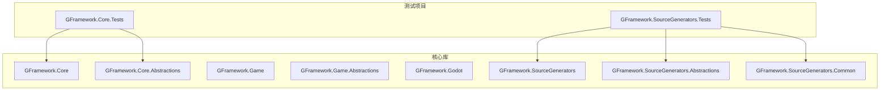
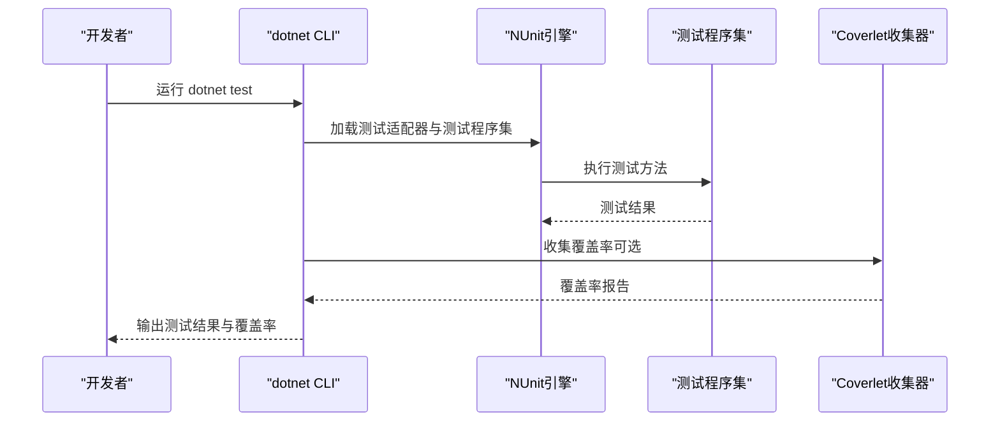
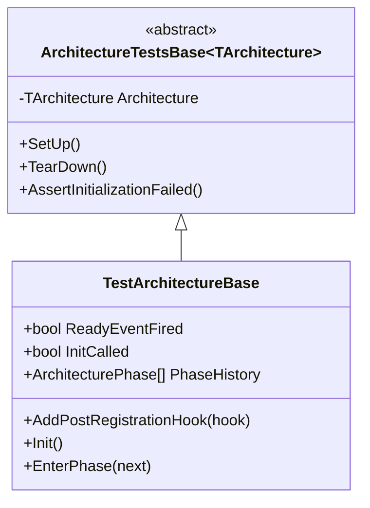
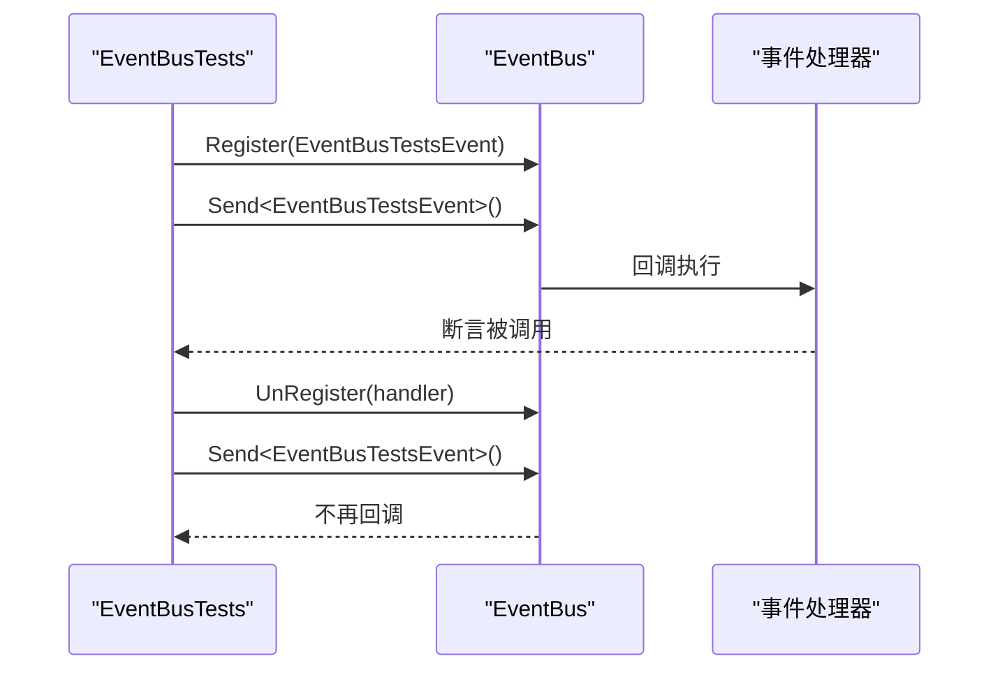
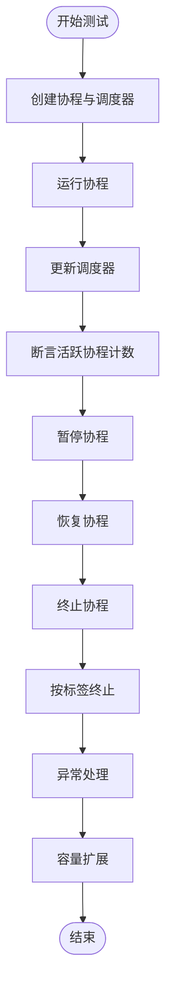
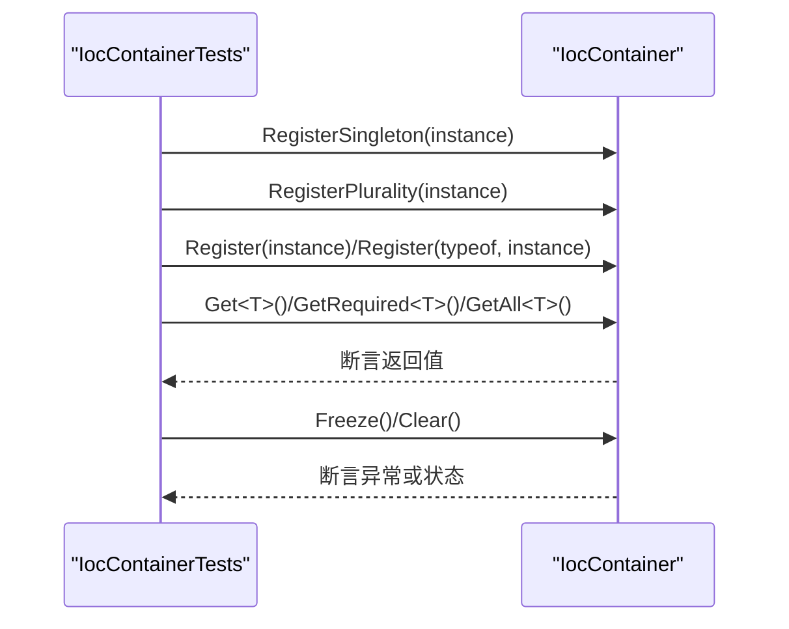
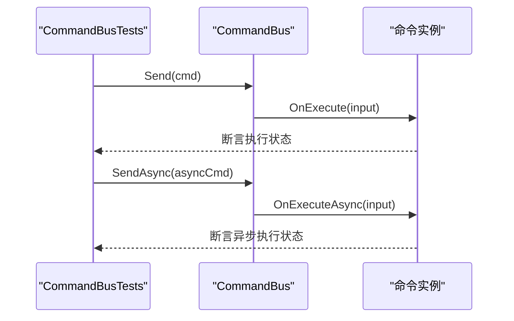
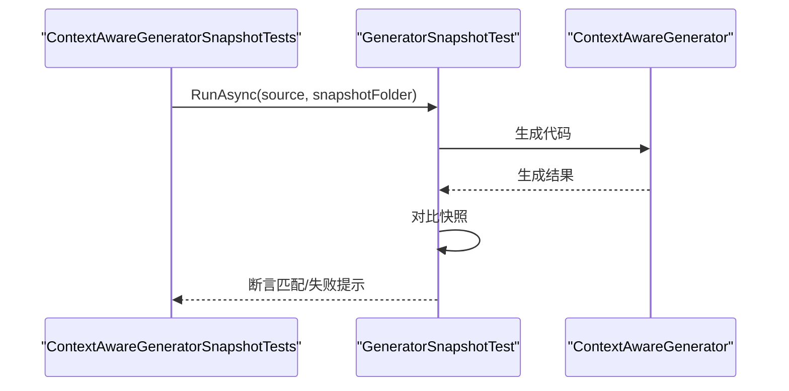
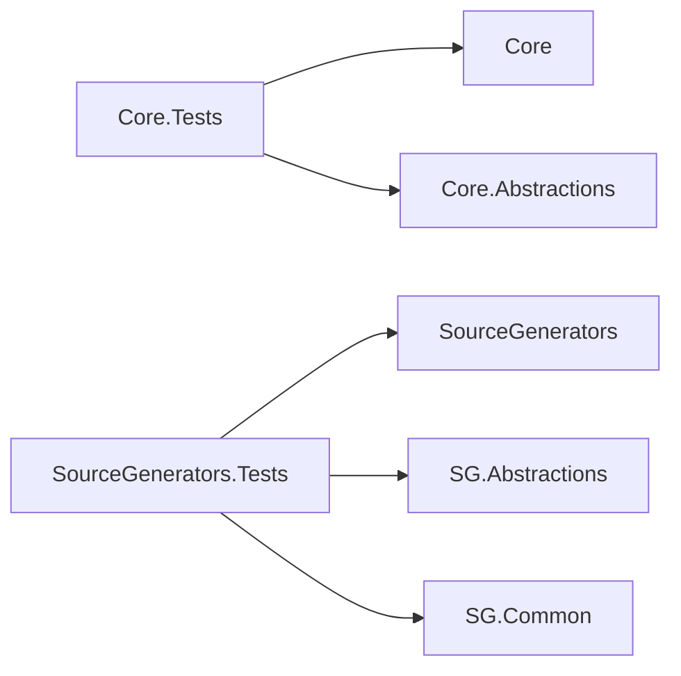

# 测试和质量保证

<cite>
**本文引用的文件**
- [GFramework.Core.Tests.csproj](file://GFramework.Core.Tests/GFramework.Core.Tests.csproj)
- [GFramework.SourceGenerators.Tests.csproj](file://GFramework.SourceGenerators.Tests/GFramework.SourceGenerators.Tests.csproj)
- [TEST_COVERAGE_PLAN.md](file://GFramework.Core.Tests/TEST_COVERAGE_PLAN.md)
- [ArchitectureTestsBase.cs](file://GFramework.Core.Tests/tests/ArchitectureTestsBase.cs)
- [TestArchitectureBase.cs](file://GFramework.Core.Tests/architecture/TestArchitectureBase.cs)
- [ArchitectureConfigurationTests.cs](file://GFramework.Core.Tests/architecture/ArchitectureConfigurationTests.cs)
- [CoroutineSchedulerTests.cs](file://GFramework.Core.Tests/coroutine/CoroutineSchedulerTests.cs)
- [EventBusTests.cs](file://GFramework.Core.Tests/events/EventBusTests.cs)
- [IocContainerTests.cs](file://GFramework.Core.Tests/ioc/IocContainerTests.cs)
- [CommandBusTests.cs](file://GFramework.Core.Tests/command/CommandBusTests.cs)
- [GeneratorSnapshotTest.cs](file://GFramework.SourceGenerators.Tests/core/GeneratorSnapshotTest.cs)
- [ContextAwareGeneratorSnapshotTests.cs](file://GFramework.SourceGenerators.Tests/rule/ContextAwareGeneratorSnapshotTests.cs)
- [EnvironmentTests.cs](file://GFramework.Core.Tests/environment/EnvironmentTests.cs)
- [Directory.Build.props（源生成器公共）](file://GFramework.SourceGenerators.Common/Directory.Build.props)
- [AnalyzerReleases.Unshipped.md（源生成器公共）](file://GFramework.SourceGenerators.Common/AnalyzerReleases.Unshipped.md)
- [Directory.Build.props（核心抽象）](file://GFramework.Core.Abstractions/Directory.Build.props)
- [Directory.Build.props（游戏抽象）](file://GFramework.Game.Abstractions/Directory.Build.props)
- [Directory.Build.props（Godot源生成器抽象）](file://GFramework.Godot.SourceGenerators.Abstractions/Directory.Build.props)
- [Directory.Build.props（源生成器抽象）](file://GFramework.SourceGenerators.Abstractions/Directory.Build.props)
- [godot-integration.md（Godot集成教程）](file://docs/tutorials/godot-integration.md)
</cite>

## 目录
1. [简介](#简介)
2. [项目结构](#项目结构)
3. [核心组件](#核心组件)
4. [架构总览](#架构总览)
5. [详细组件分析](#详细组件分析)
6. [依赖分析](#依赖分析)
7. [性能考虑](#性能考虑)
8. [故障排查指南](#故障排查指南)
9. [结论](#结论)
10. [附录](#附录)

## 简介
本文件面向GFramework项目的测试与质量保证，系统化阐述单元测试框架配置与使用、核心模块测试策略（架构、事件系统、协程调度、依赖注入）、源代码生成器测试方法与验证策略、测试覆盖率计划与质量标准、性能测试实施方案（协程性能、内存使用、并发）、代码质量保障措施（代码审查、静态分析、持续集成）、测试数据与模拟对象最佳实践、测试环境搭建与自动化配置，以及可维护测试代码与测试用例设计原则。

## 项目结构
GFramework采用多项目分层结构，测试项目与核心库分离，便于独立构建与测试：
- GFramework.Core.Tests：核心模块单元测试，覆盖架构、事件、协程、IoC、命令/查询、日志、扩展、环境等。
- GFramework.SourceGenerators.Tests：源代码生成器的快照测试，基于Microsoft.CodeAnalysis.Testing。
- 各模块的Directory.Build.props统一启用静态分析工具与CI构建参数，确保一致的质量基线。

图表来源
- [GFramework.Core.Tests.csproj](file://GFramework.Core.Tests/GFramework.Core.Tests.csproj#L1-L19)
- [GFramework.SourceGenerators.Tests.csproj](file://GFramework.SourceGenerators.Tests/GFramework.SourceGenerators.Tests.csproj#L1-L30)

章节来源
- [GFramework.Core.Tests.csproj](file://GFramework.Core.Tests/GFramework.Core.Tests.csproj#L1-L19)
- [GFramework.SourceGenerators.Tests.csproj](file://GFramework.SourceGenerators.Tests/GFramework.SourceGenerators.Tests.csproj#L1-L30)

## 核心组件
- 单元测试框架：NUnit 4.x，配合NUnit3TestAdapter与Microsoft.NET.Test.Sdk。
- 源代码生成器测试：Microsoft.CodeAnalysis + Microsoft.CodeAnalysis.CSharp.SourceGenerators.Testing。
- 覆盖率工具：建议使用coverlet.collector进行覆盖率收集。
- 静态分析：Meziantou.Analyzer + Meziantou.Polyfill，统一在各模块的Directory.Build.props中配置。

章节来源
- [GFramework.Core.Tests.csproj](file://GFramework.Core.Tests/GFramework.Core.Tests.csproj#L8-L12)
- [GFramework.SourceGenerators.Tests.csproj](file://GFramework.SourceGenerators.Tests/GFramework.SourceGenerators.Tests.csproj#L10-L19)
- [Directory.Build.props（源生成器公共）](file://GFramework.SourceGenerators.Common/Directory.Build.props#L14-L23)
- [Directory.Build.props（核心抽象）](file://GFramework.Core.Abstractions/Directory.Build.props#L14-L23)
- [Directory.Build.props（游戏抽象）](file://GFramework.Game.Abstractions/Directory.Build.props#L14-L23)
- [Directory.Build.props（Godot源生成器抽象）](file://GFramework.Godot.SourceGenerators.Abstractions/Directory.Build.props#L14-L23)
- [Directory.Build.props（源生成器抽象）](file://GFramework.SourceGenerators.Abstractions/Directory.Build.props#L14-L23)

## 架构总览
测试体系围绕“隔离性、可维护性、可扩展性”设计：
- 测试基类统一SetUp/TearDown，确保架构测试的生命周期一致性。
- 模块内测试文件按功能域组织，便于定位与扩展。
- 源代码生成器采用快照对比，确保生成代码稳定。

图表来源
- [GFramework.Core.Tests.csproj](file://GFramework.Core.Tests/GFramework.Core.Tests.csproj#L8-L12)
- [TEST_COVERAGE_PLAN.md](file://GFramework.Core.Tests/TEST_COVERAGE_PLAN.md#L474-L491)

## 详细组件分析

### 架构测试策略
- 测试基类：ArchitectureTestsBase与TestArchitectureBase提供统一的架构生命周期与阶段历史记录能力，确保测试隔离与可重复性。
- 关键断言：通过CurrentPhase与ReadyEventFired验证初始化与阶段切换。
- 异步架构：使用[NonParallelizable]避免并发干扰，确保异步初始化顺序可控。

图表来源
- [ArchitectureTestsBase.cs](file://GFramework.Core.Tests/tests/ArchitectureTestsBase.cs#L11-L61)
- [TestArchitectureBase.cs](file://GFramework.Core.Tests/architecture/TestArchitectureBase.cs#L10-L58)

章节来源
- [ArchitectureTestsBase.cs](file://GFramework.Core.Tests/tests/ArchitectureTestsBase.cs#L11-L61)
- [TestArchitectureBase.cs](file://GFramework.Core.Tests/architecture/TestArchitectureBase.cs#L10-L58)

### 事件系统测试
- EventBus：验证注册、注销、发送事件的多处理器调用行为；事件类型隔离。
- 易用性：通过专用测试事件类简化断言。

图表来源
- [EventBusTests.cs](file://GFramework.Core.Tests/events/EventBusTests.cs#L10-L78)

章节来源
- [EventBusTests.cs](file://GFramework.Core.Tests/events/EventBusTests.cs#L10-L78)

### 协程调度测试
- 覆盖范围：创建/销毁、暂停/恢复、等待机制、标签管理、异常处理、容量扩展、活跃协程计数、时间源集成。
- 辅助类：TestTimeSource提供可控时间推进，确保可预测的更新序列。

图表来源
- [CoroutineSchedulerTests.cs](file://GFramework.Core.Tests/coroutine/CoroutineSchedulerTests.cs#L24-L467)

章节来源
- [CoroutineSchedulerTests.cs](file://GFramework.Core.Tests/coroutine/CoroutineSchedulerTests.cs#L24-L467)

### 依赖注入测试（IoC）
- 覆盖范围：单例注册、多样性注册、泛型/类型注册、获取实例（含必需）、排序获取、包含关系、清除、冻结保护、系统实例注册。
- 注意：通过反射初始化内部日志器字段以满足IocContainer的日志依赖。

图表来源
- [IocContainerTests.cs](file://GFramework.Core.Tests/ioc/IocContainerTests.cs#L13-L330)

章节来源
- [IocContainerTests.cs](file://GFramework.Core.Tests/ioc/IocContainerTests.cs#L13-L330)

### 命令系统测试（含异步）
- 同步命令：验证Send与Send（带返回值）的行为，以及null命令的异常处理。
- 异步命令：验证SendAsync与SendAsync（带返回值）的行为，以及null命令的异常处理。
- 未来补充：根据覆盖率计划，需补充AbstractAsyncCommand与CommandBus.SendAsync的异步测试。

图表来源
- [CommandBusTests.cs](file://GFramework.Core.Tests/command/CommandBusTests.cs#L20-L124)

章节来源
- [CommandBusTests.cs](file://GFramework.Core.Tests/command/CommandBusTests.cs#L20-L124)
- [TEST_COVERAGE_PLAN.md](file://GFramework.Core.Tests/TEST_COVERAGE_PLAN.md#L166-L300)

### 源代码生成器测试（快照）
- 快照测试：GeneratorSnapshotTest提供统一的快照生成与比对流程，首次运行生成快照，后续运行对比差异。
- 示例：ContextAwareGeneratorSnapshotTests验证带有ContextAware特性的类生成的上下文感知代码。

图表来源
- [GeneratorSnapshotTest.cs](file://GFramework.SourceGenerators.Tests/core/GeneratorSnapshotTest.cs#L11-L72)
- [ContextAwareGeneratorSnapshotTests.cs](file://GFramework.SourceGenerators.Tests/rule/ContextAwareGeneratorSnapshotTests.cs#L12-L84)

章节来源
- [GeneratorSnapshotTest.cs](file://GFramework.SourceGenerators.Tests/core/GeneratorSnapshotTest.cs#L11-L72)
- [ContextAwareGeneratorSnapshotTests.cs](file://GFramework.SourceGenerators.Tests/rule/ContextAwareGeneratorSnapshotTests.cs#L12-L84)

### 环境系统测试
- DefaultEnvironment与EnvironmentBase：验证名称、初始化、键值注册与获取。
- 接口契约：通过IEnvironment.Register验证接口实现的一致性。

章节来源
- [EnvironmentTests.cs](file://GFramework.Core.Tests/environment/EnvironmentTests.cs#L11-L215)

## 依赖分析
- 测试项目依赖核心库与抽象层，确保测试覆盖真实实现。
- 源生成器测试依赖Microsoft.CodeAnalysis与SourceGenerators.Testing，确保生成器行为可验证。
- 静态分析工具在各模块统一启用，形成一致的质量门槛。

图表来源
- [GFramework.Core.Tests.csproj](file://GFramework.Core.Tests/GFramework.Core.Tests.csproj#L14-L16)
- [GFramework.SourceGenerators.Tests.csproj](file://GFramework.SourceGenerators.Tests/GFramework.SourceGenerators.Tests.csproj#L21-L23)

章节来源
- [GFramework.Core.Tests.csproj](file://GFramework.Core.Tests/GFramework.Core.Tests.csproj#L14-L16)
- [GFramework.SourceGenerators.Tests.csproj](file://GFramework.SourceGenerators.Tests/GFramework.SourceGenerators.Tests.csproj#L21-L23)

## 性能考虑
- 协程性能：通过可控时间源推进，验证调度器在高并发协程下的吞吐与延迟。
- 内存使用：关注协程句柄、等待指令与调度器容量扩展对GC的影响，避免频繁分配。
- 并发测试：使用[NonParallelizable]确保架构相关测试的串行执行，避免竞态条件。
- Godot集成性能基准：参考教程中的性能对比示例，验证扩展方法与原生方法的性能差异。

章节来源
- [CoroutineSchedulerTests.cs](file://GFramework.Core.Tests/coroutine/CoroutineSchedulerTests.cs#L24-L467)
- [godot-integration.md（Godot集成教程）](file://docs/tutorials/godot-integration.md#L1277-L1318)

## 故障排查指南
- 测试隔离问题：确认每个测试类使用独立的[SetUp]/[TearDown]，必要时使用[NonParallelizable]。
- 异步测试死锁：避免使用Result/Wait，统一使用async/await与Assert.ThrowsAsync<T>。
- 覆盖率缺失：根据覆盖率计划补充异步命令/查询与工具基类的直接测试。
- 源生成器快照不匹配：首次运行会生成快照，后续运行对比差异，确保生成器行为稳定。

章节来源
- [TEST_COVERAGE_PLAN.md](file://GFramework.Core.Tests/TEST_COVERAGE_PLAN.md#L426-L493)
- [GeneratorSnapshotTest.cs](file://GFramework.SourceGenerators.Tests/core/GeneratorSnapshotTest.cs#L11-L72)

## 结论
GFramework的测试与质量保证体系以NUnit为核心，结合架构基类、模块化测试与源生成器快照测试，形成了覆盖全面、可维护性强的测试框架。通过覆盖率计划与静态分析工具，持续提升代码质量与稳定性；通过性能测试与Godot集成示例，确保在实际场景中的高效运行。

## 附录

### 测试覆盖率计划与质量标准
- 目标：Core模块文件覆盖率提升至95%+，代码行覆盖率90%+。
- 优先级：高优先级补全异步命令/查询与工具基类测试；中优先级补充常量验证测试。
- 质量标准：测试命名规范、注释规范、异步测试最佳实践、覆盖率工具配置。

章节来源
- [TEST_COVERAGE_PLAN.md](file://GFramework.Core.Tests/TEST_COVERAGE_PLAN.md#L1-L582)

### 测试环境搭建与自动化配置
- 测试框架：NUnit 4.x + NUnit3TestAdapter + Microsoft.NET.Test.Sdk。
- 覆盖率：建议添加coverlet.collector并使用dotnet test --collect:"XPlat Code Coverage"。
- 静态分析：各模块启用Meziantou.Analyzer与Meziantou.Polyfill，统一LangVersion与CI构建参数。

章节来源
- [GFramework.Core.Tests.csproj](file://GFramework.Core.Tests/GFramework.Core.Tests.csproj#L8-L12)
- [GFramework.SourceGenerators.Tests.csproj](file://GFramework.SourceGenerators.Tests/GFramework.SourceGenerators.Tests.csproj#L10-L19)
- [Directory.Build.props（源生成器公共）](file://GFramework.SourceGenerators.Common/Directory.Build.props#L14-L23)

### 可维护测试代码与用例设计原则
- 命名规范：测试类{Component}Tests；测试方法{Scenario}_Should_{ExpectedOutcome}；辅助类Test{Component}V{Version}。
- 异步测试：使用async Task，避免Result/Wait；使用Assert.ThrowsAsync<T>测试异常。
- 隔离性：[SetUp]/[TearDown]确保状态清理；必要时[NonParallelizable]。
- 文档注释：类与方法使用标准C#文档注释，复杂逻辑使用行内注释说明。

章节来源
- [TEST_COVERAGE_PLAN.md](file://GFramework.Core.Tests/TEST_COVERAGE_PLAN.md#L426-L493)