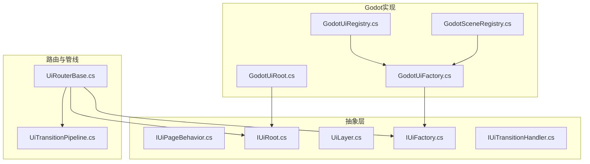
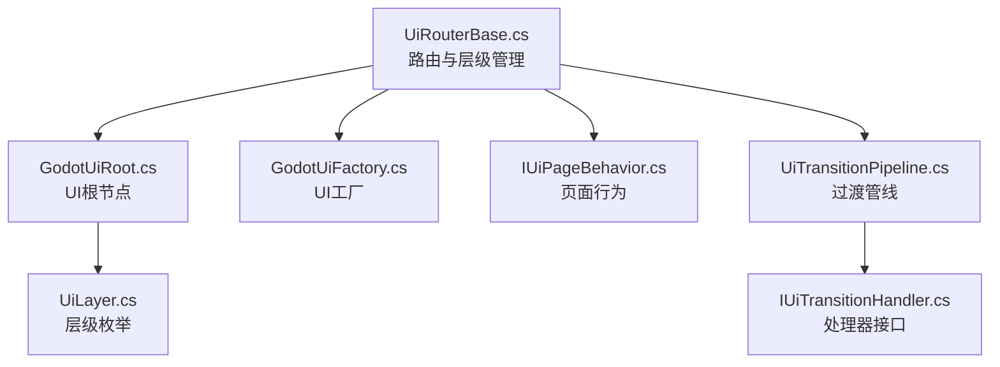
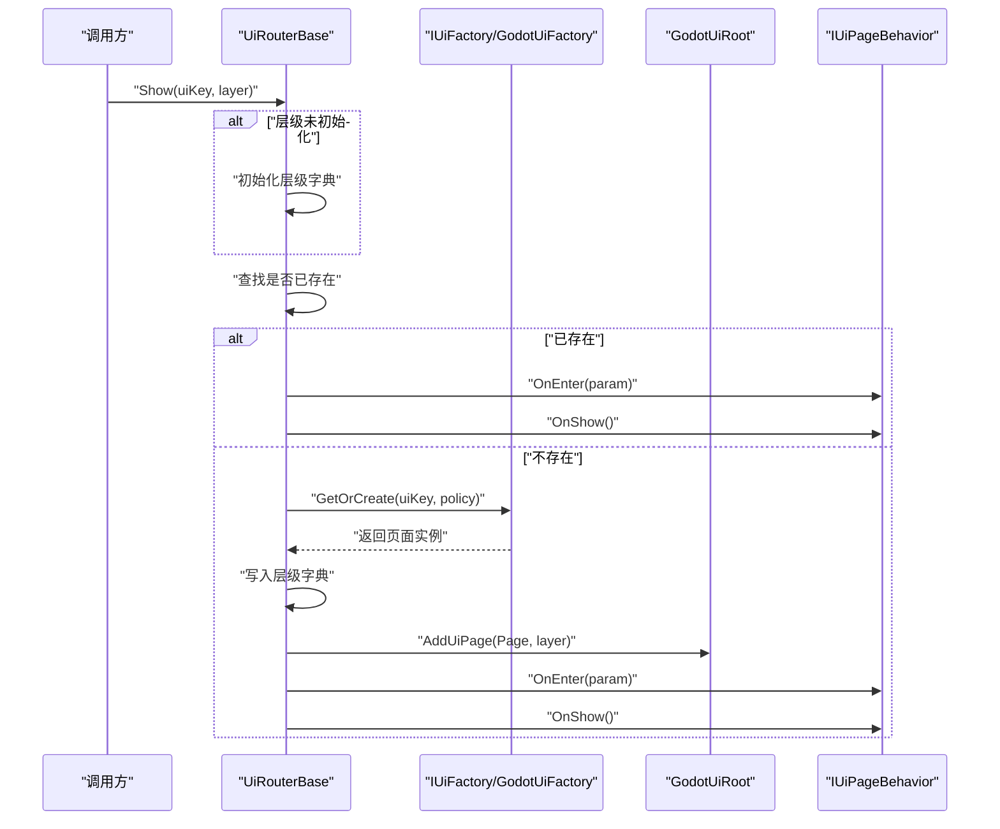
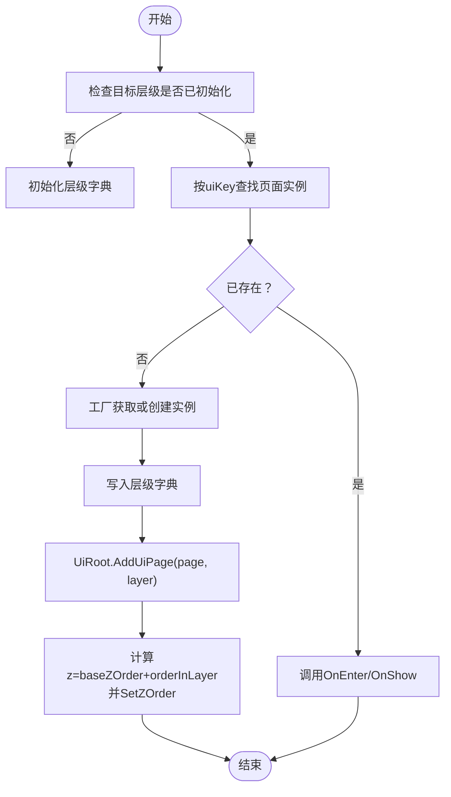
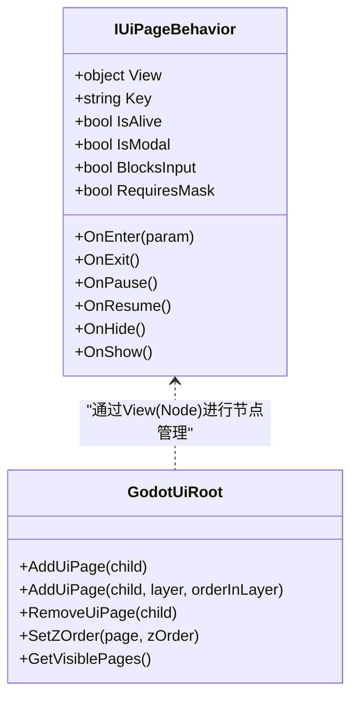
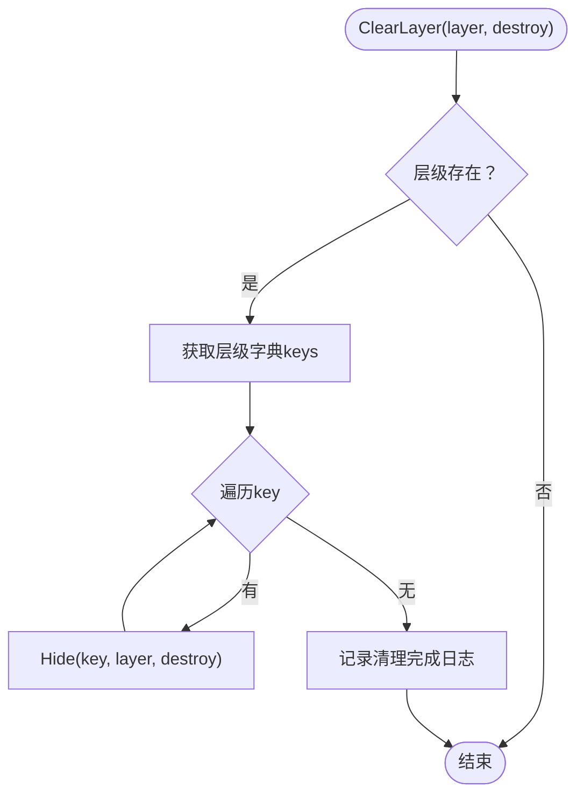
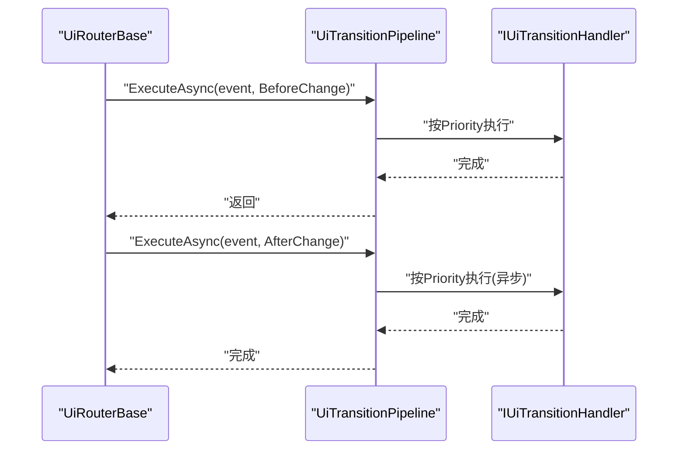
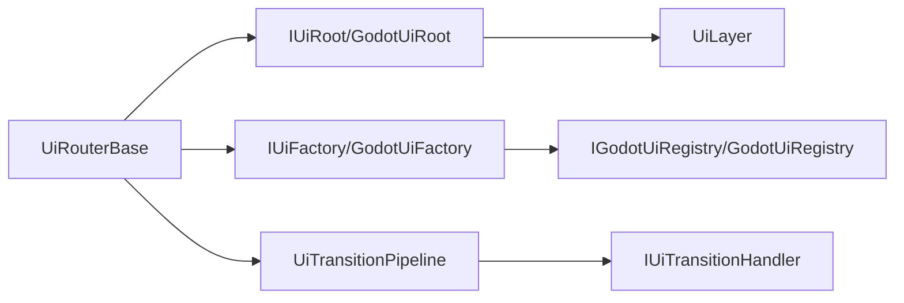

# UI层级管理

<cite>
**本文引用的文件**
- [UiRouterBase.cs](file://GFramework.Game/ui/UiRouterBase.cs)
- [GodotUiRoot.cs](file://GFramework.Godot/ui/GodotUiRoot.cs)
- [IUiRoot.cs](file://GFramework.Game.Abstractions/ui/IUiRoot.cs)
- [IUiPageBehavior.cs](file://GFramework.Game.Abstractions/ui/IUiPageBehavior.cs)
- [UiLayer.cs](file://GFramework.Game.Abstractions/enums/UiLayer.cs)
- [IUiFactory.cs](file://GFramework.Game.Abstractions/ui/IUiFactory.cs)
- [GodotUiFactory.cs](file://GFramework.Godot/ui/GodotUiFactory.cs)
- [UiTransitionPipeline.cs](file://GFramework.Game/ui/UiTransitionPipeline.cs)
- [IUiTransitionHandler.cs](file://GFramework.Game.Abstractions/ui/IUiTransitionHandler.cs)
- [GodotUiRegistry.cs](file://GFramework.Godot/ui/GodotUiRegistry.cs)
- [IGodotUiRegistry.cs](file://GFramework.Godot/ui/IGodotUiRegistry.cs)
- [GodotSceneRegistry.cs](file://GFramework.Godot/scene/GodotSceneRegistry.cs)
- [IGodotSceneRegistry.cs](file://GFramework.Godot/scene/IGodotSceneRegistry.cs)
</cite>

## 目录
1. [引言](#引言)
2. [项目结构](#项目结构)
3. [核心组件](#核心组件)
4. [架构总览](#架构总览)
5. [详细组件分析](#详细组件分析)
6. [依赖关系分析](#依赖关系分析)
7. [性能考量](#性能考量)
8. [故障排查指南](#故障排查指南)
9. [结论](#结论)
10. [附录](#附录)

## 引言
本文件面向UI层级管理系统，聚焦非栈层级（Overlay、Modal、Toast等浮层）的显示与隐藏控制，系统性阐述Show/Hide方法的实现原理、UiLayer层级类型与Z-order管理、层级字典的数据结构与页面实例存储机制、层级清理与批量操作（ClearLayer）的实现与销毁策略，并给出最佳实践、冲突处理与优先级管理建议。文中所有技术细节均来自仓库源码，配合可视化图示帮助读者快速理解与落地。

## 项目结构
围绕UI层级管理的关键文件分布于以下模块：
- 抽象层：定义UI页面行为、根节点接口、层级枚举、工厂接口等
- 平台实现：Godot平台的UI根节点与UI工厂实现
- 路由与管线：UI路由基类与过渡处理管线
- 场景注册：Godot场景注册表与UI注册表

图表来源
- [UiRouterBase.cs](file://GFramework.Game/ui/UiRouterBase.cs#L1-L100)
- [GodotUiRoot.cs](file://GFramework.Godot/ui/GodotUiRoot.cs#L1-L60)
- [IUiRoot.cs](file://GFramework.Game.Abstractions/ui/IUiRoot.cs#L1-L43)
- [IUiPageBehavior.cs](file://GFramework.Game.Abstractions/ui/IUiPageBehavior.cs#L1-L72)
- [UiLayer.cs](file://GFramework.Game.Abstractions/enums/UiLayer.cs#L1-L34)
- [IUiFactory.cs](file://GFramework.Game.Abstractions/ui/IUiFactory.cs#L1-L45)
- [GodotUiFactory.cs](file://GFramework.Godot/ui/GodotUiFactory.cs#L1-L120)
- [UiTransitionPipeline.cs](file://GFramework.Game/ui/UiTransitionPipeline.cs#L1-L119)
- [GodotUiRegistry.cs](file://GFramework.Godot/ui/GodotUiRegistry.cs#L1-L12)
- [GodotSceneRegistry.cs](file://GFramework.Godot/scene/GodotSceneRegistry.cs#L1-L12)

章节来源
- [UiRouterBase.cs](file://GFramework.Game/ui/UiRouterBase.cs#L1-L100)
- [GodotUiRoot.cs](file://GFramework.Godot/ui/GodotUiRoot.cs#L1-L60)
- [IUiRoot.cs](file://GFramework.Game.Abstractions/ui/IUiRoot.cs#L1-L43)
- [IUiPageBehavior.cs](file://GFramework.Game.Abstractions/ui/IUiPageBehavior.cs#L1-L72)
- [UiLayer.cs](file://GFramework.Game.Abstractions/enums/UiLayer.cs#L1-L34)
- [IUiFactory.cs](file://GFramework.Game.Abstractions/ui/IUiFactory.cs#L1-L45)
- [GodotUiFactory.cs](file://GFramework.Godot/ui/GodotUiFactory.cs#L1-L120)
- [UiTransitionPipeline.cs](file://GFramework.Game/ui/UiTransitionPipeline.cs#L1-L119)
- [GodotUiRegistry.cs](file://GFramework.Godot/ui/GodotUiRegistry.cs#L1-L12)
- [GodotSceneRegistry.cs](file://GFramework.Godot/scene/GodotSceneRegistry.cs#L1-L12)

## 核心组件
- UI路由基类（UiRouterBase）：提供Page栈管理与非栈层级（Overlay/Modal/Toast/Topmost）的Show/Hide/ClearLayer等能力；通过IUiRoot与IUiFactory协作完成页面生命周期与渲染顺序控制。
- UI根节点（GodotUiRoot）：Godot平台实现，负责将页面节点加入容器、设置Z序（ZIndex），并维护页面节点映射。
- UI页面行为（IUiPageBehavior）：统一的页面生命周期接口（OnEnter/OnShow/OnHide/OnExit/OnPause/OnResume）与交互阻断、遮罩需求等属性。
- 层级枚举（UiLayer）：定义Page、Overlay、Modal、Toast、Topmost五种层级，用于Z-order分层与渲染优先级控制。
- UI工厂（IUiFactory/GodotUiFactory）：负责UI实例的创建、复用、回收与缓存清理，支持实例策略（AlwaysCreate/Reuse/Pooled）。
- 过渡处理管线（UiTransitionPipeline/IUiTransitionHandler）：提供BeforeChange/AfterChange阶段的扩展点，支持按优先级与阶段过滤的处理器链路。

章节来源
- [UiRouterBase.cs](file://GFramework.Game/ui/UiRouterBase.cs#L476-L605)
- [GodotUiRoot.cs](file://GFramework.Godot/ui/GodotUiRoot.cs#L11-L141)
- [IUiPageBehavior.cs](file://GFramework.Game.Abstractions/ui/IUiPageBehavior.cs#L1-L72)
- [UiLayer.cs](file://GFramework.Game.Abstractions/enums/UiLayer.cs#L1-L34)
- [IUiFactory.cs](file://GFramework.Game.Abstractions/ui/IUiFactory.cs#L1-L45)
- [GodotUiFactory.cs](file://GFramework.Godot/ui/GodotUiFactory.cs#L1-L253)
- [UiTransitionPipeline.cs](file://GFramework.Game/ui/UiTransitionPipeline.cs#L1-L119)
- [IUiTransitionHandler.cs](file://GFramework.Game.Abstractions/ui/IUiTransitionHandler.cs#L1-L39)

## 架构总览
下图展示了UI层级管理的整体架构：路由层协调工厂与根节点，根节点负责渲染Z序，管线层提供过渡扩展点。

图表来源
- [UiRouterBase.cs](file://GFramework.Game/ui/UiRouterBase.cs#L1-L100)
- [GodotUiRoot.cs](file://GFramework.Godot/ui/GodotUiRoot.cs#L1-L60)
- [IUiRoot.cs](file://GFramework.Game.Abstractions/ui/IUiRoot.cs#L1-L43)
- [IUiPageBehavior.cs](file://GFramework.Game.Abstractions/ui/IUiPageBehavior.cs#L1-L72)
- [UiLayer.cs](file://GFramework.Game.Abstractions/enums/UiLayer.cs#L1-L34)
- [IUiFactory.cs](file://GFramework.Game.Abstractions/ui/IUiFactory.cs#L1-L45)
- [GodotUiFactory.cs](file://GFramework.Godot/ui/GodotUiFactory.cs#L1-L120)
- [UiTransitionPipeline.cs](file://GFramework.Game/ui/UiTransitionPipeline.cs#L1-L119)
- [IUiTransitionHandler.cs](file://GFramework.Game.Abstractions/ui/IUiTransitionHandler.cs#L1-L39)

## 详细组件分析

### Show/Hide方法与层级字典
- Show（基于uiKey）：检查目标层级是否存在，若不存在则通过工厂获取或创建实例，写入层级字典，调用UiRoot.AddUiPage(layer)设置Z序并触发OnEnter/OnShow。
- Show（基于实例）：直接写入层级字典并调用UiRoot.AddUiPage(layer)，随后触发OnShow。
- Hide：调用OnExit/OnHide后，依据destroy参数决定直接移除（销毁）或回收到工厂缓存池，同时从层级字典移除。
- ClearLayer：遍历目标层级字典，逐项调用Hide，实现批量隐藏与回收/销毁。

图表来源
- [UiRouterBase.cs](file://GFramework.Game/ui/UiRouterBase.cs#L481-L518)
- [IUiFactory.cs](file://GFramework.Game.Abstractions/ui/IUiFactory.cs#L18-L18)
- [GodotUiFactory.cs](file://GFramework.Godot/ui/GodotUiFactory.cs#L120-L201)
- [GodotUiRoot.cs](file://GFramework.Godot/ui/GodotUiRoot.cs#L80-L89)

章节来源
- [UiRouterBase.cs](file://GFramework.Game/ui/UiRouterBase.cs#L481-L518)
- [UiRouterBase.cs](file://GFramework.Game/ui/UiRouterBase.cs#L523-L538)
- [UiRouterBase.cs](file://GFramework.Game/ui/UiRouterBase.cs#L543-L567)
- [UiRouterBase.cs](file://GFramework.Game/ui/UiRouterBase.cs#L572-L584)

### Z-order与层级字典数据结构
- 层级字典：_layers = Dictionary<UiLayer, Dictionary<string, IUiPageBehavior>>
  - 外层键为UiLayer，内层键为页面uiKey，值为页面实例
  - 作用：按层级组织非栈页面，支持快速查询、更新与批量清理
- Z-order映射：_layerZOrderMap = IReadOnlyDictionary<UiLayer, int>
  - 默认映射：Page=0、Overlay=100、Modal=200、Toast=300、Topmost=400
  - 计算规则：z = baseZOrder(layer) + orderInLayer
  - 设置方式：GodotUiRoot.SetZOrder通过CanvasItem.ZIndex生效

图表来源
- [UiRouterBase.cs](file://GFramework.Game/ui/UiRouterBase.cs#L492-L512)
- [GodotUiRoot.cs](file://GFramework.Godot/ui/GodotUiRoot.cs#L137-L140)
- [GodotUiRoot.cs](file://GFramework.Godot/ui/GodotUiRoot.cs#L109-L118)

章节来源
- [UiRouterBase.cs](file://GFramework.Game/ui/UiRouterBase.cs#L25-L25)
- [UiRouterBase.cs](file://GFramework.Game/ui/UiRouterBase.cs#L492-L512)
- [GodotUiRoot.cs](file://GFramework.Godot/ui/GodotUiRoot.cs#L34-L42)
- [GodotUiRoot.cs](file://GFramework.Godot/ui/GodotUiRoot.cs#L137-L140)
- [GodotUiRoot.cs](file://GFramework.Godot/ui/GodotUiRoot.cs#L109-L118)

### 页面生命周期与交互阻断
- 生命周期：OnEnter → OnShow（显示）、OnHide（隐藏但不销毁）、OnExit（完全退出）、OnPause/OnResume（栈式页面）
- 交互阻断：IsModal、BlocksInput、RequiresMask等属性用于控制遮罩与输入拦截
- 与根节点协作：UiRoot.AddUiPage/RemoveUiPage负责节点挂载与卸载，SetZOrder负责渲染顺序

图表来源
- [IUiPageBehavior.cs](file://GFramework.Game.Abstractions/ui/IUiPageBehavior.cs#L1-L72)
- [GodotUiRoot.cs](file://GFramework.Godot/ui/GodotUiRoot.cs#L59-L126)

章节来源
- [IUiPageBehavior.cs](file://GFramework.Game.Abstractions/ui/IUiPageBehavior.cs#L26-L71)
- [GodotUiRoot.cs](file://GFramework.Godot/ui/GodotUiRoot.cs#L59-L126)

### 清理与批量操作（ClearLayer）
- 清理流程：遍历目标层级字典的keys，逐个调用Hide(key, layer, destroy)
- 销毁策略：destroy=true时直接移除并销毁；destroy=false时回收至工厂缓存池
- 日志记录：每次Hide/Clear均输出调试日志，便于追踪

图表来源
- [UiRouterBase.cs](file://GFramework.Game/ui/UiRouterBase.cs#L572-L584)
- [UiRouterBase.cs](file://GFramework.Game/ui/UiRouterBase.cs#L543-L567)

章节来源
- [UiRouterBase.cs](file://GFramework.Game/ui/UiRouterBase.cs#L572-L584)
- [UiRouterBase.cs](file://GFramework.Game/ui/UiRouterBase.cs#L543-L567)

### 过渡处理与优先级管理
- 管线执行：BeforeChange阶段阻塞执行，AfterChange阶段异步执行
- 处理器注册：按Priority升序执行；可通过Phases与ShouldHandle过滤
- 路由守卫：Enter/Leave守卫可中断或允许切换，支持CanInterrupt

图表来源
- [UiRouterBase.cs](file://GFramework.Game/ui/UiRouterBase.cs#L339-L364)
- [UiTransitionPipeline.cs](file://GFramework.Game/ui/UiTransitionPipeline.cs#L63-L101)
- [IUiTransitionHandler.cs](file://GFramework.Game.Abstractions/ui/IUiTransitionHandler.cs#L10-L39)

章节来源
- [UiRouterBase.cs](file://GFramework.Game/ui/UiRouterBase.cs#L339-L364)
- [UiTransitionPipeline.cs](file://GFramework.Game/ui/UiTransitionPipeline.cs#L63-L101)
- [IUiTransitionHandler.cs](file://GFramework.Game.Abstractions/ui/IUiTransitionHandler.cs#L10-L39)

## 依赖关系分析
- 路由对根节点与工厂的依赖：UiRouterBase通过IUiRoot与IUiFactory协作，解耦平台与实例管理
- 工厂对注册表的依赖：GodotUiFactory通过IGodotUiRegistry/GodotSceneRegistry加载场景资源
- 根节点对层级映射的依赖：GodotUiRoot根据UiLayer映射设置Z序
- 管线对处理器的依赖：UiTransitionPipeline维护处理器列表并按优先级执行

图表来源
- [UiRouterBase.cs](file://GFramework.Game/ui/UiRouterBase.cs#L40-L42)
- [GodotUiRoot.cs](file://GFramework.Godot/ui/GodotUiRoot.cs#L11-L42)
- [IUiFactory.cs](file://GFramework.Game.Abstractions/ui/IUiFactory.cs#L10-L10)
- [GodotUiFactory.cs](file://GFramework.Godot/ui/GodotUiFactory.cs#L32-L32)
- [GodotUiRegistry.cs](file://GFramework.Godot/ui/GodotUiRegistry.cs#L11-L11)
- [IGodotUiRegistry.cs](file://GFramework.Godot/ui/IGodotUiRegistry.cs#L1-L10)
- [GodotSceneRegistry.cs](file://GFramework.Godot/scene/GodotSceneRegistry.cs#L11-L11)
- [IGodotSceneRegistry.cs](file://GFramework.Godot/scene/IGodotSceneRegistry.cs#L1-L9)

章节来源
- [UiRouterBase.cs](file://GFramework.Game/ui/UiRouterBase.cs#L40-L42)
- [GodotUiRoot.cs](file://GFramework.Godot/ui/GodotUiRoot.cs#L11-L42)
- [IUiFactory.cs](file://GFramework.Game.Abstractions/ui/IUiFactory.cs#L10-L10)
- [GodotUiFactory.cs](file://GFramework.Godot/ui/GodotUiFactory.cs#L32-L32)
- [GodotUiRegistry.cs](file://GFramework.Godot/ui/GodotUiRegistry.cs#L11-L11)
- [IGodotUiRegistry.cs](file://GFramework.Godot/ui/IGodotUiRegistry.cs#L1-L10)
- [GodotSceneRegistry.cs](file://GFramework.Godot/scene/GodotSceneRegistry.cs#L11-L11)
- [IGodotSceneRegistry.cs](file://GFramework.Godot/scene/IGodotSceneRegistry.cs#L1-L9)

## 性能考量
- 实例复用与缓存：通过IUiFactory的Reuse/Pooled策略减少频繁创建/销毁开销；GodotUiFactory提供缓存队列与命中率统计
- 批量清理：ClearLayer按需销毁或回收，避免长时间持有无用实例
- Z序计算：层级映射为常量时间查询，SetZOrder直接设置CanvasItem.ZIndex，开销极低
- 过渡管线：BeforeChange同步执行，AfterChange异步执行，降低主线程阻塞

章节来源
- [IUiFactory.cs](file://GFramework.Game.Abstractions/ui/IUiFactory.cs#L18-L45)
- [GodotUiFactory.cs](file://GFramework.Godot/ui/GodotUiFactory.cs#L37-L241)
- [UiRouterBase.cs](file://GFramework.Game/ui/UiRouterBase.cs#L572-L584)
- [GodotUiRoot.cs](file://GFramework.Godot/ui/GodotUiRoot.cs#L109-L118)
- [UiRouterBase.cs](file://GFramework.Game/ui/UiRouterBase.cs#L349-L364)

## 故障排查指南
- 页面未显示
  - 检查是否在Page层级使用Show（应使用Push）
  - 检查UiRoot是否已初始化（_uiContainer非空）
  - 检查层级字典是否正确写入
- 页面遮挡或顺序异常
  - 检查UiLayer映射与orderInLayer设置
  - 确认CanvasItem.ZIndex是否被其他逻辑覆盖
- 页面无法隐藏或重复显示
  - 检查Hide调用是否传入正确的uiKey与layer
  - 确认destroy参数与工厂回收逻辑
- 性能问题
  - 关注工厂缓存命中率与缓存大小
  - 避免频繁ClearLayer导致大量销毁/创建

章节来源
- [UiRouterBase.cs](file://GFramework.Game/ui/UiRouterBase.cs#L487-L490)
- [GodotUiRoot.cs](file://GFramework.Godot/ui/GodotUiRoot.cs#L45-L54)
- [GodotUiRoot.cs](file://GFramework.Godot/ui/GodotUiRoot.cs#L137-L140)
- [UiRouterBase.cs](file://GFramework.Game/ui/UiRouterBase.cs#L543-L567)
- [GodotUiFactory.cs](file://GFramework.Godot/ui/GodotUiFactory.cs#L21-L28)

## 结论
本系统通过清晰的分层设计与接口抽象，实现了非栈层级UI的灵活管理：UiRouterBase负责业务编排与生命周期调度，GodotUiRoot负责渲染顺序与节点管理，IUiFactory负责实例化与缓存回收，UiTransitionPipeline提供扩展点与优先级控制。借助层级字典与Z-order映射，系统能够稳定地支持Overlay、Modal、Toast等浮层的并发显示与有序管理。

## 附录

### 最佳实践
- 层级选择原则
  - Page：使用Push/Pop管理页面栈，适合主流程导航
  - Overlay：用于覆盖层、菜单等，不阻断下层交互
  - Modal：模态窗口，阻断下层交互并可带遮罩
  - Toast：轻量提示，短暂出现即消失
  - Topmost：系统级弹窗或全屏加载
- 性能优化
  - 优先使用Reuse/Pooled策略，减少GC压力
  - 对高频出现的浮层进行预加载（Preload/PreloadBatch）
  - 合理设置orderInLayer，避免频繁调整Z序
- 内存管理
  - ClearLayer时根据场景选择destroy=false（回收）或true（销毁）
  - 定期清理缓存（ClearCache/ClearAllCache），防止内存泄漏
- 冲突处理与优先级
  - 使用UiTransitionPipeline与IUiTransitionHandler实现前置校验与后置补偿
  - 通过路由守卫（Enter/Leave）控制切换时机与条件

### 典型场景与实现要点
- 显示一个Overlay浮层
  - 调用Show(uiKey, UiLayer.Overlay, param, UiInstancePolicy.Reuse)
  - 若需同层多实例，使用不同orderInLayer微调Z序
- 显示一个Modal模态框
  - 调用Show(uiKey, UiLayer.Modal)
  - 页面行为需设置IsModal/BlocksInput/RequiresMask
- 显示一个Toast提示
  - 调用Show(uiKey, UiLayer.Toast)
  - 设计短生命周期，完成后立即Hide或等待自动清理
- 批量清理某一层级
  - 调用ClearLayer(UiLayer.Overlay/Modal/Toast, destroy=false)
  - 或在退出场景时统一destroy=true彻底释放

章节来源
- [UiRouterBase.cs](file://GFramework.Game/ui/UiRouterBase.cs#L481-L518)
- [UiRouterBase.cs](file://GFramework.Game/ui/UiRouterBase.cs#L523-L538)
- [UiRouterBase.cs](file://GFramework.Game/ui/UiRouterBase.cs#L572-L584)
- [IUiPageBehavior.cs](file://GFramework.Game.Abstractions/ui/IUiPageBehavior.cs#L58-L71)
- [IUiFactory.cs](file://GFramework.Game.Abstractions/ui/IUiFactory.cs#L26-L45)
- [GodotUiFactory.cs](file://GFramework.Godot/ui/GodotUiFactory.cs#L205-L233)