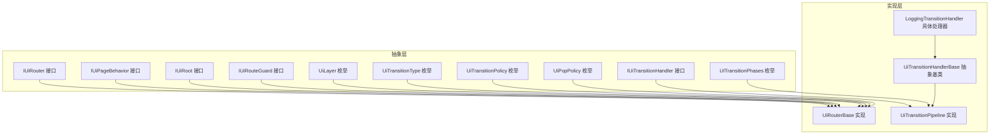
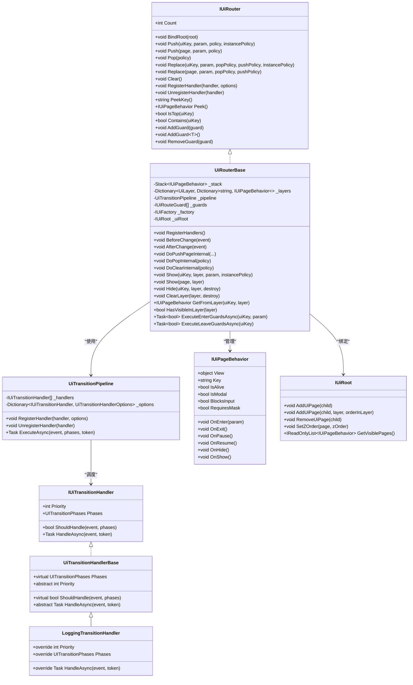
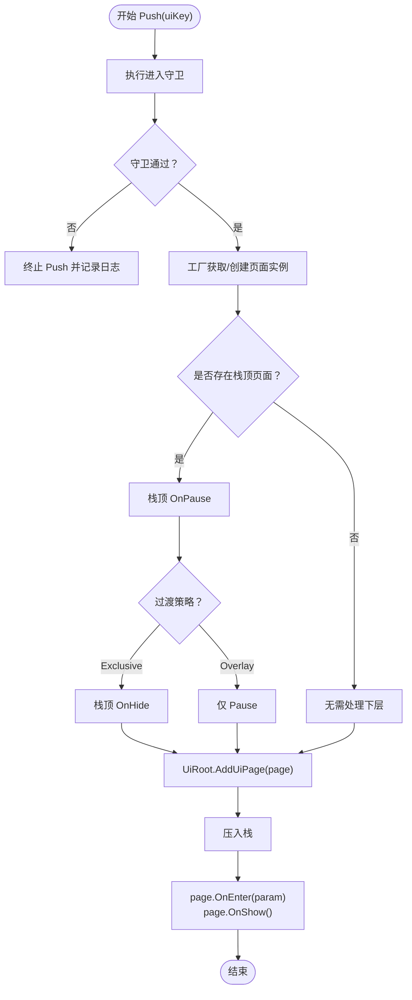
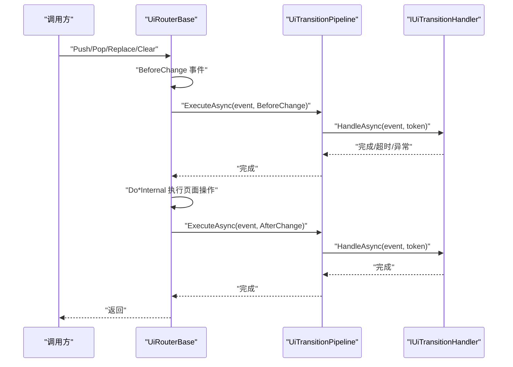
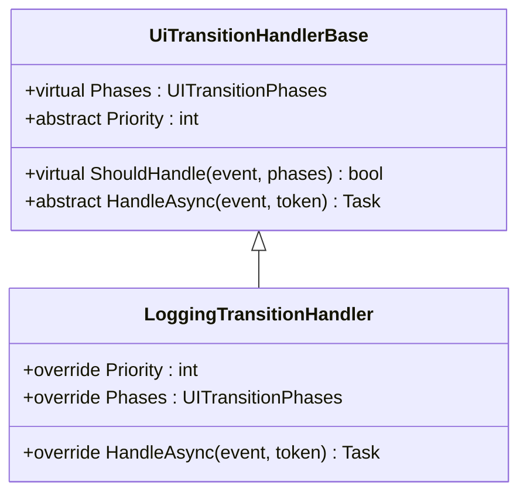
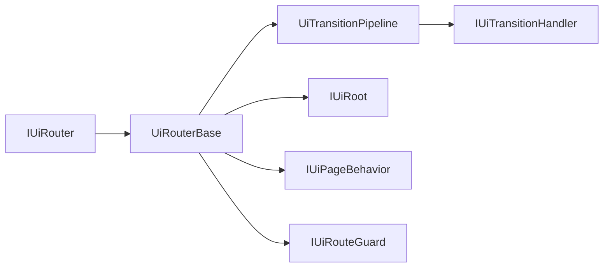

# UI系统

<cite>
**本文引用的文件**
- [UiRouterBase.cs](file://GFramework.Game/ui/UiRouterBase.cs)
- [UiTransitionPipeline.cs](file://GFramework.Game/ui/UiTransitionPipeline.cs)
- [UiTransitionHandlerBase.cs](file://GFramework.Game/ui/handler/UiTransitionHandlerBase.cs)
- [LoggingTransitionHandler.cs](file://GFramework.Game/ui/handler/LoggingTransitionHandler.cs)
- [IUiRouter.cs](file://GFramework.Game.Abstractions/ui/IUiRouter.cs)
- [IUiTransitionHandler.cs](file://GFramework.Game.Abstractions/ui/IUiTransitionHandler.cs)
- [IUiRouteGuard.cs](file://GFramework.Game.Abstractions/ui/IUiRouteGuard.cs)
- [IUiPageBehavior.cs](file://GFramework.Game.Abstractions/ui/IUiPageBehavior.cs)
- [IUiRoot.cs](file://GFramework.Game.Abstractions/ui/IUiRoot.cs)
- [UiLayer.cs](file://GFramework.Game.Abstractions/enums/UiLayer.cs)
- [UiTransitionType.cs](file://GFramework.Game.Abstractions/enums/UiTransitionType.cs)
- [UiTransitionPolicy.cs](file://GFramework.Game.Abstractions/enums/UiTransitionPolicy.cs)
- [UITransitionPhases.cs](file://GFramework.Game.Abstractions/enums/UITransitionPhases.cs)
- [UiPopPolicy.cs](file://GFramework.Game.Abstractions/ui/UiPopPolicy.cs)
</cite>

## 目录
1. [简介](#简介)
2. [项目结构](#项目结构)
3. [核心组件](#核心组件)
4. [架构总览](#架构总览)
5. [详细组件分析](#详细组件分析)
6. [依赖关系分析](#依赖关系分析)
7. [性能考虑](#性能考虑)
8. [故障排查指南](#故障排查指南)
9. [结论](#结论)
10. [附录](#附录)

## 简介
本文件面向GFramework UI系统，围绕页面栈管理、路由规则与生命周期、过渡管道与动画控制、处理器模式与日志记录、以及接口设计与使用方法进行系统化说明。重点涵盖：
- UiRouterBase 的页面栈管理机制（导航、路由规则、生命周期）
- UiTransitionPipeline 的过渡管道实现（阶段、超时、错误处理）
- UiTransitionHandlerBase 及其派生类（LoggingTransitionHandler 的日志记录）
- IUiRouter 接口的设计理念与使用方法（注册、参数传递、导航控制）
- UI系统配置选项、API参考与实践建议

## 项目结构
UI系统主要分布在以下模块：
- GFramework.Game.Abstractions：定义UI抽象接口与枚举（IUiRouter、IUiPageBehavior、IUiRoot、IUiTransitionHandler、IUiRouteGuard、UiLayer、UiTransitionType、UiTransitionPolicy、UITransitionPhases、UiPopPolicy）
- GFramework.Game：具体实现（UiRouterBase、UiTransitionPipeline、UiTransitionHandlerBase、LoggingTransitionHandler）

图表来源
- [IUiRouter.cs](file://GFramework.Game.Abstractions/ui/IUiRouter.cs#L1-L138)
- [IUiPageBehavior.cs](file://GFramework.Game.Abstractions/ui/IUiPageBehavior.cs#L1-L72)
- [IUiRoot.cs](file://GFramework.Game.Abstractions/ui/IUiRoot.cs#L1-L43)
- [IUiTransitionHandler.cs](file://GFramework.Game.Abstractions/ui/IUiTransitionHandler.cs#L1-L39)
- [IUiRouteGuard.cs](file://GFramework.Game.Abstractions/ui/IUiRouteGuard.cs#L1-L37)
- [UiLayer.cs](file://GFramework.Game.Abstractions/enums/UiLayer.cs#L1-L34)
- [UiTransitionType.cs](file://GFramework.Game.Abstractions/enums/UiTransitionType.cs#L1-L27)
- [UiTransitionPolicy.cs](file://GFramework.Game.Abstractions/enums/UiTransitionPolicy.cs#L1-L18)
- [UITransitionPhases.cs](file://GFramework.Game.Abstractions/enums/UITransitionPhases.cs#L1-L27)
- [UiPopPolicy.cs](file://GFramework.Game.Abstractions/ui/UiPopPolicy.cs#L1-L17)
- [UiRouterBase.cs](file://GFramework.Game/ui/UiRouterBase.cs#L1-L725)
- [UiTransitionPipeline.cs](file://GFramework.Game/ui/UiTransitionPipeline.cs#L1-L168)
- [UiTransitionHandlerBase.cs](file://GFramework.Game/ui/handler/UiTransitionHandlerBase.cs#L1-L33)
- [LoggingTransitionHandler.cs](file://GFramework.Game/ui/handler/LoggingTransitionHandler.cs#L1-L48)

章节来源
- [UiRouterBase.cs](file://GFramework.Game/ui/UiRouterBase.cs#L1-L725)
- [UiTransitionPipeline.cs](file://GFramework.Game/ui/UiTransitionPipeline.cs#L1-L168)
- [UiTransitionHandlerBase.cs](file://GFramework.Game/ui/handler/UiTransitionHandlerBase.cs#L1-L33)
- [LoggingTransitionHandler.cs](file://GFramework.Game/ui/handler/LoggingTransitionHandler.cs#L1-L48)
- [IUiRouter.cs](file://GFramework.Game.Abstractions/ui/IUiRouter.cs#L1-L138)
- [IUiTransitionHandler.cs](file://GFramework.Game.Abstractions/ui/IUiTransitionHandler.cs#L1-L39)
- [IUiRouteGuard.cs](file://GFramework.Game.Abstractions/ui/IUiRouteGuard.cs#L1-L37)
- [IUiPageBehavior.cs](file://GFramework.Game.Abstractions/ui/IUiPageBehavior.cs#L1-L72)
- [IUiRoot.cs](file://GFramework.Game.Abstractions/ui/IUiRoot.cs#L1-L43)
- [UiLayer.cs](file://GFramework.Game.Abstractions/enums/UiLayer.cs#L1-L34)
- [UiTransitionType.cs](file://GFramework.Game.Abstractions/enums/UiTransitionType.cs#L1-L27)
- [UiTransitionPolicy.cs](file://GFramework.Game.Abstractions/enums/UiTransitionPolicy.cs#L1-L18)
- [UITransitionPhases.cs](file://GFramework.Game.Abstractions/enums/UITransitionPhases.cs#L1-L27)
- [UiPopPolicy.cs](file://GFramework.Game.Abstractions/ui/UiPopPolicy.cs#L1-L17)

## 核心组件
- IUiRouter：统一的UI路由入口，提供页面栈管理、层级管理、路由守卫、处理器注册等能力
- UiRouterBase：IUiRouter的具体实现，内置页面栈、层级字典、过渡管道与守卫执行逻辑
- UiTransitionPipeline：过渡阶段的处理器管道，支持按阶段过滤、排序、超时与错误控制
- UiTransitionHandlerBase：处理器抽象基类，提供默认实现与可覆写钩子
- LoggingTransitionHandler：内置日志处理器，记录UI切换事件的关键信息
- IUiPageBehavior/IUiRoot：页面行为与根容器接口，定义生命周期与容器操作
- IUiRouteGuard：路由守卫接口，提供进入/离开校验与中断能力
- 枚举体系：UiLayer、UiTransitionType、UiTransitionPolicy、UITransitionPhases、UiPopPolicy

章节来源
- [IUiRouter.cs](file://GFramework.Game.Abstractions/ui/IUiRouter.cs#L1-L138)
- [UiRouterBase.cs](file://GFramework.Game/ui/UiRouterBase.cs#L1-L725)
- [UiTransitionPipeline.cs](file://GFramework.Game/ui/UiTransitionPipeline.cs#L1-L168)
- [UiTransitionHandlerBase.cs](file://GFramework.Game/ui/handler/UiTransitionHandlerBase.cs#L1-L33)
- [LoggingTransitionHandler.cs](file://GFramework.Game/ui/handler/LoggingTransitionHandler.cs#L1-L48)
- [IUiPageBehavior.cs](file://GFramework.Game.Abstractions/ui/IUiPageBehavior.cs#L1-L72)
- [IUiRoot.cs](file://GFramework.Game.Abstractions/ui/IUiRoot.cs#L1-L43)
- [IUiRouteGuard.cs](file://GFramework.Game.Abstractions/ui/IUiRouteGuard.cs#L1-L37)
- [UiLayer.cs](file://GFramework.Game.Abstractions/enums/UiLayer.cs#L1-L34)
- [UiTransitionType.cs](file://GFramework.Game.Abstractions/enums/UiTransitionType.cs#L1-L27)
- [UiTransitionPolicy.cs](file://GFramework.Game.Abstractions/enums/UiTransitionPolicy.cs#L1-L18)
- [UITransitionPhases.cs](file://GFramework.Game.Abstractions/enums/UITransitionPhases.cs#L1-L27)
- [UiPopPolicy.cs](file://GFramework.Game.Abstractions/ui/UiPopPolicy.cs#L1-L17)

## 架构总览
UI系统采用“接口抽象 + 具体实现 + 管道扩展”的分层设计：
- 抽象层定义路由、页面、根容器、处理器、守卫与枚举
- 实现层提供具体的路由栈管理、层级管理、过渡管道与处理器基类
- 管道通过阶段化扩展点（BeforeChange/AfterChange）解耦业务逻辑与UI切换

图表来源
- [IUiRouter.cs](file://GFramework.Game.Abstractions/ui/IUiRouter.cs#L1-L138)
- [UiRouterBase.cs](file://GFramework.Game/ui/UiRouterBase.cs#L1-L725)
- [IUiTransitionHandler.cs](file://GFramework.Game.Abstractions/ui/IUiTransitionHandler.cs#L1-L39)
- [UiTransitionHandlerBase.cs](file://GFramework.Game/ui/handler/UiTransitionHandlerBase.cs#L1-L33)
- [LoggingTransitionHandler.cs](file://GFramework.Game/ui/handler/LoggingTransitionHandler.cs#L1-L48)
- [UiTransitionPipeline.cs](file://GFramework.Game/ui/UiTransitionPipeline.cs#L1-L168)
- [IUiPageBehavior.cs](file://GFramework.Game.Abstractions/ui/IUiPageBehavior.cs#L1-L72)
- [IUiRoot.cs](file://GFramework.Game.Abstractions/ui/IUiRoot.cs#L1-L43)

## 详细组件分析

### 页面栈管理与生命周期（UiRouterBase）
- 页面栈管理
  - Push：支持基于 uiKey 或已有 IUiPageBehavior 的压入；可选过渡策略与实例策略
  - Pop：支持销毁或缓存策略；执行离开守卫后再弹出
  - Replace：清空栈后压入新页面；支持基于 uiKey 或实例
  - Clear：清空所有页面
  - Peek/PeekKey/IsTop/Contains/Count：查询栈状态
- 生命周期与过渡策略
  - Exclusive：下层页面 Pause + Hide；覆盖显示时仅 Pause
  - Overlay：下层页面仅 Pause，不隐藏
  - OnEnter/OnExit/OnPause/OnResume/OnHide/OnShow：页面生命周期回调
- 层级管理（非栈）
  - Show/Hide/ClearLayer：在 Overlay/Modal/Toast/Topmost 等层级显示/隐藏/清空
  - 支持实例复用与缓存
- 路由守卫
  - AddGuard/RemoveGuard；Enter/Leave 双向守卫；支持 CanInterrupt 与优先级排序
- 处理器注册
  - RegisterHandler/UnregisterHandler；OnInit 中注册默认处理器

图表来源
- [UiRouterBase.cs](file://GFramework.Game/ui/UiRouterBase.cs#L369-L420)
- [IUiPageBehavior.cs](file://GFramework.Game.Abstractions/ui/IUiPageBehavior.cs#L27-L55)
- [UiTransitionPolicy.cs](file://GFramework.Game.Abstractions/enums/UiTransitionPolicy.cs#L1-L18)

章节来源
- [UiRouterBase.cs](file://GFramework.Game/ui/UiRouterBase.cs#L70-L254)
- [UiRouterBase.cs](file://GFramework.Game/ui/UiRouterBase.cs#L369-L420)
- [UiRouterBase.cs](file://GFramework.Game/ui/UiRouterBase.cs#L422-L474)
- [UiRouterBase.cs](file://GFramework.Game/ui/UiRouterBase.cs#L476-L604)
- [UiRouterBase.cs](file://GFramework.Game/ui/UiRouterBase.cs#L607-L722)
- [IUiPageBehavior.cs](file://GFramework.Game.Abstractions/ui/IUiPageBehavior.cs#L1-L72)
- [UiTransitionPolicy.cs](file://GFramework.Game.Abstractions/enums/UiTransitionPolicy.cs#L1-L18)

### 过渡管道（UiTransitionPipeline）
- 管道职责
  - 按阶段（BeforeChange/AfterChange/All）过滤与排序处理器
  - 支持单个处理器超时与取消令牌组合
  - 错误处理：ContinueOnError 控制是否中断管道
- 执行流程
  - BeforeChange：阻塞式执行，适合需要等待的前置动作（动画、确认、预加载）
  - AfterChange：非阻塞式执行，适合后台统计、日志、音效等
- 处理器注册与去注册
  - RegisterHandler/UnregisterHandler；重复注册会忽略并记录日志

图表来源
- [UiRouterBase.cs](file://GFramework.Game/ui/UiRouterBase.cs#L339-L364)
- [UiTransitionPipeline.cs](file://GFramework.Game/ui/UiTransitionPipeline.cs#L63-L101)
- [IUiTransitionHandler.cs](file://GFramework.Game.Abstractions/ui/IUiTransitionHandler.cs#L1-L39)
- [UITransitionPhases.cs](file://GFramework.Game.Abstractions/enums/UITransitionPhases.cs#L1-L27)

章节来源
- [UiTransitionPipeline.cs](file://GFramework.Game/ui/UiTransitionPipeline.cs#L1-L168)
- [UiRouterBase.cs](file://GFramework.Game/ui/UiRouterBase.cs#L339-L364)
- [IUiTransitionHandler.cs](file://GFramework.Game.Abstractions/ui/IUiTransitionHandler.cs#L1-L39)
- [UITransitionPhases.cs](file://GFramework.Game.Abstractions/enums/UITransitionPhases.cs#L1-L27)

### 处理器模式与日志记录（UiTransitionHandlerBase / LoggingTransitionHandler）
- UiTransitionHandlerBase
  - 默认处理所有阶段（Phases=All），默认 ShouldHandle 返回 true
  - Priority 由子类实现；HandleAsync 由子类实现
- LoggingTransitionHandler
  - 高优先级（Priority=999），记录切换阶段、类型、来源/目标、策略
  - 作为内置日志处理器，便于调试与审计

图表来源
- [UiTransitionHandlerBase.cs](file://GFramework.Game/ui/handler/UiTransitionHandlerBase.cs#L1-L33)
- [LoggingTransitionHandler.cs](file://GFramework.Game/ui/handler/LoggingTransitionHandler.cs#L1-L48)
- [UITransitionPhases.cs](file://GFramework.Game.Abstractions/enums/UITransitionPhases.cs#L1-L27)

章节来源
- [UiTransitionHandlerBase.cs](file://GFramework.Game/ui/handler/UiTransitionHandlerBase.cs#L1-L33)
- [LoggingTransitionHandler.cs](file://GFramework.Game/ui/handler/LoggingTransitionHandler.cs#L1-L48)

### IUiRouter 接口设计与使用
- 设计理念
  - 统一入口：IUiRouter 提供 Push/Pop/Replace/Clear 与层级管理、守卫、处理器注册
  - 解耦：通过管道与守卫将业务逻辑与UI切换解耦
  - 可扩展：通过处理器与守卫扩展能力
- 使用要点
  - 绑定根节点：BindRoot(IUiRoot)
  - 注册处理器：RegisterHandler(handler, options)
  - 注册守卫：AddGuard/generic AddGuard<T>()
  - 导航控制：Push/Pop/Replace/Clear；层级管理：Show/Hide/ClearLayer
  - 参数传递：IUiPageEnterParam 作为进入参数载体

章节来源
- [IUiRouter.cs](file://GFramework.Game.Abstractions/ui/IUiRouter.cs#L1-L138)
- [UiRouterBase.cs](file://GFramework.Game/ui/UiRouterBase.cs#L66-L61)

## 依赖关系分析
- 组件耦合
  - UiRouterBase 依赖 IUiFactory（通过系统工具获取）、IUiRoot、IUiPageBehavior、UiTransitionPipeline、IUiRouteGuard
  - UiTransitionPipeline 依赖 IUiTransitionHandler 与 UiTransitionHandlerOptions
- 关键依赖链
  - IUiRouter → UiRouterBase → UiTransitionPipeline → IUiTransitionHandler
  - UiRouterBase → IUiRoot → IUiPageBehavior
  - UiRouterBase → IUiRouteGuard（守卫链）

图表来源
- [IUiRouter.cs](file://GFramework.Game.Abstractions/ui/IUiRouter.cs#L1-L138)
- [UiRouterBase.cs](file://GFramework.Game/ui/UiRouterBase.cs#L1-L725)
- [UiTransitionPipeline.cs](file://GFramework.Game/ui/UiTransitionPipeline.cs#L1-L168)
- [IUiTransitionHandler.cs](file://GFramework.Game.Abstractions/ui/IUiTransitionHandler.cs#L1-L39)
- [IUiRoot.cs](file://GFramework.Game.Abstractions/ui/IUiRoot.cs#L1-L43)
- [IUiPageBehavior.cs](file://GFramework.Game.Abstractions/ui/IUiPageBehavior.cs#L1-L72)
- [IUiRouteGuard.cs](file://GFramework.Game.Abstractions/ui/IUiRouteGuard.cs#L1-L37)

章节来源
- [UiRouterBase.cs](file://GFramework.Game/ui/UiRouterBase.cs#L1-L725)
- [UiTransitionPipeline.cs](file://GFramework.Game/ui/UiTransitionPipeline.cs#L1-L168)
- [IUiRouter.cs](file://GFramework.Game.Abstractions/ui/IUiRouter.cs#L1-L138)

## 性能考虑
- 页面实例管理
  - Reuse/Cache 策略：在 Replace/Push/Pop 中合理选择实例策略，减少频繁创建/销毁
  - 层级管理：Overlay/Modal/Toast 等非栈层级避免与页面栈混用，降低复杂度
- 过渡管道
  - BeforeChange 阶段避免长时间阻塞；必要时拆分为多个短任务
  - AfterChange 阶段执行非关键后台任务，避免影响主线程
  - 合理设置处理器超时与 ContinueOnError，防止单个处理器拖慢整体
- 日志与可观测性
  - LoggingTransitionHandler 仅作调试用途，生产环境建议降低日志级别或禁用
- 动画与渲染
  - 过渡策略 Exclusive 会隐藏下层页面，Overlay 仅 Pause；根据场景选择合适策略
  - 避免在 OnShow/OnHide 中执行高成本同步操作

## 故障排查指南
- 常见问题
  - Push 被忽略：若目标页面已在栈顶，将直接忽略并记录警告
  - Pop 被守卫阻止：离开守卫返回 false 或抛出异常将阻止弹出
  - 处理器超时：UiTransitionHandlerOptions.TimeoutMs 设置过短可能导致超时中断
  - AfterChange 异常：异常会被捕获并记录，但不会中断管道（除非 ContinueOnError=false）
- 排查步骤
  - 检查守卫优先级与 CanInterrupt 设置
  - 查看 BeforeChange/AfterChange 阶段日志
  - 确认处理器注册顺序与过滤条件（ShouldHandle）
  - 验证页面生命周期回调是否正确实现

章节来源
- [UiRouterBase.cs](file://GFramework.Game/ui/UiRouterBase.cs#L84-L88)
- [UiRouterBase.cs](file://GFramework.Game/ui/UiRouterBase.cs#L148-L152)
- [UiTransitionPipeline.cs](file://GFramework.Game/ui/UiTransitionPipeline.cs#L125-L167)
- [LoggingTransitionHandler.cs](file://GFramework.Game/ui/handler/LoggingTransitionHandler.cs#L34-L47)

## 结论
GFramework UI系统通过清晰的接口抽象与实现分离，提供了强大的页面栈管理、层级管理、路由守卫与过渡管道能力。UiRouterBase 作为核心控制器，结合 UiTransitionPipeline 的阶段化扩展点，实现了业务逻辑与UI切换的解耦；LoggingTransitionHandler 提供了开箱即用的日志能力。遵循本文的最佳实践与性能建议，可在保证体验的同时提升系统的可维护性与稳定性。

## 附录

### API 参考（摘要）
- IUiRouter
  - Push/Pop/Replace/Clear：页面导航与栈操作
  - Show/Hide/ClearLayer：层级管理
  - RegisterHandler/UnregisterHandler：处理器注册
  - AddGuard/RemoveGuard：路由守卫注册
- IUiTransitionHandler
  - Priority/Phases/ShouldHandle/HandleAsync：处理器契约
- IUiRouteGuard
  - Priority/CanInterrupt/CanEnterAsync/CanLeaveAsync：守卫契约
- IUiPageBehavior
  - OnEnter/OnExit/OnPause/OnResume/OnHide/OnShow：生命周期
- IUiRoot
  - AddUiPage/RemoveUiPage/SetZOrder/GetVisiblePages：容器操作
- 枚举
  - UiLayer：Page/Overlay/Modal/Toast/Topmost
  - UiTransitionType：Push/Pop/Replace/Clear
  - UiTransitionPolicy：Exclusive/Overlay
  - UITransitionPhases：BeforeChange/AfterChange/All
  - UiPopPolicy：Destroy/Cache

章节来源
- [IUiRouter.cs](file://GFramework.Game.Abstractions/ui/IUiRouter.cs#L1-L138)
- [IUiTransitionHandler.cs](file://GFramework.Game.Abstractions/ui/IUiTransitionHandler.cs#L1-L39)
- [IUiRouteGuard.cs](file://GFramework.Game.Abstractions/ui/IUiRouteGuard.cs#L1-L37)
- [IUiPageBehavior.cs](file://GFramework.Game.Abstractions/ui/IUiPageBehavior.cs#L1-L72)
- [IUiRoot.cs](file://GFramework.Game.Abstractions/ui/IUiRoot.cs#L1-L43)
- [UiLayer.cs](file://GFramework.Game.Abstractions/enums/UiLayer.cs#L1-L34)
- [UiTransitionType.cs](file://GFramework.Game.Abstractions/enums/UiTransitionType.cs#L1-L27)
- [UiTransitionPolicy.cs](file://GFramework.Game.Abstractions/enums/UiTransitionPolicy.cs#L1-L18)
- [UITransitionPhases.cs](file://GFramework.Game.Abstractions/enums/UITransitionPhases.cs#L1-L27)
- [UiPopPolicy.cs](file://GFramework.Game.Abstractions/ui/UiPopPolicy.cs#L1-L17)