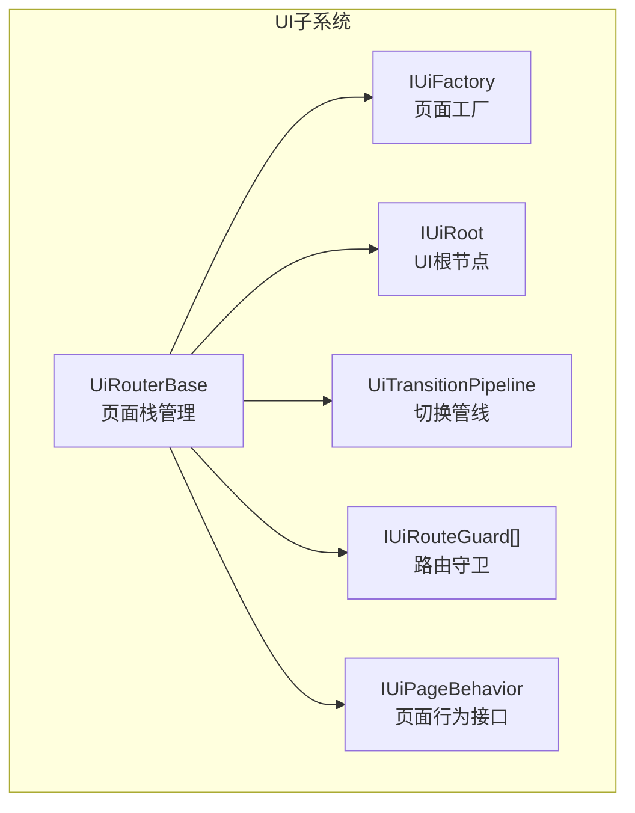
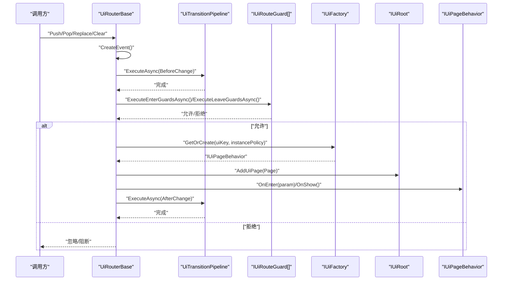
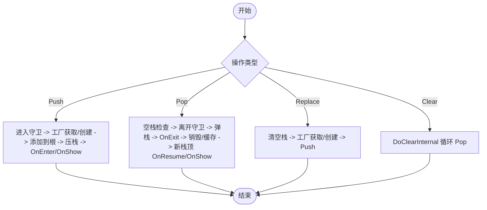
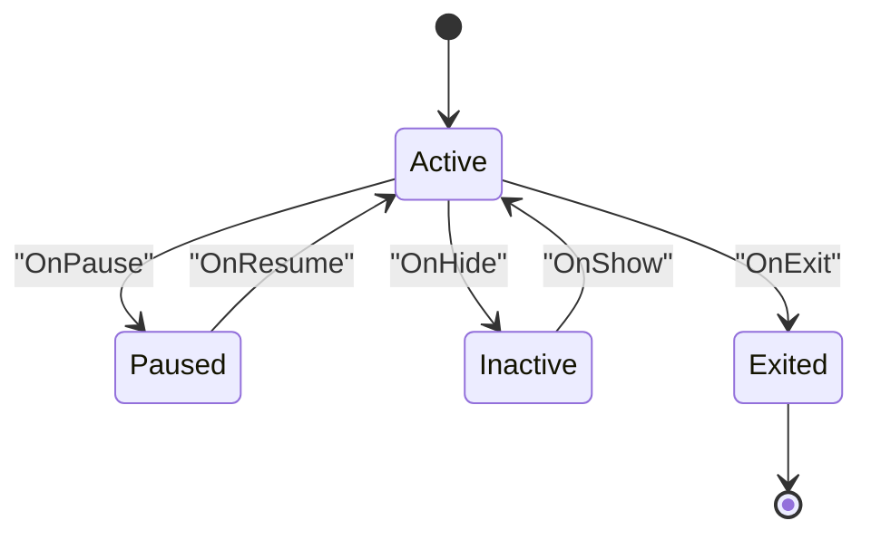
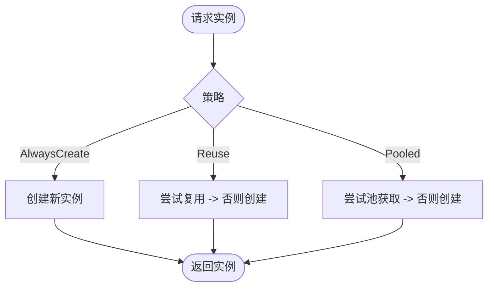
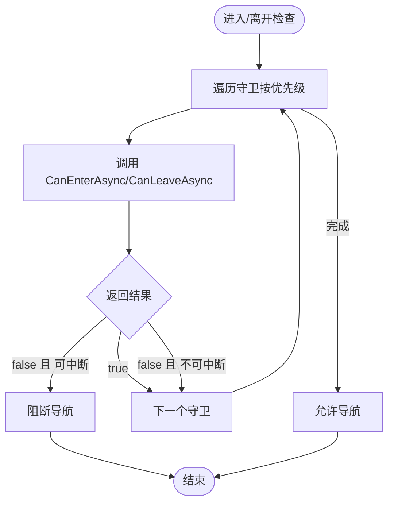
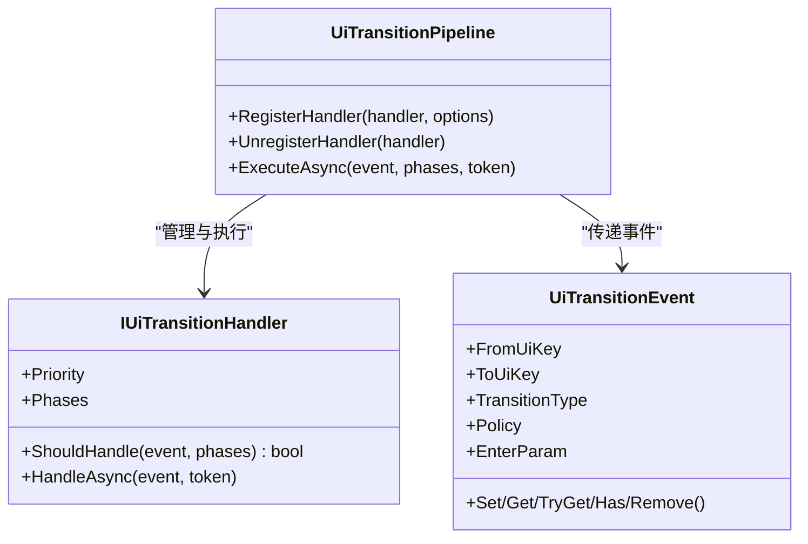
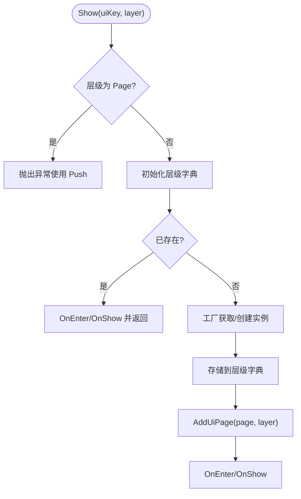
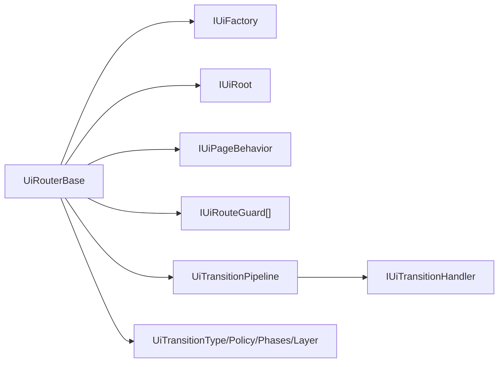

# UI路由基础类

<cite>
**本文引用的文件**
- [UiRouterBase.cs](file://GFramework.Game/ui/UiRouterBase.cs)
- [IUiRouter.cs](file://GFramework.Game.Abstractions/ui/IUiRouter.cs)
- [UiInstancePolicy.cs](file://GFramework.Game.Abstractions/ui/UiInstancePolicy.cs)
- [IUiPageBehavior.cs](file://GFramework.Game.Abstractions/ui/IUiPageBehavior.cs)
- [IUiPage.cs](file://GFramework.Game.Abstractions/ui/IUiPage.cs)
- [IUiRouteGuard.cs](file://GFramework.Game.Abstractions/ui/IUiRouteGuard.cs)
- [UiPopPolicy.cs](file://GFramework.Game.Abstractions/ui/UiPopPolicy.cs)
- [UiTransitionPolicy.cs](file://GFramework.Game.Abstractions/enums/UiTransitionPolicy.cs)
- [UiTransitionEvent.cs](file://GFramework.Game.Abstractions/ui/UiTransitionEvent.cs)
- [UiTransitionPipeline.cs](file://GFramework.Game/ui/UiTransitionPipeline.cs)
- [UiLayer.cs](file://GFramework.Game.Abstractions/enums/UiLayer.cs)
- [UiTransitionType.cs](file://GFramework.Game.Abstractions/enums/UiTransitionType.cs)
- [UITransitionPhases.cs](file://GFramework.Game.Abstractions/enums/UITransitionPhases.cs)
</cite>

## 目录
1. [简介](#简介)
2. [项目结构](#项目结构)
3. [核心组件](#核心组件)
4. [架构总览](#架构总览)
5. [详细组件分析](#详细组件分析)
6. [依赖关系分析](#依赖关系分析)
7. [性能考虑](#性能考虑)
8. [故障排查指南](#故障排查指南)
9. [结论](#结论)
10. [附录](#附录)

## 简介
本文件为 UiRouterBase 类提供详尽的 API 文档与实现解析，涵盖页面栈管理（Push、Pop、Replace、Clear）、页面生命周期管理（OnEnter、OnExit、OnShow、OnHide、OnPause、OnResume）、页面实例管理策略（UiInstancePolicy 的 Reuse 与 CreateNew 等模式）、页面栈状态查询方法（PeekKey、IsTop、Contains、Count）、路由守卫机制、日志与错误处理、以及性能优化最佳实践。文档同时提供多种导航场景的使用示例与可视化流程图，帮助开发者快速理解并正确使用该路由系统。

## 项目结构
UiRouterBase 位于游戏模块的 UI 子系统中，作为抽象系统基类，提供统一的 UI 路由能力，并通过管线化处理器扩展 UI 切换行为。其核心依赖包括：
- UI 工厂与根节点：用于创建与挂载页面
- 管线处理器：用于 BeforeChange/AfterChange 阶段的扩展
- 路由守卫：用于拦截与控制导航
- 生命周期接口：定义页面行为接口

**图表来源**
- [UiRouterBase.cs](file://GFramework.Game/ui/UiRouterBase.cs#L13-L42)
- [UiTransitionPipeline.cs](file://GFramework.Game/ui/UiTransitionPipeline.cs#L11-L16)
- [IUiRouter.cs](file://GFramework.Game.Abstractions/ui/IUiRouter.cs#L9-L10)

**章节来源**
- [UiRouterBase.cs](file://GFramework.Game/ui/UiRouterBase.cs#L13-L42)
- [IUiRouter.cs](file://GFramework.Game.Abstractions/ui/IUiRouter.cs#L9-L10)

## 核心组件
- 页面栈管理：提供 Push、Pop、Replace、Clear 等导航方法，支持基于 key 或已有页面实例的两种 Push 重载。
- 生命周期管理：页面行为接口定义 OnEnter、OnExit、OnShow、OnHide、OnPause、OnResume 六个生命周期回调。
- 实例管理策略：UiInstancePolicy 控制实例获取与复用策略（AlwaysCreate、Reuse、Pooled）。
- 状态查询：PeekKey、IsTop、Contains、Count 提供页面栈状态查询。
- 路由守卫：IUiRouteGuard 支持优先级与可中断策略，拦截进入/离开。
- 切换管线：UiTransitionPipeline 管理 BeforeChange/AfterChange 阶段的处理器注册与执行。
- 层级管理：非栈层级（Overlay、Modal、Toast、Topmost）的显示与隐藏。

**章节来源**
- [UiRouterBase.cs](file://GFramework.Game/ui/UiRouterBase.cs#L73-L254)
- [IUiPageBehavior.cs](file://GFramework.Game.Abstractions/ui/IUiPageBehavior.cs#L6-L72)
- [UiInstancePolicy.cs](file://GFramework.Game.Abstractions/ui/UiInstancePolicy.cs#L7-L23)
- [IUiRouteGuard.cs](file://GFramework.Game.Abstractions/ui/IUiRouteGuard.cs#L9-L37)
- [UiTransitionPipeline.cs](file://GFramework.Game/ui/UiTransitionPipeline.cs#L11-L168)
- [UiLayer.cs](file://GFramework.Game.Abstractions/enums/UiLayer.cs#L7-L34)

## 架构总览
UiRouterBase 通过“事件驱动 + 管线扩展”的方式组织 UI 导航流程。每次导航都会创建 UiTransitionEvent，并在 BeforeChange 阶段阻塞式执行处理器，随后执行核心逻辑，最后在 AfterChange 阶段异步执行处理器以避免阻塞主线程。

**图表来源**
- [UiRouterBase.cs](file://GFramework.Game/ui/UiRouterBase.cs#L80-L100)
- [UiRouterBase.cs](file://GFramework.Game/ui/UiRouterBase.cs#L339-L364)
- [UiRouterBase.cs](file://GFramework.Game/ui/UiRouterBase.cs#L369-L420)
- [UiTransitionPipeline.cs](file://GFramework.Game/ui/UiTransitionPipeline.cs#L63-L101)
- [IUiRouteGuard.cs](file://GFramework.Game.Abstractions/ui/IUiRouteGuard.cs#L28-L36)

## 详细组件分析

### 页面栈管理 API
- Push
  - 基于 uiKey：先执行进入守卫，再通过工厂按策略获取/创建实例，添加到 UI 根节点，压入栈，触发 OnEnter/OnShow；若当前栈顶页面策略为 Exclusive，则先 OnPause 再 OnHide。
  - 基于已有页面实例：同上，但直接使用传入实例。
  - 重复 Push 栈顶页面会被忽略并记录警告。
- Pop
  - 若栈为空则忽略；否则执行离开守卫，弹出栈顶页面，触发 OnExit；根据策略销毁或缓存；若栈非空，对新栈顶执行 OnResume/OnShow。
- Replace
  - 基于 uiKey：清空栈（内部调用，不触发额外管线），通过工厂按策略获取/创建实例，再 Push。
  - 基于已有页面实例：清空栈，直接 Push 传入实例。
- Clear
  - 清空所有页面，内部调用 DoClearInternal，逐个 Pop 并按策略处理。

**图表来源**
- [UiRouterBase.cs](file://GFramework.Game/ui/UiRouterBase.cs#L73-L254)

**章节来源**
- [UiRouterBase.cs](file://GFramework.Game/ui/UiRouterBase.cs#L73-L254)
- [UiPopPolicy.cs](file://GFramework.Game.Abstractions/ui/UiPopPolicy.cs#L6-L17)
- [UiTransitionPolicy.cs](file://GFramework.Game.Abstractions/enums/UiTransitionPolicy.cs#L7-L18)

### 页面生命周期管理
页面行为接口定义了六种生命周期回调，UiRouterBase 在相应时机调用：
- OnEnter(param)：页面进入时调用，携带进入参数
- OnExit()：页面退出时调用
- OnPause()：当前页面被覆盖（Exclusive）或即将被覆盖时调用
- OnResume()：页面重新回到前台时调用
- OnShow()：页面显示时调用
- OnHide()：页面隐藏时调用（Exclusive 下的隐藏）

**图表来源**
- [IUiPageBehavior.cs](file://GFramework.Game.Abstractions/ui/IUiPageBehavior.cs#L30-L55)
- [UiRouterBase.cs](file://GFramework.Game/ui/UiRouterBase.cs#L389-L420)
- [UiRouterBase.cs](file://GFramework.Game/ui/UiRouterBase.cs#L425-L462)

**章节来源**
- [IUiPageBehavior.cs](file://GFramework.Game.Abstractions/ui/IUiPageBehavior.cs#L6-L72)
- [IUiPage.cs](file://GFramework.Game.Abstractions/ui/IUiPage.cs#L7-L39)
- [UiRouterBase.cs](file://GFramework.Game/ui/UiRouterBase.cs#L389-L462)

### 页面实例管理策略（UiInstancePolicy）
- AlwaysCreate：总是创建新实例，适合需要完全隔离状态的页面
- Reuse：复用已存在实例（若有），否则创建；适合大多数常规页面
- Pooled：从预加载池获取或创建；适合高频率切换且可回收的页面

**图表来源**
- [UiInstancePolicy.cs](file://GFramework.Game.Abstractions/ui/UiInstancePolicy.cs#L7-L23)
- [UiRouterBase.cs](file://GFramework.Game/ui/UiRouterBase.cs#L369-L384)

**章节来源**
- [UiInstancePolicy.cs](file://GFramework.Game.Abstractions/ui/UiInstancePolicy.cs#L7-L23)
- [UiRouterBase.cs](file://GFramework.Game/ui/UiRouterBase.cs#L369-L384)

### 页面栈状态查询方法
- PeekKey()：返回栈顶页面键名，空栈返回空字符串
- Peek()：返回栈顶页面行为对象
- IsTop(uiKey)：判断栈顶是否为目标页面
- Contains(uiKey)：判断页面是否存在于栈中
- Count：返回栈中页面数量

**章节来源**
- [UiRouterBase.cs](file://GFramework.Game/ui/UiRouterBase.cs#L257-L299)
- [IUiRouter.cs](file://GFramework.Game.Abstractions/ui/IUiRouter.cs#L95-L117)

### 路由守卫机制
- 注册与排序：AddGuard/AddGuard<T> 按优先级升序排序
- 进入拦截：ExecuteEnterGuardsAsync 依次调用 CanEnterAsync，遇到 CanInterrupt=true 且返回 false 即阻断
- 离开拦截：ExecuteLeaveGuardsAsync 依次调用 CanLeaveAsync，遇到 CanInterrupt=true 且返回 false 即阻断
- 异常处理：守卫异常时若 CanInterrupt=true 则阻断，否则继续

**图表来源**
- [UiRouterBase.cs](file://GFramework.Game/ui/UiRouterBase.cs#L607-L722)
- [IUiRouteGuard.cs](file://GFramework.Game.Abstractions/ui/IUiRouteGuard.cs#L28-L36)

**章节来源**
- [UiRouterBase.cs](file://GFramework.Game/ui/UiRouterBase.cs#L607-L722)
- [IUiRouteGuard.cs](file://GFramework.Game.Abstractions/ui/IUiRouteGuard.cs#L9-L37)

### 切换管线与处理器
- 管线注册：RegisterHandler/UnregisterHandler，支持超时与错误继续策略
- 阶段执行：BeforeChange 阻塞执行，AfterChange 异步执行
- 过滤与排序：按 Phases 标记与 ShouldHandle 过滤，Priority 排序

**图表来源**
- [UiTransitionPipeline.cs](file://GFramework.Game/ui/UiTransitionPipeline.cs#L11-L168)
- [UiTransitionEvent.cs](file://GFramework.Game.Abstractions/ui/UiTransitionEvent.cs#L10-L105)

**章节来源**
- [UiTransitionPipeline.cs](file://GFramework.Game/ui/UiTransitionPipeline.cs#L11-L168)
- [UiTransitionEvent.cs](file://GFramework.Game.Abstractions/ui/UiTransitionEvent.cs#L10-L105)

### 层级管理（非栈层级）
- Show：在指定层级显示 UI，支持基于 key 或已有实例；若已存在则直接 OnEnter/OnShow
- Hide：隐藏并可选择销毁或缓存；支持按 destroy 参数决定是否移除
- ClearLayer：清空指定层级
- GetFromLayer/HasVisibleInLayer：查询与检测

**图表来源**
- [UiRouterBase.cs](file://GFramework.Game/ui/UiRouterBase.cs#L476-L518)
- [UiLayer.cs](file://GFramework.Game.Abstractions/enums/UiLayer.cs#L7-L34)

**章节来源**
- [UiRouterBase.cs](file://GFramework.Game/ui/UiRouterBase.cs#L476-L518)
- [UiLayer.cs](file://GFramework.Game.Abstractions/enums/UiLayer.cs#L7-L34)

## 依赖关系分析
UiRouterBase 的关键依赖与耦合如下：
- 低耦合：通过接口 IUiFactory、IUiRoot、IUiPageBehavior、IUiRouteGuard 解耦具体实现
- 高内聚：导航核心逻辑集中在 DoPushPageInternal、DoPopInternal、DoClearInternal
- 管线扩展：UiTransitionPipeline 与 IUiTransitionHandler 提供横切关注点（动画、日志、统计等）
- 枚举契约：UiTransitionType、UiTransitionPolicy、UITransitionPhases、UiLayer 等枚举确保行为一致

**图表来源**
- [UiRouterBase.cs](file://GFramework.Game/ui/UiRouterBase.cs#L13-L42)
- [UiTransitionPipeline.cs](file://GFramework.Game/ui/UiTransitionPipeline.cs#L11-L16)
- [UiTransitionType.cs](file://GFramework.Game.Abstractions/enums/UiTransitionType.cs#L6-L27)
- [UiTransitionPolicy.cs](file://GFramework.Game.Abstractions/enums/UiTransitionPolicy.cs#L7-L18)
- [UITransitionPhases.cs](file://GFramework.Game.Abstractions/enums/UITransitionPhases.cs#L9-L27)
- [UiLayer.cs](file://GFramework.Game.Abstractions/enums/UiLayer.cs#L7-L34)

**章节来源**
- [UiRouterBase.cs](file://GFramework.Game/ui/UiRouterBase.cs#L13-L42)
- [UiTransitionPipeline.cs](file://GFramework.Game/ui/UiTransitionPipeline.cs#L11-L16)

## 性能考虑
- 异步 AfterChange：避免阻塞主线程，提升响应性
- 空栈/重复 Push 快速返回：减少无效操作
- Exclusive vs Overlay 策略：合理选择策略以减少不必要的隐藏/显示
- 守卫短路：利用 CanInterrupt 提前阻断
- 管线超时与错误继续：通过 UiTransitionHandlerOptions 控制超时与容错
- 实例策略：Pooled/Reuse 减少频繁创建销毁成本

[本节为通用建议，无需特定文件引用]

## 故障排查指南
- 日志定位：UiRouterBase 与 UiTransitionPipeline 均记录 Debug/Error 级日志，便于追踪导航流程与异常
- 常见问题
  - Pop 被阻断：检查路由守卫返回值与 CanInterrupt 配置
  - Push 未生效：确认是否 Push 了栈顶相同页面；检查工厂实例获取是否成功
  - Replace 后页面未显示：确认工厂实例是否正确添加到根节点
  - AfterChange 抛错：检查管线处理器异常处理配置（ContinueOnError）
- 建议
  - 在 BeforeChange 中进行耗时校验（如网络/数据准备），在 AfterChange 中做非关键操作（日志/统计）
  - 对高频页面启用 Pooled/Reuse 策略

**章节来源**
- [UiRouterBase.cs](file://GFramework.Game/ui/UiRouterBase.cs#L339-L364)
- [UiTransitionPipeline.cs](file://GFramework.Game/ui/UiTransitionPipeline.cs#L113-L167)

## 结论
UiRouterBase 通过清晰的页面栈管理、完善的生命周期回调、灵活的实例策略与强大的管线扩展机制，提供了可组合、可维护、高性能的 UI 导航解决方案。结合路由守卫与层级管理，能够满足复杂 UI 场景的需求。建议在实际项目中遵循本文提供的最佳实践，以获得稳定可靠的用户体验。

[本节为总结，无需特定文件引用]

## 附录

### API 方法一览与使用场景
- Push(uiKey, param, policy=Exclusive, instancePolicy=Reuse)
  - 适用：常规页面跳转
  - 注意：重复 Push 栈顶会被忽略
- Push(page, param, policy=Exclusive)
  - 适用：预挂载节点或调试场景
- Pop(policy=Destroy)
  - 适用：返回上一页；Destroy 销毁，Cache 缓存
- Replace(uiKey/page, param, popPolicy, pushPolicy, instancePolicy)
  - 适用：整栈替换（如登录后替换整栈）
- Clear()
  - 适用：重置路由状态（如登出）
- PeekKey()/Peek()/IsTop()/Contains()/Count
  - 适用：状态查询与条件判断

**章节来源**
- [IUiRouter.cs](file://GFramework.Game.Abstractions/ui/IUiRouter.cs#L22-L117)
- [UiRouterBase.cs](file://GFramework.Game/ui/UiRouterBase.cs#L73-L254)

### 生命周期回调触发顺序示例
- Push 新页面
  - 当前页面：OnPause → Exclusive 时 OnHide
  - 新页面：OnEnter(param) → OnShow
- Pop 页面
  - 弹出页面：OnExit → 销毁/缓存
  - 新栈顶：OnResume → OnShow
- Replace
  - 清空栈 → 获取实例 → Push

**章节来源**
- [UiRouterBase.cs](file://GFramework.Game/ui/UiRouterBase.cs#L389-L462)
- [IUiPageBehavior.cs](file://GFramework.Game.Abstractions/ui/IUiPageBehavior.cs#L30-L55)