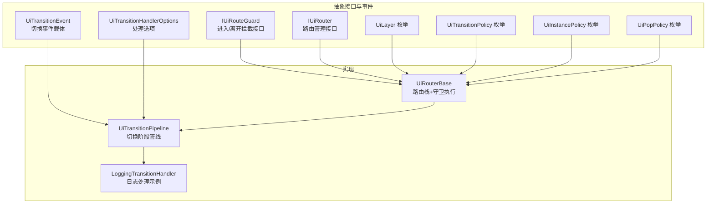
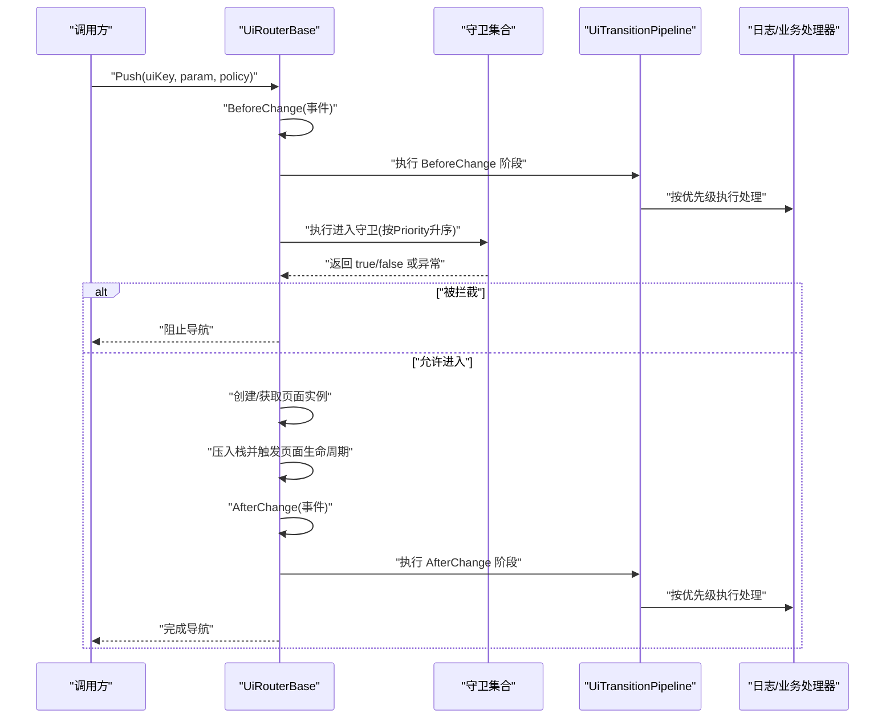
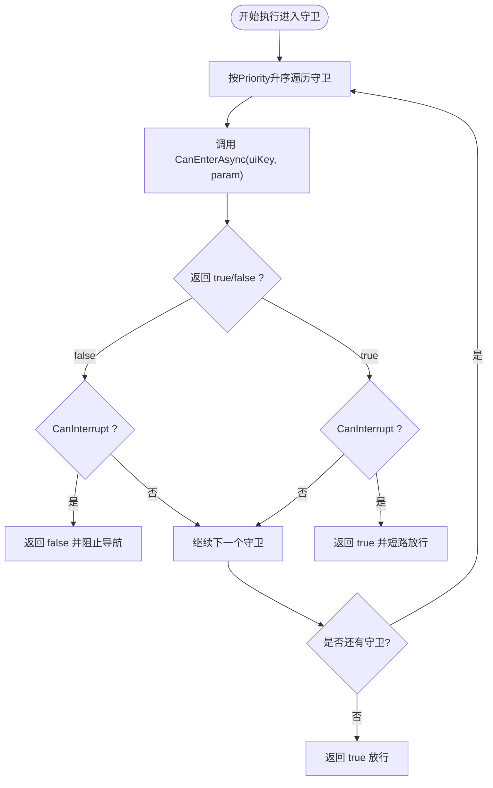
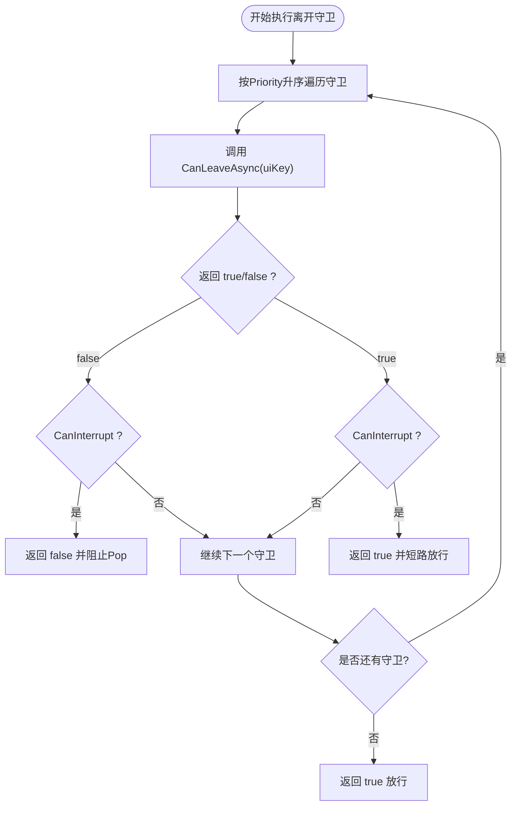
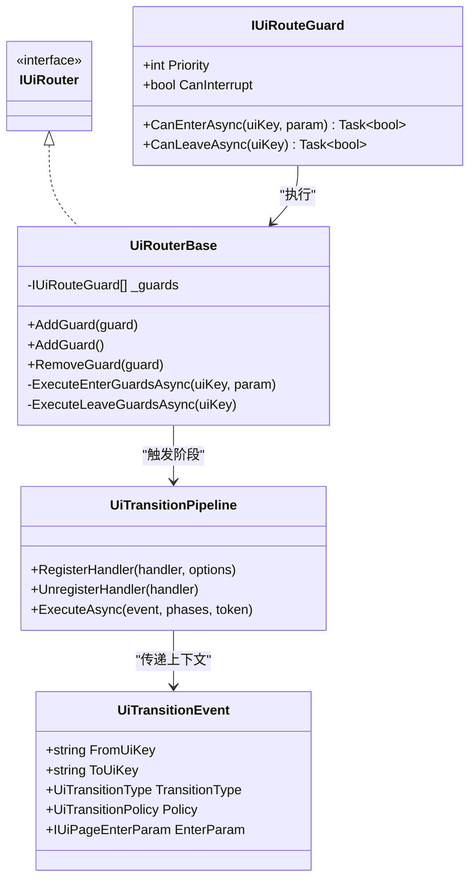

# UI路由守卫

<cite>
**本文引用的文件**   
- [IUiRouteGuard.cs](file://GFramework.Game.Abstractions/ui/IUiRouteGuard.cs)
- [UiRouterBase.cs](file://GFramework.Game/ui/UiRouterBase.cs)
- [IUiRouter.cs](file://GFramework.Game.Abstractions/ui/IUiRouter.cs)
- [UiTransitionPipeline.cs](file://GFramework.Game/ui/UiTransitionPipeline.cs)
- [LoggingTransitionHandler.cs](file://GFramework.Game/ui/handler/LoggingTransitionHandler.cs)
- [UiTransitionEvent.cs](file://GFramework.Game.Abstractions/ui/UiTransitionEvent.cs)
- [UiLayer.cs](file://GFramework.Game.Abstractions/enums/UiLayer.cs)
- [UiTransitionPolicy.cs](file://GFramework.Game.Abstractions/enums/UiTransitionPolicy.cs)
- [UiInstancePolicy.cs](file://GFramework.Game.Abstractions/ui/UiInstancePolicy.cs)
- [UiPopPolicy.cs](file://GFramework.Game.Abstractions/ui/UiPopPolicy.cs)
- [UiTransitionHandlerOptions.cs](file://GFramework.Game.Abstractions/ui/UiTransitionHandlerOptions.cs)
</cite>

## 目录
1. [简介](#简介)
2. [项目结构](#项目结构)
3. [核心组件](#核心组件)
4. [架构总览](#架构总览)
5. [组件详解](#组件详解)
6. [依赖关系分析](#依赖关系分析)
7. [性能与并发特性](#性能与并发特性)
8. [故障排查指南](#故障排查指南)
9. [结论](#结论)
10. [附录：自定义守卫开发指南与示例路径](#附录自定义守卫开发指南与示例路径)

## 简介
本文件面向安全与工程实践，系统化阐述 GFramework 的 UI 路由守卫体系。重点覆盖：
- 设计理念与安全边界：通过守卫对 UI 导航进行“进入/离开”双通道拦截，实现业务规则与安全策略的统一入口。
- 执行流程：进入守卫与离开守卫的调用时机、优先级与中断机制。
- 接口规范：IUiRouteGuard 的职责、方法语义与返回值含义。
- 异常与并发：异步执行、异常捕获与 CanInterrupt 对控制流的影响。
- 实践指南：如何开发登录校验、状态检查、业务规则拦截等守卫，并给出可定位的实现参考路径。

## 项目结构
围绕 UI 路由与守卫的关键文件组织如下：
- 抽象层接口与事件模型：IUiRouteGuard、IUiRouter、UiTransitionEvent、UiLayer、UiTransitionPolicy、UiInstancePolicy、UiPopPolicy、UiTransitionHandlerOptions
- 具体实现：UiRouterBase（路由栈与守卫执行）、UiTransitionPipeline（切换阶段管线）

图示来源
- [IUiRouteGuard.cs](file://GFramework.Game.Abstractions/ui/IUiRouteGuard.cs#L1-L36)
- [IUiRouter.cs](file://GFramework.Game.Abstractions/ui/IUiRouter.cs#L1-L138)
- [UiTransitionEvent.cs](file://GFramework.Game.Abstractions/ui/UiTransitionEvent.cs#L1-L105)
- [UiLayer.cs](file://GFramework.Game.Abstractions/enums/UiLayer.cs#L1-L33)
- [UiTransitionPolicy.cs](file://GFramework.Game.Abstractions/enums/UiTransitionPolicy.cs#L1-L18)
- [UiInstancePolicy.cs](file://GFramework.Game.Abstractions/ui/UiInstancePolicy.cs#L1-L23)
- [UiPopPolicy.cs](file://GFramework.Game.Abstractions/ui/UiPopPolicy.cs)
- [UiTransitionHandlerOptions.cs](file://GFramework.Game.Abstractions/ui/UiTransitionHandlerOptions.cs#L1-L6)
- [UiRouterBase.cs](file://GFramework.Game/ui/UiRouterBase.cs#L1-L725)
- [UiTransitionPipeline.cs](file://GFramework.Game/ui/UiTransitionPipeline.cs#L1-L119)
- [LoggingTransitionHandler.cs](file://GFramework.Game/ui/handler/LoggingTransitionHandler.cs#L1-L48)

章节来源
- [IUiRouteGuard.cs](file://GFramework.Game.Abstractions/ui/IUiRouteGuard.cs#L1-L36)
- [UiRouterBase.cs](file://GFramework.Game/ui/UiRouterBase.cs#L1-L725)
- [IUiRouter.cs](file://GFramework.Game.Abstractions/ui/IUiRouter.cs#L1-L138)
- [UiTransitionPipeline.cs](file://GFramework.Game/ui/UiTransitionPipeline.cs#L1-L119)
- [LoggingTransitionHandler.cs](file://GFramework.Game/ui/handler/LoggingTransitionHandler.cs#L1-L48)
- [UiTransitionEvent.cs](file://GFramework.Game.Abstractions/ui/UiTransitionEvent.cs#L1-L105)
- [UiLayer.cs](file://GFramework.Game.Abstractions/enums/UiLayer.cs#L1-L33)
- [UiTransitionPolicy.cs](file://GFramework.Game.Abstractions/enums/UiTransitionPolicy.cs#L1-L18)
- [UiInstancePolicy.cs](file://GFramework.Game.Abstractions/ui/UiInstancePolicy.cs#L1-L23)
- [UiPopPolicy.cs](file://GFramework.Game.Abstractions/ui/UiPopPolicy.cs)
- [UiTransitionHandlerOptions.cs](file://GFramework.Game.Abstractions/ui/UiTransitionHandlerOptions.cs#L1-L6)

## 核心组件
- IUiRouteGuard：定义进入/离开拦截的统一接口，含优先级与中断能力。
- UiRouterBase：维护路由栈与守卫集合，按优先级顺序执行守卫，支持 CanInterrupt 控制短路。
- UiTransitionPipeline：UI 切换阶段的扩展点，与守卫共同构成“前置拦截 + 后置扩展”的完整链路。
- IUiRouter：对外暴露 Push/Pop/Replace/Clear 等路由操作，内部串联守卫与管线。

章节来源
- [IUiRouteGuard.cs](file://GFramework.Game.Abstractions/ui/IUiRouteGuard.cs#L1-L36)
- [UiRouterBase.cs](file://GFramework.Game/ui/UiRouterBase.cs#L1-L725)
- [IUiRouter.cs](file://GFramework.Game.Abstractions/ui/IUiRouter.cs#L1-L138)
- [UiTransitionPipeline.cs](file://GFramework.Game/ui/UiTransitionPipeline.cs#L1-L119)

## 架构总览
UI 路由守卫位于“导航决策层”，在进入与离开两个关键节点对请求进行判定；同时配合 UI 切换管线在 BeforeChange/AfterChange 阶段执行扩展逻辑。

图示来源
- [UiRouterBase.cs](file://GFramework.Game/ui/UiRouterBase.cs#L80-L100)
- [UiRouterBase.cs](file://GFramework.Game/ui/UiRouterBase.cs#L339-L364)
- [UiRouterBase.cs](file://GFramework.Game/ui/UiRouterBase.cs#L653-L685)
- [UiTransitionPipeline.cs](file://GFramework.Game/ui/UiTransitionPipeline.cs#L63-L101)
- [LoggingTransitionHandler.cs](file://GFramework.Game/ui/handler/LoggingTransitionHandler.cs#L34-L47)

## 组件详解

### IUiRouteGuard 接口与实现要求
- 方法定义
  - CanEnterAsync(uiKey, param)：进入目标 UI 前的检查，返回 true 允许进入，false 拦截。
  - CanLeaveAsync(uiKey)：离开当前 UI 前的检查，返回 true 允许离开，false 拦截。
- 关键属性
  - Priority：数值越小优先级越高，执行顺序严格按升序排列。
  - CanInterrupt：若返回 true，当该守卫返回 false 时，立即停止后续守卫执行；若返回 false，则继续遍历下一个守卫。
- 返回值与异常
  - 正常返回：布尔值决定是否放行。
  - 异常：若守卫抛出异常，将被内部捕获并记录错误日志；若 CanInterrupt 为 true，将视为拦截失败并阻止导航。

章节来源
- [IUiRouteGuard.cs](file://GFramework.Game.Abstractions/ui/IUiRouteGuard.cs#L1-L36)

### 守卫注册与排序
- 注册方式
  - AddGuard(IUiRouteGuard)：添加单个守卫。
  - AddGuard<T>()：通过无参构造注册泛型守卫类型。
  - RemoveGuard(IUiRouteGuard)：移除守卫。
- 排序规则
  - 按 Priority 升序排序，确保高优先级守卫先执行。
- 内部存储
  - 使用 List<IUiRouteGuard> 维护守卫集合，保证插入顺序与排序后顺序一致。

章节来源
- [UiRouterBase.cs](file://GFramework.Game/ui/UiRouterBase.cs#L612-L648)

### 进入守卫执行流程
- 遍历顺序：按 Priority 升序依次调用 CanEnterAsync。
- 中断机制：若某守卫返回 false 且 CanInterrupt 为 true，则立即返回 false，阻止导航。
- 异常处理：若发生异常，记录错误日志；若 CanInterrupt 为 true，返回 false。
- 默认放行：遍历结束未拦截时，返回 true。

图示来源
- [UiRouterBase.cs](file://GFramework.Game/ui/UiRouterBase.cs#L653-L685)

章节来源
- [UiRouterBase.cs](file://GFramework.Game/ui/UiRouterBase.cs#L653-L685)

### 离开守卫执行流程
- 调用时机：Pop 操作前调用 CanLeaveAsync(uiKey)。
- 中断机制与异常处理：与进入守卫一致，遵循 CanInterrupt 与异常短路规则。
- 默认放行：遍历结束未拦截时，返回 true。

图示来源
- [UiRouterBase.cs](file://GFramework.Game/ui/UiRouterBase.cs#L690-L722)

章节来源
- [UiRouterBase.cs](file://GFramework.Game/ui/UiRouterBase.cs#L148-L152)
- [UiRouterBase.cs](file://GFramework.Game/ui/UiRouterBase.cs#L690-L722)

### 与 UI 切换管线的协作
- BeforeChange/AfterChange：在导航前后分别触发管线，执行日志、动画、状态同步等扩展。
- 守卫与管线的关系：守卫负责“是否允许导航”，管线负责“导航发生时做什么”。

章节来源
- [UiRouterBase.cs](file://GFramework.Game/ui/UiRouterBase.cs#L339-L364)
- [UiTransitionPipeline.cs](file://GFramework.Game/ui/UiTransitionPipeline.cs#L63-L101)
- [LoggingTransitionHandler.cs](file://GFramework.Game/ui/handler/LoggingTransitionHandler.cs#L34-L47)

## 依赖关系分析
- IUiRouteGuard 与 UiRouterBase：守卫接口与执行容器的直接耦合。
- UiRouterBase 与 UiTransitionPipeline：路由操作与切换阶段扩展的协作。
- IUiRouter 与 UiRouterBase：接口与具体实现的继承关系。
- 事件与策略：UiTransitionEvent、UiLayer、UiTransitionPolicy、UiInstancePolicy、UiPopPolicy 为导航上下文与策略提供支撑。

图示来源
- [IUiRouteGuard.cs](file://GFramework.Game.Abstractions/ui/IUiRouteGuard.cs#L1-L36)
- [UiRouterBase.cs](file://GFramework.Game/ui/UiRouterBase.cs#L1-L725)
- [IUiRouter.cs](file://GFramework.Game.Abstractions/ui/IUiRouter.cs#L1-L138)
- [UiTransitionPipeline.cs](file://GFramework.Game/ui/UiTransitionPipeline.cs#L1-L119)
- [UiTransitionEvent.cs](file://GFramework.Game.Abstractions/ui/UiTransitionEvent.cs#L1-L105)

章节来源
- [IUiRouteGuard.cs](file://GFramework.Game.Abstractions/ui/IUiRouteGuard.cs#L1-L36)
- [UiRouterBase.cs](file://GFramework.Game/ui/UiRouterBase.cs#L1-L725)
- [IUiRouter.cs](file://GFramework.Game.Abstractions/ui/IUiRouter.cs#L1-L138)
- [UiTransitionPipeline.cs](file://GFramework.Game/ui/UiTransitionPipeline.cs#L1-L119)
- [UiTransitionEvent.cs](file://GFramework.Game.Abstractions/ui/UiTransitionEvent.cs#L1-L105)

## 性能与并发特性
- 异步执行：守卫方法与管线均采用 Task/async 模式，避免阻塞主线程。
- 顺序遍历：按 Priority 升序线性遍历，时间复杂度 O(n)；n 为守卫数量。
- 短路优化：CanInterrupt 为 true 时可在早期返回，减少后续守卫调用次数。
- 异常隔离：异常被捕获并记录，不影响其他守卫执行；CanInterrupt 为 true 时异常即视为拦截。
- 并发注意：UiRouterBase 内部未见显式锁，建议在注册/移除守卫时避免多线程并发修改；若需跨线程，请自行加锁或在主线程调度。

[本节为通用性能讨论，不直接分析具体文件，故无章节来源]

## 故障排查指南
- 守卫未生效
  - 检查是否正确注册：AddGuard/AddGuard<T>() 是否被调用。
  - 检查 Priority：数值越小优先级越高，确认顺序符合预期。
- 导航被意外拦截
  - 检查 CanInterrupt：若某守卫返回 false 且 CanInterrupt 为 true，将短路阻止导航。
  - 检查异常：守卫抛出异常会被捕获并记录日志；若 CanInterrupt 为 true，异常即视为拦截。
- 日志定位
  - 进入/离开守卫执行与结果均有日志记录，便于定位具体守卫与原因。
- 管线问题
  - 若导航已放行但仍无效果，检查 BeforeChange/AfterChange 阶段的处理器是否正确执行。

章节来源
- [UiRouterBase.cs](file://GFramework.Game/ui/UiRouterBase.cs#L653-L685)
- [UiRouterBase.cs](file://GFramework.Game/ui/UiRouterBase.cs#L690-L722)
- [UiTransitionPipeline.cs](file://GFramework.Game/ui/UiTransitionPipeline.cs#L63-L101)
- [LoggingTransitionHandler.cs](file://GFramework.Game/ui/handler/LoggingTransitionHandler.cs#L34-L47)

## 结论
UI 路由守卫以“进入/离开双通道 + 优先级 + 中断”为核心设计，既保证了导航决策的可插拔与可组合，又提供了清晰的异常与控制流语义。结合 UI 切换管线，形成“是否允许 + 如何处理”的完整闭环，适合在游戏/应用中落地登录校验、状态检查、业务规则拦截等安全与业务需求。

[本节为总结性内容，不直接分析具体文件，故无章节来源]

## 附录：自定义守卫开发指南与示例路径

### 开发步骤
- 实现 IUiRouteGuard
  - 明确 Priority 与 CanInterrupt 的语义，确保与业务安全策略一致。
  - 在 CanEnterAsync/CanLeaveAsync 中编写校验逻辑（如权限、状态、业务规则）。
  - 对可能的异常进行处理，必要时记录日志以便排查。
- 注册守卫
  - 在系统初始化阶段调用 AddGuard 或 AddGuard<T>() 注册。
  - 可通过 RemoveGuard 移除不再使用的守卫。
- 验证与调试
  - 通过日志观察守卫执行顺序与结果。
  - 使用简单用例验证 CanInterrupt 的短路行为。

### 示例路径（定位到仓库中的实现参考）
- 登录验证守卫
  - 可参考：在 CanEnterAsync 中判断用户登录状态，返回 false 拦截未登录用户进入敏感页面。
  - 参考实现位置：[IUiRouteGuard.cs](file://GFramework.Game.Abstractions/ui/IUiRouteGuard.cs#L1-L36)
- 状态检查守卫
  - 可参考：在 CanEnterAsync/CanLeaveAsync 中检查游戏状态（如战斗中不可退出、关卡未解锁不可进入）。
  - 参考实现位置：[IUiRouteGuard.cs](file://GFramework.Game.Abstractions/ui/IUiRouteGuard.cs#L1-L36)
- 业务规则拦截守卫
  - 可参考：在 CanEnterAsync 中实现“付费解锁”“等级限制”等业务规则。
  - 参考实现位置：[IUiRouteGuard.cs](file://GFramework.Game.Abstractions/ui/IUiRouteGuard.cs#L1-L36)
- 守卫注册与执行
  - 参考实现位置：[UiRouterBase.cs](file://GFramework.Game/ui/UiRouterBase.cs#L612-L648)、[UiRouterBase.cs](file://GFramework.Game/ui/UiRouterBase.cs#L653-L685)、[UiRouterBase.cs](file://GFramework.Game/ui/UiRouterBase.cs#L690-L722)
- 切换阶段与日志
  - 参考实现位置：[UiTransitionPipeline.cs](file://GFramework.Game/ui/UiTransitionPipeline.cs#L63-L101)、[LoggingTransitionHandler.cs](file://GFramework.Game/ui/handler/LoggingTransitionHandler.cs#L34-L47)
- 导航上下文与策略
  - 参考实现位置：[UiTransitionEvent.cs](file://GFramework.Game.Abstractions/ui/UiTransitionEvent.cs#L1-L105)、[UiLayer.cs](file://GFramework.Game.Abstractions/enums/UiLayer.cs#L1-L33)、[UiTransitionPolicy.cs](file://GFramework.Game.Abstractions/enums/UiTransitionPolicy.cs#L1-L18)、[UiInstancePolicy.cs](file://GFramework.Game.Abstractions/ui/UiInstancePolicy.cs#L1-L23)、[UiPopPolicy.cs](file://GFramework.Game.Abstractions/ui/UiPopPolicy.cs)