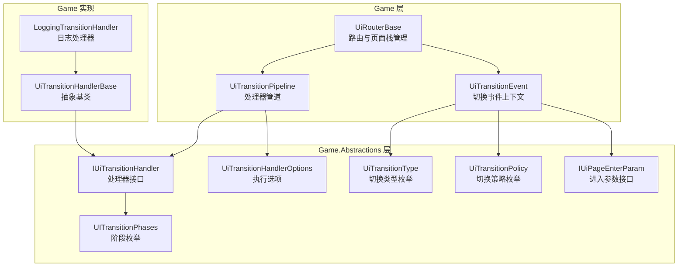
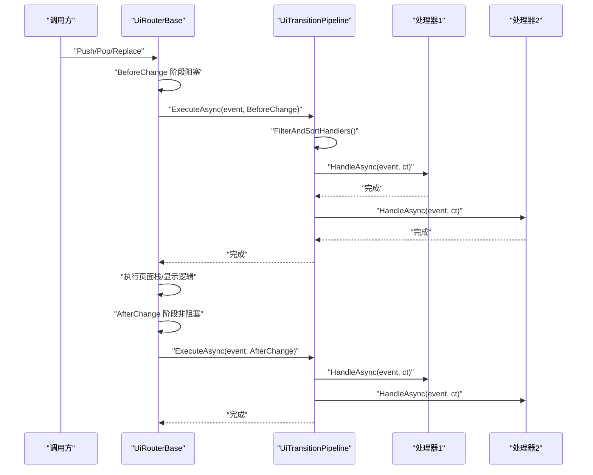
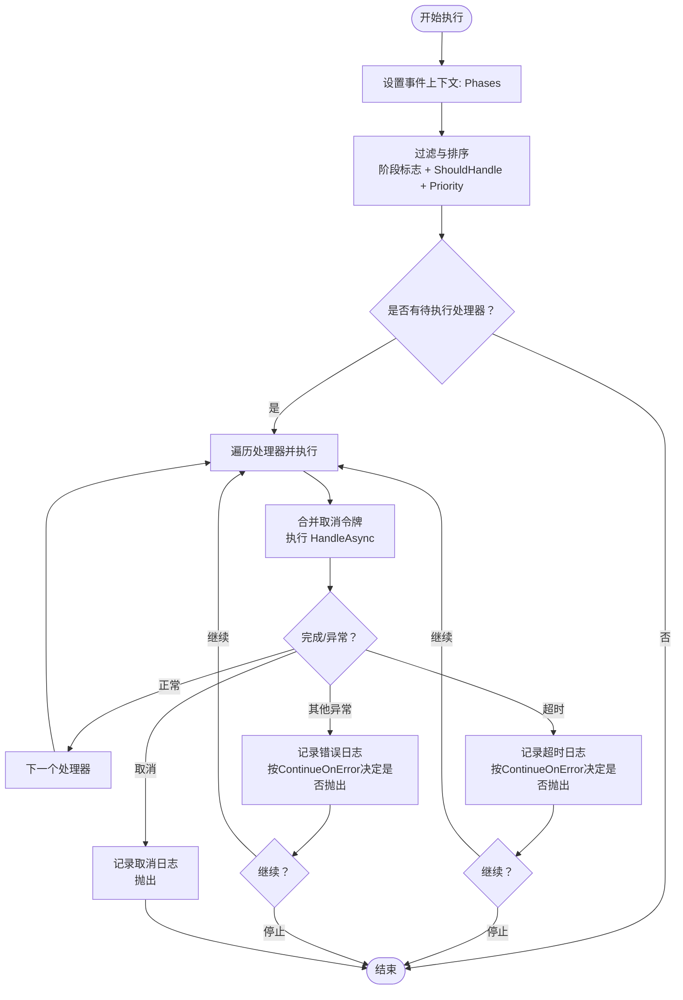
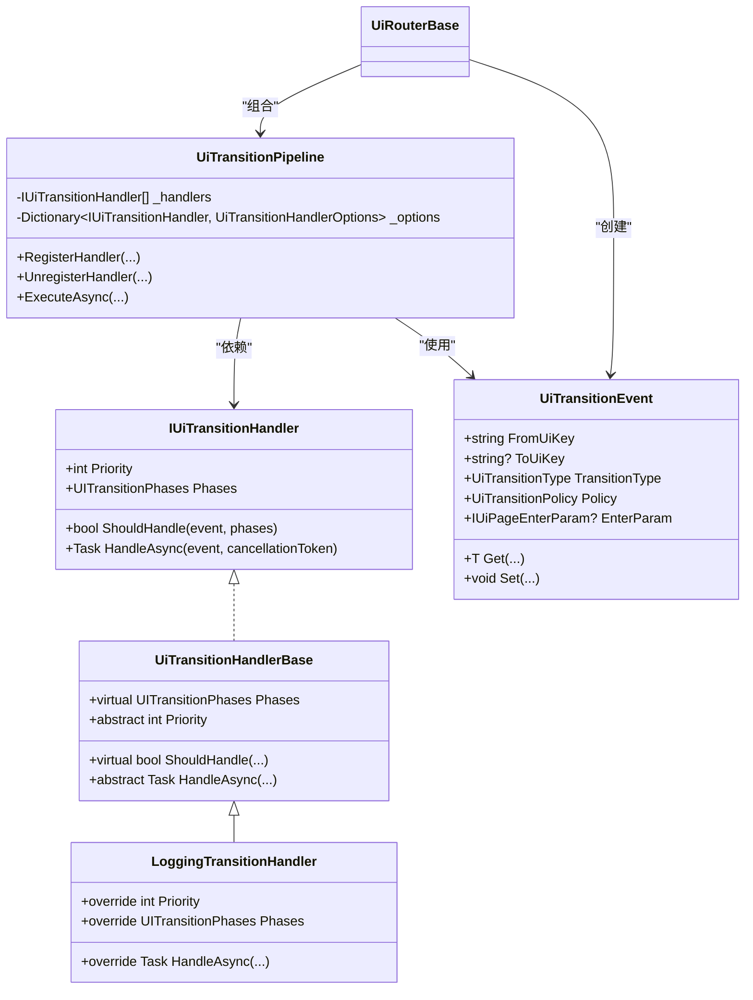

# UI过渡处理器

<cite>
**本文引用的文件**
- [UiTransitionHandlerBase.cs](file://GFramework.Game/ui/handler/UiTransitionHandlerBase.cs)
- [LoggingTransitionHandler.cs](file://GFramework.Game/ui/handler/LoggingTransitionHandler.cs)
- [IUiTransitionHandler.cs](file://GFramework.Game.Abstractions/ui/IUiTransitionHandler.cs)
- [UiTransitionPipeline.cs](file://GFramework.Game/ui/UiTransitionPipeline.cs)
- [UiTransitionHandlerOptions.cs](file://GFramework.Game.Abstractions/ui/UiTransitionHandlerOptions.cs)
- [UiTransitionEvent.cs](file://GFramework.Game.Abstractions/ui/UiTransitionEvent.cs)
- [UITransitionPhases.cs](file://GFramework.Game.Abstractions/enums/UITransitionPhases.cs)
- [UiTransitionType.cs](file://GFramework.Game.Abstractions/enums/UiTransitionType.cs)
- [UiTransitionPolicy.cs](file://GFramework.Game.Abstractions/enums/UiTransitionPolicy.cs)
- [IUiPageEnterParam.cs](file://GFramework.Game.Abstractions/ui/IUiPageEnterParam.cs)
- [UiRouterBase.cs](file://GFramework.Game/ui/UiRouterBase.cs)
- [ILogger.cs](file://GFramework.Core.Abstractions/logging/ILogger.cs)
</cite>

## 目录
1. [简介](#简介)
2. [项目结构](#项目结构)
3. [核心组件](#核心组件)
4. [架构总览](#架构总览)
5. [组件详解](#组件详解)
6. [依赖关系分析](#依赖关系分析)
7. [性能与并发特性](#性能与并发特性)
8. [故障排查指南](#故障排查指南)
9. [结论](#结论)
10. [附录：自定义处理器开发指南](#附录自定义处理器开发指南)

## 简介
本文件系统性地解析UI过渡处理器体系，覆盖基类设计模式、接口契约、执行管线、日志处理器、事件上下文与状态管理、错误与超时处理、以及组合使用与性能优化建议。目标读者既包括需要快速上手的开发者，也包括希望深入理解架构细节的高级工程师。

## 项目结构
UI过渡处理器位于游戏框架的“Game”层，围绕事件驱动的UI切换流程构建，通过处理器管道对不同阶段的UI切换进行扩展与定制。

图表来源
- [UiRouterBase.cs](file://GFramework.Game/ui/UiRouterBase.cs#L1-L200)
- [UiTransitionPipeline.cs](file://GFramework.Game/ui/UiTransitionPipeline.cs#L1-L168)
- [IUiTransitionHandler.cs](file://GFramework.Game.Abstractions/ui/IUiTransitionHandler.cs#L1-L39)
- [UiTransitionHandlerBase.cs](file://GFramework.Game/ui/handler/UiTransitionHandlerBase.cs#L1-L33)
- [LoggingTransitionHandler.cs](file://GFramework.Game/ui/handler/LoggingTransitionHandler.cs#L1-L48)
- [UiTransitionEvent.cs](file://GFramework.Game.Abstractions/ui/UiTransitionEvent.cs#L1-L105)
- [UITransitionPhases.cs](file://GFramework.Game.Abstractions/enums/UITransitionPhases.cs#L1-L27)
- [UiTransitionType.cs](file://GFramework.Game.Abstractions/enums/UiTransitionType.cs#L1-L27)
- [UiTransitionPolicy.cs](file://GFramework.Game.Abstractions/enums/UiTransitionPolicy.cs#L1-L18)
- [UiTransitionHandlerOptions.cs](file://GFramework.Game.Abstractions/ui/UiTransitionHandlerOptions.cs#L1-L6)
- [IUiPageEnterParam.cs](file://GFramework.Game.Abstractions/ui/IUiPageEnterParam.cs#L1-L7)

章节来源
- [UiRouterBase.cs](file://GFramework.Game/ui/UiRouterBase.cs#L1-L200)
- [UiTransitionPipeline.cs](file://GFramework.Game/ui/UiTransitionPipeline.cs#L1-L168)
- [IUiTransitionHandler.cs](file://GFramework.Game.Abstractions/ui/IUiTransitionHandler.cs#L1-L39)

## 核心组件
- IUiTransitionHandler：处理器接口，定义优先级、适用阶段、条件判断与异步处理方法。
- UiTransitionHandlerBase：抽象基类，提供默认实现（阶段默认All、ShouldHandle默认true、Priority需子类实现、HandleAsync需子类实现）。
- LoggingTransitionHandler：内置日志处理器，固定高优先级，记录切换阶段、类型、来源/目标UI与策略。
- UiTransitionPipeline：处理器管道，负责注册/注销、过滤排序、执行与异常/超时处理。
- UiTransitionEvent：切换事件上下文，承载From/To UI键、切换类型、策略、进入参数及通用上下文字典。
- 枚举与选项：UITransitionPhases、UiTransitionType、UiTransitionPolicy、UiTransitionHandlerOptions。

章节来源
- [IUiTransitionHandler.cs](file://GFramework.Game.Abstractions/ui/IUiTransitionHandler.cs#L1-L39)
- [UiTransitionHandlerBase.cs](file://GFramework.Game/ui/handler/UiTransitionHandlerBase.cs#L1-L33)
- [LoggingTransitionHandler.cs](file://GFramework.Game/ui/handler/LoggingTransitionHandler.cs#L1-L48)
- [UiTransitionPipeline.cs](file://GFramework.Game/ui/UiTransitionPipeline.cs#L1-L168)
- [UiTransitionEvent.cs](file://GFramework.Game.Abstractions/ui/UiTransitionEvent.cs#L1-L105)
- [UITransitionPhases.cs](file://GFramework.Game.Abstractions/enums/UITransitionPhases.cs#L1-L27)
- [UiTransitionType.cs](file://GFramework.Game.Abstractions/enums/UiTransitionType.cs#L1-L27)
- [UiTransitionPolicy.cs](file://GFramework.Game.Abstractions/enums/UiTransitionPolicy.cs#L1-L18)
- [UiTransitionHandlerOptions.cs](file://GFramework.Game.Abstractions/ui/UiTransitionHandlerOptions.cs#L1-L6)

## 架构总览
UI切换生命周期分为“切换前（阻塞）”和“切换后（非阻塞）”两个阶段。路由在执行具体页面操作前后分别触发对应阶段的处理器集合，确保前置校验、阻塞式准备（如预加载、确认对话）与后置统计、日志、音效等非阻塞任务解耦。

图表来源
- [UiRouterBase.cs](file://GFramework.Game/ui/UiRouterBase.cs#L336-L364)
- [UiTransitionPipeline.cs](file://GFramework.Game/ui/UiTransitionPipeline.cs#L63-L101)
- [IUiTransitionHandler.cs](file://GFramework.Game.Abstractions/ui/IUiTransitionHandler.cs#L10-L39)

## 组件详解

### 接口 IUiTransitionHandler
- 作用：定义UI切换扩展点的契约，允许第三方注入自定义处理逻辑。
- 关键成员
  - Priority：整数优先级，数值越小越先执行。
  - Phases：适用阶段（支持多阶段标志位），默认All。
  - ShouldHandle(event, phases)：条件过滤，决定是否对该事件/阶段执行。
  - HandleAsync(event, cancellationToken)：异步处理入口。
- 设计要点
  - 优先级与阶段共同决定执行顺序与范围。
  - ShouldHandle可用于按事件属性（如UI键、类型、策略）做分支处理。
  - HandleAsync应尽量短路、避免长时间阻塞；必要时使用取消令牌。

章节来源
- [IUiTransitionHandler.cs](file://GFramework.Game.Abstractions/ui/IUiTransitionHandler.cs#L1-L39)

### 抽象基类 UiTransitionHandlerBase
- 提供默认实现，降低子类样板代码
  - Phases 默认 All
  - ShouldHandle 默认 true
  - Priority 与 HandleAsync 交由子类实现
- 适用场景
  - 快速实现简单处理器
  - 作为模板，统一扩展点行为

章节来源
- [UiTransitionHandlerBase.cs](file://GFramework.Game/ui/handler/UiTransitionHandlerBase.cs#L1-L33)

### 内置处理器：LoggingTransitionHandler
- 功能：记录UI切换的详细信息，便于调试与审计
- 行为特征
  - 固定高优先级，确保日志在大多数业务处理器之后输出
  - 记录阶段、切换类型、来源UI、目标UI（可空）、策略
  - 使用统一日志门面接口输出Info级别日志
- 日志级别与格式
  - 级别：Info
  - 字段：阶段、类型、From、To、策略
- 典型用途
  - 开发期定位切换路径
  - 运行期统计与追踪

章节来源
- [LoggingTransitionHandler.cs](file://GFramework.Game/ui/handler/LoggingTransitionHandler.cs#L1-L48)
- [ILogger.cs](file://GFramework.Core.Abstractions/logging/ILogger.cs#L147-L173)

### 处理器管道：UiTransitionPipeline
- 职责
  - 注册/注销处理器
  - 过滤与排序：按阶段标志位过滤 + 条件过滤 + 优先级升序
  - 执行：逐个调用处理器的HandleAsync，并支持超时与错误继续策略
  - 异常与超时处理：区分取消（用户/超时）、错误，按配置决定是否继续
- 关键流程
  - FilterAndSortHandlers：筛选满足阶段与条件的处理器并按Priority排序
  - ExecuteSingleHandlerAsync：合并外部取消与超时取消，捕获异常并按ContinueOnError处理
- 性能与并发
  - 串行执行，保证顺序一致性
  - 支持超时与取消，避免阻塞主流程

图表来源
- [UiTransitionPipeline.cs](file://GFramework.Game/ui/UiTransitionPipeline.cs#L63-L168)

章节来源
- [UiTransitionPipeline.cs](file://GFramework.Game/ui/UiTransitionPipeline.cs#L1-L168)
- [UiTransitionHandlerOptions.cs](file://GFramework.Game.Abstractions/ui/UiTransitionHandlerOptions.cs#L1-L6)

### 事件上下文：UiTransitionEvent
- 上下文容器，承载切换所需信息与自定义数据
- 核心字段
  - FromUiKey、ToUiKey、TransitionType、Policy、EnterParam
  - 通用上下文字典：Set/Get/TryGet/Has/Remove
- 生命周期钩子
  - 在执行前由路由写入阶段信息（如Phases），供处理器读取
- 数据流
  - 路由创建事件 -> 管道写入阶段 -> 处理器读取/写入上下文 -> 后续处理器共享

章节来源
- [UiTransitionEvent.cs](file://GFramework.Game.Abstractions/ui/UiTransitionEvent.cs#L1-L105)
- [UiRouterBase.cs](file://GFramework.Game/ui/UiRouterBase.cs#L319-L334)

### 阶段、类型与策略
- 阶段（UITransitionPhases）
  - BeforeChange：阻塞式前置处理（如预加载、确认）
  - AfterChange：非阻塞后置处理（如日志、统计）
  - All：同时在两个阶段执行
- 类型（UiTransitionType）
  - Push、Pop、Replace、Clear
- 策略（UiTransitionPolicy）
  - Exclusive：独占显示（下层页面Pause+Hide）
  - Overlay：覆盖显示（下层页面仅Pause）

章节来源
- [UITransitionPhases.cs](file://GFramework.Game.Abstractions/enums/UITransitionPhases.cs#L1-L27)
- [UiTransitionType.cs](file://GFramework.Game.Abstractions/enums/UiTransitionType.cs#L1-L27)
- [UiTransitionPolicy.cs](file://GFramework.Game.Abstractions/enums/UiTransitionPolicy.cs#L1-L18)

### 路由集成：UiRouterBase
- 注册处理器：通过管道暴露注册/注销接口
- 触发时机
  - BeforeChange：阻塞执行，等待所有处理器完成或超时/取消
  - AfterChange：异步后台执行，异常被捕获并记录
- 事件构造：根据操作类型、策略与参数创建UiTransitionEvent

章节来源
- [UiRouterBase.cs](file://GFramework.Game/ui/UiRouterBase.cs#L49-L61)
- [UiRouterBase.cs](file://GFramework.Game/ui/UiRouterBase.cs#L336-L364)
- [UiRouterBase.cs](file://GFramework.Game/ui/UiRouterBase.cs#L319-L334)

## 依赖关系分析
- 管道依赖接口：IUiTransitionHandler（多态）、UiTransitionHandlerOptions（执行选项）
- 管道依赖事件：UiTransitionEvent（上下文）
- 管道依赖枚举：UITransitionPhases、UiTransitionType、UiTransitionPolicy
- 路由依赖：UiTransitionPipeline、UiTransitionEvent、IUiPageEnterParam
- 日志：处理器通过统一日志门面输出

图表来源
- [IUiTransitionHandler.cs](file://GFramework.Game.Abstractions/ui/IUiTransitionHandler.cs#L10-L39)
- [UiTransitionHandlerBase.cs](file://GFramework.Game/ui/handler/UiTransitionHandlerBase.cs#L9-L33)
- [LoggingTransitionHandler.cs](file://GFramework.Game/ui/handler/LoggingTransitionHandler.cs#L11-L48)
- [UiTransitionPipeline.cs](file://GFramework.Game/ui/UiTransitionPipeline.cs#L11-L168)
- [UiTransitionEvent.cs](file://GFramework.Game.Abstractions/ui/UiTransitionEvent.cs#L10-L105)
- [UiRouterBase.cs](file://GFramework.Game/ui/UiRouterBase.cs#L13-L70)

## 性能与并发特性
- 执行模型
  - BeforeChange：串行同步等待，适合阻塞式前置检查
  - AfterChange：后台异步执行，避免阻塞主线程
- 超时与取消
  - 单个处理器可配置超时；超时与取消均会触发日志并按ContinueOnError决定是否中断后续执行
- 并发安全
  - 管道内部使用线程安全集合与有序执行，避免竞态
- 性能优化建议
  - 将耗时任务拆分到AfterChange阶段
  - 为长耗时处理器设置合理TimeoutMs，防止阻塞
  - 优先级设置遵循“前置强校验 > 后置弱统计”的原则
  - 避免在处理器中进行重型UI操作，尽量异步化

章节来源
- [UiTransitionPipeline.cs](file://GFramework.Game/ui/UiTransitionPipeline.cs#L113-L168)
- [UiTransitionHandlerOptions.cs](file://GFramework.Game.Abstractions/ui/UiTransitionHandlerOptions.cs#L1-L6)

## 故障排查指南
- 症状：AfterChange阶段无响应
  - 检查处理器是否在BeforeChange阶段被阻塞
  - 确认AfterChange异步执行未被异常吞没（路由已捕获并记录）
- 症状：处理器未执行
  - 检查Phases是否包含目标阶段
  - 检查ShouldHandle返回值与事件上下文
- 症状：超时或取消
  - 查看日志中“Handler timeout/ cancelled”记录
  - 调整UiTransitionHandlerOptions.TimeoutMs与ContinueOnError
- 症状：日志缺失
  - 确认日志级别与日志提供者配置
  - LoggingTransitionHandler固定高优先级，若被覆盖请检查注册顺序

章节来源
- [UiTransitionPipeline.cs](file://GFramework.Game/ui/UiTransitionPipeline.cs#L142-L167)
- [UiRouterBase.cs](file://GFramework.Game/ui/UiRouterBase.cs#L349-L364)
- [ILogger.cs](file://GFramework.Core.Abstractions/logging/ILogger.cs#L147-L173)

## 结论
UI过渡处理器体系通过清晰的接口契约、可插拔的处理器与严谨的执行管线，实现了UI切换流程的模块化与可观测性。结合阶段划分、超时与取消机制，既能满足复杂前置校验需求，又能保证后置任务的非阻塞执行。建议在实际项目中遵循“前置强校验、后置弱统计”的优先级策略，并充分利用事件上下文在处理器间传递数据。

## 附录：自定义处理器开发指南

### 开发步骤
- 继承基类或实现接口
  - 若只需少量定制，推荐继承UiTransitionHandlerBase
  - 若需要完全控制行为，实现IUiTransitionHandler
- 实现抽象成员
  - Priority：数值越小优先级越高
  - Phases：选择适用阶段（可多选）
  - ShouldHandle：按事件上下文做条件判断
  - HandleAsync：实现异步处理逻辑，注意取消与超时
- 注册到路由
  - 通过UiRouterBase.RegisterHandler(handler, options)注册
  - options可设置超时与错误继续策略

### 优先级与中断机制
- 优先级
  - BeforeChange：建议将关键前置校验处理器设为较低数值（更高优先级）
  - AfterChange：统计、日志等低优先级处理器设为较高数值
- 中断与继续
  - 超时：默认ContinueOnError=true，可选择继续执行后续处理器
  - 错误：默认ContinueOnError=true，可选择继续执行后续处理器
  - 取消：用户主动取消或超时取消，均会停止当前处理器并按策略决定是否中断

### 异常处理最佳实践
- 在处理器内部捕获预期异常并记录
- 对不可恢复错误，考虑抛出以便中断管道（需谨慎）
- 使用UiTransitionHandlerOptions.ContinueOnError控制全局策略

### 处理器组合与场景示例
- 场景一：前置校验（阻塞）
  - 类型：BeforeChange
  - 示例：用户确认对话、资源预加载、网络请求
- 场景二：后置统计（非阻塞）
  - 类型：AfterChange
  - 示例：埋点上报、日志记录、音效播放
- 场景三：全阶段处理
  - 类型：All
  - 示例：通用鉴权、通用缓存清理

### 代码示例（路径指引）
- 自定义处理器基类实现
  - [UiTransitionHandlerBase.cs](file://GFramework.Game/ui/handler/UiTransitionHandlerBase.cs#L9-L33)
- 自定义处理器接口实现
  - [IUiTransitionHandler.cs](file://GFramework.Game.Abstractions/ui/IUiTransitionHandler.cs#L10-L39)
- 日志处理器实现
  - [LoggingTransitionHandler.cs](file://GFramework.Game/ui/handler/LoggingTransitionHandler.cs#L11-L48)
- 处理器管道与选项
  - [UiTransitionPipeline.cs](file://GFramework.Game/ui/UiTransitionPipeline.cs#L11-L168)
  - [UiTransitionHandlerOptions.cs](file://GFramework.Game.Abstractions/ui/UiTransitionHandlerOptions.cs#L1-L6)
- 事件上下文与路由集成
  - [UiTransitionEvent.cs](file://GFramework.Game.Abstractions/ui/UiTransitionEvent.cs#L10-L105)
  - [UiRouterBase.cs](file://GFramework.Game/ui/UiRouterBase.cs#L49-L61)
  - [UiRouterBase.cs](file://GFramework.Game/ui/UiRouterBase.cs#L336-L364)